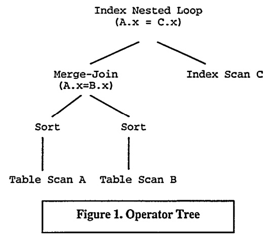
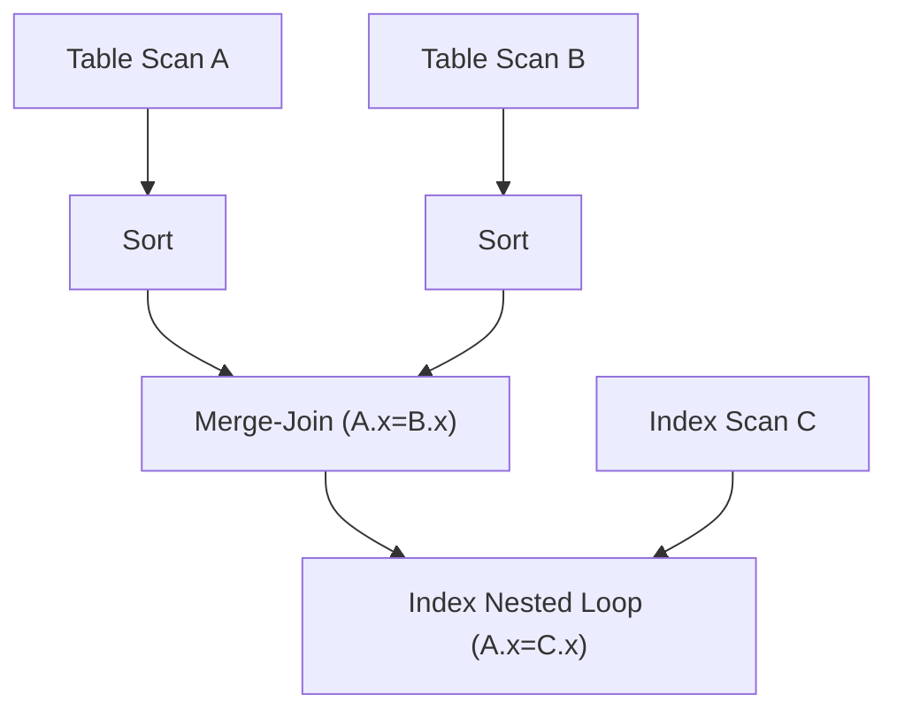
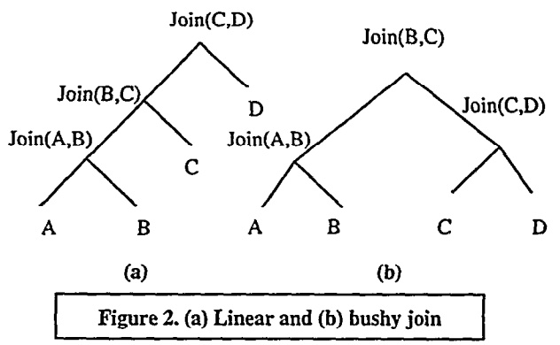
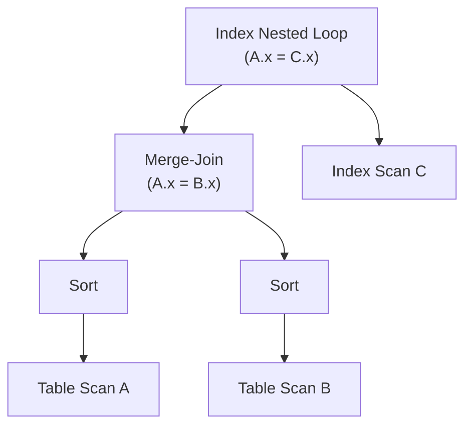
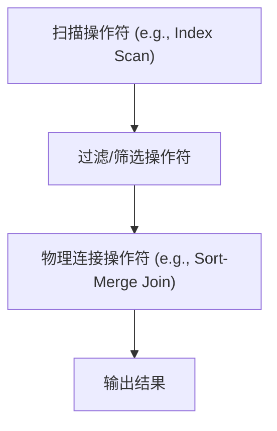

## AI论文解读 | An Overview of Query Optimization in Relational Systems
        
### 作者        
digoal        
        
### 日期        
2025-10-01       
        
### 标签        
PostgreSQL , PolarDB , DuckDB , AI , 论文解读        
        
----        
        
## 背景  
      
https://dl.acm.org/doi/pdf/10.1145/275487.275492        
  
提示:          
```          
读懂《An Overview of Query Optimization in Relational Systems》这篇论文需要提前掌握哪些基础知识, 请使用中文通熟易懂的讲解这些基础知识, 可以引用论文中的图、表或使用Markdown支持的图形(text,mermaid等)增加解释性. 
  
使用中文通熟易懂的解读《An Overview of Query Optimization in Relational Systems》这篇论文, 其中的关键内容请着重讲解, 可以引用论文中的图、表或使用Markdown支持的图形(text,mermaid等)增加解释性. 
  
提取《An Overview of Query Optimization in Relational Systems》这篇论文中的重要术语, 使用中文对这些术语进行通熟易懂的讲解, 可以引用论文中的图、表或使用Markdown支持的图形(text,mermaid等)增加解释性. 
```     
  
## 1 前置知识 
  
阅读《An Overview of Query Optimization in Relational Systems》这篇论文，您需要提前掌握以下几个核心基础知识。这篇论文主要围绕**关系数据库**和**SQL查询**展开，理解这些概念是读懂优化器工作原理的关键。

-----

## 1\. 关系数据库与SQL基础

这篇论文的讨论基础是**关系数据库（Relational Databases）和SQL（Structured Query Language）** 。

  * **关系模型（Relational Model）** ：了解数据如何以 **表（Relations）的形式组织，以及表之间的关系（Relationships）** 。
  * **SQL语言**：SQL是一种 **声明式（Declarative）** 语言 。这意味着用户只需要告诉系统“需要什么数据”（例如 `SELECT... FROM... WHERE...`），而不需要告诉系统“如何获取数据”。
  * **查询优化器的作用**：正是因为SQL是声明式的，数据库系统才需要一个 **查询优化器（Query Optimizer）** ，来负责将用户“声明式”的查询，转换为一个高效的“执行步骤” 。

-----

## 2\. 查询执行的基础概念

理解优化器的输出和执行过程，需要掌握以下概念：

### 2.1 物理操作符（Physical Operators）

它们是执行引擎的 **构建块（Building Blocks）** ，是实际执行数据的代码片段 。

| 物理操作符示例 (Examples) | 功能概述 (Function) |
| :--- | :--- |
| **Table Scan / Sequential Scan** | 顺序读取表中的所有数据  |
| **Index Scan** | 利用索引来高效查找和读取数据  |
| **Sort** | 对数据流进行排序（通常是外部排序）  |
| **Nested-Loop Join** | 嵌套循环连接。最简单、但效率可能最低的连接方式之一  |
| **Sort-Merge Join** | 排序-合并连接。对输入数据流排序后，再进行合并连接  |

### 2.2 物理操作符树（Physical Operator Tree）/ 执行计划（Execution Plan）

**执行计划（Execution Plan）** 就是由这些物理操作符组成的树状结构，代表了查询的实际执行步骤 。树中的边表示数据流的方向（从下往上） 。

**图 1**（论文中的示例）：   

这是一个执行计划的示例。它展示了数据库如何连接表 A、B 和 C，以满足 `A.x = B.x` 和 `A.x = C.x` 的条件：



**说明：**

  * 数据首先通过**Table Scan A**和**Table Scan B**获取。
  * 数据被**Sort**（排序）后，执行**Merge-Join**操作 。
  * **Merge-Join**的结果与**Index Scan C**（索引扫描 C 表）的结果，一起输入到最顶层的 **Index Nested Loop**（索引嵌套循环连接）中，最终得出结果 。

-----

## 3\. 查询优化的三大核心要素

查询优化器的工作，本质上是一个**搜索问题**，目标是从所有可能的执行计划中，找到成本最低的一个 。这需要三个关键要素的支持：

### 3.1 搜索空间（Search Space）

搜索空间是优化器需要考虑的所有**可能的执行计划的集合** 。计划数量庞大，主要源于以下两个方面：

1.  **代数等价变换（Algebraic Transformations）** ：根据关系代数的规则，一个查询可以有许多**逻辑上等价**的表示，例如连接（Join）的**结合律**和**交换律** 。

      * **线性连接（Linear Join） vs. 稠密连接（Bushy Join）** ：
          * 线性连接如 `(A ⋈ B) ⋈ C` ⋈ D，呈一条直线。
          * 稠密连接如 `(A ⋈ B) ⋈ (C ⋈ D)`，可以并行执行子连接，能带来更多优化可能性，但搜索成本更高 。

    **图 2**（论文中的示例）：    

    ```mermaid
    graph TD
        subgraph "(a) 线性连接 (Linear)"
            JABCD["Join(C,D)"]
            JABC["Join(B,C)"]
            JAB["Join(A,B)"]
            A[A]
            B[B]
            C[C]
            D[D]
            JAB --> JABC
            C --> JABC
            JABC --> JABCD
            D --> JABCD
            A --> JAB
            B --> JAB
        end
        subgraph "(b) 稠密连接 (Bushy)"
            JCD["Join(C,D)"]
            JBC["Join(B,C)"]
            JAB2["Join(A,B)"]
            A2[A]
            B2[B]
            C2[C]
            D2[D]
            JAB2 --> JBC
            JCD --> JBC
            C2 --> JCD
            D2 --> JCD
            A2 --> JAB2
            B2 --> JAB2
        end
    ```

2.  **物理操作符选择（Physical Operator Selection）** ：对于同一种代数操作（如连接），有多种**物理实现**，如 **Nested-Loop Join** 和 **Sort-Merge Join**，选择不同的实现会产生不同的计划 。

### 3.2 成本估算（Cost Estimation）

优化器必须能够估算任何给定计划的执行成本（通常是 **I/O 成本**和 **CPU 成本**） 。这依赖于：

  * **统计信息（Statistics）** ：数据库维护关于表和索引的统计数据，例如表中的元组数、页数、列中的 **不同值数量（Number of Distinct Values）** 等 。
  * **选择性估算（Selectivity Estimation）** ：估算谓词（`WHERE` 子句中的条件）能筛选掉多少数据。例如，`WHERE age < 30` 能留下多少行 。

### 3.3 枚举算法（Enumeration Algorithm）

这是在搜索空间中寻找最优计划的算法。

  * **动态规划（Dynamic Programming）** ：System-R 优化器（现代优化器的奠基者）使用的核心技术 。它基于 **最优性原理（Principle of Optimality）** ：一个最优的完整计划，其子表达式的计划也必须是最优的 。这大大减少了需要枚举的计划数量（从 $O(n!)$ 降至 $O(n2^{n-1})$ 左右） 。
  * **有趣顺序（Interesting Orders）/ 物理属性（Physical Properties）** ：这是一个对动态规划的修正 。
      * 有时，一个子计划即使本身成本较高（例如，选择了成本较高的 **Sort-Merge Join**），但因为它产生了**有序（Sorted）的中间结果 ，这使得后续的操作（例如与另一个表进行 Sort-Merge Join）的成本大幅降低** 。
      * 因此，优化器不能仅仅比较成本，还必须考虑计划输出流的 **物理属性（Physical Property）** （例如数据顺序） 。
      * **结论：** 比较两个子计划时，不仅要看它们的成本，还要看它们是否具有相同的“有趣顺序”，才能进行比较和剪枝 。
  
## 2 解读论文 
  
好的，我们来一起深入解读这篇关于关系型数据库查询优化的经典论文——《An Overview of Query Optimization in Relational Systems》。

这篇论文系统性地介绍了关系型数据库中SQL查询优化的核心思想、经典架构和关键技术。作者旨在用相对易懂的方式，阐述这个领域的基石和重要进展 。

### 核心思想：查询优化是什么？为什么重要？

想象一下，你告诉GPS你要从A点到B点。你是用“声明式”的方式告诉它 **“你要什么”** （到达B点），而不是用“过程式”的方式指挥它 **“怎么做”** （先走哪条路，再在哪个路口转弯）。

SQL语言也是如此，它是一种**声明式语言** 。用户只描述需要什么数据，而不关心数据库如何获取这些数据。**查询优化器（Query Optimizer）** 的角色，就是数据库的智能“GPS导航系统” 。它接收用户输入的SQL语句，然后负责生成一个最高效的**执行计划（Execution Plan）** 。

这个执行计划，就像GPS规划出的最佳路线，它由一系列被称为**物理操作符（Physical Operators）** 的基本步骤组成，例如全表扫描（Table Scan）、索引扫描（Index Scan）、排序（Sort）、嵌套循环连接（Nested-Loop Join）等 。这些操作符组合成一个树状结构，称为 **操作符树（Operator Tree）** ，也就是我们说的执行计划 。

下图就是论文中一个典型的执行计划示例 ：



  * **解读**：这个计划首先分别对A表和B表进行全表扫描（Table Scan），然后对扫描结果进行排序（Sort），再通过归并连接（Merge-Join）将它们合并 。之后，将连接的结果与通过索引扫描（Index Scan）C表得到的数据进行索引嵌套循环连接（Index Nested Loop），最终得到查询结果 。

对于同一条SQL，可能有成千上万种等价的执行计划，而它们的执行效率可能相差成百上千倍 。因此，选择一个好的执行计划至关重要 。

### 查询优化的三大支柱

论文指出，一个查询优化器的工作可以被看作是一个复杂的搜索问题，它需要解决三个核心问题 ：

1.  **搜索空间 (Search Space)**：定义所有可能的、合法的执行计划 。这涉及到各种代数变换规则，例如改变表的连接顺序。
2.  **成本估算 (Cost Estimation)**：为搜索空间中的每一个执行计划预估一个执行成本（通常是CPU和I/O的综合）。
3.  **枚举算法 (Enumeration Algorithm)**：设计一种高效的算法，用于在巨大的搜索空间中，依据成本估算，找出成本最低的那个计划 。

-----

### 关键内容 1：经典范例 - System R 优化器

System R是查询优化领域的里程碑项目，它奠定的框架至今仍在许多商业数据库中使用 。

#### 1\. 搜索空间：只考虑“左深树”

System R为了简化问题，其搜索空间被限制为**线性连接顺序**，也就是我们常说的“左深连接树”（Left-Deep Join Tree）。如下图(a)所示，每次只将一个新的表与之前所有表连接的结果进行连接 。它不考虑像图(b)那样的“ bushy tree”（浓密树）结构，因为后者的搜索空间要大得多 。

| 左深树 (Linear Join) | 浓密树 (Bushy Join) |
| :--- | :--- |
|  |  |
| Join(Join(Join(A,B),C),D)  | Join(Join(A,B), Join(C,D))  |

#### 2\. 枚举算法：动态规划 (Dynamic Programming)

System R的枚举算法是其成功的关键。它没有暴力枚举所有 `n!` 种连接顺序，而是采用了**动态规划**的思想 。

其核心是**最优子结构**假设：一个 `k` 个表连接的最优计划，必然是通过将一个新表与一个 `k-1` 个表连接的最优计划相连接而得到的 。

  * **过程**：
    1.  **第一步**：找到访问每个单表的最优计划。
    2.  **第二步**：基于第一步的结果，找到所有两个表连接的最优计划（如 `{A,B}`, `{A,C}`, `{B,C}`...）。
    3.  **第三步**：基于第二步的结果，找到所有三个表连接的最优计划。
    4.  **以此类推**，直到找到所有 `n` 个表连接的最优计划。

在每一步中，对于同一个表的集合（例如 `{A,B,C}`），只保留成本最低的那个计划，用于后续的计算。这大大减少了需要考虑的计划数量 。

#### 3\. 成本估算与“有趣顺序” (Interesting Orders)

System R的成本模型依赖于数据库中存储的**统计信息**，例如表的行数、数据页数、列的唯一值数量等 。

一个非常重要的创新是 **“有趣顺序”** 的概念 。动态规划有一个潜在问题：如果一个子计划A的成本比子计划B高，我们就会丢弃A。但如果计划A的输出结果是 **有序的** ，而这个顺序恰好能被后续的操作（如Merge-Join或GROUP BY）利用，从而大幅降低后续成本，那么最终包含A的全局计划可能反而优于包含B的全局计划 。

  * **例子**：`Join(R1, R2)` 使用 Sort-Merge 算法，成本是 `y`。使用 Nested-Loop 算法，成本是 `x`，且 `x < y`。按常规我们会丢弃 Sort-Merge 计划。但是，Sort-Merge 的结果在连接键上是有序的 。如果下一步是 `Join({R1, R2}, R3)`，并且R3也按此键排序，那么这个连接成本会极低。

为了解决这个问题，System R 在剪枝时，不仅比较计划的成本，还会保留那些具有“有趣顺序”（即可能对后续操作有用的排序顺序）的、即使成本稍高的计划 。这个思想后来被泛化为**物理属性（Physical Properties）** ，成为现代优化器的核心概念之一。

-----

### 关键内容 2：扩展搜索空间的核心技术

随着数据库应用变得复杂，仅仅改变Join的顺序是不够的。论文介绍了几类重要的代数变换，用于生成更多、更好的候选计划。

#### 1\. Group-By 与 Join 的交换

一个非常有效的优化是 **提早进行聚合（Group-By）** 。聚合操作能显著减少数据量 。如果能在Join之前进行聚合，就可以大大降低昂贵的Join操作的成本 。

如下图所示，原始计划(a)是先Join再Group-By。在特定条件下（例如，聚合的列都来自`R1`，且Join是外键关联），可以将其转换为计划(b)或(c)，即先对`R1`做一次预聚合`G1`，减少数据量，再去和`R2`做Join 。

#### 2\. 嵌套子查询的“解嵌套” (Unnesting)

SQL中常见的嵌套子查询（特别是相关的子查询）对性能是巨大的挑战。例如下面这个查询 ：

```sql
SELECT Emp.Name
FROM Emp
WHERE Emp.Dept# IN
    (SELECT Dept.Dept# FROM Dept
     WHERE Dept.Loc='Denver' AND Emp.Emp# = Dept.Mgr)
```

如果按照字面意思执行，数据库需要为 `Emp` 表的每一行都去执行一次内部的子查询，效率极低 。

“解嵌套”技术可以将这种查询“扁平化”，转换成一个等价的、更高效的Join查询 ，如下所示：

```sql
SELECT E.Name
FROM Emp E, Dept D
WHERE E.Dept# = D.Dept#
  AND D.Loc = 'Denver'
  AND E.Emp# = D.Mgr
```

这个转换后的查询，优化器就可以使用前面提到的Join重排序等技术进行优化了 。论文中还提到，当子查询中包含聚合函数（如COUNT, AVG）时，解嵌套会变得更复杂，通常需要借助`OUTER JOIN`和`GROUP BY`来保证语义的正确性 。

-----

### 关键内容 3：成本估算的核心 - 统计信息与直方图

成本估算的准确性直接决定了优化结果的好坏 。这个过程的核心是**统计信息**。

#### 直方图 (Histograms)

对于一个列的数据分布，最常用的统计信息就是**直方图** 。直方图将列中的所有值分成若干个“桶”（buckets），并记录每个桶中的数据信息 。

  * **例如，等深直方图 (Equi-depth Histogram)**：
    假设`age`列有1000个值，我们创建4个桶。等深直方图会调整每个桶的边界，使得每个桶包含相同数量的值（这里是250个）。
      * 桶1: age 范围 [18-25], 包含 250 个值
      * 桶2: age 范围 [26-35], 包含 250 个值
      * 桶3: age 范围 [36-50], 包含 250 个值
      * 桶4: age 范围 [51-65], 包含 250 个值

有了直方图，优化器在估算一个谓词（如 `WHERE age > 45`）的**选择率（Selectivity）** 时就会准确得多。它不再是盲目猜测，而是可以根据 `age > 45` 覆盖了桶3的一部分和整个桶4，来估算出大概会返回多少行数据。

**局限性**：直方图的主要问题是难以处理**多列数据之间的相关性** 。例如，汽车的`品牌='本田'`和`型号='思域'`是强相关的，但如果优化器假设它们独立，并简单地将各自的选择率相乘，就会得出错误的估算结果 。

### 总结

这篇论文系统地勾勒出了关系型数据库查询优化的全景图。它告诉我们，优化远不止是几个简单的转换规则 。它是一个由**搜索空间、成本估算、枚举算法**三大支柱构成的复杂工程体系。

  * 从 **System R** 的动态规划和“有趣顺序”等奠基性思想，到后来通过**Join-GroupBy交换**、**子查询解嵌套**等技术不断扩展的搜索空间。
  * 再到依赖**直方图**等统计信息进行精细化的成本估算。

这些技术共同构成了一个强大的决策引擎，使得用户可以用简单的SQL与海量数据进行高效交互。尽管已经发展了几十年，但正如文末所言，查询优化领域仍然有许多开放性问题亟待解决 。
  
## 3 术语 
  
《An Overview of Query Optimization in Relational Systems》这篇论文主要讨论了关系数据库中 **SQL 查询优化**的原理和技术。理解这篇论文，关键在于掌握优化器如何将用户的一个声明（SQL）转化为一个高效的执行步骤。

以下是论文中涉及的重要术语及其通俗易懂的中文讲解：

-----

## 1\. 基础概念与目标

### 1.1 声明式查询语言 (Declarative Query Language)

  * **术语：** Declarative Query Language (e.g., SQL)
  * **中文讲解：** SQL（结构化查询语言）是**声明式**的。这意味着用户（程序员）只需要告诉数据库 **“想要什么数据”（What）** ，而不需要告诉系统 **“如何获取数据”（How）** 。
  * **优化器的必要性：** 正是因为用户没有指定“如何获取”，数据库系统才需要 **查询优化器** 来替用户找到最高效的执行方法。

### 1.2 查询优化器 (Query Optimizer)

  * **术语：** Query Optimizer
  * **中文讲解：** 它是数据库系统的“**大脑**”或“**参谋长**”。它的任务是接收一个 SQL 查询，并从中找出成本（时间、资源消耗）最低的**执行计划**。一个好的优化器是数据库性能的关键。

### 1.3 物理操作符 (Physical Operator)

  * **术语：** Physical Operator
  * **中文讲解：** 它们是数据库执行引擎的**基本积木块**。每个操作符都是一段能执行特定数据处理任务的代码。执行计划就是由这些操作符连接起来的树状结构。
  * **示例：**
      * **Table Scan (全表扫描)：** 顺序读取整个表。
      * **Index Scan (索引扫描)：** 利用索引高效查找特定数据。
      * **Nested-Loop Join (嵌套循环连接)：** 简单的连接方式，像两层循环一样。
      * **Sort-Merge Join (排序合并连接)：** 先对两个输入流排序，再合并连接，通常对大量数据更高效。

### 1.4 执行计划 (Execution Plan) / 存取路径 (Access Path)

  * **术语：** Execution Plan / Access Path
  * **中文讲解：** 查询优化器的最终产物。它是一个**物理操作符树**，详细规定了数据应该以何种顺序、通过何种具体方法（如使用哪个索引、用何种连接方式）来获取和处理。
  * **图示说明：** 下图展示了执行计划的结构——数据从底层的操作符向上流经顶层操作符，最终得出结果。




-----

## 2\. 优化的三大支柱

查询优化是一个**在巨大搜索空间中寻找最低成本路径**的过程，它依赖于以下三个核心要素：

### 2.1 搜索空间 (Search Space)

  * **术语：** Search Space
  * **中文讲解：** 一个查询所有**逻辑等价**且**物理可行**的执行计划的集合。优化器就是在其中进行搜索。计划数量之所以多，主要因为：
    1.  **关系代数等价性 (Relational Algebra Equivalence)：** 关系操作（如 Join）满足**结合律**和**交换律**，这意味着改变连接的顺序不改变最终结果，但会极大地改变性能。
    2.  **物理操作符选择：** 同样的逻辑操作可以有不同的物理实现。
  * **关键概念：连接顺序 (Join Order)**
      * **线性连接 (Linear Join)：** 按照 A⋈B 后再⋈C 的方式逐个连接，形如一条线。
      * **稠密连接 (Bushy Join)：** 像 `(A⋈B) ⋈ (C⋈D)`，子连接可以并行执行。

### 2.2 成本估算 (Cost Estimation)

  * **术语：** Cost Model / Cost Estimation

  * **中文讲解：** 优化器的核心判断依据。它使用一个数学模型来预测执行计划需要消耗多少**资源**，通常以 **I/O 成本**（磁盘读写次数）和 **CPU 成本**（计算量）来衡量。

  * **关键依赖项：统计信息 (Statistics) 与 选择性估算 (Selectivity Estimation)**

      * **统计信息：** 数据库预先收集的关于表和列的数据，例如：表中有多少行（Tuple Count）、某个列中有多少个不同值（Number of Distinct Values）、数据的分布情况（直方图 Histograms）等。
      * **选择性估算：** 预测一个筛选条件（如 `WHERE age < 30`）能够保留下多少比例的数据行。准确的估算能帮助优化器判断哪个操作符应该先执行（例如，先执行过滤性强的条件，能更快地减少数据量）。

### 2.3 枚举算法 (Enumeration Algorithm)

  * **术语：** Enumeration Algorithm (Dynamic Programming)

  * **中文讲解：** 优化器用来搜索和比较不同执行计划的方法。由于搜索空间巨大，优化器不能尝试所有可能性，因此它通常使用高效的算法，如 **动态规划（Dynamic Programming, DP）** 。

  * **关键概念：最优性原理 (Principle of Optimality) 与 有趣顺序 (Interesting Orders)**

      * **最优性原理：** 如果一个完整的执行计划是“最优的”，那么它的任何一个子表达式（子计划）也必须是“最优的”。这允许优化器通过重复使用最优的子结果来快速构建最优的完整计划。
      * **有趣顺序 / 物理属性 (Physical Properties)：** 在比较两个子计划时，不能只看它们的成本。如果一个成本较高的子计划，其输出是**有序**的，而这个**有序的属性**能使得后续的连接操作成本**大幅下降**，那么这个子计划就是“更有趣”的。优化器必须保留这类具有特殊“物理属性”（如排序）的子计划作为候选。

**总结：** 优化器的任务就是运用 **动态规划** 算法，结合 **统计信息** 进行 **成本估算**，在巨大的 **搜索空间** 中，找到那个 **成本最低的 执行计划**。
  
## 参考        
         
https://dl.acm.org/doi/pdf/10.1145/275487.275492    
        
<b> 以上内容基于DeepSeek、Qwen、Gemini及诸多AI生成, 轻微人工调整, 感谢杭州深度求索人工智能、阿里云、Google等公司. </b>        
        
<b> AI 生成的内容请自行辨别正确性, 当然也多了些许踩坑的乐趣, 毕竟冒险是每个男人的天性.  </b>        
      
#### [期望 PostgreSQL|开源PolarDB 增加什么功能?](https://github.com/digoal/blog/issues/76 "269ac3d1c492e938c0191101c7238216")
  
  
#### [PolarDB 开源数据库](https://openpolardb.com/home "57258f76c37864c6e6d23383d05714ea")
  
  
#### [PolarDB 学习图谱](https://www.aliyun.com/database/openpolardb/activity "8642f60e04ed0c814bf9cb9677976bd4")
  
  
#### [PostgreSQL 解决方案集合](../201706/20170601_02.md "40cff096e9ed7122c512b35d8561d9c8")
  
  
#### [德哥 / digoal's Github - 公益是一辈子的事.](https://github.com/digoal/blog/blob/master/README.md "22709685feb7cab07d30f30387f0a9ae")
  
  
#### [About 德哥](https://github.com/digoal/blog/blob/master/me/readme.md "a37735981e7704886ffd590565582dd0")
  
  

  
