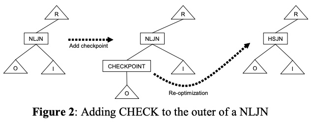
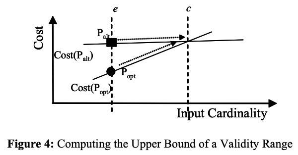
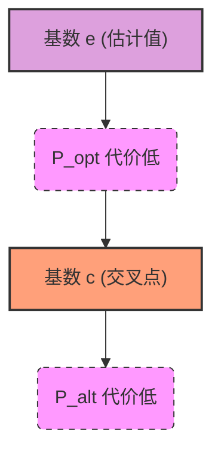
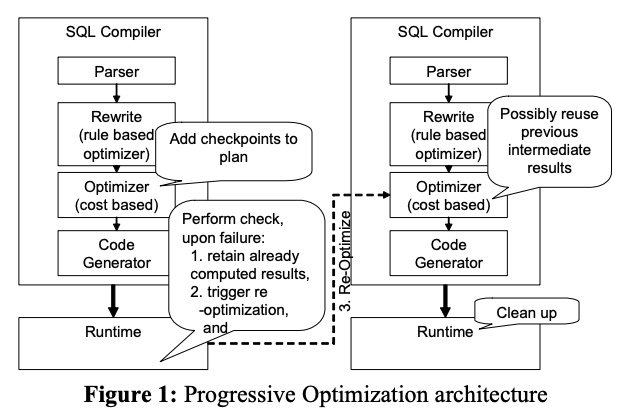
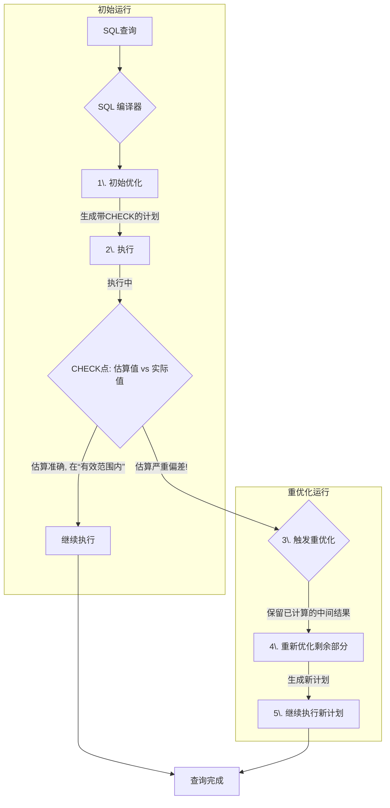
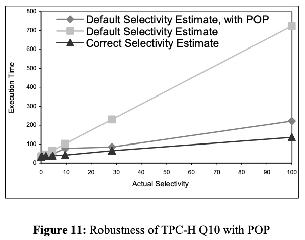

## AI论文解读 | Robust Query Processing through Progressive Optimization
        
### 作者        
digoal        
        
### 日期        
2025-10-01       
        
### 标签        
PostgreSQL , PolarDB , DuckDB , AI , 论文解读        
        
----        
        
## 背景  
      
https://dsf.berkeley.edu/cs286/papers/robust-sigmod2004.pdf        
  
提示:          
```          
读懂《Robust Query Processing through Progressive Optimization》这篇论文需要提前掌握哪些基础知识, 请使用中文通熟易懂的讲解这些基础知识, 可以引用论文中的图、表或使用Markdown支持的图形(text,mermaid等)增加解释性. 
  
使用中文通熟易懂的解读《Robust Query Processing through Progressive Optimization》这篇论文, 其中的关键内容请着重讲解, 可以引用论文中的图、表或使用Markdown支持的图形(text,mermaid等)增加解释性. 
  
提取《Robust Query Processing through Progressive Optimization》这篇论文中的重要术语, 使用中文对这些术语进行通熟易懂的讲解, 可以引用论文中的图、表或使用Markdown支持的图形(text,mermaid等)增加解释性. 
```     
  
## 1 前置知识 
  
阅读《Robust Query Processing through Progressive Optimization》这篇论文，您需要提前掌握以下几个方面的**数据库系统基础知识**。这篇论文的核心在于解决**查询优化**中的一个经典且严重的问题：**基数估计错误**。

-----

## 核心基础知识一：传统查询优化器 (Traditional Query Optimizer)

要理解 POP (Progressive Optimization)，首先必须了解现代数据库管理系统（DBMS）是如何执行 SQL 查询的。

### 1\. 查询执行计划（QEP）

  * **概念：** QEP (Query Execution Plan)，或简称“执行计划”，是数据库为执行一条 SQL 语句而生成的**操作步骤序列**。它通常表示为一个**树状结构**，底层是表扫描，上层是各种关系代数操作符（如连接、选择、投影、排序等）。
  * **关系操作符：** 您需要了解主要的物理操作符，尤其是各种 **Join (连接)** 算法，例如：
      * **Nested-Loop Join (NLJN, 嵌套循环连接)**：通常适用于输入表较小或其中一个表上有索引的情况。
      * **Hash Join (HSJN, 哈希连接)**：通常适用于两个大表之间的连接。
      * **Merge Join (MGJN, 归并连接)**：通常适用于输入已经排序的情况。

### 2\. 基于代价的优化（Cost-Based Optimization）

  * **优化目标：** 优化器的目标是从众多可行的 QEP 中，选择一个**估计执行代价最低**的计划 。
  * **代价模型：** 优化器使用复杂的数学模型来估算每个 QEP 的执行代价，这主要取决于计划中每个操作符将处理的**行数**（即基数）。

### 3\. 基数估计错误是“灾难”的根源

  * **基数估计 (Cardinality Estimation)：** 优化器通过读取数据库的统计信息（如表的总行数、列的直方图等）来预测执行计划中每个中间结果集的行数（基数）。
  * **错误来源：** 估计错误是不可避免的，常见原因包括：统计信息过时、对谓词独立性的错误假设（如认为 $A=5$ 和 $B=10$ 这两个条件是独立的）、使用了参数标记等 。
  * **后果：** 错误的基数估计会导致优化器严重低估或高估某个 QEP 的代价，从而选择了在实际执行中**非常慢的次优（Sub-optimal）计划**，造成性能“灾难”。

-----

## 核心基础知识二：渐进式优化（POP）的关键机制

POP 论文提出的方案就是解决上述基数估计错误导致次优计划的问题，其核心思想是：**在查询执行过程中实时监测估计的准确性，并随时准备“急刹车”进行重新优化。**

### 1\. 中途重优化（Mid-Query Re-optimization）

  * **机制：** POP 在查询执行过程中，将实际观测到的基数值与优化器的估计值进行比较 。如果两者之间存在显著差异，执行就会暂停，并触发 **重优化（Re-optimization）** 步骤 。
  * **鲁棒性：** 这种机制为查询处理增加了一种“保险政策”，避免了将次优计划执行到底 。

### 2\. 检查点操作符（CHECK Operator）

  * **作用：** $\text{CHECK}$ 是 $\text{POP}$ 的控制点，它是一个**没有关系语义**的特殊操作符，被插入到 QEP 的关键位置 。
  * **功能：** 它的任务是在运行时验证流经它的行数（实际基数）是否在其预设的 **检查范围（Check Range）** 内 。
  * **触发条件：**
      * 如果实际基数 $a$ 在检查范围 $[l, u]$ 内（ 即 $a \in [l, u]$ ），则 $\text{CHECK}$ 成功，查询继续执行 。
      * 如果实际基数 $a$ 违反了检查范围，则 $\text{CHECK}$ 失败，**立即终止执行并触发重优化** 。

您可以参考论文中的 **图 2**（概念图）来理解 $\text{CHECK}$ 的作用，它通常被放置在对基数敏感的操作符（如 $\text{NLJN}$ 的外部输入）之上： 

  

**上图说明：** $\text{POP}$ 在 $\text{NLJN}$ 的外部子计划 $(\text{O})$ 上方添加了一个 $\text{CHECK}$ 操作符。如果 $\text{O}$ 实际输出的行数远大于估计值，导致 $\text{NLJN}$ 变得低效， $\text{CHECK}$ 就会触发重优化，新计划可能会将 $\text{NLJN}$ 替换为更高效的 $\text{Hash Join}$ ( $\text{HSJN}$ ) 。

### 3\. 有效范围的计算（Validity Range Computation）

这是 $\text{POP}$ 最具创新性的技术之一。优化器通过**计划敏感性分析**（Plan Sensitivity Analysis）来计算 $\text{CHECK}$ 的**有效范围** 。

  * **概念：** **有效范围** $[l, u]$ 是指一个输入基数的上下限。在这个范围内，**当前被选中的 QEP $P_{opt}$ 仍然是最佳的**（至少相对于优化器在搜索空间中考虑过的备选方案 $P_{alt}$ 而言）。
  * **计算原理（基于论文图 4）：** 在优化器比较两个结构相似的计划 $P_{opt}$（当前最优）和 $P_{alt}$（被剪枝的备选）时，它会找出输入基数 $c$ 发生变化时，它们的**代价函数** $Cost(P, c)$ 的**交叉点** 。这个交叉点就是有效范围的边界。

  



**上图抽象说明：** 在基数**估计值** $e$ 处，最优计划 $P_{opt}$ 的代价低于备选计划 $P_{alt}$。但随着实际**输入基数** $c$ 增加到某个**交叉点**时， $P_{alt}$ 的代价反而低于 $P_{opt}$。这个交叉点 $c$ 就确定了 $P_{opt}$ 有效范围的上限 。

### 4\. 重用中间结果（Exploiting Intermediate Results）

  * **目的：** 如果 $\text{CHECK}$ 失败并触发重优化，为了避免重复计算已经完成的工作， $\text{POP}$ 会将暂停时已计算出的中间结果集，提升为**临时物化视图（Temporary Materialized View, MV）** 。
  * **重用：** 在新的重优化阶段，优化器会考虑访问这个**临时 MV** 作为新的执行计划的起点，从而复用已完成的工作，节省了大量的执行时间 。

-----

## 总结：您需要掌握的关键概念

| 领域 | 概念 | 作用 |
| :--- | :--- | :--- |
| **基础** | **查询执行计划 (QEP)** | 数据库执行 SQL 的操作树状结构。 |
| **优化器** | **基于代价的优化** | 依据估算代价选择最佳计划。 |
| **核心问题** | **基数估计错误** | 统计不准确等导致计划代价估算错误，产生次优计划。 |
| **POP 机制** | **$\text{CHECK}$ 操作符** | 运行时监测实际基数是否在有效范围内。 |
| **POP 机制** | **有效范围（Validity Range）** | 保证当前计划仍为最优的基数上下限。 |
| **重优化** | **重用中间结果** | 将已计算的部分结果作为临时物化视图，避免重复计算 。 |
  
## 2 解读论文 
  
好的，我们来通俗易懂地解读这篇经典的数据库领域论文——《通过渐进式优化实现鲁棒的查询处理》（Robust Query Processing through Progressive Optimization）。

### 论文一句话总结

这篇论文提出了一种名为**渐进式查询优化（Progressive Query Optimization, POP）** 的技术。它就像是为数据库查询计划（Query Execution Plan, QEP）买的一份“保险”。在查询执行过程中，它会安插一些“检查点（CHECK）”，实时监控关键指标（主要是基数估算）是否准确。一旦发现估算错得离谱，导致当前的执行计划可能不是最优选择时，它会立刻“叫停”，并利用已知的真实信息重新进行优化，从而避免查询因错误的计划而陷入漫长的等待，极大地增强了查询处理的鲁棒性。

-----

### 核心内容深度解读

#### 1\. 问题根源：不靠谱的“导航系统”

想象一下，数据库的**查询优化器（Query Optimizer）** 就像一个GPS导航系统。在你出发前，它会根据地图数据（数据库统计信息）和一些假设（比如各个路口的拥堵情况是独立的）为你规划一条“最快”的路线，这就是 **查询执行计划（QEP）** 。

这个导航系统最依赖的一个关键数据是 **基数估算（Cardinality Estimation）** ，即预测查询的每一步会产生多少行数据 。这就像GPS预测每条路段有多少辆车。

**问题出在哪里？**

  * **统计信息过时**：地图数据没更新，新修的路、突然的封路都不知道 。
  * **错误的假设**：优化器常常假设多个查询条件是相互独立的，但现实中它们可能高度相关（例如，“品牌是保时捷”和“车型是911”）。这就像GPS以为周一早高峰和下雨是两个独立事件，但实际上它们凑在一起会造成超级大堵车 。
  * **参数化查询**：查询中包含未知参数，优化器只能猜一个默认值来生成计划 。

一旦基数估算严重失误，优化器选出的“最优”计划可能实际上是一条“最差”的路径，导致查询性能急剧下降，甚至慢上几个数量级 。

#### 2\. 解决方案：引入“实时路况”的动态重规划——POP

传统的做法是“一次优化，终身执行”，路线规划好了就闷头开到底。而POP的思路是**边走边看，随时调整**。

它的核心工作流程可以用下图（改编自论文Figure 1）来表示：   



这个流程的关键在于：

  * **安插检查点（CHECK）** ：在生成查询计划时，在一些关键节点（如下文提到的嵌套循环连接的外部输入）插入`CHECK`算子 。
  * **实时验证**：当数据流过`CHECK`算子时，它会统计实际的行数，并与优化器当初的估算值进行比较 。
  * **触发重优化**：如果实际行数超出了一个预设的“ **有效范围（Validity Range）** ”，`CHECK`就会暂停当前的执行，并调用优化器 。
  * **利用已有成果**：重优化时，不仅会使用刚刚测得的**真实基数**，还可以把已经计算出的**中间结果**当作一个临时的“物化视图”来使用，避免从头再来 。

#### 3\. 关键技术一：如何决定何时“叫停”？—— 有效范围（Validity Range）

POP不是一发现偏差就立刻重优化，因为微小的偏差不一定会改变最优计划的选择，频繁的重优化本身也有开销。那么，如何科学地设定触发阈值呢？这就是“有效范围”的用武之地。

**核心思想**：对于当前的计划（ $P_{opt}$ ），它之所以被选中，是因为在**估算基数e**下，它的成本低于其他所有替代计划（比如 $P_{alt}$ ） 。有效范围计算的就是，这个基数e可以波动多大范围，而 $P_{opt}$ 依然是最好的选择。

我们可以用论文中的**Figure 4**来直观理解这个概念：   

  * **X轴**是输入数据的基数（行数），**Y轴**是执行成本。
  * $P_{opt}$（当前计划）的成本线随着基数增加而缓慢上升。
  * $P_{alt}$（某个替代计划）的成本线在基数较小时较高，但上升很快。
  * 在优化器估算的基数**e**处， $P_{opt}$ 的成本远低于 $P_{alt}$ 。
  * 但如果实际基数不断增大，两条成本线会在**c**点相交。一旦实际基数超过**c**， $P_{alt}$ 的成本反而更低，意味着 $P_{opt}$ 不再是最优计划了。
  * 因此，对于替代计划 $P_{alt}$ ，当前计划 $P_{opt}$ 的基数有效范围的上限就是**c** 。优化器会综合考虑所有被剪枝的替代计划，从而确定一个最保守的有效范围 $[l, u]$ 。

执行时，`CHECK`算子发现实际基数 $a$ 不在 $[l, u]$ 区间内（ 即 $a \notin [l, u]$ ），就说明一定存在一个更好的计划，此时触发重优化才是值得的 。

#### 4\. 关键技术二：不同场景下的“检查策略”—— CHECK的五种变体

为了应对不同的查询场景（例如，是否需要立即返回第一行数据），论文设计了多种`CHECK`算子，它们在 **风险（Risk）** 和 **机会（Opportunity）** 之间做出了不同的权衡。风险指的是重优化可能带来的额外开销，机会则指能够进行重优化的时机 。

| 检查点类型 | 放置位置 | 风险 | 机会 | 核心思想 |
| :--- | :--- | :--- | :--- | :--- |
| **懒惰检查 (LC)** | 在已有的物化点之后（如排序、哈希表构建）  | **极低**  | **低**  | 等中间结果完全生成再检查，重用结果无开销，但反应慢。 |
| **带主动物化的懒惰检查 (LCEM)** | 在嵌套循环连接(NLJN)的外部输入等人为增加物化点  | **较低** | **中等** | 为了创造检查机会，主动增加一个物化操作。如果估算正确，外部输入很小，物化开销不大 。 |
| **无补偿的主动检查 (ECWC)** | 在物化点之前的任意位置  | **高** | **较高** | 边执行边检查，一旦触发，已完成的工作可能被丢弃 。但因为它后面有物化点，所以不会输出错误结果。 |
| **带缓冲的主动检查 (ECB)** | 在NLJN的外部输入等位置，使用一个缓冲区  | **高** | **较高** | 检查时先将数据放入缓冲区，不立刻往上传递，直到确认计划是否有效 。这样可以在不输出数据的情况下提前检查。 |
| **带延迟补偿的主动检查 (ECDC)** | 在流式计划的任意位置  | **高** | **极高** | 立即将结果返回给用户，但用一个旁路表记录下已返回行的ID 。如果重优化，新计划的结果需要和这个旁路表做“反连接”，过滤掉已返回的行，避免重复 。 |

这五种策略提供了从 **极端保守（LC）** 到 **极端激进（ECDC）** 的多种选择，使得POP技术可以灵活适配各种查询需求。

#### 5\. 实验效果：显著的性能提升

  * **鲁棒性验证（TPC-H Q10）** ：实验模拟了参数化查询导致的基数估算错误。如下图（论文Figure 11）所示：   

      * **灰色线（无POP）** ：随着估算误差增大，执行时间线性飙升，性能极差。
      * **黑色三角线（最优计划）** ：这是在知道真实基数下的理想性能。
      * **深灰色方块线（有POP）** ：执行时间虽然略高于最优计划，但成功地避免了性能灾难，始终与最优计划保持在同一个数量级，证明了POP的鲁棒性 。

  * **真实世界案例（DMV数据库）** ：在一个包含复杂查询的真实客户工作负载中，POP取得了惊人的效果。

      * **最长查询时间从超过20分钟缩短到5分钟以内** 。
      * **性能提升了近两个数量级**（近100倍） 。
      * 对于未从POP中受益的查询，其引入的**额外开销非常小，仅为2-3%** 。

### 结论与意义

《Robust Query Processing through Progressive Optimization》这篇论文提出的POP技术，通过“执行-监控-重优化”的闭环，优雅地解决了长期困扰数据库领域的基数估算错误问题。它不是试图做出更完美的预测，而是接受预测可能失败的现实，并提供了一套高效、低风险的纠错和恢复机制。

这项工作对现代数据库系统产生了深远影响，许多商业数据库和开源项目都借鉴了类似的思想，通过在运行时动态调整查询计划来提升复杂查询场景下的稳定性和性能。
  
## 3 术语 
  
我已经提取了《Robust Query Processing through Progressive Optimization》这篇论文中最重要的技术术语，并用中文进行通俗易懂的解释。这篇论文的核心在于解决数据库查询优化中的“灾难性错误”。

-----

## 论文核心术语与概念

### 1\. 渐进式查询优化 (Progressive Optimization, POP)

  * **定义：** $\text{POP}$ 是这篇论文提出的**核心方法论**。
  * **通俗解释：** 传统的查询优化器就像是老式导航仪，在**出发前（查询开始前）就固定好了整条路线。而 $\text{POP}$ 就像是自动驾驶系统**，它在查询**执行过程中（中途）会持续监测实际的路况（实际行数/基数），如果发现最初设定的路线（原始执行计划）因为路况突变而变得极差，它会立即停车并重新规划路线**。
  * **特点：** 它是一种 **自适应（Adaptive）的查询处理方法，目标是确保执行计划的鲁棒性（Robustness）** ，即对输入估计错误不敏感。

### 2\. 基数估计错误 (Cardinality Estimation Error)

  * **定义：** **基数 (Cardinality)** 指的是 SQL 操作（ 如 `SELECT` 、 `JOIN` ）输出的行数。**估计错误**是指优化器根据统计信息预测的行数与查询运行时**实际产生的行数**不一致。
  * **通俗解释：** 这是导致查询性能灾难的**根本原因**。优化器依赖统计数据（例如直方图、索引信息）来预测中间结果集有多大。如果预测严重错误（例如，预测是 100 行，实际是 100 万行），优化器就会选择一个**完全不适用**的执行策略。
  * **后果：** 导致选择了**次优计划**。

### 3\. 次优计划 (Sub-optimal Plan)

  * **定义：** 由于**基数估计错误**，优化器错误地选择了执行代价较高的计划。
  * **例子：** 假设一个 $\text{JOIN}$ 操作，优化器误认为输入表很小（估计 10 行），于是选择了对小表高效的 **Nested-Loop Join (NLJN)** 算法。但如果实际输入表有 100 万行， $\text{NLJN}$ 的执行时间将是高效算法（如 $\text{Hash Join}$ ）的几百甚至上千倍。此时 $\text{NLJN}$ 就是一个灾难性的**次优计划**。

### 4\. 中途重优化 (Mid-Query Re-optimization)

  * **定义：** $\text{POP}$ 应对**次优计划**的核心动作。
  * **通俗解释：** 当 $\text{POP}$ 在查询执行到一半时，通过特殊操作符（ $\text{CHECK}$ 操作符 ）发现某个关键中间结果的**实际行数**与**预估行数**差距太大，严重超出了可接受的范围，它会**立即中断当前执行**，并调用优化器**重新生成**一个基于最新准确基数的新计划。
  * **关键点：** 新计划只会接管**未完成**的部分，已经完成的工作不会被浪费。

### 5\. 检查点操作符 ( $\text{CHECK}$ Operator )

  * **定义：** 这是 $\text{POP}$ 在执行计划中引入的一个**特殊的控制节点**，它没有关系代数语义（不影响结果集）。
  * **功能：** 它被放置在对基数最敏感的操作符（如 $\text{JOIN}$ 的输入）上方，用于在运行时**检查**流经它的数据流的**实际基数**是否位于其预设的**有效范围**内。
      * **通过：** 实际基数 $\in$ 有效范围 $\rightarrow$ 继续执行。
      * **失败：** 实际基数 $\notin$ 有效范围 $\rightarrow$ **触发中途重优化**。
  * **示意图：**
    ```mermaid
    graph TD
        A["子计划 A (输入流)"] --> C{CHECK 操作符}
        C -- 实际行数 OK --> D["继续执行 (JOIN/SORT等)"]
        C -- 实际行数 超限! --> E[中断并重优化]
    ```

### 6\. 有效范围 (Validity Range)

  * **定义：** 为每个 $\text{CHECK}$ 操作符预先计算的一对基数上下限 $[l, u]$。
  * **通俗解释：** 这个范围回答了这样一个问题：“**我的原始计划在多大的误差范围内还能被认为是‘足够好’的？**”
  * **计算原理：** 优化器在初始优化时，不仅选出最优计划 $P_{opt}$，还会同时分析所有被它剪枝的备选计划 $P_{alt}$ 的代价函数。范围的边界 $l$ 和 $u$ 就是 $P_{opt}$ 的**代价函数**与那些有竞争力的 $P_{alt}$ 的**代价函数**相交的**交叉点**。
      * 只要实际基数落在 $[l, u]$ 内，就意味着 $P_{opt}$ 的代价仍然低于所有关键备选方案，因此不需要重优化，避免了不必要的开销。

### 7\. 物化中间结果 (Materialized Intermediate Results)

  * **定义：** 当**中途重优化**被触发时，执行被中断。此时，所有已计算好的部分结果集会被 **临时存储（物化）** 起来。
  * **通俗解释：** 这是为了实现**执行重用**。在生成新的执行计划时，优化器会把这些已经物化好的中间结果视为**已知的、零代价的输入表**。新的计划将从这个物化点开始构建，从而避免了重复计算已完成的部分，保证了 $\text{POP}$ 的效率。
  
## 参考        
         
https://dsf.berkeley.edu/cs286/papers/robust-sigmod2004.pdf    
        
<b> 以上内容基于DeepSeek、Qwen、Gemini及诸多AI生成, 轻微人工调整, 感谢杭州深度求索人工智能、阿里云、Google等公司. </b>        
        
<b> AI 生成的内容请自行辨别正确性, 当然也多了些许踩坑的乐趣, 毕竟冒险是每个男人的天性.  </b>        
      
#### [期望 PostgreSQL|开源PolarDB 增加什么功能?](https://github.com/digoal/blog/issues/76 "269ac3d1c492e938c0191101c7238216")
  
  
#### [PolarDB 开源数据库](https://openpolardb.com/home "57258f76c37864c6e6d23383d05714ea")
  
  
#### [PolarDB 学习图谱](https://www.aliyun.com/database/openpolardb/activity "8642f60e04ed0c814bf9cb9677976bd4")
  
  
#### [PostgreSQL 解决方案集合](../201706/20170601_02.md "40cff096e9ed7122c512b35d8561d9c8")
  
  
#### [德哥 / digoal's Github - 公益是一辈子的事.](https://github.com/digoal/blog/blob/master/README.md "22709685feb7cab07d30f30387f0a9ae")
  
  
#### [About 德哥](https://github.com/digoal/blog/blob/master/me/readme.md "a37735981e7704886ffd590565582dd0")
  
  

  
