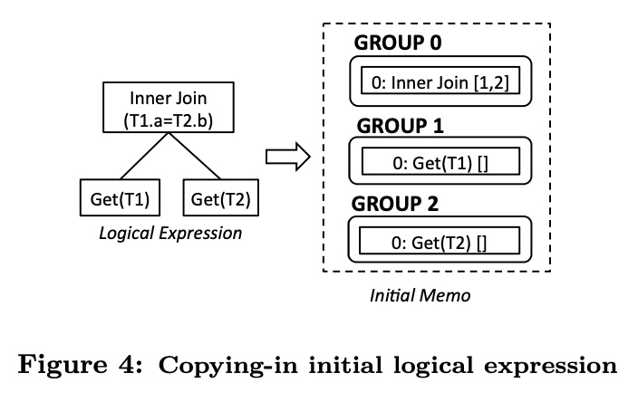
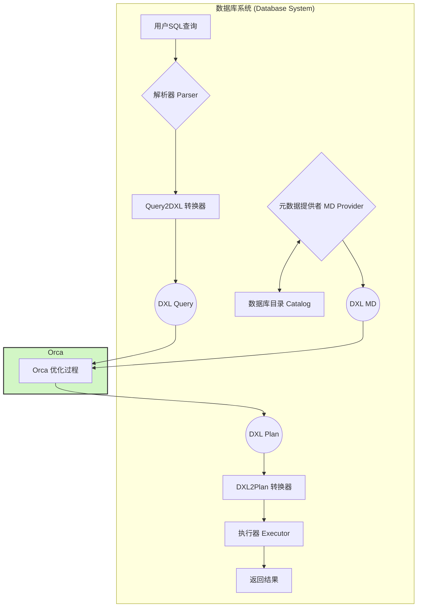
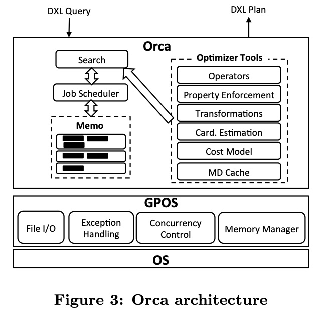
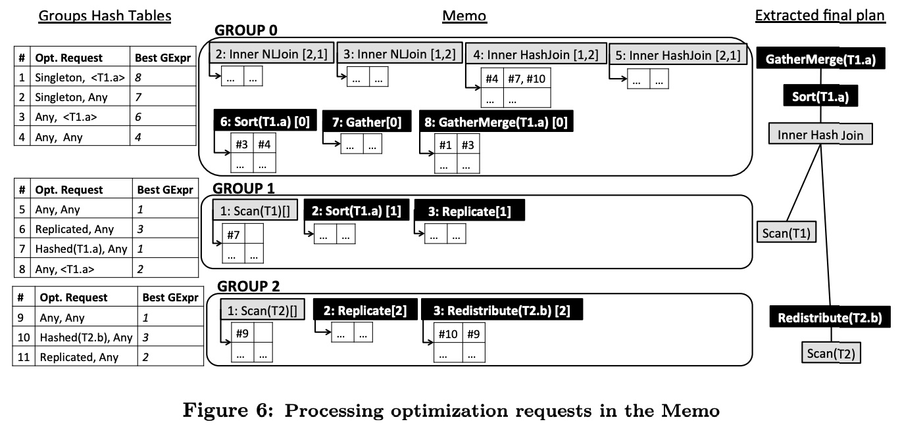
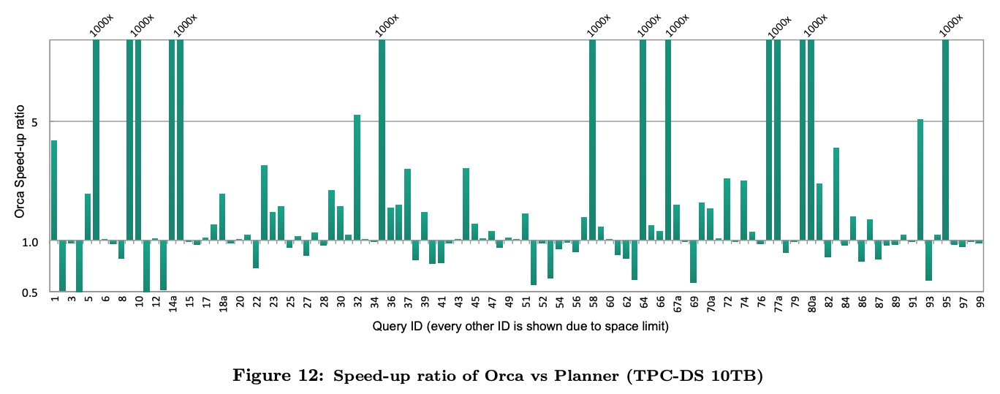
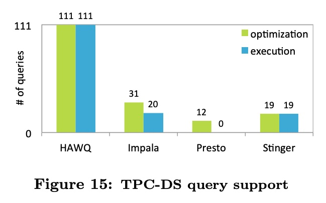
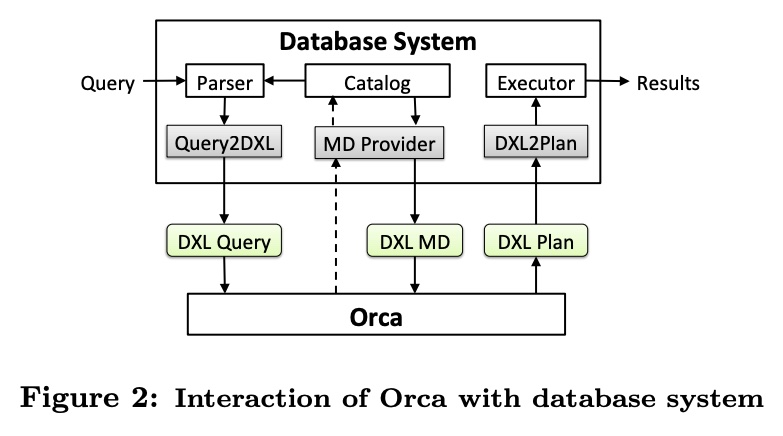
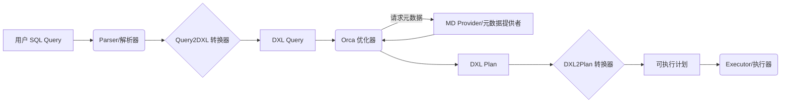

## AI论文解读 | Orca: A Modular Query Optimizer Architecture for Big Data
        
### 作者        
digoal        
        
### 日期        
2025-10-01       
        
### 标签        
PostgreSQL , PolarDB , DuckDB , AI , 论文解读        
        
----        
        
## 背景  
      
https://www.vmware.com/docs/white-paper-orca-a-modular-query-optimizer-architecture-for-big-data        
  
提示:          
```          
读懂《Orca: A Modular Query Optimizer Architecture for Big Data》这篇论文需要提前掌握哪些基础知识, 请使用中文通熟易懂的讲解这些基础知识, 可以引用论文中的图、表或使用Markdown支持的图形(text,mermaid等)增加解释性. 
  
使用中文通熟易懂的解读《Orca: A Modular Query Optimizer Architecture for Big Data》这篇论文, 其中的关键内容请着重讲解, 可以引用论文中的图、表或使用Markdown支持的图形(text,mermaid等)增加解释性. 
  
提取《Orca: A Modular Query Optimizer Architecture for Big Data》这篇论文中的重要术语, 使用中文对这些术语进行通熟易懂的讲解, 可以引用论文中的图、表或使用Markdown支持的图形(text,mermaid等)增加解释性. 
```     
  
## 1 前置知识 
  
阅读《Orca: A Modular Query Optimizer Architecture for Big Data》这篇论文，您需要提前掌握以下三类基础知识。Orca 是为 Pivotal Greenplum Database (MPP 数据库) 和 HAWQ (Hadoop 上的 SQL 引擎) 设计的下一代查询优化器 ，它结合了**大规模并行处理 (MPP)**、**成本模型 (Cost Model)** 和 **Cascades 优化框架**等核心技术 。

-----

## 1\. 数据库与分布式系统基础 (MPP/Big Data)

Orca 的目标是优化大数据环境下的分析查询，因此理解其运行环境至关重要。

### **SQL 与查询处理流程**

  * 您需要了解基本的 **SQL 语句**（例如 `SELECT`, `JOIN`, `WHERE`, `ORDER BY`）以及数据库如何处理查询。
  * 查询处理流程：**SQL 解析 (Parsing)** -\> **查询优化 (Optimization)** -\> **执行计划生成 (Plan Generation)** -\> **执行 (Execution)** 。

### **大规模并行处理 (MPP) 架构**

MPP 是 Orca 所在的 Greenplum/HAWQ 系统的核心架构 。

  * **共享-无任何 (Shared-nothing) 架构**：每个处理器都有独立的内存、操作系统和磁盘，通过网络互联协同工作 。
  * **Master (主节点) 与 Segment (数据节点)**：
      * **Master**：是查询入口，负责接收 SQL、**优化查询**、并将其分解成小任务分发给 Segment 。
      * **Segment**：负责数据存储和并行执行查询的子任务 。
  * **数据分布 (Data Distribution)**：理解数据是如何分布到各个 Segment 上的，这对优化器选择 Join 策略至关重要 。
      * **哈希分布 (Hashed Distribution)**：基于某一列的哈希值将数据行分布到不同的 Segment 上。
      * **复制分布 (Replicated Distribution)**：将完整的表副本存储在每个 Segment 上。
      * **单点分布 (Singleton Distribution)**：将数据收集到单个 Segment (通常是 Master) 上。

Orca 生成的计划必须包含诸如 **Gather** (从 Segment 收集到 Master)、**Redistribute** (重新分布数据) 等操作符，以满足分布式执行的要求 。

-----

## 2\. 查询优化器核心概念 (CBO)

Orca 是一个**基于成本的优化器 (Cost-Based Optimizer, CBO)**，这意味着它依赖于精确的成本估算来选择最佳的执行计划 。

### **逻辑执行计划与物理执行计划**

  * **逻辑表达式 (Logical Expression)**：描述**做什么**，例如：两个表的 Inner Join 操作 。
  * **物理表达式 (Physical Expression)**：描述**如何做**，例如：使用 Hash Join 或 Nested Loop Join 来实现 Inner Join 。
  * **转换规则 (Transformation Rules)**：
      * **逻辑转换规则**：生成逻辑等价的表达式，例如：Join 顺序交换 (`InnerJoin(A, B)` $\to$ `InnerJoin(B, A)`) 。
      * **物理实现规则**：将逻辑表达式转换为物理操作符，例如：将 `InnerJoin` 转换为 `HashJoin` 。

### **统计信息与基数估算 (Cardinality Estimation)**

  * **基数 (Cardinality)**：指一个操作符输出的行数估算，是成本估算中最关键的因素 。
  * **直方图 (Histogram)**：Orca 的统计信息主要是一系列用于估算基数和数据倾斜的**列直方图** 。
  * **成本模型 (Cost Model)**：优化器通过成本模型来估算不同执行计划的 I/O、CPU 和网络开销，从而选出成本最低的计划 。

-----

## 3\. Orca 架构与 Cascades 框架

Orca 是基于 **Cascades 优化框架**的 ，这是一种现代的、**自顶向下 (Top-down)** 的查询优化方法。理解 Cascades 框架中的核心概念是读懂 Orca 论文的关键。

### **Memo 结构：搜索空间的紧凑表示**

Memo 是一个内存数据结构，用于**紧凑地编码**所有可能等价的查询执行计划（搜索空间）。

  * **Group (组)**：存储**逻辑上等价**的表达式集合。每个 Group 代表查询的一个子目标 。
  * **Group Expression (组表达式)**：Group 中的成员，是具体的**操作符** (Operator)，其子节点是其他 Group 。

**图示：初始逻辑表达式如何转化为 Memo 结构**

当一个 `Inner Join` 查询 (T1 JOIN T2) 进入 Orca 后，会被解析并初始化到 Memo 中，如下所示：

   

> **图 4 (简化版) 解释**：原始的逻辑表达式 (左侧) 被解析成 Memo 结构 (右侧)。`Inner Join` 所在的 Group 0 依赖于 Group 1 (T1) 和 Group 2 (T2)。在 **Exploration (探索)** 阶段，Group 0 可能会增加 `1: Inner Join [2,1]` (即 Join 顺序调换) 这样的等价表达式 。

### **物理属性强制执行 (Property Enforcement)**

这是分布式优化器的独特且重要的机制。在优化过程中，每个物理操作符都会向其子节点**请求 (Request)** 满足特定的物理属性。

  * **物理属性 (Physical Properties)**：包括**数据分布 (Data Distribution)**（例如 Hashed(T1.a)、Singleton 等）和**排序顺序 (Sort Order)** 。
  * **强制器 (Enforcer)**：如果子计划无法提供所需的属性，Orca 会自动插入一个**强制器**操作符来满足要求 。例如：
      * 如果需要有序数据，但子计划是无序的，则插入 **Sort** 操作符 。
      * 如果需要特定的数据分布（用于**共址 Join**），但子计划分布不对，则插入 **Redistribute** 或 **Gather** 操作符 。

### **DXL (数据交换语言) 与模块化**

  * Orca 采用**模块化**设计，可以作为**独立组件**运行在数据库系统之外 。
  * **DXL (Data eXchange Language)**：是一种基于 **XML** 的语言 ，用于 Orca 优化器和数据库系统之间传输信息（如：输入查询、输出计划、元数据）。理解 DXL 的作用，有助于理解 Orca 跨平台 (GPDB/HAWQ) 的可移植性 。
  
## 2 解读论文 
  
好的，我们来通俗易懂地解读这篇关于大数据查询优化器Orca的经典论文。

### 论文核心思想概览

想象一下，数据库系统就像一个巨大的图书馆，而你（用户）想通过一个复杂的指令（SQL查询）找到一些特定的信息。查询优化器（Query Optimizer）就是图书馆里最聪明的管理员，他不会真的让你跑遍整个图书馆，而是会帮你规划出一条最高效的查找路径（执行计划）。

在大数据时代，这个图书馆变得无比庞大（PB级别） ，指令也越来越复杂 。如果管理员的规划能力不行（优化器不够智能），一个“坏”的路径和一个“好”的路径，查找时间可能相差成千上万倍 。

这篇论文介绍的**Orca**，就是Pivotal公司（后被VMware收购）为旗下的大数据产品（如Greenplum数据库和HAWQ）全新打造的一位“超级管理员” 。它的目标是构建一个模块化、可移植、高性能且面向未来的查询优化器架构 。

-----

### Orca的核心架构与设计理念

传统优化器通常与数据库系统深度绑定，像一个不可分割的器官 。而Orca最大的创新之一就是**模块化与解耦**。

#### 1\. 独立运行的优化器与DXL通信协议

Orca可以作为一个独立的程序运行，不依赖于任何特定的数据库内核 。这带来了巨大的好处：

  * **可移植性**：一套Orca代码，通过不同的“插件”，就能为Greenplum（一种MPP架构数据库）和HAWQ（一种SQL on Hadoop引擎）等完全不同的系统服务 。
  * **易于测试**：开发者可以脱离庞大的数据库系统，独立地对优化器进行测试和调试 。

这种解耦是通过一个名为**DXL (Data eXchange Language)** 的语言实现的 。DXL是一种基于XML的语言，用于在数据库和Orca之间传递所有必要的信息，如下图所示：



  * **查询**：数据库系统将解析后的查询树转换成`DXL Query`格式发送给Orca 。
  * **元数据**：在优化过程中，Orca需要表的结构、索引、统计信息等元数据。它通过`MD Provider`向数据库请求，数据库再将这些信息打包成`DXL MD`格式发给Orca 。
  * **计划**：Orca完成优化后，会生成一个最优的`DXL Plan`（执行计划），返回给数据库 。数据库再将其翻译成自己可以执行的格式 。

#### 2\. Orca的内部核心组件

下图展示了Orca的内部结构 ：

   

> **图源**: 论文 Figure 3: Orca architecture 

  * **GPOS**: 一个操作系统抽象层，负责内存管理、并发控制、异常处理等底层任务，让Orca可以跨平台运行 。
  * **Memo**: 这是优化器的核心数据结构 。它不是只存储一个执行计划，而是像一个巨大的地图，紧凑地存储了所有**逻辑上等价**的计划可能性 。比如 `A join B` 和 `B join A` 是等价的，在Memo中会被存放在同一个“等价组”（Group）里 。
  * **Job Scheduler (任务调度器)**: Orca是为多核CPU设计的 。它会将复杂的优化任务分解成许多个小任务（Jobs），比如“探索某个表的可能性”、“实现某种Join”等，然后通过调度器并行地在多个CPU核心上执行，大大加快了优化速度 。
  * **Optimizer Tools (优化器工具集)**: 这是一套即插即用的工具，包括：
      * **变换规则 (Transformations)**: 一系列的规则，用于在Memo中产生新的等价计划。例如，“Join交换律”就是一条变换规则 。
      * **属性增强 (Property Enforcement)**: 用于描述计划的特性（如排序顺序、数据分布）以及如何满足这些特性的框架 。
      * **代价模型 (Cost Model) & 基数估计 (Card. Estimation)**: 优化器的“大脑”，用于估算每个计划的执行成本，并最终选择成本最低的那个 。

-----

### 关键技术深度解析：Orca如何优化一条SQL？

让我们通过一个例子来理解Orca的优化流程。假设我们有这样一条SQL：

```sql
SELECT T1.a FROM T1, T2
WHERE T1.a = T2.b
ORDER BY T1.a;
```

这条SQL被转换成DXL后送入Orca，优化过程分为以下几步 ：

**第1步：探索 (Exploration)**

  * 初始的查询逻辑 `Inner Join(T1, T2)` 被放入Memo中 。
  * Orca应用各种变换规则，生成所有逻辑上等价的表达式 。例如，应用“Join交换律”规则后，Memo中会同时存在 `Inner Join(T1, T2)` 和 `Inner Join(T2, T1)` 这两种可能性 。

**第2步：统计信息推导 (Statistics Derivation)**

  * 在探索完所有逻辑可能性后，Orca需要估算每个操作会产生多少数据（即“基数估计”）。
  * 它会从数据库获取表的统计信息（如列的直方图），并根据操作（如Join、Filter）自底向上地推算结果集的统计信息 。

**第3步：实现 (Implementation)**

  * 这一步是将逻辑操作转换为物理操作 。
  * 例如，逻辑上的`Inner Join`可以被实现为物理上的`Hash Join`（哈希连接）或`Nested Loops Join`（嵌套循环连接） 。`Get(T1)`（获取表T1）可以被实现为`Scan(T1)`（扫描表T1） 。

**第4步：优化与属性增强 (Optimization)**
这是最关键也最复杂的一步。系统对最终结果有特定的**要求 (Required Properties)**，比如：

1.  **数据分布 (Distribution)**: 结果需要是 `Singleton`，意味着所有数据最终要汇集到Master节点上 。
2.  **排序顺序 (Sort Order)**: 结果需要按照 `T1.a` 排序 。

Orca会自顶向下地为Memo中的每个计划选择成本最低的实现方式，同时满足这些“要求”。

  * **请求传递**: 顶层的`ORDER BY`要求一个按`T1.a`排序的输入。这个“要求”会传递给它的子节点（比如Join操作）。
  * **属性派生**: Join操作执行完后，它的输出结果本身也具有某些**属性 (Delivered Properties)**，比如它的数据是按哈希键分布在各个节点上的。
  * **添加增强器 (Enforcer)**: 如果子节点派生出的属性**不满足**父节点的要求，Orca就会自动在计划中插入一个“增强器”节点 。
      * 为了满足`Singleton`分布要求，可能会插入`Gather`（普通汇集）或`GatherMerge`（排序汇集）节点 。
      * 为了满足排序要求，可能会插入`Sort`节点 。
      * 为了在节点间重分布数据以进行高效的Join，可能会插入`Redistribute`（重分布）节点 。

下图展示了最终从Memo中提取出的最优计划 。

   

> **图源**: 论文 Figure 6 (右侧部分) 

**计划解读**:

1.  `Scan(T1)` 和 `Scan(T2)`: 从底层扫描两个表的数据。
2.  `Redistribute(T2.b)`: 因为`T1`是按`T1.a`哈希分布的，为了让`T1.a = T2.b`的连接数据能在同一个节点上相遇，需要将`T2`的数据按`T2.b`重新哈希分布 。
3.  `Inner Hash Join`: 在各个数据节点上并行执行哈希连接。
4.  `Sort(T1.a)`: 在各个节点上对Join后的结果按`T1.a`进行局部排序。
5.  `GatherMerge(T1.a)`: 将各个节点上已经排好序的数据汇集到Master节点，并在汇集过程中保持全局有序（归并排序的思路）。这个操作同时满足了`Singleton`分布和`ORDER BY`排序两个要求 。

通过这种方式，Orca能够在一个巨大的可能性空间中，通过严谨的代价估算和属性匹配，找到一个全局最优的执行计划。

-----

### Orca的五大亮点总结

论文在引言中就强调了Orca的几个核心优势 ：

1.  **模块化 (Modularity)**: 如前所述，通过DXL实现与数据库内核的解耦，可轻松移植到不同系统 。
2.  **可扩展性 (Extensibility)**: 无论是新的SQL特性还是新的优化规则，都可以作为独立的“一等公民”模块加入系统，避免了传统多阶段优化器牵一发而动全身的窘境 。
3.  **多核就绪 (Multi-core ready)**: 内置高效的并行任务调度器，能充分利用现代CPU的多核能力来加速优化过程 。
4.  **可验证性 (Verifiability)**: Orca内置了强大的测试和验证工具 。
      * **AMPERe**: 一个可以自动捕获导致错误的最小复现环境（包括查询、元数据、配置）的工具，极大地简化了BUG的复现和调试过程 。
      * **TAQO**: 一个用于测试优化器**准确性**的工具，它会评估优化器估算的计划成本与真实执行时间的匹配程度，确保优化器做的决定是正确的 。
5.  **高性能 (Performance)**: 实验结果证明了Orca的强大。

-----

### 性能评测：Orca效果如何？

#### 1\. 对比Greenplum的传统优化器 (Planner)

在10TB TPC-DS基准测试中，Orca相较于GPDB的旧优化器（Planner）取得了巨大成功 。

   

> **图源**: 论文 Figure 12: Speed-up ratio of Orca vs Planner 

  * 结果显示，对于80%的查询，Orca生成的计划等于或优于旧优化器 。
  * 整体性能提升了**5倍** 。
  * 对于14个极其复杂的查询，旧优化器超时（超过10000秒），而Orca能在几分钟内完成，性能提升超过**1000倍** 。
  * 这得益于Orca更先进的连接排序（Join Ordering）、子查询处理、分区表优化等高级特性 。

#### 2\. 对比其他Hadoop SQL引擎

论文还将搭载了Orca的HAWQ与其他流行的SQL on Hadoop引擎（如Impala, Stinger）进行了对比。

   

> **图源**: 论文 Figure 15: TPC-DS query support 

  * **SQL兼容性**: HAWQ（Orca）能够完整支持所有111个TPC-DS查询，而其他系统由于SQL功能限制，仅支持一小部分 。
  * **性能**: 在支持的查询子集上，HAWQ的平均性能是Impala的**6倍**，是Stinger的**21倍** 。主要原因之一是Orca拥有先进的、基于代价的连接排序能力，而其他系统当时大多依赖于用户手动调整SQL中的表顺序 。

### 总结

《Orca》这篇论文不仅仅是介绍了一个新的查询优化器，更重要的是，它提出并实践了一套面向大数据时代的、全新的优化器设计哲学。其**模块化、可移植、并行化和高度可验证**的架构，使其不仅在当时取得了卓越的性能，也为后续查询优化技术的发展提供了宝贵的工程实践和思路。它证明了，通过优秀的架构设计，可以构建一个能够同时服务于多种不同底层数据系统、并且能够持续演进的、强大的优化平台。
  
## 3 术语 
  
《Orca: A Modular Query Optimizer Architecture for Big Data》这篇论文的核心在于介绍一种为大规模并行处理（MPP）和大数据环境设计的**模块化、基于成本**的新型查询优化器架构。

以下是论文中的重要术语及其通俗易懂的中文解释，涵盖了 Orca 的**架构、核心框架**和**分布式特性**。

-----

## 一、 Orca 的架构定位与基础环境

| 术语 (英文) | 中文解释 | 核心概念 |
| :--- | :--- | :--- |
| **Orca** | **奥卡优化器** | Pivotal Greenplum Database (GPDB) 和 HAWQ (Hadoop 上的 SQL 引擎) 使用的新一代**基于成本**的查询优化器 。 |
| **MPP** | **大规模并行处理 (Massively Parallel Processing)** | Orca 运行的 GPDB 采用的**无共享 (Shared-nothing)** 架构 。每个处理节点（Segment）独立拥有自己的内存和磁盘，通过网络互联协同工作 。 |
| **Master / Segment** | **主节点 / 数据节点** | **Master** 是查询入口，负责接收、**优化查询**和任务调度；**Segment** 是实际的数据存储和并行计算节点 。Orca 生成的计划必须高效地协调这些节点。 |
| **DXL** | **数据交换语言 (Data eXchange Language)** | 一种基于 **XML** 的语言，用于 Orca（作为独立进程）与外部数据库系统之间交换信息 。Orca 的输入是 **DXL Query**，输出是 **DXL Plan** 。 |
| **Metadata Provider** | **元数据提供者** | 数据库系统提供的一个**插件**，负责将数据库的元数据（如表结构、统计信息）序列化为 DXL 格式，发送给 Orca 。 |

**模块化交互 (Figure 2 简化)**：    



-----

## 二、 Orca 的优化核心框架 (Cascades)

Orca 基于现代的 **Cascades 优化框架** ，其核心是使用 `Memo` 结构来紧凑地表示和搜索所有可能的执行计划。

### 1\. Memo 结构 (紧凑的计划空间)

| 术语 (英文) | 中文解释 | 核心概念 |
| :--- | :--- | :--- |
| **Memo** | **计划备忘录** | 一个**紧凑的内存数据结构**，用于编码优化器生成的所有等价的查询执行计划 。它避免了重复优化，极大地节省了搜索空间 。 |
| **Group** | **组** | Memo 的基本容器，存储**逻辑上等价**的表达式集合 。每个 Group 代表查询的一个子目标 。 |
| **Group Expression** | **组表达式** | 组中的成员，是具体的**操作符**（如 Join、Filter）。其子节点不是具体的表，而是对**其他 Group 的引用** 。 |

**Memo 初始化示例 (Figure 4 简化):**

一个简单的 Join 查询 `T1 JOIN T2` 在 Memo 中的初始结构如下：

   

> **图示说明**: Group 0 包含 `Inner Join` 操作，它引用 Group 1 和 Group 2 。在**探索 (Exploration)** 阶段，Group 0 可能会增加 `1: Inner Join [2, 1]`（即交换 Join 顺序）的表达式，但都指向相同的子 Group 。

### 2\. 优化流程的关键步骤

| 步骤 (英文) | 中文解释 | 作用与示例 |
| :--- | :--- | :--- |
| **Exploration** | **探索** | 应用**逻辑转换规则**（如 Join 顺序交换），生成逻辑等价的表达式，扩展 Group 中的 Group Expression 集合 。 |
| **Implementation** | **实现** | 应用**物理实现规则**，将逻辑表达式转换为具体的物理操作符 。例如，将逻辑 `Join` 转换为**物理 `Hash Join`** 或**物理 `Nested Loops Join`** 。 |
| **Statistics Derivation** | **统计信息推导** | 在逻辑空间探索结束后触发 。主要目的是计算 **Group** 的统计信息，包括**列直方图 (Column Histograms)** ，用于估算操作符的**基数 (Cardinality)**（输出行数）和数据倾斜 。这是成本估算的基础 。 |

-----

## 三、 分布式特性与成本模型

Orca 最大的挑战是为 MPP 架构生成高效的分布式计划。

### 1\. 物理属性与强制执行

| 术语 (英文) | 中文解释 | 核心概念 |
| :--- | :--- | :--- |
| **Physical Properties** | **物理属性** | 描述数据在分布式环境中的**物理特性**，是分布式优化器的关键 。主要包括：<br>1. **数据分布 (Data Distribution)**：数据如何在 Segment 之间划分（如 `Hashed` 哈希分布、`Singleton` 单点收集、`Replicated` 复制分布）。<br>2. **排序顺序 (Sort Order)**：数据是否按特定列排序 。 |
| **Property Enforcement** | **属性强制执行** | 当一个操作符（父节点）所需的物理属性（例如：要求输入数据有序）与其子计划实际提供的属性不一致时，Orca 会自动插入一个 **Enforcer (强制器)** 操作符来满足要求 。 |
| **Enforcer** | **强制器** | 自动插入的物理操作符，用于满足缺失的物理属性 。例如：<br>• `Sort`：用于满足排序要求 。<br>• `Redistribute`：用于对数据进行**重分布**（基于哈希值重新发送到不同 Segment），以实现 Join 键的**共址 (Co-location)** 。<br>• `Gather` / `GatherMerge`：用于将数据从所有 Segment **收集**到 Master 节点 。 |

### 2\. 成本驱动搜索

  * **Optimization (优化)**：在此步骤中，Orca 会根据 **Cost Model (成本模型)** 对所有**物理执行计划**的替代方案进行**估算成本**，并选择总成本最低的那个 。成本模型会考虑 CPU、I/O 和**网络**开销 。
  * **Job Scheduler**：Orca 部署了高效的**多核感知调度器**，将细粒度的优化子任务（Optimization Jobs）分配给多个 CPU 核心，实现**并行查询优化**，以加速复杂查询的优化过程 。
  
## 参考        
         
https://www.vmware.com/docs/white-paper-orca-a-modular-query-optimizer-architecture-for-big-data    
        
<b> 以上内容基于DeepSeek、Qwen、Gemini及诸多AI生成, 轻微人工调整, 感谢杭州深度求索人工智能、阿里云、Google等公司. </b>        
        
<b> AI 生成的内容请自行辨别正确性, 当然也多了些许踩坑的乐趣, 毕竟冒险是每个男人的天性.  </b>        
      
#### [期望 PostgreSQL|开源PolarDB 增加什么功能?](https://github.com/digoal/blog/issues/76 "269ac3d1c492e938c0191101c7238216")
  
  
#### [PolarDB 开源数据库](https://openpolardb.com/home "57258f76c37864c6e6d23383d05714ea")
  
  
#### [PolarDB 学习图谱](https://www.aliyun.com/database/openpolardb/activity "8642f60e04ed0c814bf9cb9677976bd4")
  
  
#### [PostgreSQL 解决方案集合](../201706/20170601_02.md "40cff096e9ed7122c512b35d8561d9c8")
  
  
#### [德哥 / digoal's Github - 公益是一辈子的事.](https://github.com/digoal/blog/blob/master/README.md "22709685feb7cab07d30f30387f0a9ae")
  
  
#### [About 德哥](https://github.com/digoal/blog/blob/master/me/readme.md "a37735981e7704886ffd590565582dd0")
  
  

  
