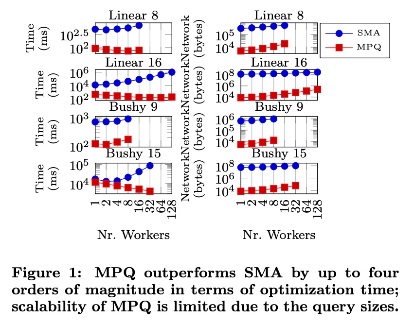

## AI论文解读 | Parallelizing Query Optimization on Shared-Nothing Architectures
        
### 作者        
digoal        
        
### 日期        
2025-10-01       
        
### 标签        
PostgreSQL , PolarDB , DuckDB , AI , 论文解读        
        
----        
        
## 背景  
      
https://www.vldb.org/pvldb/vol9/p660-trummer.pdf        
  
提示:          
```          
读懂《Parallelizing Query Optimization on Shared-Nothing Architectures》这篇论文需要提前掌握哪些基础知识, 请使用中文通熟易懂的讲解这些基础知识, 可以引用论文中的图、表或使用Markdown支持的图形(text,mermaid等)增加解释性. 
  
使用中文通熟易懂的解读《Parallelizing Query Optimization on Shared-Nothing Architectures》这篇论文, 其中的关键内容请着重讲解, 可以引用论文中的图、表或使用Markdown支持的图形(text,mermaid等)增加解释性. 
  
提取《Parallelizing Query Optimization on Shared-Nothing Architectures》这篇论文中的重要术语, 使用中文对这些术语进行通熟易懂的讲解, 可以引用论文中的图、表或使用Markdown支持的图形(text,mermaid等)增加解释性. 
```     
  
## 1 前置知识 
  
阅读《Parallelizing Query Optimization on Shared-Nothing Architectures》这篇论文，您需要提前掌握以下几个核心基础知识。这篇论文是**数据库系统**和**分布式计算**交叉领域的研究，因此基础知识也主要分为这两大类。

-----

## 1\. 数据库查询优化的基础 (Fundamentals of Query Optimization)

这篇论文的核心目标是加速数据库系统中的查询优化过程。要理解它，必须先了解什么是查询优化。

### **1.1 查询优化 (Query Optimization) 的目标**

  * **概念:** 当用户向数据库提交一个 SQL 查询（例如包含多个 `JOIN` 操作）时，查询优化器（Query Optimizer）不会立即执行它。相反，它会生成成千上万种不同的**查询执行计划**（Query Execution Plan）。
  * **目标:** 优化器的任务是找到一个成本（Cost）最低的计划 。这里的成本通常指查询执行时间，但也可能是内存消耗等其他指标 。
  * **难度 (NP-hard):** 查询优化是一个 **NP-hard** 的问题 ，这意味着随着要连接（Join）的表的数量增加，可能的计划数量会**指数级**增长 。这正是需要并行化的原因：优化本身成为了瓶颈 。
  * **动态规划 (Dynamic Programming):** 传统的查询优化器通常采用 **Selinger 的经典动态规划算法**  来寻找最优解。该算法通过从较小的表集合（子查询）开始，逐步构建最优的连接计划。

### **1.2 查询执行计划的结构 (Plan Structures)**

论文中重点讨论了两种主要的查询计划结构，它们决定了连接（Join）操作的顺序和方式：

#### **A. 左深计划 (Left-Deep Plans)**

  * **特点:** 所有的右操作数（Right Operand）都必须是单个表（Scan Plan）。
  * **结构:** 像一个向左倾斜的二叉树。它本质上就是定义了一个表的**连接顺序**（Join Order）。
  * **示意图:**


#### **B. 灌木计划 (Bushy Plans)**

  * **特点:** 左右两个操作数都可以是其他连接操作的结果（即中间结果）。
  * **结构:** 任意形状的二叉树。它提供了比左深计划更大的搜索空间 。
  * **示意图:**


-----

## 2\. 分布式系统架构：Shared-Nothing

这篇论文的第二个关键背景是它针对的硬件环境。

### **2.1 Shared-Nothing 架构 (无共享架构)**

  * **特点:** 在 **Shared-Nothing 架构**中（例如 Hadoop/Spark 集群 ），每个处理节点（Node）都拥有独立的 **CPU、内存和磁盘**。节点之间不共享任何数据，所有通信都必须通过**网络**（Network）进行 。
  * **挑战:** 这种架构的优点是易于扩展到数百甚至数千个节点，但缺点是**网络延迟和通信开销**非常高 。
  * **论文的突破:** 传统的并行优化算法大多设计用于 **Shared-Memory (共享内存)** 架构 ，依赖于共享中间结果（Memotable），这在 Shared-Nothing 环境下会导致**巨大的通信开销** 。本论文提出了一种全新的算法 **MPQ (Massively Parallel Query Optimization)** 来解决这个问题 。

-----

## 3\. 论文的核心思路：计划空间划分 (Plan Space Partitioning)

理解了查询优化和 Shared-Nothing 的挑战后，论文的核心创新点是：**粗粒度的任务划分**。

### **3.1 划分搜索空间 (Partitioning the Search Space)**

  * **基本思想:** 优化器主节点（Master）不把查询优化分解成无数小的子任务，而是将其分解为数量与工作节点（Worker）一样多的**粗粒度任务** 。
  * **工作流程:**
    1.  **划分:** 主节点将完整的查询计划空间（Plan Space）划分为 $m$ 个大小相等的子空间（Partition）。
    2.  **分发:** 主节点将查询和唯一的**划分 ID**（Partition ID）发送给 $m$ 个工作节点 。
    3.  **独立优化:** 每个工作节点根据其划分 ID 导出**一组约束**（Constraints）。然后，它只在满足这些约束的子空间内，独立地运行完整的动态规划优化算法 。
    4.  **无通信:** 在此优化阶段，工作节点之间或与主节点之间**无需任何通信或数据交换** 。这完美解决了 Shared-Nothing 架构下的通信瓶颈 。
    5.  **合并:** 每个工作节点将其找到的**局部最优计划**返回给主节点，主节点再从中选出**全局最优计划** 。

### **3.2 约束机制 (The Constraint Mechanism)**

约束是实现空间划分的关键：

| 计划类型 | 约束形式 | 约束含义 | 效果 |
| :--- | :--- | :--- | :--- |
| **左深计划 (Left-Deep)** | $Q_x < Q_y$  | 表 $x$ 必须在表 $y$ 之前连接 。 | 排除任何包含 $y$ 但不包含 $x$ 的中间连接结果 。 |
| **灌木计划 (Bushy Plans)** | $Q_x \le Q_y | Q_z$  | 在将表 $z$ 追溯到查询计划根节点的过程中，表 $x$ 出现的时间不晚于表 $y$ 。 | 排除包含 $y$ 和 $z$ 但不包含 $x$ 的中间连接结果 。 |

**示例 (左深计划):**
假设查询 $Q=\{R, S, T, U\}$，有 4 个工作节点。

  * **工作节点 1** 的约束可能是 $R < S$ 且 $T < U$ 。
  * **工作节点 2** 的约束可能是 $S < R$ 且 $T < U$。
  * **工作节点 3** 的约束可能是 $R < S$ 且 $U < T$ 。
  * ...以此类推。

通过互补的约束集合，所有工作节点共同覆盖了完整的计划搜索空间 。每个约束都能将单个工作节点要处理的搜索空间复杂度降低一定的比例（如左深计划为 $3/4$）。
  
## 2 解读论文 
  
好的，我们来通俗易懂地解读这篇经典的数据库领域论文——《Parallelizing Query Optimization on Shared-Nothing Architectures》。

这篇论文的核心思想是：**如何将寻找数据库最佳查询路径这个极其复杂的工作，拆分成许多独立的小任务，交给一个大规模集群（成百上千台计算机）去并行处理，从而大大缩短优化时间。**

-----

### 1\. 问题背景：为什么要做这件事？

想象一下，你用数据库查询一堆复杂的关联数据，比如“在过去一年中，购买了A产品、并且住在华东地区、同时评价超过4星的VIP用户的订单详情”。数据库在执行这个查询前，需要做一个重要的“脑力活动”——**查询优化 (Query Optimization)**。

  * **什么是查询优化？** 就是寻找执行这个查询的“最佳路线图”（即查询计划，Query Plan）。是先从海量订单里筛选用户信息，还是先找出所有VIP用户再看订单？不同的顺序，执行效率可能有天壤之别，可能是一个耗时几秒，另一个耗时几小时。
  * **问题在哪？** 随着表越来越多，关联（join）越来越复杂，可能的“路线图”数量会呈指数级爆炸式增长。找到最优解是一个NP-难问题，非常耗时。
  * **新的挑战：** 现在的计算机硬件发展不再是单纯提高CPU主频，而是增加核心数量、用更多的机器组成集群。数据处理本身已经高度并行化了，但如果“制定路线图”这一步本身很慢，它就会成为整个系统的瓶颈 。

传统的并行优化算法大多为“共享内存”（Shared-Memory）架构设计，好比一个团队围着一块大白板同时工作，信息共享很方便。但在大规模集群这种“无共享”（Shared-Nothing）架构下（每个节点有自己独立的内存和硬盘，像一个个独立办公室），频繁的通信和数据共享会带来巨大的网络开销，导致传统方法水土不服 。

**这篇论文要解决的核心问题就是：设计一个专门用于“无共享”大规模集群的并行查询优化算法。**

-----

### 2\. 核心思想：巧妙的“分而治之”

这篇论文提出的算法，我们称之为 **MPQ (Massively Parallel Query Optimization)**。其核心思想非常优雅，可以概括为： **“事先划区，各自为战，最后汇总”** 。

它不像传统方法那样，由一个主节点（Master）不断给工作节点（Worker）分配零碎的小任务 ，而是采用一种“粗粒度”的分解方式 ：

1.  **分割计划空间：** 在优化开始前，Master将所有可能的查询计划组成的巨大“搜索空间”，预先分割成N个大小相等、互不重叠的“分区” 。
2.  **分派任务：** Master给N个Worker各自分配一个分区ID（比如1号到N号）。每个Worker只负责在自己的指定区域内进行搜索。
3.  **并行搜索：** 所有Worker同时开始工作，在各自的分区内独立寻找最优计划。**最关键的是，在此期间，Worker之间不需要任何通信或数据同步** 。
4.  **汇总结果：** 每个Worker完成搜索后，将自己找到的“分区最优解”返回给Master 。
5.  **得出全局最优：** Master从N个“分区最优解”中挑选出成本最低的一个，即为全局最优解 。

这个流程可以用下面的图来表示：


这种方法的巨大优势在于，它将通信开销降到了最低——只在开始时分发任务和结束时收集结果。这使得它能够扩展到非常大的规模 。

-----

### 3\. 技术关键：如何神奇地分割空间？

这篇论文最核心的技术贡献，就是提出了如何对计划空间进行划分。它通过给查询计划增加“约束条件”来实现。

#### 3.1. 针对左深计划 (Left-deep Plans)

左深计划是一种简单的连接树结构，可以看作一个表的线性连接顺序。例如 `(((R join S) join T) join U)`。

  * **约束方式：** 使用简单的序关系，如 `$R < S$`，表示“R表必须在S表之前被连接” 。
  * **如何划分：**
      * 假设有4个表 `R, S, T, U` 和4个Worker。
      * 系统会选取 `log₂(4) = 2` 对不相交的表对，例如 `(R,S)` 和 `(T,U)`。
      * 每个Worker根据其分区ID的二进制表示来确定约束。例如，Worker 3的分区ID是2，二进制为`10`。
          * 第1位是`1`，对应 `(R,S)` 表对，约束为 `$S < R$`。
          * 第2位是`0`，对应 `(T,U)` 表对，约束为 `$T < U$`。
      * 因此，Worker 3只会在满足“S必须在R前、T必须在U前”的所有连接顺序中寻找最优解 。
  * **效果：** 每个这样的约束可以排除掉不符合条件的中间结果，大约能将每个Worker需要考虑的中间结果数量减少到原来的 **3/4** 。

#### 3.2. 针对丛林计划 (Bushy Plans)

丛林计划是更复杂的树状结构，允许任意两个中间结果进行连接，例如 `((R join S) join (T join U))`。

  * **约束方式：** 约束变得更复杂，形式为 `$x \le y | z$`。其含义是：在连接树中，从表 `z` 的叶子节点向根节点追溯，表 `x` 的出现不能晚于表 `y` 。
  * **效果：** 同样地，这种约束也能有效减小搜索空间。理论上，每个约束能将Worker需要考虑的连接组合数量减少到原来的 **21/27** 。

这种基于约束的划分方法，巧妙地保证了所有分区加起来刚好覆盖了整个搜索空间，且每个分区大小相同，避免了某些Worker任务过重的问题 。

-----

### 4\. 实验效果：数据证明一切

论文在拥有100个节点的真实集群上进行了实验，结果令人信服。

#### 对比传统方法 (MPQ vs. SMA)

论文将MPQ与代表传统细粒度并行算法的SMA (Shared-Memory Approach) 进行了对比。

   

*图1：MPQ与SMA在优化时间（左）和网络通信量（右）上的对比*

  * **优化时间（左侧图）：** 红色的MPQ的耗时非常低，并且稳定。而蓝色的SMA耗时要高出几个数量级，并且随着Worker数量增加，性能反而可能下降 。
  * **网络流量（右侧图）：** MPQ的网络开销极小（几KB）。而SMA由于需要频繁共享中间结果，网络流量巨大（上百MB），这在无共享架构下是致命的弱点 。

#### MPQ自身的可扩展性

   

*图2：MPQ在较大查询上的扩展性表现*

  * **结论：** 当查询足够复杂、搜索空间足够大时，MPQ展现了出色的扩展性。从图中可以看到，随着Worker数量的增加（横轴），总优化时间（左上图 “Time”）和每个Worker消耗的内存（右下图 “Memory”）都在稳步下降，最高扩展到了128个Worker 。在另一组实验中，甚至扩展到了超过250个线程 。
  * **加速比：** 对于24个表的复杂查询，使用128个Worker相比于单节点执行，获得了 **8.1倍** 的速度提升 。

#### 多目标优化与结果质量

该算法不仅适用于传统的“时间成本”优化，也适用于多目标优化（例如，同时考虑执行时间和资源消耗）。实验证明，在固定的时间预算内，使用更多的Worker（更高的并行度）可以找到质量更高（更接近理论最优解）的查询计划 。

**表1: 在固定时间预算下，达到特定近似精度所需的最小并行度** 

   

| Time (s) | Tables | Approx. Precision α=1.05 | α=1.25 | α=1.5 | α=2 | α=5 |
| :--- | :--- | :--- | :--- | :--- | :--- | :--- |
| **30** | 16 | 16 | 4 | 2 | 1 | 1 |
| | 18 | ∞ | 128 | 128 | 64 | 32 |
| **60** | 16 | 1 | 1 | 1 | 1 | 1 |
| | 18 | 128 | 32 | 16 | 16 | 8 |

*表格解读：例如，对于18个表的查询，如果想在30秒内完成优化，并且结果与最优解的差距在25%以内（α=1.25），那么至少需要128个Worker并行工作。这表明，**并行化不仅能提速，还能提质**。*

-----

### 5\. 总结与贡献

这篇论文的主要贡献可以总结为：

1.  **提出了一种创新的、适用于无共享架构的大规模并行查询优化算法 (MPQ)** 。
2.  **设计了基于约束的计划空间划分方法**，这是实现低通信、高并行度的关键技术，保证了负载均衡和完整性。
3.  **在真实的大规模集群上验证了算法的有效性和卓越的可扩展性**，证明其在处理具有许多连接的复杂查询时，相比传统方法有巨大优势 。

总而言之，这篇论文为解决大数据时代下日益复杂的查询优化问题提供了一个非常实用且可扩展的并行化方案，对现代分布式数据库系统的设计具有深远的影响。
  
## 3 术语 
  
这篇论文的核心在于解决**大规模并行环境**下的**查询优化速度**问题。要理解它的创新点，需要掌握以下几个关键术语和概念：

-----

## 1\. 架构基础：Shared-Nothing Architectures (无共享架构)

### **概念讲解**

**Shared-Nothing**（无共享）是一种**分布式计算系统**的架构模式。

  * **特点：** 系统中的每个处理节点（Node）都是完全独立的，拥有自己的 **CPU、内存和磁盘**。节点之间不共享任何硬件资源。
  * **通信方式：** 节点之间只能通过**网络**进行通信和数据传输。
  * **优势：** 扩展性极强，只需增加节点即可扩展整个系统的处理能力。
  * **与论文的关系：** 传统的并行查询优化方法通常依赖于 **Shared-Memory（共享内存）** 架构，它们通过共享内存中的**备忘录表 (Memotable)** 来同步中间结果。但在 Shared-Nothing 架构下，共享这些中间结果需要**巨大的网络通信开销**，优化反而会成为瓶颈。本论文正是针对这种高通信成本的环境提出了解决方案。

-----

## 2\. 核心问题：Query Optimization (查询优化) 与 Join Ordering (连接顺序)

### **概念讲解**

**查询优化**是数据库系统中的一个核心步骤。

  * **目标：** 用户的 SQL 查询（例如包含多个 `JOIN` 操作）可以有成千上万种不同的**执行方式**，每种方式称为一个**查询执行计划**（Query Execution Plan）。查询优化器的任务就是从中选出**成本最低**（通常指执行时间最短）的那一个。
  * **连接顺序问题 (Join Ordering Problem)：** 这是查询优化中最复杂的部分。如果查询涉及 $N$ 个表的连接，理论上可能的连接顺序和结构（计划）数量是 $O(N!)$ 级别的。由于这种**指数级**的复杂度，查询优化本身很容易成为整个查询执行的**时间瓶颈**。

-----

## 3\. 计划结构：Left-Deep Plans (左深计划) 与 Bushy Plans (灌木计划)

查询优化器探索的计划空间可以被大致分为两种结构。论文针对这两种结构都提出了并行优化算法。

### **A. 左深计划 (Left-Deep Plans)**

  * **特点：** 这是一个**顺序连接**的计划。在任何一个连接操作中，**右侧的操作数**（Right Operand）必须是一个**基础表**（Base Table），而**左侧的操作数**（Left Operand）是之前的连接结果。
  * **结构：** 像一棵向左倾斜的二叉树。


### **B. 灌木计划 (Bushy Plans)**

  * **特点：** 这是一个**并行连接**的计划。在任何一个连接操作中，**左右两侧的操作数**都可以是**中间连接的结果**。
  * **结构：** 形状不规则的二叉树，提供了更大的连接顺序和并行度。


-----

## 4\. 论文核心创新：Plan Space Partitioning (计划空间划分)

### **概念讲解**

这是论文提出的 **MPQ (Massively Parallel Query Optimization)** 算法的核心思想。

  * **目的：** 在不牺牲最优性（即保证找到的计划仍是全局最优）的前提下，消除并行优化过程中的**同步和通信**开销。
  * **实现方式：** 主节点（Master Node）将整个查询执行计划的**搜索空间**（Plan Space）划分为 $m$ 个**互不重叠**且**大小近似**的子空间（Partition），然后分配给 $m$ 个工作节点（Worker Node）。

### **工作流程图**


-----

## 5\. 关键机制：Constraints (约束)

### **概念讲解**

**约束**是实现 **计划空间划分** 的“秘密武器”。

  * **定义：** 主节点通过为每个工作节点分配一组**特定的约束条件**，来界定其负责的子空间。
  * **作用：** 每个工作节点在运行传统的**动态规划**优化算法时，**只会考虑**满足其分配到的约束条件的中间结果和最终计划。

| 计划类型 | 约束形式 | 约束含义 | 效果 |
| :--- | :--- | :--- | :--- |
| **左深计划** | $R_x < R_y$ | 在连接序列中，表 $R_x$ 必须出现在表 $R_y$ 之前。 | 强制工作节点只考虑特定的连接顺序，从而分割搜索空间。 |
| **灌木计划** | $R_x \le R_y | R_z$ | 在连接 $R_y$ 和 $R_z$ 的子计划中，表 $R_x$ 必须是其中一个连接的**左子树**（或与 $R_y$ 位于同一子树）。 | 更复杂，用于精细地划分灌木计划的搜索空间。 |

通过精心设计这些约束，论文保证了：

1.  **完整性 (Completeness)：** 所有工作节点覆盖了**完整的**计划搜索空间（即不会遗漏任何计划）。
2.  **互斥性 (Exclusivity)：** 不同工作节点之间的子空间**不重叠**，避免了重复计算。

这使得每个工作节点可以独立、并行地运行优化，完美适应了 **Shared-Nothing 架构**。
  
## 参考        
         
https://www.vldb.org/pvldb/vol9/p660-trummer.pdf    
        
<b> 以上内容基于DeepSeek、Qwen、Gemini及诸多AI生成, 轻微人工调整, 感谢杭州深度求索人工智能、阿里云、Google等公司. </b>        
        
<b> AI 生成的内容请自行辨别正确性, 当然也多了些许踩坑的乐趣, 毕竟冒险是每个男人的天性.  </b>        
      
#### [期望 PostgreSQL|开源PolarDB 增加什么功能?](https://github.com/digoal/blog/issues/76 "269ac3d1c492e938c0191101c7238216")
  
  
#### [PolarDB 开源数据库](https://openpolardb.com/home "57258f76c37864c6e6d23383d05714ea")
  
  
#### [PolarDB 学习图谱](https://www.aliyun.com/database/openpolardb/activity "8642f60e04ed0c814bf9cb9677976bd4")
  
  
#### [PostgreSQL 解决方案集合](../201706/20170601_02.md "40cff096e9ed7122c512b35d8561d9c8")
  
  
#### [德哥 / digoal's Github - 公益是一辈子的事.](https://github.com/digoal/blog/blob/master/README.md "22709685feb7cab07d30f30387f0a9ae")
  
  
#### [About 德哥](https://github.com/digoal/blog/blob/master/me/readme.md "a37735981e7704886ffd590565582dd0")
  
  

  
