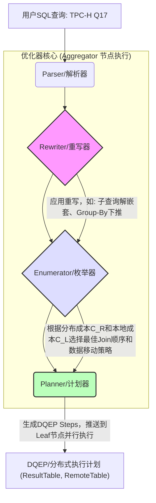
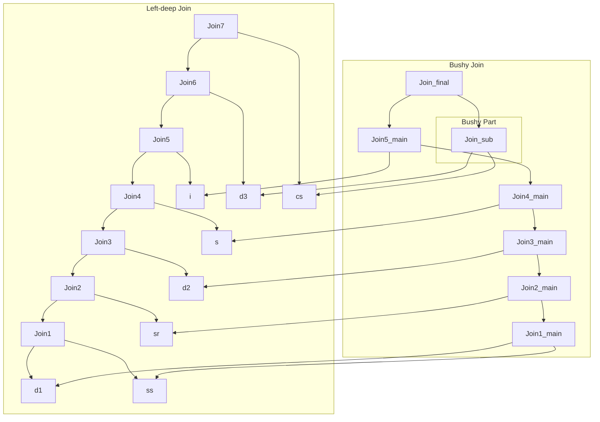
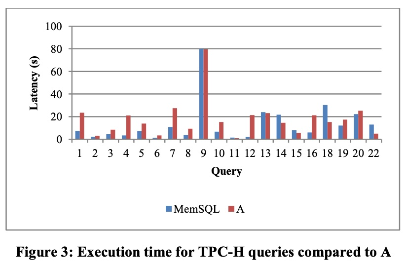

## AI论文解读 | The MemSQL Query Optimizer: A modern optimizer for real-time analytics in a distributed database
        
### 作者        
digoal        
        
### 日期        
2025-10-02       
        
### 标签        
PostgreSQL , PolarDB , DuckDB , AI , 论文解读        
        
----        
        
## 背景  
      
https://www.vldb.org/pvldb/vol9/p1401-chen.pdf        
  
提示:          
```          
读懂《The MemSQL Query Optimizer: A modern optimizer for real-time analytics in a distributed database》这篇论文需要提前掌握哪些基础知识, 请使用中文通熟易懂的讲解这些基础知识, 可以引用论文中的图、表或使用Markdown支持的图形(text,mermaid等)增加解释性. 
  
使用中文通熟易懂的解读《The MemSQL Query Optimizer: A modern optimizer for real-time analytics in a distributed database》这篇论文, 其中的关键内容请着重讲解, 可以引用论文中的图、表或使用Markdown支持的图形(text,mermaid等)增加解释性. 
  
提取《The MemSQL Query Optimizer: A modern optimizer for real-time analytics in a distributed database》这篇论文中的重要术语, 使用中文对这些术语进行通熟易懂的讲解, 可以引用论文中的图、表或使用Markdown支持的图形(text,mermaid等)增加解释性. 
```     
  
## 1 前置知识 
  
要读懂《The MemSQL Query Optimizer: A modern optimizer for real-time analytics in a distributed database》这篇论文，您需要掌握以下三类基础知识：**数据库基础**、**查询优化原理**和**分布式系统概念**。

这篇论文的核心在于解决**分布式数据库**中**实时分析查询**的**高效优化**问题，因此对分布式环境中的**数据移动成本**的理解至关重要。

-----

## 一、 数据库基础知识 (RDBMS Fundamentals)

### 1\. SQL语言及核心操作

您需要熟练掌握 SQL，特别是复杂查询中涉及的操作符，因为优化器就是对它们进行重写和排序 。

  * **连接 (Joins):** `INNER JOIN`、`OUTER JOIN`。
  * **聚合 (Aggregations):** `GROUP BY`、`SUM`、`AVG` 等。
  * **子查询 (Sub-queries):** 标量子查询 (Scalar Subquery) 和关联子查询 (Correlated Subquery) 的概念，以及优化器如何将它们**重写**为连接 (Join) 。
  * **数仓模型 (Data Warehouse Schemas):** **星型模式 (Star Schema)** 和 **雪花模式 (Snowflake Schema)**。论文中多次提到，分析型查询多基于这两种模型，因此优化器必须能高效处理它们的大量连接操作 。

### 2\. 内存与存储结构

  * **内存优化 (In-Memory) 数据库:** 理解内存数据库与传统磁盘数据库在 I/O 上的巨大差异，这是 MemSQL 追求**实时分析**和**低延迟**的基础 。
  * **行存储 (Rowstore) 与列存储 (Columnstore):** 知道这两种存储格式的特点，以及它们分别适合 **OLTP (行)** 和 **OLAP (列)** 工作负载 。

-----

## 二、 查询优化器原理 (Query Optimization Principles)

这是理解论文技术细节的基石。查询优化器是一个将用户查询 (SQL) 转换为执行计划 (Execution Plan) 的系统。论文中明确指出了 MemSQL 优化器的三大模块 ：

| 模块名称 (论文中称呼) | 功能简述 (通俗理解) |
| :--- | :--- |
| **Rewriter (重写器)**  | **逻辑优化**：将 SQL 语句进行等价转换，让其更容易高效执行。 |
| **Enumerator (枚举器)**  | **物理优化**：选择最佳的**连接顺序**、**连接算法**和**数据移动方式**。 |
| **Planner (计划器)**  | **分布式计划生成**：将抽象的优化结果转换为可在集群中执行的分布式步骤 (DQEP)。 |

### 1\. 逻辑优化：查询重写 (Query Rewrite)

  * **重写目标：** 在不改变结果的前提下，将查询转换为效率更高的形式 。
  * **核心重写技术 (需理解其原理):**
      * **谓词下推 (Predicate Pushdown):** 尽早执行过滤 (WHERE) 条件，减少处理的数据量 。
      * **Group-By 下推 (Group-By Pushdown):** 将聚合操作 (GROUP BY) 放在连接 (JOIN) 之前执行，可以提前减少数据行数，但并非总是最优，需要成本评估 。

### 2\. 物理优化：连接顺序与代价模型

  * **连接顺序枚举 (Join Order Enumeration):** 寻找多表连接的最佳顺序。对于 $N$ 个表，可能的连接顺序是 $N!$ 级别，因此优化器需要**剪枝 (Pruning)** 来缩小搜索空间 。
  * **连接树形状 (Join Tree Shapes):**
      * **左深树 (Left-Deep Tree):** 大多数传统优化器只考虑这种。
      * **总线型/布什树 (Bushy Join Tree):** 左右子树都可以是多表连接的结果。论文在 **第 4 节** 强调，对于星型/雪花型查询，布什树是实现高性能的关键 。

-----

## 三、 分布式系统与成本感知 (Distributed Systems and Cost-Awareness)

这部分是 MemSQL 优化器的**创新核心**，也是理解这篇论文的关键。

### 1\. 分布式架构与数据分布

  * **Shared-Nothing 架构 (无共享):** 理解集群中的节点（Aggregator 调度节点和 Leaf 执行节点）不共享内存、磁盘或 CPU 。
  * **数据分片 (Sharding/Hash-Partitioning):** 数据根据**分片键 (Shard Key)** 均匀分布在 Leaf 节点上。查询性能高度依赖于连接列是否与分片键匹配 。
  * **分布式执行计划 (DQEP):** 了解查询如何被**聚合器 (Aggregator)** 拆解成一系列的步骤 (DQEP Steps)，发送给**叶子节点 (Leaf Nodes)** 并行执行 。

### 2\. 分布式操作与数据移动成本 (The Biggest Cost)

在分布式数据库中，**网络数据移动**通常比本地计算（CPU/内存）昂贵得多 。

  * **Reparition (重分布/重洗牌):** 将表中的数据根据新的分片键重新通过网络发送给集群中的节点。
  * **Broadcast (广播):** 将一个小表复制并发送给所有节点。
  * **共存连接 (Colocated Join):** 理想情况，两个连接表都在同一个节点上根据相同的分片键进行了分片，连接操作可以在本地执行，**无需数据移动**。

### 3\. 分布式感知成本模型的重要性 (Distribution-Aware Costing)

论文的**核心论点**是：在分布式环境中，**逻辑优化 (Rewriter)** 必须考虑到**分布式成本**，否则可能做出错误的决策 。

以下面的 `GROUP BY` 下推重写为例（**Section 3.3**），来说明分布式成本 $C_R$ （重洗牌成本）如何改变最优选择：

#### 案例：Q1 vs Q2 (Group-By Pushdown)

假设我们有一个连接和分组查询 `Q1`。优化器可以选择先**连接后分组** (`Q1` 方案)，或者通过重写**先分组后连接** (`Q2` 方案) 。

| 方案 | 逻辑顺序 | **非分布式成本 (仅本地 I/O & CPU)**  | **分布式成本 (加入 $C_R$ - 重洗牌)**  |
| :--- | :--- | :--- | :--- |
| **Q1** | Join $\rightarrow$ Group By | $Cost_{Q1} = 220,000$ | $Cost_{Q1} = 620,000$ |
| **Q2** | Group By $\rightarrow$ Join | $Cost_{Q2} = 250,000$ | $Cost_{Q2} = 400,000$ |
| **结论** | | **Q1 \< Q2** (应选择 Q1) | **Q2 \< Q1** (应选择 Q2) |

**通俗解释：**

1.  **在单机/非分布式环境下：** Q1 (先连接后分组) 稍快，因为连接产生的中间结果集更小。
2.  **在分布式环境下：** Q1 方案需要在连接前，对 **整个大表 $T1$** 进行重洗牌（数据移动），**成本极高**。而 Q2 方案是**先在本地节点上分组**，大大**减少了行数** ( $R_1 \to R_1 S_G$ )，然后只需对**更小的中间结果集**进行重洗牌，从而节省了大量网络开销 。

**结论：** 传统优化器如果只看本地成本，会错误地选择 **Q1**；MemSQL 优化器因为其 **Rewriter 会调用 Enumerator 来进行分布式成本估算** ，从而选择更优的 **Q2**。

### 4\. 布什连接 (Bushy Joins)

理解 **布什连接** 是解决复杂分析查询的关键。

  * **定义：** 一种非线性连接树，即 **$A \bowtie B$** 可以与 **$C \bowtie D$** 的结果进行连接，而不是像左深树那样必须 $(((A \bowtie B) \bowtie C) \bowtie D)$ 。
  * **优势：** 在处理多星型模式 (Multiple Star Schemas) 查询时，可以先在本地节点上将每个**事实表 (Fact Table)** 和其相关的**维度表 (Dimension Tables)** 进行高效过滤和连接，形成独立的子结果集，然后再将这些子结果集连接起来。这种**局部优化**可以避免过早地生成巨大的中间结果集，极大地提高性能 。

您可以参考论文中对**查询优化过程**的描述（Section 2.2），来理解这三大组件如何协同工作：


  
## 2 解读论文 
  
好的，我们来通俗易懂地解读这篇关于MemSQL查询优化器的论文。

这篇名为《The MemSQL Query Optimizer: a modern optimizer for real-time analytics in a distributed database》的论文，核心思想是介绍MemSQL数据库如何设计其查询优化器，以快速、高效地处理分布式环境下复杂的实时分析查询 。

想象一下，你正在运营一个大型电商平台，需要实时分析海量的交易数据来做出商业决策，比如调整库存、推荐商品等。这就要求数据库不仅能快速写入新数据，还要能对最新的数据进行复杂的查询，并在几秒甚至一秒内返回结果 。MemSQL就是为应对这种“实时分析”场景而设计的分布式数据库 。

这篇论文的精髓，在于它解决了在分布式数据库中，如何“又快又好”地生成查询执行计划这一核心难题。

### 1\. 核心挑战：分布式环境下的查询优化

在传统的单机数据库中，优化器只需要考虑如何在本机上最高效地执行查询。但在分布式数据库中，数据被分散存储在多台机器（论文中称为“叶子节点” Leaf Nodes）上 。这时，优化器除了要考虑计算本身的开销（如连接、排序），还必须考虑一个非常昂贵的成本：**数据在机器间的网络传输开销** 。

论文指出，如果一个优化器在做决策时忽略了数据分布和网络传输的成本，很可能会做出非常糟糕的选择，导致查询性能急剧下降 。

### 2\. MemSQL优化器的三大法宝

为了应对上述挑战，MemSQL设计了一个包含三个核心模块的查询优化器 ：

1.  **重写器 (Rewriter)**：负责对用户输入的SQL语句进行“等价改写” 。比如，将一个复杂的子查询转换成一个更高效的JOIN操作 。
2.  **枚举器 (Enumerator)**：这是优化器的“大脑”，负责在众多可能的执行路径中，根据成本模型挑选出成本最低的那个方案 。它决定了表连接的顺序、数据如何在节点间移动等关键问题 。
3.  **计划器 (Planner)**：负责将枚举器选出的“最佳方案”（逻辑计划）转换成可以在分布式集群中执行的一系列具体指令（分布式查询执行计划，简称DQEP） 。

这三个模块协同工作，确保为复杂的分析查询快速生成高质量的执行计划。

### 3\. 关键技术解读

#### 3.1. 关键技术一：感知分布成本的查询重写 (Distribution-Aware Rewrites)

这是论文的**第一个核心贡献**。传统的优化器在“重写SQL”这一步，可能只考虑本地计算的成本，而忽略了数据分布。MemSQL的重写器（Rewriter）在决定是否要进行某项改写时，会**调用枚举器（Enumerator）来估算改写前后的分布式总成本**（包含网络传输成本） 。

论文用一个“分组下推”（Group-By Pushdown）的例子清晰地说明了这一点 。

  * **场景**: 有两张表T1和T2，它们的数据分布方式（分区键）不同 。查询需要将它们连接后再按T1表的两列进行分组聚合 。
  * **两种方案**:
      * **Q1 (先连接后分组)**: 为了连接两张表，需要先通过网络重排（Reshuffle）T1表的大量数据，使其分区方式与T2匹配，连接完成后再进行分组 。
      * **Q2 (先分组后连接)**: 先在每个节点上对T1表进行本地分组，大大减少数据量，然后再将这少量聚合后的结果进行网络重排，最后与T2表连接 。
  * **成本对比**:
      * 如果只考虑本地计算成本，Q1方案看起来更优，因为连接操作过滤掉了很多数据，使得后续分组的计算量变小了 。
      * 但如果把**网络传输成本**也算上，Q2方案的优势就体现出来了。它只传输了分组后的小数据量，而Q1需要传输整个T1表，网络开销巨大 。在真实的云环境中，Q2比Q1快了大约2倍 。

> **结论**: 这个例子雄辩地证明了，在分布式数据库中，查询重写必须“感知”数据分布和网络传输的成本，否则就会像一个只懂陆路不懂海运的物流规划师，做出错误的决策 。

#### 3.2. 关键技术二：巧用查询重写实现高效的“浓密树连接” (Bushy Joins)

当一个查询需要连接很多张表时，连接的顺序会极大地影响性能。常见的连接顺序是“左深树”（Left-deep Join），即像串糖葫芦一样，一张表接一张表地连下去 。

然而，在一些复杂场景（如多维分析的“雪花模型”）中，“浓密树连接”（Bushy Join）的性能会好得多 。浓密树连接允许先将几组不相干的表各自连接起来，形成中间结果，最后再把这些中间结果连接在一起 。

下图直观展示了两者的区别，左边是“左深树”，右边是“浓密树”。在浓密树计划中，`d3` 和 `cs` 可以先独立连接，再与主干连接 。



  * **挑战**: 搜索所有可能的浓密树连接方案是一个计算量爆炸的难题，会让查询优化本身变得非常慢 。
  * **MemSQL的妙招**: MemSQL并不去暴力搜索所有浓密树方案，而是通过一种基于**启发式规则的查询重写**来实现 。它的算法会自动分析查询中表的连接关系图（Join Graph），找出可能从浓密树连接中受益的“子图”，然后把这个子图改写成一个子查询（派生表），从而自然地形成一个浓密树结构 。

论文中用TPC-DS基准测试的第25个查询作为例子，该查询的浓密树计划比最佳的左深树计划**快了10.1倍** 。这种方法避免了漫长的搜索时间，又能精准地找到高效的浓密树计划，是优化时间和执行效率之间的一个绝佳平衡 。

### 4\. 实验结果：快就一个字

论文通过业界公认的TPC-H基准测试，将MemSQL与另一个领先的商用分析型数据库（论文中称为"A"）进行了对比 。

从下方的图表（源自论文Figure 3）可以看出，在大部分查询上，MemSQL的执行延迟都显著低于数据库A，性能优势明显 。  

  

**TPC-H查询执行时间对比 (MemSQL vs. 数据库A)**
*(数据源自论文Figure 3)*

更重要的是，论文展示了MemSQL的**优化时间极短**，几乎所有TPC-H查询的优化耗时都在100毫秒以内，大部分甚至低于20毫秒 。这对于要求快速响应的实时分析应用至关重要，证明了其优化器不仅效果好，而且速度快 。

### 总结

这篇论文的核心贡献可以概括为：

1.  **提出了一个专为分布式实时分析设计的现代化查询优化器架构**，它由重写器、枚举器和计划器三个模块组成，紧密协作 。
2.  **强调并解决了查询重写必须感知数据分布成本的问题**。通过在重写阶段引入基于分布式成本的决策机制，避免了因忽略网络开销而导致的性能陷阱 。
3.  **设计了一种新颖、高效的算法来发现并利用浓密树连接**。该算法通过启发式地分析连接图并结合查询重写，以很小的优化代价实现了巨大的性能提升，尤其适用于复杂的多维分析查询 。

总而言之，MemSQL的查询优化器通过一系列创新的设计，成功地在分布式环境中实现了对复杂分析查询的快速、高效优化，为实时数据分析应用提供了强大的性能保障。
  
## 3 术语 
  
阅读论文《The MemSQL Query Optimizer: A modern optimizer for real-time analytics in a distributed database》的关键在于理解 MemSQL **分布式架构**下**查询优化器**的创新点。以下是论文中最重要的术语及其通俗易懂的中文解释，并引用了论文中的核心概念和架构：

-----

## 一、 核心架构与目标 (Architecture & Goals)

### 1\. 分布式 SQL 数据库 (Distributed SQL Database)

  * **解释：** 区别于传统的单机数据库，它是一个数据库集群，由多台计算机（节点）协同工作，共同存储数据和执行查询 。MemSQL 的核心优势在于它融合了**内存优化 (In-Memory)** 技术和**横向扩展 (Scale-out)** 架构，能够实现大规模数据的**实时分析 (Real-time Analytics)** 。
  * **关键：** 实时性要求查询延迟在**秒级或更短** ，这要求优化器不仅要找到高效的**分布式执行计划**，而且优化过程本身也要足够快，不能成为瓶颈 。

### 2\. Shared-Nothing 架构 (无共享架构)

  * **解释：** 这是一种分布式系统架构，集群中的每个节点都不共享内存、磁盘或 CPU 。这意味着所有数据和计算资源都是本地化的。
  * **MemSQL 架构分层：**
      * **Aggregator Nodes (聚合器节点/调度节点):** 负责接收客户端查询，进行**解析、优化和计划生成** 。
      * **Leaf Nodes (叶子节点/执行节点):** 负责**存储数据**和**执行查询**的具体操作 。

### 3\. 分片键 (Shard Key)

  * **解释：** 决定数据如何分布在叶子节点上的列或列组合 。MemSQL 的分布式表通过**哈希分片**（Hash-Partitioned）的方式，根据分片键将行数据分散到不同的叶子节点上 。
  * **重要性：** **分片键**是实现高效连接（Join）的基础。如果两个表在相同的列上分片，并且通过这个列连接，就可以实现**共存连接 (Colocated Join)**，避免数据跨网络移动，效率最高。

-----

## 二、 优化器三段式结构 (Optimizer Modules)

MemSQL 查询优化器是一个模块化的组件，分为三个主要部分，它们协同工作，将用户查询转化为分布式执行计划 。

| 模块名称 (中文) | 模块名称 (英文) | 核心功能 (通俗理解) | 关键输出 |
| :--- | :--- | :--- | :--- |
| **重写器** | **Rewriter** | **逻辑优化**：将原始 SQL 语句进行**等价转换**（SQL-to-SQL rewrite），例如子查询解嵌套、谓词下推 。 | 优化后的操作符树 |
| **枚举器** | **Enumerator** | **物理优化**：负责决定**分布式连接顺序**、**本地连接顺序**和**数据移动操作**（如分发、广播），并基于**分布式成本模型**选择最优方案 。 | 带有**计划指令**的标注操作符树 |
| **计划器** | **Planner** | **分布式计划生成**：将优化结果转化为一系列可在集群中执行的**分布式查询执行计划步骤 (DQEP Steps)** 。 | DQEP (分布式执行计划) |

### **1. 分布式感知成本 (Distribution-Aware Costing)**

  * **解释：** 这是 MemSQL 优化器的**最大创新点** 。在分布式环境中，网络数据传输（即**数据移动成本**）往往比本地计算成本高得多 。
  * **问题：** 如果重写器在进行**成本评估型重写**（如 Group-By Pushdown）时，只考虑本地 CPU/I/O 成本，而**忽略数据分布成本**，就会做出错误的选择，导致最终的分布式执行计划效率低下 。
  * **MemSQL 解决方案：** 重写器在进行成本评估时，**会调用枚举器**，使用其**分布式感知成本模型**来评估重写后查询的实际分布式成本 。

> **案例：Q1 vs Q2 (Group-By Pushdown)**
>
> 论文中举例：在非分布式环境中，`Q1 (先 Join 后 Group By)` 可能成本更低（220,000） 。但在分布式环境中，`Q1` 需要 **重洗牌** （Repartition） **整个大表** $T1$ ，总成本高达 620,000 。而 `Q2 (先 Group By 后 Join)` 因为 Group By 提前减少了行数，只需要重洗牌**被精简过的小结果集**，总成本降至 400,000 。因此，只有**分布式感知**的成本模型才能正确选择最优的 **Q2** 方案 。

### **2. 分布式查询执行计划 (DQEP)**

  * **解释：** 它是最终的执行方案，由**聚合器**生成，包含一系列可以发送到叶子节点并行执行的 **DQEP Steps** 。
  * **组成要素：** DQEP Steps 包括**本地计算**操作以及**数据移动**操作 。MemSQL 使用了两种 SQL 扩展来表示这些步骤 ：
      * **Result Tables (结果表):** 用于存储一个 DQEP Step 的**本地计算结果**，通常是进行**重洗牌 (Repartition)** 之前，在本地节点上执行过滤或分组操作后的中间结果 。
      * **Remote Tables (远程表):** 表示需要**从远程节点读取数据**进行连接或处理的操作 。通常在 DQEP 中，`REMOTE (r0)` 语句就代表了**数据跨网络移动**的步骤 。

-----

## 三、 高效分布式操作 (Efficient Distributed Operations)

### 1\. 布什连接 (Bushy Join Tree)

  * **解释：** 一种非传统的连接树形状。传统的优化器多使用**左深树 (Left-Deep Tree)**，即 $A \bowtie B \bowtie C \bowtie D$ 必须按 $((A \bowtie B) \bowtie C) \bowtie D$ 的顺序执行 。而布什连接树允许两个独立的子连接的结果再进行连接，例如 $(A \bowtie B) \bowtie (C \bowtie D)$ 。
      * **左深树（Left-Deep Tree）：**
        ```mermaid
        graph TD
            D((D))
            C((C))
            B((B))
            A((A))
            J1(Join)
            J2(Join)
            J3(Join)
            J1 --> A
            J1 --> B
            J2 --> J1
            J2 --> C
            J3 --> J2
            J3 --> D
        ```
      * **布什连接树（Bushy Join Tree）：**
        ```mermaid
        graph TD
            D((D))
            C((C))
            B((B))
            A((A))
            J1(Join)
            J2(Join)
            J3(Join)
            J1 --> A
            J1 --> B
            J2 --> C
            J2 --> D
            J3 --> J1
            J3 --> J2
        ```
  * **重要性：** 对于**多星型或雪花型查询 (Multiple Star or Snowflake Schemas)**，布什连接至关重要 。它允许优化器先将多个**事实表**（Fact Table）与其各自的**维度表**（Dimension Tables）进行**局部、高效**的连接和过滤，避免过早生成巨大的中间结果集，从而实现**大规模并行加速** 。MemSQL 通过**查询重写机制**来有针对性地引入布什连接，避免了穷举所有可能连接顺序的高昂时间成本 。

### 2\. 重分布/洗牌 (Repartitioning / Reshuffling)

  * **解释：** 当两个表要连接但它们的连接键不匹配各自的**分片键**时，数据库必须通过网络将其中一个表（或两者）的数据**重新分配**到不同的节点上，以便让需要连接的行位于同一个节点进行本地连接 。
  * **成本：** 重分布操作涉及**网络传输**和**哈希计算**，是分布式查询中**最昂贵**的操作之一 。MemSQL 优化器的核心任务就是尽量**避免**或**最小化**重分布操作的数据量 。

### 3\. 广播 (Broadcast)

  * **解释：** 将一个**小表**的数据完整复制并发送给集群中的所有叶子节点 。
  * **用途：** 当小表与大表连接时，如果小表广播的成本低于大表重分布的成本，优化器会选择广播，让大表可以在本地分区与小表的副本进行连接 。
  
## 参考        
         
https://www.vldb.org/pvldb/vol9/p1401-chen.pdf    
        
<b> 以上内容基于DeepSeek、Qwen、Gemini及诸多AI生成, 轻微人工调整, 感谢杭州深度求索人工智能、阿里云、Google等公司. </b>        
        
<b> AI 生成的内容请自行辨别正确性, 当然也多了些许踩坑的乐趣, 毕竟冒险是每个男人的天性.  </b>        
    
  
#### [期望 PostgreSQL|开源PolarDB 增加什么功能?](https://github.com/digoal/blog/issues/76 "269ac3d1c492e938c0191101c7238216")
  
  
#### [PolarDB 开源数据库](https://openpolardb.com/home "57258f76c37864c6e6d23383d05714ea")
  
  
#### [PolarDB 学习图谱](https://www.aliyun.com/database/openpolardb/activity "8642f60e04ed0c814bf9cb9677976bd4")
  
  
#### [PostgreSQL 解决方案集合](../201706/20170601_02.md "40cff096e9ed7122c512b35d8561d9c8")
  
  
#### [德哥 / digoal's Github - 公益是一辈子的事.](https://github.com/digoal/blog/blob/master/README.md "22709685feb7cab07d30f30387f0a9ae")
  
  
#### [About 德哥](https://github.com/digoal/blog/blob/master/me/readme.md "a37735981e7704886ffd590565582dd0")
  
  

  
