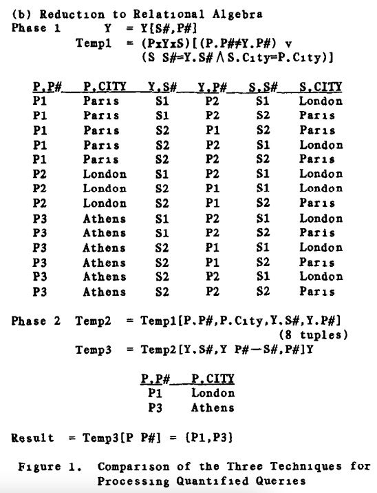
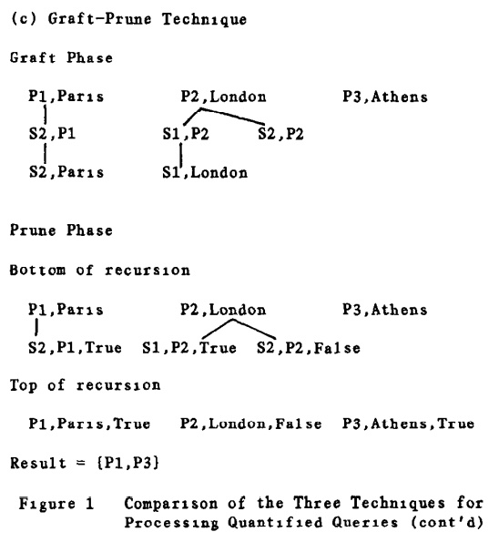
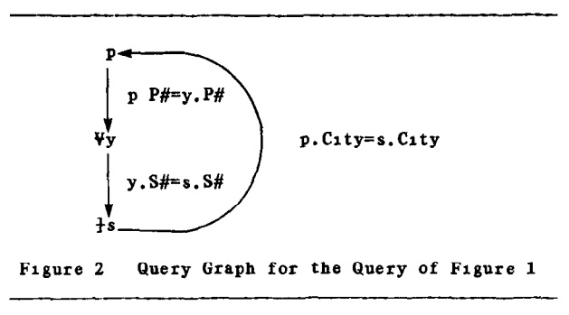
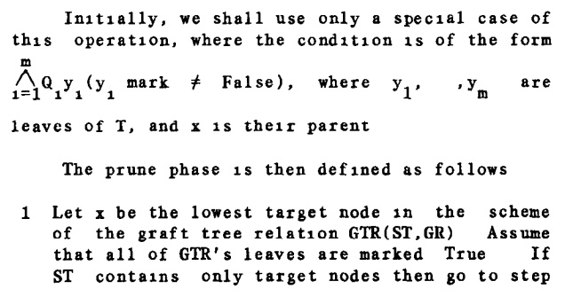
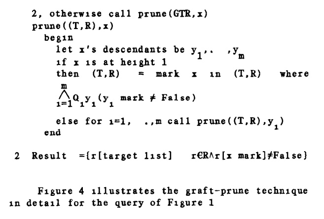
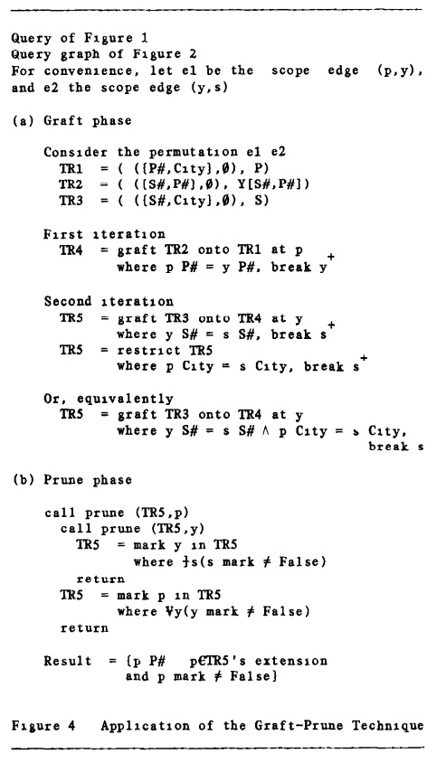
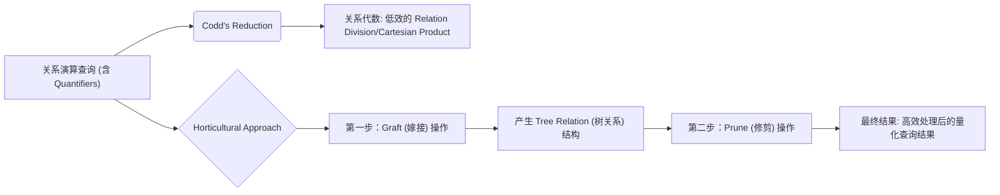

## AI论文解读 | Processing Queries With Quantifiers A Horticultural Approach
        
### 作者        
digoal        
        
### 日期        
2025-10-02       
        
### 标签        
PostgreSQL , PolarDB , DuckDB , AI , 论文解读        
        
----        
        
## 背景  
      
https://dl.acm.org/doi/pdf/10.1145/588058.588075        
  
提示:          
```          
读懂《Processing Queries With Quantifiers A Horticultural Approach》这篇论文需要提前掌握哪些基础知识, 请使用中文通熟易懂的讲解这些基础知识, 可以引用论文中的图、表或使用Markdown支持的图形(text,mermaid等)增加解释性. 
  
使用中文通熟易懂的解读《Processing Queries With Quantifiers A Horticultural Approach》这篇论文, 其中的关键内容请着重讲解, 可以引用论文中的图、表或使用Markdown支持的图形(text,mermaid等)增加解释性. 
  
提取《Processing Queries With Quantifiers A Horticultural Approach》这篇论文中的重要术语, 使用中文对这些术语进行通熟易懂的讲解, 可以引用论文中的图、表或使用Markdown支持的图形(text,mermaid等)增加解释性. 
```     
  
## 1 前置知识 
  
要读懂《Processing Queries With Quantifiers A Horticultural Approach》这篇论文，您需要掌握**关系数据库理论**和**一阶逻辑**的基础知识。

这篇论文的核心在于提出一种更高效地处理包含**全称量词**（"所有"）的复杂数据库查询的方法，该方法被称为 **“园艺法”（Graft-Prune Technique，嫁接-修剪技术）** 。

以下是理解这篇论文必须掌握的四个基础知识的通俗解释：

---

## 1. 关系数据库与形式化查询语言

### 基础知识点：关系模型、关系代数与关系演算

这篇论文建立在数据库的**关系模型**（Relational Model）之上，你需要理解数据是如何存储和查询的：

* **关系模型（Relational Model）:** 简单来说，数据库中的数据是以**表**（Table，在理论中称为**关系**）的形式组织的。每个表由行（Tuple，元组）和列（Attribute，属性）构成 。
* **关系演算（Relational Calculus）:** 这是描述查询“想要什么结果”的**声明性**语言，类似于一阶逻辑。论文中的查询就是用 Codd 的关系演算（Codd's Calculus）来表达的 。它允许使用**量词**来定义集合。
* **关系代数（Relational Algebra）:** 这是描述查询“如何计算结果”的**过程性**语言，包含像**选择** ( $\sigma$ / Selection )、**投影** ( $\pi$ / Projection )、**联接** ( $\bowtie$ / Join ) 等基本操作 。传统的查询处理会将关系演算转换为关系代数来执行 。

---

## 2. 一阶逻辑中的“量词”

### 基础知识点：全称量词 ( $\forall$ ) 和存在量词 ( $\exists$ )

这篇论文专门处理带有**量词**（Quantifiers）的查询。你需要理解它们在逻辑和查询中的含义：

| 量词 | 符号 | 中文名称 | 含义（查询角度） |
| :---: | :---: | :---: | :--- |
| $\exists$ | 存在量词 | **至少存在一个** | 只要**找到一个**满足条件的元组，整个条件就成立。 |
| $\forall$ | 全称量词 | **对于所有/每一个** | 必须**所有**相关的元组都满足某个条件，整个条件才成立。 |

**难点所在：**

大多数数据库查询优化研究主要集中在不包含量词的**合取查询**（Conjunctive Queries，只包含 $\exists$ 和 $\land$ 的简单连接查询）。带有**全称量词 ( $\forall$ )** 的查询（如“查找**所有**供应商都位于伦敦的项目”）在传统的关系代数中必须通过复杂的 **“除法”（Division）** 操作来实现，而“除法”操作是传统查询优化的主要瓶颈 。

---

## 3. 传统查询处理方法的缺陷

### 基础知识点：嵌套循环和关系除法的低效性

论文提出的“嫁接-修剪”法旨在解决现有两种主流量词查询处理技术的效率问题：

1.  **嵌套循环程序（Nested Loop Programs）：**
    * 这是一种直接将逻辑公式转换为多层 `for each... in...` **循环**的程序 。
    * **缺陷：** 循环的嵌套层次必须严格镜像查询中变量作用域的嵌套，因此**难以进行全局优化**，并且通常效率较低 。

2.  **Codd 归约（Codd's Reduction）中的关系除法：**
    * 这是将关系演算转换为关系代数操作序列的方法 。
    * **缺陷：** 为了处理 $\forall$ 量词并将其转化为“除法”操作，**第一步往往需要构建巨大的笛卡尔积**（Cartesian Product，即两个或多个表的所有行两两组合），产生大量的中间结果。这些中间结果中的许多元组最终会被丢弃，造成了巨大的空间和时间浪费 。

---

## 4. 论文核心：树形结构和“园艺”操作

### 基础知识点：查询图、树关系、嫁接（Graft）和修剪（Prune）

论文的创新点是用一种基于树的新代数操作来代替传统的联接和除法操作：

#### 4.1 查询图 (Query Graph) 和作用域树 (Scope Tree)

查询首先被表示为**查询图** 。这是一个有向图，其中的节点是查询中的**变量**（对应数据库中的关系/表），边代表变量之间的**连接条件**和**作用域关系** 。

例如，论文中示例查询的查询图（如下图所示）描绘了变量 $p, y, s$ 之间的依赖关系：
* $p$ (项目) 是根节点。
* $y$ (供应记录) 节点带有 $\forall$ （全称量词）标签。
* $s$ (供应商) 节点带有 $\exists$ （存在量词）标签。

#### 4.2 树关系（Tree Relation）

论文放弃了传统的扁平化关系（表格）模型，转而使用**树关系**作为内部数据结构 。
* **定义：** 一个树关系代表一个**树的森林**（forest of trees），其中每个树都对应查询图中的一条**路径**，树的元组中可以包含 **NULL 值** 。
* **作用：** 这种结构能够更紧凑地存储中间结果，尤其能够通过 **NULL 值**来表示**不满足联接条件**的路径，从而避免了传统方法中低效的笛卡尔积。

#### 4.3 嫁接（Graft）和修剪（Prune）

这是论文提出的两个核心操作，它们模仿了植物学的概念：

1.  **嫁接阶段（Graft Phase）** ：
    * **作用：** 相当于传统的**联接**（Join）操作，但使用的是特殊的 **“单向外联接”（Unidirectional Outer Join）** 和 **“部分联接”（Partial Join）** ，将查询图中的各个关系逐步 **“嫁接”** 成一个大型的树关系（Graft Tree Relation）。
    * **结果：** 这个阶段收集了所有可能满足查询条件的路径，但尚未对量词进行最终评估 。

2.  **修剪阶段（Prune Phase）** ：
    * **作用：** 相当于传统的**除法**和**量词评估**操作 。
    * **过程：** 该阶段**自底向上**（从叶子节点到根节点）遍历树关系，并执行 **“标记和修剪”（Mark and Prune）** 操作 。它使用特殊的标记（如 `True` 或 `False`）来判断每个节点是否满足其量词要求（例如，判断 $\forall$ 节点下的所有分支是否都通过了测试），并 **“修剪”** 掉不满足条件的子树 。

通过这些操作，论文证明了可以避免关系代数中低效的“除法”操作，从而节省大量空间和时间 。

---
---

**总结**：要顺利阅读，请确保您对**关系模型**、**关系演算**、**关系代数**，尤其是**全称量词**在查询中的含义及其在**关系除法**中的低效实现有清晰的认识。论文正是在此基础上，引入了**树形数据结构**和**嫁接-修剪**代数，以提供更优的查询执行策略。
  
## 2 解读论文 
  
好的，我们来一起解读这篇发表于1983年的经典数据库论文——《Processing Queries with Quantifiers: A Horticultural Approach》（量化查询的处理：一种园艺学方法）。

这篇论文的核心思想是提出了一种全新的、更高效的处理带有量词（比如“所有”/`∀`，“存在”/`∃`）的数据库查询的方法。作者巧妙地将其命名为“园艺学方法”，因为它主要包含两个步骤：“嫁接”（Graft）和“修剪”（Prune），就像园丁培育树木一样。

-----

### **论文背景：处理“量化查询”的挑战**

在数据库领域，我们经常需要提出一些复杂的查询，例如：“找出那些*所有*供应商都和项目在同一个城市的项目编号”。这里的“所有”就是一个**全称量词 (Universal Quantifier, ∀)**。与之对应的还有**存在量词 (Existential Quantifier, ∃)**，比如“找出*存在*供应商在巴黎的项目”。

大多数关于查询处理的研究都集中在不带量词的简单查询上 。对于带有量词的查询，当时主要有两种处理方法：

1.  **嵌套循环法 (Nested Loop)**：这种方法直接将查询编译成一个多层嵌套的循环程序 。这种方法的缺点是效率低下，且循环的嵌套顺序被查询语句的结构锁死，难以优化 。

2.  **Codd的关系代数归约法 (Codd's Reduction)**：这是关系数据库理论的奠基人Codd提出的方法，它将查询语言（关系演算）转换为一系列的关系代数操作（如选择、投影、连接、除法等） 。处理全称量词`∀`通常需要用到关系代数中的“除法”操作。但这种方法存在一个很大的问题：为了让“除法”能够正确工作，过程中会产生巨大的中间结果（笛卡尔积），非常浪费时间和存储空间 。

为了让您更直观地理解Codd方法的弊端，我们来看论文中反复引用的一个例子。

#### **核心示例**

  * **数据库表结构**:

      * **S (Suppliers)**: S\#, City (供应商编号, 城市)
      * **P (Projects)**: P\#, City (项目编号, 城市)
      * **Y (Supplies)**: S\#, P\#, Qty (供应商编号, 项目编号, 数量)

  * **查询需求**: 检索出这样一个项目：所有给它供货的供应商，都与该项目位于同一个城市 。

  * **用逻辑语言表达**:
    `{ p.P# | ∀y( (p.P# = y.P#) => ∃s(s.S# = y.S# ∧ s.City = p.City) ) }` 
    这个表达式的意思是：对于一个项目`p`，对于*所有*的供货关系`y`，只要这个供货关系是关于项目`p`的 (`p.P# = y.P#`)，那么就*存在*一个供应商`s`，它的编号`s.S#`和供货关系`y`中的供应商编号一致，并且它的城市`s.City`和项目`p`的城市一致。

论文中的**图1(b)** 展示了使用Codd归约法处理这个查询的过程。在第一阶段，它计算了P、Y、S三个表的巨大笛卡尔积，并保留了大量不满足最终条件的元组 。例如，对于项目P3（雅典），它没有任何供货商，所以天然满足“所有供应商都...”这个条件，理应直接输出。但在Codd的方法里，P3也必须和Y、S表的所有元组进行组合，产生了大量无用的中间数据，仅仅是为了让第二阶段的“除法”运算能够正确执行 。

    

*论文中的图1直观对比了三种方法。其中(b)图显示了关系代数法产生的庞大中间表，而(c)图的Graft-Prune法产生的树状结构则简洁得多。*

-----

### **核心思想：园艺学方法 (Graft-Prune Technique)**

面对上述挑战，作者提出了一种创新的、基于树形结构的操作方法，包含“嫁接”和“修剪”两个核心阶段。这种方法不依赖于关系代数的除法，从而显著减少了中间数据量，节省了时间和空间 。

#### **1. 嫁接 (Grafting) 阶段**

这个阶段的目标是根据查询的逻辑关系，将来自不同表的数据“嫁接”在一起，构建一个树状的中间数据结构（论文中称为“树关系”或森林） 。

  * **操作核心**：嫁接阶段使用的是一种被称为“单向外连接 (unidirectional outer joins)”和“常规连接 (regular joins)”混合的操作 。

      * **常规连接**：类似于我们熟悉的SQL JOIN，只有满足连接条件的元组才会被连接在一起。
      * **单向外连接**：类似于SQL的LEFT JOIN或RIGHT JOIN。即使在某个表中找不到匹配的元组，原始表中的元组也会被保留。

  * **构建过程**：

    1.  首先，将查询语句表示为一个**查询图 (Query Graph)** 。这个图清晰地展示了查询中涉及的变量（p, y, s）、它们的类型（P, Y, S表）、量词（∀, ∃）以及它们之间的连接关系。如下图所示：

      

    *根据论文图2简化的查询图*

    2.  然后，根据查询图的结构，逐步进行嫁接。以上述查询为例，嫁接过程大致如下（参照论文图1(c)和图4）：          
          * 从根节点`p`开始，将满足`p.P# = y.P#`的`y`元组嫁接到`p`元组下。这里使用的是**单向外连接**，这意味着即使一个项目`p`在Y表中没有任何供货记录（比如P3），这个`p`元组本身也会作为一个独立的树根保留下来 。
          * 接着，在每个`y`元组下，嫁接满足`y.S# = s.S#`和`p.City = s.City`的`s`元组 。

  * **嫁接结果**：嫁接完成后，会形成一个森林。每棵树的根都是一个项目`p`的元组。树的结构直观地反映了数据之间的关联关系。如论文图1(c)所示，P1、P2、P3分别形成了三棵树。P3因为没有子节点，所以是一棵只有根的树。

#### **2. 修剪 (Prune) 阶段**

嫁接构建了包含所有可能信息的“茂盛”的树林，现在需要“修剪”掉那些不满足量词条件的“枝叶”，最终得到符合查询结果的树。修剪阶段是一个自底向上的过程 。

  * **操作核心**：修剪的核心是一种“标记并修剪 (mark and prune)”的操作 。从树的叶子节点开始，向上逐层判断是否满足量词约束，并给节点打上“True”或“False”的标记。

  * **修剪过程**（参照论文图1(c)的Prune Phase）：

    1.  **处理最内层量词 (`∃s`)**: 从叶子节点`s`开始。对于每个分支，检查是否存在一个`s`元组被成功嫁接上来。

          * 在`P1`的树中，`S2,P1`这个供货关系成功关联到了`S2,Paris`，满足`p.City = s.City`，因此这个分支被认为是`True`。
          * 在`P2`的树中，`S1,P2`关联到了`S1,London`，满足条件，为`True`。但`S2,P2`关联不到任何`s`元组，因为它要求`s.City`是London，而S2供应商在Paris，所以这个分支为`False` 。

    2.  **处理上一层量词 (`∀y`)**: 现在移动到`y`层。对于每个`p`节点，检查其下方的*所有*`y`分支。

          * 对于`P1`，它只有一个`y`分支 (`S2,P1`)，并且这个分支的结果是`True`。所以`P1`满足了`∀y`的条件，P1被标记为`True` 。
          * 对于`P2`，它有两个`y`分支，其中一个分支 (`S2,P2`) 的结果是`False`。由于要求是*所有*分支都满足，所以`P2`不满足`∀y`条件，被标记为`False` 。
          * 对于`P3`，它没有任何`y`分支。在逻辑学中，一个全称量词的条件在空集上总是为真（比如“这个房间里所有的大象都会飞”是真的，因为房间里没有大象）。所以`P3`也被标记为`True` 。

  * **最终结果**: 最后，我们只选择那些根节点被标记为`True`的树，并从根节点中提取查询所需要的目标属性（`p.P#`）。最终结果就是`{P1, P3}` 。

-----

### **论文的关键创新与优势**

1.  **避免笛卡尔积和除法**：通过树状的“嫁接”结构，巧妙地避开了关系代数中昂贵的笛卡尔积和复杂的除法运算，这是其性能优势的核心来源 。

2.  **直观的数据结构**：树形结构非常直观地表达了查询中的嵌套逻辑和数据依赖关系。

3.  **灵活的优化**：嫁接操作的顺序可以被优化，就像关系查询中`JOIN`顺序可以优化一样，为查询优化器提供了更多的选择空间 。

4.  **处理“Ground Consequents”** ：论文还进一步讨论了如何处理更复杂的查询，比如在`∀y (A => B)`的结构中，B部分（被称为consequent）也包含不依赖于更深层量词的条件（被称为ground consequent）。论文提出了两种策略：一是在修剪阶段处理这些条件，二是通过一种`markfalse`操作，在嫁接阶段就提前剪掉不满足条件的路径，进一步提高效率 。

### **结论**

《Processing Queries with Quantifiers: A Horticultural Approach》这篇论文在当时是一个非常重要的突破。它跳出了传统关系代数的框架，引入了一种基于树形代数的新思路来解决量化查询这一难题。其“嫁接-修剪”的核心思想不仅在理论上优雅，在实践中也展示了巨大的性能潜力。尽管现代数据库系统的优化技术已经非常复杂，但这篇论文提出的基本原则和方法论，对于理解查询处理的本质、设计高效算法，至今仍有重要的启发意义。
  
## 3 术语 
  
您好！《Processing Queries With Quantifiers A Horticultural Approach》这篇论文提出了一个全新的、更高效的处理包含“所有”（ $\forall$ ）这种复杂查询的代数方法。

以下是理解这篇论文所需掌握的重要术语及其通俗易懂的中文解释：

-----

## 核心概念：查询中的“量词”

| 术语（英文/中文） | 通俗解释 | 在论文中的重要性 |
| :--- | :--- | :--- |
| **Quantifier** / **量词** | 描述集合中元素数量的逻辑符号。论文主要关注**全称量词** ( $\forall$ ) 和**存在量词** ( $\exists$ )。 | 论文要解决的核心问题是**如何高效地处理包含这些量词的复杂查询**。 |
| **Universal Quantifier** ( $\forall$ ) / **全称量词** | 符号是 $\forall$ ，读作“对于**所有**”或“对于**每一个**”。在查询中，它要求某个集合中的**所有**元素都满足某个条件。 | 它是最难处理的量词，传统的处理方法（如关系除法）往往效率低下，是论文重点解决的瓶颈。 |
| **Existential Quantifier** ( $\exists$ ) / **存在量词** | 符号是 $\exists$ ，读作“**至少存在一个**”。在查询中，它只要求找到**一个**满足条件的元素即可。 | 相对容易处理，许多查询优化技术原本就专注于处理只含这类量词（或不含量词）的简单查询。 |
| **Conjunctive Queries** / **合取查询** | **大部分传统查询优化研究的焦点**。这类查询通常很简单，不包含全称量词，只使用 **AND**（合取）来连接条件。 | 论文通过对比，强调了自己研究的查询类型（即带量词的查询）比合取查询更复杂，优化难度更大。 |

-----

## 传统方法的缺陷（论文要解决的问题）

| 术语（英文/中文） | 通俗解释 | 缺陷与低效点 |
| :--- | :--- | :--- |
| **Codd's Reduction** / **Codd 归约** | 数据库查询的经典处理方法。它将用户用逻辑公式（**关系演算**）写的查询，转化成一系列可执行的步骤（**关系代数**操作）。 | 在处理全称量词 ( $\forall$ ) 时，这种归约必须使用低效的**关系除法**操作。 |
| **Relational Division** / **关系除法** | 关系代数中用于实现全称量词 ( $\forall$ ) 的操作。比如“找出**所有**零件的供应商”。 | 为了计算除法，传统方法经常需要先计算巨大的**笛卡尔积**（所有行两两组合），产生大量临时数据，其中大部分最终会被丢弃，造成巨大的性能浪费。 |
| **Nested Loop Program** / **嵌套循环程序** | 另一种传统处理方法。直接将查询中的逻辑嵌套关系翻译成多层 `for` 循环的程序。 | 结构僵硬，循环深度严格限制了优化空间，通常是效率最低的执行方式之一。 |

-----

## 论文核心：园艺法 (Graft-Prune Technique)

这篇论文的核心在于提出了一种被称为 **“园艺法” (Horticultural Approach)** 的新代数操作来代替传统的关系除法。

### 1\. 核心代数操作

| 术语（英文/中文） | 通俗解释 | 对应传统操作 |
| :--- | :--- | :--- |
| **Graft** / **嫁接** | **园艺法的第一个阶段**。它模仿植物嫁接，将查询涉及的多个关系（表） **逐步联接** 起来，并构建出一个特殊的**树形结构**。 | 类似于传统的**联接**（Join）操作，但更灵活，能处理量词关系。 |
| **Prune** / **修剪** | **园艺法的第二个阶段**。它模仿植物修剪，**自底向上**地遍历嫁接好的树，并评估量词。对于不满足全称量词 ( $\forall$ ) 条件的子树（即不完整的路径），则将其 **“修剪”** 掉。 | 类似于 **关系除法** （Division）操作，但效率更高。 |

### 2\. 核心数据结构

| 术语（英文/中文） | 通俗解释 | 作用 |
| :--- | :--- | :--- |
| **Tree Relation** / **树关系** | 一种**特殊的树状数据结构**，用来存储嫁接和修剪过程中的中间结果。它不像传统的“表”那样扁平，而是以层次结构存储。 | 能够更自然地表达查询中变量的**作用域**和**依赖关系**，并通过结构本身避免了低效的笛卡尔积。 |
| **Graft Tree Relation** / **嫁接树关系** | **嫁接**操作的最终产物。它是一棵包含**所有可能路径**的树，但其中可能包含标记为 `NULL` 或不完整的分支。**修剪**操作将在此基础上进行清理。 | 是修剪阶段进行量词评估的输入。 |

### 图示：嫁接-修剪过程的逻辑演化

你可以想象查询处理过程从一个扁平的表格集合，转变为一个树形的构建和清理过程：



**总结:** 论文的创新点在于用 **“嫁接-修剪”** 这一套基于 **“树关系”** 的新代数，彻底绕开了传统方法中必须使用**关系除法**所带来的效率瓶颈，从而显著提高了处理复杂量化查询的速度。
  
## 参考        
         
https://dl.acm.org/doi/pdf/10.1145/588058.588075    
        
<b> 以上内容基于DeepSeek、Qwen、Gemini及诸多AI生成, 轻微人工调整, 感谢杭州深度求索人工智能、阿里云、Google等公司. </b>        
        
<b> AI 生成的内容请自行辨别正确性, 当然也多了些许踩坑的乐趣, 毕竟冒险是每个男人的天性.  </b>        
    
  
#### [期望 PostgreSQL|开源PolarDB 增加什么功能?](https://github.com/digoal/blog/issues/76 "269ac3d1c492e938c0191101c7238216")
  
  
#### [PolarDB 开源数据库](https://openpolardb.com/home "57258f76c37864c6e6d23383d05714ea")
  
  
#### [PolarDB 学习图谱](https://www.aliyun.com/database/openpolardb/activity "8642f60e04ed0c814bf9cb9677976bd4")
  
  
#### [PostgreSQL 解决方案集合](../201706/20170601_02.md "40cff096e9ed7122c512b35d8561d9c8")
  
  
#### [德哥 / digoal's Github - 公益是一辈子的事.](https://github.com/digoal/blog/blob/master/README.md "22709685feb7cab07d30f30387f0a9ae")
  
  
#### [About 德哥](https://github.com/digoal/blog/blob/master/me/readme.md "a37735981e7704886ffd590565582dd0")
  
  

  
