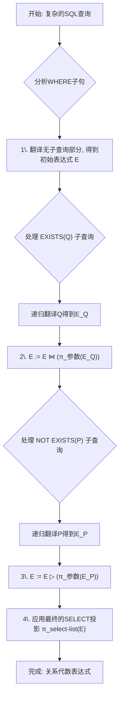

## AI论文解读 | Translating Sql Into Relational Algebra: Optimization, Semantics, And Equivalence Of Sql Queries
        
### 作者        
digoal        
        
### 日期        
2025-10-02       
        
### 标签        
PostgreSQL , PolarDB , DuckDB , AI , 论文解读        
        
----        
        
## 背景  
      
https://cs.ulb.ac.be/public/_media/teaching/infoh417/sql2alg_eng.pdf        
  
提示:          
```          
读懂《Translating Sql Into Relational Algebra: Optimization, Semantics, And Equivalence Of Sql Queries》这篇论文需要提前掌握哪些基础知识, 请使用中文通熟易懂的讲解这些基础知识, 可以引用论文中的图、表或使用Markdown支持的图形(text,mermaid等)增加解释性. 
  
使用中文通熟易懂的解读《Translating Sql Into Relational Algebra: Optimization, Semantics, And Equivalence Of Sql Queries》这篇论文, 其中的关键内容请着重讲解, 可以引用论文中的图、表或使用Markdown支持的图形(text,mermaid等)增加解释性. 
  
提取《Translating Sql Into Relational Algebra: Optimization, Semantics, And Equivalence Of Sql Queries》这篇论文中的重要术语, 使用中文对这些术语进行通熟易懂的讲解, 可以引用论文中的图、表或使用Markdown支持的图形(text,mermaid等)增加解释性. 
```     
  
## 1 前置知识 
  
好的，这篇文档《Translating SQL into the Relational Algebra》是关于如何将 **SQL 查询** 转换为 **关系代数表达式** 的笔记。要读懂它，你需要掌握以下几个核心基础知识：

-----

## 1\. 关系数据模型 (Relational Data Model)

这是所有数据库理论的基石。

  * **关系 (Relation) / 表 (Table):** 在数据库中，数据被组织成表格形式，每个表格就是一个“关系” 。
  * **元组 (Tuple) / 行 (Row):** 表格中的每一行数据 。
  * **属性 (Attribute) / 列 (Column):** 表格中的每一列，代表数据的某个特性 。
  * **模式 (Schema):** 描述一个关系的结构，包括关系名和属性列表 。
  * **主键 (Primary Key):** 关系中用来唯一标识每个元组（行）的一个或一组属性。在文档的示例中，主键属性带有下划线 。

**示例数据库模式 (Example Database Schema from TCB Figure 2.5):**
这是文档后续所有例子使用的基础，你必须熟悉这些表和它们的列 。

| 关系名 (Relation) | 属性 (Attributes) | 含义 |
| :--- | :--- | :--- |
| **Movie** | $\underline{title}, \underline{year}$ , length, genre, studioName, producerC\# | 电影信息，主键是 (title, year)  |
| **MovieStar** | $\underline{name}$ , address, gender, birthdate | 影星信息，主键是 name  |
| **StarsIn** | $\underline{movieTitle}, \underline{movieYear}, \underline{starName}$ | 电影和影星的参演关系，主键是所有属性  |
| **MovieExec** | $\underline{name}$ , address, $\underline{CERT\#}$ , netWorth | 电影高管信息，主键是 CERT\#  |
| **Studio** | $\underline{name}$ , address, presC\# | 制片厂信息，主键是 name  |

-----

## 2\. 关系代数 (Relational Algebra)

关系代数是一种形式化的查询语言，它定义了对关系进行操作的基本运算。SQL 查询最终要被转换为关系代数表达式，才能被数据库系统执行 。

文档提到了两种关系代数：

### 2.1. 基础的“集合”关系代数 (Set-based Relational Algebra)

这是最基础的版本，处理的结果中**没有重复的行**（元组） 。你需要了解它的基本操作：

  * **选择 ( $\sigma$ - Selection ):** 筛选出满足某个条件的元组（行）。
      * 例如： $\sigma_{birthdate=1960} (\text{MovieStar})$ 找出所有出生年份是 1960 的影星 。
  * **投影 ( $\pi$ - Projection ):** 筛选出需要的属性（列）。
      * 例如： $\pi_{name} (\text{MovieStar})$ 只保留影星的名字列 。
  * **笛卡尔积 ( $\times$ - Cartesian Product ):** 将两个关系的所有元组进行两两组合 。
      * 例如： $\text{StarsIn} \times \text{MovieStar}$ 将两个表的所有行组合起来 。
  * **并 ( $\cup$ - Union ), 交 ( $\cap$ - Intersect ), 差 ( $-$ - Except ):** 集合操作，要求操作数有相同的属性集合 。
  * **重命名 ( $\rho$ - Rename ):** 给关系或属性起别名，文档中用于 FROM 子句中的别名 。
      * 例如： $\rho_{T_{2}}(R_{2})$ 将关系 $R_{2}$ 重命名为 $T_{2}$ 。

### 2.2. 扩展的“包”关系代数 (Bag-based Relational Algebra & Extension)

实际的 SQL 使用**包语义 (Bag-based Semantics)**，这意味着**结果中可以包含重复的行**（元组） 。文档后续的翻译过程使用了**扩展关系代数**，它包含更高级的操作符 。

  * **自然连接 ( $\bowtie$ - Natural Join ):** 一种特殊的连接，它基于两个关系中**同名的共享属性**进行等值连接，并只保留一组共享属性 。
  * **$\theta$ 连接 ( $\bowtie_\theta$ - Theta-Join ):** 基于任意条件 $\theta$ 的连接。
      * 例如： $\text{Movie} \underset{title=\text{movieTitle} \land year=\text{movieYear}}{\bowtie} \text{StarsIn}$ 。
  * **分组聚合 ( $\gamma$ - Grouping and Aggregation ):** 用于实现 SQL 中的 `GROUP BY` 和聚合函数（如 `SUM`, `MIN`, `COUNT` 等）。
      * 例如： $\gamma_{name, \text{MIN}(year), \text{SUM}(\text{length})} (\text{MovieExec} \times \text{Movie})$ 。
  * **反连接 ( $\overline{\times}$ - Anti-Join ):** 用于处理 `NOT EXISTS` 子查询。 $R \overline{\times} S$ 找出 $R$ 中那些在 $S$ 中没有匹配元组的行 。
  * **外连接 ( $\underset{o}{\bowtie}$ - Outer Join ):** 例如右外连接 ( $\underset{o}{\bowtie_R}$ )，用于处理 `COUNT` bug 。

-----

## 3\. SQL 查询语言结构 (SQL Query Language Structure)

你需要熟悉 SQL-92 的基本查询结构，这是文档关注的重点 。

### 3.1. SELECT-FROM-WHERE 语句

这是最基本的查询形式:

```sql
SELECT Select-list   -- 要输出的列/表达式
FROM R1, R2 T2, ... -- 参与查询的表，可以有别名（T2）
WHERE Where-condition -- 筛选条件
```

**基础翻译规则 (Section 2):**
一个不包含子查询的 `SELECT-FROM-WHERE` 语句，其翻译是一个组合操作：
$$\pi_{\text{Select-list}} (\sigma_{\text{Where-condition}} (R_{1} \times \cdots \times \rho_{T_{2}}(R_{2}) \times \cdots))$$
**翻译步骤:**

1.  **笛卡尔积/重命名:** 将 `FROM` 后的所有关系进行笛卡尔积，并应用别名 $\rho$ 。
2.  **选择:** 应用 `WHERE` 子句中的条件 $\sigma$ 。
3.  **投影:** 应用 `SELECT` 子句中的列 $\pi$ 。

### 3.2. WHERE 子查询的归一化 (Normalizing Where-subqueries)

文档简化了子查询的类型：所有复杂的子查询 (`IN`, `ANY`, `ALL`, `=`, `<>`) 都可以被改写成只包含 **`EXISTS`** 或 **`NOT EXISTS`** 的形式 。

  * **`IN` 转换为 `EXISTS` (Example 2):**
    ```sql
    ... WHERE starName IN (SELECT name FROM MovieStar WHERE birthdate = 1960)
    -- 等价于
    ... WHERE EXISTS (SELECT name FROM MovieStar 
                      WHERE birthdate = 1960 AND name = starName) 
    ```
      * 你需要能够识别这种转换，理解 `starName = name` 是如何将外部查询和子查询关联起来的 。

-----

## 4\. 复杂查询概念

### 4.1. 关联子查询 (Correlated Subqueries) 和上下文关系 (Context Relations)

这是翻译复杂 SQL 的核心难点 。

  * **关联子查询:** 子查询（内层查询）中引用了外部查询（外层查询）中关系（表）的属性 。
  * **上下文关系:** 外部查询中，子查询引用了其属性的关系 。
  * **参数 (Parameters):** 上下文关系的所有属性，这些属性将外部查询的结果传递给子查询 。

**翻译关联子查询的修改 (Section 4):**
当翻译一个**作为子查询**的 `SELECT-FROM-WHERE` 语句时，必须进行两项修改:

1.  **向笛卡尔积中添加所有上下文关系** 。
2.  **向投影 ( $\pi$ ) 中添加所有参数 (上下文关系的所有属性)** 。

### 4.2. 子查询的去关联 (De-correlation of Subqueries)

文档的核心目标是把带有 `EXISTS` 或 `NOT EXISTS` 的关联子查询，转换成**关系代数中的连接或反连接**操作，从而“去关联” 。

  * **`EXISTS(Q)` 的去关联 (Section 5.2):**
    它被翻译为**自然连接 ( $\bowtie$ )**。将外部查询的部分关系代数表达式 $E$ 与翻译后的子查询 $E_{Q}$ 的**参数空间投影** $\pi_{A_{1}, \ldots, A_{p}}(E_{Q})$ 进行连接 。

    $$E := E \\bowtie \\pi\_{A\_{1}, \\ldots, A\_{p}}(E\_{Q})$$
    
    * **优化:** 可以从 $E$ 中移除 $Q$ 的上下文关系 。

  * **`NOT EXISTS(P)` 的去关联 (Section 5.3):**
    它被翻译为**反连接 ( $\overline{\times}$ )**。将外部查询的表达式 $E$ 与 $E_{P}$ 的**参数空间投影**进行反连接 。

    $$E := E \\overline{\\times} \\pi\_{A\_{1}, \\ldots, A\_{p}}(E\_{P})$$
    
    * **注意:** 在这种情况下，**不能**移除上下文关系 。

### 4.3. 非合取 WHERE 条件 (The Non-conjunctive Case)

如果 `WHERE` 条件不是简单的 `AND`（合取）连接，可以利用 **De Morgan 定律**和**分配律**将其重写为**析取范式 (Disjunctive Normal Form, DNF)**，即 `OR`（析取）连接的 `AND`（合取）子句 。

  * **翻译方式:** 将 DNF 中的每个 `OR` 转换为 **`UNION`** 操作，每个 `AND` 块再使用 Section 5 的方法翻译 。

掌握这些基础知识，尤其是**关系代数的操作符及其功能**，以及**关联子查询的“上下文关系”和“参数”概念**，你就能理解文档是如何一步步将 SQL 语句分解并转换为等价的关系代数表达式的。
  
## 2 解读论文 
  
好的，非常乐意为您通俗易懂地解读这篇关于将SQL查询转换为关系代数的论文。这篇由Jan Van den Bussche和Stijn Vansummeren撰写的技术文章，其核心主旨是系统性地介绍如何将复杂的SQL查询语句，一步步“翻译”成由数学符号表达的“关系代数”表达式。

这个“翻译”过程至关重要，因为关系代数是数据库系统内部用来理解、优化和执行SQL查询的理论基础。您可以将其想象成：我们用日常语言（SQL）告诉数据库我们想要什么数据，而数据库则需要先将我们的指令翻译成一套严谨、无歧义的逻辑语言（关系代数），然后才能规划出最高效的取数路径。

### 核心思想：逐层分解，化繁为简

论文的核心策略是将一个复杂的SQL查询分解为多个可处理的部分，并针对不同部分采用不同的翻译规则，最终组合成一个完整的关系代数表达式。整个过程就像剥洋葱一样，从最简单的结构入手，层层深入，直至处理最复杂的嵌套和关联情况。

-----

### 1\. 从最简单的查询开始：`SELECT-FROM-WHERE`

论文首先从最基础的SQL查询结构入手。一个不包含子查询的`SELECT-FROM-WHERE`语句是翻译的起点。

  * **SQL语句结构**：

    ```sql
    SELECT <列名列表>
    FROM <表1>, <表2>, ...
    WHERE <筛选条件>;
    ```

  * **翻译三部曲** ：

    1.  **FROM** 子句 → **笛卡尔积 (×)**：将`FROM`后面的所有表进行笛卡尔积运算，即将所有表的所有行任意组合在一起，形成一个非常大的中间表 。如果表有别名（如 `FROM R R1`），则对应关系代数中的**重命名 (ρ)** 操作 。
    2.  **WHERE** 子句 → **选择 (σ)**：在笛卡尔积产生的大表上，应用`WHERE`后面的条件进行筛选，只保留满足条件的行 。
    3.  **SELECT** 子句 → **投影 (π)**：最后，根据`SELECT`后面指定的列名，从筛选后的结果中只挑选出这几列 。

**论文中的例子** ：

假设要查询1960年出生的影星出演了哪些电影。

  * **SQL 查询**:

    ```sql
    SELECT movieTitle
    FROM StarsIn, MovieStar
    WHERE starName = name AND birthdate = 1960;
    ```

  * **关系代数翻译** ：
    $$\pi_{movieTitle}(\sigma_{starName=name \land birthdate=1960}(StarsIn \times MovieStar))$$

这个表达式的解读顺序和SQL的执行逻辑类似，但恰好与书写顺序相反：

1.  `StarsIn × MovieStar`：先将`StarsIn`（演员出演信息）和`MovieStar`（演员信息）两张表做笛卡尔积。
2.  `σ_starName=name...`：然后筛选出演员名字匹配且出生日期是1960年的记录。
3.  `π_movieTitle`：最后只提取出`movieTitle`（电影标题）这一列。

-----

### 2\. 关键难点：处理`WHERE`子句中的子查询

当`WHERE`子句中出现嵌套的子查询时，翻译变得复杂，尤其是 **关联子查询（Correlated Subqueries）** 。这种子查询的计算依赖于外部查询的某些值。

#### 2.1 统一子查询形式：标准化为`EXISTS`和`NOT EXISTS`

为了简化处理流程，论文提出，无论子查询最初是用`IN`, `NOT IN`, `> ALL`, `< ANY`等何种形式，都可以先统一转换成等价的`EXISTS`（存在）或`NOT EXISTS`（不存在）的形式 。这是一种预处理步骤，使得后续的翻译规则更加统一。

例如，`starName IN (SELECT ...)`可以被改写为`EXISTS (SELECT ... AND name = starName)`的形式 。

#### 2.2 核心概念：上下文关系（Context Relations）

这是理解关联子查询翻译的关键。当一个子查询引用了外部查询中的表的列时，这个外部的表就被称为该子查询的“**上下文关系**” 。外部查询传给子查询的这些列值，则被称为“**参数**” 。

**论文中的例子** ：

查询所有由1960年出生的演员出演的电影。

```sql
SELECT movieTitle
FROM StarsIn -- 这是外部查询的表
WHERE EXISTS (SELECT name
              FROM MovieStar
              WHERE birthdate = 1960 AND name = StarsIn.starName); -- 引用了外部的starName
```

在这个例子中，`StarsIn`就是子查询的“上下文关系”，而`StarsIn.starName`等`StarsIn`表的所有列就是“参数” 。

#### 2.3 翻译子查询：带上“上下文”一起玩

翻译一个关联子查询时，不能孤立地进行。必须将它的**上下文关系**也加入到子查询的`FROM`部分（即笛卡尔积）中 ，并且在最终的投影（π）操作中，必须保留从外部传入的**参数**列 。

**论文中的例子翻译** ：
上面SQL中的子查询，翻译出来是这样的：
$$\pi_{movieTitle, movieYear, starName, name}(\sigma_{birthdate=1960 \land name=starName}(StarsIn \times MovieStar))$$
注意，这里的笛卡尔积包含了上下文关系`StarsIn`，并且投影操作`π`也保留了`StarsIn`的所有属性（即参数），这是为了让子查询的结果能和外部查询的每一行对应起来。

-----

### 3\. 最核心的步骤：子查询的“去关联化”（De-correlation）

这是论文的精华部分。直接翻译的关联子查询效率很低，因为它可能需要对外部查询的每一行都执行一遍。数据库优化的关键一步就是“去关联化”，即将子查询改写成等价的连接（Join）操作，从而可以一次性计算。

论文给出了一个四步翻译法来处理包含`EXISTS`和`NOT EXISTS`的`WHERE`子句 ：

1.  **翻译无子查询部分**：首先，处理`WHERE`条件中不涉及子查询的普通筛选条件（如 `age > 20`），得到一个初始的关系代数表达式`E` 。

2.  **去关联化`EXISTS`子查询**：

      * 对于每一个`EXISTS(Q)`，先递归地将子查询`Q`翻译成关系代数表达式`E_Q`。
      * 然后，将上一步得到的`E`与`E_Q`关于**公共参数**进行**自然连接 (⋈)** 。这里的连接操作，本质上就是用子查询的结果来“过滤”外部查询的行。只有那些能在`E_Q`中找到对应参数匹配的行才会被保留。
      * 论文还提到了一个优化：在连接后，可以从`E`中移除已经包含在`E_Q`参数里的上下文关系，避免数据冗余 。

3.  **去关联化`NOT EXISTS`子查询**：

      * 对于`NOT EXISTS(P)`，同样先将`P`翻译成`E_P`。
      * 这次不是用连接，而是用**反连接 (▷)** 操作 。反连接的语义是：保留`E`中所有**不存在**于`E_P`参数空间中的行。也就是说，如果外部查询的某行所对应的参数在子查询`E_P`中能计算出结果，那么这行就会被剔除 。

4.  **应用最终投影**：所有`WHERE`条件都处理完毕后，最后应用`SELECT`子句指定的投影（π），选出最终需要的列 。

这个流程可以用以下示意图来理解：



-----

### 4\. 其他SQL特性的翻译

论文还覆盖了SQL的其他重要功能：

  * **集合操作 (`UNION`, `INTERSECT`, `EXCEPT`)** ：

      * 这些操作直接对应关系代数中的 `∪` (并), `∩` (交), `−` (差) 。
      * 一个难点是，当操作的两个子查询具有不同的上下文关系时，它们的列（Schema）会不一致，无法直接进行集合运算 。论文的解决方案是“ **填充（padding）** ” ：通过与缺失的上下文关系做笛卡尔积，手动将两边的列补齐，使它们的结构一致后再进行运算 。

  * **`GROUP BY` 和 `HAVING`** ：

      * 这对应关系代数中的**分组和聚合 (γ)** 操作 。
      * 翻译过程是：先完成`FROM-WHERE`部分的翻译得到表达式`E`，然后对`E`应用`γ`操作。`γ`会根据`GROUP BY`的列进行分组，并计算`SELECT`和`HAVING`中指定的聚合函数（如 `SUM`, `MIN`） 。之后，`HAVING`条件会作为`σ`选择操作作用在聚合结果之上 。

  * **FROM子句中的子查询** ：

      * 这种情况比较简单。`FROM`子句中的每个子查询被独立翻译成一个关系代数表达式，然后这些表达式之间再进行笛卡尔积或连接 。
      * 论文还提到了SQL-99标准中的`LATERAL`子查询，这种子查询可以引用它前面`FROM`列表中的表。这在翻译时对应为**自然连接**，而不是笛卡尔积 。

-----

### 5. 一个特殊的“坑”：The Count Bug 

论文最后提到了一个有趣的特例，即在关联子查询中单独使用`COUNT`聚合函数时可能出现的问题。

  * **问题**：如果一个`COUNT`子查询对于某个外部行返回的结果是空集，标准的翻译方法（基于内连接或笛卡尔积）会直接把这行外部行丢弃掉，导致结果错误。因为`COUNT`一个空集应该得到0，而不是没有结果 。
  * **解决方案**：在这种特定情况下，需要用**外连接 (Outer Join)** 来代替标准的笛卡尔积或内连接 。外连接可以确保即使子查询没有匹配的结果，外部查询的行也会被保留下来（对应的子查询结果列会填充为NULL），之后聚合算子`γ`需要特殊处理，将`COUNT(NULL)`计为0，从而得到正确的结果 。

### 总结

这篇论文为将SQL语言转换为关系代数提供了一套全面且严谨的算法框架。它通过**标准化、递归、去关联化**等一系列步骤，系统性地解决了简单查询、集合操作、聚合以及各种复杂子查询（尤其是在`WHERE`、`FROM`和`SELECT`子句中）的翻译问题。其核心贡献在于清晰地定义了如何处理“关联子查询”，通过引入“上下文关系”和“参数”的概念，并利用**连接**和**反连接**操作将其等价地转换为非关联的形式，为数据库的查询优化奠定了理论基础。
  
## 3 术语 
  
好的，根据提供的文档《Translating SQL into the Relational Algebra》，我为您提取并讲解了其中的重要术语。这些术语是理解 SQL 如何被转换为关系代数表达式的核心概念 。

---

## 核心基础概念

### 1. 关系代数 (Relational Algebra)
关系代数是一种**形式化的查询语言** ，用于描述对关系（表）的操作，它是数据库系统内部执行 SQL 查询的逻辑基础 。

* **集合关系代数 (Set-based Relational Algebra):** 结果中**不包含**重复的元组（行）。
* **包关系代数 (Bag-based Relational Algebra):** 结果中**允许出现**重复的元组（行），这是 SQL 实际使用的语义基础 。
* **扩展关系代数 (Extended Relational Algebra):** 包含了分组聚合 ( $\gamma$ )、自然连接 ( $\bowtie$ )、外连接 ( $\underset{o}{\bowtie}$ ) 等高级操作符 。

### 2. 逻辑查询计划 (Logical Query Plan)
逻辑查询计划是 **关系代数表达式** 的另一种说法 。它是数据库系统在执行 SQL 之前生成的一个抽象表示，描述了应该如何一步步操作表来获得查询结果 。

### 3. SQL-92 子集 (SQL-92 Subset)
这是 SQL 语言中传统的“**核心**”部分 ，包括基本的 `SELECT-FROM-WHERE` 查询、聚合等功能 。文档中所有翻译规则都集中在这个子集上 。

### 4. 关系 (Relation) 和模式 (Schema)
* **关系 (Relation):** 即数据库中的**表** 。
* **模式 (Schema):** 描述一个关系的结构，包括属性（列）的名称和类型 。
* **主键 (Primary Key):** 用下划线标注的属性，用于唯一标识关系中的每一个元组（行）。

**示例模式 (Example Schema)**:
* **Movie**( $\underline{title}: string, \underline{year}: int$ , length: int, genre: string, studioName: string, producer C\#: int ) 
* **MovieStar**( $\underline{name}: string$ , address: string, gender: char, birthdate: date ) 

---

## SQL 语句翻译的核心操作符

### 5. 选择 ( $\sigma$ - Selection )
对应 SQL 中的 **`WHERE`** 子句 。它根据指定的条件 ( $\text{Where-condition}$ ) 从关系中筛选出行（元组）。
$$\sigma_{\text{Where-condition}} (R)$$

### 6. 投影 ( $\pi$ - Projection )
对应 SQL 中的 **`SELECT`** 列表 。它从关系中选择出指定的列（属性）。
$$\pi_{\text{Select-list}} (R)$$

### 7. 笛卡尔积 ( $\times$ - Cartesian Product )
对应 SQL 中 `FROM` 子句列出的**所有关系**之间的组合 。它将所有关系中的元组进行两两组合 。
$$R_1 \times R_2 \times \cdots$$

### 8. 重命名 ( $\rho$ - Rename )
用于给关系（表）赋予**别名** 。例如，在 `FROM R R2` 中， $\rho_{R_2}(R)$ 将关系 $R$ 重命名为 $R_2$ 。重命名确保当一个关系在查询中出现多次时，每次出现都有一个唯一的名称 。
$$\rho_{T_{2}}(R_{2})$$

### 9. 分组聚合 ( $\gamma$ - Grouping and Aggregation )
对应 SQL 中的 **`GROUP BY`** 和聚合函数（如 `SUM`, `COUNT`, `MIN` 等）。它将关系中的元组按指定的分组属性分组，并对每组计算聚合值 。

**格式:** $\gamma_{\text{Group-list}, \text{Agg-list}}(E)$ 。
* **Group-list:** `GROUP BY` 后的属性列表 。
* **Agg-list:** 聚合操作（ 如 $\text{SUM}(\text{length})$ ）。

---

## 处理复杂查询的关键机制

### 10. 关联子查询 (Correlated Subqueries)
指**子查询**（内层查询）中引用了**外部查询**（外层查询）中的属性 。
* **示例:** `SELECT movieTitle FROM StarsIn WHERE EXISTS (SELECT name FROM MovieStar WHERE name = starName)` 。子查询使用了外部关系 `StarsIn` 的 `starName` 属性.

### 11. 上下文关系 (Context Relations)
子查询引用了其属性的**外部关系**（表）。
* **示例:** 在上面的关联子查询中，`StarsIn` 是子查询的上下文关系 。

### 12. 参数 (Parameters)
**上下文关系的所有属性** 。这些属性将外部查询的结果传递给子查询。在将子查询翻译成关系代数时，所有参数必须被添加到最终的投影 ( $\pi$ ) 中 。

### 13. EXISTS 和 NOT EXISTS 形式
所有复杂的 `WHERE` 子查询 (`IN`, `ANY`, `ALL`, `=`, `<>`) 都可以被等价地重写成只包含 **`EXISTS`** 或 **`NOT EXISTS`** 的形式 。这是翻译算法的前提 。

### 14. 反连接 ( $\overline{\times}$ - Anti-Join )
用于翻译 **`NOT EXISTS`** 子查询 。反连接 $R \overline{\times} S$ 定义为 $R - (R \bowtie S)$ ，即找出 $R$ 中所有在 $S$ 中**没有**匹配元组的行.

### 15. 去关联 (De-correlation)
指将**关联子查询**转换成**关系代数中的连接** ( $\bowtie$ ) **或反连接** ( $\overline{\times}$ ) 操作 。
* **`EXISTS(Q)` 的去关联:** 通过与子查询 $E_Q$ 的**参数空间投影** $\pi_{A_{1}, \ldots, A_{p}}(E_Q)$ 进行**连接** ( $\bowtie$ ) 来实现 。
* **`NOT EXISTS(P)` 的去关联:** 通过与子查询 $E_P$ 的**参数空间投影**进行**反连接** ( $\overline{\times}$ ) 来实现 。

### 16. 析取范式 (Disjunctive Normal Form, DNF)
指将任意复杂的 `WHERE` 条件重写为由 **`OR`**（析取）连接起来的若干个 **`AND`**（合取）子句的形式 。这种重写允许通过将 `OR` 转换为 **`UNION`** 操作来翻译非合取条件的查询 。

---

## 优化和特殊情况

### 17. 标量子查询 (Scalar Subqueries)
出现在 `SELECT` 列表中的子查询 ，它必须**始终只返回一个值** 。
* **翻译方法:** 标量子查询可以被重写为 **`LATERAL`** 子查询，从而统一翻译流程 。

### 18. LATERAL 子查询 (Lateral Subqueries)
出现在 `FROM` 列表中的子查询，它可以**引用**在其**前面**列出的关系或子查询的属性 。
* **翻译方法:** 将 `FROM` 列表的笛卡尔积替换为对参数的**自然连接** 。

### 19. COUNT Bug
特指使用 `COUNT` 但**没有** `GROUP BY` 子句的子查询，当子查询条件筛选出**空集**时，关系代数的普通连接翻译会出错 。
* **解决方案:** 必须将笛卡尔积替换为 **外连接** (Outer Join)，以保留即使没有匹配元组的参数（上下文行），从而使 `COUNT` 的结果为 0 。
  
## 参考        
         
https://cs.ulb.ac.be/public/_media/teaching/infoh417/sql2alg_eng.pdf    
        
<b> 以上内容基于DeepSeek、Qwen、Gemini及诸多AI生成, 轻微人工调整, 感谢杭州深度求索人工智能、阿里云、Google等公司. </b>        
        
<b> AI 生成的内容请自行辨别正确性, 当然也多了些许踩坑的乐趣, 毕竟冒险是每个男人的天性.  </b>        
    
  
#### [期望 PostgreSQL|开源PolarDB 增加什么功能?](https://github.com/digoal/blog/issues/76 "269ac3d1c492e938c0191101c7238216")
  
  
#### [PolarDB 开源数据库](https://openpolardb.com/home "57258f76c37864c6e6d23383d05714ea")
  
  
#### [PolarDB 学习图谱](https://www.aliyun.com/database/openpolardb/activity "8642f60e04ed0c814bf9cb9677976bd4")
  
  
#### [PostgreSQL 解决方案集合](../201706/20170601_02.md "40cff096e9ed7122c512b35d8561d9c8")
  
  
#### [德哥 / digoal's Github - 公益是一辈子的事.](https://github.com/digoal/blog/blob/master/README.md "22709685feb7cab07d30f30387f0a9ae")
  
  
#### [About 德哥](https://github.com/digoal/blog/blob/master/me/readme.md "a37735981e7704886ffd590565582dd0")
  
  

  
