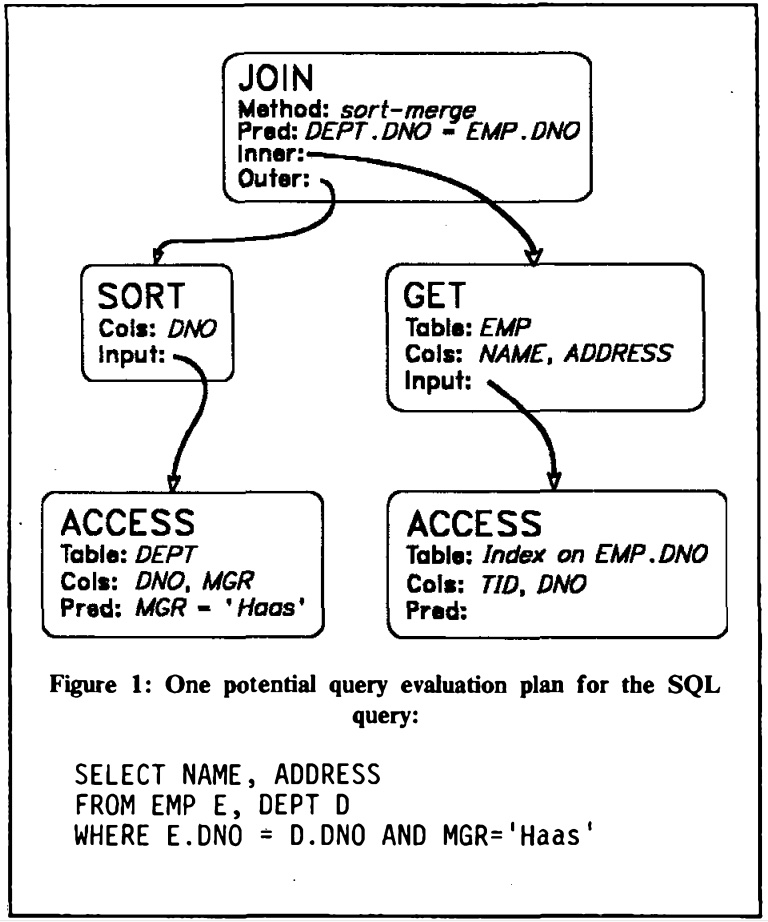
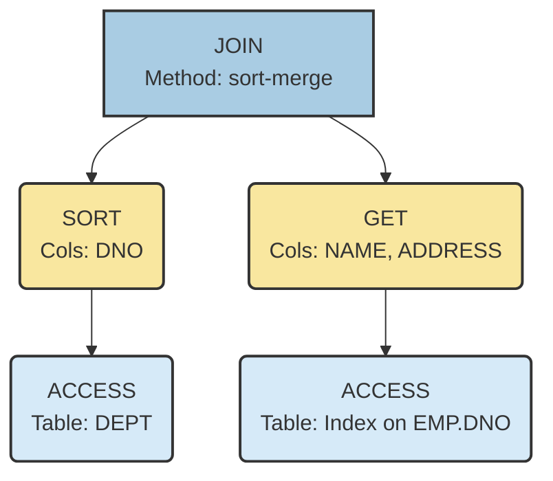
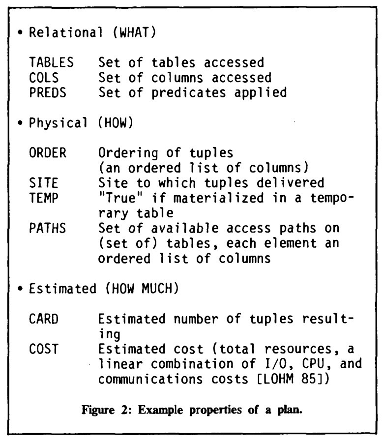
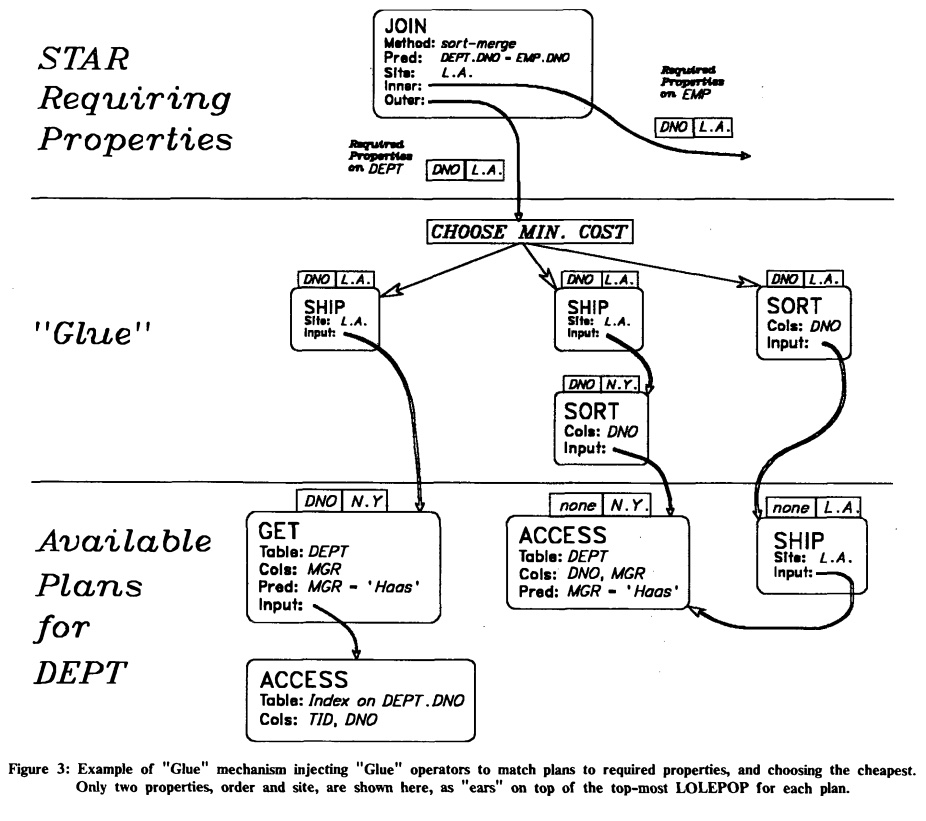
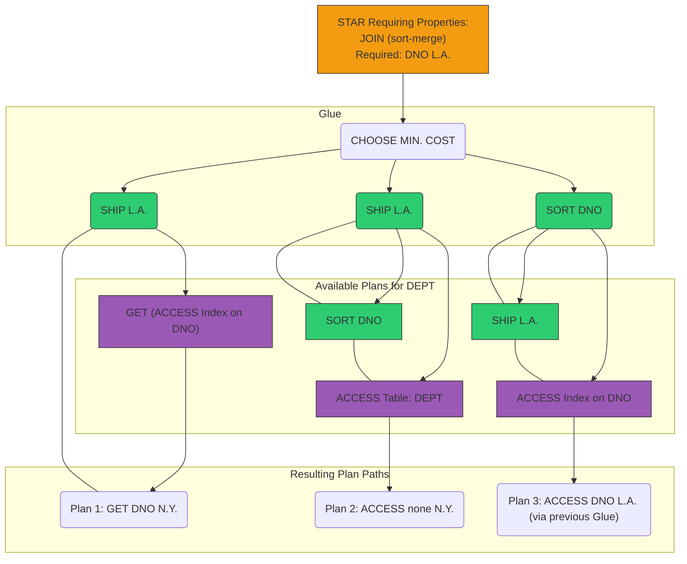
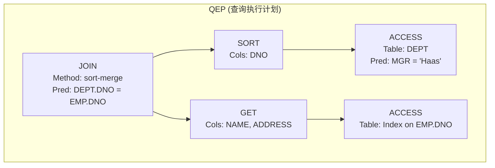
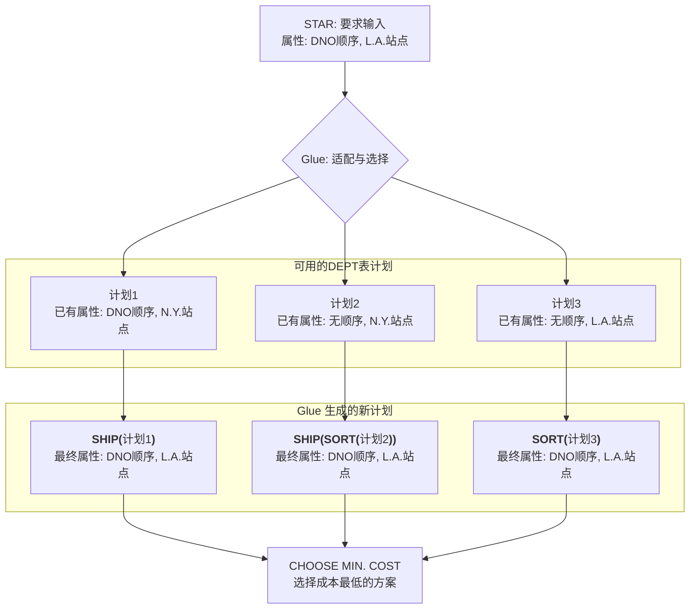
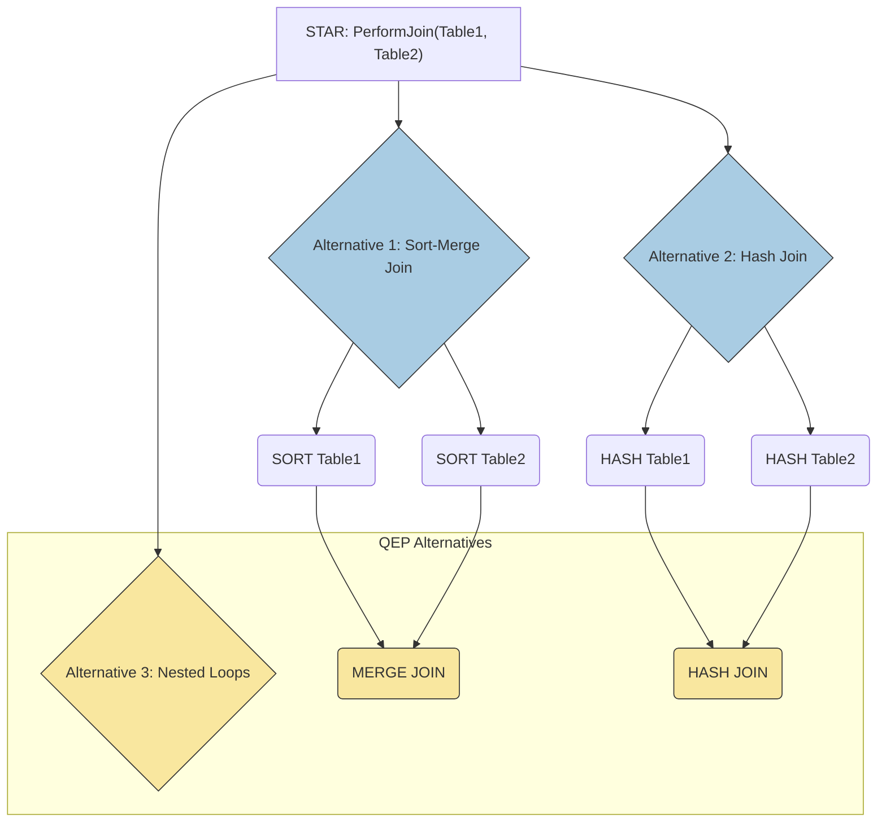
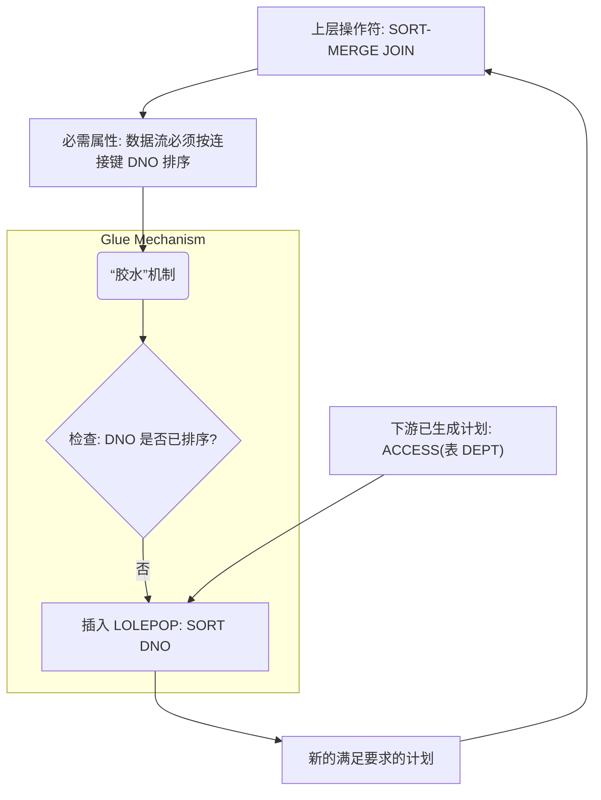

## AI论文解读 | Grammar-Like Functional Rules For Representing Query Optimization Alternatives
        
### 作者        
digoal        
        
### 日期        
2025-10-02       
        
### 标签        
PostgreSQL , PolarDB , DuckDB , AI , 论文解读        
        
----        
        
## 背景  
      
https://dl.acm.org/doi/pdf/10.1145/971701.50204        
  
提示:          
```          
读懂《Grammar-Like Functional Rules For Representing Query Optimization Alternatives》这篇论文需要提前掌握哪些基础知识, 请使用中文通熟易懂的讲解这些基础知识, 可以引用论文中的图、表或使用Markdown支持的图形(text,mermaid等)增加解释性. 
  
使用中文通熟易懂的解读《Grammar-Like Functional Rules For Representing Query Optimization Alternatives》这篇论文, 其中的关键内容请着重讲解, 可以引用论文中的图、表或使用Markdown支持的图形(text,mermaid等)增加解释性. 
  
提取《Grammar-Like Functional Rules For Representing Query Optimization Alternatives》这篇论文中的重要术语, 使用中文对这些术语进行通熟易懂的讲解, 可以引用论文中的图、表或使用Markdown支持的图形(text,mermaid等)增加解释性. 
```     
  
## 1 前置知识 
  
要读懂《Grammar-Like Functional Rules For Representing Query Optimization Alternatives》（用于表示查询优化备选方案的类似语法的功能规则）这篇论文，您需要掌握以下三个主要领域的基础知识。

这篇论文的核心在于提出了一种 **“构造式”（Constructive）** 、可扩展（Extensible）的数据库查询优化方法，它结合了数据库操作符、形式语法和 **函数式编程** 的理念。

-----

## 1\. 数据库查询优化的基础 (Database Query Optimization)

这是理解论文目的的前提。

| 概念 | 中文解释 | 核心作用 |
| :--- | :--- | :--- |
| **查询优化器** (Query Optimizer) | 数据库管理系统（DBMS）的核心组件。 | 将用户输入的**声明式 SQL 语句**（只说“要什么”）转换成计算机能执行的**过程式执行计划**（规定“怎么做”） 。 |
| **执行计划** (Query Execution Plan, QEP) | 完成查询的一系列操作步骤，通常表示为一个**有向图**或**操作符的嵌套结构** 。 | 优化器会从数千种可能的 QEP 中，选择**预计成本（COST）最低**的一个 。 |
| **关系代数操作符** (Relational Operators) | 组成 QEP 的基本操作。在论文中被称为 **LOLEPOP** (Low-LEvel Plan Operator，低级计划操作符) 。 | 它们是执行计划的“**终端符号**”（Terminal），如：<br>• **ACCESS**：访问表或索引 。<br>• **JOIN**：连接表 。<br>• **SORT**：排序 。<br>• **SHIP**：数据传输（用于分布式）。|

### 📚 图解：查询执行计划（QEP）的结构

**图 1** 展示了一个查询的潜在执行计划（QEP）。理解 QEP 就是一个由基本操作符（LOLEPOP）构成的流程图是关键：

  



**关键理解：**

  * 每个操作符（如 ACCESS、SORT）都接受一个或两个表流作为**输入**，并产生一个表流作为**输出** 。
  * 这个计划使用了 **sort-merge JOIN**（归并连接）方法 。因此，它要求两个输入流（DEPT 和 EMP）都必须按连接键（DNO）排序。这就是为什么 DEPT 流在 ACCESS 之后，需要一个额外的 **SORT** 操作 。

-----

## 2\. 论文核心：功能规则与语法 (Functional Rules and Grammar)

这篇论文的创新点在于用一套 **“类似语法”** 的规则来 **构造** （Construct）执行计划，而非传统方法中的 **“转换”** （Transform）执行计划 。

| 概念 | 中文解释 | 类比 |
| :--- | :--- | :--- |
| **STARs (Strategy Alternative Rules)** | **策略替代规则**。论文提出的核心机制 。 | **形式语法**中的**非终端符号**（Non-terminal）或**数学函数** 。 |
| **功能规则** (Functional Rules) | STARs 的形式。它像一个带参数的函数定义 。一个 STAR 可以包含**一个或多个**替代定义，每个定义对应一种可行的策略 。 | 例如，`OrderedStream(T, order)` 可以通过 `SORT(ACCESS(T))` 实现（替代 1），也可以通过直接访问**已排序的索引**实现（替代 2） 。 |
| **参数化** (Parametrization) | STARs 接受参数，并且每个替代定义可以带有**复杂的适用条件（Condition of applicability）** 。 | 这使得规则既灵活又精确，能根据具体查询环境（如索引是否存在）动态选择最佳方案 。 |

-----

## 3\. 创新机制：计划属性与“胶水” (Properties and Glue)

这是论文中最具工程意义的创新部分，解决了如何让不同的操作符协作的问题。

### A. 计划属性（Plan Properties）

每个操作符（LOLEPOP）的输出（即数据流）都带有一个**属性向量**，用于描述其特征、状态和成本 。

**图 2** 总结了这些属性，它们分为三类：

  

| 属性类型 | 示例属性 | 含义 |
| :--- | :--- | :--- |
| **关系属性 (Relational)** (是什么) | **TABLES**, **COLS**, **PREDS** | 描述流的逻辑内容：包含哪些表、哪些列，已应用了哪些筛选条件 。 |
| **物理属性 (Physical)** (如何产生) | **ORDER** (顺序), **SITE** (地点) | 描述流的物理形态：元组是否按特定列排序，流数据驻留的机器站点 。 |
| **估算属性 (Estimated)** (需要多少) | **CARD** (基数), **COST** (成本) | 优化器最关心的：预计的元组数量，以及生成该流所花费的 I/O、CPU 和通信总资源 。 |

### B. “胶水”机制（The Glue Mechanism）

**“胶水”** 是论文中提出的一个核心机制，它能自动确保输入计划满足上层操作符所 **要求（Required）** 的特定物理属性 。

  * **需求与提供：** 上层的 STAR/LOLEPOP（如 Merge Join）可能**要求**其输入流必须是“按 DNO 排序”且“位于 L.A. 站点” 。
  * **胶水作用：** 如果下层已生成的**可用计划（Available Plan）不满足这些要求，Glue 机制会自动在可用计划的上方注入**必要的“胶水操作符”：
      * 为满足 **ORDER** 属性，可能插入 **SORT** LOLEPOP 。
      * 为满足 **SITE** 属性，可能插入 **SHIP** LOLEPOP 。
  * **选择最低成本：** Glue 机制会评估所有经过“粘贴”和未经过“粘贴”的**满足要求**的计划，然后选择其中**总成本最低**的一个 。

### 🛠️ 图解：Glue 机制如何工作

**图 3** 直观地展示了 Glue 机制如何匹配要求和可用计划。

  

在这个例子中，上层的 **JOIN** 操作要求 **DEPT 表流**必须满足 `DNO L.A.`（按 DNO 排序，并送至 L.A. 站点）。



**工作流程（简化）：**

1.  **可用计划 1 (Plan 1)：** 它已经按 DNO 排序（`DNO N.Y.`），但 SITE 不对。Glue 插入 **SHIP L.A.**，使其满足 `DNO L.A.` 。
2.  **可用计划 2 (Plan 2)：** 既没有排序，SITE 也不对（`none N.Y.`）。Glue 插入 **SORT DNO**，再插入 **SHIP L.A.**，使其满足 `DNO L.A.` 。
3.  **CHOOSE MIN. COST：** 最后，优化器比较这三个**已满足要求**的新方案的成本，选出代价最小的一个。

掌握了**查询优化**的流程，理解 **LOLEPOP** 和 **STARs** 的分层构造关系，以及 **Plan Properties** 和 **Glue 机制**如何实现灵活协作，您就能顺利理解这篇论文的核心思想。
  
## 2 解读论文 
  
好的，我们来一起通俗易懂地解读这篇数据库领域的经典论文《Grammar-Like Functional Rules For Representing Query Optimization Alternatives》。

### 论文速览

  * **论文标题**: Grammar-Like Functional Rules For Representing Query Optimization Alternatives (用于表示查询优化备选项的类语法函数式规则)
  * **作者**: Guy M. Lohman (IBM Almaden 研究中心)
  * **核心思想**: 提出了一种全新的、 **“构建式”** 的方法来定义和生成数据库的查询执行计划。它不像传统方法那样修改一个已有的计划，而是像**搭积木**一样，根据一套类似编程语言语法的规则，从最基础的操作开始，一步步组合出所有可能的、最终高效的执行计划。

-----

### 1\. 论文核心思想：为什么要“搭积木”而不是“装修房子”？

在解释这篇论文的技术细节之前，我们先来理解它要解决的核心问题。

数据库查询优化器的任务是，对于一条用户输入的SQL查询（例如 `SELECT * FROM A, B WHERE A.id = B.id`），找出最高效的执行方式。这可能涉及到先扫描A表还是B表，使用哪种连接算法（比如嵌套循环连接、哈希连接）等等。

过去，这些可选的策略（“招数”）大多是**硬编码**在优化器代码里的。这导致了一个巨大的问题：**缺乏可扩展性** 。每当有新的数据库技术出现（例如一种新的连接算法或索引类型），就需要深入修改和重写优化器这个复杂系统的核心代码，费时费力 。

为了解决这个问题，研究者们想到用**规则系统**来让优化器变得“可插拔” 。策略不再是代码，而是可以动态加载的规则数据。这里就出现了两条技术路线：

1.  **转换式规则 (Transformational Rules)**：这就像“**装修房子**”。它先生成一个基础的、合法的执行计划，然后用一系列规则（如“如果A表上有索引，就把全表扫描换成索引扫描”）去反复修改、变形这个计划，从而派生出更多其他的计划 。这种方法的缺点是效率可能很低，因为在每一步，系统都要检查一大堆规则，看哪个能应用在当前的一大堆计划上，匹配和判断的逻辑非常复杂 。

2.  **构建式规则 (Constructive Rules)**：这就是本文提出的方法，好比“**搭积木**”。它不修改现有计划，而是从零开始。它定义了一套基础的“积木块”（底层操作）和一本“拼装图纸”（规则），然后根据图纸一步步将积木块组合成越来越复杂的部件，最终拼成一个完整的“模型”（执行计划） 。

本文认为，“搭积木”的方式比“装修房子”更优越，因为它更直观、更模块化，并且在优化过程中的执行效率更高 。

-----

### 2\. 关键概念拆解：STARs 系统是如何工作的？

论文提出的这套“搭积木”系统，其核心是几个关键概念。

#### a. 查询计划的基本单元：LOLEPOP (底层计划算子)

LOLEPOP (Low-LEvel Plan Operator) 是我们用来搭建计划的**最基础的积木块** 。它们是数据库执行引擎能直接理解并执行的原子操作，比如：

  * `ACCESS`: 访问一个存储在磁盘上的表或索引 。
  * `JOIN`: 连接两个数据流（表） 。
  * `SORT`: 对数据流进行排序 。
  * `SHIP`: 在分布式数据库中，将数据从一个节点传输到另一个节点 。

每个LOLEPOP都像一个函数，它接收一到两个表（数据流）作为输入，并产生一个新的表（数据流）作为输出 。

#### b. 最终产品：QEP (查询评估计划)

一个QEP (Query Evaluation Plan) 就是由一堆LOLEPOP积木块按照特定方式组合起来的、一个完整的、可执行的流程图 。

**论文中的图1** 就是一个非常直观的例子，它展示了如何执行一条SQL查询：

  

`SELECT NAME, ADDRESS FROM EMP E, DEPT D WHERE E.DNO = D.DNO AND MGR = 'Haas'`



  * **解读**:
    1.  **左侧分支**: 首先通过 `ACCESS` 算子访问 `DEPT` 表，并过滤出 `MGR = 'Haas'` 的记录。然后用 `SORT` 算子对结果按 `DNO` 字段排序。
    2.  **右侧分支**: 通过 `ACCESS` 算子访问 `EMP.DNO` 的索引，这天然就是按 `DNO` 排序的。然后通过 `GET` 算子根据索引中的TID（元组ID）去 `EMP` 表中取出 `NAME` 和 `ADDRESS` 字段。
    3.  **汇合**: 最后，`JOIN` 算子使用 `sort-merge` (归并排序) 算法，将左右两个已经按 `DNO` 排好序的数据流进行连接，得到最终结果。

#### c. 核心机制：STAR (策略备选规则)

如果说LOLEPOP是积木，QEP是模型，那么STAR (Strategy Alternative Rules) 就是那本 **“拼装图纸”** 。STARs是一套带有参数的、类似语法产生式的规则，它定义了如何将低级的组件（LOLEPOP或其他STAR）组合成更高级的组件 。

一条STAR可以包含一个或多个备选定义，每个定义都可以附带一个 **“适用条件”** 。

论文中一个绝佳的例子是定义一个叫 `OrderedStream` (有序数据流) 的高级组件 ：

**STAR: `OrderedStream` (表T, 列C, 谓词P, 顺序order)**

  * **备选方案1**: `SORT(ACCESS(T, C, P), order)`
      * **解读**: 访问表T，应用谓词P，返回列C，然后对结果进行排序。这个方案**永远适用**。
  * **备选方案2**: `GET(ACCESS(索引a, ...), ...)`
      * **解读**: 直接访问表T上一个合适的索引a，该索引的列顺序天然满足我们需要的`order`。
      * **适用条件**: `IF` 存在一个索引，其列顺序的前缀与我们要求的 `order` 一致。

当优化器需要一个有序数据流时，它就会去查阅 `OrderedStream` 这条STAR。如果条件满足，它会同时生成两个备选计划（一个用SORT，一个用索引），然后评估哪个成本更低 。这就是STARs表示“备选项”的精髓。

-----

### 3\. 解决“供需”矛盾：属性 (Properties) 和 “胶水” (Glue) 机制

一个复杂的查询计划中，某个步骤可能会对输入有特殊要求。比如，`sort-merge` 连接算法**要求**它的两个输入数据流必须是按连接键排好序的 。但我们手头已有的计划（比如一个简单的全表扫描）提供的却是无序数据。这个“需求”和“供给”之间的矛盾如何解决呢？

#### a. 计划的“说明书”：属性 (Properties)

系统为每个计划（或计划的中间结果）维护一个**属性向量 (property vector)** 。这就像一份详细的说明书，描述了这个数据流的方方面面。论文中的图2总结了这些属性：   

  * **关系属性 (Relational - WHAT)**: 描述了数据“是什么”，比如它包含了哪些表 (`TABLES`)、哪些列 (`COLS`) 。
  * **物理属性 (Physical - HOW)**: 描述了数据“怎么样”，比如它的排序顺序 (`ORDER`)、所在的计算节点 (`SITE`) 。这些属性不影响数据内容，但会影响执行成本。
  * **估算属性 (Estimated - HOW MUCH)**: 描述了与成本模型相关的数据，比如结果集的行数 (`CARD`) 和生成该计划的总成本 (`COST`) 。

论文图2：计划的属性示例  

> *图源：Lohman, G. M. (1988). Grammar-like functional rules for representing query optimization alternatives. Figure 2: Example properties of a plan.*

#### b. 智能的“适配器”：“胶水” (Glue) 机制

当一个STAR**要求**其输入具备某种属性（例如 `order = DNO`, `site = L.A.`），而现有的可用计划**不满足**这些要求时，**Glue机制**  就会被触发。

Glue的作用就像一个智能适配器，它会自动地在现有计划上“包”一层新的LOLEPOP算子，来满足属性要求 。

  * 如果要求 `order` 属性，Glue会自动加上一个 `SORT` 算子 。
  * 如果要求 `site` 属性，Glue会自动加上一个 `SHIP` 算子 。

**论文中的图3** 生动地展示了Glue的工作流程：   



  * **解读**: 顶层的JOIN算子要求DEPT表的输入流必须在L.A.站点，且按DNO排序。
      * 对于本身有序但在N.Y.的计划1，Glue给它加上 `SHIP` 操作 。
      * 对于无序且在N.Y.的计划2，Glue给它加上 `SORT` 和 `SHIP` 操作 。
      * 对于已在L.A.但无序的计划3，Glue给它加上 `SORT` 操作 。
  * 最后，Glue会计算这三个新生成的、满足所有要求的计划的总成本，并选择**成本最低**的那个 。

这个机制非常强大，它将“满足需求”这个正交的功能从具体的策略规则中分离出来，大大简化了STAR规则的定义 。

-----

### 4\. 论文的贡献与意义

这篇论文提出的基于类语法规则的构建式方法，对后来的可扩展数据库系统（如StarBurst ）产生了深远影响。其主要贡献可以总结为：

1.  **高度的可扩展性和模块化**：通过将优化策略表示为数据（STARs），数据库开发者可以非常容易地添加新的连接算法、索引类型或数据操作，只需增加或修改相应的规则文件，而无需改动优化器核心代码 。例如，要增加一种哈希连接，只需在`JMeth` STAR中增加一个备选项即可 。

2.  **声明式与直观性**：STARs以一种高级、声明式的方式描述了“做什么”而不是“怎么做” 。这种“搭积木”的思维方式使得规则更容易被理解和维护 。

3.  **高效的生成过程**：与转换式规则需要在庞大的规则和计划集合中进行复杂匹配不同，STARs的构建过程是自顶向下的、基于函数调用的 。每次引用一条STAR，其搜索范围仅限于该STAR定义中引用的其他STAR或LOLEPOP，类似宏展开，大大提高了效率 。

总而言之，这篇论文为如何构建一个灵活、强大且高效的**可扩展查询优化器**提供了一个清晰而优雅的框架，其“构建式”思想至今仍是数据库系统设计中的重要原则。
  
## 3 术语 
  
这篇论文提出了一种创新性的查询优化方法，核心是使用 **类似语法（Grammar-Like）** 的规则来 **构造（Constructive）** 查询执行计划，而非传统上采用的 **转换（Transformational）** 方法。

以下是论文中最重要的几个核心术语，我们将使用中文通俗易懂地进行解释。

-----

## 核心术语一：规划规则与操作符

| 术语（英文） | 术语（中文） | 解释与作用 |
| :--- | :--- | :--- |
| **STAR** (Strategy Alternative Rule) | **策略替代规则** | **【类似语法的非终端符号】** 它是定义查询执行**抽象步骤**的功能规则。一个 STAR 代表一个逻辑操作（例如 `JOIN`），但它本身不执行操作。它提供了**多种可选的策略**（例如：嵌套循环连接、哈希连接、归并连接）来完成这个逻辑操作。优化器的任务就是从这些替代策略中选出最佳的一个。 |
| **LOLEPOP** (Low-LEvel Plan Operator) | **低级计划操作符** | **【类似语法的终端符号】** 它是组成查询执行计划的**基本、可执行的数据库操作**。每个 LOLEPOP 都直接对应于 DBMS 中的一个运行时过程。例如：<br>• `ACCESS` (访问表或索引)<br>• `SORT` (排序)<br>• `SHIP` (数据传输)<br>执行计划（QEP）就是由一系列 LOLEPOPs 构成的树状结构。|
| **Constructive Approach** | **构造式方法** | **【核心思想】** 区别于传统优化器（通过不断**转换/重写**现有计划来寻找更好的备选方案），该方法是**自底向上**地、通过功能规则的定义，直接**构造**出所有可能的备选计划。这种方法更易于扩展和控制。|

### 📚 图解：STARs 如何生成 LOLEPOPs 计划

您可以把 STARs 理解为带参数的“**函数定义**”，LOLEPOPs 理解为“**函数实现**”。



**解释：** `PerformJoin` 这个 STAR 定义了三种不同的实现方式。优化器会通过调用这些规则，并使用 LOLEPOPs (`SORT`, `MERGE JOIN`, `HASH JOIN`) 组合成具体的、可执行的计划。

-----

## 核心术语二：功能规则的机制

**功能规则 (Functional Rules)** 是 STARs 采用的形式，它们与形式语法的主要不同点在于引入了以下机制：

| 机制（英文） | 机制（中文） | 解释与作用 |
| :--- | :--- | :--- |
| **Parametrization** | **参数化** | STARs 可以像函数一样接受参数，例如 `Access(Table, Index)`。这使得规则的定义更加通用和灵活，可以根据具体表的名称、连接列、排序顺序等进行定制。 |
| **Conditions of Applicability** | **适用条件** | 每个 STAR 的替代定义（即每种策略）都可以附带一个复杂的布尔条件。只有当这个条件为真时，该策略才会被考虑。例如，某个连接策略可能要求**连接键上必须存在索引**才能适用。这大大减少了无效计划的生成。 |
| **Plan Property Vector** | **计划属性向量** | **【信息载体】** 每一个由 LOLEPOP 生成的中间数据流都会附带一个属性向量。它是一个关键的数据结构，包含了该流的**逻辑信息、物理状态和成本估算**。 |

### 📋 计划属性向量的构成

计划属性向量是优化器做出选择的依据。它包含三个主要部分：

1.  **关系属性 (Relational Properties)：** 描述数据流的**逻辑内容**。
      * **示例：** `COLS` (包含的列)、`PREDS` (已应用的谓词/筛选条件)。
2.  **物理属性 (Physical Properties)：** 描述数据流的**物理状态**。
      * **示例：** `ORDER` (数据是否已排序，按哪几列)、`SITE` (数据驻留的机器站点，用于分布式查询)。
3.  **估算属性 (Estimated Properties)：** 描述执行该计划的**成本和结果集大小**。
      * **示例：** `CARD` (基数，即元组数量)、`COST` (总成本，通常是 I/O 和 CPU 成本的加权和)。

-----

## 核心术语三：计划的兼容性与成本控制

| 术语（英文） | 术语（中文） | 解释与作用 |
| :--- | :--- | :--- |
| **Required Properties** | **必需属性** | 上层操作符（STAR/LOLEPOP）对其输入数据流所提出的**物理要求**。例如，归并连接 (Merge Join) **要求**两个输入流都必须是按连接键**排好序**的。 |
| **Glue Mechanism** | **“胶水”机制** | **【自动补全】** 这是论文中最精妙的设计之一。它能自动识别下游产生的**可用计划（Available Plan）是否满足上游操作符的必需属性**。如果不满足，它会自动在两者之间 **注入（Insert）** 一个或多个 LOLEPOPs 作为“胶水”，以满足要求。 |

### 🛠️ 图解：“胶水”机制如何确保兼容性

“胶水”机制通过插入操作符（如 `SORT` 或 `SHIP`）来满足上游的要求，然后比较**插入胶水后的计划**和**不需要胶水的原有计划**的**总成本**，选择最低成本的方案。



**总结：** 论文通过 **STARs** 定义替代方案，通过 **Plan Properties** 描述中间结果，并通过 **Glue Mechanism** 自动处理兼容性问题，最终实现了 **可扩展（Extensible）** 、 **高效（Efficient）** 且基于构造而非转换的查询优化器生成方法。
  
## 参考        
         
https://dl.acm.org/doi/pdf/10.1145/971701.50204    
        
<b> 以上内容基于DeepSeek、Qwen、Gemini及诸多AI生成, 轻微人工调整, 感谢杭州深度求索人工智能、阿里云、Google等公司. </b>        
        
<b> AI 生成的内容请自行辨别正确性, 当然也多了些许踩坑的乐趣, 毕竟冒险是每个男人的天性.  </b>        
    
  
#### [期望 PostgreSQL|开源PolarDB 增加什么功能?](https://github.com/digoal/blog/issues/76 "269ac3d1c492e938c0191101c7238216")
  
  
#### [PolarDB 开源数据库](https://openpolardb.com/home "57258f76c37864c6e6d23383d05714ea")
  
  
#### [PolarDB 学习图谱](https://www.aliyun.com/database/openpolardb/activity "8642f60e04ed0c814bf9cb9677976bd4")
  
  
#### [PostgreSQL 解决方案集合](../201706/20170601_02.md "40cff096e9ed7122c512b35d8561d9c8")
  
  
#### [德哥 / digoal's Github - 公益是一辈子的事.](https://github.com/digoal/blog/blob/master/README.md "22709685feb7cab07d30f30387f0a9ae")
  
  
#### [About 德哥](https://github.com/digoal/blog/blob/master/me/readme.md "a37735981e7704886ffd590565582dd0")
  
  

  
