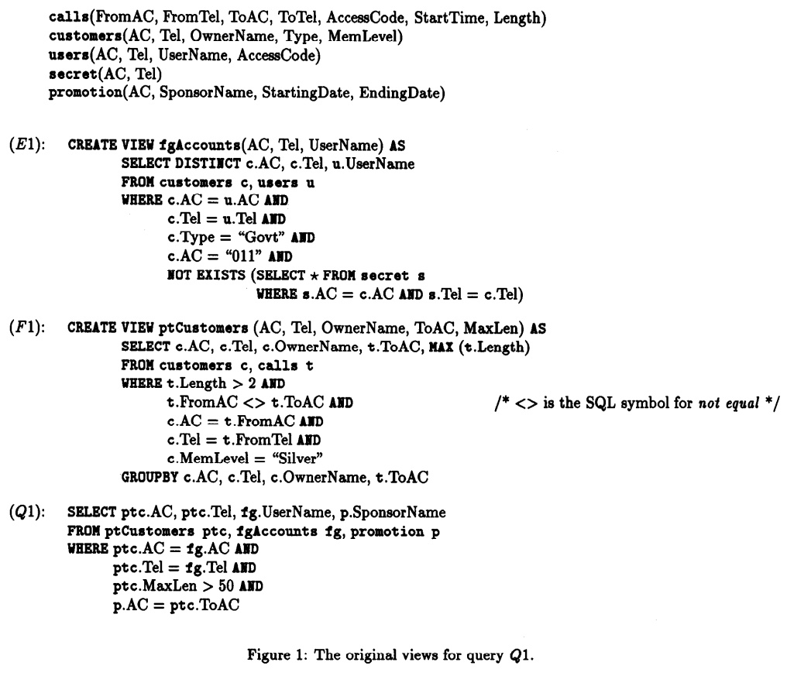

## AI论文解读 | Query Optimization By Predicate Move-Around
        
### 作者        
digoal        
        
### 日期        
2025-10-02       
        
### 标签        
PostgreSQL , PolarDB , DuckDB , AI , 论文解读        
        
----        
        
## 背景  
      
http://static.cs.brown.edu/courses/csci2270/archives/2012/papers/planning/10.1.1.102.835.pdf        
  
提示:          
```          
读懂《Query Optimization By Predicate Move-Around》这篇论文需要提前掌握哪些基础知识, 请使用中文通熟易懂的讲解这些基础知识, 可以引用论文中的图、表或使用Markdown支持的图形(text,mermaid等)增加解释性. 
  
使用中文通熟易懂的解读《Query Optimization By Predicate Move-Around》这篇论文, 其中的关键内容请着重讲解, 可以引用论文中的图、表或使用Markdown支持的图形(text,mermaid等)增加解释性. 
  
提取《Query Optimization By Predicate Move-Around》这篇论文中的重要术语, 使用中文对这些术语进行通熟易懂的讲解, 可以引用论文中的图、表或使用Markdown支持的图形(text,mermaid等)增加解释性. 
```     
  
## 1 前置知识 
  
阅读《Query Optimization By Predicate Move-Around》（谓词移位查询优化）这篇论文，需要掌握以下几个数据库查询优化的核心基础知识。

---

## 1. SQL 复杂查询结构与查询块（Query Blocks）

这篇论文主要解决的是**复杂 SQL 查询**的优化问题，尤其是那些在 **决策支持系统（Decision-Support Systems）** 中常见的查询 。

### 核心概念：查询块 (Query Block)

* **定义与来源：** 在复杂的 SQL 查询中，子查询（Subqueries）和视图（Views）分别对应于执行计划中的独立单元，这些单元被称为**查询块 (Query Block)** 。
* **无法合并的问题：** 传统优化器通常只能针对一个查询块进行优化 。虽然合并查询块（如将视图的定义直接替换到主查询中）是一种常见的优化手段，但如果查询中包含以下元素，查询块往往**无法被合并** ：
    * **聚合函数 (Aggregates)**，如 `GROUP BY` 或 `MAX()`。
    * **重复语义 (Duplicate Semantics)**，即对数据重复度的处理方式不同（例如一个视图保留重复行，而另一个消除重复行）。
    * **关联子查询 (Correlations)** 或 **EXISTS/NOT EXISTS** 子句 。

**理解要点：** 谓词移位技术正是为了解决**查询块不能合并**时，如何进行高效优化的难题 。

---

## 2. 谓词与传统优化：谓词下推（Predicate Pushdown）

### 核心概念：谓词 (Predicate)

* **定义：** 谓词是指 SQL 查询中出现在 **WHERE** 或 **HAVING** 子句中的搜索条件（Search Condition）。
    * 例如：`c.Type = "Govt"`、`t.Length > 2`、`NOT EXISTS (...)` 都是谓词。

### 传统优化：谓词下推 (Predicate Pushdown)

* **机制：** 谓词下推是一种**基本且重要**的传统优化技术 。它的目标是将谓词从查询图的上层（靠近结果输出端） **推到下层**（靠近数据表）。
* **目的：** **尽早应用选择条件**，从而在处理过程中减少中间结果集的大小，极大地提高查询效率 。
* **局限性：** 传统的谓词下推技术有其限制 ：
    1.  通常只能在简单的**分层查询 (Hierarchical Queries)**（无公共子表达式的非递归查询）上工作。
    2.  在遇到**聚合操作**时会失效。例如，在论文的例子（图 1）中，`ptCustomers` 视图是一个聚合块，因此主查询中的条件 `ptc.MaxLen > 50` 无法被直接推入该视图的 `WHERE` 子句中，导致必须先计算出所有的最大长度（MaxLen），才能在后续筛选 。   

---

## 3. 查询的表示模型：查询树（Query Tree）

为了实现更复杂的谓词移动，论文将 SQL 查询抽象成一个**查询树 (Query Tree)** 模型 。

* **查询树的构成：** 树的节点对应于查询中的每个**查询块** 。
    * **SELECT 节点：** 对应普通的 `SELECT-FROM-WHERE` 块 。
    * **GROUPBY 三元组：** 包含聚合的查询块（`GROUP BY`）会被拆分成三个节点（如图 3 所示）：   
        1.  底层的 **SELECT 节点**：处理 `SELECT-FROM-WHERE` 部分 。
        2.  中间的 **GROUPBY 节点**：处理分组和聚合操作 。
        3.  顶层的 **HAVING 节点**：处理 `HAVING` 子句中的谓词 。
* **节点属性：** 每个节点有两类属性：
    * **本地属性 (Local Attributes)：** 块内部操作数中的属性 。
    * **导出属性 (Exported Attributes)：** 块作为结果输出的属性（即视图的属性）。
* **标签 (Labels) 与重命名 (Renamings)：**
    * 每个节点都有一个 **标签 $L(n)$** ，用于存储适用于该节点属性的谓词 。
    * **重命名**机制（内部/外部）用于在不同节点之间转换属性名称（例如视图属性到其父查询块引用时的别名），是谓词在树中移动的桥梁 。

---

## 4. 谓词移位的核心机制与增强

**谓词移位（Predicate Move-Around）** 是这篇论文的核心贡献，它通过增加一个“**上拉**”步骤，突破了传统谓词下推的限制 。

### 机制：上拉（Pullup） + 下推（Pushdown）

论文的算法包含两个主要阶段：

1.  **谓词上拉 (Predicate Pullup)：**
    * **方向：** **自底向上**遍历查询树 。
    * **目的：** 从当前节点的**本地谓词**推导出**导出谓词**，并将这些谓词**上拉**到父节点 。这是实现“**侧向 (sideways)**”和“**向上 (up)**”移动的关键 。

2.  **谓词下推 (Predicate Pushdown)：**
    * **方向：** **自顶向下**遍历查询树 。
    * **目的：** 利用上拉到父节点的谓词，推导出子节点上的**本地谓词**，并将它们**推下**到子节点中 。

### 增强的能力

谓词移位能移动更广泛的谓词类型，并解决传统优化器无法处理的难题 ：

* **跨聚合移动（Pushing through Aggregation）**
    * 通过逻辑推导，将聚合后的谓词（例如 `MAX(t.Length) > 50`）转换为聚合前的谓词（例如 `t.Length > 50`），并将其推入底层查询块（ 如图 2 所示的优化结果 $F1_o$ ） 。    
* **移动复杂谓词（Moving Complex Predicates）**
    * 可以移动 **EXISTS** 和 **NOT EXISTS** 子句 。
* **实现侧向移动（Sideways Movement）**
    * 将一个查询块（如 `fgAccounts`）中的谓词，推到**不直接在逻辑上依赖**的另一个查询块（如 `ptCustomers`）中应用（例如：将 `fgAccounts` 的谓词 `c.Type = "Govt"` 移动到 `ptCustomers` 视图中） 。

---

## 5. 逻辑推理基础：函数依赖（Functional Dependencies）

函数依赖和约束是确保谓词移动**正确性**的逻辑基础 。

### 核心概念：函数依赖 (Functional Dependency, FD)

* **定义：** 函数依赖是关系模型中的一种**数据约束**，表示一个或一组属性的值可以**唯一确定**另一个或一组属性的值。
    * **示例：** 在论文的 `customers` 表中，**{AC, Tel}**（区号和电话）可以唯一确定 **{OwnerName, Type, MemLevel}**（所有者姓名、类型和会员级别）。即： $\{AC, Tel\} \to \{OwnerName, Type, MemLevel\}$ 。
* **在优化中的作用：**
    1.  **推导新谓词：** FD 可以在查询优化过程中被**显式地**添加到查询树的标签中 。
    2.  **保证移动的健全性：** 谓词移位算法利用 FD 来推理和**证明**跨块移动谓词的逻辑等价性，从而确保优化后的查询结果与原查询结果相同 。例如，在 Q1 查询中，两个视图是基于 `customers` 表的主键连接的，这使得 `fgAccounts` 上的谓词 `c.Type = "Govt"` 可以被安全地移动到 `ptCustomers` 的定义中 。

掌握上述概念，特别是**查询块、谓词下推的局限性、查询树结构**以及**函数依赖**的作用，将有助于您理解谓词移位算法是如何实现自底向上（上拉）和自顶向下（下推）的结合，从而在更复杂的查询结构中实现高效优化的。
  
## 2 解读论文 
  
好的，我们来通俗易懂地解读这篇经典的数据库优化论文《Query Optimization By Predicate Move-Around》。

这篇论文在1994年提出了一种非常强大的查询优化技术，名为 **谓词移动 (Predicate Move-Around)**。即使在今天，其核心思想对于理解现代数据库如何处理复杂查询仍然至关重要。

-----

### 核心思想：这篇论文要解决什么问题？

想象一下，你在一个大型公司分析数据，你的SQL查询可能非常复杂，里面套了视图（VIEWs），视图里面又套了子查询。这就好比一个多部门协作的大项目。 

**传统优化器的困境：**
传统的查询优化器，就像一个刻板的管理者，它一次只能优化一个部门（一个查询块）的工作。  如果一个查询依赖多个视图，优化器会先分别计算出每个视图的结果，形成中间表，最后再把这些中间表汇总计算。

这种方式最大的问题是 **“后知后觉”** 。比如，最终的查询可能只需要满足 `订单金额 > 10000` 的数据，但这个条件在计算某个视图时并不知道。于是，视图吭哧吭哧地计算了所有金额的数据，生成了一个巨大的中间结果，结果最后一步大部分数据都被丢掉了。这造成了巨大的性能浪费。 

**本文的解决方案：Predicate Move-Around**
论文作者提出，我们能不能让这些“条件”（在数据库里称为 **谓词 Predicate**，比如 `金额 > 10000`，`地区 = '北京'`）变得更“智能”，让它们不再局限于自己的小部门，而是在整个查询计划中“自由移动”，跑到最能发挥作用的地方去？ 

“谓词移动”技术就是这样一种“全局优化”思想。它不仅包含传统的 **谓词下推 (Predicate Pushdown)**，即把条件尽可能往下推给底层数据源；更引入了创新的 **谓词上拉 (Predicate Pullup)**。  整个过程就像：

1.  **情报汇总 (Pullup):** 先从各个底层部门（子查询/视图）把它们的关键限制条件（谓词）汇总到总部（父查询）。
2.  **全局分发 (Pushdown):** 总部拿到所有情报后，进行分析和推理，再把这些全局的、有用的条件分发给所有相关的部门。 

通过这种方式，一个在查询的A分支里的条件，可以被移动到B分支去，从而让B分支也能尽早地过滤掉无关数据。 

### 一个核心示例：问题与优化效果

论文用了一个非常精彩的电话数据库的例子来说明其威力。 

**场景:** 一个营销机构想在正在搞促销的地区，寻找那些往这些地区打电话超过50分钟的外国政府客户。 

这个查询依赖两个视图：

1.  **`fgAccounts` (外国政府账户):** 筛选出所有外国的（区号"011"）、类型为"Govt"、且非秘密的账户。 
2.  **`ptCustomers` (潜在客户):** 筛选出通话时长大于2分钟的通话记录，然后按客户和对方区号进行分组，计算出最大通话时长 (`MAX(Length)`)。 

**原始查询 (图1) 的低效之处:**
最终查询 `Q1` 中有一个关键条件 `MaxLen > 50`。  按照传统方法，这个条件无法被下推到 `ptCustomers` 视图中，因为它作用于聚合函数 `MAX()` 的结果。    

所以，数据库必须：

1.  在 `ptCustomers` 视图里，把所有**大于2分钟**的通话都计算一遍 `MAX()`。 
2.  生成一个巨大的 `ptCustomers` 中间结果。
3.  在最后执行 `Q1` 时，才用 `MaxLen > 50` 来过滤这个中间结果。

**经过谓词移动优化后 (图2) 的高效执行:**
该算法可以做到以下几点神奇的优化：   

  * **横向移动:** 将 `fgAccounts` 视图里的条件 `c.AC = "011"` (外国区号) 和 `c.Type = "Govt"` (政府类型) 移动到 `ptCustomers` 视图中。这样 `ptCustomers` 在计算前就可以先过滤出外国政府客户的通话，大大减少计算量。 
  * **穿透聚合 (最关键的一步):** 算法能根据最终查询的 `MaxLen > 50`，**推断**出在 `ptCustomers` 视图内部，原始的通话时长 `t.Length` 必须大于50才有意义。  因此，它将视图中原来的 `t.Length > 2` 替换为更强的 `t.Length > 50`。  这一步直接就在数据源头极大地减少了需要处理的数据量。
  * **其他移动:** 类似地，`NOT EXISTS` (非秘密账户)  和 `c.MemLevel = "Silver"` (银卡会员)  这样的条件也可以在两个视图之间互相移动。

最终，优化后的查询和视图（如图2所示）在执行时，每个步骤处理的都是高度筛选过的、相关性极高的数据，效率天差地别。 

### 核心数据结构：查询树 (Query Tree)

为了实现谓词的“移动”，算法首先需要把SQL查询转化成一个树形结构，即**查询树**。 

  * 树的每个**节点 (Node)** 代表一个查询块（如一个`SELECT`语句、一个`GROUP BY`操作等）。 
  * 树的根节点是最终的查询，叶子节点是底层的表或者视图。
  * 每个节点上有一个**标签 (Label)**，用来存放适用于该节点的**谓词（条件）集合**。 

整个“谓词移动”算法，本质上就是在这个树结构上，对各个节点的“标签”进行一系列操作的过程。

下面是论文中示例查询 `Q1` 的查询树结构（简化版）：


*查询Q1的结构图，最终查询依赖于ptCustomers和fgAccounts两个视图。*

### 核心算法：四步详解

谓词移动算法通过四个清晰的步骤来完成优化： 

1.  **第一步：标签初始化 (Label Initialization)** 

      * **做什么:** 遍历原始SQL查询，把所有 `WHERE` 和 `HAVING` 子句中的条件，以及表结构中隐含的**函数依赖**（比如主键能决定其他所有列），都放到查询树对应节点的“标签”里。 
      * **例子:** `fgAccounts` 节点的标签初始时会包含 `c.Type = "Govt"` 和 `c.AC = "011"` 等。 

2.  **第二步：谓词上拉 (Predicate Pullup)** 

      * **做什么:** 从树的叶子节点开始，**自底向上**遍历。在每个节点，算法会根据其内部（局部）属性的谓词，推断出关于其输出（导出）属性的新谓词，然后把这些新谓词添加到当前节点的标签，并“拉”到父节点的标签中。 
      * **例子:** 在 `fgAccounts` 节点，算法根据局部的 `c.AC = "011"`，推断出其输出的 `fg.AC` 属性也必然等于 `"011"`。于是 `fg.AC = "011"` 这个新谓词被添加到根节点 `Q1` 的标签里。 

3.  **第三步：谓词下推 (Predicate Pushdown)** 

      * **做什么:** 从树的根节点开始，**自顶向下**遍历。将在“上拉”阶段汇集到高层节点的谓词，以及高层节点原有的谓词，“推”给它们的子节点。 
      * **这正是实现“横向移动”的关键。** `fgAccounts` 上拉到根节点的 `fg.AC = "011"`，在这一步会被下推到 `ptCustomers` 分支，因为它和 `ptCustomers` 也有关联。
      * **例子:** 根节点的 `ptc.MaxLen > 50` 被下推到 `ptCustomers` 的GROUPBY节点。  在该节点，算法根据聚合规则推断出 `t.Length > 50`，并继续将这个更强的谓词下推到底层的SELECT节点。 

4.  **第四步：标签最小化 (Label Minimization)** 

      * **做什么:** 清理战场。在经过上拉和下推后，很多节点的标签里会出现重复或冗余的谓词。此步骤旨在移除这些多余的条件。 
      * **为什么重要:**
        1.  避免重复计算，节省CPU时间。 
        2.  更重要的是，避免冗余谓词误导优化器对数据量的估算，从而产生更优的执行计划。 
      * **例子:** 当 `t.Length > 50` 被成功下推后，原始的 `t.Length > 2` 就是冗余的，可以被安全地移除。 

### 与其他技术的对比

  * **传统谓词下推:** "谓词移动"是其超集。传统下推只能自顶向下，无法实现跨分支的谓词移动。 
  * **Magic Sets:** 这是另一种高级优化技术。但Magic Sets依赖于预先确定的连接顺序，并且会生成额外的辅助表，有一定开销。而谓词移动不依赖连接顺序，并且是直接重写查询本身，更加灵活。 

### 结论

《Query Optimization By Predicate Move-Around》提出了一种非常通用且强大的查询重写框架。它通过“上拉-下推”的两阶段过程，让查询条件（谓词）得以在查询计划的各个部分之间智能地流动，尤其是能够处理传统优化器难以应对的**聚合**、**视图**和**复杂子查询**场景。 

该方法的核心贡献在于，它能显著提升复杂查询（特别是决策支持和数据分析类查询）的执行效率 ，并且其思想易于在现有的查询优化器中实现。 
  
## 3 术语 
  
阅读《Query Optimization By Predicate Move-Around》（谓词移位查询优化）这篇论文，需要掌握几个核心的数据库查询优化术语。以下是使用中文对这些重要术语的通俗讲解：

-----

## 核心术语与概念

### 1\. 谓词移位 (Predicate Move-Around, PMA)

  * **定义：** 这篇论文提出的核心优化技术。它是一种**广义的谓词移动**方法，通过结合**谓词上拉 (Pullup)** 和 **谓词下推 (Pushdown)** 两个步骤，实现谓词在复杂查询结构（即查询块之间）的**全局性移动**。
  * **通俗解释：** 想象一个复杂的工厂流水线（查询）。传统方法只能让筛选条件往下游走。但谓词移位就像一个全能的调度员，它不仅能让筛选条件往下推，还能先把底层的信息**拉上来**进行推理，然后将新的或重构的筛选条件**推到**流水线的任何一个角落去。
  * **目标：** 解决传统优化器在遇到**聚合操作**或**不可合并的子查询/视图**时，无法进行高效优化的难题。它让筛选条件能“绕过”这些障碍，**尽早**应用到数据上，极大地减少中间数据量。

-----

### 2\. 查询块 (Query Block)

  * **定义：** SQL 查询中的一个逻辑执行单元，通常对应于一个 `SELECT-FROM-WHERE` 语句、一个子查询或一个视图定义。
  * **通俗解释：** 把一个复杂的 SQL 查询看作是一栋乐高积木房子，**查询块**就是每一块独立的积木。传统的优化器通常一次只能优化一块积木。当查询涉及多个视图、子查询或聚合时，就会产生多个查询块。
  * **论文关注点：** 论文关注的是**不可合并的查询块**。例如，包含 **`GROUP BY`** 聚合的查询块、或者使用了 **`NOT EXISTS`** 的子查询块，它们在逻辑上无法简单地被主查询替换（内联/Inline），因此需要谓词移位技术来**跨越**它们进行优化。

-----

### 3\. 谓词 (Predicate)

  * **定义：** SQL 查询中用于筛选数据的条件表达式，通常出现在 `WHERE`、`HAVING` 或 `JOIN` 子句中。
  * **通俗解释：** 谓词就是你的**筛选要求**。例如：
      * `Price > 100` (简单的比较谓词)
      * `ProductName LIKE 'Apple%'` (字符串匹配谓词)
      * `NOT EXISTS (SELECT * FROM ...)` (复杂的非存在性谓词)
  * **PMA 的优势：** 谓词移位技术可以移动的谓词范围更广，不仅包含传统的比较和算术谓词，还能移动 **`EXISTS`**、**`NOT EXISTS`** 子句，以及**集合操作**（如 `EXCEPT`）。

-----

### 4\. 谓词下推 (Predicate Pushdown)

  * **定义：** 传统且基础的查询优化技术。将谓词从查询执行计划的上层节点（靠近输出）移动到下层节点（靠近数据源）。
  * **通俗解释：** 核心思想是“**早筛选，少计算**”。例如，如果你的查询条件是“选择年龄大于 30 的人”，传统下推会尽量让这个条件在读取原始数据表时就应用，而不是等所有数据都处理完了再筛选。
  * **局限性：** 如图 1 所示，**聚合操作**（如 `GROUP BY`）会形成一个**屏障**。如果一个谓词是基于聚合结果的（例如 `HAVING COUNT(*) > 10`），它就无法被推到聚合操作的下方。    

-----

### 5\. 谓词上拉 (Predicate Pullup)

  * **定义：** 谓词移位技术中的**关键创新**。它是**自底向上**的步骤，将谓词从子查询块或视图中**向上推理**并移动到父查询块中。
  * **通俗解释：** 如果说下推是让条件向下走，那么上拉就是让条件**向上走**，或者让**推论向上走**。例如，如果父查询有一个条件是 `Max_Length > 50`，这个条件是基于子查询计算出的最大长度。上拉操作能够**逆向推理**出原始数据上的等效条件 `Length > 50`，并将这个新的条件（谓词）传递给父查询。
  * **意义：** **上拉**是实现谓词**侧向移动（Sideways Movement）和跨聚合移动**的基础。只有先上拉，才能将谓词从图的一侧移动到另一侧。

-----

### 6\. 查询图/查询树 (Query Graph/Query Tree)

  * **定义：** 一种抽象的结构表示，将复杂的 SQL 查询建模为一张图或一棵树。每个节点代表一个**查询块**，边表示块之间的数据流或关联关系。
  * **通俗解释：** 这是优化器用来分析查询的**蓝图**。谓词移位算法正是在这棵树上进行节点间的谓词移动操作。论文中将包含聚合的查询块表示为**三元组**：底层的 `SELECT` 节点、中间的 `GROUP BY` 节点和顶层的 `HAVING` 节点，以便于在各个细分的节点间移动谓词。

-----

### 7\. 函数依赖 (Functional Dependency, FD)

  * **定义：** 数据库设计中的一种完整性约束，表示在一个关系（表）中，一组属性（ 如 $X$ ）的值可以唯一确定另一组属性（ 如 $Y$ ）的值，记作 $X \to Y$ 。
  * **在 PMA 中的作用：** FD 是一种**逻辑推导工具**。在谓词移位过程中，优化器利用数据库中已知的 FD 或通过查询推导出的 FD，来**确保谓词移动的正确性**。例如，如果知道 `ID` 可以唯一确定 `Name` (`ID \to Name`)，那么涉及 `Name` 的谓词就可以安全地被重写或移动，而不改变查询结果。

-----

### 总结：谓词移位的工作原理

下图展示了谓词移位如何通过结合上拉和下推，实现**跨聚合**的优化，这是传统谓词下推无法做到的。
  

  

  
**步骤解释：**

1.  **上拉 (1):** 优化器分析主查询块 B 的谓词（例如 `MAX(Len) > 50`），并利用逻辑推理，将其转化为适用于底层 C 的谓词（例如 `Len > 50`）。
2.  **下推 (2):** 将新推导出的谓词 `Len > 50` 推入视图块 C 的底层，作为其 `WHERE` 条件。
3.  **结果：** 在 C 进行聚合操作之前，数据已经被 `Len > 50` 提前筛选，大大减少了聚合的计算量。
  
## 参考        
         
http://static.cs.brown.edu/courses/csci2270/archives/2012/papers/planning/10.1.1.102.835.pdf    
        
<b> 以上内容基于DeepSeek、Qwen、Gemini及诸多AI生成, 轻微人工调整, 感谢杭州深度求索人工智能、阿里云、Google等公司. </b>        
        
<b> AI 生成的内容请自行辨别正确性, 当然也多了些许踩坑的乐趣, 毕竟冒险是每个男人的天性.  </b>        
    
  
#### [期望 PostgreSQL|开源PolarDB 增加什么功能?](https://github.com/digoal/blog/issues/76 "269ac3d1c492e938c0191101c7238216")
  
  
#### [PolarDB 开源数据库](https://openpolardb.com/home "57258f76c37864c6e6d23383d05714ea")
  
  
#### [PolarDB 学习图谱](https://www.aliyun.com/database/openpolardb/activity "8642f60e04ed0c814bf9cb9677976bd4")
  
  
#### [PostgreSQL 解决方案集合](../201706/20170601_02.md "40cff096e9ed7122c512b35d8561d9c8")
  
  
#### [德哥 / digoal's Github - 公益是一辈子的事.](https://github.com/digoal/blog/blob/master/README.md "22709685feb7cab07d30f30387f0a9ae")
  
  
#### [About 德哥](https://github.com/digoal/blog/blob/master/me/readme.md "a37735981e7704886ffd590565582dd0")
  
  

  
