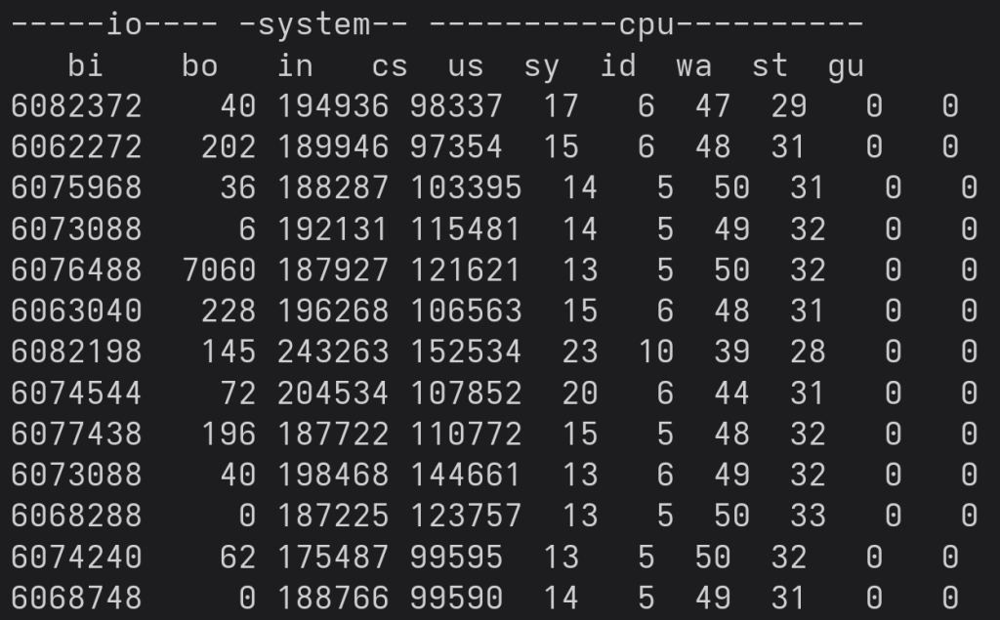

## AIO 是PostgreSQL的终点吗? 不, 未来将大力发展DIO  
                
### 作者                
digoal                
                
### 日期                
2025-10-03               
                
### 标签                
PostgreSQL , PolarDB , DuckDB , 同步IO , 异步IO, 直接IO , DirectIO , page cache , shared buffer , prefetch , 预读 , read ahead          
                
----                
                
## 背景         
PostgreSQL 18 的AIO炸街了, 提起18的新特性, 必提AIO.   
  
AIO 回顾  
- [《PG 18 AIO 性能改进详细评测》](../202509/20250920_01.md)    
- [《PostgreSQL 18 AIO & DIO 顶层设计》](../202504/20250403_01.md)    
- [《Tom Lane 同事分享 Postgres 18 最满意的5个特性》](../202509/20250920_02.md)    
- [《PostgreSQL 18 preview - 重磅, 刚刚支持异步IO框架》](../202503/20250319_02.md)    
  
但是PG将止步于AIO吗?  
  
不, 虽然 PostgreSQL 18 已经取得了重大进展，并实现了一个重要的里程碑 …… 但还有什么更酷的东西吗？几年后我们可能会看到的东西？嗯，也许吧：“Direct I/O”。  
  
来看看AIO和DIO的性能评测对比就知道, AIO将输在系统调用层面, 因为DIO根本没有系统调用.   
  
下面内容来自: https://www.cybertec-postgresql.com/en/postgresql-18-and-beyond-from-aio-to-direct-io/  
  
## 什么是Direct I/O？  
正常情况下，数据库读取数据过程如下：  
- 应用程序请求一些数据  
- 内核接受读取请求   
- 进行健全性检查  
- 发生缓存查找  
- 如果需要, 则从磁盘读取数据  
- 否则, 将从文件系统缓存提供数据  
- 应用程序收到 OK  
  
听起来不错？确实如此，而且在大多数情况下，这正是我们想要的。然而，还有一种额外的方法：Direct IO。它的作用可以用一句话来概括：DirectIO 绕过了操作系统page cache层。   
  
但让我们更详细地看一下：  
  
它的优点在于“它避开了内核开销和可扩展性的限制”。  
  
缺点在于“它忽略了该层提供的缓存服务”, 这个问题可以通过增加共享缓冲区来解决这个问题，但操作系统能够动态地用cache空间来交换后端分配的内存。shared buffer必须以保守的方式分配。  
  
然后，还有 OS 预读。版本 18 提供了 ReadStream，它可以使用异步 IO 进行预读，并且已经应用于顺序扫描、heap 位图扫描和 VACUUM 场景。但尚不支持普通的索引扫描。目前，如果索引范围扫描恰好顺序读取数据（索引顺序与表顺序大致匹配），则性能会有很大差异，因为page cache预读会进行预取，而Direct IO 只会在需要时提交每次读取。  
  
最后，page cache具有写入缓冲功能，允许同时进行多个写入操作。异步 IO 尚不支持写入操作。  
  
## 测量 PostgreSQL 中Direct I/O 的潜力  
在我们深入探讨 Direct I/O 的基准测试和优势之前，请注意：PostgreSQL 尚未完全实现 Direct I/O，并且在未来很多年内也不会实现。  
  
不过，有一个使用 Direct I/O 的 DEBUG (!) 功能。请勿在生产环境中使用此功能。请记住：即使您信任我们的博客和 CYBERTEC 的专业知识，我们也不建议您在现阶段在 PostgreSQL 中使用 Direct I/O，而只是进行一次测试，以了解未来的可能性及其潜力。  
  
对于我的测试，我使用了两个如下所示的表：  
  
```  
bench=# \d t_part_0  
Table "public.t_part_0"  
Column  |     Type      | Collation | Nullable | Default   
----------+---------------+-----------+----------+---------  
 aid      | bigint        |           | not null |   
 bid      | integer       |           |          |   
 abalance | integer       |           |          |   
 filler   | character(84) |           |          |   
```  
  
每个表填充了 250 GB 的数据。  
  
请注意，我在这里使用了两个 SSD - 每个表位于单独的 SSD 上，以便我们可以看到可能的最大吞吐量。  
  
PostgreSQL配置如下：  
  
```  
max_parallel_workers = 16  
max_worker_processes = 16  
max_parallel_workers_per_gather = 16  
io_method = io_uring  
```  
  
这些参数都是为“maximum speed parallel sequential scan”设置的。我们运行一个简单的 `SELECT count(*)` 语句来看看会发生什么 —— 这才是有意思的部分：  
  
    
  
您看到的是我本地 Linux 机器上 `vmstat` 的输出。“bi”列表示我们从 2 个 SSD（合计）读取的数据速度约为 `3.7 GB/秒`。听起来很酷？好吧，我不太确定 …… 让我们检查一些重要的列：`CPU` 和`磁盘等待时间`。CPU 使用率在 `50-60%` 左右，磁盘等待时间也不算太高。 **这说明我们很有可能实现更高的吞吐量。**   
  
我修改了 PostgreSQL 上的一些配置参数，并检查了一些其他内容：“perf”  
  
    
  
内核中的争用相当多（附注：这是一块 16 核的 AMD 物理芯片 —— 不是虚拟机，也没有 Kubernetes 等等）。我尝试了各种 SSD 和不同数量的分区，但速度似乎总是达到峰值附近，这表明我们确实开始触及 PostgreSQL 所依赖的层级。顺便说一句：如果您在 PostgreSQL 中使用标准 I/O（例如 PostgreSQL 17 及更早版本），则只有在使用大量工作进程时才会看到这些数字, 也就是高并发时才能压测出这样的结果）。  
  
在 PostgreSQL 中，我们并不使用Direct I/O 进行 I/O，因为我们确实需要操作系统提供的保护层(page cache) —— 当然，这在未来可能会改变。但是，有一个debug参数可以使用Direct I/O 进行读取：  
  
  
```  
debug_io_direct = 'data'  
```  
  
重新启动 PostgreSQL 并再次运行大型顺序扫描。  
  
  
哦天哪，让我们看看……  
  
    
  
  
我们现在的读取速度是 `6 GB/秒`（而且 CPU 占用不高）。通过跳过操作系统层面的所有合理性操作，我们成功提升了速度。但还有更多 —— 再看看“perf”：  
  
    
  
  
这里最耗时的部分已经在 PostgreSQL 内部了 —— 操作系统内核已经不见踪影了。  
  
  
## 可视化结果  
  
显然，磁盘 I/O 显著影响查询时间：   
  
    
  
如果安装了更多更快速度的本地 NVME 时（普通 SSD 无法完成这项工作），性能会怎样? 我们将很快发布更多基准测试。  
  
  
## 最后  
  
请注意，本文仅对未来可能实现的目标以及在相当常见的现代硬件上可以实现的功能进行展望。硬件速度不断提升，因此，了解并理解下一个瓶颈所在以及如何预测和避免这些瓶颈显然至关重要。从历史上看，磁盘 I/O 一直是数据库技术的核心瓶颈之一，但未来如何，我们拭目以待。也许有一天，情况会有所改变。CYBERTEC 将见证这些发展。  
  
当PG开始大规模使用AIO后, 瓶颈可能会从IO变成操作系统内核层的系统调用, 此时也许DIO就会进入PG的roadmap, 拭目以待吧!    
      
  
#### [期望 PostgreSQL|开源PolarDB 增加什么功能?](https://github.com/digoal/blog/issues/76 "269ac3d1c492e938c0191101c7238216")
  
  
#### [PolarDB 开源数据库](https://openpolardb.com/home "57258f76c37864c6e6d23383d05714ea")
  
  
#### [PolarDB 学习图谱](https://www.aliyun.com/database/openpolardb/activity "8642f60e04ed0c814bf9cb9677976bd4")
  
  
#### [PostgreSQL 解决方案集合](../201706/20170601_02.md "40cff096e9ed7122c512b35d8561d9c8")
  
  
#### [德哥 / digoal's Github - 公益是一辈子的事.](https://github.com/digoal/blog/blob/master/README.md "22709685feb7cab07d30f30387f0a9ae")
  
  
#### [About 德哥](https://github.com/digoal/blog/blob/master/me/readme.md "a37735981e7704886ffd590565582dd0")
  
  

  
