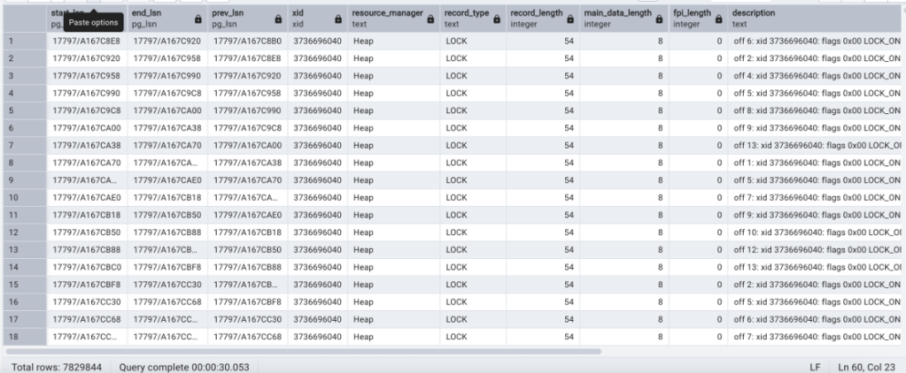

## 用 wal_inspect 分析PG WAL日志, 结合pgBadger找出快查询是怎么突然变慢的  
                  
### 作者                  
digoal                  
                  
### 日期                  
2025-10-03                 
                  
### 标签                  
PostgreSQL , PolarDB , DuckDB , wal , pgBadger , 快查询 , 慢查询 , 锁等待         
                  
----                  
                  
## 背景        
这篇文章记录了一位国外的up主用 wal_inspect 分析PG WAL日志, 结合pgBadger找出快查询是怎么突然变慢的.  
  
大家可以提前了解一下几个知识点, 对理解本文会有作用:  
- wal 日志是数据库操作的预写日志, 记录了用户对数据库的变更带来的page变化, 由很多record type组成, 通过wal inspect插件可进行分析.  
- pg_stat_activity中显示的query仅仅是某个事务最后执行/执行中的query, 而此事务之前执行了什么请求, 如果没有打印SQL审计日志的话, 是不知道的  
- 在一个事务中, heavy lock锁(行锁,对象锁等等非lwlock/spinlock)的释放时间, 是事务结束. (人为控制的advisory lock除外)  
  
以下内容来自: https://hdombrovskaya.wordpress.com/2025/09/27/how-i-learned-to-use-wal_inspect/  
  
# 用 wal_inspect 分析PG WAL日志, 结合pgBadger找出快查询是怎么突然变慢的  
  
这个问题已经持续了好几个月：Postgres 数据库的一个 WAL 文件系统以惊人的速度增长，比数据库本身的速度快很多倍。起初，我怀疑是长事务导致了问题。确实有很多定期运行的JOB可以改进，但我注意到了另一些问题。  
  
首先，当用户修复了其中一个主要可疑JOB后，WAL 增长的情况并没有改变。其次，这些JOB无法解释增长速度：它们delete和insert的数据量仍然比 WAL 小几个数量级。最后，我决定做我从一开始就应该做的事情 —— 看看这些超快速增长的 WAL 中到底有什么。  
  
digoal 注: wal比数据量大, 通常是几个综合原因导致“检查点过于频繁, 每个检查点之间都有大量的page被修改(例如作者提到的大量delete/insert操作), 在数据库开启了full page write时, 会往wal写入了大量full page(每个检查点后数据库首次被修改时, 记录其full page)”.  
  
以下是我所做的：  
```  
create extension  pg_walinspect;  
  
select pg_current_wal_insert_lsn();  /* 保存结果：'17797/A167C8E8'*/  
  
select pg_current_wal_insert_lsn() /* 保存结果：'17797/FEDE0CC8'*/  
  
select * from  pg_get_wal_stats('17797/A167C8E8', '17797/FEDE0CC8', true) where count>0;  
```  
  
  
  
令我惊讶的是，我发现 97% 的 WAL 都存储了锁的信息！说实话，我甚至都不知道 WAL 文件中记录了锁，所以非常感谢 Postgres 社区的慷慨解惑！  
  
现在我知道去哪里查找了，我运行了以下命令：  
```  
select * from pg_get_wal_records_info('17797/A167C8E8', '17797/FEDE0CC8')  
  where resource_manager='Heap'  
  and record_type='LOCK'  
```  
  
  
  
放大:  
  
  
  
接下来，我找到了具有这些锁的表：  
```  
select * from pg_class where oid = 10229951  
```  
  
当我找到 `this_table_name` 时，我能够检查 `pgBadger` 数据库，我发现了特定的语句：  
```  
select *   
from this_customer_logs.this_database_log_t_2025_07_25  
where query like '%this_table_name%'  
```  
  
事实证明，虽然 UPDATE 操作似乎是造成速度缓慢/锁等待的原因，但当没有等待时，UPDATE 操作本身的执行时间在 `1 到 2 毫秒`之间。造成速度缓慢的真正原因是读取`事务中`执行的一次缓慢的 select 操作 —— 请看事件序列：  
  
  
  
因此，导致 WAL 数据大幅增长的原因竟然是一条（实际上是两条）缓慢的 SELECT 语句！谁能想到呢？    
  
digoal 注: 作者后来解释了这条SQL非常复杂, 里面有cte, 有insert/delete, 而且锁释放需要等事务结束, 所以锁的时间很长, 可能与其他事务出现了行锁冲突.   
  
## PS, 作者的一些补充  
  
  
1\.1、冒着显得愚蠢的风险，我不得不问：首先，我不明白为什么长时间运行的查询会阻塞更新操作，其次，我看不出被阻塞的更新操作和 WAL 量增加之间有什么联系。当然，行锁会写入 WAL，但如果它没有阻塞，写入的 WAL 会减少吗？  
  
你以悬念的方式结束了这篇文章；我希望能够有一个解决方案。  
  
1\.2、首先，感谢您的阅读和评论！其次，是的，我应该解释一下 select 为何以及如何锁定更新！  
  
我第一次看到它的时候，真是百思不得其解——我们为什么要用 MVCC？！虽然 SELECT 语句被不必要的 BEGIN/COMMIT 语句“框”住了（感谢 ORM！），但情况本不应该如此！不过，正如你从记录的事件序列中看到的那样，确实需要等待一段时间！  
  
事实证明，SELECT 不仅仅是一个 select，而是 SELECT count(*) from <something else>，而这个 <something else> 是一个相当复杂的语句，包含多个 CTE，包括 INSERT 和 UPDATE。同样，实际的 UPDATE 很快，但 SELECT 却很慢！没错，对同一张表！当我与最终用户沟通，并指出他们应该在第一个作业完成后安排第二个作业时，他们告诉我他们需要“尽快”得到结果。  
  
无论如何，他们最终重写了他们的加载作业，现在我们不再需要长时间等待，WAL 中也不再有过多的 LOCK 记录，而且 WAL 大小减少了 200 倍！  
  
至于为什么 98% 的 WAL 大小都被 LOCK 记录占用，我的观察是它们重复出现过多次。我可能错了，因为那是我第一次深入研究这种情况。  
  
我所有的取证结果都显示在图片上（这是我能分享的最大限度）。我的理解是，LOCK 记录每隔 X 秒或几毫秒就会重复一次。你能根据这些图片判断出来吗？我很想弄清楚真相！  
  
1\.3、据我所知，仅仅因为行锁阻塞，就不会出现更多的WAL记录。所以我猜测，这些锁是应用程序出于某种原因发出的。  
  
2、事实并非如此，因为最后一张截图显示的是完整的日志。我们知道当时没有其他操作。所以“坏”WAL 和“好”WAL 之间的唯一区别就是锁的持有时间。我会继续调查！  
   
  
#### [期望 PostgreSQL|开源PolarDB 增加什么功能?](https://github.com/digoal/blog/issues/76 "269ac3d1c492e938c0191101c7238216")
  
  
#### [PolarDB 开源数据库](https://openpolardb.com/home "57258f76c37864c6e6d23383d05714ea")
  
  
#### [PolarDB 学习图谱](https://www.aliyun.com/database/openpolardb/activity "8642f60e04ed0c814bf9cb9677976bd4")
  
  
#### [PostgreSQL 解决方案集合](../201706/20170601_02.md "40cff096e9ed7122c512b35d8561d9c8")
  
  
#### [德哥 / digoal's Github - 公益是一辈子的事.](https://github.com/digoal/blog/blob/master/README.md "22709685feb7cab07d30f30387f0a9ae")
  
  
#### [About 德哥](https://github.com/digoal/blog/blob/master/me/readme.md "a37735981e7704886ffd590565582dd0")
  
  

  
