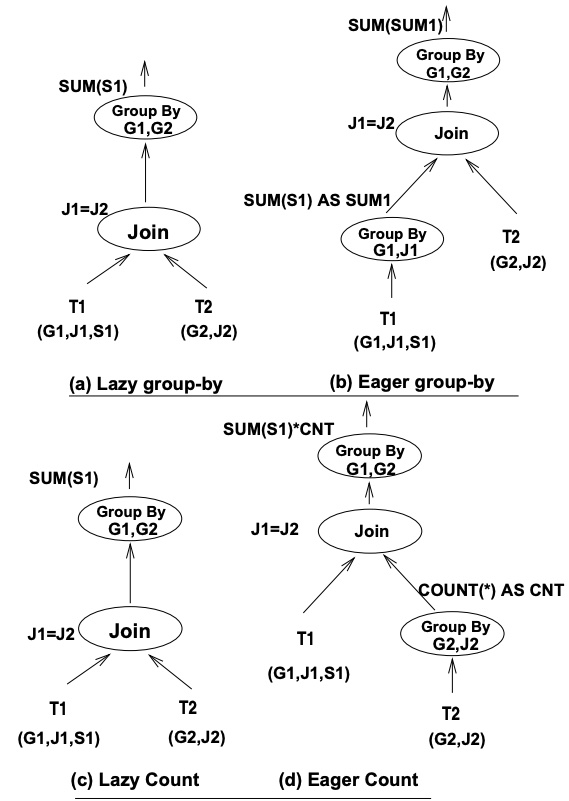
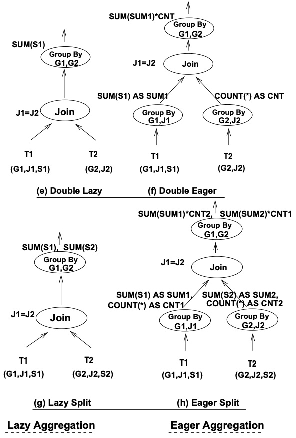
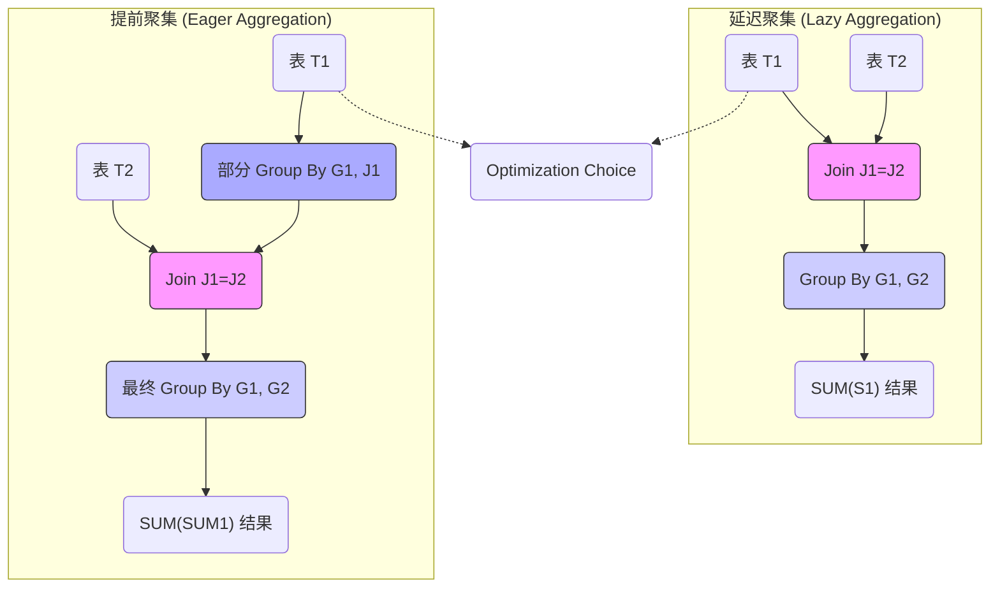
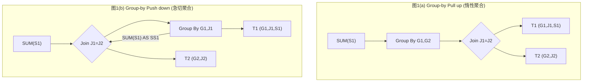
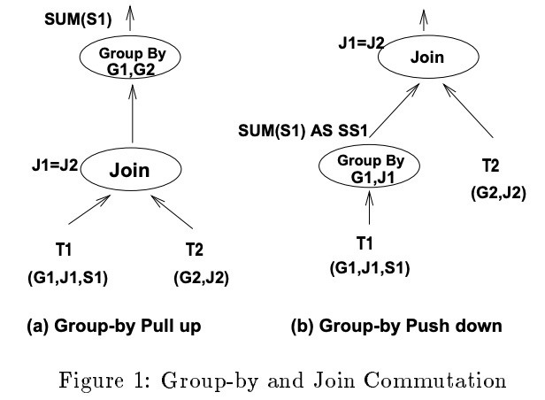
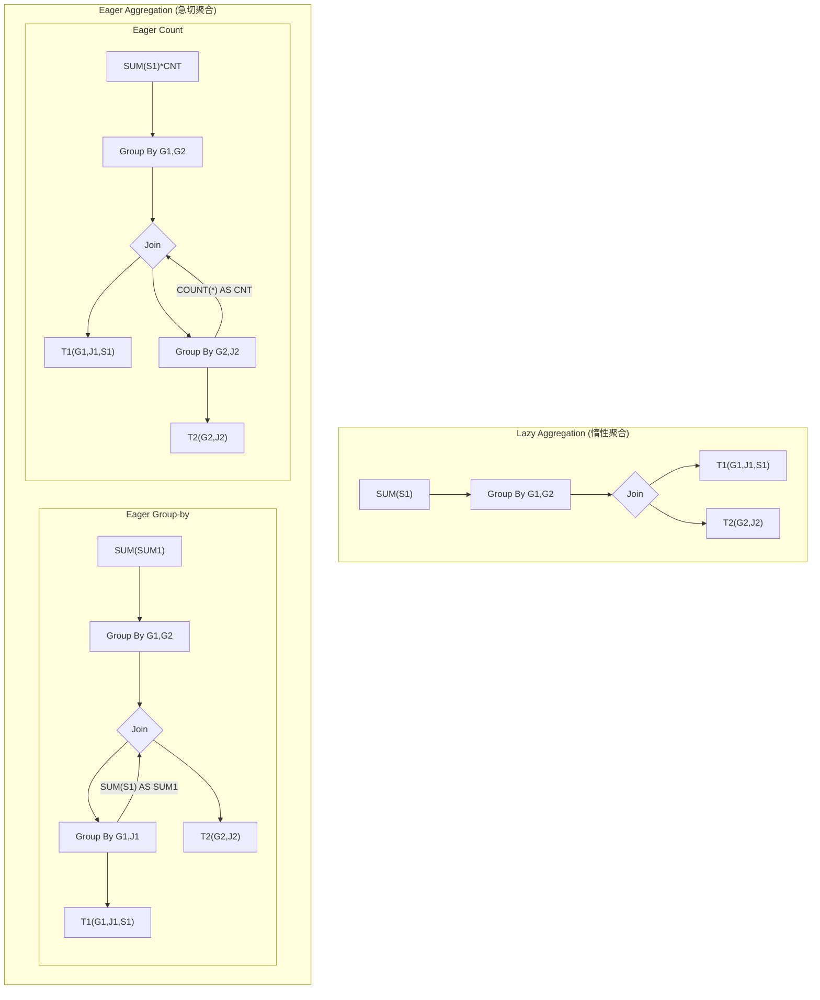
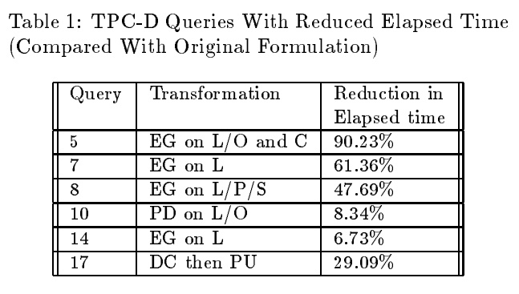
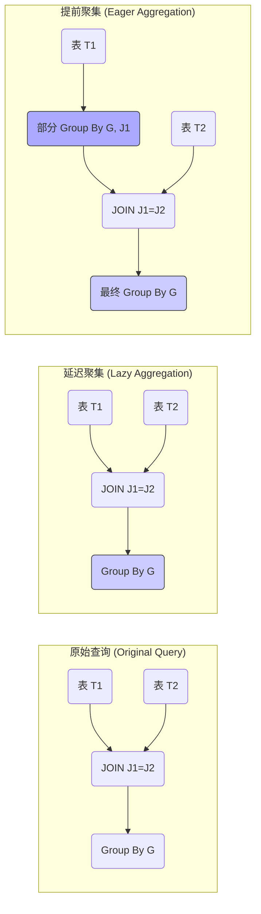

## AI论文解读 | Eager Aggregation And Lazy Aggregation
        
### 作者        
digoal        
        
### 日期        
2025-10-03       
        
### 标签        
PostgreSQL , PolarDB , DuckDB , AI , 论文解读        
        
----        
        
## 背景  
      
https://www.researchgate.net/profile/Per-Ake-Larson/publication/2733082_Eager_Aggregation_and_Lazy_Aggregation/links/02bfe50ce6de3dad7c000000/Eager-Aggregation-and-Lazy-Aggregation.pdf        
  
提示:          
```          
读懂《Eager Aggregation And Lazy Aggregation》这篇论文需要提前掌握哪些基础知识, 请使用中文通熟易懂的讲解这些基础知识, 可以引用论文中的图、表或使用Markdown支持的图形(text,mermaid等)增加解释性. 
  
使用中文通熟易懂的解读《Eager Aggregation And Lazy Aggregation》这篇论文, 其中的关键内容请着重讲解, 可以引用论文中的图、表或使用Markdown支持的图形(text,mermaid等)增加解释性. 
  
提取《Eager Aggregation And Lazy Aggregation》这篇论文中的重要术语, 使用中文对这些术语进行通熟易懂的讲解, 可以引用论文中的图、表或使用Markdown支持的图形(text,mermaid等)增加解释性. 
```     
  
## 1 前置知识 
  
阅读《Eager Aggregation And Lazy Aggregation》（即“提前聚集与延迟聚集”）这篇论文，您需要提前掌握**关系数据库**和**查询优化**领域的几个核心基础知识。

这篇论文的核心在于找到一个包含**联接 (Join)** 和**分组聚集 (Group By)** 操作的查询语句的最佳执行顺序，以提升数据仓库和决策支持系统（如TPC-D基准测试）中复杂查询的性能 。

以下是理解这篇论文所需的基础知识的中文通俗讲解。

-----

## 1\. 关系数据库与 SQL 核心操作

这篇论文是基于 SQL 语言和关系代数来讨论的，因此您需要透彻理解以下两个核心操作：

### 1.1 聚集操作 (`GROUP BY` 和聚集函数)

  * **概念:** 聚集操作是指将表中的行根据一个或多个列（`GROUP BY` 子句）进行分组，并对每个组应用聚集函数（如 `SUM`、`COUNT`、`AVG`、`MIN`、`MAX`）计算出单个值 。
  * **成本:** `GROUP BY` 操作通常涉及对大量数据进行排序或哈希，是一个**成本高昂**的操作，尤其是在大数据集上。
  * **目标:** 聚集操作的优化目标是尽量减少输入到 `GROUP BY` 运算符的行数。

### 1.2 联接操作 (`JOIN`)

  * **概念:** `JOIN` 操作根据两个表（例如论文中的 `T1` 和 `T2`）之间指定的条件（例如 `J1 = J2`）将行组合起来 。
  * **成本:** `JOIN` 操作的成本也极高，尤其是当联接的两个表都很大时。
  * **目标:** 联接操作的优化目标是尽量减少输入到 `JOIN` 运算符的行数。

-----

## 2\. 查询执行计划与优化原则

论文的核心是**查询转换 (Query Transformation)**，即在保持查询结果不变的前提下，改变操作的执行顺序，以找到一个更快的**执行计划（或称查询树）** 。

查询优化器的基本原则是：**尽早处理高选择性的操作，减少中间结果集的大小。**

论文中的核心思想可以概括为：**如何高效地调度 `JOIN` 和 `GROUP BY` 的执行顺序。**

### 2.1 延迟聚集 (Lazy Aggregation / Group-by Pull Up)

  * **定义:** **延迟聚集**是将 `GROUP BY` 操作**推迟**到 `JOIN` **之后**执行 。
  * **优点:** 如果 `JOIN` 条件具有很高的**选择性 (Selectivity)**，即联接后能显著减少行数，那么减少后的行数进入 `GROUP BY` 会更高效 。
  * **执行顺序:** 联接 → 聚集

### 2.2 提前聚集 (Eager Aggregation / Group-by Push Down)

  * **定义:** **提前聚集**是先对一个或多个表进行**部分聚集**，将中间结果联接起来，最后再进行一次**最终聚集** 。
  * **优点:** 在联接之前先进行聚集，可以大大**减少输入到 `JOIN` 的行数**，从而降低 `JOIN` 的总成本 。这是该技术的主要性能提升点。
  * **执行顺序:** 部分聚集 → 联接 → 最终聚集

下方的图（基于论文图 2 的基本概念）展示了这两种转换：

    



-----

## 3\. 聚集函数的高级特性

提前聚集并非对所有聚集函数都适用。为了保证转换后的结果与原查询结果一致，您需要理解以下关于聚集函数的分类：

### 3.1 可分解聚集函数 (Decomposable Aggregation Functions)

  * **概念:** 只有当聚集函数 $F$ 是**可分解的**，才能进行**提前聚集**。可分解意味着聚集可以分成两步：先对**部分数据**计算一次 $F1$ ，再对**部分结果**计算一次 $F2$ 来得到最终结果 $F$ 。
  * **示例 (SUM):** `SUM(S1 联集 S2) = SUM(SUM(S1), SUM(S2))` 。
      * 例如，先计算 T1 上的 **部分和 (SUM(S1) as SUM1)**，然后将 **SUM1** 进行 `JOIN`，最后再对 **SUM1** 求和。
  * **可分解函数:**
      * `SUM()`, `COUNT()` (无 `DISTINCT`), `MIN()`, `MAX()` 。
      * `AVG()` 可以分解为 `SUM()` 和 `COUNT()` 的组合 。
  * **不可分解函数:**
      * `COUNT(DISTINCT C1)` 默认情况下是**不可分解**的，因为在部分聚集时无法确定一个值是否已经计算过（除非 C1 字段本身没有重复值） 。

### 3.2 C类和 D类聚集函数 (Class C and Class D)

这两种分类是针对在执行“提前聚集”时，如何正确处理联接操作可能导致的**行复制**问题 。

| 类型 | 聚集函数示例 | 特性 | 转换策略 (Eager Aggregation) |
| :--- | :--- | :--- | :--- |
| **C类** (Class C, Count) | `SUM()`, `COUNT()` | **对重复行敏感**。 | 在提前聚集时，必须额外记录一个**行数计数 (`COUNT(*) AS CNT`)** 作为**重复因子**，并在最终聚集时将聚集值乘以这个重复因子，以补偿 `JOIN` 导致的行数增加 。 |
| **D类** (Class D, Distinct/Insensitive) | `MIN()`, `MAX()`, `AVG()`, `SUM(DISTINCT)` | **对重复行不敏感**。| 在提前聚集时，可以**丢弃计数因子**（或使用 `DISTINCT`），因为 `MIN/MAX` 无论重复多少次结果都一样 。 |

-----

## 4\. 关系理论基础 (选学)

如果您想深入理解论文中关于转换正确性的**形式化证明**，还需要了解：

### 功能依赖 (Functional Dependency, FD)

  * **概念:** 在关系理论中，功能依赖 `A → B` 表示在表 $R$ 中，属性集 $A$ 的值唯一确定属性集 $B$ 的值。
  * **论文中的应用:** 论文的**主定理 (Main Theorem)**  证明了进行 **提前聚集** 的数学正确性，其中一个关键条件就是要求 `GROUP BY` 后的列集 (`NGA_d`) 必须能够功能性地确定联接列和分组列的集合 (`GA_d^+`) 。如果这个条件不满足，提前聚集就可能导致结果错误 。

-----

总结来说，读懂这篇论文，您需要在**SQL查询优化器**的视角下，理解 **如何将 `GROUP BY` 操作从 `JOIN` 的上方移动到下方（Eager Aggregation）** ，以及 **如何通过可分解性、C/D类函数分类和重复因子 (Count)** 来确保这种移动在数学上是正确且性能最优的。  
  
## 2 解读论文 
  
好的，我们来一起通俗易懂地解读这篇数据库查询优化领域的经典论文——《Eager Aggregation and Lazy Aggregation》。

这篇论文的核心思想非常巧妙，它探讨了在处理包含`JOIN`（连接）和`GROUP BY`（分组聚合）的复杂SQL查询时，如何通过**交换这两者的执行顺序**来大幅提升查询效率。

-----

### 1\. 核心思想：先聚合还是先连接？

想象一下，数据库在执行一个查询时，就像一个工厂在处理流水线任务。对于一个既要连接多个表，又要对结果进行分组计算（如求和、计数）的订单，我们有两种基本的加工顺序：

1.  **先连接，后聚合 (Join then Group-by)**：把所有需要的表（比如“订单表”和“订单详情表”）先通过共同的`订单ID`连接成一张巨大的宽表，然后再对这张大表进行分组，计算每个组的总销售额。
2.  **先聚合，后连接 (Group-by then Join)**：先对“订单详情表”按`订单ID`进行分组，计算出每个订单的总金额，形成一个规模小得多的中间结果表。然后再用这个小表去和“订单表”进行连接。

这篇论文将这两种策略命名为：

  * **Lazy Aggregation (惰性聚合)**: 对应第一种策略，不着急聚合，先做完连接再说。这可以看作是“Group-by Pull up”（分组上拉） 。
  * **Eager Aggregation (急切聚合)**: 对应第二种策略，迫不及待地先进行聚合运算。这可以看作是“Group-by Push down”（分组下推） 。

下面这张论文中的核心图示，形象地展示了这两种策略在查询计划树上的变化：



  

*(改编自论文中的 Figure 1)*

### 2\. Eager 和 Lazy 各自的优势

这两种策略并非谁一定优于谁，而是各有其适用的场景。

#### Eager Aggregation (急切聚合) 的优势

**核心好处是显著减少参与连接操作的数据量** 。

  * **场景**: 想象一下，“订单详情表”（LINEITEM）有数亿行记录，而“订单表”（ORDERS）只有几百万行。如果先对上亿行的“订单详情表”按订单ID进行聚合，可能会得到一个只有几百万行的中间结果（每个订单一条记录）。接着，让这个几百万行的中间结果表和几百万行的“订单表”去连接，计算成本会大大降低。
  * **论文中的例子**: 论文的 `Example 1` 就是这种情况。通过先对`LINEITEM`表进行分组聚合，再与`ORDERS`表连接，实验表明查询的执行时间减少了16% 。

#### Lazy Aggregation (惰性聚合) 的优势

**核心好处是当连接条件具有很强的过滤性时，先通过连接大幅削减数据量，从而减轻后续聚合的负担** 。

  * **场景**: 假设查询条件是“找出1995年5月份的订单”，这个条件在“订单表”上。如果“订单表”中只有很少一部分订单是符合这个日期的，那么先进行连接操作，就可以利用这个强选择性的过滤条件，只从数亿行的“订单详情表”中匹配出极少数相关的记录。之后再对这少量的数据进行聚合，就会非常快。
  * **论文中的例子**: 论文的 `Example 2` 就展示了这种情况。由于日期过滤条件`O_ORDERDATE BETWEEN "1995-05-01" AND "1995-05-31"`是高度选择性的 ，采用惰性聚合（先Join后Group-by）的策略，实验性能提升了60% 。

### 3\. 关键前提：不是所有聚合函数都能随意移动

论文指出，要进行这种顺序交换，一个关键的前提是**聚合函数是“可分解的”（Decomposable）** 。

一个聚合函数`F`是可分解的，意味着存在函数`F1`和`F2`，使得对两个数据集`S1`和`S2`的并集进行聚合的结果，等同于先分别对`S1`和`S2`进行`F1`聚合，然后再将得到的结果用`F2`进行二次聚合 。

  * **可以分解的**: `SUM`, `COUNT`, `MIN`, `MAX` 都是典型的可分解函数 。例如：
      * $SUM(S1 \cup S2) = SUM(SUM(S1), SUM(S2))$
      * $MIN(S1 \cup S2) = MIN(MIN(S1), MIN(S2))$
  * **通常不可分解的**: `COUNT(DISTINCT C1)` 这种带`DISTINCT`的函数通常是不可分解的，因为在`S1`和`S2`中可能存在重复值，提前聚合会丢失信息 。

### 4\. Eager/Lazy 聚合的五种形态

论文进一步将 Eager/Lazy 聚合划分为了五种不同的类型，以应对更复杂的查询场景 。这些分类主要基于聚合列（Aggregation Columns）来自连接的哪一方。

| 类型 | 英文名称 | 核心操作 |
| :--- | :--- | :--- |
| **1. 急切/惰性分组** | Eager/Lazy Group-by | **基本形态**：在一个表上提前进行聚合，这个表包含了所有的聚合列 。 |
| **2. 急切/惰性计数** | Eager/Lazy Count | **巧妙形态**：在一个**不包含**任何聚合列的表上提前聚合 。此时，提前聚合的操作是`COUNT(*)`，计算出一个“重复因子”，在最终聚合时用于修正结果 。 |
| **3. 双重急切/惰性** | Double Eager/Lazy | **组合形态**：对连接的**两边**都执行急切聚合。一边是`Eager Group-by`，另一边是`Eager Count` 。 |
| **4. 急切/惰性分组计数** | Eager/Lazy Groupby-Count | **分裂形态**：当聚合列分散在两个表中时，将聚合操作部分下推到一个表中，同时保留`COUNT(*)`，以便在后续步骤中正确计算另一个表的聚合值 。 |
| **5. 急切/惰性拆分** | Eager/Lazy Split | **完全分裂形态**：当两个表都包含聚合列时，将聚合操作拆分，并分别下推到两个输入流中 。 |

下面这张图（改编自论文 Figure 2）清晰地展示了其中几种转换：

    



### 5\. 实际效果：TPC-D基准测试中的巨大性能提升

理论的价值最终要通过实践来检验。论文作者在当时权威的决策支持基准测试 TPC-D 上进行了实验，结果令人振奋：

  * 在 TPC-D 的17个查询中，有12个可以应用本文提出的转换技术 。
  * 其中6个查询的执行时间得到了显著缩短 。
  * **最惊人的例子是查询5（Query 5），通过应用 Eager Group-by，执行时间缩短了90.23%，性能提升了近10倍** 。

下表是论文中部分实验结果的摘要：

| 查询编号 (Query) | 应用的转换 | 运行时间缩减 |
| :---: | :---: | :---: |
| 5 | Eager Group-by (EG) | 90.23%  |
| 7 | Eager Group-by (EG) | 61.36%  |
| 8 | Eager Group-by (EG) | 47.69%  |
| 10 | Group-by Push Down (PD) | 8.34%  |
| 17 | Query Decorrelation + Group-by Pull up | 29.09%  |

  

*(数据来源：论文 Table 1 )*

这些数据强有力地证明了，根据查询的具体特点，动态选择“急切”或“惰性”聚合策略，对于数据库优化器至关重要。

### 6\. 总结

《Eager Aggregation and Lazy Aggregation》这篇论文为数据库查询优化器提供了强大而灵活的“武器”。它的核心贡献可以归纳为：

1.  **系统化地提出了 Eager 和 Lazy 两种聚合策略**：明确了交换`JOIN`和`GROUP BY`顺序对于查询优化的价值和适用场景 。
2.  **定义了转换的理论基础**：阐明了聚合函数的“可分解性”是进行这些转换的前提条件 。
3.  **对转换进行了分类**：将复杂的转换场景归纳为五种清晰的模式，为优化器的实现提供了指导 。
4.  **用实验证明了其巨大价值**：通过 TPC-D 基准测试，展示了该技术在真实场景下能够带来数量级的性能提升 。

至今，这些思想仍然是现代数据库（如PostgreSQL, Oracle, SQL Server等）查询优化器的基石之一。当数据库在决定一个复杂查询的执行计划时，它内部就在权衡是该“急切”还是“惰性”地进行聚合，以选择最优的执行路径。
  
## 3 术语 
  
很乐意为您提取和讲解《Eager Aggregation And Lazy Aggregation》这篇论文中的核心术语。

这篇论文是关系数据库查询优化领域的经典之作，其核心思想是探讨如何通过改变 **聚集操作 (`GROUP BY`)** 和 **联接操作 (`JOIN`)** 的执行顺序，来显著提升复杂查询（尤其是在数据仓库中）的性能。

以下是论文中的重要术语及其通俗易懂的中文讲解，并配有图示辅助理解。

-----

## 一、核心查询转换策略

论文的核心提出了两种相反的查询转换策略，它们决定了 `GROUP BY` 操作在查询执行树中的位置。

### 1\. 提前聚集 (Eager Aggregation)

  * **中文释义:** **迫不及待地进行聚集**，也称为 **聚集下推 (Group-by Push Down)**。
  * **概念:** 指的是在执行 **联接 (`JOIN`)** 操作**之前**，就对联接输入表中的数据进行 **部分聚集**。
  * **目的:** 联接操作的成本通常是巨大的。提前聚集可以先将一个大表显著地**缩小**（通过减少行数），从而大大**降低**后续联接操作的输入规模和总成本。
  * **适用场景:** 当原始表非常大，且聚集能够大幅减少行数时，这种策略效果最佳。
  * **挑战:** 这种转换并非对所有聚集函数都适用（见下文的“可分解性”）。

### 2\. 延迟聚集 (Lazy Aggregation)

  * **中文释义:** **懒惰地等待聚集**，也称为 **聚集上拉 (Group-by Pull Up)**。
  * **概念:** 指的是将原本位于联接操作**之前**或与其结合的聚集操作，提升到联接操作**之后**执行。
  * **目的:** 如果联接操作具有很高的**选择性 (Selectivity)**，即联接后行数反而会显著减少，那么将聚集操作延迟到联接之后执行，可以避免多次聚集，并且聚集是在较小的结果集上进行的。
  * **适用场景:** 联接操作的过滤效果非常强，或者原始查询中存在多个相邻的聚集操作，可以将它们合并为一个。

-----

### **图示对比：Eager vs. Lazy Aggregation**

下面使用一个简化的查询树图展示这两种策略如何改变操作顺序：



**关键点:** 在**提前聚集**中，一个 `GROUP BY` 操作被拆分成了 **PGB (部分聚集)** 和 **FGB (最终聚集)**，中间插入了 `JOIN` 操作。

-----

## 二、聚集函数的正确性与分类

提前聚集的关键挑战在于：**如何保证转换后的结果与原始查询的结果完全一致？** 这涉及到聚集函数的数学特性，以及 `JOIN` 操作可能引入的行复制问题。

### 3\. 可分解聚集函数 (Decomposable Aggregation Function)

  * **概念:** 只有当一个聚集函数 $F$ 是**可分解的**，才能进行**提前聚集**。
  * **通俗理解:** 一个大集合上的聚集结果，可以通过对这个集合的**子集**先进行**部分聚集**，然后再对**部分聚集的结果**进行**再次聚集**来得到。
  * **示例:**
      * `SUM()`, `COUNT()`, `MIN()`, `MAX()` 都是可分解的。
      * 例如，要计算总和 `SUM(S)`，你可以先计算两部分子集的和 `SUM1` 和 `SUM2`，然后将它们相加：`SUM(S) = SUM(SUM1, SUM2)`。
  * **不可分解的例子:** 默认的 `COUNT(DISTINCT C)`（计算不重复值数量）通常不可直接分解，因为在部分聚集时，我们无法确定一个值是否已经在另一个部分中被计算过。

### 4\. C 类聚集函数 (Class C Aggregation Function)

  * **概念:** 指的是对 **行复制** 敏感的聚集函数。
  * **示例:** `SUM()`, `COUNT()` (非 `DISTINCT`)。
  * **问题与解决:** 当一个表 $T1$ 提前聚集后与表 $T2$ 进行联接时，一个原本在 $T1$ 中已经聚集过的行，可能会因为在 $T2$ 中找到多条匹配行，而在联接结果中**被复制多次**。
      * **解决方案 (重复因子):** 对于 C 类函数，在执行 **部分聚集 (PGB)** 时，必须额外计算并保存一个**行数计数 (`COUNT(*) AS CNT`)**，这个 `CNT` 就是**重复因子 (Duplication Factor)**。在最终聚集时，使用这个因子来修正联接带来的行数膨胀，例如将 `SUM` 的结果乘以这个因子。

### 5\. D 类聚集函数 (Class D Aggregation Function)

  * **概念:** 指的是对 **行复制** 不敏感的聚集函数。
  * **示例:** `MIN()`, `MAX()`, `AVG()`。
  * **特点:** 无论一行被联接复制多少次，该组中的最小值、最大值或平均值（通过 `SUM` 和 `COUNT` 拆解后）都不会改变。因此，对于这类函数，**不需要**在部分聚集时携带额外的**重复因子**。

-----

## 三、其他重要概念

### 6\. 查询转换 (Query Transformation)

  * **概念:** 指的是查询优化器在不改变查询**结果集**的前提下，改变查询**操作符**的执行顺序或结构的过程。
  * **论文中的作用:** 提前聚集和延迟聚集都是查询优化器用来搜索更优执行计划的**转换规则**。优化器会评估这两种转换带来的成本变化（即 `JOIN` 和 `GROUP BY` 操作的成本），选择总成本最低的执行计划。

### 7\. 重复因子 (Duplication Factor)

  * **概念:** 如前所述，它是为了解决 **C 类聚集函数** 在提前聚集时遇到的行复制问题而引入的。
  * **具体实现:** 在对 $T_1$ 进行部分聚集时，优化器会生成一个额外的列 `CNT = COUNT(*)`。在 `T1 JOIN T2` 后，聚集值 $S$ 将被修正为 $S \times CNT$ ，以准确还原原始 `SUM` 或 `COUNT` 的结果。
  
## 参考        
         
https://www.researchgate.net/profile/Per-Ake-Larson/publication/2733082_Eager_Aggregation_and_Lazy_Aggregation/links/02bfe50ce6de3dad7c000000/Eager-Aggregation-and-Lazy-Aggregation.pdf    
        
<b> 以上内容基于DeepSeek、Qwen、Gemini及诸多AI生成, 轻微人工调整, 感谢杭州深度求索人工智能、阿里云、Google等公司. </b>        
        
<b> AI 生成的内容请自行辨别正确性, 当然也多了些许踩坑的乐趣, 毕竟冒险是每个男人的天性.  </b>        
      
#### [期望 PostgreSQL|开源PolarDB 增加什么功能?](https://github.com/digoal/blog/issues/76 "269ac3d1c492e938c0191101c7238216")
  
  
#### [PolarDB 开源数据库](https://openpolardb.com/home "57258f76c37864c6e6d23383d05714ea")
  
  
#### [PolarDB 学习图谱](https://www.aliyun.com/database/openpolardb/activity "8642f60e04ed0c814bf9cb9677976bd4")
  
  
#### [PostgreSQL 解决方案集合](../201706/20170601_02.md "40cff096e9ed7122c512b35d8561d9c8")
  
  
#### [德哥 / digoal's Github - 公益是一辈子的事.](https://github.com/digoal/blog/blob/master/README.md "22709685feb7cab07d30f30387f0a9ae")
  
  
#### [About 德哥](https://github.com/digoal/blog/blob/master/me/readme.md "a37735981e7704886ffd590565582dd0")
  
  

  
