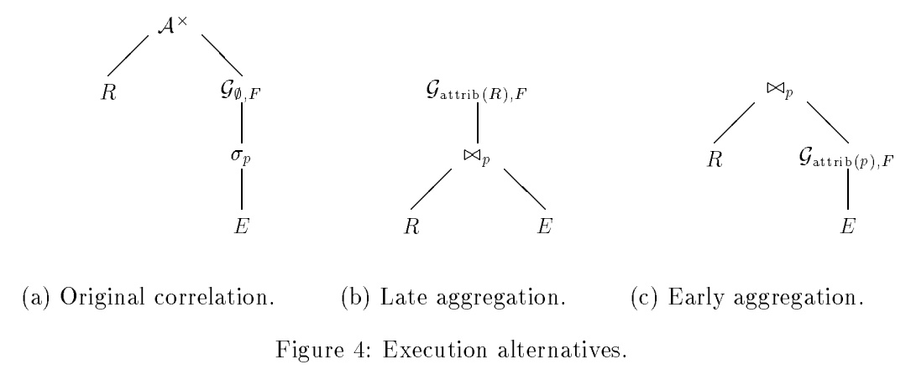
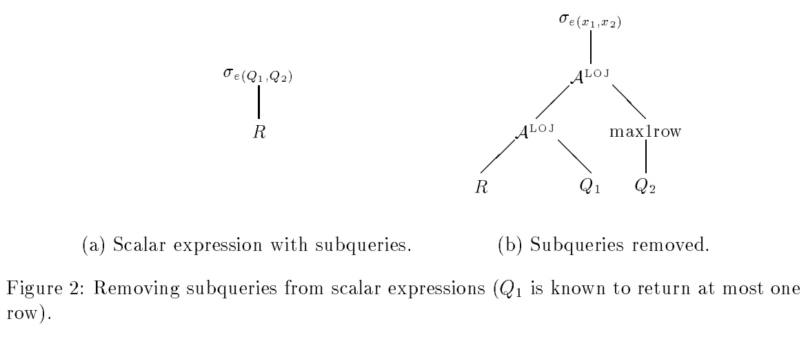
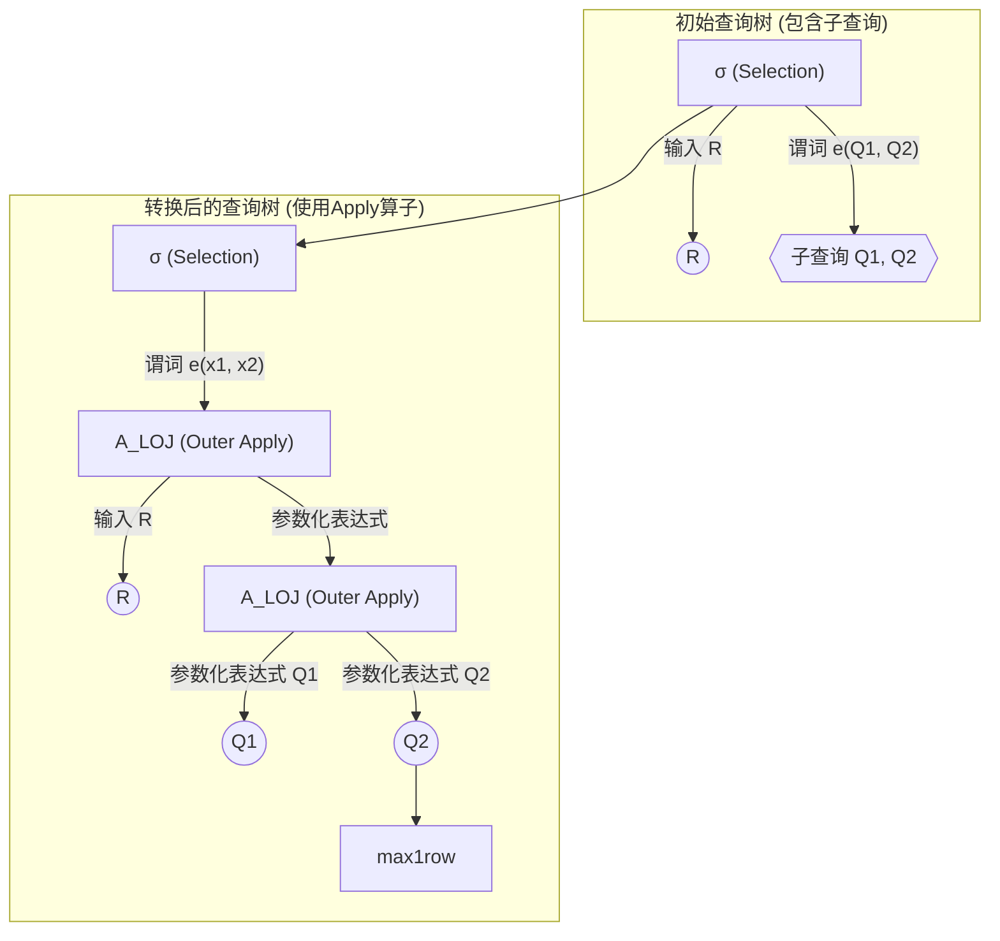
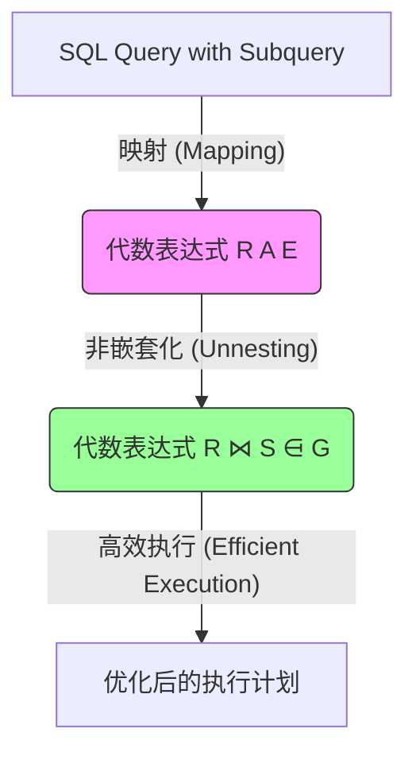

## AI论文解读 | Parameterized Queries And Nesting Equivalences
        
### 作者        
digoal        
        
### 日期        
2025-10-03       
        
### 标签        
PostgreSQL , PolarDB , DuckDB , AI , 论文解读        
        
----        
        
## 背景  
      
https://www.microsoft.com/en-us/research/wp-content/uploads/2016/02/tr-2000-31.pdf        
  
提示:          
```          
读懂《Parameterized Queries And Nesting Equivalences》这篇论文需要提前掌握哪些基础知识, 请使用中文通熟易懂的讲解这些基础知识, 可以引用论文中的图、表或使用Markdown支持的图形(text,mermaid等)增加解释性. 
  
使用中文通熟易懂的解读《Parameterized Queries And Nesting Equivalences》这篇论文, 其中的关键内容请着重讲解, 可以引用论文中的图、表或使用Markdown支持的图形(text,mermaid等)增加解释性. 
  
提取《Parameterized Queries And Nesting Equivalences》这篇论文中的重要术语, 使用中文对这些术语进行通熟易懂的讲解, 可以引用论文中的图、表或使用Markdown支持的图形(text,mermaid等)增加解释性. 
```     
  
## 1 前置知识 
  
阅读《Parameterized Queries And Nesting Equivalences》这篇论文，您需要对 **关系数据库系统（Relational Database Systems）** 的底层原理和 **查询优化（Query Optimization）** 有扎实的理解。

这篇论文的核心目标是为复杂的 **SQL 子查询（Subqueries）** 提供一个简洁且通用的代数表达框架，并证明它们总是可以被转换为非嵌套（Unnested）的形式，从而方便优化器进行处理 。

以下是读懂这篇论文需要提前掌握的四个核心基础知识，均采用论文中的概念进行阐述。

---

## 1. 关系代数（Relational Algebra）基础

关系代数是关系数据库理论的数学基础，是所有 SQL 语句最终都会被转换成的**抽象操作集合**。

这篇论文将 SQL 转换为“标准关系代数”的扩展形式 。因此，您必须熟悉以下基本关系代数操作符：

| 操作符 | 符号 | 概念解释 | SQL 对应 |
| :---: | :---: | :--- | :--- |
| **选择** | $\sigma_{p}(R)$ | 从关系 $R$ 中选出满足条件 $p$ 的元组（行）。 | `WHERE` 子句 |
| **投影** | $\pi_{A}(R)$ | 从关系 $R$ 中选出属性 $A$ （列）。 | `SELECT` 子句 |
| **笛卡尔积** | $R \times S$ | 两个关系 $R$ 和 $S$ 的所有行组合。 | 未指定 `JOIN` 条件 |
| **自然连接** | $R \bowtie S$ | 等值连接的简化，仅保留同名且值相等的列。 | `INNER JOIN` |
| **并集** | $R \cup S$ | 包含 $R$ 或 $S$ 中的所有行。 | `UNION` / `UNION ALL` |

### **重复语义（Duplicate Semantics）**

在标准关系代数中，关系被视为 **集合（Set）** ，不允许有重复的行。然而，SQL 处理的是 **多重集合（Multiset）** ，允许并保留重复行 。论文在整个框架中都考虑了重复语义，这对理解 $\pi_{A}$ （保留重复的列移除）和 $U$ （并集，包括 `UNION ALL`）等操作至关重要 。

---

## 2. SQL 子查询与关联执行（Correlated Execution）

论文的重点在于处理和优化复杂的 **SQL 子查询**，特别是 **相关子查询（Correlated Subqueries）** 。

### **子查询的类型**
SQL 92 标准中的子查询大致可分为三类，您需要了解它们的语义 ：

* **标量值子查询 (Scalar-valued)**：返回一个单列的表。如果在运行时返回多于一行，会引发运行时错误 。例如，`SELECT column = (SELECT MAX(...) FROM ...)`。
* **存在性测试 (Existential test)**：使用 `EXISTS(Q)` 检查子查询 $Q$ 是否返回非空结果（至少一行）。
* **量化比较 (Quantified comparison)**：使用 `ALL` 或 `SOME` 对一个标量表达式和一组值进行比较，例如 `WHERE expr > ALL (SELECT ...)`。

### **关联子查询 (Correlated Subqueries)**

**关联子查询**是外层查询的每一行都会影响内层查询执行（作为参数传入）的子查询。在物理执行层面，数据库通常使用 **嵌套循环（Nested Loops）** 来处理它们 。

---

## 3. 核心创新： $\mathcal{A}pply$ 算子（Apply Operator）

为了在关系代数中简洁地表达“关联执行”或“参数化执行”，论文引入了一个新的扩展关系代数算子：**$\mathcal{A}pply$ ( $\mathcal{A}$ )** 。

$\mathcal{A}pply$ 抽象了“嵌套循环（Nested Loop）”的执行模式，它是一个**非二元**操作符，需要一个关系输入 $R$ 和一个**参数化表达式** $E(\overline{x})$ 。

### **$\mathcal{A}pply$ 的直观理解**

对于输入关系 $R$ 中的每一行 $r$ ， $\mathcal{A}$ 都会使用 $r$ 的值来**参数化**并**执行** $E$ 表达式，然后将 $r$ 和 $E(r)$ 的结果进行组合。

$\mathcal{A}pply$ 的形式化定义如下（使用笛卡尔积 $\times$ 形式）：

$$R\mathcal{A}^{\times}E=\bigcup_{r\in R}(\{r\}\times E(r)) \text{ }$$

$\mathcal{A}pply$ 有多种变体，用于对应不同的 SQL 语义，例如：

* **$\mathcal{A}^{\times}$ (Cross Product Apply)**：最基本形式。
* **$\mathcal{A}^{LOJ}$ (Left Outer Join Apply)**：用于标量值子查询，如果子查询结果为空，则用 **NULL** 值填充外层行 。
* **$\mathcal{A}^{\exists}$ (Semijoin Apply)**：用于 `EXISTS` 子查询，只保留 $E(r)$ 非空时的 $r$ 行 。
* **$\mathcal{A}^{\neg}$ (Antisemijoin Apply)**：用于 `NOT EXISTS` 子查询 。

---

## 4. 嵌套等价性与非嵌套化（Nesting Equivalences and Unnesting）

论文的核心结论是：**任何包含子查询的 SQL 查询都可以被重写为不含子查询（即不含 $\mathcal{A}pply$ 算子）的代数表达式** 。这个过程被称为 **子查询非嵌套化（Subquery Unnesting）** 或**关联移除（Correlation Removal）** 。

非嵌套化的目的是将效率较低的 **嵌套循环（ $\mathcal{A}pply$ ）** 转换为效率更高的 **连接（Join）、外连接（Outerjoin）** 和 **分组（Group By）** 等操作。

### **非嵌套化的示例**

以下图表展示了一个典型的标量聚合子查询，如何从使用 $\mathcal{A}pply$ 的 **“原始关联”** 形式，转换为使用标准连接和分组聚合的 **“早期聚合”** 形式，从而实现优化。

| (a) 原始关联 (Original correlation) | (b) 晚期聚合 (Late aggregation) | (c) 早期聚合 (Early aggregation) |
| :---: | :---: | :---: |
| 带有 $\mathcal{A}^{\times}$ （嵌套执行）和内部聚合 $\mathcal{G}_{\emptyset, F}$ 的执行计划树 。 | $\mathcal{A}^{\times}$ 被转换为连接 $\bowtie_{p}$ ，并将聚合 $\mathcal{G}$ 提升到树的顶端 。 | 在执行连接之前，先对 $E$ 进行分组聚合 $\mathcal{G}$ ，从而减少数据量，提高效率 。 |


  

**图 4：执行替代方案**（来自论文 ）
  
理解这种转换（例如从图 4(a) 到图 4(c)）所需的代数属性和变换规则（例如 **Join / Group By Reordering**）是阅读本论文的关键 。
  
注： $\mathcal{G}_{F}$ 代表聚合函数 $F$ 上的分组操作 。 $E$ 通常是子查询的表达式 。 $\mathcal{G}_{attrib(R), F}$ 表示按关系 $R$ 的属性进行分组     
  
## 2 解读论文 
  
好的，我们来通俗易懂地解读这篇经典的数据库查询优化论文——《Parameterized Queries and Nesting Equivalences》。

### 论文解读：《参数化查询与嵌套等价性》

这篇于2000年由微软研究院的César A. Galindo-Legaria发表的技术报告 ，是数据库查询优化领域的一篇重要文献。它给SQL中令人头疼的 **子查询（subquery）** ，特别是 **相关子查询（correlated subquery）** ，提供了一套优雅、统一的代数化理论框架。

-----

### 核心思想

论文的核心思想是引入一个名为 **Apply (A)** 的新关系代数算子 ，用来精确地、形式化地描述“参数化执行”这一行为，而这正是相关子查询的本质。通过将任意SQL子查询都映射到包含Apply算子的代数表达式上 ，论文不仅统一了各种子查询的优化方法，还从理论上证明了：**任何包含子查询的SQL查询，都可以被等价地改写成一个不含子查询的查询** 。

简单来说，SQL子查询只是方便程序员书写的一种“语法糖”，它并没有增加关系代数的表达能力 。

-----

### 1\. 论文试图解决的问题

在当时，关于子查询优化的论文非常多 ，但它们存在两个普遍问题：

1.  **理论与现实脱节**：很多理论模型很难直接对应到真实、复杂的SQL查询上 。
2.  **理论复杂难懂**：证明过程往往需要引入大量复杂的数学工具，让数据库的开发者难以理解和应用 。

这篇论文的目标就是搭建一座桥梁，用一个对标准关系代数最小的扩展，来清晰地连接SQL子查询和代数优化 。

-----

### 2\. 核心概念：Apply (A) 算子

`Apply` 算子是理解整篇论文的关键。它的理念类似于编程语言中的 `foreach` 循环。

`Apply` 算子接收两个输入：一个关系（一张表）`R` 和一个参数化的表达式 $E(\overline{x})$ 。它的工作方式如下：

> 遍历 `R` 中的每一行 `r`，将 `r` 的值作为参数代入到表达式 `E` 中进行计算，得到结果 `E(r)`。然后，将每一行 `r` 与其对应的计算结果 `E(r)` 进行拼接，最后将所有结果合并 。

其基础形式 ( $\mathcal{A}^{\times}$ ) 的数学定义为：
$$R\mathcal{A}^{\times}E=\bigcup_{r\in R}(\{r\}\times E(r))$$


这个公式表示，对于R中的每一行r，都计算出E(r)的结果集，然后将r与E(r)中的每一行做笛卡尔积（拼接），最后将所有结果并在一起。

为了方便处理不同类型的SQL子查询，论文还定义了Apply算子的几种变体：

  * **$\mathcal{A}^{\times}$ (Cross Apply)**: 最基础的形式，将外层表的行与内层表达式的结果做笛卡尔积 。
  * **$\mathcal{A}^{LOJ}$ (Outer Apply)**: 类似于 `LEFT OUTER JOIN`。如果内层表达式 $E(r)$ 的结果为空，外层表的行 `r` 仍然保留，内层结果部分用 `NULL` 填充 。这对于处理可能返回空集的子查询至关重要 。
  * **$\mathcal{A}^{\exists}$ (Semijoin Apply)**: 类似于 `SEMI JOIN`。只有当内层表达式 $E(r)$ 结果**非空**时，外层表的行 `r` 才会被保留 。这完美对应了SQL中的 `EXISTS` 子句。
  * **$\mathcal{A}^{\neg\exists}$ (Antisemijoin Apply)**: 类似于 `ANTI SEMI JOIN`。只有当内层表达式 $E(r)$ 结果**为空**时，外层表的行 `r` 才会被保留 。这对应了SQL中的 `NOT EXISTS` 子句。

-----

### 3\. 关键流程：如何将SQL子查询代数化

论文展示了如何将一个包含子查询的SQL语句，系统性地转换成一个由`Apply`算子构成的代数查询树。这个过程被称为“移除子查询”或“提升子查询”。

以下面的查询树为例（改编自论文图2），它展示了这一核心转换过程 。

  



**图解说明 (基于论文图2)**:

1.  **左侧 (初始状态)**: 一个选择操作 `σ` 应用在关系 `R` 上，其选择条件 `e` 中直接调用了子查询 `Q1` 和 `Q2` 。在传统的执行模型中，每处理 `R` 的一行，就可能需要调用查询引擎去执行`Q1`和`Q2` 。
2.  **右侧 (转换后)**:
      * 子查询 `Q1` 和 `Q2` 从选择条件中被“提”了出来 。
      * 通过一系列的 `Apply` 算子（这里是 `A_LOJ`），先为 `R` 的每一行计算出 `Q1` 和 `Q2` 的结果 。
      * 这些结果被作为新的列（如图中的`x1`, `x2`）附加到 `R` 的每一行后面 。
      * 最后的选择操作 `σ` 的条件变成了不含子查询的普通表达式 `e(x1, x2)` 。
      * 对于要求返回单值的标量子查询，可能会增加一个 `max1row` 算子来确保其在运行时最多只返回一行，否则报错 。

通过这种方式，任何复杂的SQL子查询都可以被转换成一个不含嵌套调用的、纯粹的“数据流”式的代数查询计划 。

-----

### 4\. 核心价值：子查询“去嵌套”（Unnesting）与优化

一旦查询被转换成 `Apply` 的形式，数据库优化器就可以利用丰富的代数变换规则来寻找更优的执行计划。这个过程就是所谓的 **“去嵌套” (Unnesting)** 或 **“相关消除” (Correlation Removal)** 。

论文中的图4完美地展示了这一点，它给出了一个典型的标量聚合子查询的三种等价执行方案 。

  

| 查询计划 (论文图4) | 结构 | 解释 |
| :--- | :--- | :--- |
| **(a) 原始相关执行**  | `R A (G (σ (E)))` | 这是最直观的执行方式。对R的每一行，都去E中筛选、再聚合。这是典型的嵌套循环（correlated execution） 。 |
| **(b) 延迟聚合**  | `G (R ⋈ E)` | 先将R和E做连接（Join），在连接后的大表上做一次聚合（Group By） 。这通常被称为“先连接后聚合”。 |
| **(c) 提早聚合**  | `R ⋈ (G (E))` | 先对E表进行聚合，得到一个可能小得多的中间结果，再将这个小结果与R进行连接 。这通常被称为“先聚合后连接”。 |

**为什么这个转换如此重要？**
因为这三种计划的执行效率可能有天壤之别。

  * 如果 `R` 表非常小，**计划 (a)** 的相关执行可能最快 。
  * 如果 `E` 表经过聚合后能极大减少数据量，**计划 (c)** 可能会是最佳选择。
  * 在其他情况下，**计划 (b)** 也可能是优选。

通过 `Apply` 算子这个统一的中间形式，优化器可以将一个复杂的子查询，转换为多个代数等价的、但性能特性完全不同的执行计划，然后通过成本估算模型（Cost Estimation）来选择最优的一个 。这就极大地扩展了优化的可能性。

-----

### 总结

《Parameterized Queries and Nesting Equivalences》这篇论文做出了以下核心贡献：

1.  **提出了 `Apply` 算子**：创造性地使用一个简单的代数算子，清晰、形式化地定义了数据库中的参数化执行，统一了所有SQL子查询的代数表示 。
2.  **建立了转换框架**：提供了一套将任意SQL子查询转换为包含`Apply`算子的代数表达式的系统性方法 。
3.  **证明了等价性**：在此框架上，严谨地证明了子查询并不增加SQL的表达能力，任何子查询都可以被“去嵌套”，转换成等价的Join、Group By等基础算子的组合 。
4.  **赋能了优化器**：为查询优化器打开了广阔的优化空间，使其能够将复杂的子查询转换成多种执行计划（如提前聚合、延迟聚合等），并从中选择成本最低的一个 。

这篇论文提出的理论，至今仍是现代主流数据库（如SQL Server, Oracle, PostgreSQL等）查询优化器处理子查询的理论基石。
  
## 3 术语 
  
这篇论文是数据库查询优化领域的一篇经典技术报告，旨在为复杂的 **SQL 子查询**提供一个通用且可优化的代数框架。

以下是理解这篇论文最重要的几个核心术语，它们构成了论文的理论基础和主要贡献。

-----

## 1\. 核心代数扩展： $\mathcal{A}pply$ 算子（Apply Operator）

**中文解释：** $\mathcal{A}pply$ 算子（ 通常简写为 $\mathcal{A}$ ）是论文中引入的**核心创新**。它用于在关系代数中简洁地表达 **“参数化执行”** 或 **“关联执行”** 的逻辑，也就是我们常说的 **SQL 关联子查询**在数据库内部的执行方式。

  * **参数化查询（Parameterized Queries）：** 这是 $\mathcal{A}pply$ 算子所抽象的执行模式。当一个外部查询的行（ 元组 $r$ ）被作为**参数**传递给内部查询 $E$ 时，内部查询 $E(r)$ 就会根据这些参数的值来执行。这种执行方式类似于编程中的 **嵌套循环（Nested Loops）** 。

| 外层关系 $R$ (Drivers) | 内层表达式 $E$ (Parameterized) | $\mathcal{A}pply$ 操作 ( $R\mathcal{A}E$ ) |
| :---: | :---: | :---: |
| 对 $R$ 中的每一行 $r$ | 使用 $r$ 的值来**参数化** $E$ | 将 $r$ 和 $E(r)$ 的结果进行**组合** |

### $\mathcal{A}pply$ 的作用

$\mathcal{A}pply$ 算子可以视为一个功能更强大的连接（Join）操作，它能以统一的方式涵盖各种类型的子查询，包括：

  * **存在性测试** (`EXISTS` / `NOT EXISTS`)：对应 $\mathcal{A}^{\exists}$ (Semijoin Apply) 和 $\mathcal{A}^{\neg}$ (Antisemijoin Apply)。
  * **标量值子查询**：对应 $\mathcal{A}^{LOJ}$ (Left Outer Join Apply) 等。

-----

## 2\. 优化目标：非嵌套化（Unnesting）

**中文解释：** **非嵌套化**是查询优化器的核心目标。关联子查询（即 $\mathcal{A}pply$ 算子）虽然语义清晰，但在物理执行时效率较低（因为它需要逐行执行嵌套循环）。**非嵌套化**就是将这种低效的 $\mathcal{A}pply$ 表达式转换为高效的**标准关系代数操作符**，例如：连接（Join）、外连接（Outer Join）、分组（Group By）等。

### **嵌套 vs. 非嵌套**

我们可以用一个简单的图示来理解优化器的工作：



  * $R \mathcal{A} E$ 代表使用 $\mathcal{A}pply$ 算子的**嵌套形式**。
  * $R \bowtie S \mathcal{G}$ 代表使用 **连接** ( $\bowtie$ ) 和 **分组聚合** ( $\mathcal{G}$ ) 的**非嵌套形式**。

非嵌套化的意义在于，将原本的 **逐行处理（Row-by-Row）** 转化为数据库最擅长的 **基于集合（Set-Based）** 的高速批量处理。

-----

## 3\. 理论基础：嵌套等价性（Nesting Equivalences）

**中文解释：** **嵌套等价性**是论文的主要理论贡献。它是一系列代数转换规则，证明了**任何**复杂的 $\mathcal{A}pply$ 表达式，都可以找到一个**语义上等价**（即结果完全相同）的**非嵌套**表达式。

  * **等价性 (Equivalence)：** 意味着转换前后的两个表达式虽然形式不同，但对于所有可能的输入数据，产生的结果集都是相同的。
  * **作用：** 这些等价性规则（ 例如 $\mathcal{A}^{\exists} \equiv \text{Semijoin}$ ， $\mathcal{A}^{\times} \circ \mathcal{G} \equiv \text{Join} \circ \mathcal{G}$ ）构成了查询优化器进行重写的数学依据。它们让优化器能够把低效的 $\mathcal{A}pply$ 替换为高效的 Join/Group By。

一个重要的优化案例（如论文中**图 4**所示的执行替代方案）：    

1.  **原始关联 (Original Correlation)：** 执行计划树的底部是一个 $\mathcal{A}pply$ 操作。
2.  **早期聚合 (Early Aggregation)：** 优化后的计划，将内部子查询的聚合操作 ( $\mathcal{G}$ ) 从 $\mathcal{A}pply$ 内部提升到 $\mathcal{A}pply$ 之前执行。

通过 **非嵌套化等价性**，优化器可以实现这种“早期聚合”，**先在较小的数据集上完成计算**，再进行连接，从而大幅减少总计算量，提高效率。

-----

## 4\. 基础要求：重复语义（Duplicate Semantics）

**中文解释：** 关系代数最初是建立在数学上的**集合论**之上，不允许有重复的行。然而，SQL 语言处理的是 **多重集合（Multisets）** ，即允许且保留重复的行（例如，`SELECT * FROM T`）。

  * **为什么重要？** 当涉及到 $\pi$ （投影）或 $U$ （并集）等操作时，必须考虑是否保留重复项。
      * 标准关系代数中的 $\pi$ 会去重。
      * SQL 中的 `SELECT` 默认保留重复项。
  * **论文的处理：** 为了能完全映射 SQL 的行为，论文中的 $\mathcal{A}pply$ 及其相关的代数操作符都是在 **重复语义**（Multiset Semantics）下定义的。理解这一点，才能正确地解释像 `UNION ALL`（保留重复）或 `SELECT DISTINCT`（去除重复）这样的 SQL 语句如何被代数框架所涵盖。
  
## 参考        
         
https://www.microsoft.com/en-us/research/wp-content/uploads/2016/02/tr-2000-31.pdf    
        
<b> 以上内容基于DeepSeek、Qwen、Gemini及诸多AI生成, 轻微人工调整, 感谢杭州深度求索人工智能、阿里云、Google等公司. </b>        
        
<b> AI 生成的内容请自行辨别正确性, 当然也多了些许踩坑的乐趣, 毕竟冒险是每个男人的天性.  </b>        
      
#### [期望 PostgreSQL|开源PolarDB 增加什么功能?](https://github.com/digoal/blog/issues/76 "269ac3d1c492e938c0191101c7238216")
  
  
#### [PolarDB 开源数据库](https://openpolardb.com/home "57258f76c37864c6e6d23383d05714ea")
  
  
#### [PolarDB 学习图谱](https://www.aliyun.com/database/openpolardb/activity "8642f60e04ed0c814bf9cb9677976bd4")
  
  
#### [PostgreSQL 解决方案集合](../201706/20170601_02.md "40cff096e9ed7122c512b35d8561d9c8")
  
  
#### [德哥 / digoal's Github - 公益是一辈子的事.](https://github.com/digoal/blog/blob/master/README.md "22709685feb7cab07d30f30387f0a9ae")
  
  
#### [About 德哥](https://github.com/digoal/blog/blob/master/me/readme.md "a37735981e7704886ffd590565582dd0")
  
  

  
