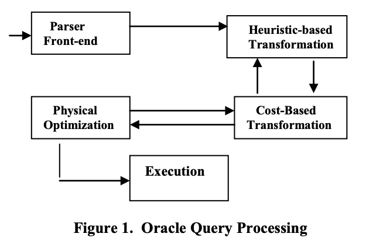
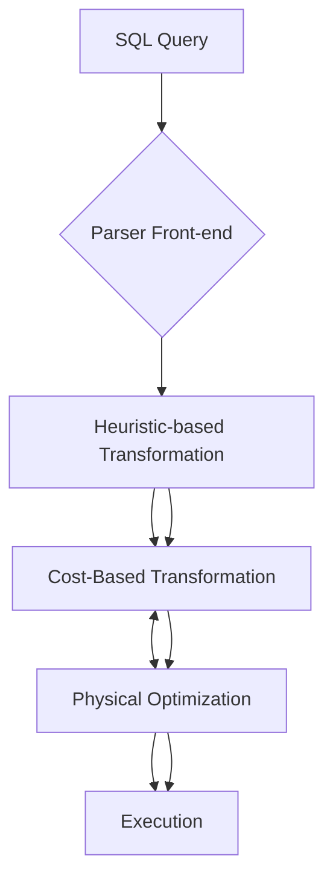
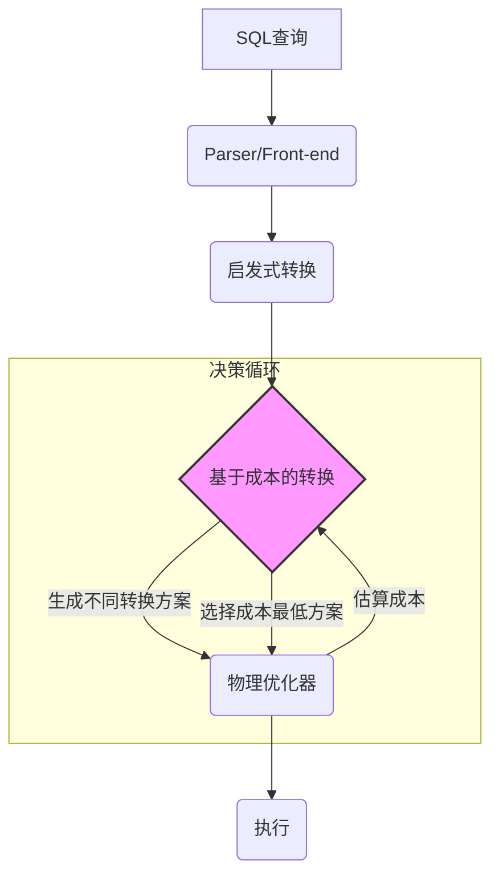
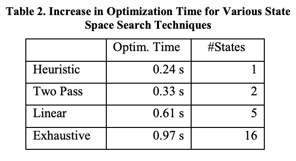

## AI论文解读 | Cost-Based Query Transformation In Oracle
        
### 作者        
digoal        
        
### 日期        
2025-10-03       
        
### 标签        
PostgreSQL , PolarDB , DuckDB , AI , 论文解读        
        
----        
        
## 背景  
      
https://www.researchgate.net/profile/Rafi-Ahmed-2/publication/221311318_Cost-Based_Query_Transformation_in_Oracle/links/572bbc5e08aef7c7e2c6b829/Cost-Based-Query-Transformation-in-Oracle.pdf        
  
提示:          
```          
读懂《Cost-Based Query Transformation In Oracle》这篇论文需要提前掌握哪些基础知识, 请使用中文通熟易懂的讲解这些基础知识, 可以引用论文中的图、表或使用Markdown支持的图形(text,mermaid等)增加解释性. 
  
使用中文通熟易懂的解读《Cost-Based Query Transformation In Oracle》这篇论文, 其中的关键内容请着重讲解, 可以引用论文中的图、表或使用Markdown支持的图形(text,mermaid等)增加解释性. 
  
提取《Cost-Based Query Transformation In Oracle》这篇论文中的重要术语, 使用中文对这些术语进行通熟易懂的讲解, 可以引用论文中的图、表或使用Markdown支持的图形(text,mermaid等)增加解释性. 
```     
  
## 1 前置知识 
  
要读懂《Cost-Based Query Transformation In Oracle》（Oracle中基于成本的查询转换）这篇论文，你需要掌握以下几个核心基础知识。这篇论文是关于数据库**查询优化器**如何做出更“聪明”的决策，所以所有的基础都围绕着它展开。

-----

## 1\. 关系数据库与 SQL 基础 (RDBMS and SQL Fundamentals)

这是理解论文的前提，你需要熟悉复杂的 SQL 结构。

### 1.1 核心 SQL 结构

论文重点讨论的转换目标，就是以下这些复杂的 SQL 语句：

  * **嵌套子查询 (Nested Subqueries):** 包括相关子查询（Correlated Subqueries）和非相关子查询。例如论文中 Q1 查询，就包含了一个用于计算**部门平均工资**的相关子查询 。
  * **聚合函数与分组 (Aggregation & Group By):** `AVG()`, `SUM()`, `GROUP BY`, `SELECT DISTINCT` 等 。
  * **视图 (Views) 与内联视图 (Inline Views):** 查询中的子查询常常会被转换成内联视图 (Derived Tables) 。
  * **集合操作符 (Set Operators):** `UNION`, `UNION ALL`, `INTERSECT`, `MINUS` 等 。

### 1.2 查询表示方式

你需要理解查询在优化器内部是如何表示的：

  * **查询树 (Query Tree):** 一种保留了 SQL 声明性语法的内部表示形式。论文中的所有转换都围绕着操作查询树进行 。
  * **操作符树 (Operator Tree) / 执行计划 (Execution Plan):** 经过物理优化后生成的树，指定了具体的执行步骤、连接顺序和方法 。

-----

## 2\. 数据库查询优化器原理 (Query Optimizer Principles)

这是论文的直接主题。传统的关系数据库查询优化通常分为两个核心阶段 ：

### 2.1 逻辑优化（查询转换）

  * **目标：** 将原始查询重写成一个**语义等价**但**更具声明性**、**更可能最优**的形式 。
  * **传统做法：** 通常基于**启发式规则 (Heuristics)** 。例如， **“总是尽早进行选择 (Early Selection)”** 是一种启发式规则，因为它能减少后续处理的数据量。
  * **论文中的启发式转换示例:**
      * **子查询非嵌套/合并 (Subquery Unnesting/Merging):** 将 `EXISTS` 或 `IN` 子查询直接合并到外层查询中，转换为连接 (Join) 或半连接 (SemiJoin)，以避免低效的**元组迭代语义 (TIS, Tuple Iteration Semantics)** 。
      * **连接消除 (Join Elimination):** 移除不会影响查询结果的冗余连接，例如基于主键/外键约束的连接 。

### 2.2 物理优化

  * **目标：** 在单个**查询块 (Query Block)的范围内，确定最有效率的执行计划 (Execution Plan)** 。
  * **决策内容：**
      * **访问方法 (Access Methods):** 如何读取表数据（如全表扫描、索引扫描）。
      * **连接顺序 (Join Orders):** 多个表之间先连接哪个，再连接哪个（如 `A join B` 再 `join C`）。
      * **连接方法 (Join Methods):** 使用哪种连接算法（如嵌套循环连接 Nested-Loop Join、哈希连接 Hash Join、排序合并连接 Sort-Merge Join） 。

-----

## 3\. 成本优化器与决策要素 (Cost-Based Optimization - CBO)

论文的 **“基于成本的转换”** 是传统优化器的升级。你需要理解什么是“成本”以及如何估算它。

### 3.1 成本估算 (Cost Estimation)

  * **定义：** 优化器根据统计信息，预测执行某个操作（或整个计划）所需的**资源消耗**，通常代表执行时间。
  * **关键统计信息 (Statistics):**
      * **表的大小 (Relative Sizes of Tables):** 表中行数。
      * **谓词选择性 (Selectivity of Predicates):** 过滤条件能筛掉多少数据。
      * **索引的存在性 (Existence of Indexes):** 索引能加快访问速度。

### 3.2 转换中的成本权衡 (Trade-offs in Transformation)

许多转换之所以需要“成本”决策，是因为它们没有绝对的好坏，需要权衡利弊 。

  * **例如：子查询非嵌套**
      * **好处 (转换后 Q10):** 可以使用更灵活、更高效的连接方法（Hash Join, Sort-Merge Join），且聚合操作（如 `AVG(salary)`）只需计算**一次** 。
      * **坏处 (未转换 Q1):** 如果外层查询的过滤条件非常严格，导致需要计算平均工资的员工数量非常少，那么使用**元组迭代语义 (TIS)** 并配合索引可能反而更快 。
      * **结论：** 转换的决策必须是**基于成本**的 。

### 3.3 框架概览（图 1）

下图展示了 Oracle 将**基于成本的转换**作为一个独立且重要的阶段，嵌入到传统的查询处理流程中 。

  * **Heuristic-based Transformation（基于启发式的转换）** 先对查询进行初步优化。
  * **Cost-Based Transformation（基于成本的转换）** 在此基础上，通过调用 **Physical Optimization（物理优化）** 来估算不同转换方案的成本，从而选择最优的转换方式 。

  



-----

## 4\. 论文中涉及的关键连接与聚合转换

理解这些转换的原理，能让你更容易理解成本权衡是如何发生的：

| 转换类型 (Transformation) | 作用 (What it does) | 成本权衡的重点 (Key Cost Trade-off) |
| :--- | :--- | :--- |
| **子查询非嵌套** (Subquery Unnesting)  | 将嵌套子查询转换为连接 (Join)、半连接 (SemiJoin) 或生成内联视图 (Inline View) 。 | **元组迭代语义 (TIS)** 的高效性 vs. **连接方法 (Join Methods)** 的多样性 。 |
| **聚合视图合并** (Group-By View Merging)  | 将包含 `GROUP BY` 或 `DISTINCT` 的视图合并到外层查询中，**延迟聚合** 。 | **提前聚合** (Early Aggregation, 减少连接数据量) vs. **延迟聚合** (Delayed Aggregation, 在过滤后对更小数据集聚合) 。 |
| **连接谓词下推** (Join Predicate Pushdown)  | 将外层查询与视图的连接条件推入视图内部，充当**相关谓词 (Correlation)**，从而可能利用**索引**进行**嵌套循环连接 (Nested-Loop Join)** 。 | 消除视图内昂贵的 `DISTINCT` 操作  vs. 施加了连接顺序限制 。 |
| **连接因子分解** (Join Factorization)  | 将 `UNION ALL` 分支中的公共表提取出来，在外部连接，避免对公共表的重复访问 。 | 避免重复访问公共表 vs. 引入新的查询结构和连接 。 |

简而言之，要阅读这篇论文，你必须将 **SQL 语言**、**关系代数**、**查询优化阶段**以及**成本模型**这四个知识点结合起来，理解优化器为何要在各种转换之间进行取舍。
  
## 2 解读论文 
  
好的，我们来一起用通俗易懂的方式解读这篇关于Oracle数据库核心技术的经典论文——《Cost-Based Query Transformation in Oracle》。

这篇论文发表于2006年的顶级数据库会议VLDB ，由Oracle公司的多位核心工程师撰写 。它揭示了Oracle查询优化器的一个革命性阶段： **基于成本的查询转换（Cost-Based Query Transformation, CBQT）** 。

简单来说，这篇论文的核心思想是：当数据库面对一个复杂的SQL查询时，有很多种“改写”或“变形”的方法，但哪种变形是最好的呢？传统方法靠的是一些固定的“经验法则”（启发式），但这不总是最优。Oracle引入的CBQT框架，则是通过**实际估算每种变形方案的执行成本（代价），然后选择成本最低的那一种**，从而实现更智能、更高效的查询优化。

-----

### 1\. 问题的核心：为什么要“基于成本”？

在理解CBQT之前，我们先要了解传统的查询优化流程。它通常分为两个阶段 ：

1.  **逻辑优化 (Logical Optimization)**: 这个阶段基于一些**启发式规则 (Heuristic Rules)** 对SQL进行等价改写 。这些规则就像是“经验之谈”，比如“尽早过滤掉不需要的数据总是好的”。这些改写通常被认为是“有益无害”的，所以会直接应用。
2.  **物理优化 (Physical Optimization)**: 这个阶段会基于数据的统计信息，为改写后的SQL选择具体的执行方式，比如用哪种连接方法（嵌套循环、哈希连接等）、表的访问顺序等，并估算出最终的执行成本 。

**那么问题来了**：很多查询转换并不是“绝对的好”或“绝对的坏”，它们的效果**严重依赖于具体的数据**。

**论文中的例子 (Q1)**：
假设一个查询，需要找出在美国的部门里，工资高于本部门平均工资的员工。这个查询包含了两个子查询：一个用来筛选部门地点，另一个用来计算平均工资。

对于这个查询，优化器有多种转换选择 ：

  * **选择1**：不转换，保持原样执行。
  * **选择2**：只转换“计算平均工资”的子查询。
  * **选择3**：只转换“筛选部门地点”的子查询。
  * **选择4**：两个子查询都转换。

哪种选择最好？启发式规则很难回答。比如，如果员工表非常大，但只有极少数员工在美国的部门工作，那么保持原样（先过滤员工，再计算少数人的平均工资）可能更快。反之，如果大部分员工都在美国，那么先一次性计算好所有部门的平均工资，再进行连接可能会更优。

这就是CBQT要解决的问题：**为那些效果不确定的转换，引入一个基于成本的决策机制** 。

-----

### 2\. Oracle中的两类转换策略

Oracle将查询转换分成了两大类：**启发式转换** 和 **基于成本的转换** 。

#### 2.1 启发式转换 (Heuristic Transformations)

这些是被认为是“基本无害”或者“总是更优”的转换，优化器会强制执行它们 。

  * **子查询解嵌套 (Subquery Unnesting)**: 将某些简单的子查询合并到主查询中 。例如，将`WHERE EXISTS (SELECT ...)`改写成一个多表连接 。这使得优化器可以考虑更多的连接顺序和连接方法 。
  * **连接消除 (Join Elimination)**: 如果一个连接是多余的，就把它移除 。例如，当一个表通过外键连接到其主键表，并且查询中没有引用主键表的任何其他列时，这个连接就可以被安全地消除 。
  * **过滤谓词移动 (Filter Predicate Move Around)**: 其核心思想是**谓词下推 (Predicate Pushdown)**，即尽可能早地执行过滤操作 。这可以大大减少后续操作（如连接、聚合）需要处理的数据量 。
  * **分组裁剪 (Group Pruning)**: 如果一个视图（View）中进行了分组（GROUP BY），而外部查询的条件可以提前排除掉某些分组，那么就在分组前应用这些条件 。

#### 2.2 基于成本的转换 (Cost-Based Transformations)

这些是存在利弊权衡（Trade-off）的转换，需要估算成本来做决策 。

  * **子查询解嵌套（生成视图）** : 对于一些复杂的子查询（如带聚合的或多表的），解嵌套会生成一个内联视图（Inline View） 。

      * **优点**: 视图只需要计算一次，并且优化器可以自由安排它与其他表的连接顺序 。
      * **缺点**: 如果原查询的外部条件能过滤掉大量数据，导致子查询只需要执行几次，那么原生的执行方式（Tuple Iteration Semantics）可能反而更快 。
      * **决策**: **必须基于成本**来判断哪种方式更好 。

  * **GROUP BY 与 Distinct 视图合并 (View Merging)**: 是否将一个带`GROUP BY`或`DISTINCT`的视图合并到主查询中 。

      * **不合并（提前聚合）** : 优点是先聚合，可以减少后续连接的数据量 。
      * **合并（延迟聚合）** : 优点是让所有表先连接，外部的过滤条件可以先起作用，从而减少需要聚合的数据量 。
      * **决策**: 这是一个典型的**提前聚合 vs 延迟聚合**的权衡，必须估算成本 。

  * **连接谓词下推 (Join Predicate Pushdown)**: 将外部的连接条件推入到一个视图内部 。

      * **优点**: 这可以让视图与外部表进行嵌套循环连接（Nested-Loop Join），尤其在外部表结果集很小且视图内部有合适索引时，效率极高 。
      * **缺点**: 这种转换强制了连接顺序（外部表必须先于视图），并且强制了连接方法为嵌套循环 。如果其他连接方式（如哈希连接）更优，则这种转换会适得其反。
      * **决策**: 需要基于成本在“下推”和“不下推”之间选择 。

-----

### 3\. CBQT框架的核心机制

Oracle如何实现这一套复杂的成本决策流程呢？论文中的图1清晰地展示了其架构。

  



*图解: Oracle查询处理流程*

这个流程的核心在于**启发式转换**和**基于成本的转换**之间增加了一个**决策循环**：

1.  **识别机会**: CBQT模块首先识别出所有可以应用的“基于成本的转换”机会（例如，一个查询里有3个可以解嵌套的子查询）。
2.  **生成状态空间**: 它会生成一个包含所有可能转换组合的“状态空间”。比如对于3个子查询，就会有 $2^3=8$ 种状态（都不转换、只转换第1个、只转换第1和2...）。
3.  **循环评估**:
      * 取出一种状态（比如，“只转换第1个子查询”）。
      * 生成一个临时的、转换后的查询结构。
      * 调用**物理优化器**对这个临时结构进行一次完整的优化和成本估算 。
      * 记录下这个状态的成本。
4.  **选择最优**: 评估完所有（或部分）状态后，选择那个成本最低的状态，并将其对应的转换应用到原始查询上。
5.  **最终优化**: 将最终确定的查询结构交给物理优化器，生成最终的执行计划。

#### 如何应对“组合爆炸”问题？

当转换机会很多时，状态空间会变得异常庞大（例如，10个机会就有1024种组合），全部评估一遍是不现实的 。为此，Oracle设计了多种**状态空间搜索策略** ：

  * **Exhaustive (穷举)**: 当机会很少时（比如少于4个），尝试所有组合，保证找到最优解 。
  * **Linear (线性)**: 基于动态规划思想，假设转换之间相互独立，每次只决策一个转换，大大减少评估次数 。
  * **Two-pass (两遍)**: 最简单快捷的策略，只比较两种极端情况：“一个都不转” vs “全部都转” 。
  * **Iterative (迭代)**: 一种折中的随机搜索算法，试图在时间和效果之间找到平衡 。

Oracle会根据查询的复杂度和转换机会的数量，自动选择合适的搜索策略 。

-----

### 4\. 性能研究：CBQT真的有效吗？

论文用一个包含241,000个真实应用查询的负载进行了测试 。结果非常令人信服：

  * **总体效果**: 对于那些受CBQT影响的查询，开启CBQT后，总运行时间（优化+执行）平均**提升了20%** 。
  * **对复杂查询更有效**: 越是耗时的查询，从CBQT中获得的收益越大。对于运行时间排名前5%的查询，性能**提升了27%** 。对于最耗时的20个查询，性能平均**提升了250%** 。
  * **特定转换的效果**:
      * **子查询解嵌套**: 对于受影响的查询，平均性能**提升了惊人的387%** 。这证明了子查询解嵌套是至关重要的一项优化。
      * **Join Predicate Pushdown (JPPD)**: 平均性能**提升了23%** 。
      * **Group-By Placement (GBP)**: 平均性能**提升了21%** 。
  * **优化的代价**: 实现这些性能提升的代价是优化时间的增加。在第一个实验中，优化时间**增加了40%** 。但这通常是值得的，因为一次性的几十毫秒优化时间，换来的是可能长达数小时的执行时间缩短。

下面的表格（简化自论文Table 2）清晰地展示了不同搜索策略对一个查询的优化时间影响：

  

| 搜索策略 | 优化时间 (秒) | 评估的状态数 |
| :--- | :--- | :--- |
| Heuristic (启发式) | 0.24 s | 1 |
| Two Pass (两遍) | 0.33 s | 2 |
| Linear (线性) | 0.61 s | 5 |
| Exhaustive (穷举) | 0.97 s | 16 |

*数据来源*

-----

### 5\. 总结与贡献

这篇论文做出了两大核心贡献 ：

1.  **提出了一个切实可行的框架**，将各种复杂的查询转换集成到一个统一的、基于成本的决策系统中。这个框架能够系统性地探索不同的查询“变形”，并智能地选择最优方案 。
2.  **设计了多种状态空间搜索算法**，有效解决了“组合爆炸”问题，使得CBQT在复杂的商业数据库系统中成为可能，并能在优化时间和执行性能之间取得良好平衡 。

总而言之，《Cost-Based Query Transformation in Oracle》不仅仅是一篇学术论文，它更是对现代商用数据库优化器内部工作机制的一次深刻揭秘。它告诉我们，最优秀的优化器不仅仅是执行一堆固定的规则，而是像一位经验丰富的指挥家，面对多种可能性，通过精准的“成本核算”，动态地谱写出最高效的执行乐章。
  
## 3 术语 
  
这是一篇关于 Oracle 数据库查询优化器核心技术的论文。要读懂它，需要理解以下一系列环环相扣的重要术语。

---

## 核心概念：为何需要“基于成本”的转换？

### 1. 基于成本的查询转换 (Cost-Based Query Transformation, CBQT)

* **中文解释:** 这是论文的核心主题，指的是查询优化器在进行**逻辑转换**时，不再仅仅依靠固定的**经验规则**（启发式），而是为每一种可能的转换方案**估算执行成本**，然后选择成本最低的方案。
* **通俗理解:** 传统的优化器像一个只看地图的向导，总选择固定路线。CBQT 的优化器像一个有 GPS 的向导，会实时计算不同路线（转换方案）在当前交通状况（数据统计信息）下的耗时（成本），从而做出更精确的选择。

### 2. 基于启发式规则的转换 (Heuristic-based Transformation)

* **中文解释:** 优化器早期或传统的转换阶段。它依赖于一些**通用、经验性的规则**。
* **通俗理解:** 例如，“总是将过滤条件（`WHERE` 子句）推到连接（`JOIN`）之前执行”，因为这通常能减少数据量。这种转换速度快，但不够灵活，在某些复杂场景下可能不是最优解。CBQT 是在启发式转换之后、对其进行**补充和升级**。

### 3. 物理优化 (Physical Optimization)

* **中文解释:** 这是优化器的一个独立阶段，负责决定查询的**具体执行方式**，包括：
    * 使用哪个索引（或全表扫描）。
    * 表之间的**连接顺序**。
    * 使用哪种**连接算法**（如 Hash Join、Nested Loop Join）。
* **与 CBQT 的关系:** CBQT 本身不执行物理优化，但它会**调用**物理优化器来对不同的查询转换方案进行**成本估算**。物理优化器是 CBQT 的“计算器”。

---

## 关键技术：解决低效的查询结构

### 4. 子查询非嵌套 (Subquery Unnesting)

* **中文解释:** 将 SQL 语句中嵌套的子查询（例如 `WHERE EXISTS` 或 `WHERE IN`）重写成一个**连接 (JOIN)** 操作。
* **通俗理解:**
    * **转换前：** 像在做一件重复工作，对外层查询的每一行数据，都要**重复运行一次**内层子查询。
    * **转换后：** 变成两个表的连接，可以利用 Hash Join 或 Sort-Merge Join 等高效的连接算法，通常性能会大幅提升。
* **成本权衡:** 非嵌套并非总是最优。如果外层查询的过滤性非常好，数据量极小，那么直接重复运行子查询可能更快，因此需要 CBQT 来决定是否转换。

### 5. 元组迭代语义 (Tuple Iteration Semantics, TIS)

* **中文解释:** 描述的是 **相关子查询（Correlated Subquery）** 的低效执行模型。
* **通俗理解:** **元组 (Tuple)** 就是数据库中的一行数据。**迭代 (Iteration)** 就是重复。TIS 意味着优化器必须对外层查询的**每一行元组**，都重复**迭代执行**内层子查询。这是**子查询非嵌套**（见第 4 条）想要消除的主要低效模式。

### 6. 聚合视图合并 (Group-By View Merging)

* **中文解释:** 针对包含 `GROUP BY` 或 `DISTINCT` 的子查询或内联视图（Inline View）的转换。它决定是将聚合操作（如 `SUM`, `AVG`） **提前** 还是**延迟**到连接操作之后。
* **通俗理解:** 假设你要计算部门的平均工资并和部门信息表连接：
    * **提前聚合（不合并）：** 先计算好平均工资（数据量变小），再和部门信息连接。
    * **延迟聚合（合并）：** 先连接员工信息和部门信息（数据量可能很大），再对连接结果进行分组聚合。
* **CBQT 决策点:**
    * 如果**聚合操作**能大幅减少行数，**提前聚合**更好。
    * 如果**连接操作**的条件非常严格，能大幅减少行数，**延迟聚合**可能更好。这个复杂的权衡必须通过成本模型来决定。

---

## 结构与约束

### 7. 查询块 (Query Block)

* **中文解释:** 数据库优化器进行物理优化的**基本单位**。一个复杂的 SQL 语句（包含子查询、UNION 等）可能包含多个查询块。
* **CBQT 的作用:** CBQT 的核心价值在于打破了查询块的边界，将不同查询块的内容**合并 (Merge)** 或**重组**，从而允许物理优化器在更大的范围内寻找最优的执行计划。

### 8. 语义等价 (Semantic Equivalence)

* **中文解释:** 所有查询转换的前提和约束。无论优化器如何重写 SQL，**转换后的查询必须与原始查询返回完全相同的结果**。
* **通俗理解:** 转换可以改变查询的“做法”，但绝不能改变查询的“结果”。这是查询转换的**安全保障**。

---

## 复杂转换示例

### 9. 连接因子分解 (Join Factorization)

* **中文解释:** 针对包含 **UNION ALL**（求并集）操作的复杂查询。如果 `UNION ALL` 的不同分支中包含对同一个表的**重复连接**，它可以将这个公共的连接操作**提取**到 `UNION ALL` 外部。
* **通俗理解:** 假设你有两个查询 `Q1 UNION ALL Q2`，它们都连接了 `Table X`。因子分解就是把 `Table X` 的连接只做一次，避免对同一个表的数据进行两次读取和连接，从而节省 I/O 资源。
  
## 参考        
         
https://www.researchgate.net/profile/Rafi-Ahmed-2/publication/221311318_Cost-Based_Query_Transformation_in_Oracle/links/572bbc5e08aef7c7e2c6b829/Cost-Based-Query-Transformation-in-Oracle.pdf    
        
<b> 以上内容基于DeepSeek、Qwen、Gemini及诸多AI生成, 轻微人工调整, 感谢杭州深度求索人工智能、阿里云、Google等公司. </b>        
        
<b> AI 生成的内容请自行辨别正确性, 当然也多了些许踩坑的乐趣, 毕竟冒险是每个男人的天性.  </b>        
      
#### [期望 PostgreSQL|开源PolarDB 增加什么功能?](https://github.com/digoal/blog/issues/76 "269ac3d1c492e938c0191101c7238216")
  
  
#### [PolarDB 开源数据库](https://openpolardb.com/home "57258f76c37864c6e6d23383d05714ea")
  
  
#### [PolarDB 学习图谱](https://www.aliyun.com/database/openpolardb/activity "8642f60e04ed0c814bf9cb9677976bd4")
  
  
#### [PostgreSQL 解决方案集合](../201706/20170601_02.md "40cff096e9ed7122c512b35d8561d9c8")
  
  
#### [德哥 / digoal's Github - 公益是一辈子的事.](https://github.com/digoal/blog/blob/master/README.md "22709685feb7cab07d30f30387f0a9ae")
  
  
#### [About 德哥](https://github.com/digoal/blog/blob/master/me/readme.md "a37735981e7704886ffd590565582dd0")
  
  

  
