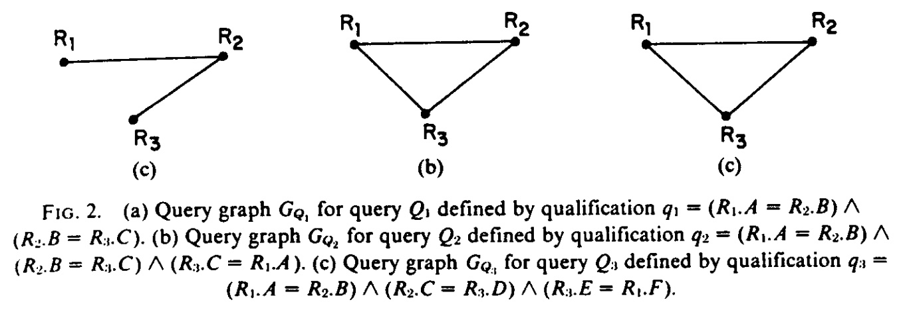
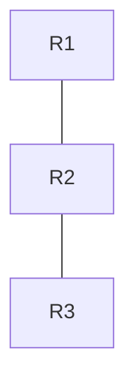
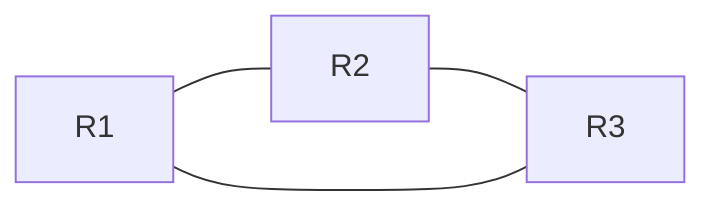
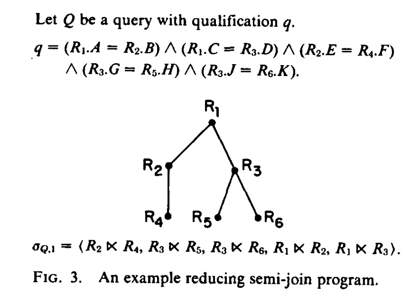
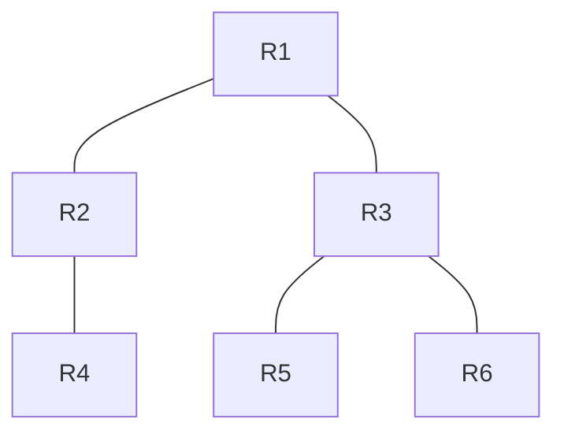
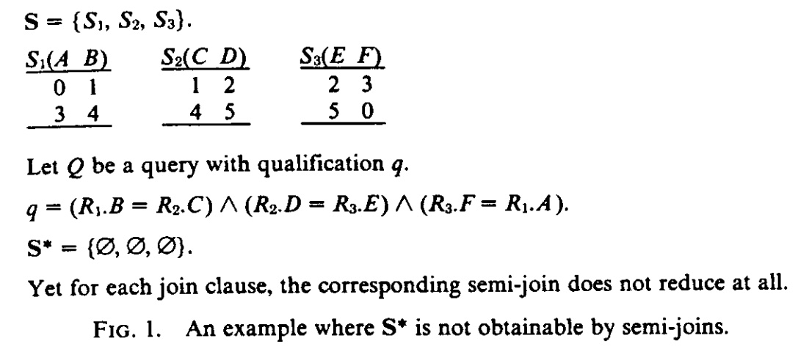

## AI论文解读 | Using Semi-Joins To Solve Relational Queries
        
### 作者        
digoal        
        
### 日期        
2025-10-03       
        
### 标签        
PostgreSQL , PolarDB , DuckDB , AI , 论文解读        
        
----        
        
## 背景  
      
https://dl.acm.org/doi/pdf/10.1145/322234.322238        
  
提示:          
```          
读懂《Using Semi-Joins To Solve Relational Queries》这篇论文需要提前掌握哪些基础知识, 请使用中文通熟易懂的讲解这些基础知识, 可以引用论文中的图、表或使用Markdown支持的图形(text,mermaid等)增加解释性. 
  
使用中文通熟易懂的解读《Using Semi-Joins To Solve Relational Queries》这篇论文, 其中的关键内容请着重讲解, 可以引用论文中的图、表或使用Markdown支持的图形(text,mermaid等)增加解释性. 
  
提取《Using Semi-Joins To Solve Relational Queries》这篇论文中的重要术语, 使用中文对这些术语进行通熟易懂的讲解, 可以引用论文中的图、表或使用Markdown支持的图形(text,mermaid等)增加解释性. 
```     
  
## 1 前置知识 
  
读懂《Using Semi-Joins To Solve Relational Queries》这篇论文，您需要提前掌握**关系数据库**和**分布式数据库优化**领域的基础知识。

这篇论文的核心在于证明 **半连接（Semi-Join）** 操作的局限性，即它只能完全优化特定类型（ **树形查询** ）的连接查询。

以下是理解这篇论文所需掌握的四个层次的基础知识，我会使用通俗易懂的中文进行讲解。

-----

## 层次一：关系数据库模型与操作（Relational Model & Algebra）

论文讨论的所有查询和操作都建立在关系数据库模型之上。

### 1\. 关系模型 (Relational Model)

  * **关系 (Relation) / 表 (Table):** 数据库中的基本结构，由行（元组/Tuple）和列（属性/Domain）组成 。
  * **域 (Domain) / 属性 (Attribute):** 表中的列，存储特定类型的数据。

### 2\. 关系代数操作 (Relational Algebra Operations)

关系代数是查询语言（如 SQL）的基础，您必须理解以下三个核心操作：

  * **连接 ( Join, $\bowtie$ ):** 将两个或多个关系（表）基于它们之间共享的属性值（Join Domains）组合起来。**这是成本最高的操作，也是半连接试图优化的对象** 。论文主要关注 **等值连接 (Equi-Join)** 。
  * **投影 ( Projection, $\pi$ ):** 从关系中选择**列**（属性）。
  * **选择/限制 ( Restriction/Selection, $\sigma$ ):** 从关系中选择**行**（元组），基于一个条件表达式 。

-----

## 层次二：半连接操作 (The Semi-Join Operation)

半连接（ Semi-Join, 符号 $\ltimes$ ）是这篇论文的核心，它是一种特殊的、由连接（Join）和投影（Projection）组合而成的操作 。

### 1\. 半连接的定义和作用

半连接 $R \ltimes S$ 的含义是：

> **从关系 $R$ 中，选出那些能在关系 $S$ 中找到匹配元组的行。** 

它只返回 $R$ 中的元组，而不会将 $S$ 中的属性添加到结果中，因此，它的结果是关系 $R$ 的一个**子集**。

**数学定义（简化）：**

$$R(A, B) \ltimes_{B} S(B, C) = \{t \in R \mid \exists s \in S \text{ 使得 } t.B = s.B\}$$

  * $R$ 和 $S$ 在属性 $B$ 上进行匹配。
  * 操作结果只保留 $R$ 中的属性 $(A, B)$ 。

### 2\. 半连接的价值（分布式数据库优化）

半连接的价值在于它能**减小关系（表）的大小**，从而减少后续真正连接操作的成本 。

在**分布式数据库系统**中（如论文中提到的 **SDD-1** 系统 ），如果两个需要连接的表 $R$ 和 $S$ 位于不同的物理站点：

1.  我们不需要传输完整的 $R$ 或 $S$ 表。
2.  我们只需传输 $R$ 表中**用于连接的属性列（ 例如 $R.B$ ）的投影**到 $S$ 的站点 。
3.  在 $S$ 的站点执行半连接 $S' = S \ltimes R$ ，将 $S$ 减小为 $S'$ 。
4.  然后传输减小后的 $S'$ 回 $R$ 的站点执行最终连接。

如果 $R$ 的连接列投影很小，且 $S$ 被显著减小，这种方式可以大幅降低网络**通信成本**，而通信成本在分布式系统中是主导成本 。

-----

## 层次三：查询图与树形查询 (Query Graph and Tree Queries)

论文的核心结论是：只有 **树形查询（Tree Queries, TQ）** 才能被半连接程序完全求解（ 即完全缩减到最小的必要集合 $S^*$ ） 。要理解这个结论，需要掌握“查询图”的概念。

### 1\. 查询图 $G_Q$ (Query Graph)

对于一个等值连接查询 $Q$ ，我们可以定义它的查询图 $G_Q(V_Q, E_Q)$ ：

  * **节点集合 $V_Q$ :** 参与查询的所有**关系（表）名称** 。
  * **边集合 $E_Q$ :** 任意两个关系 $R_i$ 和 $R_j$ 之间存在**连接条件**，则在 $R_i$ 和 $R_j$ 之间画一条边 。

### 2\. 树形查询 (Tree Query, TQ) 与 环形查询 (Cyclic Query, CQ)

根据查询图的结构，查询被分为两类：

| 查询类别 (Query Class) | 定义 (Definition) | 半连接求解能力 (Semi-Join Solvability) |
| :--- | :--- | :--- |
| **树形查询 (TQ)** | 查询图 $G_Q$ **不含环路**（或等价于一个无环图）。 | **可以**被**完全**求解 。 |
| **环形查询 (CQ)** | 查询图 $G_Q$ **包含环路** 。 | **不能**被**完全**求解 。 |

您可以通过论文中的图 2 来理解这两个概念：

  

图 2：查询图的例子


  * **图 2(a) $G_{Q_1}$ :** 关系 $R_1, R_2, R_3$ 形成一条链，**没有环路**，因此 $Q_1$ 是一个 **树形查询 (TQ)**。
  * **图 2(b) $G_{Q_2}$ :** 关系 $R_1, R_2, R_3$ 形成一个**环路**，但 $Q_2$ 在逻辑上**等价于** $Q_1$ ，因此它也被认为是 **树形查询 (TQ)** 。
  * **图 2(c) $G_{Q_3}$ :** 关系 $R_1, R_2, R_3$ 形成的环路是**固有的**，它不等价于任何树形查询，因此 $Q_3$ 是一个 **环形查询 (CQ)** 。

理解了“查询图”和“树/环”的区别，您就能明白论文最关键的结论：**半连接这种局部优化的方法，只对树形结构的查询有效，而无法解决环形结构查询所固有的全局约束问题。**
  
## 2 解读论文 
  
好的，我们来通俗易懂地解读这篇数据库领域的经典论文《Using Semi-Joins to Solve Relational Queries》。

这篇论文由 Philip A. Bernstein 和 Dah-Ming W. Chiu 在1981年发表，它深刻地改变了数据库系统（尤其是分布式数据库）中查询优化的思路。论文的核心思想是：**并非所有查询都能有效地通过半连接（Semi-Join）来解决，论文精准地划分出了哪类查询可以，哪类不可以，并给出了高效的判断方法。**

-----

### 1\. 什么是半连接 (Semi-Join)？为什么它很重要？

想象一下你有两张表：`员工表 (Employees)` 和 `部门表 (Departments)`。你想找到所有**在有效部门中**的员工信息。

  * **常规连接 (Join)**: 会先将两张表根据 `部门ID` 合并成一张大表，然后再筛选出你需要的员工列。
  * **半连接 (Semi-Join)**: 操作符写作 `⋉`。`Employees ⋉ Departments` 的意思是：用 `Departments` 表里的 `部门ID` 去过滤 `Employees` 表，只保留那些 `部门ID` 存在于 `Departments` 表中的员工记录。**结果只包含 `Employees` 表的列，不会增加 `Departments` 表的列** 。

可以理解为： **“用B表过滤A表，但只返回A表的原始数据”** 。

**为什么半连接在分布式数据库中至关重要？**

在分布式系统中，`员工表` 可能在北京的服务器上，而 `部门表` 在上海。如果执行常规连接，你需要把其中一张巨大的表通过网络传输到另一台服务器上，网络开销极大 。

但如果使用半连接，你可以这样做：

1.  从上海的 `部门表` 中，只提取 `部门ID` 这一列（数据量很小）。
2.  将这些 `部门ID` 发送到北京。
3.  在北京的服务器上，用收到的 `部门ID` 列表执行半连接，过滤 `员工表`，得到最终需要的员工。

这样，网络上传输的只是少量 `部门ID`，而不是整张 `部门表`，极大地降低了成本 。这正是半连接的核心价值：**作为一种数据缩减 (reduce) 的强大工具** 。

### 2\. 论文的核心洞见：查询的两种类型

论文指出，虽然半连接很强大，但它不是万能的 。作者通过一种名为 **“查询图” (Query Graph)** 的方法，将查询分为了两大类。

查询图的构建很简单：

  * 每个**关系（表）** 是一个**节点** 。
  * 如果两个关系之间存在连接条件，就在它们之间连一条**边** 。

根据查询图的形状，查询被分为：

#### A. 树查询 (Tree Queries, TQ)

其查询图是**树形结构**（或者等价于树形结构），即图中**不存在环路** 。

例如，下面这个查询就是一个树查询：

  * **查询**: `(R1.A = R2.B) AND (R2.B = R3.C)`
  * **查询图 (来自论文 Figure 2a )**:

  



这个图是线性的，属于树结构。

#### B. 环查询 (Cyclic Queries, CQ)

其查询图**存在无法消除的环路** 。

例如，下面这个查询就是一个环查询：

  * **查询**: `(R1.B = R2.C) AND (R2.D = R3.E) AND (R3.F = R1.A)`
  * **查询图 (来自论文 Figure 2b，但更典型的环是三者直接相连 )**:

  



这个图形成了一个闭环。

-----

### 3\. 两类查询在半连接下的天壤之别

论文最精彩的部分，就是证明了这两类查询在使用半连接求解时，行为完全不同。

#### 树查询 (TQ)：半连接的“乐园”

对于任何树查询，论文给出了一个极其乐观的结论 **(定理一)**:

> **总能找到一个简短高效的半连接序列，来彻底地、完全地缩减数据，得到最优的查询结果** 。

这个序列的长度最多是 `2n-2`（n是表的数量），非常高效 。这个执行策略分为两步：

1.  **叶到根的上行 (Leaf-to-Root) 缩减**：从树的叶子节点开始，用叶子节点去缩减它的父节点，然后父节点再缩减自己的父节点，一路向上直到根节点 。
2.  **根到叶的下行 (Root-to-Leaf) 广播**：从根节点开始，用它缩减它的子节点，然后子节点再缩减自己的子节点，将缩减效果广播至所有叶子节点 。

经过这样一上一下两轮操作，就能保证所有不满足最终连接条件的“无用”数据都被彻底清除。

  

**示例 (来自论文 Figure 3 )**

假设查询图如下：



一个有效的上行半连接序列是：`R2 ⋉ R4`, `R3 ⋉ R5`, `R3 ⋉ R6`, `R1 ⋉ R2`, `R1 ⋉ R3` 。先处理叶子，再逐层向上。

#### 环查询 (CQ)：半连接的“噩梦”

对于环查询，情况就变得“异常糟糕” (dismally poor) 。论文用一个精妙的例子 **(Figure 1)** 和一个更强的理论 **(定理二)** 揭示了环查询的困境。   

**困境一：半连接可能“无能为力”** 
考虑论文 **Figure 1** 中的例子 ：

  * **三张表**: S1(A,B), S2(C,D), S3(E,F)
  * **查询条件**: `(R1.B = R2.C) AND (R2.D = R3.E) AND (R3.F = R1.A)` (一个环)
  * **数据**:
    | S1 (A,B) | S2 (C,D) | S3 (E,F) |
    | :---: | :---: | :---: |
    | 0, 1 | 1, 2 | 2, 3 |
    | 3, 4 | 4, 5 | 5, 0 |

我们来分析：

  * 执行 `R1 ⋉ R2` (用 S2 的 C 列过滤 S1)：S2 的 C 列有 {1, 4}，S1 的 B 列有 {1, 4}。所有 S1 的行都匹配，所以 S1 **一行都不少** 。
  * 同理，执行 `R2 ⋉ R3` 和 `R3 ⋉ R1`，S2 和 S3 也一行都不少。
  * **结论**：无论怎么执行半连接，数据都无法被缩减。

但这个查询的**最终结果是空集** `∅` ！因为不存在一个三元组 `(s1, s2, s3)` 同时满足所有三个条件。例如，`(0,1)` 在 S1，匹配了 S2 的 `(1,2)`；`(1,2)` 匹配了 S3 的 `(2,3)`；但 `(2,3)` 的 F=3 无法匹配回 S1 的 A=0。

这说明，对于环查询，**半连接可能无法达到理论上的最优缩减** 。

**困境二：即使有效，代价也可能极其高昂**
论文进一步证明 **(定理二)**，对于某些环查询，即使半连接能缩减数据，也可能需要一个**非常非常长**的半连接序列，其长度甚至和表中的**元组数量 (行数) 成正比** 。这意味着，如果一张表有一百万行，你可能需要执行数百万次半连接操作才能完成缩减，这在实践中是完全不可接受的。

-----

### 4\. 实践意义和结论

这篇论文的价值不仅在于理论上的划分，更在于它为数据库查询优化器的设计者提供了清晰的指导：

1.  **快速识别问题**: 论文提供了一个**线性时间的算法**，可以快速判断一个给定的查询是 TQ 还是 CQ 。这意味着优化器可以在毫秒之内就知道自己面对的是“好问题”还是“坏问题”。

2.  **采用不同策略**:

      * 如果判断为**树查询 (TQ)**，优化器就可以放心地生成一个基于半连接的最优执行计划，因为我们知道这条路一定能走通，而且很高效 。
      * 如果判断为**环查询 (CQ)**，优化器就应该警惕，知道单纯依靠半连接可能效果不佳甚至毫无效果。这时，它应该考虑其他策略，比如直接传输整个关系，或者使用更复杂的连接算法 。

**总结来说，这篇论文就像一位医生，为数据库查询开出了一份“诊断书”。它告诉我们，半连接是一种特效药，但只对“树查询”这种病症有效。对于“环查询”这种顽疾，就需要换一种疗法。通过提供快速的诊断工具和清晰的分类，它让数据库系统变得更加“智能”，能够对症下药，从而大幅提升查询性能。**
  
## 3 术语 
  
在上一轮中，我已经成功提取了《Using Semi-Joins To Solve Relational Queries》论文的关键内容。现在，我将根据这些内容，挑选出最重要的技术术语，并用通俗易懂的中文进行详细讲解和说明。

-----

## 论文《Using Semi-Joins To Solve Relational Queries》重要术语解析

这篇论文（由 Philip A. Bernstein 和 Dah-Ming W. Chiu 撰写）的核心是**半连接（Semi-Join）操作在解决关系查询，尤其是在分布式数据库**中的效率问题。以下是理解这篇论文结论所需的七个关键术语：

### 1\. 半连接 ( Semi-Join, $\ltimes$ )

| 术语 | 中文解释 | 论文定义/作用 |
| :--- | :--- | :--- |
| **Semi-Join** | **半连接**（ 符号： $\ltimes$ ） | 半连接是一种关系代数操作，它首先对两个关系（表）进行连接（Join），然后仅 **投影（Project）** 回其中一个关系的全部属性 。其主要价值在于：在不丢失任何信息的前提下，**减小**关系（表）的大小 。 |

**通俗解释：** 想象你有两张表：`员工表 R` 和 `部门表 S`。

  * **普通连接 (Join):** 会把 R 和 S 中匹配的行合并在一起，结果包含 R 和 S 的所有列。
  * **半连接 $R \ltimes S$ : (R 被 S 缩减)** 只保留 `员工表 R` 中**那些能在 `部门表 S` 中找到对应部门的员工**。它只返回 `员工表 R` 的行和列，但已经剔除了那些在 `部门表 S` 中找不到匹配项的无效员工数据 。

**应用场景：** 在**分布式数据库**中，如果 R 和 S 分布在不同站点，我们只需将 S 的连接列（很小的集合）发送到 R 所在的站点，用半连接缩小 R 的体积，从而**显著减少网络通信量** 。

### 2\. 等值连接查询 (Equi-Join Query)

| 术语 | 中文解释 | 论文定义/作用 |
| :--- | :--- | :--- |
| **Equi-Join Qualification/Query** | **等值连接限定式/查询** | 论文研究的查询类型，它由一系列形如 $(R_i.X = R_j.Y)$ 的等值子句（Equi-Join Clause）构成 。它将多个关系（表）基于其属性值相等进行连接 。 |

**通俗解释：** 这是最常见的查询类型，例如 SQL 中的 `FROM R1 JOIN R2 ON R1.A = R2.B`。论文排除了 `R.X = 常量` 这种单关系限定，因为它们通常在半连接执行前就被应用（即**本地限制**），不影响半连接程序的求解能力 。

### 3\. 完全缩减 / 最小必要集合 ( $S^*$ , Full Reduction )
  
术语 | 中文解释 | 论文定义/作用 
---|---|---
**Full Reduction ( $S^\*$ )** | **完全缩减** | 对于给定查询 $Q$ 和数据库状态 $S$ ，**完全缩减 $S^\*$** 是数据库状态 $S$ 的一个子集，满足两个条件：**1. 执行查询 $Q$ 的结果与在 $S$ 上执行的结果相同**（ 即 $Q(S^\*) = Q(S)$ ）；**2. $S^\*$ 是满足条件 1 的最小集合** 。
     
  
  
**通俗解释：** $S^\*$ 就是数据库中**真正对查询结果有贡献的最小数据子集**。任何不在 $S^\*$ 中的数据元组，都是冗余的，可以被安全地删除而不会改变查询的最终结果。论文的核心问题就是：**半连接程序能否达到这个理想的最小状态 $S^\*$** 。

### 4\. 半连接程序 ( Semi-Join Program, $\sigma$ )

| 术语 | 中文解释 | 论文定义/作用 |
| :--- | :--- | :--- |
| **Semi-Join Program** | **半连接程序** | 一系列顺序执行的半连接操作 $\sigma = \langle R_{i_1} \ltimes R_{i_2}, ..., R_{i_{2m-1}} \ltimes R_{i_{2m}} \rangle$ 。这些程序用于系统性地减小数据库中关系的大小，以优化最终的连接操作 。 |

**通俗解释：** 这就像一个**数据清洗流程**，按部就班地执行一系列半连接操作，目标是尽可能地将数据库状态 $S$ 逼近最小必要集合 $S^*$ 。

### 5\. 查询图 ( $G_Q$ , Query Graph )

| 术语 | 中文解释 | 论文定义/作用 |
| :--- | :--- | :--- |
| **Query Graph** | **查询图** | 描述等值连接查询 $Q$ 结构的图模型 。**节点（ $V_Q$ ）代表查询中涉及的所有关系（表）** ；**边（ $E_Q$ ）代表两个关系之间存在的连接条件** 。 |

**通俗解释：** 查询图是判断半连接程序是否有效的**决定性工具**。它将复杂的代数查询转换成直观的图结构，方便识别查询是“线状”还是“环状” 。

### 6\. 树形查询 (Tree Query, TQ)

| 术语 | 中文解释 | 论文定义/作用 |
| :--- | :--- | :--- |
| **Tree Query (TQ)** | **树形查询** | 满足以下条件之一的查询：1. 其**查询图**是一个**树（不含环路）** ；2. 它**等价于**一个查询图为树的查询 。 |

**关键结论：** 树形查询是**唯一能够**被半连接程序**完全求解**（ 即达到最小必要集 $S^\*$ ）的查询类型 。存在一个长度为 $2n-2$ （ $n$ 为关系数 ）的**短**半连接程序 $\sigma\_Q$ 可以实现 $S^\*$ 。

### 7\. 环形查询 (Cyclic Query, CQ)

| 术语 | 中文解释 | 论文定义/作用 |
| :--- | :--- | :--- |
| **Cyclic Query (CQ)** | **环形查询** | 属于**非树形查询**的其他所有等值连接查询 。这种查询图**包含无法消除的环路** 。 |

**关键结论：** **半连接程序通常无法完全求解环形查询（ 即无法达到 $S^*$ ）** 。对于这类查询，即使是“最佳”的半连接缩减（ $S^\times$ ），也可能需要**非常长**的半连接程序才能达到，且其效果远不如 $S^*$ 理想 。

-----

### 示例对比：树形查询与环形查询（引用论文图 2）

下图展示了查询图如何区分 TQ 和 CQ：   

图 2：论文中的查询图示例 (a) TQ (b) TQ (c) CQ


| 查询图 | 结构描述 | 结论 | 解释 |
| :--- | :--- | :--- | :--- |
| **(a) $G_{Q_1}$** | $R_1-R_2-R_3$ 形成链状结构。 | 属于 **TQ** (树形查询) 。 | 结构是无环的**树**。半连接程序可以实现 $S^*$ 。 |
| **(b) $G_{Q_2}$** | $R_1-R_2-R_3$ 形成三角形环路。 | 属于 **TQ** (树形查询) 。 | 虽然有环，但这个环是**冗余的**，查询 $Q_2$ 逻辑上等价于 $Q_1$ （树形结构），因此仍被归类为 TQ 。 |
| **(c) $G_{Q_3}$** | $R_1$ 与 $R_2$ 和 $R_3$ 有连接。 | 属于 **CQ** (环形查询) 。 | 这个查询所隐含的连接约束（如果有的话）形成了**固有的、无法消除的环路**。半连接程序无法保证完全求解。 |
  
## 参考        
         
https://dl.acm.org/doi/pdf/10.1145/322234.322238    
        
<b> 以上内容基于DeepSeek、Qwen、Gemini及诸多AI生成, 轻微人工调整, 感谢杭州深度求索人工智能、阿里云、Google等公司. </b>        
        
<b> AI 生成的内容请自行辨别正确性, 当然也多了些许踩坑的乐趣, 毕竟冒险是每个男人的天性.  </b>        
      
#### [期望 PostgreSQL|开源PolarDB 增加什么功能?](https://github.com/digoal/blog/issues/76 "269ac3d1c492e938c0191101c7238216")
  
  
#### [PolarDB 开源数据库](https://openpolardb.com/home "57258f76c37864c6e6d23383d05714ea")
  
  
#### [PolarDB 学习图谱](https://www.aliyun.com/database/openpolardb/activity "8642f60e04ed0c814bf9cb9677976bd4")
  
  
#### [PostgreSQL 解决方案集合](../201706/20170601_02.md "40cff096e9ed7122c512b35d8561d9c8")
  
  
#### [德哥 / digoal's Github - 公益是一辈子的事.](https://github.com/digoal/blog/blob/master/README.md "22709685feb7cab07d30f30387f0a9ae")
  
  
#### [About 德哥](https://github.com/digoal/blog/blob/master/me/readme.md "a37735981e7704886ffd590565582dd0")
  
  

  
