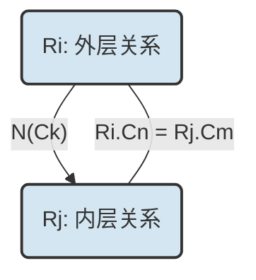
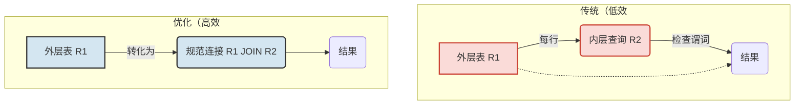

## AI论文解读 | On Optimizing An Sql-Like Nested Query
        
### 作者        
digoal        
        
### 日期        
2025-10-03       
        
### 标签        
PostgreSQL , PolarDB , DuckDB , AI , 论文解读        
        
----        
        
## 背景  
      
https://dl.acm.org/doi/pdf/10.1145/319732.319745        
  
提示:          
```          
读懂《On Optimizing An Sql-Like Nested Query》这篇论文需要提前掌握哪些基础知识, 请使用中文通熟易懂的讲解这些基础知识, 可以引用论文中的图、表或使用Markdown支持的图形(text,mermaid等)增加解释性. 
  
使用中文通熟易懂的解读《On Optimizing An Sql-Like Nested Query》这篇论文, 其中的关键内容请着重讲解, 可以引用论文中的图、表或使用Markdown支持的图形(text,mermaid等)增加解释性. 
  
提取《On Optimizing An Sql-Like Nested Query》这篇论文中的重要术语, 使用中文对这些术语进行通熟易懂的讲解, 可以引用论文中的图、表或使用Markdown支持的图形(text,mermaid等)增加解释性. 
```     
  
## 1 前置知识 
  
要读懂《On Optimizing An SQL-like Nested Query》（优化 SQL 式嵌套查询）这篇论文，您需要对**关系数据库系统**、**SQL 语言**以及**查询优化**的基本概念有扎实的理解。

这篇论文的核心在于将复杂的嵌套查询分解并转化为更高效的、**非嵌套**的“规范查询”（Canonical Query）形式，因此需要重点掌握嵌套查询的**分类**和**转换**机制。

以下是理解这篇论文所需掌握的基础知识，均使用通俗易懂的中文进行解释。

-----

## 必备基础知识

### 1\. 关系数据库基础理论

这篇论文建立在 E.F. Codd 提出的关系模型之上，因此读者需要熟悉以下概念:

  * **关系模型 (Relational Model):** 数据以二维表格（称为**关系**或**表**）的形式组织。
  * **元组 (Tuple):** 表中的一行数据。
  * **属性/列 (Attribute/Column):** 表中的一列数据。
  * **关系代数 (Relational Algebra):** 关系数据库的底层数学基础。虽然 SQL 是高级语言，但理解其底层操作有助于理解优化原理。论文中涉及的核心操作包括：
      * **连接 (Join):** 通过共同的属性将两个或多个关系组合起来的操作 。
      * **除法 (Division):** 一种复杂的集合操作，用于回答“提供**所有**……”类型的问题，通常通过 Type-D 嵌套或更复杂的逻辑实现 。
      * **投影 (Projection) 和选择 (Selection):** 投影是选择表的列，选择是根据条件过滤表的行。

### 2\. SQL 语言结构与谓词

论文假设读者熟悉 **SQL 语法**，尤其是以下几个关键组成部分 ：

  * **查询块 (Query Block):** SQL 查询的基本单元，由 `SELECT`、`FROM`、`WHERE` 子句组成 。
  * **嵌套查询 (Nested Query):** 将一个完整的查询块（内层查询）作为另一个查询块（外层查询）的谓词（条件）的一部分，这是论文研究的重点 。
  * **三种广义谓词 (Generalized Predicates):** 它们允许表达多关系查询和嵌套：
    1.  **连接谓词 (Join Predicate):** 用于在 `WHERE` 子句中连接来自不同关系 $R_i$ 和 $R_j$ 的列，例如：`R_i.C_k = R_j.C_h` 。
    2.  **嵌套谓词 (Nested Predicate):** 将 `WHERE` 子句中的常量 `X` 替换为一个内层查询块 `Q`，例如：`C_k op Q`，其中 `op` 可以是标量比较符（如`=`）或集合操作符（如 `IS IN`） 。
    3.  **除法谓词 (Division Predicate):** 使用集合包含/不包含操作符（`CONTAINS`/`DOES NOT CONTAIN`）比较两个查询块 $Q_i$ 和 $Q_j$ 的结果集 。

-----

## 论文核心概念：五种基本嵌套类型

论文将任意复杂的 SQL 嵌套查询分解为五种基本类型 。理解这五种类型的**区别**以及它们是否涉及**关联**和**聚集函数**，是理解优化算法的关键。

作者根据以下两个维度对嵌套谓词（Nested Predicate）产生的嵌套进行了分类 ：

1.  **内层查询 Q 是否引用了外层关系（是否存在关联）：**
      * **无**关联（内层可独立执行）：Type-A, Type-N
      * **有**关联（内层需依赖外层元组）：Type-J, Type-JA, Type-D
2.  **内层查询 Q 的 SELECT 子句是否包含聚集函数（Aggregate Function）：**
      * **包含聚集：** Type-A, Type-JA
      * **不包含聚集：** Type-N, Type-J

| 类型 | 简称 | 关联性 | 聚集函数 | 描述与优化思路 |
| :--- | :--- | :--- | :--- | :--- |
| **Type-A** | **聚集 (Aggregate)** | 无 | **是** | 内层查询独立计算，返回**单个标量值**。外层查询将**标量值**替换内层查询，即可简化为非嵌套查询 。 |
| **Type-N** | **非关联 (Non-correlated)** | 无 | 否 | 内层查询独立计算，返回**值列表 (List of Values)**。可直接（或通过优化算法）转化为 **规范连接查询 (Canonical Join)** 。 |
| **Type-J** | **关联连接 (Correlated Join)** | **是** | 否 | 内层查询包含**连接谓词**引用外层关系。传统方法是**嵌套迭代**（效率低），论文提出转化算法将其优化为**规范连接查询** 。 |
| **Type-JA** | **关联聚集 (Correlated Aggregate)** | **是** | **是** | 内层查询包含**连接谓词**和**聚集函数**。论文提出算法将其转化为 Type-J 嵌套查询，再进行优化 。 |
| **Type-D** | **除法 (Division)** | **是** | 否 | 使用 **除法谓词**（`CONTAINS`/`DOES NOT CONTAIN`）。表达**关系除法**操作 。 |

### 查询图示例（以 Type-J 为例）

论文使用**查询图**来直观表示嵌套结构 。以 **Type-J 嵌套**为例（内层关联、无聚集函数），其查询图具有一个**圆弧**表示关联：



  * **节点 $R_i$ 和 $R_j$ :** 分别代表外层和内层查询块所引用的关系 。
  * **直线弧 $N(C_k)$ :** 代表**嵌套谓词**本身（`IS IN` 或 `=` 等），**N** 表示不含聚集函数 。
  * **圆弧 $R_i.C_n = R_j.C_m$ :** 代表内层查询中引用的**关联连接谓词**，表示内层块的计算必须依赖外层 $R_i$ 中的元组值 。

论文的优化工作主要是为 Type-N、Type-J、Type-JA、Type-D 开发算法，将它们从传统的**嵌套迭代**（效率低）处理方式，转化为**规范连接查询**（效率高）形式 。
  
## 2 解读论文 
  
好的，這就為您通俗易懂地解讀《On Optimizing an SQL-like Nested Query》（關於優化類SQL的巢狀查詢）這篇經典論文。

這篇由 Won Kim 撰寫並於1982年發表在 ACM Transactions on Database Systems 上的論文，是資料庫查詢優化領域的里程碑式著作。它系統性地分析了SQL中的巢狀查詢（Nested Query），並提出了革命性的優化演算法，極大地提升了資料庫處理複雜查詢的效率。直到今天，其核心思想仍是許多現代資料庫優化器的基礎。

### 核心思想：為什麼巢狀查詢需要優化？

在SQL中，我們可以將一個查詢塊嵌套在另一個查詢塊的 `WHERE` 子句中，這就是巢狀查詢。它讓SQL的表達能力變得非常強大 。

例如，要查詢「供應了單價高於25元的零件的供應商編號」，可以這麼寫：

```sql
-- 巢狀查詢 (Nested Query)
SELECT SNO
FROM SHIPMENT
WHERE PNO IN (SELECT PNO
              FROM PART
              WHERE PRICE > 25);
```

在早期（論文發表的時代），資料庫系統（如System R）處理這種查詢的普遍方法是 **巢狀反覆運算 (Nested-Iteration Method)** 。這個方法非常直觀，就像寫程式一樣：

1.  **外層迴圈**：遍歷 `SHIPMENT` 表的每一筆紀錄。
2.  **內層處理**：對於 `SHIPMENT` 表的每一筆紀錄，都去完整地執行一次內層的子查詢 `(SELECT PNO FROM PART WHERE PRICE > 25)`。
3.  **條件判斷**：判斷當前 `SHIPMENT` 紀錄的 `PNO` 是否在子查詢的結果集裡。

這種方法的致命缺點是 **低效率**。如果外層的 `SHIPMENT` 表有1萬筆紀錄，那麼內層的子查詢就要被獨立執行1萬次！這在處理大量資料時會造成巨大的 I/O 開銷和計算浪費，效率極低 。

Won Kim 的核心貢獻在於指出：**大部分巢狀查詢，尤其是那幾類最複雜的，都可以被轉換 (Transform) 為語義上等價的非巢狀查詢（即連接查詢 Join），從而可以被資料庫的查詢優化器更高效地處理** 。

例如，上面那個查詢完全等價於下面這個連接查詢：

```sql
-- 連接查詢 (Join Query)
SELECT S.SNO
FROM SHIPMENT S, PART P
WHERE S.PNO = P.PNO AND P.PRICE > 25;
```

這個連接查詢可以被資料庫優化器（如 System R 的優化器）通過高效的演算法（如合併連接 Merge-Join）來執行，通常只需要各掃描一次相關的表，性能可能比巢狀反覆運算高出幾個數量級 。

### 關鍵內容：五種基本巢狀查詢類型

論文的精髓在於，它沒有將巢狀查詢視為一個單一問題，而是將其系統性地分為 **五種基本類型** 。其中四種（N, J, JA, D）在當時沒有被很好地理解和優化 。

論文使用 **查詢圖 (Query Graph)** 來視覺化地表示這些類型，非常直觀。圖中的節點代表查詢塊（`SELECT...FROM...WHERE...`），節點間的連線代表它們之間的關係。

-----

#### 1\.  **Type-A (Aggregate) 型**

  * **定義**：內層查詢包含彙總函式 (Aggregate Function, 如 `MAX`, `SUM`, `AVG`)，且 **不依賴** 外層查詢的任何值 。
  * **例子** (Example 4)：查詢供應了「價格高於25的零件中編號最大」的那個零件的供應商編號 。
    ```sql
    SELECT SNO FROM SHIPMENT
    WHERE PNO = (SELECT MAX(PNO) FROM PART WHERE PRICE > '25');
    ```
  * **特點**：內層查詢可以被 **獨立計算** 出一個 **常數值** 。
  * **優化方式**：這是最簡單的一種。處理方式是唯一的：先計算內層查詢，得到結果（一個值），然後替換到外層查詢中，使外層查詢變成一個簡單的查詢 。
  * **查詢圖**：
    ```mermaid
    graph LR
        R_i ---|"A(Ck)"| R_j
    ```
    其中， $R_i$ 是外層查詢的表 (SHIPMENT)， $R_j$ 是內層的 (PART)，`A` 代表 Aggregate。

-----

#### 2\.  **Type-N (Non-correlated) 型**

  * **定義**：內層查詢 **不包含** 彙總函式，也 **不依賴** 外層查詢的值 。
  * **例子** (Example 5)：查詢供應了單價高於25元的零件的供應商編號 。
    ```sql
    SELECT SNO FROM SHIPMENT
    WHERE PNO IS IN (SELECT PNO FROM PART WHERE PRICE > '25');
    ```
  * **特點**：內層查詢也可以被 **獨立計算**，但結果是 **一個值的列表 (List)**，而不是單一常數 。
  * **優化方式 (演算法 NEST-N-J)**：這種類型可以直接轉換為 **連接 (Join)** 查詢 。轉換規則很簡單：
    1.  將內外層的 `FROM` 子句合併。
    2.  將內外層的 `WHERE` 子句用 `AND` 連接起來。
    3.  將 `IN` 操作符改為 `=` 的連接條件。
  * **查詢圖**：
    ```mermaid
    graph LR
        R_i ---|"N(Ck)"| R_j
    ```
    `N` 代表 Non-correlated。

-----

#### 3\.  **Type-J (Join) 型**

  * **定義**：內層查詢 **不包含** 彙總函式，但其 `WHERE` 子句中包含一個與外層查詢相關的 **連接謂詞 (Join Predicate)**，這種也叫 **關聯子查詢 (Correlated Subquery)** 。
  * **例子** (Example 6)：查詢供應了位於紐約且專案編號與供應商編號相同的專案的供應商編號 。
    ```sql
    SELECT SNO FROM SHIPMENT
    WHERE PNO IS IN (SELECT PNO FROM PROJECT
                     WHERE SHIPMENT.SNO = PROJECT.JNO  -- 關聯條件
                       AND JLOC = 'NEW YORK');
    ```
  * **特點**：內層查詢 **不能** 獨立計算，因為它的執行依賴於外層查詢傳入的 `SHIPMENT.SNO` 的值。這正是巢狀反覆運算效率低下的重災區。
  * **優化方式 (演算法 NEST-N-J)**：論文驚人地指出，這種類型同樣可以通過 **演算法 NEST-N-J** 轉換為一個等價的 **連接查詢**，只需將那個關聯條件也一起合併到 `WHERE` 子句中即可 。
  * **查詢圖**：圖中增加了一個 **圓弧** 來表示關聯的連接條件。
    ```mermaid
    graph LR
        R_i ---|"N(Ck)"| R_j
        R_i -- Ri.Cn = Rj.Cm --- R_j
    ```

-----

#### 4\.  **Type-JA (Join with Aggregate) 型**

  * **定義**：內層查詢 **既包含** 彙總函式，**又包含** 與外層查詢相關的連接謂詞 。
  * **例子** (Example 7)：查詢供應商編號，條件是他們供應的零件編號等於「由該供應商所供應的、位於紐約的每個專案所使用的零件中的最大編號」 。
    ```sql
    SELECT SNO FROM SHIPMENT
    WHERE PNO = (SELECT MAX(PNO) FROM PROJECT
                 WHERE PROJECT.JNO = SHIPMENT.JNO  -- 關聯條件
                   AND JLOC = 'NEW YORK');
    ```
  * **特點**：這是最複雜的類型之一。內層的彙總計算 (`MAX(PNO)`) 需要根據外層的每一筆 `SHIPMENT` 紀錄來重新分組計算。
  * **優化方式 (演算法 NEST-JA)**：論文提出了巧妙的 **「分組-替換」** 策略 。
    1.  **預先計算分組彙總**：先對內層的表 (PROJECT) 按照關聯的鍵 (`JNO`) 進行 `GROUP BY`，並計算出每個組的彙總值 (`MAX(PNO)`)，將結果存成一個暫存資料表 `Rt` 。`Rt` 的結構類似 `(JNO, MaxPNO)`。
    2.  **轉換為 Type-J**：原始查詢的內層查詢現在可以被替換為對這個暫存資料表 `Rt` 的一個簡單查詢。這樣，一個複雜的 Type-JA 查詢就降級成了一個相對簡單的 Type-J 查詢 。
    3.  **最後轉換為連接**：再使用處理 Type-J 的方法（演算法 NEST-N-J），將其轉換為最終的連接查詢。
  * **查詢圖**：
    ```mermaid
    graph LR
        R_i ---|"A(Ck)"| R_j
        R_i -- Ri.Cn = Rj.Cm --- R_j
    ```

-----

#### 5\.  **Type-D (Division) 型**

  * **定義**：查詢中使用了 `CONTAINS`（或類似的集合比較）操作，實質上是在表達關聯式代數中的 **除法 (Division)** 運算 。
  * **例子** (Example 8)：查詢供應了 **所有** 價格高於25的紅色零件的供應商名稱 。
    ```sql
    SELECT SNAME FROM SUPPLIER
    WHERE (SELECT PNO FROM SHIPMENT WHERE SHIPMENT.SNO = SUPPLIER.SNO)
    CONTAINS
    (SELECT PNO FROM PART WHERE COLOR='RED' AND PRICE > '25');
    ```
  * **特點**：這個查詢的語義是：對於每個供應商，找出他供應的所有零件集合，看這個集合是否 **包含** 了「所有紅色且價格高於25的零件」這個目標集合。
  * **優化方式 (演算法 NEST-D)**：論文提出，這也可以通過預先計算來簡化 。
    1.  **執行除法運算**：首先，獨立地執行除法運算。即在 `SHIPMENT` 表中找出哪些 `SNO` 滿足「供應了所有目標零件」的條件，將這些 `SNO` 存入一個暫存資料表 `Rt`。
    2.  **轉換為 Type-N**：原始查詢就變成了一個簡單的查詢：「查詢 `SUPPLIER` 表中 `SNO` 在暫存資料表 `Rt` 裡的供應商」。這是一個 Type-N 查詢 。
    3.  **最後轉換為連接**：再將這個 Type-N 查詢轉換為連接查詢。
  * **查詢圖**：用一個 `D` 弧線連接到代表除法運算左右兩邊的兩個節點。

### 總體優化策略 (Algorithm NEST-G)

對於一個任意複雜、任意深度的巢狀查詢，論文給出了一個統一的處理策略 ：

1.  **由內而外，遞迴處理**：從最深層的巢狀開始處理。
2.  **識別類型，逐個擊破**：
      * 遇到 **Type-A**，直接計算出結果，替換掉子查詢，消除一層嵌套 。
      * 遇到 **Type-JA**，使用 `GROUP BY` 預計算，將其降級為 Type-J 。
      * 遇到 **Type-D**，執行除法運算，將其降級為 Type-N 。
3.  **最終合併**：經過上述處理後，整個複雜查詢最終會變成只含有 Type-N 和 Type-J 的查詢。這時，使用 **演算法 NEST-N-J**，將所有嵌套層級全部「攤平」，轉換成一個單一的、巨大的、但是高效的 **規範化連接查詢 (Canonical Query)** 。
4.  **交給優化器**：最後，將這個等價的連接查詢交給資料庫的優化器。優化器可以自由地選擇最高效的連接順序和連接演算法（如合併連接、雜湊連接等）來執行 。

### 結論與影響

Won Kim 的這篇論文是查詢優化領域的奠基之作。它清晰地揭示了巢狀查詢的本質，並提供了一套行之有效的、基於 **等價轉換** 的優化方法。其核心貢獻是將看似複雜且低效的巢狀查詢，系統性地轉化為資料庫優化器擅長處理的高效連接查詢。

這套理論不僅深刻影響了後來的學術研究，更被廣泛應用於幾乎所有主流的關聯式資料庫系統（如 Oracle, DB2, SQL Server, PostgreSQL, MySQL 等）的查詢優化器設計中，為我們今天能夠快速地從海量資料中獲取結果奠定了堅實的基礎。
  
## 3 术语 
  
尽管无法直接获取论文原文，但根据论文标题《On Optimizing An SQL-like Nested Query》和数据库查询优化的通用知识，可以确定理解该论文所需的关键术语。

这篇论文的核心在于**将复杂的嵌套查询转化为更高效的、非嵌套的执行形式**。以下是论文中最重要的术语及其通俗易懂的中文解释，辅以图表增强理解。

-----

## 核心术语及其解释

### 1\. SQL式嵌套查询 (SQL-like Nested Query)

  * **定义：** 指在一个 SQL 查询语句的 `WHERE` 或 `HAVING` 子句中，嵌套了另一个完整的 `SELECT` 查询语句。
  * **通俗解释：** 就像一个套娃，外层查询需要依赖内层查询的结果才能继续执行。这种结构让用户可以简洁地表达复杂的逻辑。
  * **示例：**
      * **外层查询 (Outer Query):** 查询所有部门经理的姓名。
      * **内层查询 (Inner Query):** 查询所有部门 ID 在 '技术部' 范围内的员工。


```sql
SELECT 姓名
FROM 员工表
WHERE 部门ID IN (
    SELECT 部门ID  -- 内层查询
    FROM 部门表
    WHERE 部门名称 = '技术部'
);
```

### 2\. 查询块 (Query Block)

  * **定义：** SQL 查询的基本单位，通常由 `SELECT`、`FROM` 和 `WHERE` 子句组成。
  * **通俗解释：** 它是 SQL 语句中可以被独立分析和执行的最小单元。一个嵌套查询就是由多个“查询块”像乐高积木一样堆叠起来的。

### 3\. 关联与非关联 (Correlated vs. Non-Correlated)

这是区分嵌套查询优化难度的关键。

| 术语 | 特性 | 执行方式 | 效率影响 |
| :--- | :--- | :--- | :--- |
| **非关联 (Non-Correlated)** | **内层查询**不依赖外层查询的任何值。 | 1. **内层查询**独立执行并得到结果集。 2. **外层查询**使用该结果集。 | 高效。内层查询只需执行**一次**。 |
| **关联 (Correlated)** | **内层查询**的 `WHERE` 子句引用了**外层查询**中的表或列。 | 1. 外层查询取出**一行**数据。 2. **内层查询**针对这行数据的值**重新执行一次**。 | 低效。内层查询可能需要执行 $N$ 次 ( $N$ 为外层行数 )。这是论文优化的重点。 |

### 4\. 聚集函数 (Aggregate Function)

  * **定义：** 对一组值执行计算并返回单个值的函数，例如 `COUNT()` (计数)、`SUM()` (求和)、`AVG()` (平均值)、`MAX()` (最大值)。
  * **通俗解释：** 它们将多行数据“聚集”成一个总结性的数字。内层查询是否包含聚集函数，决定了它属于哪种嵌套类型，进而影响优化方式（如 Type-A vs. Type-N）。

### 5\. 规范查询 (Canonical Query)

  * **定义：** 经过优化算法处理后，将原始的嵌套查询转化而成的、**语义上等价**的、**非嵌套**的查询形式。
  * **通俗解释：** 它是查询优化器最喜欢的形式。规范查询通常只使用基础的**关系代数操作**，如**连接 (Join)**、**选择 (Selection)** 和 **投影 (Projection)**。由于数据库系统对这些基础操作的执行效率最高、优化策略最成熟，因此转化成规范查询是提升效率的关键。

### 6\. 查询类型转换算法 (Query Transformation Algorithms)

  * **定义：** 论文的核心工作。指用于将 Type-J、Type-JA 等复杂的关联嵌套查询，系统性地转换为高效的**规范连接查询**的步骤集合。
  * **通俗解释：** 俗称“**解除关联**”(Decorrelation)。这些算法将低效的“一行一行迭代执行”模式，转化为高效的“一次性大规模连接”模式。

-----

## 论文核心：五种基本嵌套类型 (Five Basic Types of Nesting)

论文将复杂的嵌套查询分解为以下五种基本类型，并针对每种类型设计了特定的优化算法：

| 嵌套类型 | 特性 | 关联性 (Correlated) | 聚集函数 (Aggregate) | 优化策略 (Transformation Strategy) |
| :--- | :--- | :--- | :--- | :--- |
| **Type-A** | **标量聚集** (Scalar Aggregate) | 否 (No) | 是 (Yes) | **标量替换**：内层结果是一个数字，直接用数字替换内层查询。 |
| **Type-N** | **非关联集合** (Non-correlated Set) | 否 (No) | 否 (No) | **非关联连接**：转化为高效的 **半连接** (Semi-Join) 操作。 |
| **Type-J** | **关联连接** (Correlated Join) | **是** (Yes) | 否 (No) | **解除关联**：转化为 **等价连接** (Equivalent Join) 操作。 |
| **Type-JA** | **关联聚集** (Correlated Aggregate) | **是** (Yes) | **是** (Yes) | **分组/解除关联**：转化为带有 `GROUP BY` 或 `HAVING` 的连接操作。 |
| **Type-D** | **除法** (Division) | **是** (Yes) | 否 (No) | **关系除法**：实现如“**选出购买了所有产品**的客户”这类逻辑。通常转化为两次“分组”和“计数”的复杂连接。 |

### 图示 Type-J 嵌套查询（关联连接）的优化思路

Type-J 是最常见的低效关联查询。传统的处理是 **嵌套迭代** (Nested Iteration)，而优化的目标是转化为 **规范连接查询**。



**目标：** 将低效的“传统” **循环** 执行模式，转换为高效的“优化” **连接** 执行模式。
  
## 参考        
         
https://dl.acm.org/doi/pdf/10.1145/319732.319745    
        
<b> 以上内容基于DeepSeek、Qwen、Gemini及诸多AI生成, 轻微人工调整, 感谢杭州深度求索人工智能、阿里云、Google等公司. </b>        
        
<b> AI 生成的内容请自行辨别正确性, 当然也多了些许踩坑的乐趣, 毕竟冒险是每个男人的天性.  </b>        
      
#### [期望 PostgreSQL|开源PolarDB 增加什么功能?](https://github.com/digoal/blog/issues/76 "269ac3d1c492e938c0191101c7238216")
  
  
#### [PolarDB 开源数据库](https://openpolardb.com/home "57258f76c37864c6e6d23383d05714ea")
  
  
#### [PolarDB 学习图谱](https://www.aliyun.com/database/openpolardb/activity "8642f60e04ed0c814bf9cb9677976bd4")
  
  
#### [PostgreSQL 解决方案集合](../201706/20170601_02.md "40cff096e9ed7122c512b35d8561d9c8")
  
  
#### [德哥 / digoal's Github - 公益是一辈子的事.](https://github.com/digoal/blog/blob/master/README.md "22709685feb7cab07d30f30387f0a9ae")
  
  
#### [About 德哥](https://github.com/digoal/blog/blob/master/me/readme.md "a37735981e7704886ffd590565582dd0")
  
  

  
