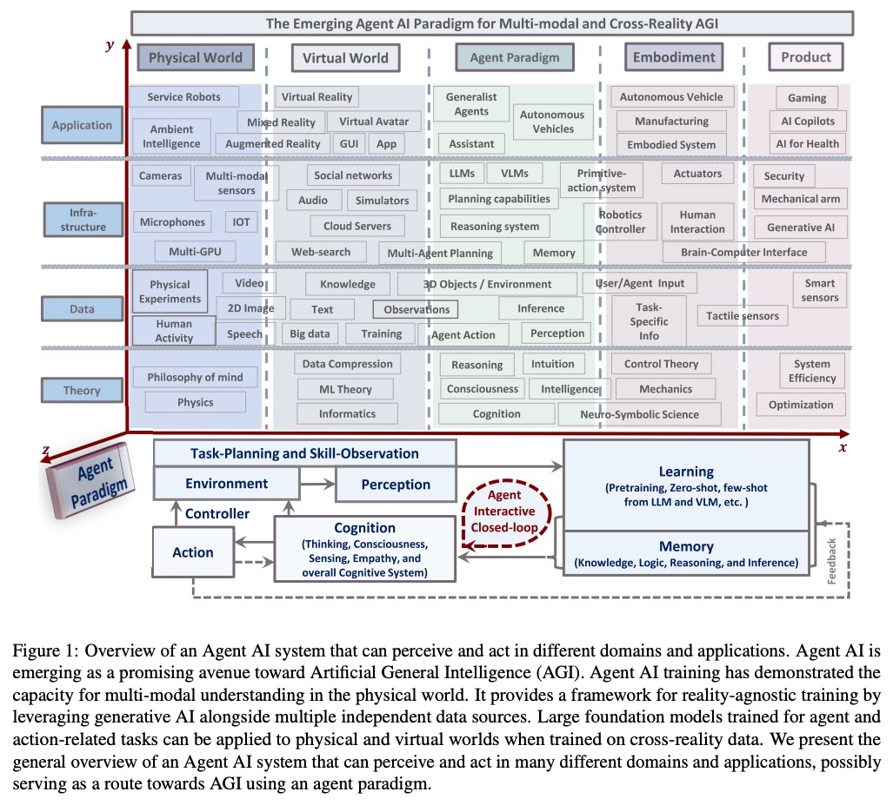
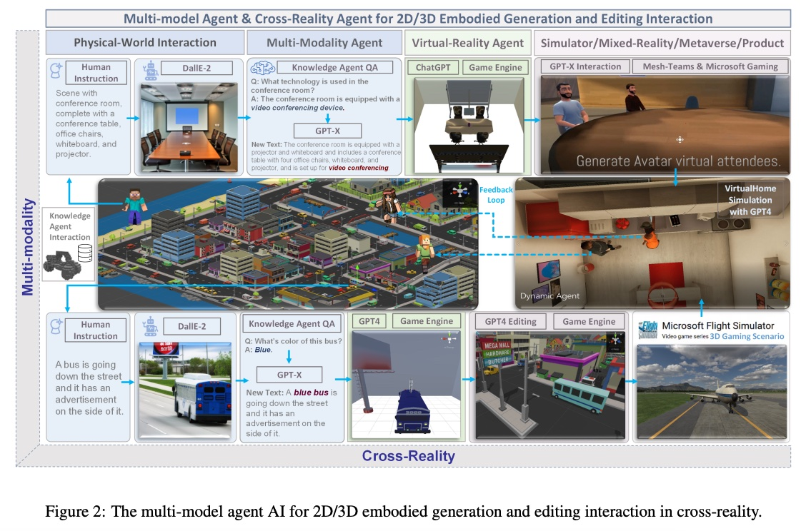
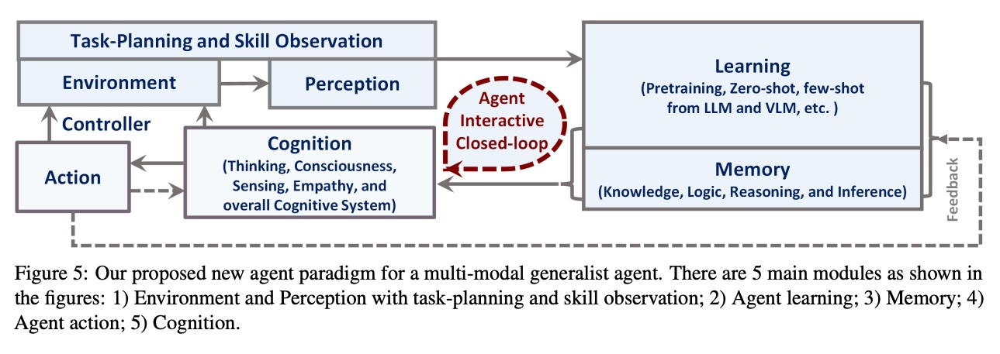
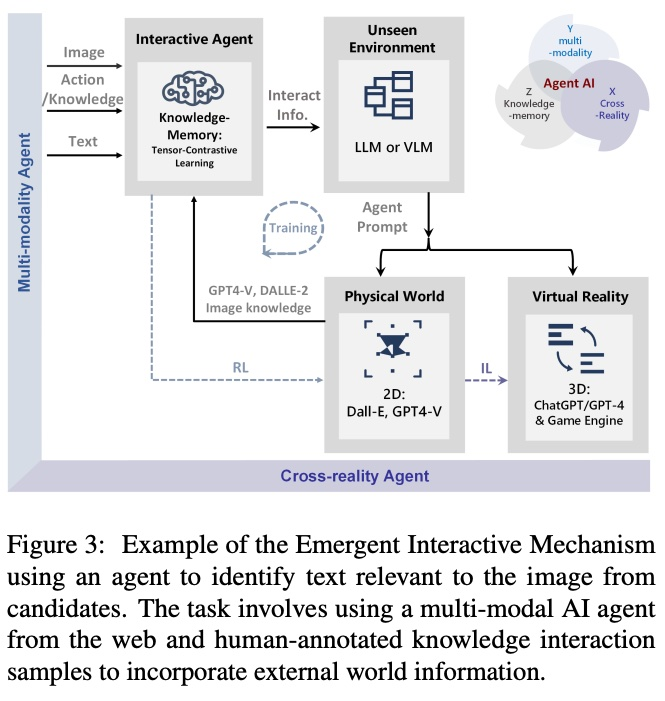
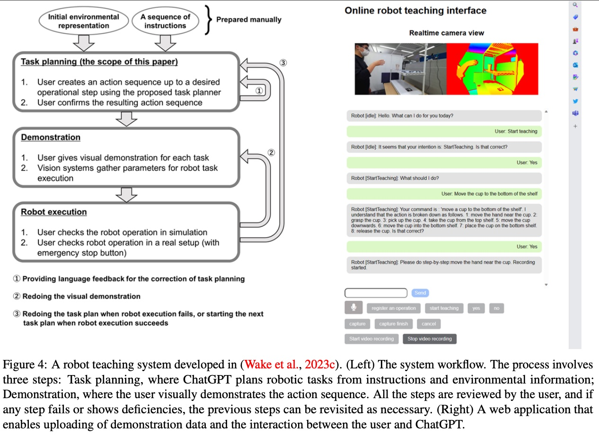
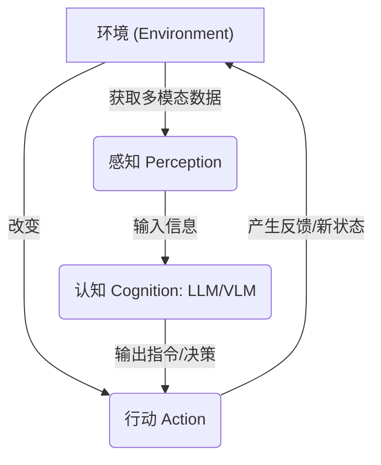

## AI论文解读 | AGENT AI: SURVEYING THE HORIZONS OF MULTIMODAL INTERACTION
        
### 作者        
digoal        
        
### 日期        
2025-10-04       
        
### 标签        
PostgreSQL , PolarDB , DuckDB , AI , 论文解读        
        
----        
        
## 背景  
      
https://arxiv.org/pdf/2401.03568        
  
提示:          
```          
读懂《AGENT AI: SURVEYING THE HORIZONS OF MULTIMODAL INTERACTION》这篇论文需要提前掌握哪些基础知识, 请使用中文通熟易懂的讲解这些基础知识, 可以引用论文中的图、表或使用Markdown支持的图形(text,mermaid等)增加解释性. 
  
使用中文通熟易懂的解读《AGENT AI: SURVEYING THE HORIZONS OF MULTIMODAL INTERACTION》这篇论文, 其中的关键内容请着重讲解, 可以引用论文中的图、表或使用Markdown支持的图形(text,mermaid等)增加解释性. 
  
提取《AGENT AI: SURVEYING THE HORIZONS OF MULTIMODAL INTERACTION》这篇论文中的重要术语, 使用中文对这些术语进行通熟易懂的讲解, 可以引用论文中的图、表或使用Markdown支持的图形(text,mermaid等)增加解释性. 
```     
  
## 1 前置知识 
  
阅读《AGENT AI: SURVEYING THE HORIZONS OF MULTIMODAL INTERACTION》（多模态交互地平线上的 Agent AI 调查）这篇论文，您需要提前掌握以下四个核心基础知识模块。

这篇论文本质上是探讨 **如何利用当前最先进的 AI 模型，来构建能够在真实世界和虚拟世界中感知、思考和行动的智能体（Agent）** 。因此，基础知识都围绕这一目标展开。

---

## 1. 基础模型：Agent 的“大脑”和知识库

Agent AI 的构建离不开现代深度学习的基石，即**大型基础模型 (Large Foundation Models)** 。

| 概念 | 中文名称 | 通俗解释 | 在 Agent 中的作用 |
| :--- | :--- | :--- | :--- |
| **LLM** | **大语言模型** (Large Language Model) | 如 GPT-4、GPT-3.5 等。它们通过海量文本数据训练，拥有强大的**语言理解、逻辑推理**和**规划能力** 。 | 充当 Agent 的 **“规划者”和“决策者”** 。Agent 接收到任务（如：“帮我做饭”），LLM 负责将任务分解成具体步骤（如：获取食材 -> 切菜 -> 烹饪） 。 |
| **VLM** | **视觉-语言模型** (Vision-Language Model) | 如 GPT-4V、CLIP 等。它们能同时理解**图像或视频**和**文本**，将视觉信息与语言概念联系起来 。 | 充当 Agent 的 **“视觉皮层”** 。让 Agent 能看懂环境，比如识别出桌子上的钥匙、房间的布局等 。 |

---

## 2. 核心范式：Agent 闭环工作流

理解这篇论文的关键是掌握 **“Agent 闭环（Closed-loop）”** 的运作模式 。Agent AI 并非简单地接收输入并给出一次性输出，而是**持续性地与环境互动，并根据反馈进行调整**。

您可以参考论文中的 **图 1 (Agent Paradigm)** 的底部核心结构来理解这个闭环：

  

**Agent AI 核心闭环 (Figure 1 简化)**

1.  **环境 (Environment):** Agent 所处的物理或虚拟空间。
2.  **感知 (Perception):** Agent 通过传感器（摄像头、麦克风等）获取环境信息 。
3.  **认知 (Cognition):** 这一步是 LLM/VLM 发挥作用的地方。它涉及到**思考、推理、规划、记忆**等高级认知过程 。
4.  **控制器 (Controller) & 行动 (Action):** 根据认知结果，Agent 决定并执行下一步动作，例如移动机器人、生成一段文本、或操作虚拟角色 。
5.  **反馈 (Feedback):** 行动改变了环境，Agent 重新**感知**新状态，形成一个持续的循环，直到任务完成 。

这个闭环赋予了 Agent AI 强大的**自我改进**和**适应环境**的能力 。

---

## 3. 关键概念：多模态与跨现实具身化

Agent AI 的前景在于它能处理复杂且多样化的真实世界任务，这引入了两个核心概念：

### **A. 多模态 (Multimodality)**

多模态指的是 Agent 能够同时处理和理解多种类型的数据输入，例如：
* **语言 (Text)**
* **视觉 (Image/Video)**
* **听觉 (Audio)**
* **触觉 (Tactile sensors)**
* **环境数据 (IOT/Sensors)** 

**意义：** 只有多模态，Agent 才能全面理解真实世界。例如，一个 Agent 看到（视觉）一个杯子，听到（听觉）有人说“有点烫”，它就能推断出（认知）需要小心拿取。

### **B. 具身智能 (Embodied AI) 与 跨现实 (Cross-Reality)**

* **具身智能 (Embodied AI):** 意味着 Agent 拥有一个**身体** (Embodiment) 。这个身体可以是**物理机器人**（如服务机器人、自动驾驶汽车），也可以是**虚拟世界中的化身**（如虚拟现实 (VR)、混合现实 (MR) 中的角色） 。
* **跨现实 (Cross-Reality) / Sim-to-Real:** 这是论文强调的一个重点 。它指的是在**虚拟模拟环境**中学习到的技能和知识，可以有效地**迁移**到**物理世界**中的 Agent 上，反之亦然 。

**论文中的 图 2** 展示了这种跨现实的能力：Agent 可以根据人类指令（Human Instruction）在**物理世界的场景描述**、**多模态问答**和**虚拟现实生成与编辑**之间进行交互和转换。这表明 Agent 的能力是 **“现实无关”** 的，可以在各种环境中通用。

  

---

## 4. 训练方法：如何让 Agent 学会技能

要让 Agent 具备**规划 (Planning)** 和**行动 (Action)** 的能力，需要了解几种主流的训练范式：

| 训练范式 | 中文名称 | 核心机制 | 简单示例 |
| :--- | :--- | :--- | :--- |
| **RL** | **强化学习** (Reinforcement Learning) | Agent 通过**试错**与环境互动，获得**奖励**或**惩罚**，从而学习最佳行为策略 。 | 训练机器人走路：走得稳就给奖励，跌倒就给惩罚。 |
| **IL** | **模仿学习** (Imitation Learning) | Agent 观看人类或专家执行任务的**演示数据**，并直接模仿这些行为 。 | 训练机器人做饭：观看人类做饭的视频，学习操作步骤和轨迹。 |
| **In-context Learning** | **情境学习** / **上下文学习** | **（针对 LLM/VLM）** 不需要重新训练模型，只需在**提示词 (Prompt)** 中给出少量示例或指导，模型就能立即执行新任务（零样本/少样本学习）。 | 告诉 Agent：“这是 3 个步骤的示例：1. A, 2. B, 3. C。现在请为任务 D 规划步骤。” |

掌握上述知识后，您就能理解论文中 Agent 的基本构成、工作原理、以及它在**游戏、机器人、医疗**等复杂应用场景中的巨大潜力 。
  
## 2 解读论文 
  
好的，我们来通俗易懂地解读一下这篇名为《AGENT AI: SURVEYING THE HORIZONS OF MULTIMODAL INTERACTION》（智能体AI：多模态交互的视野探索）的重磅论文。

这篇论文篇幅很长，内容非常丰富，它像是一份宣言，系统性地定义了一个新兴且极其重要的AI领域—— **Agent AI (智能体AI)** ，并认为这是通往 **通用人工智能（AGI）** 的一条极有前景的道路 。

简单来说，这篇论文的核心思想是：过去的AI模型大多是被动地处理信息（比如你看图说话，我给你个图，你生成一段描述），而未来的AI应该成为一个 **主动的“智能体”（Agent）** 。它能像人一样，在一个真实或虚拟的环境中，通过多种感官（看、听、读）去**感知**世界，进行**思考**和**规划**，并最终**采取行动**来完成任务或与世界互动 。

下面我们分几个关键部分来深入讲解。

### 1\. 核心概念：到底什么是 Agent AI？

论文将 "Agent AI" 定义为一类**交互式系统**，它能够：

  * **感知多模态信息**：比如视觉图像、语言文字指令，以及其他来自环境的数据 。
  * **产出有意义的实体化行动**：它不只是生成文字或图片，而是能在所处的环境（物理或虚拟）中做出实际的动作 。

这其中最关键的是一个 **“智能体交互闭环” (Agent Interactive Closed-loop)** 。我们可以用论文中的图1来理解这个循环：

图1简化示意：Agent AI 的核心工作流程 

  

这个闭环的工作流程可以简化为：

1.  **感知 (Perception)**：智能体通过摄像头、麦克风等传感器观察环境，获取图像、声音、文字等信息 。
2.  **认知 (Cognition)**：这是智能体的“大脑”，它对感知到的信息进行思考、理解、推理和规划 。
3.  **行动 (Action)**：根据认知结果，智能体通过控制器执行具体动作，比如移动机械臂、在游戏中行走、回复对话等 。
4.  **环境反馈 (Environment Feedback)**：行动会改变环境，智能体再次感知新的环境状态，形成一个不断循环、学习和优化的闭环 。

这个闭环让AI从一个“静态的知识库”变成了一个“动态的行动者”。

### 2\. 核心框架：论文提出的新一代 Agent AI 范式

这篇论文不只是总结现状，更提出了一个用于构建和训练Agent AI的全新框架，其核心组件如论文图5所示 。   

  

图2：论文提出的 Agent AI 新范式框架图 

这个框架包含5个主要模块 ：

  * **环境与感知模块 (Environment and Perception)**：负责观察世界和制定任务计划 。
  * **学习模块 (Learning)**：利用现有的大语言模型（LLM）和视觉语言模型（VLM）进行预训练、零样本或少样本学习，让智能体快速获得基础能力 。
  * **记忆模块 (Memory)**：存储知识、逻辑、推理和过往经验，为决策提供支持 。
  * **行动模块 (Action)**：将决策转化为物理或虚拟世界中的具体动作 。
  * **认知模块 (Cognition)**：是整个系统的核心，整合思考、意识、感知、共情等高级认知功能 。

#### Agent Transformer: 一个更统一的模型

论文进一步提出了一个更具前瞻性的模型——**Agent Transformer** 。

目前主流的方法是把不同功能的模型（如视觉模型、语言模型）像搭积木一样“粘”在一起，这些模型的核心部分通常是“冻结”不变的 。而 Agent Transformer 提出了一种更统一的、端到端的训练范式 。

它的创新之处在于引入了 **“智能体令牌” (Agent tokens)** 。

  * **输入**: 模型不仅接收“视觉令牌”（代表图像）和“语言令牌”（代表文字），还接收专门的“智能体令牌” 。
  * **作用**: 这些“智能体令牌”专门用于表示和学习特定领域的“动作”，比如机器人控制器的操作指令或游戏角色的行为 。

这种设计使得模型可以更原生、更灵活地学习“如何行动”，而不是仅仅在语言层面进行规划。

### 3\. 三大关键应用领域

论文重点介绍了Agent AI在三个领域的巨大潜力，并展示了许多实验结果。

#### (1) 游戏 (Gaming)

游戏是测试Agent AI的绝佳“沙盒” 。

  * **更智能的NPC**：利用LLM，游戏中的非玩家角色（NPC）不再是按固定脚本行动的“木偶”，而是能与玩家进行更自然、更有深度的互动，甚至能根据玩家的行为调整自己的策略 。
  * **动态场景生成**：利用生成式AI技术，可以根据玩家的简单描述或行为，实时生成新的游戏场景、道具甚至任务，提供千人千面的游戏体验 。
  * **人机协作**：在《CuisineWorld》这样的多智能体协作游戏中，论文展示了如何使用GPT-4作为中央“调度员”，协调多个AI智能体甚至与人类玩家一起高效完成复杂任务 。

  

图3：论文中展示了使用 GPT-4V 在《我的世界》中进行交互式动作预测和场景编辑的案例  

#### (2) 机器人 (Robotics)

这是Agent AI实体化最直接的体现。

  * **理解复杂指令**：机器人可以理解“把桌上的派拿去用炉子热一下”这类高级、模糊的人类指令，并利用LLM自主规划出详细的执行步骤（比如：1. 走向桌子；2. 拿起派；3. 走向炉子...） 。
  * **多模态学习**：结合**语言指令**和**人类的视觉演示**进行学习。如下图所示，人类专家做一个示范动作，机器人通过GPT-4V这样的多模态模型来理解这个动作的意图和环境，从而生成自己的任务计划 。
  * **从仿真到现实 (Sim-to-Real)**：虽然在模拟环境中训练机器人更安全高效，但如何将学到的技能应用到复杂的现实世界仍然是一个巨大挑战 。

  

图4：论文展示的机器人教导系统，它整合了ChatGPT的任务规划和人类的视觉演示 

#### (3) 医疗健康 (Healthcare)

这是一个潜力巨大但风险也极高的领域。

  * **AI诊断助手**：Agent AI可以作为医疗聊天机器人，帮助患者进行初步的症状分析和分诊，尤其能为医疗资源匮乏地区提供帮助 。
  * **可靠的知识检索**：在医疗领域，“幻觉”（AI一本正经地胡说八道）是致命的 。因此，开发能够准确、可靠地从医疗知识库中检索信息的Agent AI至关重要，它可以为诊断Agent提供事实依据，减少误诊风险 。
  * **远程医疗与监控**：Agent AI可以辅助医生处理大量的患者信息、报告和邮件，自动筛选出重要信息，极大提高远程医疗的效率 。

### 4\. 面临的挑战与道德考量

论文同样清醒地认识到Agent AI面临的巨大挑战：

  * **幻觉 (Hallucinations)**：AI可能生成与事实不符的内容，在关键应用（如医疗）中后果严重 。将AI置于真实环境中，让其行动与物理规律或环境反馈挂钩，是缓解幻觉的一种方法 。
  * **偏见与包容性 (Biases and Inclusivity)**：AI会从海量的网络数据中学习到人类社会的偏见（如种族、性别歧视），并可能在行动中放大这些偏见 。
  * **数据隐私与安全 (Data Privacy and Security)**：Agent AI与用户的交互会产生大量数据，如何保护用户隐私是一个核心问题 。此外，当AI能够自主行动时，如何确保其行为安全可控，防止被恶意利用，是一个严峻的挑战 。

### 总结

《AGENT AI: SURVEYING THE HORIZONS OF MULTIMODAL INTERACTION》不仅仅是一篇技术综述，更是一份对未来AI发展的蓝图和路线图。它明确指出，AI的未来在于 **从被动的“模型”走向主动的“智能体”** 。

通过定义**Agent AI**的核心概念、提出**全新的系统框架**、探索其在**游戏、机器人、医疗**等领域的广阔应用，并直面其**技术与伦理挑战**，这篇论文为整个AI社区指明了一个激动人心且充满挑战的前进方向——构建能够真正理解并主动改变我们世界的智能系统。
  
## 3 术语 
  
这篇《AGENT AI: SURVEYING THE HORIZONS OF MULTIMODAL INTERACTION》论文是关于构建能够在复杂环境中自主工作、像人一样思考和行动的 **Agent AI（智能体人工智能）** 的综述。

理解这篇论文需要掌握以下几个最重要的核心术语和概念。

-----

## 1\. 核心概念：智能体范式 (Agent Paradigm)

**术语：Agent AI / Agent Paradigm (智能体人工智能 / 智能体范式)**

**通俗讲解：**
Agent AI 的目标是构建一个拥有 **“感知、认知、行动”** 完整闭环能力的实体，让它能像一个自主的人或生物一样，在现实世界或虚拟世界中完成复杂的任务。

它不是一个简单的问答系统，而是一个具备**自主性**、**目标导向**和**环境交互能力**的系统。

### **智能体的工作闭环**

论文的核心在于描述了 Agent 如何通过一个连续的循环来工作。这个循环是 Agent 持续适应和完成任务的基础。

#### **三大核心要素：**

1.  **Perception (感知):** 相当于 Agent 的 **“眼睛和耳朵”** 。它通过传感器（如摄像头、麦克风）收集环境数据，如图像、语音、文本信息。
2.  **Cognition (认知):** 相当于 Agent 的 **“大脑”** 。它利用 LLM/VLM 等基础模型进行 **推理、规划、记忆和决策** 。例如：识别出目标、分析障碍、并规划出下一步的行动路径。
3.  **Action (行动):** 相当于 Agent 的 **“手和脚”** 。它执行认知模块的决策，通过机械臂、移动底盘、或在虚拟世界中发送操作指令来改变环境。

这个过程周而复始，直到任务完成：



-----

## 2\. 能力基石：基础模型 (Foundation Models)

**术语：LLM (大语言模型) / VLM (视觉-语言模型)**

**通俗讲解：**
它们是 Agent 的 **“大脑中枢”** 。Agent AI 不是从零开始训练，而是以这些强大的模型为基础，赋予它们**推理**和 **多模态理解** 的能力。

  * **LLM (Large Language Model, 大语言模型):** 负责 Agent 的**语言理解、逻辑推理**和**高层次规划**。Agent 接收到复杂的文字任务后，是 LLM 负责将任务分解成一个个具体的行动步骤，并进行**情境学习 (In-context Learning)**，即通过提示词中的少量示例快速掌握新技能。
  * **VLM (Vision-Language Model, 视觉-语言模型):** 负责 Agent 的**视觉理解**。它能同时理解图像和文本，让 Agent 能够“看懂”环境中的物体、场景和动作，实现视觉与语言的对齐。

-----

## 3\. 交互方式：多模态交互 (Multimodal Interaction)

**术语：Multimodality (多模态)**

**通俗讲解：**
**多模态**是 Agent AI 区别于传统 AI 的关键特征。传统 AI 可能只处理文本或图像，而多模态 Agent 能够同时处理、融合并生成**多种类型**的数据，从而更全面地感知和响应真实世界。

| 数据类型 (Modality) | 作用 | 示例 |
| :--- | :--- | :--- |
| **Language (语言/文本)** | 接收指令、进行思考和推理。 | “帮我把灯打开” |
| **Vision (视觉/图像)** | 识别物体、理解场景和环境布局。 | 看到桌子上放着一本书和一杯水。 |
| **Audio (听觉/语音)** | 听懂人类的语音指令、识别环境音。 | 听到“请安静”的指令或门铃声。 |
| **Actuation (驱动/触觉)** | 控制机器人肢体、感知物体的纹理和温度。 | 机械臂抓住物体时的力度反馈。 |

Agent 能够将这些不同模态的信息整合起来，做出更准确的决策。

-----

## 4\. 应用形式：具身与跨现实 (Embodiment & Cross-Reality)

**术语：Embodiment (具身化) / Cross-Reality (跨现实)**

**通俗讲解：**
Agent AI 的最终目标是“落地”到实际应用中，这就引入了两个关于**身体和环境**的概念：

### A. 具身化 (Embodiment)

**定义：** 具身化是指 Agent 拥有一个可以影响物理或虚拟环境的 **“身体”** 。

  * **物理具身：** 机器人、无人车、机械臂等。
  * **虚拟具身：** 游戏中的 NPC（非玩家角色）、虚拟助理、元宇宙中的数字替身。

具身化让 Agent 从一个纯粹的软件系统，变成了能真正与世界交互的实体。

### B. 跨现实 (Cross-Reality)

**定义：** 跨现实，有时也称 **Sim-to-Real (从模拟到现实)**，指的是 Agent 在虚拟世界（如高逼真度的模拟器）中学到的技能，可以**无缝地迁移**到物理世界中。

**重要性：** 在现实世界中训练机器人成本高、风险大、效率低。通过跨现实技术，Agent 可以在虚拟环境中**安全、快速**地积累经验和技能（如学会驾驶、操作复杂设备），然后将这些成熟的技能直接应用于现实世界的机器人。

-----

## 5\. 关键能力：规划与记忆 (Planning & Memory)

**术语：Planning (规划) / Memory (记忆)**

**通俗讲解：**
Agent 不只是对刺激做出反应，它还需要长期和短期的**思考**能力。

  * **Planning (规划):** 这是 **Cognition (认知)** 模块的核心功能。Agent 必须具备**长远的视野**，将一个宏观目标（如“清理房间”）分解为一系列有逻辑的、可执行的**子目标**和**行动序列**。这需要强大的逻辑推理和因果关系理解能力。
  * **Memory (记忆):** Agent 必须能记录和检索过去的信息，包括：
      * **短期记忆 (Short-term Memory):** 当前任务的进度、最近观察到的环境状态。
      * **长期记忆 (Long-term Memory):** 积累的知识、过去的经验、已完成的任务记录。

记忆系统确保 Agent 在执行复杂、多步骤任务时，不会忘记目标或丢失关键信息。
  
## 参考        
         
https://arxiv.org/pdf/2401.03568    
        
<b> 以上内容基于DeepSeek、Qwen、Gemini及诸多AI生成, 轻微人工调整, 感谢杭州深度求索人工智能、阿里云、Google等公司. </b>        
        
<b> AI 生成的内容请自行辨别正确性, 当然也多了些许踩坑的乐趣, 毕竟冒险是每个男人的天性.  </b>        
      
#### [期望 PostgreSQL|开源PolarDB 增加什么功能?](https://github.com/digoal/blog/issues/76 "269ac3d1c492e938c0191101c7238216")
  
  
#### [PolarDB 开源数据库](https://openpolardb.com/home "57258f76c37864c6e6d23383d05714ea")
  
  
#### [PolarDB 学习图谱](https://www.aliyun.com/database/openpolardb/activity "8642f60e04ed0c814bf9cb9677976bd4")
  
  
#### [PostgreSQL 解决方案集合](../201706/20170601_02.md "40cff096e9ed7122c512b35d8561d9c8")
  
  
#### [德哥 / digoal's Github - 公益是一辈子的事.](https://github.com/digoal/blog/blob/master/README.md "22709685feb7cab07d30f30387f0a9ae")
  
  
#### [About 德哥](https://github.com/digoal/blog/blob/master/me/readme.md "a37735981e7704886ffd590565582dd0")
  
  

  
