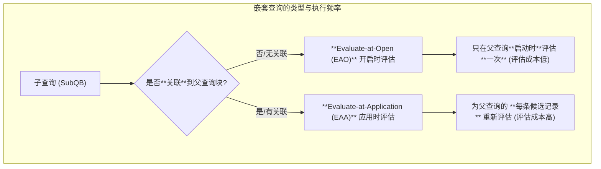
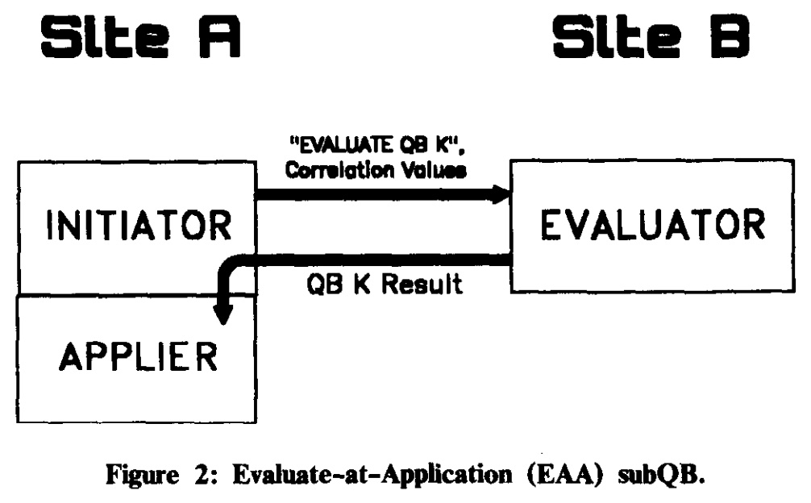
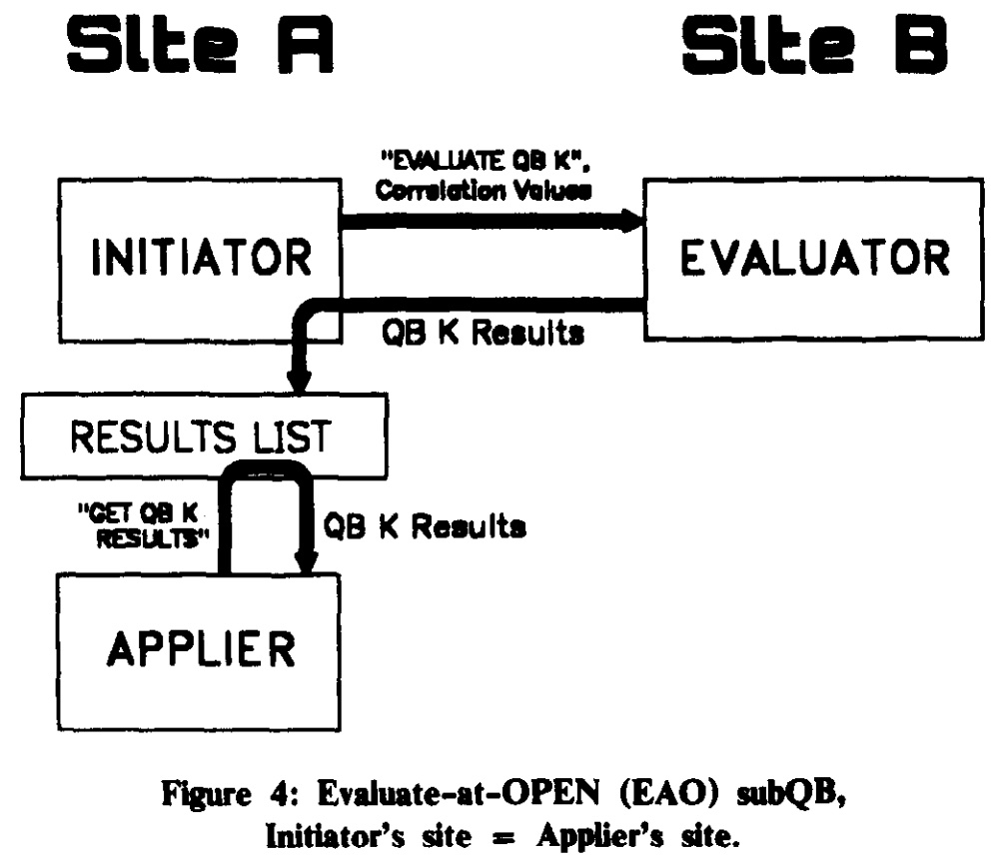
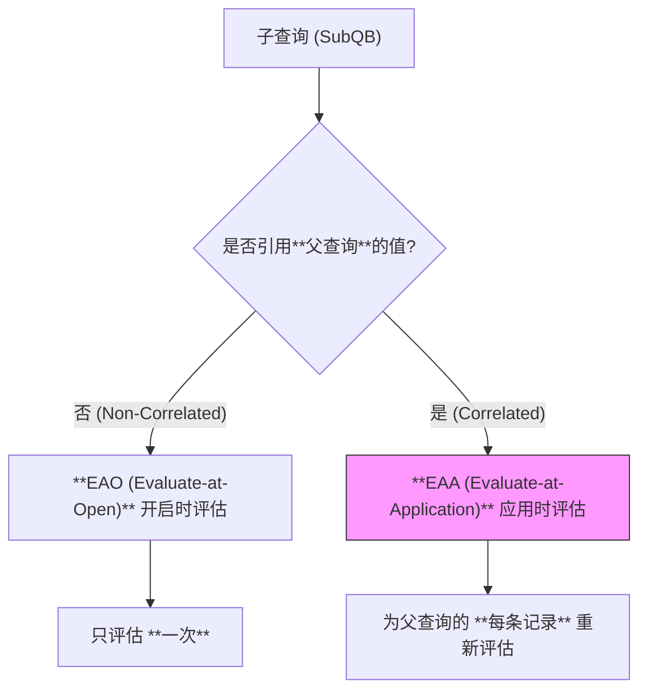
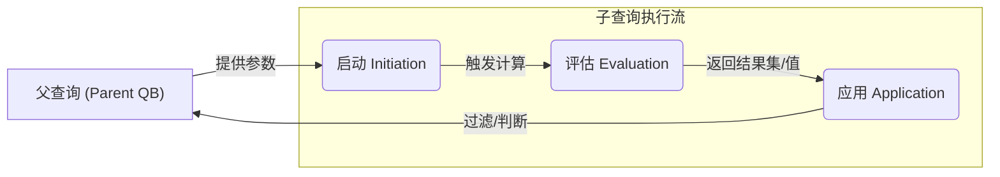

## AI论文解读 | Optimization Of Nested Queries In A Distributed Relational Database
        
### 作者        
digoal        
        
### 日期        
2025-10-04       
        
### 标签        
PostgreSQL , PolarDB , DuckDB , AI , 论文解读        
        
----        
        
## 背景  
      
https://www.vldb.org/conf/1984/P403.PDF        
  
提示:          
```          
读懂《Optimization Of Nested Queries In A Distributed Relational Database》这篇论文需要提前掌握哪些基础知识, 请使用中文通熟易懂的讲解这些基础知识, 可以引用论文中的图、表或使用Markdown支持的图形(text,mermaid等)增加解释性. 
  
使用中文通熟易懂的解读《Optimization Of Nested Queries In A Distributed Relational Database》这篇论文, 其中的关键内容请着重讲解, 可以引用论文中的图、表或使用Markdown支持的图形(text,mermaid等)增加解释性. 
  
提取《Optimization Of Nested Queries In A Distributed Relational Database》这篇论文中的重要术语, 使用中文对这些术语进行通熟易懂的讲解, 可以引用论文中的图、表或使用Markdown支持的图形(text,mermaid等)增加解释性. 
```     
  
## 1 前置知识 
  
要读懂《Optimization Of Nested Queries In A Distributed Relational Database》（分布式关系数据库中嵌套查询的优化）这篇论文，您需要提前掌握以下几个核心基础知识。这篇论文是在著名的 **System R** 集中式数据库管理系统基础上，针对分布式环境（**R\***）所做的扩展，其核心挑战是分布式环境下的查询优化问题。

-----

## 预备基础知识 (Prerequisite Foundational Knowledge)

论文本身假设读者已经熟悉以下内容 ：

### 1\. 关系数据库模型 (Relational Database Model)

您需要理解关系数据库的基本概念：

  * **关系（Relation）/ 表（Table）** ：数据是以二维表的形式存储的。
  * **元组（Tuple）/ 行（Row）** ：表中的每一行记录。
  * **属性（Attribute）/ 列（Column）** ：表中的每一列字段。
  * **关系代数（Relational Algebra）** ：数据库理论的基础，是所有 SQL 操作（如选择、投影、连接等）的数学依据。

### 2\. SQL 查询语言基础 (SQL Query Language Basics)

需要熟练掌握 **SQL** 的基本语法，尤其是 `SELECT...FROM...WHERE...` 结构，以及各种谓词（`=`, `IN`, `EXISTS` 等）的使用。

### 3\. System R 和分布式数据库概念 (System R and Distributed DB)

  * **System R：** 了解它是 IBM 早期开发的、具有里程碑意义的**集中式**关系数据库管理系统。论文中的 **R\*** 系统就是 **System R** 在**分布式环境**中的一个实验性改编版本 。
  * **分布式数据库 (Distributed Database)：** 理解数据被分散存储在多个**站点 (Site)** 或节点上，查询可能需要访问不同站点的数据，这就引入了**网络通信**和**数据传输**的成本。

-----

## 论文核心术语与概念 (Core Concepts of the Paper)

掌握了基础知识后，您需要重点理解论文提出的以下几个关键概念：

### 1\. 查询块 (Query Block, QB) 与 嵌套查询 (Nested Query)

在 SQL 中，每一个完整的 `SELECT...FROM...WHERE...` 序列被称为一个**查询块（QB）** 。

**嵌套查询**（或**子查询**，subQB）就是在一个查询块的谓词（`WHERE` 子句）中引用了另一个查询块的结果 。

例如，在以下 SQL 语句（论文中的例子 A）中，外部的 `QB 1` 嵌套了内部的 `QB 2`：

| QB 1 (父查询块) | QB 2 (子查询块/subQB) |
| :--- | :--- |
| `SELECT E.NAME` | `(SELECT D.DEPT#` |
| `FROM EMPLOYEES E` | `FROM DEPARTMENTS D` |
| `WHERE E.DEPT =` | `WHERE D.LOCATION = 'DENVER' AND D.NAME = 'SHIPPING')` |

### 2\. 嵌套查询的两种处理类型 (Two Types of SubQueries)

论文的核心在于区分两种不同类型的子查询，因为它们的执行频率和优化方式完全不同 。

#### A. Evaluate-at-Open (EAO) - 开启时评估 (非关联子查询)

  * **定义：** 子查询块（SubQB）不引用其**父查询块**中任何表的值 。
  * **执行频率：** 只需要在父查询块或某个祖先查询块**开启处理 (OPEN)** 时**评估一次** 。评估结果通常被存储在一个临时关系（Temporary Relation）中，供父查询块重复使用 。
  * **示例：** 上面例子中的 `QB 2`（查找位于 Denver 的 Shipping 部门编号），它只涉及 `DEPARTMENTS` 表，与外部的 `EMPLOYEES E` 无关。

#### B. Evaluate-at-Application (EAA) - 应用时评估 (关联子查询)

  * **定义：** 子查询块（SubQB）在其谓词中引用了其**父查询块**中表的一列值 。这被称为**关联 (Correlated)** 。
  * **执行频率：** 必须在父查询块的**每条候选元组 (Candidate Tuple) 上重新评估** 。
  * **示例：** 论文中的例子 C（查找在 Denver 工作且是部门经理的员工），内部 QB 2 的 `WHERE` 子句包含了 `D.MANAGER = E.EMP#`，引用了外部 QB 1 的 `E.EMP#` 值，因此它是一个 **EAA** 子查询 。

这两种类型的关系和执行频率可以用图示概括：



### 3\. 查询块的三大任务 (Three Tasks of a QB)

在 **R\*** 中，每个查询块的执行（尤其是子查询）被分解为三个独立的任务，这在分布式环境中是优化站点选择的关键 ：

| 任务名称 (中文) | 任务名称 (英文) | 任务描述 |
| :--- | :--- | :--- |
| **启动** | **Initiation** | 检测谓词是否符合评估条件；为关联子查询提供所需的上层查询的值；为 EAO 子查询创建存储结果的临时关系 。 |
| **评估** | **Evaluation** | 实际执行子查询的逻辑，并返回结果集 。这个任务的执行站点被称为**评估站点 (Evaluator's Site) / 结果交付站点 (Delivery Site)** 。 |
| **应用** | **Application** | 使用**评估**的结果（如一个值或一个集合），将谓词应用到父查询块的候选元组上进行过滤 。这个任务的执行站点被称为**应用站点 (Applier's Site)** 。 |

### 4\. 分布式环境下的优化挑战

论文的真正难点在于如何将上述任务的执行站点分布到多个节点上以最小化总成本 。

  * **分布式成本模型：** **R\*** 的优化器不仅考虑 System R 的 **CPU 和 I/O 成本**，更重要的是引入了**通信成本**，包括**站点间的消息数量**和**消息长度**的线性组合 。目标是找到一个总成本最小的执行计划。
  * **站点选择：** 优化器必须为每个子查询的**启动、评估和应用**任务选择最佳的执行站点 。
  * **“自底向上”与“自顶向下”的冲突：** 在集中式数据库中，优化可以简单地**自底向上**（从最内层子查询开始）进行 。但在分布式环境中，子查询的结果**交付站点**（评估站点）必须是其父查询的**应用站点** 。由于父查询的优化（自顶向下）才能确定**应用站点**，这与子查询的自底向上优化所需的成本和基数（Cardinality，即返回的记录数）信息产生了冲突 。
  * **R\* 的解决方法：** **R\*** 通过**推迟（Postponing）子查询交付站点的最终选择来解决这个冲突 。在优化一个子查询时，它会生成多个候选计划，其中包括将结果交付到所有“自然结果站点”以及一个特殊的 “待定（to-be-determined-later, ??)”站点的计划 。直到父查询被优化时，才会根据其选择的应用站点**来 **解析（Resolve）** 这个“待定”站点，从而选择子查询的最佳计划 。
  
## 2 解读论文 
  
好的，我们来通俗易懂地解读这篇分布式数据库领域的经典论文——《Optimization of Nested Queries in a Distributed Relational Database》。

这篇论文发表于1984年，介绍了 IBM 研究的实验性分布式关系数据库系统 R\* (读作 R-star) 是如何优化 SQL 嵌套查询的。虽然年代久远，但其核心思想至今仍在影响着现代分布式数据库的设计。

-----

### 论文核心思想概览

想象一下，你要在一个跨国公司里查数据，公司的员工数据在上海，部门数据在纽约。如果你想查询“所有在纽约‘SHIPPING’部门工作的员工姓名”，你可能会写一个嵌套查询。

这个查询在单个数据库里很简单，但现在数据分布在上海和纽约两个地方，问题就变得复杂了：

  * 查询应该在哪里执行？上海？纽约？还是另一个地方？
  * 数据如何在不同站点间传输最划算？是把所有部门信息发到上海，还是把所有员工信息发到纽约？
  * 如何协调这些分布式的操作，才能让总成本（计算+网络传输）最低？

这篇论文的核心，就是解决在数据分散于多个地点（分布式）的情况下，如何智能地、低成本地执行这种嵌套查询。

-----

### 关键内容深度解析

#### 1\. 嵌套查询的两种“天性”：EAO 与 EAA

论文首先将嵌套查询（即子查询 Subquery Block, subQB）根据其“天性”分为了两大类，这个分类是后续所有优化的基础。

  * **不相关子查询 (Evaluate-at-OPEN, EAO)**

      * **特点**：子查询可以独立运行，不依赖于外部主查询的任何变量。
      * **例子** (源自论文 Query (D))：查询所有在丹佛的部门里工作的员工。
        ```sql
        SELECT E.NAME
        FROM EMPLOYEES E
        WHERE E.DEPT IN
          (SELECT D.DEPT#
           FROM DEPARTMENTS D
           WHERE D.LOCATION = 'DENVER');
        ```
      * **通俗理解**：内层的子查询 `(SELECT D.DEPT# ...)` 可以先单独执行一次，找出所有在丹佛的部门编号，比如结果是 `{10, 20, 30}`。然后主查询拿着这个固定的列表 `{10, 20, 30}` 去员工表里找人就行了。
      * **优化思路**：这种查询很高效，因为子查询**只需在主查询开始（OPEN）时评估一次**，一劳永逸。

  * **相关子查询 (Evaluate-at-Application, EAA)**

      * **特点**：子查询的执行依赖于外部主查询当前处理的每一行数据。
      * **例子** (源自论文 Query (C))：查询所有在丹佛并且是自己部门经理的员工。
        ```sql
        SELECT E.NAME
        FROM EMPLOYEES E
        WHERE E.DEPT IN
          (SELECT D.DEPT#
           FROM DEPARTMENTS D
           WHERE D.LOCATION = 'DENVER'
           AND D.MANAGER = E.EMP#); -- 关键关联
        ```
      * **通俗理解**：这里的子查询依赖于 `E.EMP#`，`E.EMP#` 来自于主查询 `EMPLOYEES` 表的每一行。所以，主查询每处理一个员工，都必须拿着这个员工的 `EMP#` 去重新执行一次子查询。
      * **优化挑战**：这种查询天生就慢，因为子查询需要在主查询的谓词**每次应用（Application）时都重新评估**。如果员工表有100万行，子查询就要被执行100万次，这在分布式环境下会产生巨大的网络开销。

#### 2\. 分布式优化的核心矛盾：“自底向上” vs “自顶向下”

在优化查询时，优化器需要估算成本。这产生了一个核心的矛盾：

  * **“自底向上” (Bottom-up) 的依赖**：主查询的优化依赖于子查询的“产出”。主查询需要知道子查询执行要花多少钱（`cost`）、会返回多少条结果（`cardinality`），才能估算自己的总成本。所以，理应先优化子查询。
  * **“自顶向下” (Top-down) 的依赖**：在分布式环境中，子查询的结果最终要被发送到某个地方，供主查询使用。这个“收货地点”（论文中称为 **应用站点 Application Site**）是由主查询的计划决定的。但主查询的计划还没定下来，子查询怎么知道该把结果送到哪儿呢？把结果送到纽约和送到上海的成本天差地别。

**这个“先有鸡还是先有蛋”的问题，是分布式嵌套查询优化的最大难题。**

#### 3\. R\* 的优雅解决方案：延迟决策 (Postponed Decision)

R\* 系统提出了一种非常聪明的解决方案来打破这个僵局：

1.  **子查询优化时“保留选项”** ：在优化子查询时，先不决定最终的结果送到哪里。而是生成一组“候选计划”，每个计划对应一个“可能的最佳收货点”。这些收货点包括：

      * **自然结果站点 (Natural Result Sites)**：存放子查询所需数据的站点。
      * 一个特殊的 **“待定”站点 (To-be-determined-later site)**，论文中用 `??` 表示。这个计划的成本是一个公式，可以根据最终确定的目标站点动态计算出传输成本。

2.  **主查询优化时“做出决策”** ：轮到优化主查询时，主查询的优化器会考虑将子查询的“应用站点”设置在不同的地方（比如员工表所在的上海，或部门表所在的纽约）。当它尝试一个方案时，比如决定在上海应用这个子查询，它就会去子查询的“候选计划”中，挑选出那个能够以最低成本将结果送到上海的计划。

通过这种方式，R\* 将决策过程分解，既遵循了“自底向上”的成本估算流程，又解决了“自顶向下”的站点依赖问题。

#### 4\. 子查询的三个执行任务与站点选择

论文将子查询的执行分解为三个逻辑任务，并为每个任务选择最佳的执行站点：

1.  **发起 (Initiation)**：检测到子查询可以被执行，并为主查询提供其所需的关联值（如果是EAA类型）。
2.  **评估 (Evaluation)**：实际执行子查询并产生结果。
3.  **应用 (Application)**：主查询使用子查询返回的结果来过滤自己的数据。

这三个任务在分布式环境中可能发生在不同的站点。优化器的目标就是为这三个任务找到成本最低的站点组合。

#### 5\. 执行协议与成本分析 (Protocols and Costs)

这部分是论文的精华，详细描述了不同场景下，站点间的交互模式。

  * **EAA 子查询 (相关子查询) 的昂贵交互**
    主查询的每一行数据，都会触发一次与子查询评估站点的网络交互。这是一种“对话式”的、高频的通信。

    我们可以用下面的序列图来模拟这个过程 (类似论文中的 Figure 2)：    

    ```mermaid
    sequenceDiagram
        participant Site_A as 主查询站点 (发起/应用)
        participant Site_B as 子查询站点 (评估)

        loop 针对主查询的每一行
            Site_A->>Site_B: 发起请求: "评估子查询", 附带关联值(如E.EMP#)
            Site_B->>Site_B: 执行子查询
            Site_B-->>Site_A: 返回子查询结果
            Site_A->>Site_A: 应用结果, 判断主查询当前行是否满足条件
        end
    ```

    从图中可见，如果主查询有N行，就需要N次网络来回，开销巨大。

  * **EAO 子查询 (不相关子查询) 的高效交互**
    这种查询只需一次交互。发起方请求评估，评估方返回所有结果，然后发起方将结果暂存起来，供主查询反复使用。

    序列图如下 (类似论文中的 Figure 4)：   

    ```mermaid
    sequenceDiagram
        participant Site_A as 主查询站点 (发起/应用)
        participant Site_B as 子查询站点 (评估)

        Note over Site_A, Site_B: 在主查询开始时
        Site_A->>Site_B: 发起请求: "评估子查询"
        Site_B->>Site_B: 执行子查询
        Site_B-->>Site_A: 返回【所有】结果
        Site_A->>Site_A: 将结果存入临时表

        Note over Site_A, Site_B: 主查询逐行处理时
        loop 针对主查询的每一行
            Site_A->>Site_A: 从本地临时表读取结果进行匹配
        end
    ```

    这种模式下，网络通信只有一次，后续处理都在本地进行，效率极高。

  * **分离的发起和应用 (论文 Case 3)**
    对于EAO查询，还存在一种更复杂的情况：在一个站点C发起了子查询的评估，但结果却需要在另一个站点A被应用。这时就需要一个代理进程来协调，增加了协议的复杂度。

#### 6\. 如何“拯救”昂贵的 EAA 子查询？

论文还探讨了几种优化 EAA 子查询、减少其巨大开销的策略，例如：

  * **转换为 Join**：在某些情况下，相关子查询可以被改写成等价的 `JOIN` 操作，这样优化器就有更大的空间去选择连接算法（如合并连接）和连接顺序，从而找到更优的计划。
  * **批量处理**：将主查询中需要用到的关联值打包，一次性发送给子查询站点，进行批量处理，而不是一行一发。
  * **将 IN 改为 EXISTS**：这是 R\* **实际采用**的一种重要转换。对于 `... IN (SELECT ...)` 这样的查询，优化器会将其改写为 `EXISTS (SELECT ...)` 的形式。好处是，对于 `EXISTS`，子查询只要找到**一个**匹配项就可以立即停止并返回 `TRUE`，不必扫描所有数据，从而大大减少了计算量 。

-----

### 总结与启示

《Optimization of Nested Queries in a Distributed Relational Database》这篇论文之所以经典，在于它系统性地解决了分布式环境下嵌套查询优化的核心问题：

1.  **精准定义问题**：首次清晰地定义了 EAO 和 EAA 两种查询类型在分布式环境下的不同挑战。
2.  **解决核心矛盾**：提出了创新的 **“延迟决策”** 和 **“多候选计划”** 机制，优雅地解决了“自顶向下”和“自底向上”的优化依赖冲突。
3.  **系统的站点选择模型**：将查询执行分解为“发起-评估-应用”三个任务，并为之设计了一套完整的站点选择和成本估算框架。
4.  **实用的优化技巧**：探讨了多种优化 EAA 查询的思路，其中一些（如 `IN` to `EXISTS` 转换）已被现代数据库广泛采用。

尽管这篇论文的技术背景是40年前，但它所揭示的分布式查询优化的根本性挑战，以及它所提出的解决问题的思维方式，至今仍然是数据库内核开发者和架构师学习的典范。
  
## 3 术语 
  
这篇论文是分布式数据库领域的一篇经典之作，它详细描述了 **R\*** 系统（**System R** 的分布式版本）如何高效处理复杂的 **SQL 嵌套查询**。要理解它，需要掌握以下关键术语和概念：

-----

## 一、核心系统与查询结构 (Core System and Query Structure)

### 1\. R\* 与 System R

  * **System R (集中式关系数据库系统)**：这是 IBM 在 70 年代开发的、具有里程碑意义的**集中式**关系数据库管理系统。它是 SQL 语言的先驱，并建立了现代数据库查询优化的基础。
  * **R\* (分布式关系数据库系统)**：论文关注的系统。它是 **System R** 的**分布式扩展**，目标是在数据分散存储在不同 **站点（Site）** 的多个计算机上时，如何高效地执行查询。

### 2\. 查询块 (Query Block, QB) 与 子查询块 (Subquery Block, subQB)

  * **查询块 (QB)**：指一个完整的 `SELECT...FROM...WHERE...` 语句结构。一个复杂的 SQL 查询往往由多个查询块组成。
  * **嵌套查询 (Nested Query)**：当一个查询块（**父查询块**）的 `WHERE` 谓词中引用了另一个查询块（**子查询块, subQB**）的结果时，就构成了嵌套查询。
      * **重点**：论文中的所有优化都是围绕如何处理和分解这些 **subQB** 展开的。

-----

## 二、子查询的两种分类 (Two Classifications of Subqueries)

这篇论文最重要的贡献之一，是根据子查询是否依赖外部值，将其分为两种类型，因为它们在执行成本上差异巨大。

### 1\. Evaluate-at-Open (EAO) — 开启时评估（非关联子查询）

  * **定义：** 子查询块 **不引用** 其父查询块中任何表的值。
  * **执行方式：** 这种子查询是**独立的**，它的结果只在父查询块**开始执行（Open）时计算一次**，然后将结果存储在一个临时关系（Temporary Relation）中，供父查询块在整个执行过程中重复使用。
  * **特点：** 评估成本是**一次性**的。

### 2\. Evaluate-at-Application (EAA) — 应用时评估（关联子查询）

  * **定义：** 子查询块 **引用** 了其父查询块中表的某个列值，即它们之间存在 **关联（Correlated）** 。
  * **执行方式：** 这种子查询**依赖**父查询当前处理的行（元组）。因此，它必须在父查询块的**每条候选元组**上**重新评估**一次。
  * **特点：** 评估成本会随着父查询结果集的大小而**线性增加**，是优化的重点和难点。

#### 图示：子查询的类型与执行频率

使用一个简单的流程图来表示这两种类型的区别：



-----

## 三、查询块的执行三任务 (The Three Execution Tasks)

在分布式环境中，**R\*** 将每一个查询块的执行分解为三个逻辑上独立的任务，每个任务都可能在不同的 **站点（Site）** 上执行。优化器需要为这三个任务选择最佳的执行站点。

| 任务名称 (中文) | 任务名称 (英文) | 最佳执行站点 | 主要作用 |
| :--- | :--- | :--- | :--- |
| **启动** | **Initiation** | 位于父查询的执行站点，或紧邻父查询的站点。 | 负责启动子查询的执行，收集父查询提供的必要参数值。对于 EAO 而言，它负责创建存放子查询结果的**临时关系**。 |
| **评估** | **Evaluation** | 位于数据所在站点，或数据传输成本最低的站点。 | 执行子查询中的实际数据操作（选择、连接等），计算出最终结果。这个任务执行的站点也被称为 **结果交付站点（Delivery Site）** 。 |
| **应用** | **Application** | 位于父查询的执行站点。 | 将 **评估** 任务返回的结果（如一个值、一个集合或一个布尔值），应用到父查询块正在处理的候选元组上，进行**过滤**。这个任务执行的站点被称为 **应用站点（Applier's Site）** 。 |

#### 图示：三个任务的逻辑流



-----

## 四、分布式查询优化机制 (Distributed Optimization Mechanism)

### 1\. 通信成本 (Communication Cost)

这是分布式优化器最核心的考量。在集中式系统中，优化器主要关注 CPU 和 I/O 成本。在 **R\*** 中，最主要的成本是**网络通信成本**，它由以下两部分构成：

$$\text{总成本} = \text{CPU/IO 成本} + \text{C}_{\text{消息数}} \times \text{消息数量} + \text{C}_{\text{长度}} \times \text{消息长度}$$

优化器的目标就是最小化这个**总成本**，尤其是其中的**通信成本**。

### 2\. 推迟交付站点 (Postponing the Delivery Site)

这是论文中解决“自底向上”和“自顶向下”优化冲突的关键技术。

  * **问题：** 子查询（自底向上）的最佳**评估站点**（交付结果的站点）应该由它的**应用站点**（父查询正在执行的站点）来决定。但在优化子查询时，父查询的最佳执行计划（应用站点）还未确定。
  * **R\* 的解决：** 在优化子查询时，优化器会生成多个候选执行计划，包括将结果交付到所有“自然站点”的计划，以及一个特殊的 **“待定（To-Be-Determined, ??)”站点**的计划。直到优化父查询时，当父查询确定了自己的**应用站点**后，这个 **“待定”站点**的计划才会被 **解析（Resolve）** ，从而确定子查询的最佳**评估站点**，保证了全局最优。
  
## 参考        
         
https://www.vldb.org/conf/1984/P403.PDF    
        
<b> 以上内容基于DeepSeek、Qwen、Gemini及诸多AI生成, 轻微人工调整, 感谢杭州深度求索人工智能、阿里云、Google等公司. </b>        
        
<b> AI 生成的内容请自行辨别正确性, 当然也多了些许踩坑的乐趣, 毕竟冒险是每个男人的天性.  </b>        
      
#### [期望 PostgreSQL|开源PolarDB 增加什么功能?](https://github.com/digoal/blog/issues/76 "269ac3d1c492e938c0191101c7238216")
  
  
#### [PolarDB 开源数据库](https://openpolardb.com/home "57258f76c37864c6e6d23383d05714ea")
  
  
#### [PolarDB 学习图谱](https://www.aliyun.com/database/openpolardb/activity "8642f60e04ed0c814bf9cb9677976bd4")
  
  
#### [PostgreSQL 解决方案集合](../201706/20170601_02.md "40cff096e9ed7122c512b35d8561d9c8")
  
  
#### [德哥 / digoal's Github - 公益是一辈子的事.](https://github.com/digoal/blog/blob/master/README.md "22709685feb7cab07d30f30387f0a9ae")
  
  
#### [About 德哥](https://github.com/digoal/blog/blob/master/me/readme.md "a37735981e7704886ffd590565582dd0")
  
  

  
