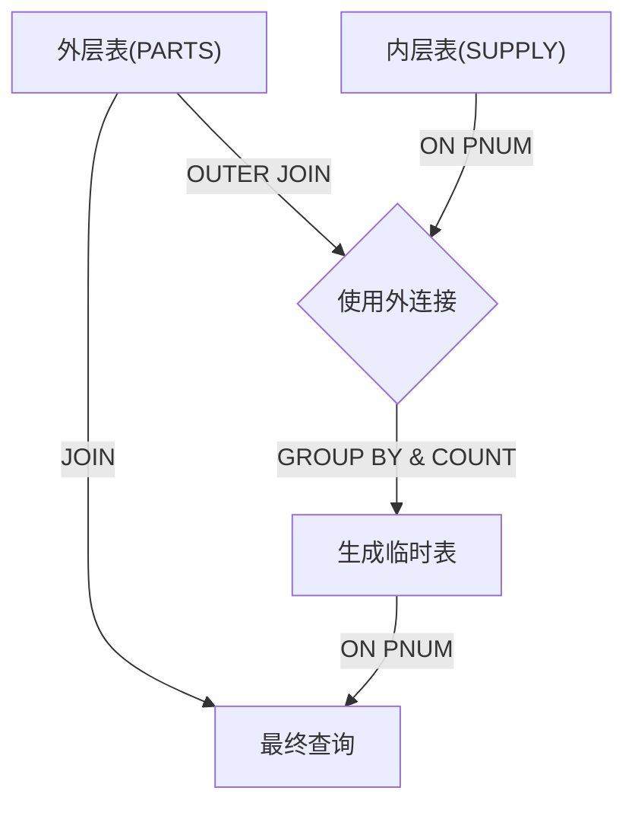
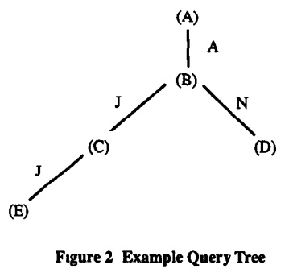
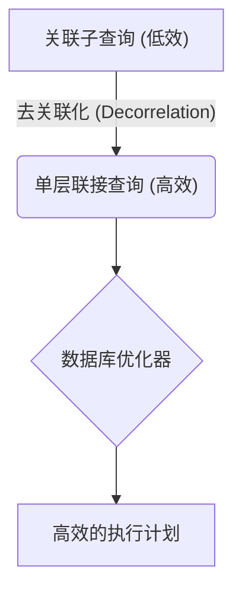

## AI论文解读 | Optimization Of Nested Sql Queries Revisited
        
### 作者        
digoal        
        
### 日期        
2025-10-04       
        
### 标签        
PostgreSQL , PolarDB , DuckDB , AI , 论文解读        
        
----        
        
## 背景  
      
https://dl.acm.org/doi/pdf/10.1145/38714.38723        
  
提示:          
```          
读懂《Optimization Of Nested Sql Queries Revisited》这篇论文需要提前掌握哪些基础知识, 请使用中文通熟易懂的讲解这些基础知识, 可以引用论文中的图、表或使用Markdown支持的图形(text,mermaid等)增加解释性. 
  
使用中文通熟易懂的解读《Optimization Of Nested Sql Queries Revisited》这篇论文, 其中的关键内容请着重讲解, 可以引用论文中的图、表或使用Markdown支持的图形(text,mermaid等)增加解释性. 
  
提取《Optimization Of Nested Sql Queries Revisited》这篇论文中的重要术语, 使用中文对这些术语进行通熟易懂的讲解, 可以引用论文中的图、表或使用Markdown支持的图形(text,mermaid等)增加解释性. 
```     
  
## 1 前置知识 
  
要读懂《Optimization Of Nested SQL Queries Revisited》（中文译名：《嵌套 SQL 查询优化再探》）这篇论文，您需要提前掌握以下几个核心的基础知识。这篇论文是基于 Won Kim 在 1982 年提出的嵌套查询优化算法进行的修正和扩展，因此理解其背后的关系数据库原理和查询优化理论至关重要。

-----

## 核心基础知识

### 1\. 关系数据库（RDB）和 SQL 基础

这篇论文通篇都在讨论如何优化 **SQL** 语言中的查询，因此需要对 SQL 及其背后的关系模型有扎实的理解。

| 概念 | 中文解释 | 在论文中的重要性 |
| :--- | :--- | :--- |
| **关系 (Relation) / 表 (Table)** | 数据库中的基本数据结构 。 | 论文中使用 **S** (供应商) ，**P** (零件) ，**SP** (供货)  等作为示例关系。|
| **元组 (Tuple) / 行 (Row)** | 表中的一条记录。 | 优化目标是减少对元组的重复访问和处理 。 |
| **属性 (Attribute) / 列 (Column)** | 表中的一个字段。 | 嵌套查询通常依赖于列之间的比较或聚合 。 |
| **SELECT-FROM-WHERE 结构** | SQL 查询语句的基本组成部分，即 **查询块 (Query Block)** 。 | 嵌套查询就是将一个查询块放入另一个查询块的 `WHERE` 子句中 。 |
| **聚合函数 (Aggregate Functions)** | 对一组值执行计算并返回单一值的函数，如 `MAX()`、`COUNT()`、`SUM()` 等 。 | **Type-JA** 这种最复杂的嵌套查询类型就涉及聚合函数 。 |

-----

### 2\. SQL 嵌套查询 (Nested Queries)

理解查询的“嵌套”结构是读懂论文的关键。

#### 嵌套结构

一个嵌套查询包含一个 **外层查询块 (Outer Query Block)** 和一个或多个 **内层查询块 (Inner Query Block)** 。

**论文示例 (1):** 查找供应零件 P2 的所有供应商名称 。

```sql
SELECT SNAME               -- 外层查询：选择 SNAME
FROM S
WHERE SNO IN              -- 嵌套谓词
      (SELECT SNO         -- 内层查询：选择 SNO
       FROM SP
       WHERE PNO='P2')
```

#### 关联性 (Correlation)

嵌套查询可分为：

  * **非关联子查询 (Non-correlated Subquery):** 内层查询不引用外层查询中的任何关系（表）。它可以独立执行一次，结果作为常量或列表传给外层。对应论文中的 **Type-A** 和 **Type-N** 。
  * **关联子查询 (Correlated Subquery):** 内层查询的 `WHERE` 子句中包含一个 **联接谓词 (Join Predicate)**，它引用了外层查询块中的关系 。内层查询**不能**独立执行。对应论文中的 **Type-J** 和 **Type-JA** 。

**论文关注点：** 论文主要关注 **关联子查询** 的优化，尤其是 **Type-JA**，因为它同时涉及**关联**和**聚合** 。

-----

## 查询优化理论和算法

论文的核心内容是**去关联化 (Decorrelation)** 技术，这需要理解数据库查询的执行方式和优化目标。

### 3\. 传统的低效执行方式：嵌套迭代 (Nested Iteration)

在 IBM 的 System R 数据库中，关联嵌套查询的传统处理方式是 **嵌套迭代 (Nested Iteration)** 。

**原理：** 对于外层查询返回的**每一个**元组，内层查询都会被**重新执行一次** 。

**问题：** 如果外层表有 $N$ 条记录，内层表有 $M$ 页，那么总的 I/O 成本可能高达 $N \times M$ ，效率极低 。

### 4\. 优化的核心：查询转换（去关联化）

为了提高效率，优化器的目标是把嵌套查询转化为一个逻辑上等价的、**不含嵌套的单层查询（Canonical Query）** 。

**转换逻辑 (NEST-N-J 算法):**
Kim 观察到，Type-N 和 Type-J 嵌套查询的语义等同于外层和内层关系之间的 **联接 (Join)** 操作 。

| 嵌套查询 (Q2)  | 等价的单层联接查询 (Q1)  |
| :--- | :--- |
| `SELECT R1.Ck FROM R1 WHERE R1.Ch IS IN (SELECT Rj.Cm FROM Rj)` | `SELECT R1.Ck FROM R1, Rj WHERE R1.Ch = Rj.Cm` |
| **语义**：在 R1 中查找 R1.Ch 属性值出现在 Rj.Cm 列表中的元组。| **语义**：直接将 R1 和 Rj 联接起来，联接条件为 R1.Ch = Rj.Cm。 |

通过这种转换（即 **去关联化**），原本只能通过低效嵌套迭代执行的查询，现在可以交给查询优化器，使用更高效的联接方法（如 **合并联接/归并联接 Merge Join**）来执行 。

### 5\. 关键工具：外联接 (Outer Join)

这篇论文的“再探”和修正主要集中在 **Type-JA** 嵌套查询的优化算法 **NEST-JA** 上的两个 **Bug** 。其中一个主要的修正依赖于理解 **外联接**。

#### 外联接的重要性 (解决 COUNT Bug)

当嵌套查询使用 `COUNT()` 聚合函数时，如果外层关系中存在某些元组在内层关系中**没有匹配项**，Kim 的原算法（使用普通内联接创建临时表）会丢失这些外层元组的信息 。

  * **内联接 (Inner Join)：** 只返回在两个表中都存在匹配的行。
  * **外联接 (Outer Join)：** 返回两个表中的所有行，对于没有匹配的行，另一个表的列用特殊的 **NULL** 值填充 。

**解决方案：** 论文提出，在创建用于聚合的**临时关系 (Temporary Relation)** 时，必须使用 **外联接** 操作 。这样，即使某个外层元组在内层表（经过筛选后）没有匹配项，它也会被保留在临时表中，其计数 (`COUNT`) 结果为 0 。

#### 其他基础修正点：

1.  **处理非等值联接谓词：** 当关联条件不是等号（如 `<` 或 `>`）时，原算法会出错。修正方法是：在创建临时表时使用原始的非等值联接操作，但在最终联接时，将原始查询中的联接谓词改为等号 。
2.  **处理外层重复元组：** 当外层表的联接列有重复值时（例如，`PNUM` 重复），如果直接使用外层表进行联接和计数，会导致计数结果偏高 。修正方法是：在创建临时表之前，先对外层表的联接列进行 **去重投影 (SELECT DISTINCT)** 。

### 6\. 成本对比（Cost Comparison）

理解这些优化算法的意义，还需要了解它们带来的性能提升。论文引用了 Kim 提出的成本分析，衡量标准是所需的 **页 I/O (Page I/O's)** 次数。

| 查询类型 | 嵌套迭代法 (Nested Iteration) (页 I/O)  | 转换 + 归并联接 (Merge Join) (页 I/O)  | 性能提升 |
| :--- | :--- | :--- | :--- |
| **Type-N** | 10,220 | 720 | 约 93% |
| **Type-J** | 10,120 | 550 | 约 94% |
| **Type-JA** | 3,050 | 615 | 约 80% |

**结论：** 掌握这些基础知识后，您就能理解论文为何要对 Kim 的算法进行修正，以及修正后提出的 **NEST-JA2 算法**  如何在保留高效转换思想的同时，解决了边界情况下的语义正确性问题。
  
## 2 解读论文 
  
好的，我们来通俗易懂地解读一下《Optimization of Nested SQL Queries Revisited》这篇经典的数据库查询优化论文。

这篇论文的核心思想是：**SQL中的嵌套查询（子查询）在很多数据库系统中的默认执行方式效率低下，我们可以通过一系列智能的“等价改写”方法，将其转换成更高效的连接（JOIN）查询，从而大幅提升查询性能。**

这篇论文建立在早期研究者 Won Kim 的工作之上，指出了 Kim 算法中的几个关键缺陷（Bug），并提出了更完善、更健壮的修正算法。

-----

### 核心解读

我们可以将这篇论文的讲解分为四个部分：

1.  **问题的根源：为什么嵌套查询会慢？**
2.  **前人的探索：Kim 的分类与改写算法**
3.  **论文的核心贡献：发现并修复 Kim 算法的 Bug**
4.  **终极方案：一个更通用、更强大的递归算法**

-----

#### 1\. 问题的根源：为什么嵌套查询会慢？

论文指出，传统数据库系统（如早期的 System R）在处理嵌套查询时，常常使用一种叫做 **“嵌套迭代” (Nested Iteration)** 的方法 。

我们可以把它理解为一个“暴力”的循环。以下面的查询为例：

```sql
-- 查询提供了数量大于100的零件的供应商名称
SELECT SNAME
FROM S
WHERE S.SNO IN (SELECT SP.SNO
                FROM SP
                WHERE SP.QTY > 100);
```

嵌套迭代的执行方式是：

1.  遍历外部查询的 `S` 表（供应商表）的 **每一行**。
2.  对于 `S` 表的每一行，都去 **完整地执行一次** 内部的子查询。
3.  判断当前 `S` 表的 `SNO` 是否在子查询返回的结果集里。

**缺点是什么？** 如果 `S` 表有10,000个供应商，那么内部的子查询（扫描 `SP` 表）就可能要被重复执行10,000次！。这显然是巨大的性能浪费。

-----

#### 2\. 前人的探索：Won Kim 的分类与改写算法

为了解决嵌套迭代的低效问题，Won Kim 在1982年提出了一套开创性的想法 ：**将嵌套查询改写为等价的连接查询**，然后交给查询优化器去选择最高效的连接算法（如归并连接 Merge Join），而不是死板地使用嵌套迭代 。

为了系统地进行改写，Kim 首先将嵌套查询分成了几类。这篇论文主要关注以下四种 ：

| 类型 | 描述 | 例子 |
| :--- | :--- | :--- |
| **Type-A** | 内层查询包含**聚合函数** (如`MAX`, `AVG`)，且**不依赖**外层查询的任何数据。 | `WHERE price = (SELECT MAX(price) FROM products)` |
| **Type-N** | 内层查询**不包含**聚合函数，也**不依赖**外层查询的数据。 | `WHERE product_id IN (SELECT id FROM products WHERE category = 'A')` |
| **Type-J** | 内层查询**不包含**聚合函数，但其`WHERE`子句中**包含与外层查询关联的条件**（Join Predicate）。 | `WHERE S.SNO IN (SELECT SP.SNO FROM SP WHERE SP.SNO = S.SNO)` |
| **Type-JA** | 内层查询**包含**聚合函数，并且其`WHERE`子句中也**包含与外层查询关联的条件**。这是最复杂的一种。 | `WHERE P.PNO = (SELECT MAX(SP.PNO) FROM SP WHERE SP.ORIGIN = P.CITY)` |

**Kim 的改写算法：**

  * **对于 Type-N 和 Type-J：** 改写很简单，可以直接将内外查询的 `FROM` 和 `WHERE` 子句合并，形成一个单一的 `JOIN` 查询（这个算法被称为 `NEST-N-J`） 。
  * **对于 Type-JA：** 改写比较复杂。Kim 的方法是先执行内层查询，将聚合结果存入一个**临时表**，然后再让外层查询与这个临时表进行连接（算法被称为 `NEST-JA`） 。

Kim 的方法在很多情况下能带来数量级的性能提升 。例如，在一个例子中，嵌套迭代需要 `10,120` 次页面I/O，而改写后的连接查询只需要 `550` 次 。

-----

#### 3\. 论文的核心贡献：发现并修复 Kim 算法的 Bug

这篇论文的作者 Ganski 和 Wong 在实践中发现，Kim 的 `NEST-JA` 算法虽然巧妙，但在某些场景下会出错。

##### Bug 1: COUNT 函数的 Bug 

当聚合函数是 `COUNT` 时，Kim 的算法会出错。

**问题场景**：假设我们要查询“库存量(QOH)等于其发货次数(COUNT)的零件”。

如果某个零件（比如PNUM=8）在发货表 `SUPPLY` 中没有任何记录，那么通过嵌套迭代的方式，内层的 `COUNT` 会正确地返回 `0` 。

但是，Kim 的 `NEST-JA` 算法在生成临时表时，只会处理那些在 `SUPPLY` 表中 *存在* 记录的零件。对于没有任何发货记录的零件`8`，它根本不会出现在临时表中。因此，最终结果里就会丢失这个本应被查询出来的零件`8`。**简而言之，Kim 的算法无法正确处理聚合结果为零的情况** 。

**解决方案：使用外连接 (Outer Join)** 

论文作者提出，在创建临时表时，使用 **外连接** 来代替内连接。



外连接的特性是，即使右表（`SUPPLY`）中没有匹配的记录，左表（`PARTS`）的记录依然会保留在结果中，对应的右表列会用 `NULL` 填充。这样，`COUNT(NULL)` 的结果是 `0`，就完美地解决了这个问题 。

##### Bug 2: 非等值连接的 Bug 

Kim 的算法只在内外层关联条件是“等于”(`=`)的时候才有效。如果关联条件是“小于”(`<`)、“大于”(`>`)等，就会出错 。

**问题场景**：查询“库存量等于**所有比自己零件号小的**零件的最大发货量”。
`WHERE QOH = (SELECT MAX(QUAN) FROM SUPPLY WHERE SUPPLY.PNUM < PARTS.PNUM)` 

Kim 的算法生成的临时表是按 `PNUM` 单独分组的，它只包含了每个零件自身的聚合信息，而没有包含“小于这个零件号的所有零件”这个范围的聚合信息 。

**解决方案：在创建临时表时就进行连接** 

作者提出的解决方法是，在创建临时表的 `FROM` 子句中，直接把内表和外表连接起来，并应用非等值条件。

  * **旧方法**：`FROM SUPPLY ... GROUP BY PNUM`
  * **新方法**：`FROM PARTS, SUPPLY WHERE SUPPLY.PNUM < PARTS.PNUM ... GROUP BY PARTS.PNUM` 

这样，临时表在计算聚合函数（如 `MAX`）时，就已经考虑了正确的关联范围，从而得到正确的结果。

##### Bug 3: 外层查询列存在重复值的 Bug 

当前面的修复方案应用后，又引入了一个新问题：如果外层表的关联列有重复值（比如 `PARTS` 表里有两条 `PNUM=3` 的记录），在使用 `COUNT`, `SUM`, `AVG` 等函数时，会导致计数被重复放大，结果再次出错 。

**解决方案：先去重再连接** 

最终的完美解决方案是，在创建临时表之前，先对 **外层表的关联列进行去重** (`SELECT DISTINCT PNUM FROM PARTS`)，得到一个不含重复值的中间表。然后，用这个去重后的中间表去和内表进行连接和聚合 。这就确保了每个独立的值只被计算一次。

-----

#### 4\. 终极方案：一个更通用、更强大的算法

基于以上所有的 Bug 修复，论文最终提出了一个健壮的、全新的 **`NEST-JA2` 算法** 。它整合了外连接、预连接、去重等所有技巧。

更进一步，对于任意复杂、多层嵌套的查询，作者提出了一个优雅的 **递归算法 `nest_g`** 。

这个算法的思路可以用下图（源自论文 Figure 2 ）来解释：   

```
      (A)
      / \
     A   N
    /     \
  (B)-----(D)
   |
   J
   |
  (C)
   |
   J
   |
  (E)
```

这个递归算法会像深度优先遍历一样，从最内层的查询块（如 `E`）开始处理：

1.  首先处理 `E` 和 `C` 的关系，将它们合并。
2.  然后处理合并后的 `C` 和 `B` 的关系。
3.  再处理 `D` 和 `B` 的关系。
4.  当所有依赖 `B` 的子查询都处理完后，`B` 本身就包含了所有下层的信息。此时再处理 `B` 和 `A` 的关系 。

这种从内到外、逐层“消化”和“上报”信息的方式，可以简洁而正确地处理任意深度的嵌套查询，特别是复杂的 `Type-JA` 嵌套 。

### 总结

《Optimization of Nested SQL Queries Revisited》这篇论文是一次非常精彩的“站在巨人肩膀上”的再创新。它：

1.  **肯定了 Won Kim 的核心思想**：将嵌套查询改写为连接是优化的正确方向。
2.  **指出了 Kim 算法的多个关键缺陷**：在处理 `COUNT`、非等值连接和重复值时的错误。
3.  **提出了精确而有效的解决方案**：巧妙地运用 **外连接**、**预连接** 和 **去重** 等技术，创建了更稳健的 `NEST-JA2` 算法。
4.  **提供了处理任意复杂度的通用框架**：通过一个递归算法，将单层查询的优化方法推广到了多层嵌套查询中。

这篇论文的成果深刻影响了现代数据库查询优化器的设计，我们今天能高效地执行复杂的 SQL 查询，背后就有这些经典算法的功劳。
  
## 3 术语 
  
您好！《Optimization Of Nested SQL Queries Revisited》（《嵌套 SQL 查询优化再探》）这篇论文是数据库查询优化领域的经典之作，它围绕着如何高效地执行复杂的 SQL 查询展开。

以下是从论文中提取的重要术语及其通俗易懂的中文解释：

-----

## 核心术语与概念

### 1\. 嵌套 SQL 查询 (Nested SQL Queries)

  * **中文解释：** 顾名思义，就是**查询中套着查询**。在 SQL 语句中，一个完整的 `SELECT-FROM-WHERE` 语句（被称为**查询块**）作为另一个查询块的条件或数据源出现。
  * **通俗理解：** 就像套娃一样，外层的查询需要依赖内层查询的结果才能完成。
  * **示例结构：**
    ```sql
    SELECT 姓名
    FROM 员工表 E
    WHERE E.部门ID IN (
        -- 这是内层嵌套查询块
        SELECT 部门ID
        FROM 部门表 D
        WHERE D.预算 > 100000
    );
    ```

-----

### 2\. 查询块 (Query Block)

  * **中文解释：** SQL 语句中的基本构成单元，通常指一个完整的 `SELECT...FROM...WHERE...` 结构。
  * **在论文中的作用：** 论文中讨论的嵌套查询优化，本质上就是将**多个查询块**（嵌套结构）转换成**一个或少数几个查询块**（非嵌套的联接结构）。

-----

### 3\. 关联子查询 (Correlated Subquery)

  * **中文解释：** 这是论文重点优化的对象。关联子查询是指内层查询块的执行**依赖于**外层查询块中当前正在处理的数据行。
  * **通俗理解：** 内层查询不能独立执行，它需要“借用”外层查询的某个值作为筛选条件，就像一个“定制化”的查询。
  * **低效原因：** 在传统的执行方式中，外层查询每处理一行数据，内层查询就必须重新执行**一次**。如果外层表有 10,000 行数据，内层查询就要执行 10,000 次，效率极低，被称为**嵌套迭代 (Nested Iteration)**。

-----

### 4\. 去关联化 / 查询转换 (Decorrelation / Query Transformation)

  * **中文解释：** 优化的核心思想。指将低效的**关联子查询**（需要重复执行）转换为**逻辑等价**的、高效的**联接 (Join)** 操作查询。

  * **优化目标：** 联接操作通常可以通过数据库索引、排序和高效算法（如**归并联接 Merge Join**）一次性完成，性能远高于重复执行子查询。

  * **转换示意图（Markdown Mermaid Graph）：**




-----

### 5\. Kim 的嵌套查询分类方案 (Kim's Classification Scheme)

这是 Kim (1982) 提出的、被这篇论文沿用的分类方法，它根据嵌套查询的**谓词类型**和**是否包含聚合函数**进行划分。

| 类型 | 包含的 SQL 谓词 | 是否包含聚合函数 | 优化难度 |
| :--- | :--- | :--- | :--- |
| **Type-N** | `IN` 或 `NOT IN` | 否 | 简单，转换为**内联接** |
| **Type-J** | `EXISTS` 或 `NOT EXISTS` | 否 | 较简单，转换为**内联接** |
| **Type-JA** | 带有比较的子查询（如 `> ALL`） | **是**（如 `MIN/MAX/AVG/COUNT`） | **最复杂**，论文修正的重点 |

#### 论文修正的焦点：Type-JA

Type-JA 是最具挑战性的类型，因为其优化涉及到聚合操作 (`COUNT`, `SUM` 等)。论文的核心工作就是修正 Kim 原始 NEST-JA 算法中处理 `COUNT` 和其他边界情况时的两个 **Bug**。

-----

### 6\. 外联接 (Outer Join)

  * **中文解释：** 联接操作的一种。它不仅返回两个表中匹配的行，还会保留**未匹配**的行，并在另一侧用 **NULL** 值填充。
  * **在论文中的重要性：** **外联接**是修正 NEST-JA 算法中 **COUNT Bug** 的关键。

#### COUNT Bug 及其修正：

当 Type-JA 嵌套查询使用 `COUNT()` 聚合函数时，如果外层查询的某个元组在内层查询中**没有匹配项**，它应该被计数为 **0**。

| 优化方法 | 结果 | 缺陷 |
| :--- | :--- | :--- |
| **原 NEST-JA 算法 (使用内联接)** | 直接丢失了没有匹配项的外层元组。 | `COUNT` 的聚合结果是 **NULL**，而不是 **0**，导致结果错误。 |
| **修正后的 NEST-JA2 算法 (使用外联接)**| 在联接外层表和内层聚合结果时使用**外联接**。| 保留了所有外层元组，未匹配的元组在聚合后自动被正确地计为 **0**。 |

因此，理解**外联接**如何保留不匹配的行，是理解这篇“再探”论文如何修复原算法缺陷的关键。
  
## 参考        
         
https://dl.acm.org/doi/pdf/10.1145/38714.38723    
        
<b> 以上内容基于DeepSeek、Qwen、Gemini及诸多AI生成, 轻微人工调整, 感谢杭州深度求索人工智能、阿里云、Google等公司. </b>        
        
<b> AI 生成的内容请自行辨别正确性, 当然也多了些许踩坑的乐趣, 毕竟冒险是每个男人的天性.  </b>        
      
#### [期望 PostgreSQL|开源PolarDB 增加什么功能?](https://github.com/digoal/blog/issues/76 "269ac3d1c492e938c0191101c7238216")
  
  
#### [PolarDB 开源数据库](https://openpolardb.com/home "57258f76c37864c6e6d23383d05714ea")
  
  
#### [PolarDB 学习图谱](https://www.aliyun.com/database/openpolardb/activity "8642f60e04ed0c814bf9cb9677976bd4")
  
  
#### [PostgreSQL 解决方案集合](../201706/20170601_02.md "40cff096e9ed7122c512b35d8561d9c8")
  
  
#### [德哥 / digoal's Github - 公益是一辈子的事.](https://github.com/digoal/blog/blob/master/README.md "22709685feb7cab07d30f30387f0a9ae")
  
  
#### [About 德哥](https://github.com/digoal/blog/blob/master/me/readme.md "a37735981e7704886ffd590565582dd0")
  
  

  
