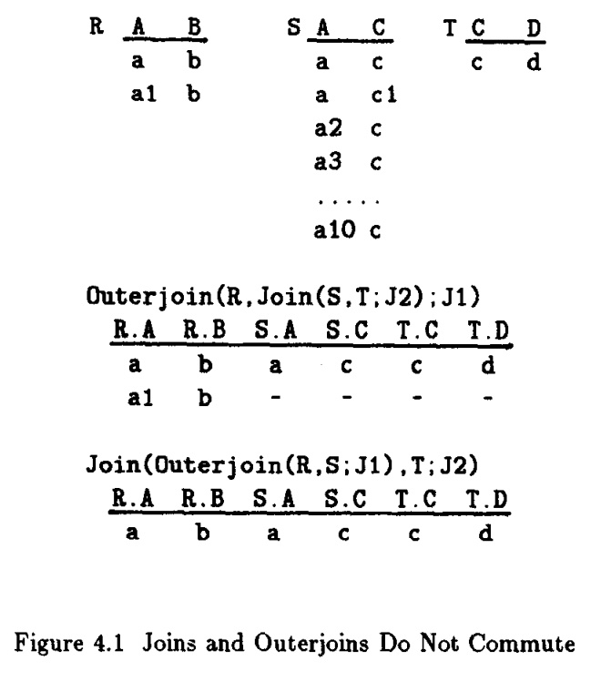
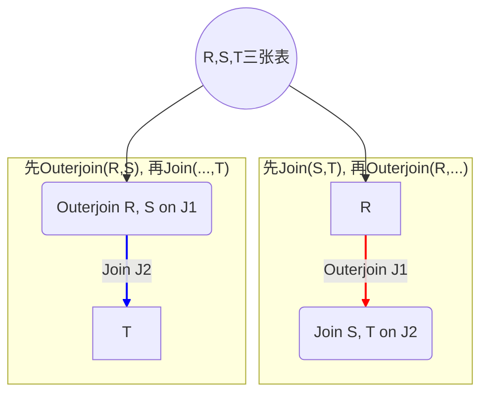
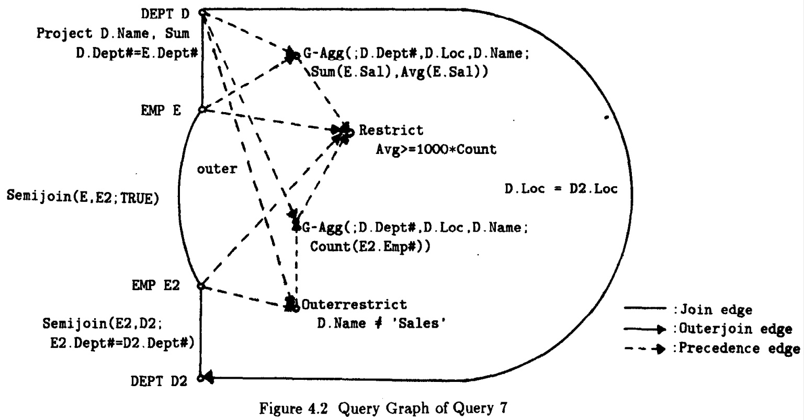
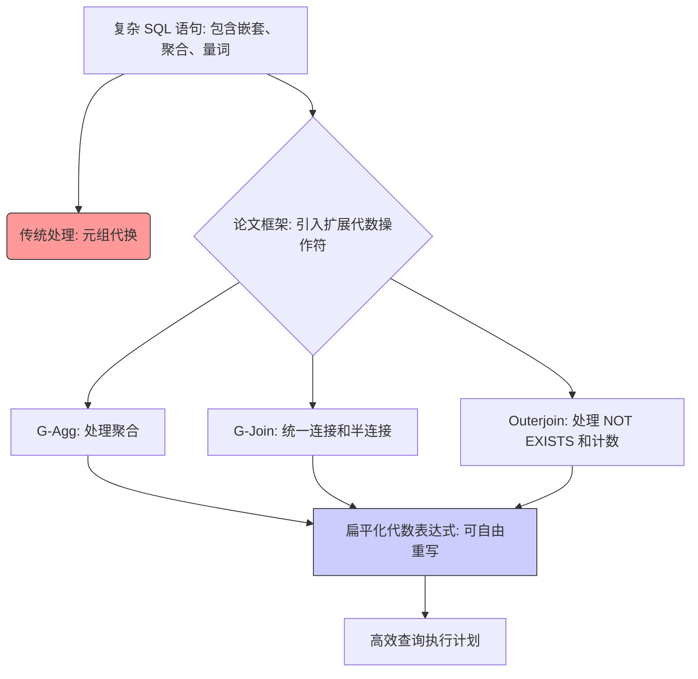

## AI论文解读 | A Unitied Approach To Processing Queries That Contain Nested Subqueries, Aggregates, And Quantifiers
        
### 作者        
digoal        
        
### 日期        
2025-10-04       
        
### 标签        
PostgreSQL , PolarDB , DuckDB , AI , 论文解读        
        
----        
        
## 背景  
      
https://www.vldb.org/conf/1987/P197.PDF        
  
提示:          
```          
读懂《A Unitied Approach To Processing Queries That Contain Nested Subqueries, Aggregates, And Quantifiers》这篇论文需要提前掌握哪些基础知识, 请使用中文通熟易懂的讲解这些基础知识, 可以引用论文中的图、表或使用Markdown支持的图形(text,mermaid等)增加解释性. 
  
使用中文通熟易懂的解读《A Unitied Approach To Processing Queries That Contain Nested Subqueries, Aggregates, And Quantifiers》这篇论文, 其中的关键内容请着重讲解, 可以引用论文中的图、表或使用Markdown支持的图形(text,mermaid等)增加解释性. 
  
提取《A Unitied Approach To Processing Queries That Contain Nested Subqueries, Aggregates, And Quantifiers》这篇论文中的重要术语, 使用中文对这些术语进行通熟易懂的讲解, 可以引用论文中的图、表或使用Markdown支持的图形(text,mermaid等)增加解释性. 
```     
  
## 1 前置知识 
  
要读懂《A Unified Approach To Processing Queries That Contain Nested Subqueries, Aggregates, And Quantifiers》（论文原标题为《Of Nests and Trees: A Unified Approach to Processing Queries That Contain Nested Subqueries, Aggregates, and Quantifiers》）这篇论文，您需要提前掌握**关系数据库理论**、**传统查询优化**的局限性，以及论文所引入的**扩展关系代数操作**。

这篇论文的核心在于，它提出了一种统一的代数框架，来高效处理 SQL 语言中那些难以用传统方式优化的复杂特性 。

以下是您需要掌握的基础知识点，并以通俗易懂的方式进行讲解：

---

## 基础知识一：关系代数与传统优化器的局限性

### 1. 关系数据库与基本操作
您需要理解**关系模型**（表、行、列）的基本概念，以及 SQL 查询背后的理论基础——**关系代数 (Relational Algebra, RA)**。

传统的关系代数主要由三种核心操作构成，这也是传统查询优化器（如 System R）重点关注的领域 ：

1.  **限制 ( Restrict, $\sigma$ )：** 过滤行，对应 SQL 的 `WHERE` 子句。
2.  **投影 ( Project, $\pi$ )：** 过滤列，对应 SQL 的 `SELECT` 列表。
3.  **连接 ( Join, $\bowtie$ )：** 合并两个表，对应 SQL 的 `FROM` 子句中的多表关联。

### 2. 传统处理方式的瓶颈：元组代换 (Tuple Substitution)
对于包含**嵌套子查询**（例如 `WHERE IN (SELECT...)`）的复杂 SQL 语句，传统的优化器处理能力有限 。它们通常采用一种低效的**过程式 (Procedural)** 方法，即 **元组代换**：

> **元组代换：** 针对外层查询的每一行数据（元组），系统都会代入到内层子查询中，并重新执行一遍内层查询。这相当于一种 **嵌套循环连接 (Nested Loop Join)** 。

这种处理方式在数据库分布式环境或数据量大时会**非常低效** 。论文的目的就是要将这些过程式的语义转换成更灵活的**代数操作**，从而能像处理简单连接查询一样进行优化。

---

## 基础知识二：扩展的关系代数操作

为了克服传统 RA 的限制，该论文引入了一系列新的或经过推广的代数操作符，这是理解论文的核心。

### 1. 处理嵌套子查询：半连接 (Semijoin)

**半连接**是处理 `WHERE IN` 这种**关联嵌套子查询 (Correlated Nested Subqueries)** 的关键操作。

| 对比项 | **连接 ( Join, $\bowtie$ )** | **半连接 ( Semijoin, $\ltimes$ )** |
| :--- | :--- | :--- |
| **作用** | 返回两个表中所有匹配的行，并将它们的列合并。 | **只返回左表 (R) 中** 与右表 (S) 有匹配的行。 |
| **结果宽度** | R 和 S 的所有列。 | **只有左表 (R) 的列。** |
| **重复问题** | 如果一个 R 元组匹配多个 S 元组，该 R 元组会在结果中**重复**出现多次。 | 结果中 R 的元组**最多出现一次**，避免了重复。 |

**图示与例子 (基于论文 Query 1 & 2 的概念)：**

假设您要查询“在丹佛有部门的员工姓名”。

* **原始嵌套查询（SQL 语义）：** 对于每个员工 E，检查 E 所在部门是否在“丹佛部门列表”中。
* **传统连接转换（Query 2）：** `EMP E JOIN DEPT D WHERE D.Loc='Denver'`。如果一个员工 E 匹配了 **两个** 位于丹佛的部门 D1 和 D2，则员工姓名将出现 **两次**。
* **半连接转换（Query 1 正确的代数表达）：** `EMP E Semijoin DEPT D WHERE D.Loc='Denver'`。该员工姓名 **只出现一次** 。

因此，理解**半连接**的非对称性（只保留左侧元组）和去重特性是掌握论文处理嵌套查询策略的基础 。

### 2. 处理聚合函数：广义聚合 (Generalized-Aggregation, G-Agg)

G-Agg 操作符用于统一处理 SQL 中的 **`GROUP BY`** 分组和 **聚合函数** (`SUM`, `AVG`, `COUNT` 等) 。

> **G-Agg(R; X; fnvector)**：将关系 R 按属性 **X** (分组属性) 进行**分区**，然后对每个分区应用 **fnvector** (聚合函数向量) 进行计算 。

理解 G-Agg，特别是它如何与连接操作进行**流水线式 (Pipelining)** 结合（例如在连接过程中完成分组和聚合计算），是论文提高聚合查询优化效率的关键 。

### 3. 处理量词与空集：外连接 (Outerjoin)

外连接（尤其是左外连接）是处理 SQL 中涉及 **`COUNT` 聚合函数** 和 **`NOT EXISTS` 量词** 时确保语义正确性的关键 。

* **问题所在：** 常规的连接会**删除**不匹配的元组。例如，如果一个部门 **没有** 任何员工，常规连接会将该部门元组删除，导致我们无法计算其员工数量（本应为 0）。
* **外连接的作用：** **外连接 (Outerjoin)** 会保留左表 (R) 中所有未匹配的元组，并用 **NULL 值** 填充右表 (S) 对应的属性列 。
* **案例：** 在计算部门的员工总数 (`COUNT(E.Emp#)`) 时，必须使用**左外连接**，这样没有员工的部门会保留下来，其 COUNT 计算结果才能为 0，而非被丢失 。

### 4. 高级统一：广义连接和广义限制 (Generalized-Join & Generalized-Restrict)

这篇论文的终极目标，是将常规连接、半连接、外连接等都视为 **广义连接 (G-Join)** 的特殊形式 。

> **G-Join** 和 **G-Restrict** 的引入，是为了让优化器在面对混合了常规连接和外连接的复杂查询时，能够更加自由地进行操作符的顺序调整（即**代数性质的交换律和结合律**），从而找到更优的执行计划 。

---

## 总结

您需要掌握的核心知识结构是：

| 知识领域 | 基础概念 | 论文扩展操作 | 解决的 SQL 难题 |
| :--- | :--- | :--- | :--- |
| **关系代数** | 限制 ( $\sigma$ )、投影 ( $\pi$ )、连接 ( $\bowtie$ ) | **半连接** ( $\ltimes$ ) | 嵌套子查询 (`IN`, `EXISTS`) |
| **查询优化** | 元组代换 (Nested Loop) | **广义聚合** (G-Agg) | 聚合函数 (`GROUP BY`, `SUM`, `AVG`) |
| **复杂语义** | 集合操作 | **外连接** / **广义连接** (G-Join) | 量词 (`NOT EXISTS`)、`COUNT` 聚合函数 |

理解这些扩展代数操作的**定义**和它们与传统操作的**转换规则**（如半连接如何转化为连接加去重投影 ），就能理解论文如何将复杂的 SQL 转换为一个统一、可优化的代数表达式 。
  
## 2 解读论文 
  
好的，我们来通俗易懂地解读这篇数据库领域的经典论文《Of Nests and Trees: A Unified Approach to Processing Queries That Contain Nested Subqueries, Aggregates, and Quantifiers》。

这篇论文于1987年发表在顶级数据库会议VLDB上 ，作者是Umeshwar Dayal 。它解决了一个核心问题：当时的数据库查询优化器只擅长处理简单的查询，但对于SQL语言中常见的复杂功能（如嵌套子查询、分组聚合、量词等）则显得力不从心，处理效率低下 。作者提出了一套统一的、基于代数运算的框架，极大地扩展了优化器处理复杂查询的能力。

-----

### 核心问题：传统优化器的“偏科”

想象一下，一个厨师只会“切、炒、煮”这三样基本功。对于一个简单的“炒青菜”他能做得很好。但如果菜单变得复杂，比如要求“做一道包含浓汤、需要精确控温慢炖、且顶部有酥皮的菜”，这位厨师可能就只会用他那三样基本功生搬硬套，做出来的东西味道和效率都会很差。

80年代的数据库查询优化器就像这位“偏科”的厨师。它们的核心能力是处理由 **限制（Restrict）、投影（Project）、连接（Join）** 这三种基本操作组成的查询 。对于简单的查询，例如：

```sql
SELECT E.Name
FROM EMP E, DEPT D
WHERE E.Dept# = D.Dept# AND D.Loc = 'Denver';
```

优化器可以很灵活地决定是先过滤（Restrict）`DEPT`表，还是先连接（Join）两张表，能找到很多高效的执行路径。

然而，对于包含以下复杂功能的SQL查询，优化器就显得非常局限：

  * **嵌套子查询** (Nested Subqueries, e.g., `WHERE col IN (SELECT ...)` )
  * **聚合函数** (Aggregates, e.g., `COUNT`, `SUM`, `AVG`) 和 `GROUP BY`
  * **量词** (Quantifiers, e.g., `EXISTS`, `ANY`, `ALL`)

当时，处理这些复杂查询的通用方法是**元组替换 (Tuple Substitution)** 。这相当于一种“暴力”解法：逐一取出外层查询的每一行（元组），然后把它的值代入内层子查询去执行一遍 。这种方法非常机械，尤其是在分布式数据库中，如果内外层查询的表分布在不同的服务器上，这种来回代入执行的方式会带来巨大的网络开销，效率极低 。

### 论文的核心思想：一套统一的“高级厨具”

作者Umeshwar Dayal认为，不应该为每一种复杂查询都设计一个“小技巧”，而是应该从根本上升级优化器的“工具箱”。他提出了一系列新的、更强大的代数算子（可以理解为“高级厨具”），将所有复杂的SQL查询都转换成由这些新算子组成的内部表达式 。

这样一来，优化器就有了一个统一的视角来审视整个复杂查询，而不是一块一块地孤立处理。它可以在一个更大的范围内进行全局优化，比如调整这些“高级操作”的顺序，从而找到前所未有的高效执行计划 。

-----

### 关键内容深度解析

#### 1\. 处理嵌套子查询：引入 `Semijoin` (半连接)

对于 `IN` 或 `EXISTS` 引导的嵌套子查询，如果简单地将其改写成 `Join` (连接)，可能会得到错误的结果。

**例子**：查询所有在丹佛（Denver）有部门的员工姓名。

  * **原始嵌套查询 (Query 1)** ：
    ```sql
    SELECT E.Name
    FROM EMP E
    WHERE E.Dept# IN (SELECT D.Dept# FROM DEPT D WHERE D.Loc = 'Denver');
    ```
  * **错误的 `Join` 改写**：如果一个员工所在的部门在`DEPT`表中有多个满足条件的记录（比如一个部门有多个经理记录），那么`Join`之后这个员工的姓名会出现多次，而`IN`的语义是只出现一次 。

**解决方案**：引入 `Semijoin` (半连接) 算子 。

  * **定义**： $R \ltimes_J S$ (R Semijoin S on J) 的结果是R中那些至少存在一个S中的元组能满足连接条件J的元组集合 。
  * **通俗理解**：对于`R`表中的每一行，`Semijoin`只是去`S`表中“看一眼”，只要找到**至少一个**匹配的行，就把`R`表自己的这一行保留下来，然后就继续检查`R`的下一行。它不会因为`S`表里有多个匹配项而复制`R`的行 。
  * **优势**：`Semijoin` 精确地表达了 `IN` 和 `EXISTS` 的语义，并且可以像 `Join` 一样，使用多种高效的实现算法（如排序合并），而不再局限于低效的元组替换 。

#### 2\. 处理聚合查询：三大新算子

这是论文最核心的创新之处。作者引入了三个广义算子来处理带聚合的复杂查询。

**A. `G-Agg` (Generalized Aggregation - 广义聚合)**
这个算子是对SQL中 `GROUP BY` 和 `COUNT()`, `SUM()`, `AVG()` 等聚合函数的直接代数抽象 。它的作用是：

1.  根据分组属性（GROUP BY的列）将数据分区（分组成多个小组）。
2.  对每个小组内的元组应用聚合函数，计算出结果 。

一个重要的优化技巧是**流水线 (Pipelining)**：如果`G-Agg`之前的`Join`操作，其输出结果的排序/分组方式正好是`G-Agg`所需要的，那么聚合计算就可以在Join输出的同时“流式”进行，无需等待Join全部完成再存储中间结果，大大提升了效率 。

**B. `Outer Join` (外连接) 与 “Count Bug”**
在处理带有`COUNT`聚合的嵌套查询时，会出现一个著名的问题——“Count Bug” 。

**例子**：查询预算小于等于其员工平均工资1000倍的部门。但如果聚合函数是`COUNT`（统计员工数量），例如“统计员工数量为0的部门”。

  * 如果使用普通`Join` (内连接)，那些没有任何员工的部门在一开始连接时就会被过滤掉，导致最终结果遗漏了这些“员工数为0”的部门 。
  * **解决方案**：使用 `Outer Join` (外连接)。外连接会保留主表（如DEPT）中所有记录，即使在另一个表（EMP）中找不到匹配项，也会用NULL值填充，从而保证了信息不丢失 。

**C. `G-Join` (Generalized Join - 广义连接)**
引入`Outer Join`后，又带来一个新问题：`Outer Join` 和普通`Join` 的执行顺序不能随意交换，否则会影响结果 。这限制了优化器的选择空间。

下面的例子（改编自论文图4.1）展示了这种不等价性：   



*上图中，两种不同的执行顺序会产生完全不同的结果。*

**终极解决方案**：引入`G-Join` (广义连接) 。

  * **定义**：`G-Join` 是一个统一了普通`Join`和`Outer Join`的更通用算子。它有一个额外的“保留属性集”参数 。
      * 当保留属性集为空时，它就是普通`Join`。
      * 当保留属性集为外层关系的所有属性时，它就是`Outer Join` 。
  * **巨大优势**：通过将所有连接操作都视为`G-Join`，论文推导出了一套规则，使得优化器可以**合法地交换不同`G-Join`的顺序** 。这就像给了厨师一把“万能魔铲”，让他可以自由组合“煎炒”和“慢炖”的顺序，从而找到最佳烹饪流程。这极大地扩展了优化器的策略空间 。

同时，论文也定义了`G-Restrict` (广义限制)，与`G-Join`相对应 。

#### 3\. 处理量词：`EXISTS` 和 `NOT EXISTS`

论文巧妙地将量词查询也统一到了这个框架中。

  * `EXISTS`：等价于`Semijoin`，处理方式同上 。
  * `NOT EXISTS`：这比较棘手。论文提出可以将其看作一种特殊的聚合操作。
    1.  引入两个新的布尔型聚合函数：`EXISTS()` 和 `NOTEXISTS()` 。
    2.  `NOT EXISTS`查询可以通过 `Outer Join` 实现：先将外层表与内层表进行`Outer Join`，对于那些外层表有数据，但内层表匹配为NULL的行，就意味着“不存在”匹配 。
    3.  然后使用 `G-Agg` 算子和 `NOTEXISTS()` 函数对连接结果进行分组聚合，判断是否存在匹配 。

通过这种方式，`NOT EXISTS`查询的处理也被完美地融入了`G-Join`和`G-Agg`的统一框架中。

#### 4\. 查询图 (Query Graph)

为了让优化器能够“看懂”和操作这些复杂查询，论文扩展了查询图的表示方法 。查询图是查询的一种图形化表示，节点代表关系（表），边代表连接或半连接。

论文对查询图的扩展包括 ：

  * **有向边**：表示非对称的 `Outer Join` 。
  * **特殊节点**：表示 `G-Agg` 或 `G-Restrict` 操作 。
  * **优先边 (Precedence edges)**：表示不同操作之间的执行先后约束 。

下图是论文中一个复杂查询（Query 7）的查询图（图4.2 ）的示意性描述：   

  * 它包含了`Join`边（实线）、`Outerjoin`边（三角形箭头）、`Semijoin`以及多个`G-Agg`和`Restrict`节点。
  * 这些节点和边通过优先边（虚线）连接，定义了它们之间复杂的依赖关系。

这个复杂的图谱就是优化器的“作战地图”，优化器可以基于这张地图，运用论文提出的新规则和新算子，去探索各种可能的、高效的执行路径。

-----

### 论文的贡献与意义

1.  **统一的框架**：最大的贡献是为看似毫无关联的多种复杂SQL功能（嵌套、聚合、量词）提供了一个统一的代数处理框架 。这让查询优化器的设计变得更加优雅和强大。
2.  **极大扩展了优化策略空间**：通过引入`G-Join`等新算子并定义其代数性质，使得优化器可以考虑的执行计划排列组合数量剧增，从而更有可能找到最优或接近最优的执行方案 。
3.  **奠定理论基础**：这篇论文提出的思想影响深远，为后续的关系型数据库、并行数据库乃至大数据查询引擎（如Spark SQL）的查询优化技术奠定了坚实的理论基础。

总而言之，这篇论文通过一套创新的代数算子，成功地将SQL中各种复杂的查询“驯服”，并纳入到一个统一的优化框架中，让数据库优化器从一个只会几样基本功的“厨师”，成长为一位能够驾驭各种高级工具、创造性地设计复杂菜肴的“烹饪大师”。
  
## 3 术语 
  
这篇论文《Of Nests and Trees: A Unified Approach to Processing Queries That Contain Nested Subqueries, Aggregates, and Quantifiers》是查询优化领域的一篇经典之作，它旨在解决传统数据库系统在处理复杂 SQL 查询时的核心效率问题。

以下是论文中的重要术语及其通俗易懂的中文讲解：

-----

## 一、 传统查询的局限性 (The Problem)

### 1\. RPJ 查询 (Restrict-Project-Join Queries)

  * **英文原词：** Restrict-Project-Join Queries
  * **中文解释：** **限制-投影-连接查询**。
  * **通俗讲解：** RPJ 查询指的是最基本的 SQL 查询，只包含 **WHERE (限制)**、**SELECT (投影)** 和 **FROM (连接)** 操作。传统的关系代数和查询优化器主要就是为这类简单查询设计的。你可以把它们想象成数据库世界里的“四则运算”，优化器处理起来得心应手。

### 2\. 元组代换 (Tuple Substitution)

  * **英文原词：** Tuple Substitution
  * **中文解释：** **元组代换**（或译作元组替换）。
  * **通俗讲解：** 这是传统优化器处理**关联嵌套子查询 (Correlated Nested Subqueries)** 时最常用、但也**最慢**的方法。
      * **什么是关联嵌套子查询？** 比如 `SELECT name FROM Employee E WHERE E.DeptID IN (SELECT DeptID FROM Department WHERE Location = E.City)`。内层的查询依赖于外层查询的每一行数据（`E.City`）。
      * **代换机制：** 对于外层查询（Employee 表）的**每一行元组**，系统都会将其值代入到内层子查询中，并**重新执行**一次内层查询。
      * **效率问题：** 这相当于一个低效的**嵌套循环**。如果外层查询有 $N$ 行，内层查询复杂度为 $C$ ，总复杂度就是 $N \times C$ 。当 $N$ 很大时，效率非常低下。论文的重点就是用代数方法取代这种过程式（Procedural）的代换。

## 二、 统一操作符：代数扩展 (The Algebraic Extensions)

为了将复杂 SQL 转换为可优化的代数形式，论文引入了新的或推广了现有的关系代数操作符。

### 3\. 广义聚合操作符 (Generalized-Aggregate, G-Agg)

  * **英文原词：** Generalized-Aggregate (G-Agg) Operator
  * **通俗讲解：** SQL 中处理 `GROUP BY` 和 `SUM`, `COUNT`, `AVG` 等聚合函数的操作符。
      * **“广义”的意义：** 它将**分组**和**聚合计算**这两种功能合并成一个单一的代数操作符。这使得优化器可以更灵活地移动和重写包含聚合函数的查询，例如，可以在连接（Join）之前或之后进行聚合，寻找最优的执行顺序。

### 4\. 外连接 (Outerjoin)

  * **英文原词：** Outerjoin (尤其是 Left Outerjoin)
  * **通俗讲解：** 传统连接只保留两个表中**匹配的**行。外连接则会保留左表 (Left) 或右表 (Right) 中**未匹配的**行，并用 **空值 (NULL)** 来填充右边对应的列。
      * **重要性：** 外连接是处理 SQL 中**量词 (Quantifiers)** 和**计数聚合 (Counting Aggregates)** 的关键。
      * **案例：** 计算**每个**部门的员工数。如果一个部门没有员工，常规连接会直接丢弃这个部门。但使用**左外连接**，这个部门会被保留，员工字段用 NULL 填充。然后对员工字段进行 `COUNT` 聚合时，结果才是正确的 **0**。

### 5\. 广义连接操作符 (Generalized-Join, G-Join)

  * **英文原词：** Generalized-Join (G-Join) Operator
  * **通俗讲解：** G-Join 是一个**统一的**连接操作符，它把传统连接（Join）、半连接（Semijoin）和外连接（Outerjoin）等多种连接形式都纳入其中。
      * **目标：** 通过一个统一的代数框架，允许优化器在处理包含嵌套、聚合、量词等各种特性的复杂查询时，能够像处理简单连接一样，自由地运用**结合律**和**交换律**来调整执行顺序。

### 6\. 半连接与反半连接 (Semijoin and Anti-Semijoin)

  * **英文原词：** Semijoin and Anti-Semijoin
  * **通俗讲解：** 这是一对特殊连接，它们在处理嵌套子查询时非常高效：
      * **半连接 ( $\ltimes$ )：** 用于处理 `WHERE EXISTS` 或 `WHERE IN`。它只返回**左表**中与右表**有匹配**的元组。关键在于它**不重复**，且只返回左表的列。
          * **SQL 对应：** `SELECT E.* FROM Employee E WHERE E.DeptID IN (SELECT DeptID FROM Department)`
      * **反半连接 ( $\triangleright$ )：** 用于处理 `WHERE NOT EXISTS` 或 `WHERE NOT IN`。它只返回**左表**中与右表**没有匹配**的元组。

## 三、 统一框架的核心技术 (Core Techniques)

### 7\. 查询树和巢式查询树 (Query Trees and Nested Query Trees)

  * **英文原词：** Query Trees and Nested Query Trees
  * **通俗讲解：**
      * **查询树 (Query Tree)：** 数据库将 SQL 语句转换为一种树状结构来表示执行逻辑。
      * **巢式查询树 (NQT)：** 这篇论文提出的概念，用于表示复杂的、包含嵌套子查询的 SQL 结构。子查询被表示为父查询树节点下的**子树**。
      * **转换目标：** 论文的目标是将这种**嵌套的结构**（NQT）通过引入 G-Join 和 G-Agg 等操作符，转换为一个**更平坦**的、类似于 RPJ 查询的代数表达式，从而方便优化。

### 8\. 量词 (Quantifiers)

  * **英文原词：** Quantifiers
  * **通俗讲解：** 指 SQL 中的逻辑判断词，主要是 `EXISTS`（存在）和 `NOT EXISTS`（不存在）。
      * **重要性：** 量词本质上是集合比较操作。在论文的框架中，`EXISTS` 通过 **半连接** 映射实现，而 `NOT EXISTS` 则通过 **反半连接** 或 **外连接** 结合聚合（`COUNT` 等于 0）来实现。通过这些代数操作符，可以将量词判断转化为高效的集合操作，避免低效的元组代换。

-----

### **框架示意图 (概念性)**

可以将论文的贡献理解为一个**统一化和扁平化**的过程：


  
## 参考        
         
https://www.vldb.org/conf/1987/P197.PDF    
        
<b> 以上内容基于DeepSeek、Qwen、Gemini及诸多AI生成, 轻微人工调整, 感谢杭州深度求索人工智能、阿里云、Google等公司. </b>        
        
<b> AI 生成的内容请自行辨别正确性, 当然也多了些许踩坑的乐趣, 毕竟冒险是每个男人的天性.  </b>        
      
#### [期望 PostgreSQL|开源PolarDB 增加什么功能?](https://github.com/digoal/blog/issues/76 "269ac3d1c492e938c0191101c7238216")
  
  
#### [PolarDB 开源数据库](https://openpolardb.com/home "57258f76c37864c6e6d23383d05714ea")
  
  
#### [PolarDB 学习图谱](https://www.aliyun.com/database/openpolardb/activity "8642f60e04ed0c814bf9cb9677976bd4")
  
  
#### [PostgreSQL 解决方案集合](../201706/20170601_02.md "40cff096e9ed7122c512b35d8561d9c8")
  
  
#### [德哥 / digoal's Github - 公益是一辈子的事.](https://github.com/digoal/blog/blob/master/README.md "22709685feb7cab07d30f30387f0a9ae")
  
  
#### [About 德哥](https://github.com/digoal/blog/blob/master/me/readme.md "a37735981e7704886ffd590565582dd0")
  
  

  
