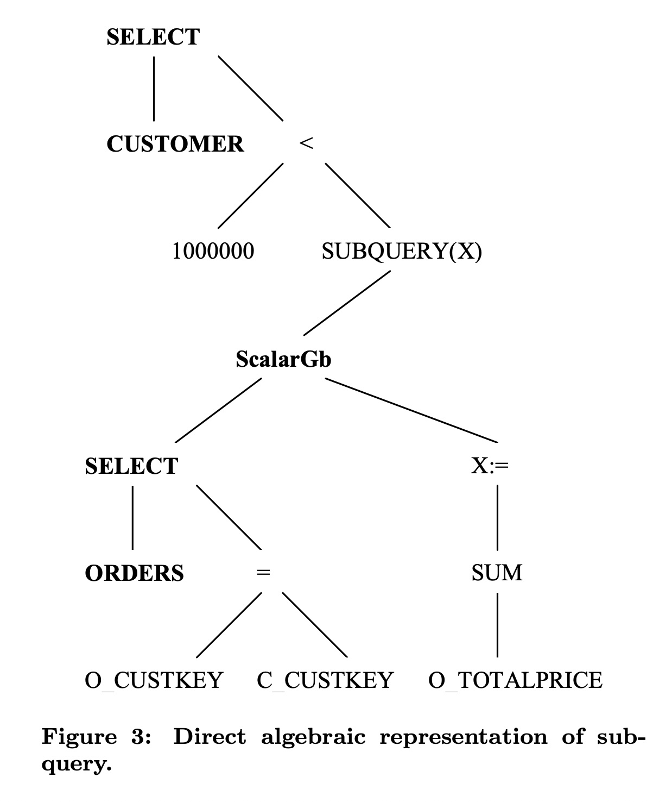
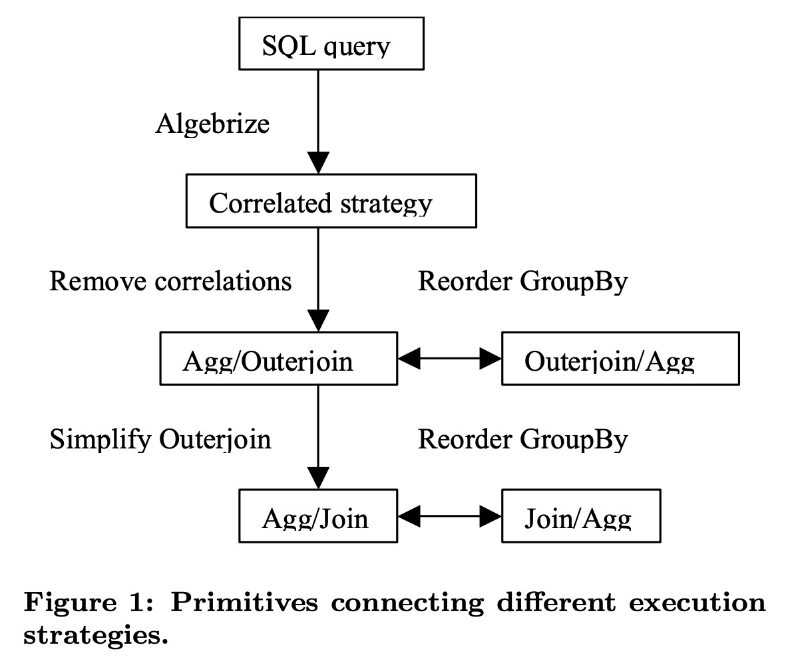
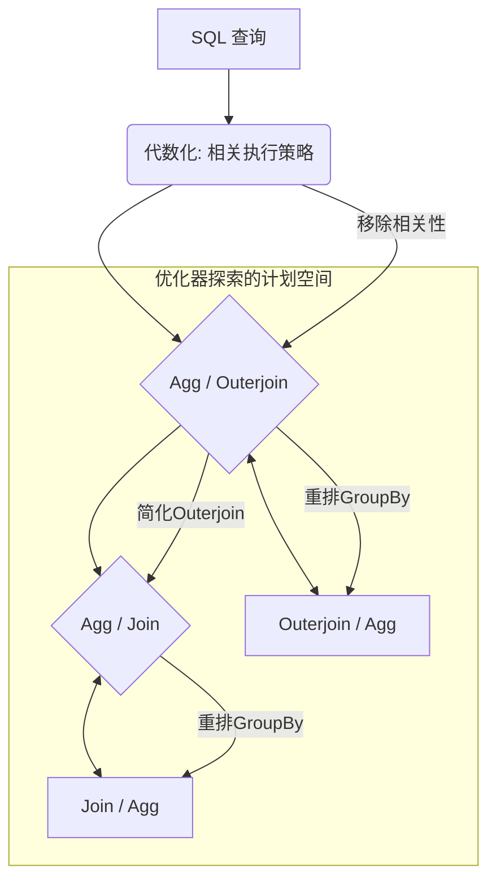
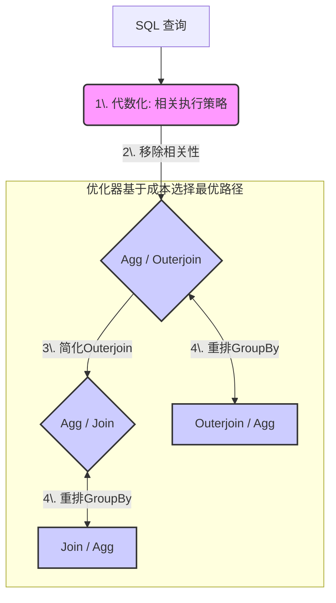
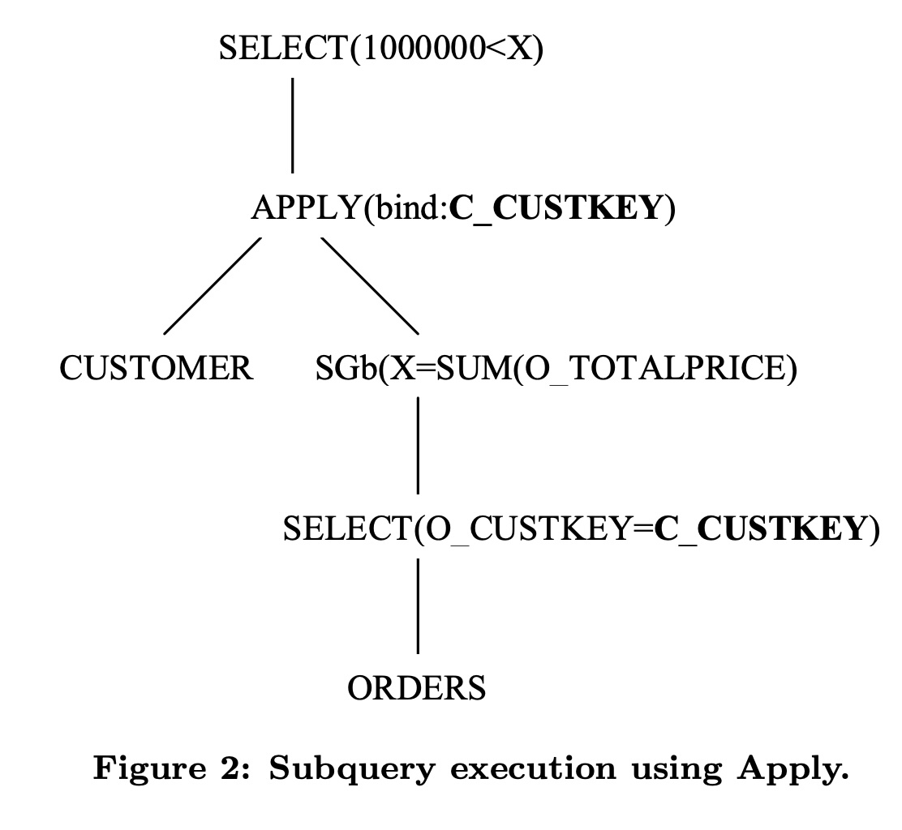
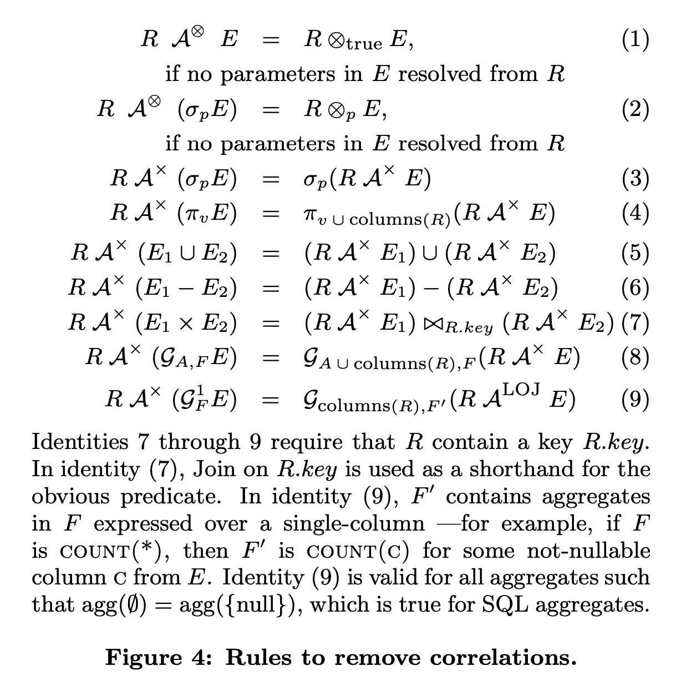
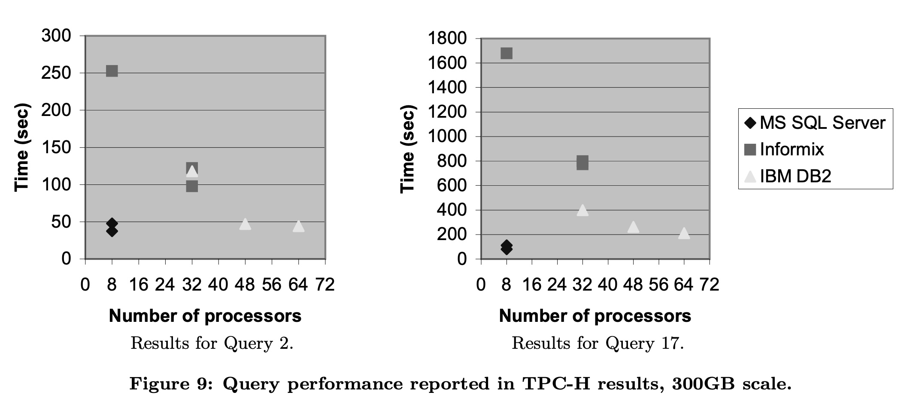

## AI论文解读 | Orthogonal Optimization Of Subqueries And Aggregation
        
### 作者        
digoal        
        
### 日期        
2025-10-05        
        
### 标签        
PostgreSQL , PolarDB , DuckDB , AI , 论文解读        
        
----        
        
## 背景  
      
https://www.cse.iitb.ac.in/infolab/Data/Courses/CS631/2005/Project/ref/orthOptOfSubQueriesp571galindolegaria.pdf        
  
提示:          
```          
读懂《Orthogonal Optimization Of Subqueries And Aggregation》这篇论文需要提前掌握哪些基础知识, 请使用中文通熟易懂的讲解这些基础知识, 可以引用论文中的图、表或使用Markdown支持的图形(text,mermaid等)增加解释性. 
  
使用中文通熟易懂的解读《Orthogonal Optimization Of Subqueries And Aggregation》这篇论文, 其中的关键内容请着重讲解, 可以引用论文中的图、表或使用Markdown支持的图形(text,mermaid等)增加解释性. 
  
提取《Orthogonal Optimization Of Subqueries And Aggregation》这篇论文中的重要术语, 使用中文对这些术语进行通熟易懂的讲解, 可以引用论文中的图、表或使用Markdown支持的图形(text,mermaid等)增加解释性. 
```     
  
## 1 前置知识 
  
好的，为了帮助您更好地理解《Orthogonal Optimization of Subqueries and Aggregation》这篇经典的数据库查询优化论文，我将为您梳理和讲解需要预先掌握的核心基础知识。

这篇论文的核心思想是，不应该为子查询和聚合操作设计孤立、庞大的优化策略，而应该将复杂的优化问题分解为一系列微小、独立、可重用的“正交”优化原语（primitives）。通过组合这些小原语，查询优化器可以灵活地生成一个非常丰富的、高效的执行计划空间，并利用成本估算从中选择最优方案。

要读懂这套方法，您需要掌握以下几个方面的基础知识：

-----

### 1\. 关系代数 (Relational Algebra) 与查询操作符树

这是理解任何查询优化论文的基石。关系数据库在内部并不直接处理SQL文本，而是先将其“代数化”，转换成由一系列操作符（Operators）组成的树状逻辑结构。

  * **什么是关系代数？**
    它是处理关系（即表）的一套形式化语言。基本的操作符包括：

      * **选择 ( Select, $\sigma$ )**: 过滤行，相当于SQL中的 `WHERE` 子句。
      * **投影 ( Project, $\pi$ )**: 选择列，相当于SQL中的 `SELECT <column_list>`。
      * **连接 ( Join, $\Join$ )**: 合并两个关系，例如内连接、外连接等。
      * **并 ( Union, $\cup$ )**、**差 (Difference, -)** 等集合操作。

  * **什么是操作符树？**
    一个查询可以被表示为一棵树，叶子节点是表，中间节点是关系代数操作符，数据流从叶子节点向根节点流动。例如，论文中图3就展示了一个初步代数化后的操作符树 。   

    **论文中的例子**:

    ```text
        SELECT (根节点: 最终操作)
          |
          < (一个标量比较操作)
         / \
    1000000 SUBQUERY(X) (子查询，其本身也是一棵树)
              |
            ScalarGb (标量聚合)
              |
             ...
    ```

    查询优化的过程，本质上就是对这棵树进行等价变换（比如交换两个操作符的位置），生成一棵执行成本更低的新树。

-----

### 2\. SQL子查询，尤其是相关子查询 (Correlated Subquery)

这篇论文要解决的核心问题之一就是如何高效处理子查询。

  * **普通子查询**: 子查询只执行一次，其结果被外层查询使用。

  * **相关子查询**: 这是优化的难点。子查询的执行依赖于外层查询当前处理的每一行数据 。可以将其理解为一个嵌套循环。

    **论文中的核心例子 (Q1)**:

    ```sql
    SELECT C_CUSTKEY
    FROM CUSTOMER
    WHERE 1000000 <
      (SELECT SUM(O_TOTALPRICE)
       FROM ORDERS
       WHERE O_CUSTKEY = C_CUSTKEY) -- 这里的 C_CUSTKEY 来自外层的 CUSTOMER 表
    ```

    对这个查询最直观的“相关执行” (Correlated execution) 方式是 ：

    1.  从 `CUSTOMER` 表中取出**一行**。
    2.  将这一行的 `C_CUSTKEY` 值代入子查询。
    3.  **为这一行**执行一次子查询，计算总金额。
    4.  用计算结果与 `1000000` 比较，判断该行是否保留。
    5.  回到步骤1，处理 `CUSTOMER` 表的**下一行**，直到所有行处理完毕。

    这种逐行处理的方式在 `CUSTOMER` 表很大时效率极低。论文的目标就是要把这种“循环”逻辑变成“面向集合”的、更高效的操作。

-----

### 3\. Join 操作 (内连接、外连接、半连接)

将子查询“解关联”(decorrelation) 或“扁平化”(flattening) 的主要手段就是将其转换为等价的Join操作。

  * **内连接 (Inner Join)**: 只保留两边表中能匹配上的行。

  * **左外连接 (Left Outer Join)**: 保留左边表的所有行，即使在右边表中没有匹配。对于没有匹配的行，右边表的列会用 `NULL` 填充 。

  * **半连接 (Semi-Join)**: 返回左表中那些在右表中有匹配的行。常用于优化 `EXISTS` 子句。

  * **反半连接 (Anti-Semi-Join)**: 返回左表中那些在右表中**没有**匹配的行。常用于优化 `NOT EXISTS` 子句。

    **与论文的联系**:
    论文中提出的一种经典“解关联”策略就是将 `Q1` 查询改写为**先外连接，再聚合**的形式 。

    ```sql
    SELECT C_CUSTKEY
    FROM CUSTOMER LEFT OUTER JOIN ORDERS
      ON O_CUSTKEY = C_CUSTKEY
    GROUP BY C_CUSTKEY
    HAVING 1000000 < SUM(O_TOTALPRICE)
    ```

    理解**为什么这里必须用外连接**至关重要：原始的相关子查询语义是，即使某个客户没有任何订单，子查询的 `SUM` 也会返回一个 `NULL` 值 。如果用内连接，这些没有订单的客户会直接被过滤掉，导致查询结果不一致。

-----

### 4\. SQL聚合操作 (Aggregation)

聚合是论文的另一个核心主题。

  * **向量聚合 (Vector Aggregation)**: 这是最常见的聚合，即带有 `GROUP BY` 子句的聚合 。它根据分组列将输入数据分成多个组，然后对每个组计算聚合函数。如果输入为空，结果也为空 。

  * **标量聚合 (Scalar Aggregation)**: 不带 `GROUP BY` 子句的聚合 。它将整个输入表视为一个组，并且**总是返回一行** 。例如，即使 `ORDERS` 表为空，`SELECT SUM(O_TOTALPRICE) FROM ORDERS` 也会返回一行，其值为 `NULL` 。这个特性是理解子查询转换的关键。

    **与论文的联系**:
    论文强调了高效处理聚合的重要性。一个核心的优化技术是**聚合重排 (Reorder GroupBy)**，即在满足一定条件下，可以将聚合操作移动到Join操作之前或之后 。

      * **先聚合再Join**: 可以大幅减少参与Join的数据量，从而提高效率。
      * **先Join再聚合**: 在某些情况下（例如Join的选择性非常高），可能反而更优。

-----

### 5\. 查询优化器 (Query Optimizer) 的基本概念

最后，您需要理解数据库是如何“思考”的。

  * **执行计划 (Execution Plan)**: 对于一个SQL查询，数据库可以有多种执行方式，每一种方式就是一个执行计划。例如，Join可以用嵌套循环、哈希连接或归并连接等算法实现。
  * **成本估算 (Cost Estimation)**: 优化器会根据表的统计信息（如行数、数据分布等）估算每种执行计划的“成本”（通常是CPU和I/O的综合指标），然后选择成本最低的那个计划 。
  * **语法独立性 (Syntax-Independence)**: 这是一个理想目标。即使用户用不同的SQL写法表达了相同的逻辑，优化器也应该能聪明地为它们生成同一个最高效的执行计划 。这篇论文的方法正是为了实现这一点。

**论文核心流程图 (基于图1)** :    




这张图清晰地展示了论文的思想：从一个初始的、低效的“相关策略”出发，通过一系列“正交”的变换（如移除相关性、简化外连接、重排GroupBy），优化器可以探索出多种等价的、可能更高效的执行策略（如 `Agg/Join`, `Join/Agg` 等），并基于成本选择最优的一个 。


### 总结

在阅读这篇论文前，请确保您对以下问题有清晰的认识：

1.  数据库如何用**操作符树**来表示一个查询？
2.  **相关子查询**为什么是性能瓶颈？它的“逐行处理”语义是怎样的？
3.  为什么**外连接 (Outer Join)** 是将相关子查询转换为集合操作的关键？它如何处理不匹配的行？
4.  **聚合操作**如何影响数据量？为什么移动聚合操作的位置（与Join交换）是一种重要的优化手段？
5.  查询优化器的终极目标是什么？（**基于成本选择最优执行计划**）

掌握了这些基础知识后，您就能更好地理解论文中提出的 `Apply` 操作符、`SegmentApply` 操作符以及各种变换规则的动机和巧妙之处。
  
## 2 解读论文 
  
好的，我们来一起深入解读这篇在数据库查询优化领域具有里程碑意义的论文——《Orthogonal Optimization of Subqueries and Aggregation》。

这篇论文由微软SQL Server团队的César A. Galindo-Legaria和Milind M. Joshi撰写，于2001年发表在顶会SIGMOD上。它系统性地介绍了SQL Server 7.0和8.0版本中处理子查询与聚合的核心思想与技术。

### 核心思想：化繁为简，正交分解

想象一下，如果要为一个复杂的SQL查询（比如包含多层嵌套子查询和聚合）找到最佳执行方式，我们是应该设计一个庞大而复杂的“万能公式”，还是应该准备一盒“乐高积木”，用这些小积木灵活地拼出最佳方案？

传统方法倾向于前者，为特定类型的子查询设计特定的“解关联”（decorrelation）策略。而这篇论文的核心思想是后者：**将复杂的优化问题，分解为一系列微小、独立、可重用的优化原语（primitives）** 。

这里的“**正交 (Orthogonal)**”意味着这些优化原语分属于不同维度，可以独立应用，互不干扰 。论文主要将这些原语划分为两大正交领域：

1.  **相关性移除 (Correlation Removal)**：如何将带有“循环”语义的相关子查询，变成无关联的、面向集合的操作（如Join）。
2.  **聚合与Outerjoin的高效处理 (Efficient processing of outerjoins and GroupBy)**：如何灵活地调整聚合（`GROUP BY`）和连接（`JOIN`）的顺序，以最小化计算成本 。

最终目标是实现**语法独立性 (syntax-independence)**，即无论用户如何用不同的SQL语法写出逻辑相同的查询，优化器都应该能为它们找到同一个最高效的执行计划 。

-----

### 关键内容深度解析

#### 1\. 问题所在：从一个典型的相关子查询开始

论文以一个非常经典的查询 `Q1` 作为例子，贯穿全文：找出订单总额超过100万美元的客户 。

```sql
Q1: SELECT C_CUSTKEY
    FROM CUSTOMER
    WHERE 1000000 <
      (SELECT SUM(O_TOTALPRICE)
       FROM ORDERS
       WHERE O_CUSTKEY = C_CUSTKEY) -- 相关谓词
```

最直观但低效的执行方式是**相关执行 (Correlated execution)**：对 `CUSTOMER` 表的**每一行**，都代入 `C_CUSTKEY` 值去执行一次子查询 。当客户数量巨大时，这无异于一场性能灾难。

#### 2\. “正交优化”的路线图

论文提出的优化过程，可以用下面这张路线图（基于论文图1）来清晰地展示：   



这张图是理解整篇论文的钥匙。它描述了优化器如何从一个初始的“相关策略”出发，通过一系列正交的变换步骤，探索出多种等价的、更高效的执行计划：

1.  **代数化 (Algebrize)**：首先，SQL查询被转换成一个内部的、基于操作符树的“相关策略”表示 。
2.  **移除相关性 (Remove correlations)**：这是第一个核心步骤。通过代数变换，将相关子查询改写为“先外连接，再聚合” (`Agg/Outerjoin`) 的形式 。这对应了文献中经典的Dayal解关联法 。
3.  **简化Outerjoin (Simplify Outerjoin)**：在很多情况下，`OUTER JOIN` 可以被简化为更高效的 `INNER JOIN`。例如在 `Q1` 中，`WHERE 1000000 < SUM(...)` 这个条件会天然地拒绝 `SUM` 结果为 `NULL` 的行（即没有订单的客户），这使得 `OUTER JOIN` 和 `INNER JOIN` 的结果等价 。
4.  **重排GroupBy (Reorder GroupBy)**：这是第二个核心步骤。优化器会考虑交换聚合和连接的顺序 。
      * `Agg / Join` (先聚合，再连接)：先对 `ORDERS` 表按客户进行分组聚合，大大减少行数，然后再与 `CUSTOMER` 表连接。这对应了经典的Kim解关联法 。
      * `Join / Agg` (先连接，再聚合)：先将 `CUSTOMER` 和 `ORDERS` 连接，再进行聚合。

优化器会**基于成本估算 (cost-estimation)**，在这些可能的计划中（如图中蓝色方框所示）选择一个成本最低的来执行 。

#### 3\. 核心技术 (1): 如何用 `Apply` 算子移除相关性

为了在代数层面优雅地表示和转换相关子查询，论文引入了一个关键的逻辑算子——**Apply (`A`)** 。

`Apply` 算子的作用就是：对于其左侧输入（如 `CUSTOMER` 表）的**每一行 `r`**，执行其右侧的参数化表达式 `E(r)`，然后将结果合并 。这完美地对“相关执行”的逻辑进行了建模。

使用 `Apply` 算子，`Q1` 的初始代数表示如论文图2所示：    

**图2解读**:

```text
    SELECT(1000000<X)
         |
APPLY(bind:C_CUSTKEY) -- 对每一行CUSTOMER，绑定C_CUSTKEY
       /         \
CUSTOMER     SGb(X=SUM(O_TOTALPRICE)) -- 执行这个带参数的子查询
                |
             ... (子查询内部逻辑)
```

**移除相关性的过程，就是通过一系列代数恒等式，将 `Apply` 算子不断“下推”到操作符树的底层，直到它最终被替换为Join等非相关算子** 。

其中最关键的一条规则是论文图4中的 **(9)号恒等式** ：    

> `R A(G_F^1 E) = G_{columns(R), F'} (R A^{LOJ} E)` 

通俗地讲，这条规则的意思是：**一个对“标量聚合子查询”的`Apply`操作，可以等价地转换为：先将外层表和内层表做一个`LEFT OUTER JOIN`，然后再对连接后的结果做一个`GROUP BY`** 。

这正是路线图中“移除相关性”这一步的代数原理，也是从“相关策略”到 `Agg/Outerjoin` 策略的桥梁。

#### 4\. 核心技术 (2): 灵活的聚合优化

论文详细阐述了聚合操作的优化，特别是 `GROUP BY` 与 `JOIN` 的重排。

  * **下推聚合 (Pushing GroupBy below Join)**：将聚合操作移动到Join之前。这通常是有效的，因为可以减少参与Join的数据量 。但需要满足严格的条件，例如分组列必须包含Join的关联键等 。
  * **上拉聚合 (Pulling GroupBy above Join)**：将聚合操作移动到Join之后。条件相对宽松 。
  * **对Outer Join的扩展**：论文的一个重要贡献是将上述重排逻辑扩展到了 `OUTER JOIN` 场景，这对于处理由子查询转换而来的查询计划至关重要 。

此外，论文还讨论了**局部聚合 (Local Aggregates)**  和**分段执行 (Segmented execution)**  等高级策略。分段执行对于处理“一个表与它自身的聚合结果进行Join”的场景（如TPC-H基准测试的Q17 ）极为有效。它通过引入 `SegmentApply` 算子 ，将大表按键值（如`PARTKEY`）切分成很多小段，在每个段内独立完成计算，避免了全表与全表的连接 。

### 性能与结论

这套“正交优化”的架构威力如何？论文展示了TPC-H 300GB规模的测试结果 。

**图9解读** :

  

在Q2和Q17这两个包含复杂子查询与聚合的查询上，SQL Server（图中菱形点）的执行时间远快于当时的竞争对手（Informix, IBM DB2），并且通常使用了更少的CPU核心数 。这强有力地证明了该优化方法的有效性。

**总结来说，这篇论文的核心贡献是：**

1.  **提出了一种模块化、可扩展的查询优化哲学**：用一组正交、可重用的优化原语来代替庞大、固定的优化策略 。
2.  **系统性地定义了移除相关性的代数方法**：通过引入 `Apply` 算子，清晰地表示并转换相关子查询 。
3.  **全面地阐述了聚合优化的丰富策略**：特别是 `GROUP BY` 与 `JOIN`/`OUTER JOIN` 的重排，为优化器提供了广阔的选择空间 。

这种思想深刻地影响了后续数据库查询优化器的设计，至今仍是现代数据库系统处理复杂查询的基石。
  
## 3 术语 
  
好的，以下是对《Orthogonal Optimization of Subqueries and Aggregation》这篇论文中关键术语的中文讲解。这些术语是理解其现代化查询优化思想的基石。

-----

### 1\. 正交优化 (Orthogonal Optimization)

  * **通俗讲解**
    “正交”在本文中是一个比喻，意为“**相互独立、互不影响**”。正交优化指的是，不应该为复杂的查询设计一个庞大、笨重、牵一发而动全身的“万能”优化策略，而应该将其分解为一系列微小、独立、可重用的优化步骤（或称“原语”） 。

  * **在论文中的意义**
    这是整篇论文的核心哲学。论文将复杂的子查询与聚合优化问题，清晰地分解为两大正交（独立）的领域 ：

    1.  **相关性移除 (Correlation Removal)**：专门负责如何将相关子查询变成高效的Join操作。
    2.  **聚合与Join的高效处理 (Efficient processing of GroupBy)**：专门负责如何灵活地调整聚合和连接的执行顺序。

    这种分解使得优化器可以像搭积木一样，灵活地组合这些小步骤，从而生成一个更丰富、更优的执行计划空间，并基于成本选择最佳方案 。

### 2\. 语法独立性 (Syntax-Independence)

  * **通俗讲解**
    指查询优化器应该具备的“**透过现象看本质**”的能力。无论用户使用哪种SQL写法来表达同一个业务逻辑，优化器都应该能为它们生成同一个最高效的执行计划 。

  * **在论文中的意义**
    这是“正交优化”方法追求的一个重要目标。例如，对于“查询订单总额超过100万的客户”这个需求，用户可以用相关子查询写，也可以用 `JOIN` 加 `GROUP BY` 来写。一个具备语法独立性的优化器，最终会为这两种写法选择同一个最优执行计划，而不会因为用户写法的不同而产生性能差异 。

### 3\. 相关性移除 / 查询扁平化 (Correlation Removal / Query Flattening)

  * **通俗讲解**
    这是指将带有“嵌套循环”语义的**相关子查询**，改写为不含相关的、由 `JOIN` 等面向集合的操作符组成的“**扁平**”查询计划的过程 。

  * **在论文中的意义**
    这是两大正交优化领域之一 。论文提出了一套系统性的代数方法来实现这一过程。如下图（基于论文图1）所示，它是从初始的低效“相关策略”走向高效执行计划的第一步。    

    ```mermaid
    graph TD
        A[初始相关策略] -- 相关性移除 --> B[Agg / Outerjoin];
        B --> C[...更多优化步骤];
        
        style A fill:#f9f,stroke:#333,stroke-width:2px
    ```

### 4\. Apply 算子 (Apply Operator)

  * **通俗讲解**
    `Apply` 是论文为了实现“相关性移除”而引入的一个核心**逻辑代数算子** 。它的作用就是精确地、形式化地描述相关子查询“ **对（外层查询的）每一行都执行一次（内层查询）** ”的这种逐行处理语义 。

  * **在论文中的意义**
    `Apply` 算子是一个强大的中间工具，是连接“相关”与“非相关”世界的桥梁。优化过程如下：

    1.  **表示 (Representation)**：首先将SQL中的相关子查询，翻译成一个包含 `Apply` 算子的内部操作符树（如论文图2所示） 。    
    2.  **变换 (Transformation)**：然后，利用一系列代数恒等式（如论文图4所列），将 `Apply` 算子逐步“下推”并最终消除，替换为 `LEFT OUTER JOIN` 等标准的关系算子 。   

    这个过程使得相关性移除不再是一个“拍脑袋”的特殊技巧，而是一个有章可循、严格定义的代数演化过程。

### 5\. 向量聚合 (Vector Aggregation) 与 标量聚合 (Scalar Aggregation)

  * **通俗讲解**
    论文严格区分了SQL中两种聚合的行为：

      * **向量聚合**：指带有 `GROUP BY` 子句的普通聚合 。它将输入数据分组，对每个组输出一行。如果输入为空，则结果也为空 。
      * **标量聚合**：指**不带** `GROUP BY` 子句的聚合，如 `SELECT SUM(price) FROM orders` 。它的特点是**永远返回一行** 。如果输入为空，对于 `SUM` 它返回 `NULL`，对于 `COUNT` 它返回 `0` 。

  * **在论文中的意义**
    这个区分至关重要，因为它直接影响到查询变换的正确性。相关子查询中的聚合通常是“标量聚合”。当优化器将其转换为 `JOIN` + `GROUP BY`（向量聚合）的形式时，必须使用 `LEFT OUTER JOIN` 来确保那些没有匹配行的外层记录（例如，没有任何订单的客户）得以保留，从而正确地模拟出标量聚合返回 `NULL` 的行为 。

### 6\. GroupBy 重排 (Reordering GroupBy)

  * **通俗讲解**
    这是指在查询计划中，灵活地调整 `GROUP BY` 聚合操作与 `JOIN` 连接操作的先后顺序 。

  * **在论文中的意义**
    这是两大正交优化领域中的另一个 。优化器会基于成本考虑以下两种选择：

      * **先聚合，再连接 (Agg/Join)**：优点是先通过聚合大幅减少数据量，让后续的Join更轻快。
      * **先连接，再聚合 (Join/Agg)**：在某些情况下（如Join条件能过滤掉大量数据），先执行Join可能更优，避免了对那些最终会被丢弃的数据做无用功 。

    论文将这种重排逻辑系统化，并扩展到了 `OUTER JOIN` 等更复杂的场景，极大地丰富了优化器的选择空间 。

### 7\. SegmentApply 算子 (SegmentApply Operator)

  * **通俗讲解**
    这是 `Apply` 算子的一个变体，用于处理一种特殊的、但很常见的查询模式：一个表需要和**它自身**的聚合结果进行Join 。`SegmentApply` 的思想是“**分而治之**”：将大表按某个键（如`part_key`）切分成很多独立的“段 (Segment)”，然后在每个段内部独立完成计算 。

  * **在论文中的意义**
    这是一种非常高效的执行策略，尤其适用于TPC-H基准测试中的Q17这类查询 。通过 `SegmentApply`，优化器可以生成一个避免了“全表 vs 全表聚合结果”这种昂贵连接的执行计划，性能提升巨大 。论文将其形式化为一个代数算子，使其可以被无缝地整合到基于规则的优化框架中 。

### 8\. 例外/异常子查询 (Exception Subqueries)

  * **通俗讲解**
    指一类“行为不符合标准关系代数”的特殊子查询 。最典型的例子是，一个本应返回单一标量值的子查询，在运行时却返回了多行，此时SQL标准规定必须抛出一个**运行时错误** 。

  * **在论文中的意义**
    论文坦诚地指出了这类子查询的存在。因为标准的关系代数（如Join, Select等）中没有“抛出运行时错误”这个概念，所以这类子查询无法被完全“扁平化”为标准算子 。为了处理这种情况，论文引入了一个特殊的 `Max1row` 算子，它的作用就是检查输入是否超过一行，如果超过就触发错误 。这体现了其优化框架的完备性，即使对于这些罕见且“不纯粹”的场景，也给出了形式化的处理方案。
  
## 参考        
         
https://www.cse.iitb.ac.in/infolab/Data/Courses/CS631/2005/Project/ref/orthOptOfSubQueriesp571galindolegaria.pdf    
        
<b> 以上内容基于DeepSeek、Qwen、Gemini及诸多AI生成, 轻微人工调整, 感谢杭州深度求索人工智能、阿里云、Google等公司. </b>        
        
<b> AI 生成的内容请自行辨别正确性, 当然也多了些许踩坑的乐趣, 毕竟冒险是每个男人的天性.  </b>        
  
    
#### [期望 PostgreSQL|开源PolarDB 增加什么功能?](https://github.com/digoal/blog/issues/76 "269ac3d1c492e938c0191101c7238216")
  
  
#### [PolarDB 开源数据库](https://openpolardb.com/home "57258f76c37864c6e6d23383d05714ea")
  
  
#### [PolarDB 学习图谱](https://www.aliyun.com/database/openpolardb/activity "8642f60e04ed0c814bf9cb9677976bd4")
  
  
#### [PostgreSQL 解决方案集合](../201706/20170601_02.md "40cff096e9ed7122c512b35d8561d9c8")
  
  
#### [德哥 / digoal's Github - 公益是一辈子的事.](https://github.com/digoal/blog/blob/master/README.md "22709685feb7cab07d30f30387f0a9ae")
  
  
#### [About 德哥](https://github.com/digoal/blog/blob/master/me/readme.md "a37735981e7704886ffd590565582dd0")
  
  

  
