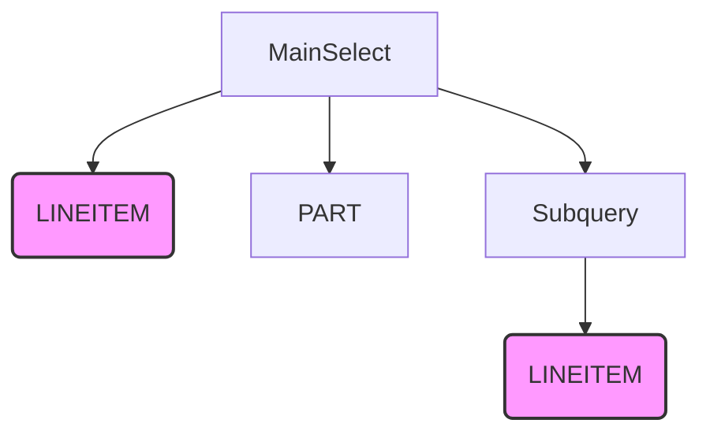
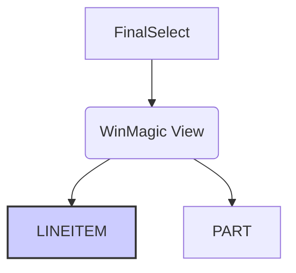
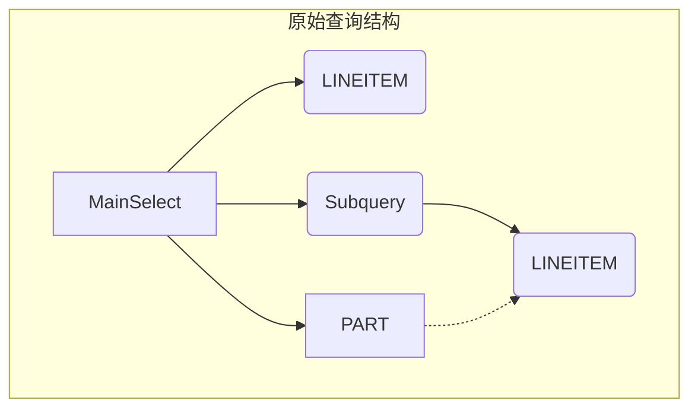
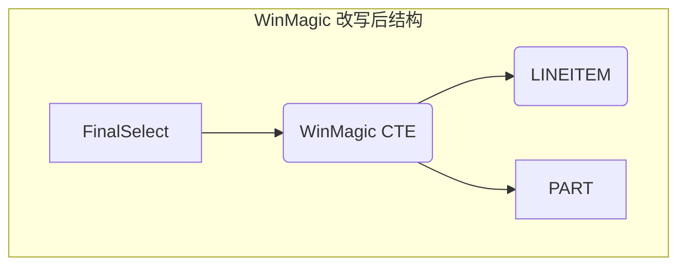
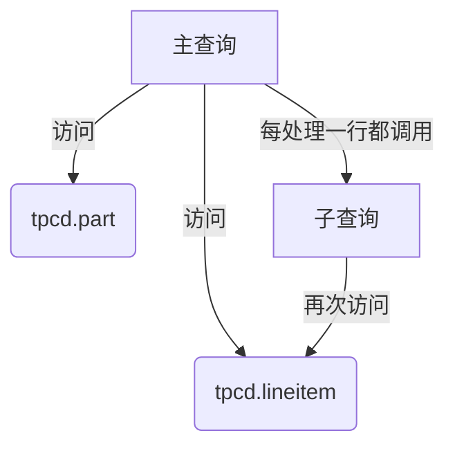
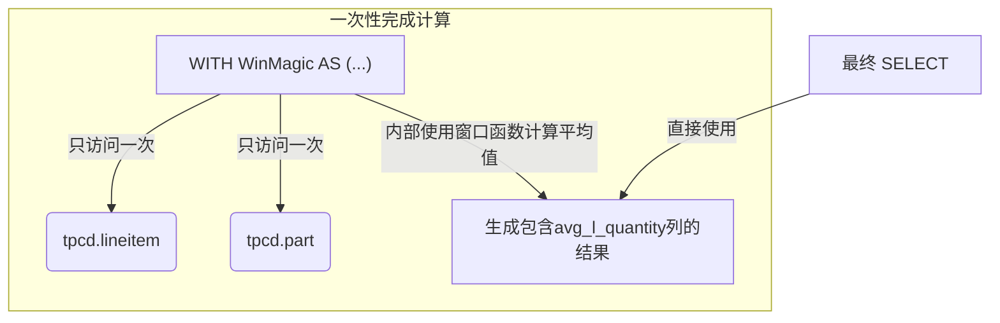

## AI论文解读 | Winmagic : Subquery Elimination Using Window Aggregation
        
### 作者        
digoal        
        
### 日期        
2025-10-05        
        
### 标签        
PostgreSQL , PolarDB , DuckDB , AI , 论文解读        
        
----        
        
## 背景  
      
https://eecs.csuohio.edu/~sschung/cis611/WinMagic03.pdf        
  
提示:          
```          
读懂《Winmagic : Subquery Elimination Using Window Aggregation》这篇论文需要提前掌握哪些基础知识, 请使用中文通熟易懂的讲解这些基础知识, 可以引用论文中的图、表或使用Markdown支持的图形(text,mermaid等)增加解释性. 
  
使用中文通熟易懂的解读《Winmagic : Subquery Elimination Using Window Aggregation》这篇论文, 其中的关键内容请着重讲解, 可以引用论文中的图、表或使用Markdown支持的图形(text,mermaid等)增加解释性. 
  
提取《Winmagic : Subquery Elimination Using Window Aggregation》这篇论文中的重要术语, 使用中文对这些术语进行通熟易懂的讲解, 可以引用论文中的图、表或使用Markdown支持的图形(text,mermaid等)增加解释性. 
```     
  
## 1 前置知识 
  
好的, 为了帮助您更好地理解《WinMagic: Subquery Elimination Using Window Aggregation》这篇论文, 我将为您梳理所需的基础知识. 这篇论文的核心在于提出了一种名为 "WinMagic" 的新型数据库查询优化技术. 该技术利用 "窗口聚合函数" (Window Aggregation Functions) 来更高效地处理一类常见的、性能低下的SQL查询, 尤其是那些包含 "关联子查询" (Correlated Subqueries) 的查询.

理解这篇论文需要您先掌握以下几个核心概念：

1.  **SQL、查询 (Query) 与子查询 (Subquery)**
2.  **关联子查询 (Correlated Subquery) 的工作原理及其性能瓶颈**
3.  **聚合函数 (Aggregation Functions) 的作用**
4.  **查询优化 (Query Optimization) 与"解关联" (Decorrelation) 技术**
5.  **窗口聚合函数 (Window Aggregation Functions) 的概念**

下面, 我们将用通俗易懂的方式逐一讲解这些知识点.

### 1\. SQL、查询 (Query) 与子查询 (Subquery)

  * **SQL (Structured Query Language)**: 是您与数据库沟通的语言. 您通过编写SQL语句来命令数据库执行各种操作, 比如查询数据、插入新数据、更新数据等.
  * **查询 (Query)**: 就是一条向数据库索取数据的指令, 通常以 `SELECT` 语句的形式出现.
  * **子查询 (Subquery)**: 指的是嵌套在另一个查询内部的查询. 它可以出现在 `WHERE`、`FROM` 或 `SELECT` 子句中.

**一个简单的例子**: 查询所有工资高于平均工资的员工.

```sql
SELECT employee_name
FROM employees
WHERE salary > (SELECT AVG(salary) FROM employees);
```

在这个例子中, `(SELECT AVG(salary) FROM employees)` 就是一个子查询. 它先计算出公司所有员工的平均工资, 然后外部的主查询再利用这个结果找出工资高于平均值的员工.

### 2\. 关联子查询 (Correlated Subquery) 及其性能瓶颈

这是理解论文的**第一个关键点**.

  * **什么是关联子查询?**
    关联子查询是一种特殊的子查询, 它的计算需要依赖于外部查询提供的值. 换句话说, 子查询不是独立执行一次就完事了, 而是 "循环" 地为外部查询的**每一行**都可能执行一次.

  * **论文中的例子 (Query 1)**:

    > 查询每个员工的信息, 要求该员工的工资高于其所在部门的平均工资.

    ```sql
    SELECT emp_id, emp_name, dept_name
    FROM employee E, department D
    WHERE E.dept_num = D.dept_num AND
          E.state = 'CALIFORNIA' AND
          E.salary > (SELECT AVG(salary)
                      FROM employee E1
                      WHERE E1.dept_num = E.dept_num); -- 关联部分
    ```

  * **性能瓶颈在哪里?**
    数据库在处理这个查询时, 其传统的执行方式 (称为 "嵌套迭代" 或 "tuple-at-a-time") 效率很低. 想象一下它的执行流程：

    1.  外部查询先找到一个加州的员工, 比如 "员工A", 他在 "D01" 部门.
    2.  为了判断 "员工A" 是否符合条件, 数据库必须**为他专门执行一次子查询**: `SELECT AVG(salary) FROM employee WHERE dept_num = 'D01'`.
    3.  外部查询接着找到下一个加州员工 "员工B", 他在 "D02" 部门.
    4.  数据库**再次为 "员工B" 执行子查询**: `SELECT AVG(salary) FROM employee WHERE dept_num = 'D02'`.
    5.  ... 这个过程会一直重复, 直到外部查询的每一行都处理完毕.

    如果员工表有数百万条记录, 这种 "逐行计算" 的方式将导致对 `employee` 表的反复扫描, 造成巨大的性能浪费.

### 3\. 聚合函数 (Aggregation Functions)

聚合函数是对一组值进行计算并返回单个值的函数. 常见的有：

  * `AVG()`: 计算平均值
  * `SUM()`: 求和
  * `COUNT()`: 计数
  * `MAX()`: 求最大值
  * `MIN()`: 求最小值

在上面的例子中, `AVG(salary)` 就是一个聚合函数. WinMagic技术主要就是针对包含这类聚合函数的子查询进行优化.

### 4\. 查询优化 (Query Optimization) 与 "解关联" (Decorrelation)

  * **查询优化**: 数据库系统内部有一个非常智能的组件叫做 "优化器" (Optimizer). 它的工作就是分析你写的SQL语句, 并找出一条最高效的执行路径.
  * **解关联 (Decorrelation)**: 这是优化器处理关联子查询的一种常用技术. 其核心思想是: **避免逐行执行子查询, 尝试将子查询改写成可以一次性执行的形式**, 通常是转换成 `JOIN` 操作. "Magic Decorrelation" (论文中常提到的"魔术解关联") 就是其中一种非常成功的技术.

虽然"解关联"比原始的嵌套执行要好得多, 但它通常会引入额外的 `JOIN` 操作和中间步骤, 仍然不够完美. 这也为 WinMagic 技术的提出埋下了伏笔.

### 5\. 窗口聚合函数 (Window Aggregation Functions)

这是理解论文的**第二个, 也是最核心的关键点**.

  * **什么是窗口函数?**
    窗口函数是一种特殊的函数, 它也像聚合函数一样对一组行 (这组行被称为 "窗口" 或 "分区") 进行计算, 但它**不会**像普通聚合函数那样将多行压缩成一行, 而是为每一行都返回一个计算结果.

  * **核心语法**: `OVER (PARTITION BY ...)`

      * `OVER (...)`: 这是窗口函数的标志.
      * `PARTITION BY dept`: 这句话的意思是 "按部门 (`dept`) 对数据进行分组". 这个分组就是所谓的 "窗口".

  * **论文中的例子 (Query 3)**:

    > 查询每个员工的工资, 并同时显示其所在部门的总工资.

    ```sql
    SELECT empnum, dept, salary,
           SUM(salary) OVER (PARTITION BY dept) AS dept_sum
    FROM employee;
    ```

    执行结果大致如下表所示 ：

    | EMPNUM | DEPT | SALARY | DEPT\_SUM |
    | :--- | :--- | :--- | :--- |
    | 1 | 1 | 78000 | **383000** |
    | 2 | 1 | 75000 | **383000** |
    | ... | 1 | ... | **383000** |
    | 8 | 3 | 79000 | **209000** |
    | 10 | 3 | 75000 | **209000** |
    | ... | 3 | ... | **209000** |

    **请注意**: `dept_sum` 这一列的值是 "重复" 的. 对于所有 `DEPT` 为 1 的员工, 他们的 `dept_sum` 都是部门1的总工资. 窗口函数的神奇之处在于, 它在一次扫描中, 就为每一行数据附加上了它所在分组的聚合结果, 并且**没有改变原有的行数**.

-----

### 融会贯通: WinMagic 是如何工作的?

掌握了以上知识后, 我们就可以理解 WinMagic 的核心思想了. 让我们回到最初那个 "员工工资高于部门平均工资" 的查询.

  * **传统方式 (关联子查询)**: 对 `employee` 表扫描 N 次 (N 约等于员工数), 效率极低.
  * **解关联 (Magic Decorrelation)**: 通过复杂的改写, 可能变成 `employee` 表 JOIN 一个预先计算好各部门平均工资的临时表. 需要访问 `employee` 表两次 (一次计算平均工资, 一次主查询).
  * **WinMagic 的方式**:
    1.  **一步到位**: 使用窗口函数 `AVG(salary) OVER (PARTITION BY dept_num)` 直接在 `employee` 表的每一行旁边生成该员工所在部门的平均工资.
    2.  **消除子查询**: 将原始的子查询完全消除, 变成一个简单的 `WHERE` 条件判断.

论文中的 Query 4 (原始查询) 与 Query 5 (WinMagic改写后的查询) 直观地展示了这一点.

**原始查询结构 (Query 4)**:



上图清晰地显示, `LINEITEM` 表被访问了两次, 一次在主查询中, 一次在子查询中.

**WinMagic 改写后的查询结构**:



通过 `WITH` 子句 (相当于一个临时视图) 和窗口函数, `LINEITEM` 表**只需要被访问一次**. 聚合计算 (`avg(l_quantity)`) 是在这次访问中 "顺便" 完成的, 极大地提升了性能.

**总结**:
要读懂这篇论文, 您需要理解传统关联子查询 "逐行执行" 的低效性, 并掌握窗口函数 `OVER (PARTITION BY ...)` "一次扫描, 分组计算, 行数不变" 的强大能力. WinMagic 技术本质上就是一种自动化的查询改写规则, 它智能地识别出符合特定模式的关联子查询, 并将其转换为使用窗口函数的高效形式, 从而避免了对同一张表的重复访问, 实现了性能的巨大飞跃.
  
## 2 解读论文 
  
好的, 这就为您通俗易懂地解读《WinMagic: Subquery Elimination Using Window Aggregation》这篇经典数据库优化论文.

-----

### 论文解读: WinMagic 技术如何让SQL查询“化腐朽为神奇”

这篇论文的核心思想是提出了一种名为 **WinMagic** 的自动化查询优化技术, 它利用SQL中的一个强大但未被充分利用的特性——**窗口聚合函数 (Window Aggregation Functions)**, 来解决一类常见且性能低下的查询问题, 尤其是那些包含**关联子查询 (Correlated Subqueries)** 的查询, 从而大幅提升数据库查询性能.

#### 1\. 问题的根源: 低效的“关联子查询”

首先, 我们要理解 WinMagic 旨在解决什么问题. 问题的核心是 "关联子查询".

**什么是关联子查询?**
简单来说, 它是一个嵌套在主查询内部的子查询, 并且这个子查询的计算需要依赖主查询当前处理的每一行数据.

**论文中的经典案例 (Query 1)**:

> 查找所有位于加州(CALIFORNIA)的员工, 要求其薪水高于**其所在部门**的平均薪水.

```sql
SELECT emp_id, emp_name, dept_name
FROM employee E, department D
WHERE E.dept_num = D.dept_num AND
      E.state = 'CALIFORNIA' AND
      E.salary > (SELECT AVG(salary)
                  FROM employee E1
                  WHERE E1.dept_num = E.dept_num); -- 关联部分
```

**性能瓶颈在哪里?**
传统数据库在处理这个查询时, 会采用一种非常“笨”的办法, 称为“一次一元组 (tuple-at-a-time)”的嵌套循环:

1.  主查询找到一个加州的员工A, 假设他在“销售部”.
2.  为了判断员工A是否满足条件, 数据库必须**为他专门执行一次子查询**, 计算“销售部”的平均工资.
3.  接着主查询找到下一个加州员工B, 假设他在“研发部”.
4.  数据库**再次为员工B执行一次子查询**, 计算“研发部”的平均工资.
5.  ... 这个过程会不断重复. 如果有成千上万名员工, `employee` 这张大表就会被反复扫描成千上万次, 效率极低.

尽管后续出现了“解关联”(Decorrelation)和“魔术集”(Magic Decorrelation)等优化技术来缓解这个问题, 但它们通常会引入额外的视图和Join操作, 仍有优化的空间. WinMagic 则提供了一种更优雅、更高效的解决方案.

#### 2\. WinMagic的核心利器: 窗口聚合函数 (Window Aggregation Functions)

要理解 WinMagic, 必须先理解它的“魔法棒”——窗口函数.

**窗口函数是什么?**
它是一种特殊的聚合函数, 可以在一次查询中, 为每一行数据计算出其所在“窗口”(即分组)的聚合值, 但**不会像普通聚合函数那样把多行压缩成一行**.

**关键语法**: `OVER (PARTITION BY ...)`

  * `OVER` 是窗口函数的标志.
  * `PARTITION BY` 用于定义分组, 类似于 `GROUP BY`.

**论文中的示例 (Query 3)**:

> 查询每位员工的薪水, 并同时列出其所在部门的总薪水.

```sql
SELECT empnum, dept, salary,
       SUM(salary) OVER (PARTITION BY dept) AS dept_sum
FROM employee;
```

这个查询的结果大致如下表所示, 注意 `dept_sum` 这一列. 对于所有属于部门`1`的员工, 它们都得到了相同的部门总薪水值`383000`, 并且原始的员工行数没有减少.

| EMPNUM | DEPT | SALARY | DEPTSUM |
| :--- | :--- | :--- | :--- |
| 1 | 1 | 78000 | 383000 |
| 2 | 1 | 75000 | 383000 |
| 5 | 1 | 75000 | 383000 |
| ... | ... | ... | ... |
| 8 | 3 | 79000 | 209000 |
| 10 | 3 | 75000 | 209000 |

窗口函数的这个特性——**一次扫描, 随行计算聚合值, 且不改变行数**——正是 WinMagic 实现优化的关键.

#### 3\. WinMagic详解: “消除子查询”的魔法

WinMagic 的核心步骤就是: **识别出关联子查询, 并用窗口函数将其改写, 从而彻底消除子查询和对表的重复访问**.

我们以论文中的 TPC-H 基准测试查询 (Query 4) 为例:

**原始查询 (Query 4)**:
这个查询的目的是计算符合特定条件的零件的年平均销售额, 其中一个关键条件是: 订单数量 `l_quantity` 必须小于该零件平均订单数量的20%.

```sql
SELECT SUM(l_extendedprice) / 7.0 AS avg_yearly
FROM tpcd.lineitem, tpcd.part
WHERE p_partkey = l_partkey AND
      p_brand = 'Brand#23' AND
      p_container = 'MED BOX' AND
      l_quantity < (SELECT 0.2 * avg(l_quantity)  -- 关联子查询
                    FROM tpcd.lineitem
                    WHERE l_partkey = p_partkey); -- 依赖外部的 p_partkey
```

这个查询的结构可以用下图表示. 很明显, `LINEITEM` 表被访问了两次:



**WinMagic 的改写过程 (Query 5)**:
WinMagic 会自动将上述查询重写为如下形式:

1.  **合并数据源**: 将内外查询都依赖的 `lineitem` 和 `part` 表放到一个公共表表达式 (CTE, 即 `WITH` 子句) 中进行一次性的 `JOIN`.
2.  **植入窗口函数**: 在这个CTE中, 使用窗口函数 `avg(l_quantity) OVER (PARTITION BY p_partkey)` 来计算每个零件的平均订单数量, 并作为一个新列 `avg_l_quantity`.
3.  **消除子查询**: 在最终的查询中, 直接使用这个新列进行比较, 彻底消除了原来的子查询.

**改写后的查询 (Query 5)**:

```sql
WITH WinMagic AS (
    SELECT l_extendedprice, l_quantity,
           avg(l_quantity) OVER (PARTITION BY p_partkey) AS avg_l_quantity
    FROM tpcd.lineitem, tpcd.part
    WHERE p_partkey = l_partkey AND
          p_brand = 'Brand#23' AND
          p_container = 'MED BOX'
)
SELECT SUM(l_extendedprice) / 7.0 AS avg_yearly
FROM WinMagic
WHERE l_quantity < 0.2 * avg_l_quantity;
```

改写后的查询结构变得非常简洁, `LINEITEM` 表只需访问一次:



这个转换的最大好处是**将对 `LINEITEM` 表的两次访问减少为一次**, 避免了代价高昂的重复扫描和Join操作, 从而带来了巨大的性能提升.

#### 4\. 惊人的性能提升: 数据为证

论文通过在 TPC-H 基准测试上的实验, 证明了 WinMagic 的强大效果.

  * **对于Query 4 (Q17)**: 在100GB数据集上, WinMagic 相比传统的“魔术解关联”技术, 获得了**约50%的性能提升**. 在更大规模的10TB数据集上, 性能提升更是达到了**60%**.

    *图表来源: 论文 Figure 4 & 6*      
    *(示意图, 根据论文图表重绘)*

  * **对于Query 9 (Q2)**: 同样在10TB数据集上, WinMagic 也获得了**50%的性能提升**.

这些数据有力地证明了, 通过消除冗余的表访问, WinMagic 能够显著减少查询执行时间, 特别是在处理海量数据时.

#### 5\. 更广泛的应用场景

WinMagic 的应用并不局限于上述例子. 论文指出, 它的能力还可以扩展到:

  * **非关联子查询**.
  * **不包含聚合的子查询**, 例如在处理时序数据(Temporal Database)时查找最新记录的场景. 论文中的 Query 2 就被成功地改写成了更高效的 Query 8.

#### 结论

《WinMagic》这篇论文提出了一个非常巧妙且实用的数据库查询优化技术. 其核心贡献可以总结为:

> 它利用了**窗口聚合函数**的独特能力, 将包含(关联)子查询的复杂SQL语句, 自动重写为**无子查询**的扁平化结构, 从而**消除对表的冗余访问**, 在不改变查询语义的前提下, 极大地提升了查询性能.

这项技术被成功应用在了 IBM DB2 数据库中, 证明了其在工业界的巨大价值, 也为我们理解和编写高性能SQL提供了宝贵的启示.
  
## 3 术语 
  
好的, 这篇论文《WinMagic: Subquery Elimination Using Window Aggregation》介绍了一种名为 "WinMagic" 的数据库查询优化技术. 下面我将为您提取并讲解其中的核心术语.

### 1\. 相关子查询 (Correlated Subquery)

相关子查询是一种嵌套在主查询内部的子查询, 并且其执行依赖于主查询处理的每一行数据所提供的值. 你可以把它想象成一个循环嵌套：主查询每处理一行, 都要把这一行的数据传给子查询去执行一次, 拿到结果后再回来继续处理.

**通俗理解:**
假设你想找出公司里所有比自己部门平均工资要高的员工.

  * **主查询** 遍历 `员工` 表, 逐一查看每个员工.
  * 当看到员工A时, 主查询需要知道A所在部门的平均工资是多少.
  * 于是, 主查询调用 **子查询**, 并告诉它: "请帮我计算'A部门'的平均工资".
  * 子查询计算出结果后返回给主查询. 主查询用A的工资和这个平均值比较, 判断是否满足条件.
  * 接着主查询移到下一个员工B, 再次调用子查询: "这次请帮我计算'B部门'的平均工资".

这个过程不断重复, 直到所有员工都被处理完. 如果 `员工` 表非常大, 这种"逐行调用"的方式会导致子查询被执行成千上万次, 性能非常低下.

论文中的 **Query 1** 就是一个典型的例子, 它查询每个员工时, 都要调用一个子查询来计算该员工所在部门的平均工资.

### 2\. 去相关 (Decorrelation)

去相关是一种优化技术, 其目标是将"相关子查询"改写成一个与之等价但没有相关性的查询. 改写后的查询中, 子查询通常只需要执行一次, 然后将其结果与主查询进行连接 (JOIN).

**通俗理解:**
继续上面的例子, "去相关"的思路是:

1.  **第一步**: 不再逐个员工去问, 而是先执行一个独立的查询, 一次性计算出 *所有* 部门的平均工资, 并存入一个临时结果集 (例如: `部门号`, `平均工资`).
2.  **第二步**: 将 `员工` 表与这个临时结果集按照 `部门号` 进行连接.
3.  **第三步**: 在连接后的结果中, 直接比较每个员工的工资和他所在部门的平均工资, 筛选出符合条件的员工.

通过这种方式, 计算平均工资的操作从"为每个员工执行一次"变成了"所有部门总共只执行一次", 大大提升了效率. **Magic Decorrelation**  是论文中提到的一种著名且高效的去相关技术.

### 3\. 窗口聚合函数 (Window Aggregation Functions)

窗口聚合函数是一种特殊的SQL函数, 它能在一组与当前行相关的行(即"窗口")上进行计算, 但计算结果会返回到当前的每一行上, 而不像普通聚合函数那样将多行合并为一行.

**通俗理解:**
普通的聚合函数 `AVG(salary)` 会计算所有工资的平均值, 最终只返回一个数字.

而窗口函数 `AVG(salary) OVER (PARTITION BY dept)` 则不同:

  * `PARTITION BY dept` 定义了"窗口"的范围, 这里是指"按部门分区".
  * 函数会对每个部门内的员工工资计算平均值.
  * 最关键的是, 它会将计算出的部门平均工资作为新的一列, 添加到该部门 *每一个* 员工的记录后面.

论文中的 **Query 3** 和其结果表示例清晰地展示了这一点: `DEPTSUM` 这一列的每一行都显示了该行员工所在部门的总薪水.

```
 "EMPNUM", "DEPT", "SALARY", "DEPTSUM"
 "1"     , "1"   , "78000" , "383000"  <-- 部门1的总薪水
 "2"     , "1"   , "75000" , "383000"  <-- 在部门1的每个员工行上重复
 "5"     , "1"   , "75000" , "383000"
 ...
 "8"     , "3"   , "79000" , "209000"  <-- 部门3的总薪水
 "10"    , "3"   , "75000" , "209000"
```

### 4\. WinMagic

WinMagic 是这篇论文提出的核心技术. 它利用窗口聚合函数, 不仅仅是去相关, 而是能够 **直接消除子查询** , 并且避免对同一张表进行多次访问.

**通俗理解:**
WinMagic 的转换逻辑如下, 我们可以用论文中的 **Query 4** 到 **Query 5** 的转换过程来说明:

**转换前 (Query 4):** 这是一个相关子查询.



问题在于 `tpcd.lineitem` 这张大表被访问了两次.

**转换后 (Query 5):** 使用 WinMagic.

1.  **合并**: 将主查询和子查询中共同引用的表 (`lineitem` 和 `part`) 合并到一个 `WITH` 子句 (名为 `WinMagic`) 中.
2.  **替换**: 在这个合并的查询中, 用窗口函数 `avg(l_quantity) over(partition by p_partkey)` 来计算每个 `partkey` 对应的平均数量, 并作为新的一列 `avg_l_quantity`.
3.  **消除**: 主查询现在直接从 `WinMagic` 这个临时的结果集中读取数据, 原本的子查询条件 `l_quantity < (SELECT ...)` 就变成了简单的 `l_quantity < 0.2 * avg_l_quantity`. 子查询被彻底消除了.




**核心优势:** WinMagic 的最大好处是显著提升性能, 因为它将对大表的多次访问减少为一次, 避免了重复的I/O和计算. 论文中的性能对比图 (如 Figure 4, 6, 7) 显示, 相比传统的 Magic Decorrelation, WinMagic 带来了约 50% 甚至更高的性能提升.        
  
## 参考        
         
https://eecs.csuohio.edu/~sschung/cis611/WinMagic03.pdf    
        
<b> 以上内容基于DeepSeek、Qwen、Gemini及诸多AI生成, 轻微人工调整, 感谢杭州深度求索人工智能、阿里云、Google等公司. </b>        
        
<b> AI 生成的内容请自行辨别正确性, 当然也多了些许踩坑的乐趣, 毕竟冒险是每个男人的天性.  </b>        
  
    
#### [期望 PostgreSQL|开源PolarDB 增加什么功能?](https://github.com/digoal/blog/issues/76 "269ac3d1c492e938c0191101c7238216")
  
  
#### [PolarDB 开源数据库](https://openpolardb.com/home "57258f76c37864c6e6d23383d05714ea")
  
  
#### [PolarDB 学习图谱](https://www.aliyun.com/database/openpolardb/activity "8642f60e04ed0c814bf9cb9677976bd4")
  
  
#### [PostgreSQL 解决方案集合](../201706/20170601_02.md "40cff096e9ed7122c512b35d8561d9c8")
  
  
#### [德哥 / digoal's Github - 公益是一辈子的事.](https://github.com/digoal/blog/blob/master/README.md "22709685feb7cab07d30f30387f0a9ae")
  
  
#### [About 德哥](https://github.com/digoal/blog/blob/master/me/readme.md "a37735981e7704886ffd590565582dd0")
  
  

  
