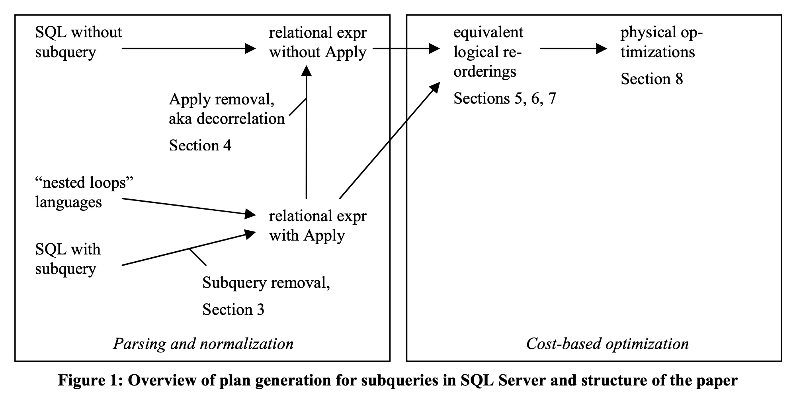
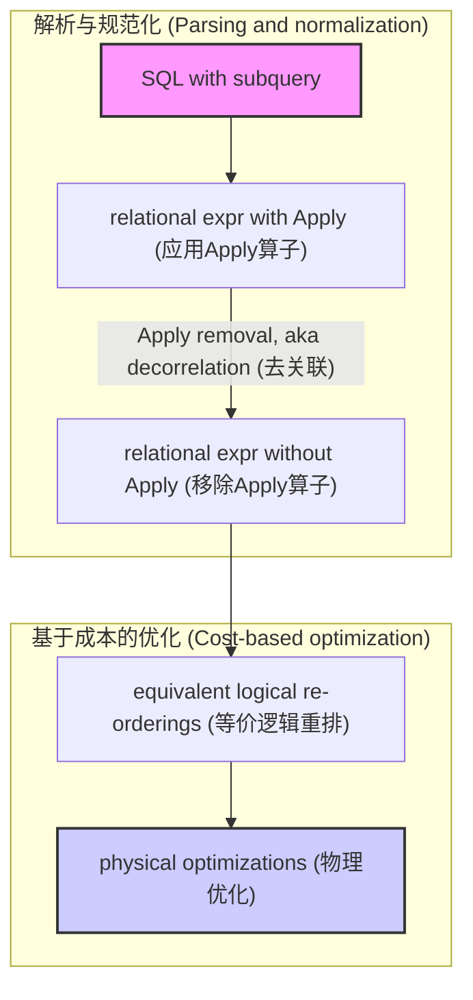
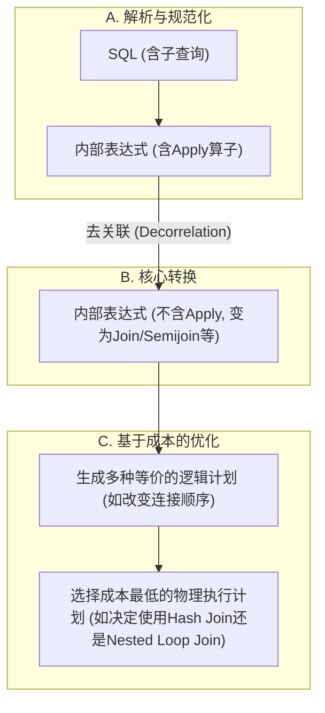

## AI论文解读 | Execution Strategies For Sql Subqueries
        
### 作者        
digoal        
        
### 日期        
2025-10-05        
        
### 标签        
PostgreSQL , PolarDB , DuckDB , AI , 论文解读        
        
----        
        
## 背景  
      
https://www.cse.iitb.ac.in/infolab/Data/Courses/CS632/2014/2009/Papers/subquery-proc-elhemali-sigmod07.pdf        
  
提示:          
```          
读懂《Execution Strategies For Sql Subqueries》这篇论文需要提前掌握哪些基础知识, 请使用中文通熟易懂的讲解这些基础知识, 可以引用论文中的图、表或使用Markdown支持的图形(text,mermaid等)增加解释性. 
  
使用中文通熟易懂的解读《Execution Strategies For Sql Subqueries》这篇论文, 其中的关键内容请着重讲解, 可以引用论文中的图、表或使用Markdown支持的图形(text,mermaid等)增加解释性. 
  
提取《Execution Strategies For Sql Subqueries》这篇论文中的重要术语, 使用中文对这些术语进行通熟易懂的讲解, 可以引用论文中的图、表或使用Markdown支持的图形(text,mermaid等)增加解释性. 
```     
  
## 1 前置知识 
  
好的，为了完全读懂《Execution Strategies for SQL Subqueries》这篇论文，您需要掌握一些关于数据库系统、SQL 和查询优化的核心基础知识。下面我将用通俗易懂的中文为您逐一讲解，并引用论文中的图表来增强解释性。

### 核心基础知识概览

要理解这篇论文，您需要将知识体系分为四个层面：

1.  **数据库与SQL基础**：这是起点，了解我们在操作什么。
2.  **关系代数**：这是数据库内部描述和转换查询的“语言”。
3.  **查询优化的基本理念**：这是核心，理解数据库为什么要做以及如何做这些复杂的转换。
4.  **SQL子查询的挑战**：理解论文具体要解决的问题是什么。

-----

### 1\. 数据库与SQL基础知识

这是最基本的要求。您需要了解：

  * **关系型数据库 (Relational Database)**：数据以二维表（Table）的形式组织，表由行（Row）和列（Column）构成。

  * **SQL (Structured Query Language)**：用于与数据库交互的标准化语言，您至少需要熟悉`SELECT`, `FROM`, `WHERE`, `JOIN`等基本子句。

  * **子查询 (Subquery)**：一个嵌套在另一个SQL查询中的查询。这是论文讨论的绝对核心。子查询可以出现在`SELECT`、`FROM`、`WHERE`或`HAVING`子句中 。

      * **示例**: 查找所有下过订单的客户。
        ```sql
        SELECT *
        FROM Customers
        WHERE CustomerID IN (SELECT CustomerID FROM Orders);
        ```
        这里的 `(SELECT CustomerID FROM Orders)` 就是一个子查询。

-----

### 2\. 关系代数 (Relational Algebra)

论文中不会直接使用SQL来讨论查询的转换，而是使用一种更形式化、更底层的语言——关系代数。这就像是数据库引擎内部的“草稿纸”。您需要了解几个核心的代数操作符：

  * **选择 (Selection, σ)**：相当于SQL的`WHERE`子句，用于过滤行。论文中写作 `σ[p]R`，表示在关系R上应用谓词p进行筛选 。
  * **投影 (Projection, π)**：相当于SQL的`SELECT`子句，用于选择列。论文中写作 `π[S]R`，表示从关系R中只保留S集合里的列 。
  * **连接 (Join, ⨝ 或 JN)**：相当于SQL的`JOIN`，用于合并两个表。
  * **分组与聚合 (Group By, G)**：相当于SQL的`GROUP BY`和`COUNT()`, `SUM()`等聚合函数。论文中写作 `GΛ,F R` 。

除了上述基本操作，论文还重点讨论了 **几种特殊的连接操作**，这对于理解子查询至关重要：

  * **半连接 (Semijoin, SJ)**: `R SJ S` 的结果是R中那些在S中**至少有一个匹配项**的行 。它只返回R的列，不返回S的列。这正好对应了SQL中的`EXISTS`或`IN`子查询的语义。
      * **通俗理解**：给我所有“有”对应订单的客户，但我只需要客户信息，不需要订单信息。
  * **反连接 (Antijoin, ASJ)**: `R ASJ S` 的结果是R中那些在S中**没有任何匹配项**的行 。它也只返回R的列。这对应了`NOT EXISTS`或`NOT IN`子查询。
      * **通俗理解**：给我所有“没有”下过订单的客户。

-----

### 3\. 查询优化的基本理念

这是理解论文“为什么”要进行各种复杂变换的关键。

#### a. 什么是查询优化？

当您提交一条SQL时，数据库并不会直接“照着做”。它会先生成很多种逻辑上等价、但执行效率可能天差地别的执行方案（Execution Plan），然后通过一个叫做 **“查询优化器 (Query Optimizer)”** 的组件，选择一个成本最低的方案去执行。

这篇论文的核心就是介绍SQL Server的查询优化器是如何为带有子查询的SQL生成和选择高效执行方案的 。

#### b. 查询计划 (Query Plan)

查询计划是数据库执行查询的“路线图”。它由一系列物理操作符（如Hash Join, Nested Loop Join, Table Scan等）组成的树状结构。

#### c. 基于成本的优化 (Cost-based Optimization)

优化器会估算每个可能的执行计划的“成本”（通常是CPU和I/O的综合指标），然后选择成本最低的那个 。这个估算基于数据库中存储的关于数据分布的统计信息。这就是为什么论文的实验部分反复强调不同策略在不同数据选择性（selectivity）下的性能差异，因为优化器正是根据这些信息来做决策的 。

#### d. 论文的核心流程：从SQL到执行计划

理解论文提出的处理流程至关重要。论文的图1清晰地展示了这一过程：    



  * **图解**: 整个过程可以看作是一个翻译和改造的过程 。
    1.  **子查询移除 (Subquery removal)**: 首先，SQL语句被解析成一个包含特殊`Apply`算子的内部代数表达式 。`Apply`算子可以理解为“对外部查询的每一行，执行一次内部查询”的逻辑表示 。
    2.  **去关联 (Decorrelation)**: 接着，优化器会尝试移除`Apply`算子，将其转换为标准的`Join`、`Semijoin`或`Antijoin`等操作 。这是优化的关键一步，因为它使得查询不再是“一行一行”的嵌套循环模式，从而可以使用更高效的集合操作（如哈希连接）。
    3.  **逻辑重排与物理优化**: 在移除了`Apply`之后，优化器就可以像处理普通查询一样，探索不同的连接顺序和物理实现算法（比如是用哈希连接还是嵌套循环连接），最终选择一个最优的计划 。

-----

### 4\. SQL子查询的挑战：关联 (Correlation)

这是论文要解决的核心技术难题。

  * **什么是关联子查询 (Correlated Subquery)?**
    如果一个子查询的执行依赖于外部查询的某一行的值，那么它就是关联子查询 。

  * **示例**: 查找每个订单中，发货日期晚于下单日期的商品。

    ```sql
    SELECT *
    FROM ORDERS O
    WHERE EXISTS (
        SELECT *
        FROM LINEITEM L
        WHERE L.L_ORDERKEY = O.O_ORDERKEY -- 依赖于外部查询的 O.O_ORDERKEY
          AND L.L_SHIPDATE > O.O_ORDERDATE -- 依赖于外部查询的 O.O_ORDERDATE
    );
    ```

    这个子查询必须拿到外部`ORDERS`表的每一行的`O_ORDERKEY`和`O_ORDERDATE`才能执行。

  * **为什么关联是性能杀手？**
    最朴素（naïve）的执行方式是嵌套循环：遍历`ORDERS`表的每一行，然后把该行的`O_ORDERKEY`等值代入子查询中，再完整地执行一遍子查询。如果`ORDERS`表有100万行，子查询就要被独立执行100万次，性能会非常差。

  * **论文的解决方案**:
    论文探讨的核心就是如何通过**去关联 (Decorrelation)** 技术，将这种嵌套循环的逻辑，转换成一个等价的、单一的、基于集合的操作（比如一个大的Join），从而让数据库可以利用索引、哈希连接等高效算法一次性处理所有数据。

### 总结：您需要提前掌握的知识点清单

为了更好地理解这篇论文，请确保您对以下概念有清晰的认识：

| 知识领域 | 关键概念 | 在论文中的作用 |
| :--- | :--- | :--- |
| **SQL基础** | 子查询 (Subquery), `EXISTS`, `IN`, `ANY`, `ALL` | 论文的研究对象和出发点 。 |
| **关系代数** | 选择(σ), 投影(π), **半连接(Semijoin)**, **反连接(Antijoin)** | 描述查询转换的内部语言，是理解优化步骤的基础 。 |
| **查询优化** | 查询计划, **基于成本的优化**, 逻辑/物理操作符 | 理解数据库为何以及如何选择不同执行策略的理论框架 。 |
| **核心挑战** | **关联子查询 (Correlated Subquery)** | 论文要解决的主要性能瓶颈 。 |
| **核心思想** | **去关联 (Decorrelation)**, **Apply算子** | 论文提出的核心技术，将子查询转换为高效的连接操作 。 |

掌握了以上知识后，您将能轻松理解论文中讨论的各种策略，例如为什么在某些情况下“前向查找 (Forward lookup)”更优，而在另一些情况下“反向查找 (Reverse lookup)”或“基于集合 (Set-based)”的策略性能更好，并体会到基于成本的查询优化器在其中扮演的关键角色 。
  
## 2 解读论文 
  
好的，这篇名为《Execution Strategies for SQL Subqueries》的论文是数据库领域的一篇经典之作，它详细阐述了 Microsoft SQL Server 是如何优化和执行包含子查询的SQL语句的。下面，我将为您通俗易懂地解读其核心内容。

### 论文解决的核心问题是什么？

SQL子查询功能强大，但在很多场景下，如果数据库执行不当，会导致极差的性能。尤其是**关联子查询 (Correlated Subquery)**，其最“笨”的执行方式是：外部查询每处理一行，就把这一行的值传给内部的子查询，然后完整地执行一次子查询 。如果外部查询返回100万行，子查询就要被执行100万次，这无疑是一场性能灾难。

**这篇论文的核心目标就是：介绍一套完整的、能够系统性地将各种复杂的子查询转换成高效执行计划的策略和方法。**

### 第一步：用“标准语言”描述子查询——`Apply`算子

为了在数据库内部统一处理子查询，SQL Server 首先会将SQL语句转换成一种内部的、由各种“算子”组成的代数表达式 。论文引入了一个关键的逻辑算子——**`Apply`** 。

`Apply` 算子可以被理解为对“嵌套循环”这种执行模式的标准化描述 。它的基本语义是：“对于输入关系 R 的每一行 r，都执行一次参数化的表达式 E(r)，然后将结果合并” 。

这个 `Apply` 算子非常灵活，通过改变其合并逻辑，它可以代表不同类型的子查询 ：

  * **`EXISTS`** 子查询可以被表示为 **半连接 (Semijoin) `Apply`** 。
  * **`NOT EXISTS`** 子查询可以被表示为 **反连接 (Antijoin) `Apply`** 。
  * `SELECT`子句中的标量子查询可以被表示为 **外连接 (Outer Join) `Apply`** 。

### 第二步：优化的核心思想——去关联 (Decorrelation)

有了 `Apply` 算子这个统一的内部表示后，优化的主要目标就变成了尽可能地 **“移除Apply算子”** 。这个过程，就是大名鼎鼎的 **“去关联” (Decorrelation)** 。

去关联的本质，是将原本需要“一行一行”嵌套执行的逻辑，转换成一个等价的、可以“一批一批”处理的、基于集合的操作（如哈希连接、归并连接） 。这为优化器选择更多高效的执行算法打开了大门 。

#### 完整的优化流程

论文的图1清晰地展示了从SQL到最终执行计划的整个流程 。我们可以用下图来简化理解这个过程：   



1.  **解析与规范化**：SQL Server将用户写的SQL语句，翻译成包含 `Apply` 算子的内部代数表达式 。
2.  **去关联**：优化器尝试将 `Apply` 算子转换成标准的 `Join`、`Semijoin` 等关系算子 。
3.  **基于成本的优化**：一旦去关联成功，这个查询就和普通的多表连接查询无异了 。优化器会探索不同的执行顺序和实现算法，估算它们的成本，并选择一个最快的方案来执行 。

### 第三步：针对不同子查询的“十八般武艺”

论文的精髓在于详细介绍了针对不同情况的优化策略。

#### 1\. 针对 Semijoin (`EXISTS`) 的策略

这是最常见的情况。优化器有多种武器可供选择：

  * **前向查找 (Forward Lookup)**：这是最朴素的嵌套循环执行方式 。先处理外部查询，对于每一行，再去内部的表中查找是否存在匹配。当外部查询结果集很小时，这种方法很高效。
  * **反向查找 (Reverse Lookup)**：一个非常重要的优化！先处理内部查询，然后用其结果去查找外部表 。当内部查询的过滤条件非常严格（即选择性高），能筛选出很少的行时，这种方法性能极佳 。为了实现反向查找，优化器通常需要将Semijoin转换为一个普通的Inner Join，并通过分组（Group By）来确保外部表的行不会因为内部匹配多行而重复出现 。
  * **基于集合的评估 (Set-based Evaluation)**：通过去关联，将Semijoin完全变成一个标准的 `Hash Join` 或 `Merge Join` 。当两边的表都没有特别强的过滤条件，结果集都比较大时，这种“批处理”模式的性能最好 。

**结论**：没有哪种策略永远是最好的。这正是**基于成本的优化器**存在的意义 。优化器会根据表的统计信息，估算哪种策略的成本最低，然后做出选择。论文的实验数据清晰地证明了这一点 。

#### 2\. 针对 Antijoin (`NOT EXISTS`) 的策略

Antijoin的优化比Semijoin更棘手，因为它的逻辑（不存在匹配）使得“反向查找”几乎不可行 。但论文同样提供了一些高级技巧：

  * **拆分带`OR`的Antijoin**：当`NOT EXISTS`的条件中包含`OR`时（例如 `A NOT IN (SELECT B ...)` 在处理NULL时会转换成 `A=B OR A IS NULL OR B IS NULL`），直接执行会非常低效，无法使用索引或哈希连接 。SQL Server会将这种复杂的Antijoin拆分成多个简单的Antijoin 。例如，`(R ASJ(p1 OR p2) S)` 会被拆分为 `((R ASJ(p1) S) ASJ(p2) S)` 。拆分后的每个简单Antijoin就可能使用高效的哈希连接等算法了 。

#### 3\. 针对带`OR`的子查询 (Subquery Disjunctions)

当子查询出现在 `OR` 条件中时，比如 `... WHERE T.a > 10 OR EXISTS (SELECT ...)`，优化会变得很复杂。

  * **分发`Apply`并使用`UNION`**：论文提出了一种策略，即将 `OR` 转换成 `UNION` 。`R Apply (E1 OR E2)` 会被转换为 `(R Apply E1) UNION (R Apply E2)` 。
  * **优点**：转换后，每一个独立的 `(R Apply E)` 分支都可以被单独优化，或许其中一个分支可以高效地去关联并使用哈希连接 。
  * **缺点**：这种转换会导致外部表 `R` 被复制和处理多次，可能代价高昂 。因此，这依然是一个需要优化器权衡成本的决策。

### 第四步：当无法去关联时怎么办？(General Apply)

在某些情况下（例如，子查询调用了一个不透明的自定义函数），去关联是不可能的 。此时，数据库只能硬着头皮执行嵌套循环。但即便如此，SQL Server 仍然有一些“黑科技”来提升性能：

  * **异步I/O (Prefetch)**：当处理外部查询的某一行时，不是立即执行内部查询，而是向I/O子系统发出一个“预读”请求，让它在后台先把内部查询可能需要的数据页从磁盘加载到内存中 。这样，当CPU真正开始执行内部查询时，数据已经在内存里了，避免了等待磁盘I/O的耗时。
  * **批处理排序 (Batch Sort)**：为了提高缓存命中率和数据局部性，SQL Server会先缓存一小批外部查询的结果行，然后根据关联键（correlation key）对这批行进行排序 。这样，对内部表的访问就会从随机、离散的I/O模式变为更加连续和集中的模式，大大减少了I/O开销 。

论文的实验证明，这两项技术可以将嵌套循环的性能提升近88% 。

### 论文策略总结

论文在第9节提供了一个非常好的总结表，概括了针对不同算子的优化策略 。

| 算子 | 策略 |
| :--- | :--- |
| **Semijoin** | 前向查找、**反向查找**、基于集合的评估、转换为Inner Join、使用max/min聚合 |
| **Antijoin** | 前向查找、基于集合的评估、**拆分带OR的Antijoin**、使用max/min聚合 |
| **Apply** | 处理`OR`子查询、**缓存(Caching)**、**预读(Prefetching)**、**排序外部关系(Sorting)** |

### 结论

这篇论文系统性地阐述了工业级数据库（Microsoft SQL Server）处理SQL子查询的先进思想和实用技术。其核心观点可以总结为：

1.  **统一内部表示**：通过引入 `Apply` 算子来标准化地描述所有类型的子查询 。
2.  **去关联为核心**：优化的主要目标是将 `Apply` 算子转换为标准的、基于集合的关系算子，以便利用高效的连接算法 。
3.  **多策略并存**：针对不同的数据分布和查询模式，没有一种策略是万能的。因此，优化器必须支持包括前向/反向查找、集合操作在内的多种策略 。
4.  **成本优化是关键**：一个强大的、基于成本的查询优化器是不可或缺的，它能根据数据统计信息，从众多策略中智能地选择最优的执行计划 。
  
## 3 术语 
  
好的，这篇论文介绍了许多关于数据库如何高效处理SQL子查询的关键术语和技术。以下是对这些重要术语的中文讲解，并结合论文内容进行说明。

### 1\. 关联 (Correlation)

  * **讲解**：
    “关联”指的是内部的子查询在执行时，需要依赖外部查询当前正在处理的某一行的数据 。简单来说，子查询不是一个可以独立运行的查询，它的查询条件中包含了来自外部查询表的字段 。

  * **重要性**：
    关联是导致子查询性能低下的“罪魁祸首” 。最直接的执行方式是，外部查询每得到一行，就要用这一行的值替换子查询中的关联字段，然后重新执行一遍子查询 。这种嵌套循环的方式在处理大量数据时效率极低。因此，如何消除或优化关联，是整篇论文的核心议题。

### 2\. Apply 算子 (Apply Operator)

  * **讲解**：
    `Apply` 算子是论文中提出的一个核心**逻辑代数算子**，用于在数据库内部统一地表示所有子查询的“嵌套执行”语义 。它的基本含义可以理解为：“对于外部输入的每一行 `r`，都执行一次参数化的内部查询 `E(r)`，然后将结果汇总” 。

  * **重要性**：
    通过引入 `Apply` 算子，SQL Server将所有形式各异的子查询（如 `EXISTS`, `IN`, `SELECT`子句中的标量子查询等）都转换成了一个统一的内部表示 。这使得后续的优化步骤可以基于一个标准化的模型来进行，而无需为每一种SQL语法单独设计优化规则。这在整个优化流程中起到了承上启下的关键作用。

### 3\. 子查询移除 (Subquery Removal)

  * **讲解**：
    这是一个初始的转换步骤，它的目标是将SQL语句中位于 `WHERE` 或 `SELECT` 子句里的子查询“挪动”出来，转换成使用 `Apply` 算子的关系代数表达式 。这个过程消除了标量计算（scalar evaluation）和关系运算（relational execution）之间的相互递归调用 。

  * **重要性**：
    这是整个优化流程的第一步，是后续所有高级优化的基础。如下图所示，它将用户编写的SQL语句翻译成了优化器能够理解和处理的、以 `Apply` 算子为核心的内部形式。

    ```mermaid
    graph TD
        A["SQL (含子查询)"] -- "步骤1: 子查询移除 (Subquery Removal)" --> B["关系表达式 (含Apply算子)"];
        B -- "步骤2: 去关联 (Decorrelation)" --> C["关系表达式 (不含Apply算子, 变为Join等)"];
        C -- "..." --> D["最终执行计划"];
    ```

### 4\. 去关联 (Decorrelation)

  * **讲解**：
    “去关联”是整个子查询优化过程中最关键的一步，它的目标是**彻底消除 `Apply` 算子** 。通过一系列等价的代数变换，将原本需要逐行参数化执行的 `Apply` 逻辑，转换成一个等价的、可以使用标准连接（如`Inner Join`, `Outer Join`, `Semijoin`, `Antijoin`）算法来完成的、面向集合的操作 。这个过程在论文中也被称为 **Apply Removal**。

  * **重要性**：
    去关联是实现高性能子查询执行的核心。一旦去关联成功，优化器就可以使用哈希连接（Hash Join）、归并连接（Merge Join）等高效的物理连接算法，一次性处理所有数据，而不是低效地执行成千上万次嵌套循环 。

### 5\. 半连接 (Semijoin) 和 反连接 (Antijoin)

  * **讲解**：
    这两个是不在标准SQL语法中直接暴露给用户，但在数据库内部广泛使用的关系算子。

      * **半连接 (Semijoin, SJ)**：`R SJ S` 的结果是关系 `R` 中那些在 `S` 中**至少能找到一个匹配行**的行集合 。它只返回 `R` 的列。这完美对应了 `EXISTS` 或 `IN` 子查询的语义。
      * **反连接 (Antijoin, ASJ)**：`R ASJ S` 的结果是关系 `R` 中那些在 `S` 中**完全找不到任何匹配行**的行集合 。它也只返回 `R` 的列。这完美对应了 `NOT EXISTS` 或 `NOT IN` 子查询的语义。

  * **重要性**：
    这两个算子是“去关联”过程的主要产物 。将 `EXISTS` 子查询转换为 Semijoin，将 `NOT EXISTS` 转换为 Antijoin，使得优化器可以用专门的连接算法来高效地处理这些逻辑。

### 6\. 执行策略 (Execution Strategies)

论文探讨了多种执行子查询的物理策略，优化器会根据成本选择其中之一。

  * **前向查找 (Forward Lookup)**：先处理外部查询，然后用每一行的结果去探测（lookup）内部查询的表 。这本质上就是嵌套循环连接。
  * **反向查找 (Reverse Lookup)**：先处理内部（子查询）的表，然后用其结果去探测外部查询的表 。当子查询的过滤条件非常严格，能筛选出极少数结果时，这种策略极为高效 。
  * **面向集合的策略 (Set-oriented Strategies)**：指去关联成功后，使用 **哈希连接 (Hash Join)** 或 **归并连接 (Merge Join)** 等算法来执行 。这类算法通常在处理大数据量时表现出色，因为它们是按批次处理整个数据集的 。

### 7\. 基于成本的优化 (Cost-based Optimization)

  * **讲解**：
    这是现代数据库查询优化器的核心思想。优化器会生成多种逻辑上等价的执行计划（例如，使用前向查找、反向查找或哈希连接），然后根据数据的统计信息（如表的大小、列的基数、数据的分布等）来估算每种计划的执行“成本”（CPU + I/O开销），最后选择那个**成本最低**的计划来执行 。

  * **重要性**：
    论文通过实验数据雄辩地证明，**没有任何一种子查询策略是永远最优的** 。如下图所示（根据论文10.2节的图表简化），在不同数据选择性组合下，最优策略完全不同。因此，一个能够评估多种方案并做出明智选择的基于成本的优化器是“不可或缺的 (indispensable)” 。

    | ORDERS选择性 | LINEITEM选择性 | 最优策略 |
    | :--- | :--- | :--- |
    | 高 (行少) | 低 (行多) | **前向查找** (从ORDERS查LINEITEM) |
    | 低 (行多) | 低 (行多) | **基于集合** (Hash Join) |
    | 低 (行多) | 高 (行少) | **反向查找** (从LINEITEM查ORDERS) |

### 8\. 物理优化 (Physical Optimizations for General Apply)

当去关联因为某些原因无法进行时，数据库必须执行嵌套循环 (`Apply`)。即便如此，论文还介绍了一些进一步的物理层面优化来提升性能。

  * **预读 (Prefetch / Asynchronous IO)**：当CPU在处理外部查询的当前行时，数据库会**异步地**向磁盘系统发出指令，提前将内部查询将要访问的数据页加载到内存中 。这样可以掩盖磁盘I/O延迟，让CPU保持繁忙。
  * **批处理排序 (Batch Sort)**：为了改善对内部表访问的**数据局部性**，系统会先缓存一小批外部查询的行，并根据关联键对它们进行排序 。排序后，对内部表的访问就会从完全随机变为局部有序，从而大大减少了磁盘的随机寻道次数，提高了缓存命中率 。
  
## 参考        
         
https://www.cse.iitb.ac.in/infolab/Data/Courses/CS632/2014/2009/Papers/subquery-proc-elhemali-sigmod07.pdf    
        
<b> 以上内容基于DeepSeek、Qwen、Gemini及诸多AI生成, 轻微人工调整, 感谢杭州深度求索人工智能、阿里云、Google等公司. </b>        
        
<b> AI 生成的内容请自行辨别正确性, 当然也多了些许踩坑的乐趣, 毕竟冒险是每个男人的天性.  </b>        
  
    
#### [期望 PostgreSQL|开源PolarDB 增加什么功能?](https://github.com/digoal/blog/issues/76 "269ac3d1c492e938c0191101c7238216")
  
  
#### [PolarDB 开源数据库](https://openpolardb.com/home "57258f76c37864c6e6d23383d05714ea")
  
  
#### [PolarDB 学习图谱](https://www.aliyun.com/database/openpolardb/activity "8642f60e04ed0c814bf9cb9677976bd4")
  
  
#### [PostgreSQL 解决方案集合](../201706/20170601_02.md "40cff096e9ed7122c512b35d8561d9c8")
  
  
#### [德哥 / digoal's Github - 公益是一辈子的事.](https://github.com/digoal/blog/blob/master/README.md "22709685feb7cab07d30f30387f0a9ae")
  
  
#### [About 德哥](https://github.com/digoal/blog/blob/master/me/readme.md "a37735981e7704886ffd590565582dd0")
  
  

  
