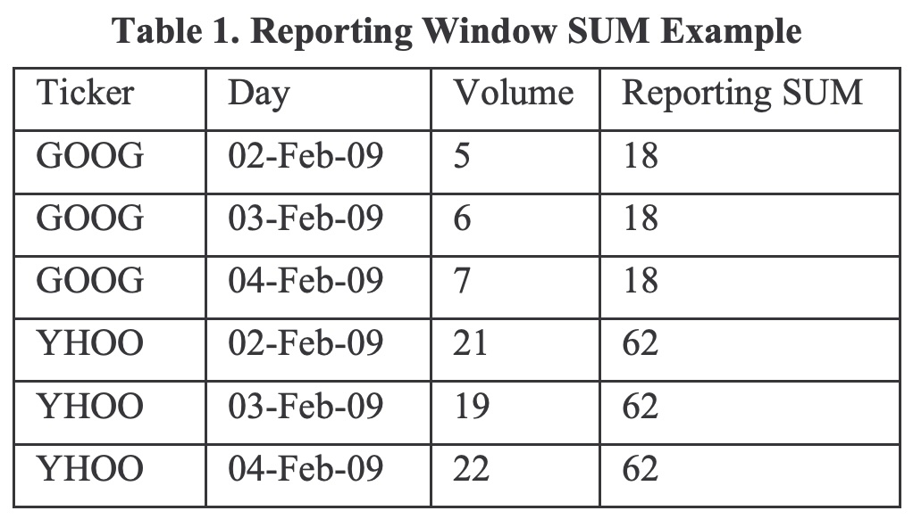
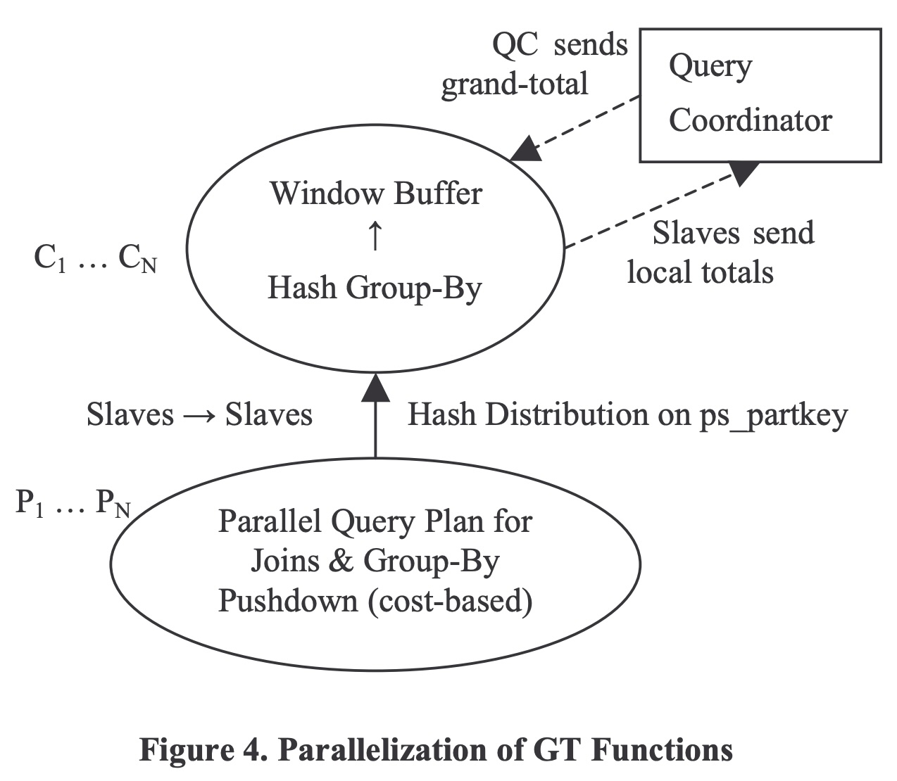
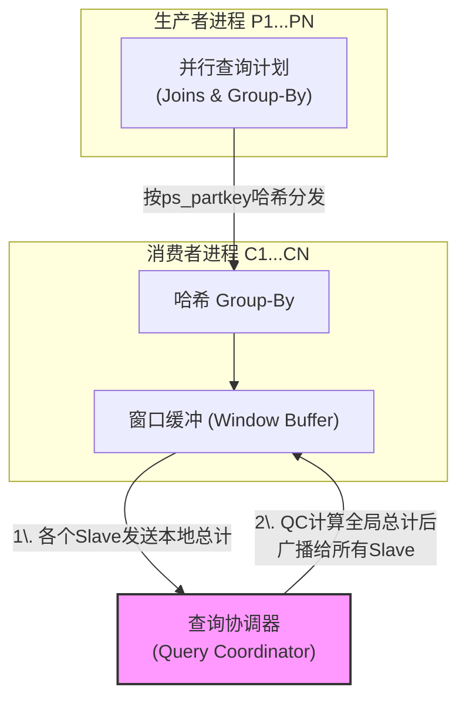
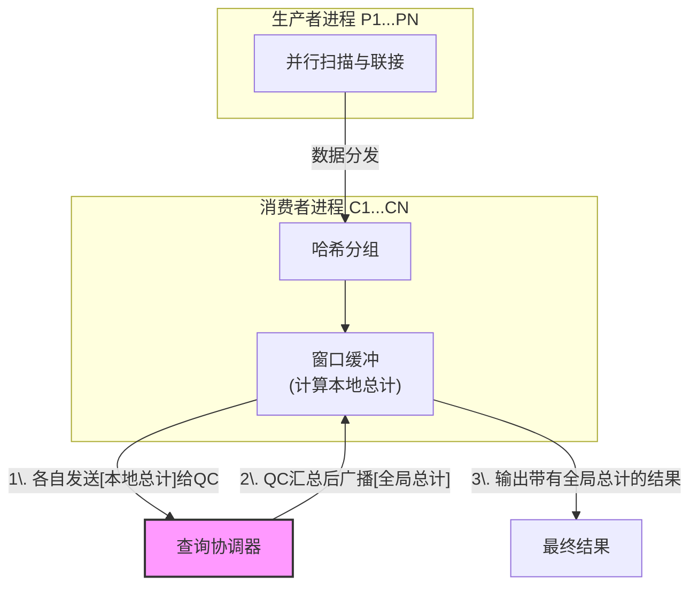
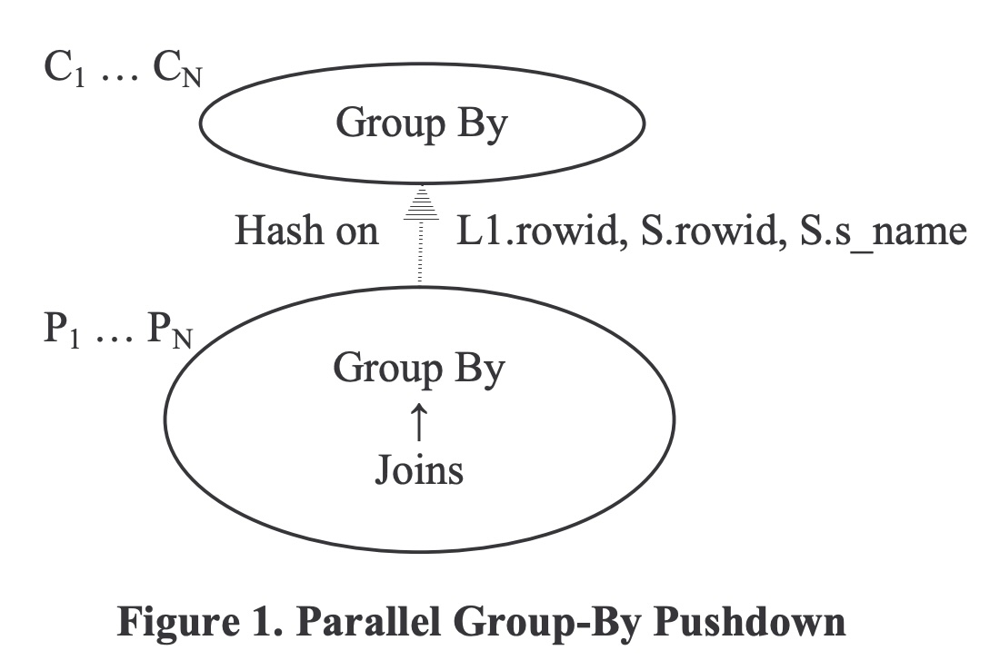
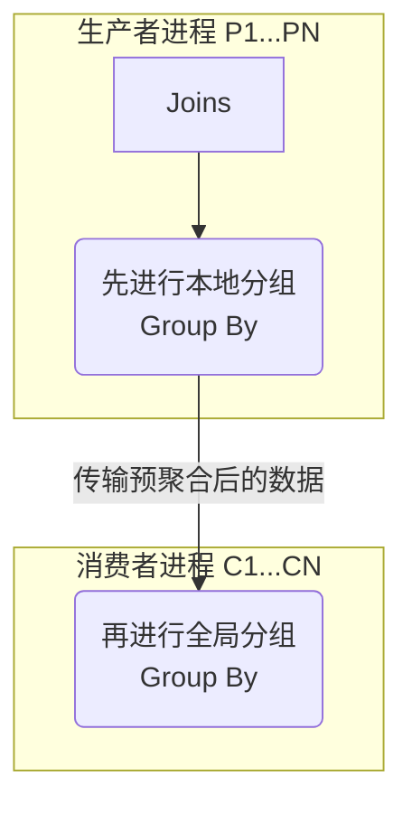

## AI论文解读 | Enhanced Subquery Optimizations In Oracle
        
### 作者        
digoal        
        
### 日期        
2025-10-05        
        
### 标签        
PostgreSQL , PolarDB , DuckDB , AI , 论文解读        
        
----        
        
## 背景  
      
https://liuyehcf.github.io/resources/paper/Enhanced-Subquery-Optimizations-in-Oracle.pdf        
  
提示:          
```          
读懂《Enhanced Subquery Optimizations In Oracle》这篇论文需要提前掌握哪些基础知识, 请使用中文通熟易懂的讲解这些基础知识, 可以引用论文中的图、表或使用Markdown支持的图形(text,mermaid等)增加解释性. 
  
使用中文通熟易懂的解读《Enhanced Subquery Optimizations In Oracle》这篇论文, 其中的关键内容请着重讲解, 可以引用论文中的图、表或使用Markdown支持的图形(text,mermaid等)增加解释性. 
  
提取《Enhanced Subquery Optimizations In Oracle》这篇论文中的重要术语, 使用中文对这些术语进行通熟易懂的讲解, 可以引用论文中的图、表或使用Markdown支持的图形(text,mermaid等)增加解释性. 
```     
  
## 1 前置知识 
  
好的，为了帮助您更好地理解《Enhanced Subquery Optimizations in Oracle》这篇专业论文，我将为您梳理阅读该论文所需的基础知识，并结合论文中的图表和概念，用中文进行通俗易懂的讲解。

这篇论文主要面向数据库内核开发者、研究人员或资深的数据库管理员（DBA），它深入探讨了Oracle数据库内部用于提升复杂SQL查询（特别是包含子查询的查询）性能的几种高级技术。

以下是您需要掌握的核心基础知识：

### 1\. SQL与关系型数据库基础

这是最根本的基础。您需要熟悉标准的SQL语言以及关系型数据库的基本工作原理。

  * **基本SQL语法**: 熟悉`SELECT`, `FROM`, `WHERE`, `GROUP BY`, `HAVING`等子句的用途。
  * **联接 (Join)**: 理解`INNER JOIN`（内联接）和`OUTER JOIN`（外联接）的区别。这篇论文中频繁提到更特殊的联接类型，如**半联接 (Semijoin)** 和 **反联接 (Antijoin)**，它们通常是子查询优化后的产物。
      * **半联接 (Semijoin)**：返回左表中能与右表匹配的行，但不像内联接那样会因为右表有多行匹配而重复左表的行。常用于优化`EXISTS`子查询。
      * **反联接 (Antijoin)**：返回左表中在右表中*没有*匹配的行。常用于优化`NOT EXISTS`子查询 。

### 2\. SQL子查询 (Subquery)

这是论文的核心主题。您需要深刻理解子查询的种类和执行方式。

  * **什么是子查询**: 一个嵌套在另一个SQL查询（主查询）中的查询。论文提到，子查询可以出现在`SELECT`, `FROM`, `WHERE`, `HAVING`等多个子句中 。
  * **相关子查询 (Correlated Subquery)** vs. **非相关子查询 (Uncorrelated Subquery)**：
      * **非相关子查询**：可以独立于主查询执行，其结果只需计算一次。
      * **相关子查询**：其执行依赖于主查询中的值（例如，`WHERE T2.y = T1.y` ），理论上主查询的每一行都要重新计算一次子查询。这是性能瓶颈的主要来源。
  * **子查询的性能问题**: 论文指出，如果一个相关子查询没有被“解嵌套”（unnested），它就会被多次重复评估，类似于效率低下的嵌套循环（Nested-Loop）执行方式 。

### 3\. 数据库查询优化基础

理解这篇论文的前提是，您需要知道数据库并不是直接执行您写的SQL，而是会先进行“优化”。

  * **查询优化器 (Query Optimizer)**: 数据库中负责为一条SQL语句生成最优执行计划的组件。
  * **执行计划 (Execution Plan)**: 数据库执行一条SQL语句的具体步骤，例如先访问哪个表、使用哪种联接算法（哈希、排序合并等）、是否使用索引等。
  * **基于成本的优化 (Cost-Based Optimization, CBO)**: Oracle优化器通过估算不同执行计划的“成本”（CPU、I/O等资源的消耗），来选择成本最低的那个计划 。
  * **查询转换/查询重写 (Query Transformation/Rewrite)**: 这是这篇论文所有技术的核心思想。优化器会把用户写的SQL语句，在逻辑等价的前提下，重写成一种可能性能更好的形式。论文中提到的**子查询解嵌套 (Subquery Unnesting)** 、**子查询合并 (Subquery Coalescing)** 、**视图合并 (View Merging)** 等都属于查询转换。

### 4\. 高级SQL：窗口函数 (Window Functions)

这是理解论文第4节“使用窗口函数移除子查询”的关键。Oracle中也称其为“分析函数 (Analytic Functions)” 。

  * **基本概念**: 窗口函数可以对一组与当前行相关的行（这个“组”被称为窗口）进行计算。它与`GROUP BY`聚合的区别在于，它为每一行都返回一个结果，而不是像`GROUP BY`那样将多行合并为一行。
  * **语法**: 核心是`OVER()`子句，它定义了窗口的范围。
      * `OVER (PARTITION BY ...)`: 定义了如何对数据进行分组（分区），窗口函数在每个分区内独立计算。
      * `OVER (ORDER BY ...)`: 定义了分区内数据的排序方式。
  * **报表窗口函数 (Reporting Window Functions)**: 论文特别介绍了一类窗口函数，它们为分区内的每一行报告该分区*全体*的聚合值 。一个典型的例子是，当`OVER()`子句中只有`PARTITION BY`而没有`ORDER BY`时。

为了帮助理解，我们可以看一下论文中**表1**的例子 ：   

**原始数据 (stocks表)**

| Ticker | Day | Volume |
| :--- | :--- | :--- |
| GOOG | 02-Feb-09 | 5 |
| GOOG | 03-Feb-09 | 6 |
| GOOG | 04-Feb-09 | 7 |
| YHOO | 02-Feb-09 | 21 |
| YHOO | 03-Feb-09 | 19 |
| YHOO | 04-Feb-09 | 22 |

执行以下带窗口函数的SQL：

```sql
SELECT ticker, day, volume,
       SUM(volume) OVER (PARTITION BY ticker) AS "Reporting SUM"
FROM stocks;
```

**结果**
| Ticker | Day | Volume | Reporting SUM |
| :--- | :--- | :--- | :--- |
| GOOG | 02-Feb-09 | 5 | **18** |
| GOOG | 03-Feb-09 | 6 | **18** |
| GOOG | 04-Feb-09 | 7 | **18** |
| YHOO | 02-Feb-09 | 21 | **62** |
| YHOO | 03-Feb-09 | 19 | **62** |
| YHOO | 04-Feb-09 | 22 | **62** |

可以看到，`Reporting SUM`列为`GOOG`分区的所有行都返回了该分区的总和18 (5+6+7)，为`YHOO`分区的所有行返回了总和62 (21+19+22)。论文中的技术就是利用这种能力，将原本需要子查询才能计算的总量，用窗口函数一次性计算出来，从而消除子查询。

### 5\. 并行计算与数据库并行执行

这是理解论文第5节“可扩展的并行执行”的基础。

  * **基本概念**: 将一个大的计算任务（如全表扫描、大规模联接）分割成多个小任务，交给多个CPU进程（论文中称为“slaves”）同时处理，最后汇总结果，以加快处理速度。
  * **生产者-消费者模型**: 论文中描述了并行执行的一种常见模式。一组进程（生产者）负责读取和初步处理数据，然后通过网络将中间结果分发给另一组进程（消费者）进行后续处理（如聚合、排序） 。
  * **数据分发**: 决定哪个数据发给哪个消费者进程的方式，通常基于哈希（Hash）或范围（Range）分发。

论文中的**图4**  展示了一种新颖的并行计算模式，用于优化没有`PARTITION BY`的“全局总计（Grand-Total）”窗口函数：    



这个图的核心思想是：

1.  消费者进程（C1...CN）各自计算自己分片数据的“本地总计” 。
2.  它们将这个很小的本地总计结果发送给主控的查询协调器（QC） 。
3.  QC汇总所有本地总计，得到“全局总计”，然后将这个最终结果广播回所有的消费者进程 。
4.  消费者进程用收到的全局总计来填充自己缓冲的数据行，然后输出结果 。
    这个方法避免了将所有数据都发送到一个进程进行串行计算的瓶颈 ，极大地提升了这类计算的可扩展性。

### 6\. SQL中NULL值的特殊处理

这是理解论文第6节“空值感知反联接 (Null-Aware Anti Join, NAAJ)”的基础。

  * **三值逻辑 (Ternary Logic)**: 在SQL中，逻辑运算的结果不只有`TRUE`和`FALSE`，还有`UNKNOWN`。任何与`NULL`值的比较（如 `5 = NULL`, `5 <> NULL`, `NULL = NULL`）结果都是`UNKNOWN` 。
  * **WHERE子句的行为**: `WHERE`子句只会保留计算结果为`TRUE`的行，`FALSE`和`UNKNOWN`的行都会被过滤掉 。
  * **`NOT IN`子查询的陷阱**: 如果`NOT IN`的子查询结果列表中包含任何`NULL`值，那么整个`NOT IN`条件对于主查询的任何行（即使是非`NULL`行）都会变成`UNKNOWN`，导致主查询不返回任何结果。这是初学者常犯的错误，也是为什么需要特殊联接（NAAJ）来正确处理这种情况的原因。

### 总结

要读懂这篇论文，您需要具备的知识体系如下：

1.  **扎实的SQL功底**：特别是对各种子查询和联接的理解。
2.  **数据库原理知识**：理解查询优化器、执行计划和基于成本的优化思想。
3.  **高级SQL技能**：必须熟练掌握窗口函数的概念和用法。
4.  **并行计算概念**：了解数据库如何利用多核/多节点能力来加速查询。
5.  **对NULL的深刻理解**：明白`NULL`在SQL比较中的特殊行为。

掌握了这些基础之后，您就能更好地理解论文中提出的“子查询合并”、“视图消除”、“用窗口函数移除子查询”以及“空值感知反联接”等高级优化技术背后的原理和价值。
  
## 2 解读论文 
  
好的，这篇名为《Enhanced Subquery Optimizations in Oracle》的论文，深入探讨了Oracle数据库为提升复杂SQL查询效率而采用的几种高级优化技术 。这些技术的核心思想是，通过逻辑上等价的“查询重写”，将用户编写的、执行效率可能较低的SQL语句，转换为一种对数据库优化器更友好、执行速度更快的形式 。

下面，我将为您通俗地解读论文中的几个关键内容。

### 核心思想：查询转换 (Query Transformation)

在深入具体技术之前，需要理解一个核心概念：**查询转换**。当您向Oracle提交一条复杂的SQL（特别是包含子查询的SQL）时，Oracle并不会直接执行它。它的“查询优化器”会尝试多种不同的执行路径 。其中非常重要的一步就是“查询转换”，即把原始SQL改写成功能完全相同但结构不同的新SQL 。Oracle会估算原始查询和多种转换后查询的执行“成本”，并选择成本最低的那个版本来执行 。这篇论文介绍的技术，就是Oracle优化器“工具箱”里几种强大的转换工具。

-----

### 1\. 子查询合并 (Subquery Coalescing)

**解决的问题**：当一个查询的`WHERE`子句中包含多个结构相似的子查询时，数据库可能会对同一个或相似的数据集进行多次重复的扫描和计算，造成性能浪费。

**核心技术**：子查询合并技术旨在识别出这些冗余的子查询，并将它们合并成一个，从而将多次表访问和联接评估减少到一次 。

**论文中的例子 (TPC-H Query 21简化版)**：

假设有一个查询Q4，它需要找出满足两个条件的供应商：

1.  至少在另一张订单中也出现过（`EXISTS`子句）。
2.  并且在所有其他订单中，没有出现“发货日期晚于承诺日期”的情况（`NOT EXISTS`子句）。

**原始查询 (Q4)**:

```sql
SELECT s_name
FROM supplier, lineitem L1
WHERE s_suppkey = L1.l_suppkey
  AND EXISTS (SELECT * FROM lineitem L2 -- 条件1: 存在其他订单
              WHERE L2.l_orderkey = L1.l_orderkey
                AND L2.l_suppkey <> L1.l_suppkey)
  AND NOT EXISTS (SELECT * FROM lineitem L3 -- 条件2: 不存在发货晚的订单
                  WHERE L3.l_orderkey = L1.l_orderkey
                    AND L3.l_suppkey <> L1.l_suppkey
                    AND L3.l_receiptdate > L3.l_commitdate);
```

这个查询访问了三次`lineitem`表（L1, L2, L3），效率很低。

**合并后的查询 (Q5)**:
Oracle可以将这两个子查询合并成一个，利用`HAVING`子句中的聚合函数来同时模拟`EXISTS`和`NOT EXISTS`的行为。

```sql
SELECT s_name
FROM supplier, lineitem L1
WHERE s_suppkey = L1.l_suppkey
  AND EXISTS (SELECT 1
              FROM lineitem L2
              WHERE L2.l_orderkey = L1.l_orderkey
                AND L2.l_suppkey <> L1.l_suppkey
              HAVING SUM(CASE WHEN l_receiptdate > l_commitdate
                              THEN 1 ELSE 0 END) = 0); -- 用SUM模拟NOT EXISTS
```

**解读**：

  * 合并后的查询只访问了两次`lineitem`表（L1, L2），减少了一次全表扫描 。
  * `HAVING`子句中的`SUM(...) = 0`巧妙地实现了`NOT EXISTS`的逻辑：它计算所有匹配行中“发货晚”的数量，如果这个数量为0，条件才成立 。
  * 这样，一次子查询就完成了原来两次子查询的工作，大大提升了效率。

-----

### 2\. 使用窗口函数移除子查询 (Subquery Removal using Window Functions)

**解决的问题**：很多查询需要将单行的值与该行所在分组的聚合值进行比较（例如，某员工的工资是否高于其部门的平均工资）。传统写法通常需要使用子查询，这会导致对同一张表的多次访问。

**核心技术**：利用SQL的窗口函数（在Oracle中也叫分析函数）来替代子查询 。窗口函数可以在一次表扫描中，同时计算出每一行的明细值和它所在分组的聚合值，从而避免了子查询和表的自我联接 。

**论文中的例子 (TPC-H Query 15简化版)**：

假设有一个查询Q17，需要找到收入最高的供应商 。它首先用一个视图（WITH子句）计算出每个供应商的总收入，然后在主查询中再次查询这个视图，找出收入等于最大收入的记录。

**原始查询 (Q17)**:

```sql
WITH V AS (
  SELECT l_suppkey, SUM(l_extendedprice) AS revenue
  FROM lineitem
  GROUP BY l_suppkey
)
SELECT s_suppkey, s_name, V.revenue
FROM supplier, V
WHERE s_suppkey = V.l_suppkey
  AND V.revenue = (SELECT MAX(V.revenue) FROM V); -- 找出最大收入的子查询
```

这个查询对视图`V`访问了两次。

**移除子查询后的查询 (Q18)**:
Oracle可以使用一个没有`PARTITION BY`的“全局总计（Grand-Total）”窗口函数`MAX(...) OVER ()`，在计算每个供应商收入的同时，也计算出所有供应商中的最高收入。

```sql
SELECT s_suppkey, s_name, V.revenue
FROM supplier,
     (SELECT l_suppkey,
             SUM(l_extendedprice) AS revenue,
             MAX(SUM(l_extendedprice)) OVER () AS gt_rev -- 全局最大收入
      FROM lineitem
      GROUP BY l_suppkey) V
WHERE s_suppkey = V.l_suppkey
  AND V.revenue = V.gt_rev; -- 直接比较，无需子查询
```

**解读与可视化**：
为了更形象地理解，我们来看论文中**表1**所展示的“报表窗口函数” 。假设我们要计算每只股票每日成交量占该股票总成交量的比例。   

**使用窗口函数 `SUM(volume) OVER (PARTITION BY ticker)` 后的中间结果**:

| Ticker | Day | Volume | Reporting SUM (股票总成交量) |
| :--- | :--- | :--- | :--- |
| GOOG | 02-Feb-09 | 5 | **18** |
| GOOG | 03-Feb-09 | 6 | **18** |
| GOOG | 04-Feb-09 | 7 | **18** |
| YHOO | 02-Feb-09 | 21 | **62** |
| YHOO | 03-Feb-09 | 19 | **62** |
| YHOO | 04-Feb-09 | 22 | **62** |

如上表所示，`Reporting SUM`这一列通过窗口函数一次性计算出来，并添加到了每一行。这样，我们就可以直接在`WHERE`子句中进行比较，而无需再用一个子查询去单独计算总和 。这种优化对于复杂的分析和报表查询（OLAP）至关重要 。

-----

### 3\. 可扩展的并行执行 (Scalable Parallel Execution)

**解决的问题**：对于上面提到的“全局总计”窗口函数（如`MAX(...) OVER()`），由于它没有分区键（PBY keys），传统并行计算方法难以扩展 。所有数据都必须汇总到一个进程中进行计算，形成性能瓶颈 。

**核心技术**：论文提出了一种新颖的并行化方案，它通过一个简短的协调步骤，将大部分计算工作下推到并行执行的“从属”进程（slaves）中 。

**执行流程（基于论文图4的解读）** ：    



1.  **分而治之**：多个消费者进程（C1...CN）并行处理数据的不同部分，并各自计算出一个“本地总计” 。
2.  **轻量级协调**：每个进程只将这个很小的本地总计值发送给查询协调器（QC） 。
3.  **全局计算与广播**：QC将收到的所有本地总计进行最终汇总，得到“全局总计”，然后把这个单一的最终结果广播回所有消费者进程 。
4.  **完成输出**：消费者进程接收到全局总计后，将其应用到它们各自缓冲的数据行上，并输出最终结果 。

这个方案的巧妙之处在于，只有极少量的数据（各个进程的本地总计）需要在协调器上进行串行处理，而海量数据的缓冲和处理都在并行进程中完成，因此整个查询的执行性能可以随着CPU核数的增加而线性提升，实现了高可扩展性 。

-----

### 4\. 空值感知反联接 (Null-Aware Anti-Join, NAAJ)

**解决的问题**：在SQL中，`NOT IN (subquery)` 或 `<> ALL (subquery)` 是一种常见的写法，但当子查询的结果中包含`NULL`时，它的行为会变得非常奇怪，通常会导致整个查询不返回任何结果，不符合用户的直观预期。这是因为任何与`NULL`的比较，结果都是“未知(UNKNOWN)”，而不是`TRUE`或`FALSE` 。常规的反联接（Anti-Join）无法正确处理这种情况 。

**核心技术**：Oracle引入了一种特殊的联接算法 —— **空值感知反联接（NAAJ）** ，来正确地解嵌套这类包含`NULL`值的`<> ALL`子查询 。

**NAAJ算法的关键语义** ：

  * **规则1 (右侧为空)**：如果子查询（联接的右侧）不返回任何行，那么主查询（左侧）的所有行都被返回。这和常规反联接相同。
  * **规则2 (右侧含NULL)**：如果子查询的结果中**任何一行**在参与比较的列上为`NULL`，则主查询**不返回任何行**。这精确地模拟了`<> NULL`导致整个条件变为“未知”并被过滤掉的行为。
  * **规则3 (左侧含NULL)**：如果主查询的某行在比较列上为`NULL`，则该行不被返回。
  * **规则4 (常规比较)**：对于主查询的某一行，如果它与子查询的**任何一行**匹配（相等），则该行不被返回。

简单来说，NAAJ在执行反联接时，会特别检查`NULL`的存在。只要子查询结果中可能出现`NULL`，它就会触发特殊的过滤规则（特别是规则2），以保证转换后的查询与原始`<> ALL`子查询在`NULL`语义上完全等价。这使得优化器可以安全地将这类子查询转换为更高效的联接操作，而不用担心`NULL`值导致错误的结果。
  
## 3 术语 
  
好的，这篇论文《Enhanced Subquery Optimizations in Oracle》包含了一些数据库优化领域的关键术语。下面我将用中文对这些重要术语进行通俗易懂的讲解，并引用论文中的内容和图示来帮助理解。

### 1\. 查询转换 (Query Transformation)

  * **讲解**：查询转换是数据库优化器的一种核心技术 。它指的不是直接执行用户写的SQL语句，而是在保证逻辑结果完全等价的前提下，将原始SQL语句重写（转换）成另一种形式 。这样做的目的是为了生成一个执行效率更高、成本更低的执行计划 。Oracle的查询转换可以是基于固定规则的（启发式），也可以是基于成本的，即同时估算转换前后的执行成本，选择更优的版本 。
  * **论文中的关联**：本文介绍的所有技术，如子查询合并、视图消除、使用窗口函数移除子查询等，都属于查询转换的范畴 。

### 2\. 子查询解嵌套 (Subquery Unnesting)

  * **讲解**：这是一个非常重要的查询转换技术 。当一个子查询（特别是与主查询相关的子查询）没有被“解嵌套”时，数据库可能会像执行嵌套循环一样，主查询每处理一行，就要重新执行一次子查询，效率极低 。解嵌套的目的就是将子查询从主查询的`WHERE`子句中“提”出来，转换成一个等价的联接（Join）操作 。
  * **转换后的形式**：
      * `EXISTS`子查询通常被转换为**半联接 (Semijoin)**。
      * `NOT EXISTS`子查询通常被转换为**反联接 (Antijoin)** 。
  * **论文中的关联**：解嵌套是很多后续优化的基础。例如，论文中提到的`IN`子查询在解嵌套后会生成一个内联视图（inline view），这个视图随后可能被进一步优化或消除 。

### 3\. 窗口函数 (Window Functions)

  * **讲解**：窗口函数（在Oracle文档中也称为“分析函数” ）是一种特殊的函数，它可以对一组与当前行相关的行（即“窗口”）进行计算，但与`GROUP BY`不同，它不会将多行压缩成一行，而是为每一行都返回一个计算结果 。

  * **语法核心**：`OVER (PARTITION BY ... ORDER BY ...)`子句，其中`PARTITION BY`用于定义分组，`ORDER BY`用于组内排序 。

  * **报表窗口函数 (Reporting Window Functions)**：这是论文中重点利用的一类窗口函数 。它指那些能为分区内的**每一行**都报告该分区**整体**聚合值的函数 。通常当`OVER()`子句中没有`ORDER BY`时，聚合函数就具有这种特性 。

      * **示例（源自论文表1）** ：计算每支股票每日成交量及其对应的股票总成交量。    
        ```sql
        SELECT ticker, day, volume,
               SUM(volume) OVER (PARTITION BY ticker) AS "Reporting SUM"
        FROM stocks;
        ```
        **结果**：

        | Ticker | Day | Volume | Reporting SUM |
        | :--- | :--- | :--- | :--- |
        | GOOG | 02-Feb-09 | 5 | **18** |
        | GOOG | 03-Feb-09 | 6 | **18** |
        | GOOG | 04-Feb-09 | 7 | **18** |
        | YHOO | 02-Feb-09 | 21 | **62** |
        | YHOO | 03-Feb-09 | 19 | **62** |
        | YHOO | 04-Feb-09 | 22 | **62** |

      * **全局总计函数 (Grand-Total, GT Functions)**：当报表窗口函数连`PARTITION BY`都没有时（即`OVER()`为空），它计算的是所有行的总计值 。

### 4\. 子查询合并 (Subquery Coalescing)

  * **讲解**：这是一种将两个或多个子查询合并成一个子查询的技术，目的是减少对表的重复访问和联接评估 。
  * **适用条件**：当多个子查询在结构上相同或存在包含关系时，可以进行合并 。例如，当`WHERE`子句中用`AND`连接一个`EXISTS`子查询和一个`NOT EXISTS`子查询，且两者高度相似时 。
  * **论文中的关联**：论文第2节详细讨论了此技术，通过一个`HAVING`子句中的聚合函数，巧妙地将`EXISTS`和`NOT EXISTS`的逻辑合并到了一个子查询中，从而减少了一次对`lineitem`表的访问 。

### 5\. 过滤联接 (Filtering Join)

  * **讲解**：这是一种特殊的联接，它或者是一个半联接，或者是一个发生在唯一列（unique column）上的等值内联接 。它的特点是，对于参与联接的其中一个表（非唯一列所在的表），其结果行数只会被过滤（变少）或保持不变，而绝不会被复制（变多） 。
  * **论文中的关联**：论文第3.1节的“视图消除”技术就利用了过滤联接的特性。在查询Q10中，视图V1和V2都与`orders`表进行联接，且联接键是视图中的唯一列（分组键`o_orderkey`） 。由于V2的过滤条件比V1更严格，优化器可以判定V1的联接是多余的，因此可以安全地消除V1，从而减少了一次视图计算 。

### 6\. 分组下推 (Group-by Pushdown, GPD)

  * **讲解**：这是一种并行查询优化技术 。在并行执行`GROUP BY`查询时，与其将所有原始数据都在网络上传输汇集到一组“消费者”进程中再进行分组聚合，不如让负责读取数据的“生产者”进程先在本地进行一次预聚合（Partial Group-by） 。这样，跨网络传输的数据量就从原始的明细数据，减少为预聚合后的结果数据，从而大大降低了通信成本，提升了并行查询的扩展性 。
  * **图示（基于论文图1）** ：    




### 7\. 空值感知反联接 (Null-Aware Anti-Join, NAAJ)

  * **讲解**：这是一种特殊变种的反联接（Anti-Join），专门用于正确处理`<> ALL`（或`NOT IN`）这类子查询中可能出现`NULL`值的情况 。
  * **问题背景**：在标准SQL中，任何与`NULL`的比较，结果都是“未知 (UNKNOWN)” 。如果`<> ALL`的子查询结果中包含`NULL`，会导致整个条件对任何外部行都返回“未知”，最终主查询不返回任何结果 。常规的反联接无法模拟这种特殊的`NULL`语义 。
  * **NAAJ的核心规则**：NAAJ算法在执行时会特别检查`NULL` 。最关键的一条是：如果联接的右侧（即子查询结果）的联接列上存在`NULL`值，则NAAJ操作将不返回任何行，从而精确地模拟了标准SQL的行为 。
  * **论文中的关联**：引入NAAJ使得Oracle优化器可以安全地将更多包含`<> ALL`的子查询“解嵌套”为高效的联接操作，而无需担心因`NULL`值导致结果错误。
  
## 参考        
         
https://liuyehcf.github.io/resources/paper/Enhanced-Subquery-Optimizations-in-Oracle.pdf    
        
<b> 以上内容基于DeepSeek、Qwen、Gemini及诸多AI生成, 轻微人工调整, 感谢杭州深度求索人工智能、阿里云、Google等公司. </b>        
        
<b> AI 生成的内容请自行辨别正确性, 当然也多了些许踩坑的乐趣, 毕竟冒险是每个男人的天性.  </b>        
  
    
#### [期望 PostgreSQL|开源PolarDB 增加什么功能?](https://github.com/digoal/blog/issues/76 "269ac3d1c492e938c0191101c7238216")
  
  
#### [PolarDB 开源数据库](https://openpolardb.com/home "57258f76c37864c6e6d23383d05714ea")
  
  
#### [PolarDB 学习图谱](https://www.aliyun.com/database/openpolardb/activity "8642f60e04ed0c814bf9cb9677976bd4")
  
  
#### [PostgreSQL 解决方案集合](../201706/20170601_02.md "40cff096e9ed7122c512b35d8561d9c8")
  
  
#### [德哥 / digoal's Github - 公益是一辈子的事.](https://github.com/digoal/blog/blob/master/README.md "22709685feb7cab07d30f30387f0a9ae")
  
  
#### [About 德哥](https://github.com/digoal/blog/blob/master/me/readme.md "a37735981e7704886ffd590565582dd0")
  
  

  
