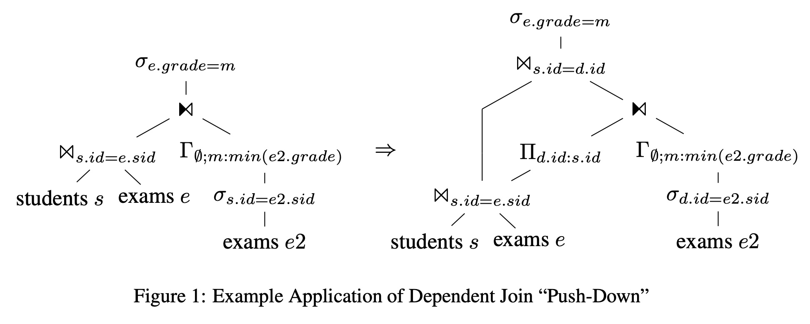
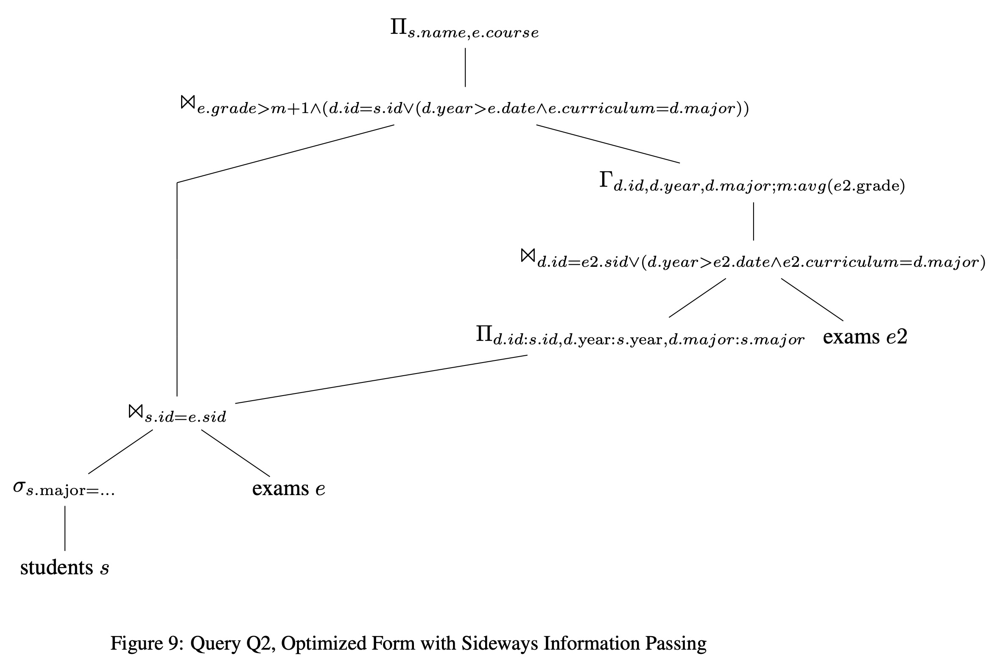
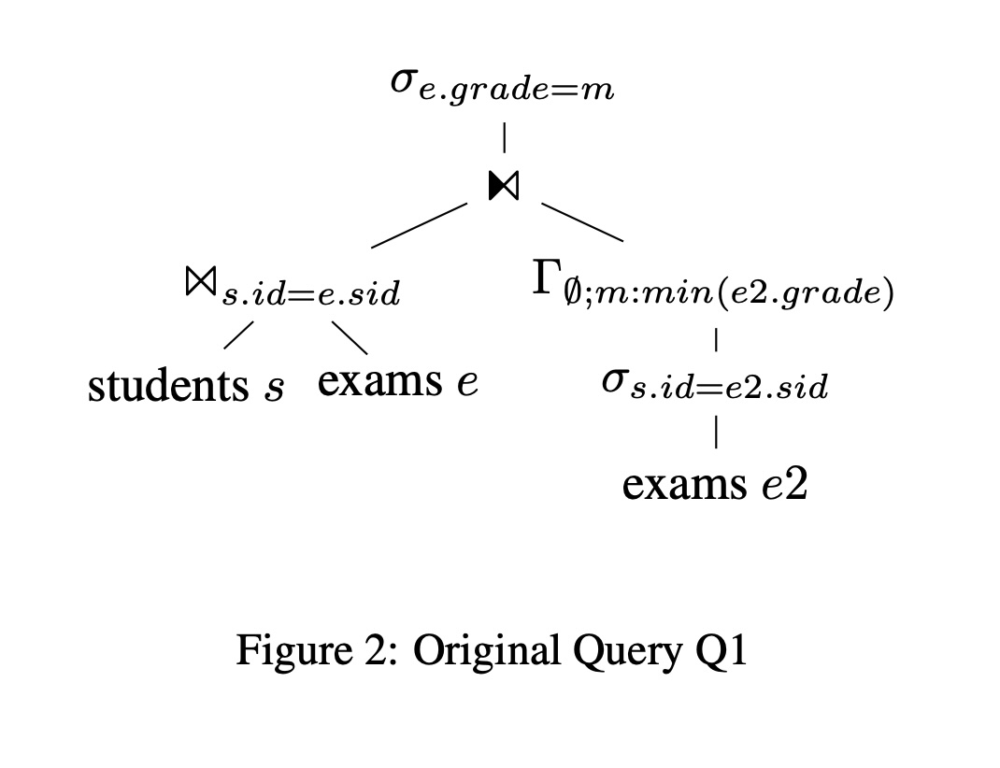
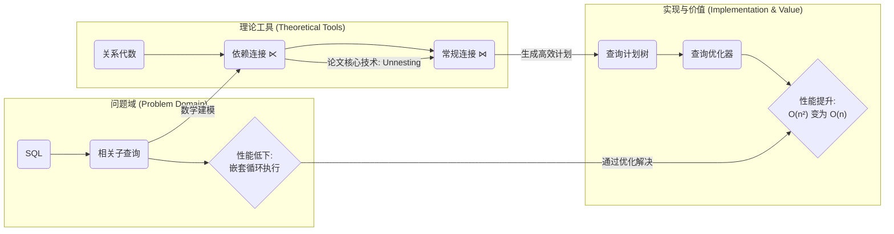
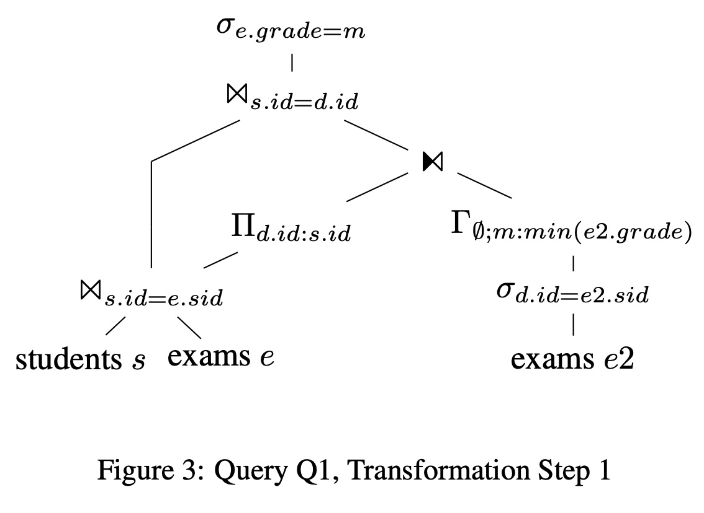
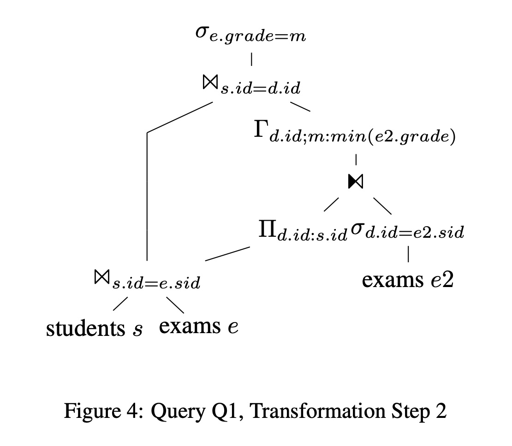
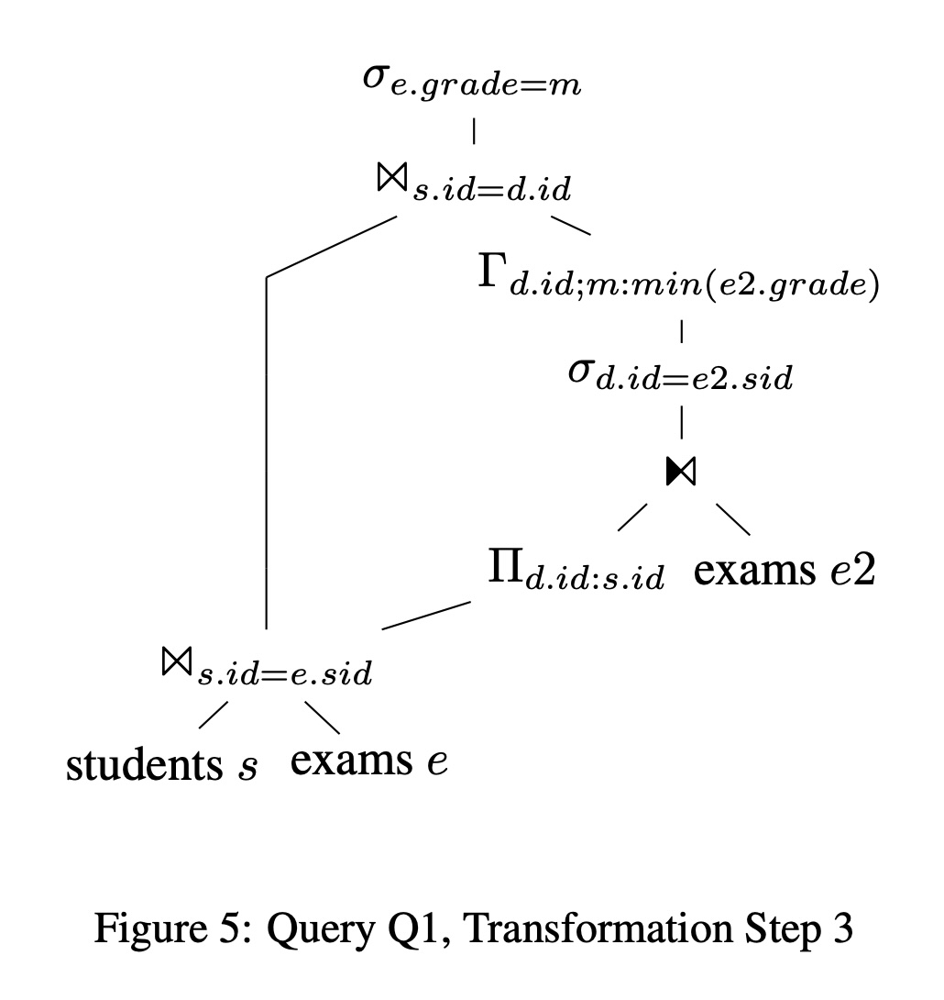
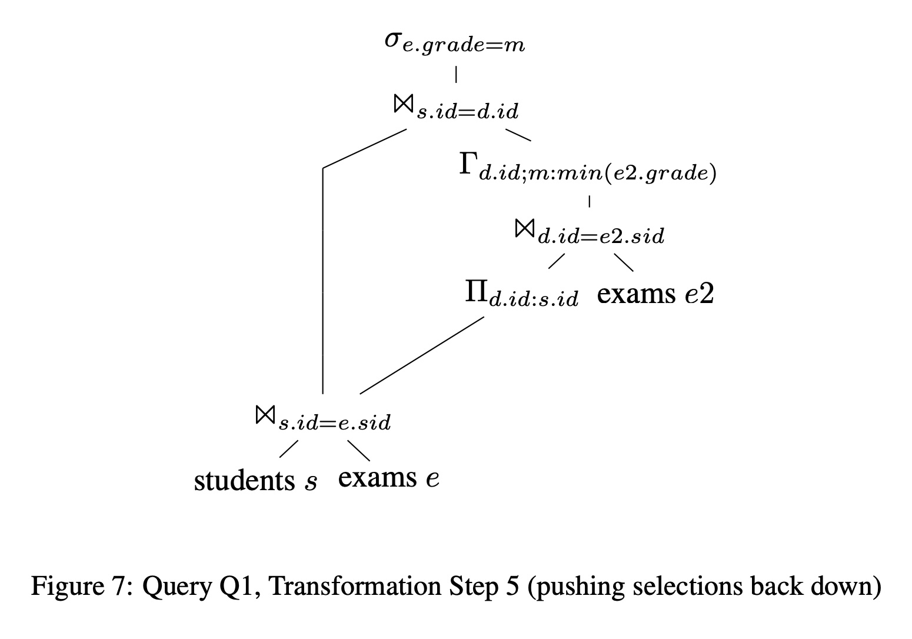
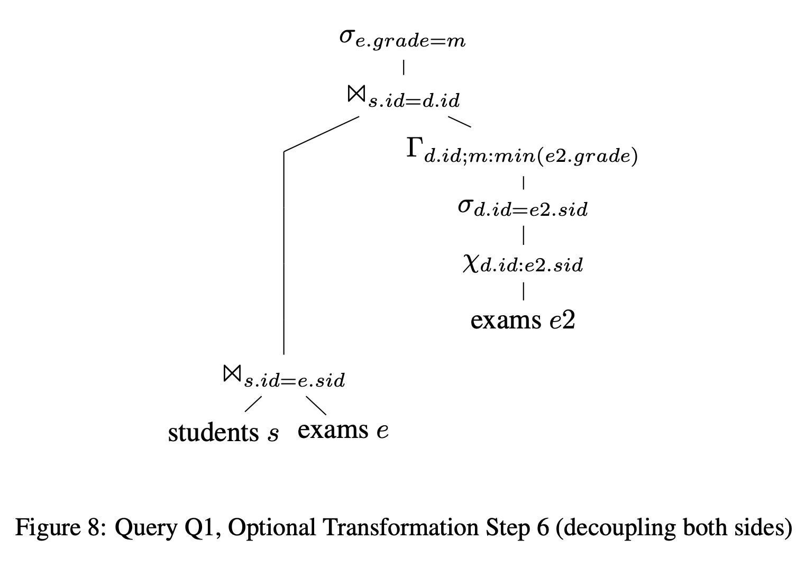

## AI论文解读 | Unnesting Arbitrary Queries
        
### 作者        
digoal        
        
### 日期        
2025-10-05        
        
### 标签        
PostgreSQL , PolarDB , DuckDB , AI , 论文解读        
        
----        
        
## 背景  
      
https://btw-2015.informatik.uni-hamburg.de/res/proceedings/Hauptband/Wiss/Neumann-Unnesting_Arbitrary_Querie.pdf        
  
提示:          
```          
读懂《Unnesting Arbitrary Queries》这篇论文需要提前掌握哪些基础知识, 请使用中文通熟易懂的讲解这些基础知识, 可以引用论文中的图、表或使用Markdown支持的图形(text,mermaid等)增加解释性. 
  
使用中文通熟易懂的解读《Unnesting Arbitrary Queries》这篇论文, 其中的关键内容请着重讲解, 可以引用论文中的图、表或使用Markdown支持的图形(text,mermaid等)增加解释性. 
  
提取《Unnesting Arbitrary Queries》这篇论文中的重要术语, 使用中文对这些术语进行通熟易懂的讲解, 可以引用论文中的图、表或使用Markdown支持的图形(text,mermaid等)增加解释性. 
```     
  
## 1 前置知识 
  
好的，为了完全理解《Unnesting Arbitrary Queries》这篇论文，您需要掌握以下三个核心领域的基础知识。我会用通俗易懂的语言，并结合论文中的例子和图表来解释。

### 1\. SQL基础，特别是“相关子查询” (Correlated Subquery)

这是理解论文要解决的“问题”本身的基础。

  * **什么是SQL？**
    SQL (Structured Query Language) 是我们用来和数据库沟通的语言，通过它我们可以查询、插入、更新或删除数据。

  * **什么是子查询 (Subquery)？**
    一个查询语句里面嵌套着另一个查询语句，里面的那个就被称为子查询。

  * **关键概念：相关子查询 (Correlated Subquery)**
    这是一种特殊的子查询，它的执行依赖于外部查询提供的值。可以把它想象成一个“需要从外面递参数进去才能运行”的函数。

    我们来看论文中的第一个例子 `Q1` ：

    ```sql
    Q1: select s.name, e.course
        from   students s, exams e
        where  s.id = e.sid and
               e.grade = (select min(e2.grade)
                          from   exams e2
                          where  s.id = e2.sid)
    ```

    在这个查询中，内部的子查询 `(select min(e2.grade) ...)` 并不是独立运行的。请注意 `where s.id = e2.sid` 这一行。这里的 `s.id` 来自于外部查询的 `students` 表。

    **执行逻辑（低效的方式）：**

    1.  外部查询先从 `students` 表和 `exams` 表中取出一对组合，例如，学生'张三'和他参加的'数据库'考试的记录。
    2.  此时，外部查询的 `s.id` (张三的学号) 会被传递给内部的子查询。
    3.  子查询利用这个 `s.id`，去 `exams` 表里找出'张三'所有考试的最低分。
    4.  然后用这个最低分和第一步中'数据库'考试的分数进行比较。
    5.  外部查询接着取出'张三'和他的'操作系统'考试的记录，然后重复步骤 2-4。
    6.  对每一个“学生-考试”组合，这个过程都要重复一遍。

    这种“逐行循环”的执行方式就是论文中提到的“依赖连接 (dependent joins)” 或 “嵌套循环 (nested loops)” ，它的执行效率非常低，时间复杂度通常是 $O(n^2)$ 。这篇论文的核心目的，就是找到一种通用的方法，把这种低效的相关子查询转换成高效的、非相关的查询。

### 2\. 关系代数 (Relational Algebra)

如果说SQL是程序员和数据库沟通的语言，那么关系代数就是数据库内部用来表示和优化查询的“数学语言”。论文中的所有转换都是在关系代数层面进行的。

  * **什么是关系代数？**
    它是一套对关系（也就是表）进行运算的理论框架。数据库在执行SQL前，会先把SQL语句翻译成一个由关系代数运算符组成的“查询计划树”。

  * **核心运算符：**
    | 运算符 | 符号 | 含义 |
    | :--- | :--- | :--- |
    | **选择 (Selection)** | $\sigma$ | 相当于 SQL 的 `WHERE` 子句，用来筛选行。 |
    | **投影 (Projection)** | $\Pi$ | 相当于 SQL 的 `SELECT` 子句，用来选择列。 |
    | **连接 (Join)** | $\Join$ | 相当于 SQL 的 `JOIN`，用来合并两个表。 |
    | **分组/聚合 (Group By)** | $\Gamma$ | 相当于 SQL 的 `GROUP BY` 和聚合函数（如 `min`, `avg`）。 |

  * **论文中的关键运算符：依赖连接 (Dependent Join)**
    论文定义了一个特殊运算符 $\ltimes$ 来精确描述“相关子查询”的行为 。

      * **常规连接 $T_1 \Join_p T_2$** ： $T_1$ 和 $T_2$ 是独立的，数据库可以分别计算它们，然后根据条件 $p$ 将它们连接起来。
      * **依赖连接 $T_1 \ltimes_p T_2$** ： $T_2$ 的计算依赖于 $T_1$ 的每一行。这意味着对于 $T_1$ 中的每一条记录 $t_1$ ，都必须重新计算一次 $T_2(t_1)$ ，然后再进行连接。这正是前面提到的低效执行方式的数学表达。

    论文的目标就是通过一系列代数等价变换，将查询计划中的 $\ltimes$ 运算符全部消除，替换为高效的 $\Join$ 运算符。

### 3\. 数据库查询处理与优化 (Query Processing and Optimization)

这部分知识能帮助你理解论文所做工作的“价值”和“意义”。

  * **查询计划 (Query Plan)**
    当数据库收到一条SQL时，它不会直接执行，而是会先生成一个执行计划，这个计划就是由关系代数运算符组成的树状结构。论文中的 **图1 (Figure 1)** 到 **图9 (Figure 9)** 都是查询计划的可视化表示。      

    例如，**图2 (Figure 2)**  展示了查询 `Q1` 最初的、未经优化的查询计划。你可以看到它包含一个依赖连接（用一个带箭头的 $\Join$ 符号表示）。  

    ```mermaid
    graph TD
        A[σ e.grade=m] --> B(⋈)
        C[⋈ s.id=e.sid] --> B
        C --> D[students s]
        C --> E[exams e]
        F["Γ ∅;m:min(e2.grade)"] --> B
        G[σ s.id=e2.sid] --> F
        H[exams e2] --> G
    ```

    图2 的简化文本表示      

    这个计划树清晰地展示了右侧的子树（计算最低分）依赖于左侧 `students s` 的 `s.id`。

  * **查询优化器 (Query Optimizer)**
    这是数据库系统的大脑。它的工作就是分析所有可能的查询计划，并利用各种规则（比如这篇论文提出的“Unnesting”规则）进行等价变换，最终找出一个成本最低、执行效率最高的计划。

  * **连接算法 (Join Algorithms)**
    理解不同连接算法的效率差异，是理解“Unnesting”重要性的关键。

      * **嵌套循环连接 (Nested Loop Join)**：这是最朴素的算法，对应了依赖连接的执行方式。对于外表的每一行，扫描整个内表。效率极低，约为 $O(n^2)$ 。
      * **哈希连接 (Hash Join)**：通过建立哈希表，可以非常高效地完成等值连接。在内存充足的情况下，效率很高，约为 $O(n)$ 。

    论文提出的“Unnesting”技术，本质上就是通过代数转换，将一个必须用“嵌套循环连接”执行的查询计划，变成一个可以用“哈希连接”等高效算法执行的计划，从而实现“几个数量级”的性能提升 。

### 总结

为了读懂这篇论文，你需要掌握的知识可以用以下流程图来概括：



简单来说，论文用**关系代数**作为工具，提出了一套通用的**查询计划转换规则**，其目标是将所有低效的**相关子查询**（在代数中表示为**依赖连接**）转换成可以被数据库高效执行的普通连接查询，从而大幅提升查询性能。
  
## 2 解读论文 
  
好的，这篇名为《Unnesting Arbitrary Queries》（任意查询的非嵌套化）的论文，提出了一种通用的、强大的方法，旨在解决SQL中一个长期存在的性能难题： **相关子查询（correlated subqueries）** 。

接下来，我将为您深入浅出地解读这篇论文的核心思想与关键技术。

### 核心问题：相关子查询为何是“性能杀手”？

在SQL中，嵌套子查询能让复杂的逻辑表达起来更简单 。但如果子查询与外部查询相关联，数据库在执行时往往会采用一种非常低效的方式，称为“依赖连接”（dependent join），其实质就是嵌套循环（nested loop） 。

**以论文中的 `Q1` 为例：**
查询目标是为每个学生找到他/她分数最好（最低分）的考试 。

```sql
Q1: select s.name, e.course
    from   students s, exams e
    where  s.id = e.sid and
           e.grade = (select min(e2.grade)
                      from   exams e2
                      where  s.id = e2.sid)
```

这个查询的直观执行逻辑是：

1.  外部查询从 `students` 和 `exams` 表中取出每一条“学生-考试”记录。
2.  对于 **每一条** 记录，都要把外部的 `s.id` 传递给内部子查询。
3.  内部子查询根据传入的 `s.id` 重新计算一次这位学生的最低分。
4.  这个过程不断重复，直到外部查询的所有记录都处理完毕。

如果有一万个学生，每个学生有10门考试，那么子查询就需要被执行 **十万次** ！这种 $O(n^2)$ 的复杂度在大数据集上是灾难性的 。

### 核心贡献：一种通用的“查询解套”方法

现有数据库系统虽然有一些“解套”（Unnesting）技术，但通常是基于特定模式的启发式规则，无法处理所有任意复杂的查询 。而这篇论文的作者提出了一套**基于关系代数的通用转换规则**，理论上可以对**任何**嵌套查询进行解套，将其从低效的依赖连接（`⋉`）转变为高效的常规连接（`⋈`）。

这个过程分为两个阶段：简单非嵌套化和通用非嵌套化。

#### 1\. 简单非嵌套化 (Simple Unnesting)

对于一些简单的相关查询，比如 `EXISTS` 子句，可以直接将子查询中的依赖条件“上提”到外部查询中，从而将依赖连接变为常规连接 。这是一种实现简单且常见的优化 。

#### 2\. 通用非嵌套化 (General Unnesting)

这才是论文的精髓，它能处理像 `Q1` 甚至更复杂的 `Q2` 这样的查询。该方法分为两步：

**第一步：引入“域D”，分离依赖关系**

这是整个方法中最巧妙的一步。它将一个复杂的依赖连接 `T₁ ⋉ T₂` 转换为一个常规连接和一个更“纯粹”的依赖连接的组合 。

转换规则如下：
$T_1 \ltimes_p T_2 \equiv T_1 \Join_{p \land \mathcal{A}(T_1) = \mathcal{A}(D)} (D \ltimes T_2)$
其中， $D := \Pi_{\mathcal{F}(T_2) \cap \mathcal{A}(T_1)}(T_1)$

通俗解释一下：

  * **`T₁`** 是外部查询，**`T₂`** 是内部子查询。
  * **`D`** 被定义为外部查询 `T₁` 中，所有被内部查询 `T₂` 依赖到的属性的 **不重复集合** 。在 `Q1` 中，`T₂` 依赖 `s.id`，所以 `D` 就是所有学生 `id` 的集合 `Π d.id:s.id (students)`。
  * 这个转换的意义在于：我们不再需要为 `T₁` 的每一行都执行 `T₂`。而是先计算出所有会用到的参数集合 `D`，然后对 `D` 中的每一项执行一次 `T₂`，得到结果后，再和原始的 `T₁` 进行常规连接 。

如果 `T₁` 中有很多重复的依赖值（比如一个学生的多条考试记录），这一步能极大地减少子查询的执行次数 。

**第二步：依赖连接下推 (Push-Down)**

经过第一步，我们得到了一个形式为 `D ⋉ T₂` 的新依赖连接。由于 `D` 是一个不重复的集合（Set），这个新的依赖连接具有非常好的代数性质，可以被逐步“推”入 `T₂` 的查询计划树内部，直到它抵达一个可以被转换为常规连接的地方 。

论文为所有关系代数操作符都定义了下推规则，例如：

  * **穿过选择 (σ):** $D \ltimes (\sigma_p(T)) \equiv \sigma_p(D \ltimes T)$ 
  * **穿过分组 (Γ):** $D \ltimes (\Gamma_{A;a:f}(T)) \equiv \Gamma_{A \cup \mathcal{A}(D);a:f}(D \ltimes T)$ 
  * **穿过连接 (⋈):** 当连接的两边都依赖 `D` 时，需要将 `D` 复制并下推到两边 。

这个下推过程的最终目标是将依赖连接 $D \ltimes T$ 推到查询树的叶子节点（即基表）前。此时，由于基表本身不依赖任何外部变量，依赖连接就可以直接转换为一个常规的笛卡尔积或连接 。

### 案例剖析：`Q1` 的优化之旅

让我们通过论文中的图示，看看 `Q1` 是如何一步步被优化的。

1.  **初始计划 (Figure 2)**：这是一个包含依赖连接的低效计划。    

    ```mermaid
    graph TD
        subgraph "初始查询计划"
            A["σ (e.grade=m)"] --> B["⋈ (依赖连接)"]
            C["⋈ (s.id=e.sid)"] --> B
            F["Γ (min(e2.grade))"] --> B
        end
    ```

2.  **第一步 (Figure 3)**：应用“引入域D”规则。创建了 `D` (即 `Π d.id:s.id` )，将原依赖连接分解。    

    ```mermaid
    graph TD
        subgraph "步骤 1: 引入域D"
            X["⋈ (s.id=d.id)"] --> T["σ (e.grade=m)"]
            Y["(students ⋈ exams)"] --> X
            Z["D ⋉ (Γ ...)"] --> X
            D_node["D = Π (s.id)"] --> Z
        end
    ```

    这一步就是“横向信息传递”（Sideways Information Passing），将外部查询需要用到的参数集合一次性传递给内部查询 。

3.  **第二步 (Figure 4 & 5)**：依赖连接 `D ⋉ ...` 开始下推，依次穿过 `Γ` (分组) 和 `σ` (选择)。       

4.  **最终形态 (Figure 7)**：当依赖连接下推到底部，它就变成了常规连接。整个查询计划不再有任何依赖连接，所有连接都可以用高效的哈希连接等算法执行。    

    ```mermaid
     graph TD
        subgraph "最终优化计划 (逻辑等价于Q1')"
            T["σ (e.grade=m)"] --> J1["⋈ (s.id=d.id)"]
            J2["(students ⋈ exams)"] --> J1
            G["Γ d.id;m:min(e2.grade)"] --> J1
            J3["⋈ (d.id=e2.sid)"] --> G
            D_source["Π (s.id)"] --> J3
            E2["exams e2"] --> J3
        end
    ```

    这个最终计划与手动写出的优化版SQL `Q1'` 的逻辑是完全一致的 。

### 处理更复杂的查询 `Q2`

论文还展示了 `Q2` 这个更复杂的例子，它的子查询中依赖条件更复杂（包含 `OR` 和非等值比较 ` >  `）。
即使是这样，这套通用框架依然适用。优化后的计划（**Figure 9**）显示，`D` 包含了 `s.id`, `s.year`, `s.major` 三个属性，并通过横向信息传递给子查询的计算。虽然在这种情况下，`D` 无法被完全消除，但所有的依赖连接都成功转换为了常规连接，查询性能依然得到巨大提升 。    

### 总结与意义

《Unnesting Arbitrary Queries》这篇论文最大的贡献在于：

1.  **通用性**：它提供了一套完整的、基于代数理论的转换框架，能处理**任意**复杂的嵌套查询，而不像以往的方法那样只能处理特定模式 。这填补了现有研究的空白 。
2.  **性能保证**：该方法转换出的查询计划，其效率在最差情况下也等同于原始的嵌套循环执行，而在绝大多数情况下，性能会得到几个数量级的提升 。
3.  **实现可行**：作者已在其自研的 HyPer 数据库系统中完整实现了该技术，并通过实验证明了其相对于其他主流数据库系统（如 PostgreSQL 和 SQL Server）在处理复杂嵌套查询上的优越性 。

通过将所有依赖连接代数化并系统性地消除它们，这篇论文为现代数据库查询优化器如何从根本上解决相关子查询问题，提供了一个优雅而强大的理论基础和实践方案。
  
## 3 术语 
  
好的，以下是《Unnesting Arbitrary Queries》这篇论文中的核心术语及其通俗化讲解。

-----

### 1\. 相关子查询 (Correlated Subquery)

  * **讲解**：
    这是一种内嵌在主查询中的子查询，其执行需要依赖主查询提供的值 。您可以把它想象成一个“需要外部传参”的函数，主查询每处理一行数据，就需要把这行数据的某些值（如ID）“传入”子查询，然后子查询再根据传入的值运行一次 。

  * **为什么重要**：
    这种执行模式效率极低，因为它导致子查询被反复执行 。如果主查询有N行数据，子查询就要执行N次，这通常会导致“嵌套循环”式的评估，带来性能灾难 。

  * **论文中的例子**：
    在查询Q1中，子查询`select min(e2.grade) from exams e2 where s.id=e2.sid`就是一个相关子查询 。因为它内部的 `s.id` 必须由外部查询的 `students` 表 `s` 提供 。

    ```mermaid
    graph LR
        subgraph "外部查询"
            A["处理 (学生s, 考试e) 的每一行"]
        end
        subgraph "内部子查询"
            B[根据 s.id 计算最低分]
        end
        A -- "每次循环都传入 s.id" --> B
    ```

### 2\. 非嵌套化 / 去关联 (Unnesting / Decorrelation)

  * **讲解**：
    指将相关子查询重写（rewrite）为一个与之等价、但不含关联关系的查询的过程 。通常，重写后的查询会使用常规的连接（JOIN）操作来替代原来的嵌套依赖关系 。

  * **为什么重要**：
    这是解决相关子查询性能问题的核心技术 。成功的非嵌套化可以将一个低效的 $O(n^2)$ 算法（嵌套循环）转变为一个高效的 $O(n)$ 算法（如哈希连接），性能提升可达数个数量级 。

  * **论文中的例子**：
    论文将Q1（相关子查询版本）重写为了Q1'（非嵌套化版本）。Q1'通过预先计算每个学生的最低分，然后用一个常规的JOIN将结果与主查询连接起来，避免了重复计算 。

### 3\. 依赖连接 (Dependent Join)

  * **讲解**：
    这是相关子查询在关系代数（数据库内部的数学语言）中的正式表达，论文中用符号 $\ltimes$ 表示 。它的定义是：对于左边关系 $T_1$ 中的 **每一行** $t_1$ ，都要重新计算一次右边的关系 $T_2(t_1)$ 。

  * **为什么重要**：
    它为“相关”这个概念提供了精确的数学模型，使得研究人员可以在代数层面系统地分析和转换查询，而不是仅仅依赖于SQL语句的模式匹配。这篇论文的所有优化都是围绕着如何消除 $\ltimes$ 这个运算符展开的 。

### 4\. 通用非嵌套化 (General Unnesting)

  * **讲解**：
    这是论文提出的核心框架，能够处理任意复杂的嵌套查询，即使是传统方法无法解决的查询 。它包含两个关键步骤：

    1.  **引入域D分离依赖**：将一个复杂的依赖连接分解为一个常规连接和一个更简单的依赖连接 。
    2.  **依赖连接下推**：将这个新的、更简单的依赖连接逐步“推入”子查询的内部，直到它最终可以被转换为常规连接 。

  * **为什么重要**：
    它提供了一种“万能钥匙”，确保任何形式的嵌套查询都可以被系统性地解开，而不再需要为不同类型的查询设计不同的特殊规则 。

### 5\. 域 D (Domain D) 与 横向信息传递 (Sideways Information Passing)

  * **讲解**：
    **域 D** 是一个在通用非嵌套化过程中创建的临时集合 。它包含了外部查询传递给内部子查询的所有 **不重复** 的关联值 。例如，在Q1中，D就是所有学生ID的集合 。

    **横向信息传递** 是利用域D来优化查询的形象化描述 。传统方式是“纵向”地、一次一行地传递关联值；而新方法是“横向”地，一次性把所有可能用到的关联值集合D“打包”传递给子查询进行计算 。

  * **为什么重要**：
    这是实现通用非嵌套化的基石。通过预先计算D，极大地减少了子查询的执行次数（从原来的每行一次减少到每个不重复的关联值一次）。同时，由于D是一个集合（无重复），它使得后续的代数转换（如下推）成为可能 。

    ```mermaid
    graph TD
        subgraph "优化前：纵向传递"
            A["外层查询(学生s, 考试e)"] -- "s.id=1" --> B1[子查询]
            A -- "s.id=1" --> B2[子查询]
            A -- "s.id=2" --> B3[子查询]
        end
        subgraph "优化后：横向信息传递"
            C[外层查询] -- "D = {1, 2, ...}" --> D_Sub["子查询(一次性处理D)"]
            C -- "常规JOIN" --> D_Sub
        end
    ```

### 6\. 下推 (Push-Down)

  * **讲解**：
    在引入域D之后，会产生一个新的依赖连接 `D ⋉ T₂`。**下推** 指的是将这个依赖连接运算符，沿着子查询 `T₂` 的代数计划树，一层层向下移动，穿过选择(σ)、分组(Γ)、连接(⋈)等其他运算符 。

  * **为什么重要**：
    这是消除依赖连接的实现路径。每向下推一层，依赖关系就离查询的“数据源”（基表）更近一步。当它最终被推到基表前时，就可以安全地转换为常规连接，从而彻底消除依赖关系 。论文的图3到图5清晰地展示了对Q1的依赖连接进行下推的过程 。       

### 7\. 替换 (Substitution)

  * **讲解**：
    这是一种在非嵌套化之后的进一步优化 。如果在子查询的计算过程中，已经可以通过某个等值连接条件得到域D中的值，那么就可以用一个简单的赋值（映射）操作来“替换”掉与D的连接 。

  * **为什么重要**：
    在理想情况下，替换可以完全解耦原来的内外查询，让子查询部分变成一个完全独立的、可以被物化和重用的视图，使查询计划更简洁、更高效 。

  * **论文中的例子**：
    在Q1的优化过程中，图8就展示了这一步 。因为在计算中已经有了 `d.id = e2.sid` 的条件，所以可以直接用 `e2.sid` 的值来生成 `d.id`，从而省去了和外部D集合的连接操作 。但论文也强调，这不是绝对的，需要查询优化器根据成本来决定是否执行替换 。   
  
## 参考        
         
https://btw-2015.informatik.uni-hamburg.de/res/proceedings/Hauptband/Wiss/Neumann-Unnesting_Arbitrary_Querie.pdf    
        
<b> 以上内容基于DeepSeek、Qwen、Gemini及诸多AI生成, 轻微人工调整, 感谢杭州深度求索人工智能、阿里云、Google等公司. </b>        
        
<b> AI 生成的内容请自行辨别正确性, 当然也多了些许踩坑的乐趣, 毕竟冒险是每个男人的天性.  </b>        
  
    
#### [期望 PostgreSQL|开源PolarDB 增加什么功能?](https://github.com/digoal/blog/issues/76 "269ac3d1c492e938c0191101c7238216")
  
  
#### [PolarDB 开源数据库](https://openpolardb.com/home "57258f76c37864c6e6d23383d05714ea")
  
  
#### [PolarDB 学习图谱](https://www.aliyun.com/database/openpolardb/activity "8642f60e04ed0c814bf9cb9677976bd4")
  
  
#### [PostgreSQL 解决方案集合](../201706/20170601_02.md "40cff096e9ed7122c512b35d8561d9c8")
  
  
#### [德哥 / digoal's Github - 公益是一辈子的事.](https://github.com/digoal/blog/blob/master/README.md "22709685feb7cab07d30f30387f0a9ae")
  
  
#### [About 德哥](https://github.com/digoal/blog/blob/master/me/readme.md "a37735981e7704886ffd590565582dd0")
  
  

  
