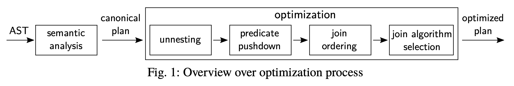
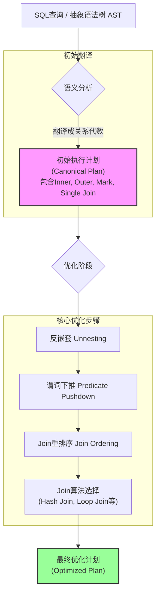
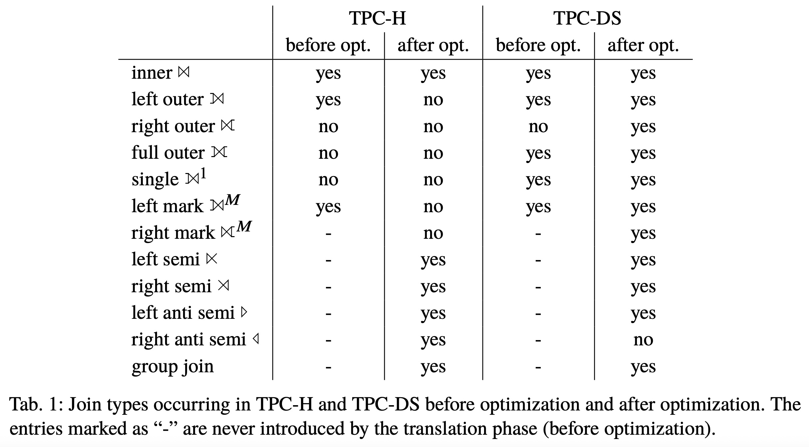
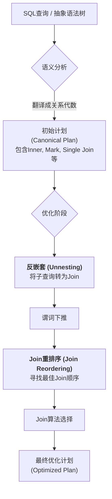

## AI论文解读 | The Complete Story Of Joins
        
### 作者        
digoal        
        
### 日期        
2025-10-06        
        
### 标签        
PostgreSQL , PolarDB , DuckDB , AI , 论文解读        
        
----        
        
## 背景  
      
https://www.cs.cmu.edu/~15721-f24/papers/Story_of_Joins.pdf        
  
提示:          
```          
读懂《The Complete Story Of Joins》这篇论文需要提前掌握哪些基础知识, 请使用中文通熟易懂的讲解这些基础知识, 可以引用论文中的图、表或使用Markdown支持的图形(text,mermaid等)增加解释性. 
  
使用中文通熟易懂的解读《The Complete Story Of Joins》这篇论文, 其中的关键内容请着重讲解, 可以引用论文中的图、表或使用Markdown支持的图形(text,mermaid等)增加解释性. 
  
提取《The Complete Story Of Joins》这篇论文中的重要术语, 使用中文对这些术语进行通熟易懂的讲解, 可以引用论文中的图、表或使用Markdown支持的图形(text,mermaid等)增加解释性. 
```     
  
## 1 前置知识 
  
好的，为了帮助您更好地理解《The Complete Story of Joins (in HyPer)》这篇论文，我将为您梳理和讲解需要掌握的核心基础知识。这篇论文的精髓在于，它超越了教科书上常见的几种Join（连接），引入了新的Join算子来高效处理现代SQL中复杂的嵌套子查询，从而避免了性能极差的嵌套循环执行方式。

### 理解论文所需的基础知识地图

要读懂这篇论文，您需要对以下三个层面有基本的认识：

1.  **SQL与关系型数据库基础**：这是应用层，即我们如何向数据库“提问”。
2.  **关系代数 (Relational Algebra)**：这是理论层，是数据库内部用来表示和推演查询的“数学语言”。
3.  **数据库查询处理与优化**：这是实现层，即数据库如何将“数学语言”转化为高效的执行计划。

下面我们来逐一通俗地讲解这些知识点。

-----

### 1\. SQL与关系型数据库基础

这是最基础的部分。您需要了解：

  * **什么是关系型数据库**：数据以二维表（Table）的形式存储，表由行（Row/Tuple）和列（Column/Attribute）组成。
  * **SQL (Structured Query Language)**：一种用于操作这些表的语言。
  * **常见的Join类型**：
      * **内连接 (INNER JOIN)**：只返回两个表中连接键相匹配的行。这是最常见的Join。
      * **外连接 (OUTER JOIN)**：包括左外连接（LEFT JOIN）、右外连接（RIGHT JOIN）和全外连接（FULL JOIN）。它们除了返回匹配的行，还会返回其中一个表（或两个表）中不匹配的行，并在另一侧补上`NULL`值。
  * **子查询 (Subquery)**：一个嵌套在另一个SQL查询中的查询。这篇论文重点要解决的就是由子查询带来的性能问题，特别是以下两种：
      * **关联子查询 (Correlated Subquery)**：子查询的执行依赖于外部查询的值。例如，查询每个教授所教课程的总学分。对于外部查询的“每一位教授”，子查询都要执行一次，这通常会导致 $O(n^2)$ 的极低效率 。
      * **标量子查询 (Scalar Subquery)**：返回单一值（单行单列）的子查询，常常用在`SELECT`列表或`WHERE`条件中。SQL标准规定，如果它返回超过一行，就必须报错 。

-----

### 2\. 关系代数 (Relational Algebra)

关系代数是一套对关系（即“表”）进行运算的抽象数学工具，是数据库查询引擎的理论基石。SQL查询在执行前，通常会被翻译成关系代数的表达式树。您需要了解以下基本算子：

  * **选择 ( Selection, $\sigma$ )**：从表中筛选出满足条件的行（相当于SQL的`WHERE`子句）。
  * **投影 ( Projection, $\Pi$ )**：从表中选择特定的列（相当于SQL的`SELECT`子句）。
  * **笛卡尔积 ( Cross Product, $\times$ )**：将两个表的所有行进行组合。

**核心：Join在关系代数中的表示**

论文中反复出现的各种Join符号，就是关系代数的表示法。掌握它们是理解论文的关键。

  * **内连接 ( Inner Join, $\bowtie$ )**：可以看作是“笛卡尔积 + 选择”的组合 。

      * 例如，论文中的SQL查询：
        ```sql
        select Title, Name
        from Courses, Professors
        where PersID = Lecturer
        ```
      * 会被翻译成关系代数： $\Pi_{\text{Title, Name}}(\sigma_{\text{PersID=Lecturer}}(\text{Courses} \times \text{Professors}))$ 。优化后会直接使用Join算子： $\text{Courses} \bowtie_{\text{PersID=Lecturer}} \text{Professors}$ 。

  * **半连接 ( Semi Join, $\ltimes$ )**：对应SQL中的`EXISTS`。 $T_1 \ltimes T_2$ 的意思是，返回 $T_1$ 中那些在 $T_2$ 中能找到匹配行的记录，但结果中只包含 $T_1$ 的列 。

      * **用途**：判断“是否存在”。比如，“查询所有开过课的教授信息”。

  * **反半连接 ( Anti Semi Join, $\triangleright$ )**：对应SQL中的`NOT EXISTS`。 $T_1 \triangleright T_2$ 的意思是，返回 $T_1$ 中那些在 $T_2$ 中*找不到*匹配行的记录 。

      * **用途**：判断“是否不存在”。比如，“查询所有没开过课的教授信息”。

  * **外连接 ( Outer Join, $\bowtie\join, \join\bowtie, \bowtie\join\bowtie$ )**：论文中也给出了左外和全外的定义 。

这篇论文的**第一个核心贡献**就是指出，以上这些“经典”的Join算子**还不够用**！为了把所有复杂的子查询都转化为可优化的Join形式，它引入了两个新的算子：

  * **Single Join ( $\Join^1$ )**：专门用来处理**标量子查询** 。它的行为和左外连接很像，但如果右表为一个左表元组提供了**多于一个**匹配行，它会直接报错 。这完美契合了SQL对标量子查询的语义要求。
  * **Mark Join ( $\Join^M$ )**：专门用来处理`WHERE`子句中复杂的、带有`OR`逻辑的`EXISTS`等情况 。它不会像Semi Join那样过滤掉不匹配的行，而是为左表的每一行都增加一个标记（mark）属性（通常是True/False/Null），表明它在右表中是否存在匹配 。这样，原始的过滤条件就可以在这个标记属性上进行判断了。

-----

### 3\. 数据库查询处理与优化

当数据库拿到一条SQL后，它会经历一系列复杂的处理流程才能返回结果。这篇论文的优化思路就体现在这个流程中。

  * **查询解析与翻译**：将SQL语句解析成抽象语法树（AST），然后翻译成关系代数表达式构成的**逻辑执行计划**。
  * **查询优化 (Query Optimization)**：这是数据库的“大脑”。优化器的目标是将逻辑执行计划转换成一个成本最低的**物理执行计划**。
      * **反嵌套 (Unnesting)**：这是论文的**第二个核心贡献**，也是引入新Join算子的主要目的。反嵌套就是将子查询（特别是关联子查询）改写成等价的Join操作 。这样一来，原本被固定的嵌套执行顺序就被打破了，优化器可以自由地调整Join的顺序。
      * **Join重排序 (Join Reordering)**：Join的执行顺序对性能有天壤之别 。例如，先执行一个能大幅减少数据量的Join，通常会带来巨大的性能提升。通过Mark Join和Single Join，原本固化的子查询也被纳入了Join重排序的优化范围 。
      * **算法选择**：为每个Join算子选择具体的实现算法。最常见的是**哈希连接 (Hash Join)** 。其基本思想是：
        1.  **构建阶段 (Build)**：选择较小的表（左表），根据连接键在内存中构建一个哈希表 。
        2.  **探测阶段 (Probe)**：遍历较大的表（右表），用它的连接键去哈希表中查找匹配的行 。
            论文的第5节详细讨论了如何为这些标准和非标准的Join实现高效的哈希算法。

为了让您更直观地理解整个流程，论文的**图1**展示了HyPer数据库的优化过程。我可以用Mermaid图为您重现这个流程：   



  * **图解**：您的SQL查询首先被翻译成一个基础的关系代数计划（上图中的“初始执行计划”），这个计划可能包含论文提出的Mark Join和Single Join 。随后，优化器会进行一系列转换（如反嵌套、重排序等），将这个初始计划变成一个高效的最终计划，然后交给执行引擎去运行。

### 总结

要读懂《The Complete Story of Joins》，您可以按以下路径准备：

1.  **复习SQL**：确保您熟悉`INNER JOIN`, `LEFT JOIN`, `EXISTS`, `NOT EXISTS`以及各种子查询的写法和含义。
2.  **理解关系代数的核心思想**：把它看作是SQL背后的“蓝图”。重点理解论文中提到的各种Join符号（ $\bowtie, \ltimes, \triangleright, \Join^1, \Join^M$ ）分别对应解决哪一类SQL问题。
3.  **建立查询优化的概念**：明白数据库执行SQL不是“照本宣科”，而是有一个智能的“优化器”在背后做大量的转换和重排工作。论文的核心就是通过引入新的Join工具，赋予优化器更大的“施展空间”，从而将原本可能需要执行数小时的查询在毫秒间完成 。

通过掌握这些基础，您就能更好地理解论文的动机、它提出的创新性解决方案（Mark Join, Single Join）以及这些方案为何能在实践中（如**表1**所示，在TPC-H和TPC-DS基准测试中所有Join类型都被用到 ）取得巨大性能提升。    
  
## 2 解读论文 
  
好的，这篇名为《The Complete Story of Joins (in HyPer)》的论文是一篇关于数据库查询优化的经典之作。它深入探讨了为什么教科书中常见的几种Join（连接）类型不足以高效处理现代复杂的SQL查询，并提出了一套更完整的解决方案。

下面我将为您通俗地解读这篇论文的核心思想与关键内容。

### 核心问题：为什么传统的Join不够用了？

在现代SQL中，子查询可以出现在查询的几乎任何位置（`SELECT`、`FROM`、`WHERE`子句等），这种特性被称为“正交性” 。当一个子查询（特别是关联子查询）嵌套在另一个查询中时，最简单直白的执行方式是 **“嵌套循环”** ：即外层查询每处理一行数据，就去完整地执行一次内层子查询 。

这种方法的性能是灾难性的，其时间复杂度高达 $O(n^2)$ 。例如，在一个有10万名学生的表里，为每个学生执行一个扫描10万条选课记录的子查询，计算量会达到百亿级别。

**论文的出发点**：为了避免这种低效的递归执行策略，我们需要将这些复杂的嵌套子查询**翻译**成标准的、可被优化器自由调整顺序的Join操作 。然而，作者指出，传统的内连接、外连接和半连接并不足以表达所有SQL子查询的复杂语义 。

### 两大关键创新：引入“非主流”的Join算子

为了解决这个问题，论文引入了两种新的、非标准的Join算子：**Single Join** 和 **Mark Join** 。

#### 1\. Single Join ( $\Join^1$ )：为“标量子查询”而生

  * **解决场景**：处理那些期望返回单一值的**标量子查询** 。SQL标准规定，这类子查询最多只能返回一行一列的数据 。

  * **语义与行为**：

    1.  如果子查询（右表）能为外层查询的某一行（左表）找到**一个**匹配项，就返回这个匹配值 。
    2.  如果找不到匹配项，就返回 `NULL` 。
    3.  **关键点**：如果找到了**多于一个**匹配项，就必须抛出运行时错误 。

    这个行为与左外连接（LEFT OUTER JOIN）非常相似，但增加了“多于一个匹配就报错”的严格约束，完美地实现了SQL标准对标量子查询的语义要求 。

  * **例子**：论文中给出了一个查询，要为每位教授（Professors）找到其“私人助理”（personal assistant）的名字 。

    ```sql
    select p.Name, 
           (select a.Name 
            from Assistants a 
            where a.Boss = p.PersId and a.JobTitle = 'personal assistant')
    from Professors p
    ```

    使用Single Join，这个查询可以被翻译成一个单一的Join操作，从而避免了为每一位教授都去扫描一遍`Assistants`表，性能从 $O(n^2)$ 提升到理想的 $O(n)$ 。

#### 2\. Mark Join ( $\Join^M$ )：应对复杂的`EXISTS`和`OR`逻辑

  * **解决场景**：处理用作查询条件的子查询（如 `EXISTS`, `NOT EXISTS`, `UNIQUE` 等），特别是当这些条件与 `OR` 等逻辑运算符混合使用时 。

  * **语义与行为**：

      * 传统的半连接（Semi Join, 对应`EXISTS`）会直接**过滤**掉那些在右表中找不到匹配的行 。但在某些复杂逻辑下，我们不能这么做。
      * Mark Join 不会过滤行，而是为左表的每一行**添加一个标记列**（例如，命名为`m`） 。
      * 如果左表的某行在右表能找到匹配，标记为 `TRUE`。
      * 如果找不到，标记为 `FALSE`。
      * 如果因为 `NULL` 值的存在导致无法判断，标记为 `NULL` 。

  * **例子**：论文中给出了一个查询，要找出所有“正在休假” **或** “开设有课程”的教授 。

    ```sql
    select *
    from Professors
    where exists (select * from Courses where Lecturer = PersId)
       or Sabbatical = true
    ```

    这里不能用Semi Join，因为它会把那些“没有开课但正在休假”的教授过滤掉，导致结果错误 。
    使用Mark Join，查询被翻译为：首先执行 `Professors` 和 `Courses` 的Mark Join，为每个教授生成一个标记`m`（表示是否开课）。然后，再对结果进行筛选，条件是 `m = TRUE or Sabbatical = true` 。这个过程将子查询完全融入了主查询流程，使得优化器可以自由地重排其执行顺序 。

### 核心流程：从SQL到高效执行计划

这篇论文的精髓不仅在于定义了新的Join算子，更在于展示了如何将它们融入一个完整的查询优化流程中。论文中的**图1**清晰地展示了HyPer数据库的优化管线 。    

我可以使用Mermaid图为您重现这个流程：



  * **反嵌套 (Unnesting)**：这是整个优化的关键一步。通过使用Mark Join和Single Join，HyPer系统可以将**任意复杂**的子查询都转换成Join形式 。这打破了原有的嵌套执行结构，为后续优化铺平了道路 。
  * **Join重排序 (Join Reordering)**：一旦所有操作都变成了Join，查询优化器就可以像玩积木一样，根据成本估算，寻找一个最优的Join执行顺序 。例如，先执行一个可以极大减少数据量的Join，会使后续计算变得非常快。

### 实践证明：这些“非主流”Join真的需要吗？

答案是**肯定的**。论文通过分析两个业界标准的数据库基准测试集（TPC-H和TPC-DS）证明了这一点 。

**论文中的表1**  显示：    

  * 在初始翻译阶段或最终优化阶段，论文中讨论的**所有Join类型**（包括左右内外、左右半连接/反半连接、Single Join、Mark Join等）都在这两个基准测试的查询中出现了 。
  * 这表明，一个强大且全面的查询优化器，需要拥有一个丰富的“Join工具箱”才能应对真实世界的复杂查询 。

#### 惊人的性能对比

论文用一个简单的查询案例给出了最直观的性能震撼 ：

  * **查询**: 从`part`表中查询零件名，并附带一个标量子查询，找出每个零件对应的某个订单号。
  * **HyPer (使用Single Join)**: **17毫秒** 。
  * **PostgreSQL (使用嵌套循环)**: **26小时** 。

这个数量级的差异（毫秒 vs. 小时）雄辩地证明了，将子查询翻译成高效的Join算子是多么重要。其性能提升可以是任意大的，数据量越大，优势越明显 。

### 结论

《The Complete Story of Joins》的核心贡献可以总结为：

1.  **指出现实问题**：传统的Join集合不足以高效处理现代SQL中无处不在的复杂子查询，会导致灾难性的 $O(n^2)$ 性能 。
2.  **提供创新工具**：引入了 **Single Join** 和 **Mark Join** 两个新的逻辑Join算子，作为将任意子查询翻译成关系代数的关键“桥梁” 。
3.  **展示完整蓝图**：描述了一个从SQL翻译到逻辑优化（反嵌套、重排序），再到物理算法实现的完整查询处理管线 。
4.  **用事实说话**：通过基准测试分析和性能对比，证明了这套丰富的“Join全家桶”在真实业务场景中的必要性和巨大价值 。

这篇论文为现代数据库如何从根本上解决复杂查询的性能问题，提供了一个优雅、系统且高效的范本。
  
## 3 术语 
  
好的，这篇论文《The Complete Story of Joins (in HyPer)》引入并解释了许多数据库领域的关键术语。为了高效处理现代SQL查询，理解这些术语至关重要。

以下是论文中重要术语的提取与通俗讲解。

### 一、 核心问题与背景术语

这些术语解释了论文试图解决的根本问题。

  * **SQL正交性 (SQL Orthogonality)**
      * **讲解**: 指的是现代SQL语言的一个特性，即子查询（Subquery）几乎可以被嵌套在SQL语句的任何地方，例如 `SELECT`、`FROM` 和 `WHERE` 子句中 。这种灵活性给用户带来了便利，但给数据库的查询优化带来了巨大挑战 。
  * **相互递归 / 递归评估 (Mutual Recursion / Recursive Evaluation)**
      * **讲解**: 这是一种简单但低效的执行嵌套子查询的方法 。它意味着对于外部查询的每一行，都要完整地重新执行一遍内部的子查询 。这种策略会导致灾难性的 $O(n^2)$ 运行时长 。论文指出，像PostgreSQL这样的系统有时会采用这种策略 。本文的核心目标就是避免这种方法 。

### 二、 传统的关系代数连接

这些是论文讨论的基础，也是大家在教科书中常见的“标准”Join类型。

  * **依赖连接 ( Dependent Join, $\Join$ )**
      * **讲解**: 这是对“关联子查询”的一种形式化代数表达 。它的定义是，对于左边输入的每一行元组（tuple），都会代入到右边的表达式中进行计算 。这是后续进行“反嵌套”优化的理论基础 。
  * **半连接 / 反半连接 ( Semi Join $\ltimes$ / Anti Semi Join $\triangleright$ )**
      * **讲解**: 这两种连接通常用于将 `EXISTS` 和 `NOT EXISTS` 形式的子查询表达为Join操作 。
          * **半连接 ( $\ltimes$ )**: 返回左表中那些在右表中能找到匹配项的行 。结果只包含左表的列。
          * **反半连接 ( $\triangleright$ )**: 与半连接相反，它返回左表中那些在右表中*完全找不到*匹配项的行 。

### 三、 论文提出的创新连接算子

这是论文的**核心贡献**，为了解决传统Join无法表达所有SQL子查询语义的问题，作者引入了两种新的Join算子。

  * **Single Join ( $\Join^1$ )**
      * **讲解**: 这是一种专门用于翻译**标量子查询**（即预期只返回单行单列值的子查询）的新型连接算子 。
      * **核心行为**:
          * 当右表（子查询）能为左表的一行提供**一个**匹配时，返回该匹配值 。
          * 当找不到匹配时，返回 `NULL` 。
          * **最关键的是**，如果找到了**多于一个**匹配项，它会直接**抛出运行时错误** 。
      * **目的**: 这种行为完美地契合了SQL对标量子查询的语义要求，从而可以将这类子查询转化为可重排序的Join操作，避免了 $O(n^2)$ 的低效执行 。
  * **Mark Join ( $\Join^M$ )**
      * **讲解**: 这种连接用于处理**谓词子查询**（如 `EXISTS`），特别是当这些子查询与 `OR` (析取)等逻辑混合使用，导致不能简单地用半连接来过滤数据时 。
      * **核心行为**: 它不会过滤左表的行，而是为左表的每一行**添加一个新的标记属性**（marker） 。这个标记的值可以是 `TRUE`（表示找到了匹配）、`FALSE`（未找到匹配）或 `NULL`（因数据为NULL导致结果未知） 。
      * **目的**: 通过“打标记”而非“过滤”的方式，将子查询的判断逻辑转化为对一个新属性的判断 。这使得整个查询仍然是一个大的Join查询，从而让优化器有机会重排其执行顺序 。

### 四、 查询处理与优化术语

这些术语描述了新的Join算子如何在数据库的整个查询处理流程中发挥作用。

  * **初始翻译 / 初始计划 (Canonical Translation / Plan)**

      * **讲解**: 指的是将SQL初步、直接地翻译成关系代数表达式的过程，通常是教科书式的方法（例如，FROM子句转为笛卡尔积，WHERE转为选择） 。这种初始计划往往不是最优的，且无法处理复杂的关联子查询 。

  * **反嵌套 (Unnesting)**

      * **讲解**: 这是查询优化中至关重要的一步，其目标是将嵌套的子查询（尤其是关联子查询）改写成等价的、非嵌套的Join查询 。论文提出的 Mark Join 和 Single Join 是其强大的反嵌套技术的重要基石，使其能够处理任意复杂的查询，而不仅仅是某些特定模式 。

  * **Join重排序 (Join Reordering)**

      * **讲解**: 查询优化器最重要的任务之一就是找到一个最佳的Join执行顺序，因为坏的顺序可能比好的慢几个数量级 。通过将子查询转化为Mark Join和Single Join，这些操作也成为了可以参与重排序的候选项，提供了更多的优化可能性 。

  * **优化流程 (Optimization Process)**

      * **讲解**: 论文的**图1**展示了其HyPer系统中的查询优化全流程 。这个流程清晰地说明了SQL是如何一步步被转化为高效执行计划的。   

    我们可以使用Mermaid图来重现这个流程：

    ```mermaid
    graph TD
        A[SQL 抽象语法树 AST] --> B{语义分析};
        B -- 翻译 --> C["初始计划<br/>(Canonical Plan)"];
        subgraph "查询优化"
            C --> E[反嵌套 Unnesting];
            E --> F[谓词下推];
            F --> G[Join 重排序];
            G --> H[Join 算法选择];
        end
        H --> I["最终优化计划<br/>(Optimized Plan)"];
    ```

      * 这个流程从解析SQL开始 ，生成一个包含我们新Join的初始计划 ，然后经过反嵌套 、Join重排序 等一系列优化步骤，最终生成一个高效的执行计划 。

  * **TPC-H / TPC-DS**

      * **讲解**: 这是两个国际公认的、权威的数据库性能基准测试集 。论文通过分析这两个测试集中的查询，证明了本文提出的所有Join变体（包括Single Join和Mark Join）在真实的复杂查询场景中都是有用的，是必需的 。**表1**就清晰地展示了各类Join在两个基准测试中的出现情况 。    
  
## 参考        
         
https://www.cs.cmu.edu/~15721-f24/papers/Story_of_Joins.pdf    
        
<b> 以上内容基于DeepSeek、Qwen、Gemini及诸多AI生成, 轻微人工调整, 感谢杭州深度求索人工智能、阿里云、Google等公司. </b>        
        
<b> AI 生成的内容请自行辨别正确性, 当然也多了些许踩坑的乐趣, 毕竟冒险是每个男人的天性.  </b>        
  
    
#### [期望 PostgreSQL|开源PolarDB 增加什么功能?](https://github.com/digoal/blog/issues/76 "269ac3d1c492e938c0191101c7238216")
  
  
#### [PolarDB 开源数据库](https://openpolardb.com/home "57258f76c37864c6e6d23383d05714ea")
  
  
#### [PolarDB 学习图谱](https://www.aliyun.com/database/openpolardb/activity "8642f60e04ed0c814bf9cb9677976bd4")
  
  
#### [PostgreSQL 解决方案集合](../201706/20170601_02.md "40cff096e9ed7122c512b35d8561d9c8")
  
  
#### [德哥 / digoal's Github - 公益是一辈子的事.](https://github.com/digoal/blog/blob/master/README.md "22709685feb7cab07d30f30387f0a9ae")
  
  
#### [About 德哥](https://github.com/digoal/blog/blob/master/me/readme.md "a37735981e7704886ffd590565582dd0")
  
  

  
