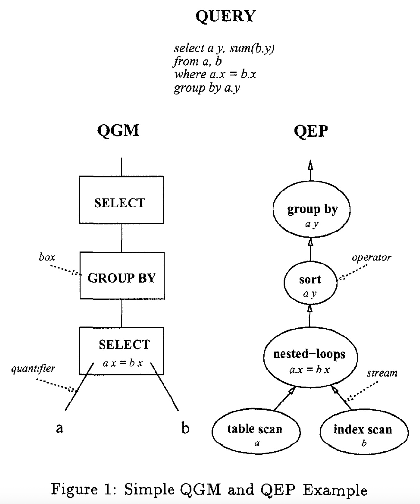
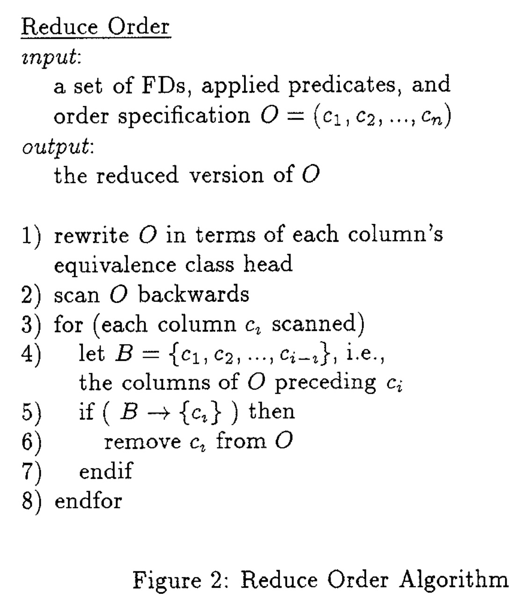
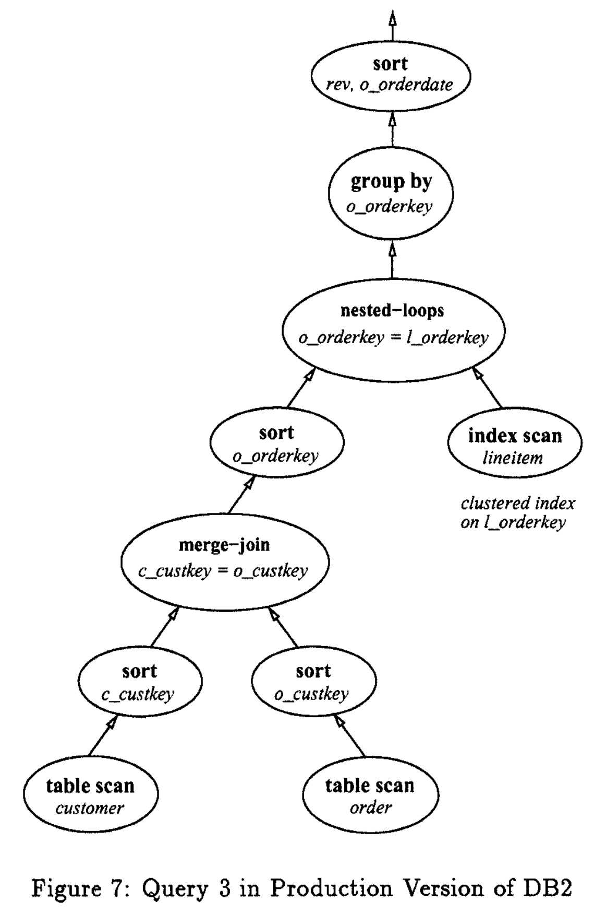
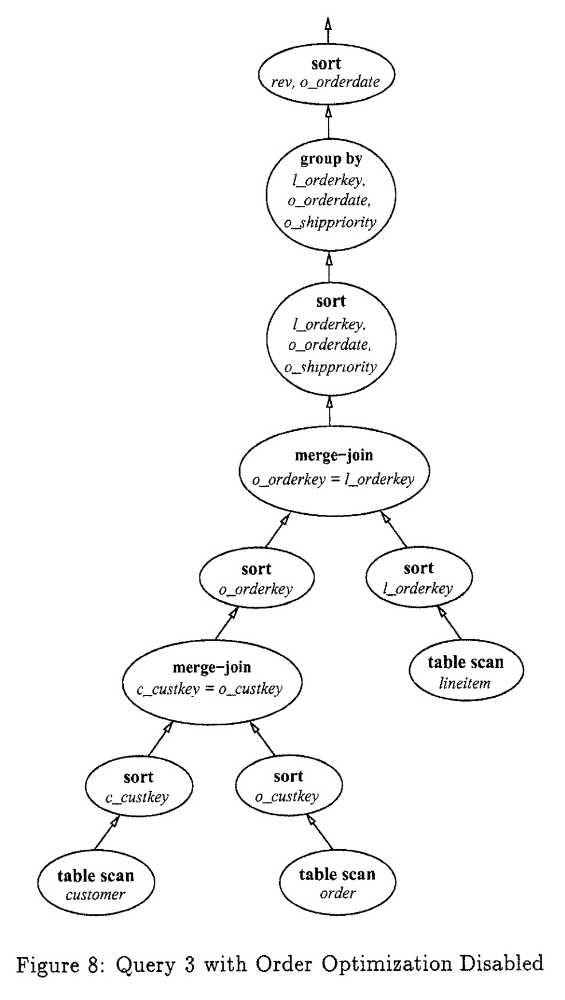
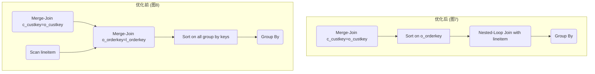

## AI论文解读 | Fundamental Techniques For Order Optimization
        
### 作者        
digoal        
        
### 日期        
2025-10-06        
        
### 标签        
PostgreSQL , PolarDB , DuckDB , AI , 论文解读        
        
----        
        
## 背景  
      
https://dl.acm.org/doi/pdf/10.1145/233269.233320        
  
提示:          
```          
读懂《Fundamental Techniques For Order Optimization》这篇论文需要提前掌握哪些基础知识, 请使用中文通熟易懂的讲解这些基础知识, 可以引用论文中的图、表或使用Markdown支持的图形(text,mermaid等)增加解释性. 
  
使用中文通熟易懂的解读《Fundamental Techniques For Order Optimization》这篇论文, 其中的关键内容请着重讲解, 可以引用论文中的图、表或使用Markdown支持的图形(text,mermaid等)增加解释性. 
  
提取《Fundamental Techniques For Order Optimization》这篇论文中的重要术语, 使用中文对这些术语进行通熟易懂的讲解, 可以引用论文中的图、表或使用Markdown支持的图形(text,mermaid等)增加解释性. 
```     
  
## 1 前置知识 
  
好的，为了完全理解《Fundamental Techniques for Order Optimization》这篇经典的数据库优化论文，您需要掌握一些关于数据库查询处理、关系理论和优化策略的基础知识。下面我将用通俗易懂的方式，结合论文中的图表，为您讲解这些核心概念。

-----

### 基础 1: 数据库查询处理的基本流程

想象一下，你用导航软件去一个地方，你输入的是“我要去故宫”，这是你的**请求 (SQL查询)**。导航软件不会直接告诉你“出门左转”，它会先在内部计算出多条路线（比如走长安街、走二环），然后根据路况、距离等信息，选择一条**最优路线**，最后才给出具体的导航步骤。

数据库的**查询优化器 (Query Optimizer)** 就扮演着导航软件的角色。它的核心任务就是为一条SQL查询找到成本最低、效率最高的执行方式。

这篇论文的优化技术就发生在查询优化的核心阶段。论文中提到了两个关键概念，可以用图1来解释：    

  * **QGM (Query Graph Model)**: 这相当于你请求的“逻辑计划”。它只描述了查询需要做什么，比如“从 a 表和 b 表中筛选数据，然后根据 a.y 进行分组”。它不关心具体怎么做。
  * **QEP (Query Execution Plan)**: 这相当于导航软件计算出的“物理执行计划”。它描述了完成查询的具体步骤和算法，比如“先对 a 表进行全表扫描，然后通过索引扫描 b 表，使用嵌套循环连接(nested-loops join)它们，再对结果排序(sort)，最后进行分组(group by)”。

<br>

> **图解**: 论文中的图1清晰地展示了从用户SQL查询到逻辑计划(QGM)再到物理执行计划(QEP)的转换过程 。左边的QGM是概念性的，右边的QEP是具体的操作步骤。本文的所有优化技术，都是为了生成一个更高效的QEP。

**你需要掌握的知识点**:

  * SQL查询会经过 **解析 -\> 优化 -\> 执行** 三个阶段。
  * 查询优化器的目标是生成一个成本最低的**物理执行计划 (QEP)**。
  * 一个QEP可以被看作是一个由不同操作符（如扫描、连接、排序）组成的树状**数据流图** 。

-----

### 基础 2: "有趣的序" (Interesting Orders)

这是理解本文的**核心概念**，由System R优化器的论文首次提出 。

"有趣的序"指的是任何**可能对后续操作有用的数据排序** 。如果数据流已经是“有趣的序”，那么后续需要这个排序的操作就可以**避免一次昂贵的排序 (Sort)** 。

**哪些操作会产生“有趣的序”的需求？** 

1.  **ORDER BY 子句**: 最直接的需求，结果集必须按照指定列排序。
2.  **GROUP BY 子句**: 如果使用基于排序的聚合算法，那么数据需要先按分组列排好序。
3.  **DISTINCT 操作**: 一种实现方式是先排序，然后去除相邻的重复记录。
4.  **归并连接 (Merge-Join)**: 这种连接算法要求两个输入表都必须在连接键上排好序。

**例子**:
假设有一个查询 `SELECT ... FROM T1 JOIN T2 ON T1.id = T2.id ORDER BY T1.id;`

  * `ORDER BY T1.id` 产生了一个 `(T1.id)` 的有趣序需求。
  * 如果我们选择使用归并连接 (Merge-Join)，那么连接操作本身也需要 `(T1.id)` 和 `(T2.id)` 的有趣序。

优化器会发现这两个需求是兼容的。如果 T1 表上正好有一个 `id` 列的索引，那么从 T1 扫描出来的**数据流天然就满足了 `(T1.id)` 的有趣序** ，这样就既满足了连接需求，也满足了最终的排序需求，一举两得，避免了额外的排序。

**你需要掌握的知识点**:

  * “有趣的序”是任何对后续操作有益的排序。
  * 优化器的目标是尽可能利用已有的序（如索引序）或通过一次排序满足多个需求，从而避免重复或不必要的排序。

-----

### 基础 3: 函数依赖 (Functional Dependencies - FDs)

这是本文进行排序优化的**理论基石**，也是最关键、最需要理解的技术点。

**什么是函数依赖？**
在关系数据库理论中，如果属性集合 X 的值可以唯一确定属性集合 Y 的值，我们就说 Y 函数依赖于 X，记作 $X \rightarrow Y$ 。

**通俗的例子**:

  * `{学号} → {姓名, 年龄}`: 只要学号确定，学生的姓名和年龄就是唯一的。
  * `{身份证号} → {姓名, 出生日期}`: 身份证号唯一确定了一个人的身份信息。

**函数依赖在本文中的应用 (这是关键！)**:
论文的核心贡献之一就是利用函数依赖来**化简 (Reduce) 一个排序需求** 。

假设我们的排序需求是 `ORDER BY c1, c2, ..., cn`。
如果已经排好序的前缀 `{c1, c2, ..., c(i-1)}` 能够函数依赖地决定 `ci`，即 `{c1, ..., c(i-1)} → {ci}`，那么 `ci` 这一列对于排序来说就是**冗余的**，可以被安全地移除 。

**几个具体的化简场景**:

1.  **常量谓词**: 如果查询中有条件 `WHERE x = 10`。
      * 这会产生一个函数依赖: `{} → {x}` (空集决定x，因为x的值是固定的) 。
      * 那么对于排序需求 `(x, y)`，因为 `x` 已经是常量，所以实际只需要按 `(y)` 排序即可。排序需求被化简为 `(y)` 。
2.  **主键/唯一键**: 假设 `id` 是表的主键。
      * 主键意味着函数依赖: `{id} → {所有其他列}`。
      * 对于排序需求 `(id, name, age)`，因为 `id` 已经唯一确定了一行记录，`name` 和 `age` 对于排序不再提供任何额外信息，所以这个需求可以被化简为 `(id)` 。
3.  **等值连接谓词**: 如果查询中有 `WHERE a.x = b.x`。
      * 这会产生两个函数依赖: `{a.x} → {b.x}` 和 `{b.x} → {a.x}` 。
      * 如果一个数据流已经按 `(a.x, b.y)` 排好序了，而另一个操作需要 `(b.x, b.y)` 的序，优化器可以利用这个依赖关系，认为现有的序满足了需求。

**你需要掌握的知识点**:

  * 理解函数依赖 $X \rightarrow Y$ 的基本概念。
  * 知道主键、常量、等值谓词如何转化为函数依赖关系。
  * 明白函数依赖是用来识别和消除排序需求中**冗余列**的核心工具。

-----

### 基础 4: 常见的连接算法及其对排序的影响

优化器在选择连接算法时，必须考虑它们对数据排序的影响。

  * **嵌套循环连接 (Nested-Loops Join)**:
      * 工作方式：外层循环遍历一张表（驱动表），内层循环根据连接条件在另一张表中查找匹配项。
      * 排序特性：通常**会保留外层输入流的顺序** 。这一点非常重要，因为它意味着如果我们将一个排好序的数据流作为外层输入，连接后的结果流依然是部分有序的。论文中提到的`sort-ahead`（排序前置）技术就利用了这一点 。
  * **归并连接 (Merge-Join)**:
      * 工作方式：要求两个输入流都必须在连接键上排好序，然后像拉拉链一样将两个有序流合并起来。
      * 排序特性：**强制要求输入有序**，这是“有趣序”的一个主要来源。
  * **哈希连接 (Hash-Join)**:
      * 工作方式：对其中一个较小的输入流（构建表）建立哈希表，然后扫描另一个输入流（探测表），去哈希表中查找匹配项。
      * 排序特性：**既不要求输入有序，也不保证输出有序** 。因此，当后续步骤需要排序时，哈希连接之后通常必须跟一个显式的排序操作。

**你需要掌握的知识点**:

  * 了解这三种基本连接算法的工作原理。
  * 重点关注它们与“排序”的关系：哪个需要排序，哪个能保留排序，哪个会破坏排序。

### 总结

要读懂这篇论文，您需要将以上知识点串联起来，形成一个完整的知识框架：

1.  **目标**: 数据库优化器希望生成最高效的**执行计划(QEP)**，而排序(Sort)是一个非常昂贵的操作，因此需要被重点优化 。
2.  **核心问题**: 如何避免不必要的排序，或者让一次排序发挥最大价值？
3.  **解决方案**:
      * 引入 **“有趣的序”** 的概念，识别出所有潜在有用的排序需求 。
      * 使用**函数依赖 (FDs)** 这一强有力的理论工具，对“有趣的序”进行化简（`Reduce Order`），去除冗余的排序列 。
      * 基于化简后的序，进行覆盖（`Cover Order`，用一个排序满足多个需求）、测试（`Test Order`，判断现有序是否满足需求）和转换（`Homogenize Order`，在不同表之间传递排序需求）等一系列操作 。
      * 在生成QEP时，结合不同**连接算法**对排序的特性，决定在数据流的哪个阶段执行排序操作（或不排序）成本最低。

通过这些技术，优化器能够做出更智能的决策，比如论文 TPC-D 的例子中，将一个`GROUP BY`的排序需求提前到连接操作之前执行，不仅满足了分组需求，还意外地优化了连接的效率，最终将查询性能提升了一倍 。
  
## 2 解读论文 
  
好的，我们来一起解读这篇在数据库查询优化领域具有重要影响的论文——《Fundamental Techniques for Order Optimization》。

这篇论文的核心思想是：**排序（Sorting）在数据库中是一项非常昂贵的操作，我们应该通过一系列智能的技术，尽可能地减少排序的次数、降低排序的成本，甚至完全避免排序** 。论文介绍了一套系统性的方法，这些方法已经被应用在IBM的DB2数据库中 。

-----

### 核心背景：优化器如何处理排序？

首先，我们需要理解数据库查询优化器的工作流程。当您提交一条SQL查询时，优化器会将其转换成一个**查询执行计划（Query Execution Plan, QEP）** 。这个计划就像一个数据处理的流水线，由多个操作符（如表扫描、连接、排序等）组成 。

论文中的图1形象地展示了这个过程：   

  * **QGM (Query Graph Model)**：是查询的逻辑表示，描述了“做什么”，比如从a、b两个表连接，然后按a.y分组 。
  * **QEP (Query Execution Plan)**：是查询的物理执行方案，描述了“怎么做”，比如用嵌套循环连接a和b，然后对结果进行排序，最后完成分组 。

> **图解**: 优化器的目标就是生成一个最高效的QEP 。本文的所有技术，都是为了让这个QEP中的排序操作（sort）尽可能少、尽可能高效。

为了实现这个目标，优化器引入了一个关键概念 —— **“有趣的序” (Interesting Orders)** 。任何对后续操作（如`JOIN`、`GROUP BY`、`ORDER BY`、`DISTINCT`）有用的数据排序，都被称为“有趣的序” 。优化器的任务就是敏锐地发现并利用这些“有趣的序”。

-----

### 论文精髓：四大基本操作

这篇论文的真正核心贡献，是提出了四个标准化的、用于处理“有趣的序”的基本操作。这四个操作是实现所有高级排序优化的基石。

#### 1\. 化简序 (Reduce Order) - **最关键的操作**

这是论文中最核心、最根本的操作 。它的作用是利用**函数依赖 (Functional Dependencies, FDs)** 将一个排序需求化简为其最简单的“范式” 。

**什么是函数依赖？**
简单说，如果知道A列的值就能唯一确定B列的值，那么我们就说B函数依赖于A，记作 $A \rightarrow B$ 。

**化简序如何工作？**
`Reduce Order`利用以下几种情况产生的函数依赖来移除排序需求中的冗余列：

  * **常量谓词**：当查询条件为 `WHERE column = 10` 时，`column` 的值是固定的。这产生了一个函数依赖： ${} \rightarrow \{\text{column}\}$ （空集决定该列）。因此，在排序需求 `(column, other_col)` 中，`column` 是冗余的，可以直接去掉，化简为 `(other_col)` 。
  * **等值关系**：当查询条件为 `WHERE a.x = b.y` 时，`a.x` 和 `b.y` 处于一个等价类中 。排序需求 `(a.x, c.z)` 和 `(b.y, c.z)` 可以被认为是等价的。
  * **主键/唯一键**：如果 `id` 是主键，那么它函数依赖地决定了表中的所有其他列，即 ${id} \rightarrow {\text{all other columns}}$ 。对于排序需求 `(id, name, age)`，一旦按 `id` 排序，顺序就完全确定了，`name` 和 `age` 变得冗余，因此可以化简为 `(id)` 。

**`Reduce Order`算法流程如下 (见论文图2)**:    

1.  将排序列用其等价类的代表列替换 。
2.  从后向前扫描排序列 `(c1, c2, ..., cn)` 。
3.  对于第 `i` 列 `ci`，检查它是否被前面的列 `{c1, ..., c(i-1)}` 函数依赖地决定 。
4.  如果是，则 `ci` 是冗余的，将其从排序需求中移除 。

这个操作至关重要，因为它为其他所有操作提供了判断基础。

#### 2\. 测试序 (Test Order)

这个操作用于回答一个问题：“当前数据流的物理排序属性能否满足某个‘有趣的序’？” 。它的实现很简单：分别对数据流的物理排序和“有趣的序”进行**化简 (Reduce Order)**，然后看化简后的前者是否是后者的一个前缀 。

  * **例**: 需求是 `(a.x)`，当前数据流因为索引扫描，物理顺序是 `(a.x, a.y)`。两者化简后，`(a.x)` 是 `(a.x, a.y)` 的前缀，所以满足要求，无需排序。

#### 3\. 覆盖序 (Cover Order)

这个操作尝试将两个“有趣的序”合并成一个，目的是让一次排序能同时满足多个需求 。

  * **例**: 查询中既有 `GROUP BY a.x`，又有 `ORDER BY a.x, a.y`。这两个“有趣的序” `(a.x)` 和 `(a.x, a.y)` 可以被一个新的序 `(a.x, a.y)` **覆盖**。优化器只需执行一次 `(a.x, a.y)` 的排序即可。
  * **不可覆盖的情况**：`(x, y)` 和 `(y, x)` 就无法被一个排序同时满足 。

#### 4\. 同质化序 (Homogenize Order)

当优化器希望将一个排序需求“下推”到查询计划的更底层时（例如，下推到连接操作之前），就需要这个操作 。它负责将一个排序需求中的列，根据等价关系，转换成下层操作中可用的列 。

  * **例**：顶层 `ORDER BY a.x, b.y`，连接条件是 `a.x = b.x`。当这个排序需求被下推到访问b表时，`a.x` 在b表上下文中是不可用的。`Homogenize Order` 会利用 `a.x = b.x` 的等价关系，将排序需求转换为 `(b.x, b.y)`，这样b表就可以尝试满足这个新序了 。

-----

### 架构与实践：这些操作如何协同工作？

这四大操作并非孤立存在，而是被整合进DB2优化器的两个关键阶段：

1.  **QGM的顺序扫描 (Order Scan of QGM)**：在生成详细的执行计划之前，优化器会自顶向下扫描QGM，收集所有“有趣的序” 。在这个过程中，它会尝试使用 `Cover Order` 合并排序需求，并使用 `Homogenize Order` 将它们尽可能地下推 。
2.  **计划生成阶段 (Planning Phase)**：在自底向上构建QEP的过程中，优化器会为每个中间数据流维护一系列 **属性（Properties）** ，包括其物理顺序、已应用的谓词、键信息和函数依赖关系 。每当需要满足一个“有趣的序”时，它就会使用 `Test Order` 来检查当前数据流是否已经有序 。如果需要排序，`Reduce Order` 会提供最少的排序列，从而降低成本 。

#### 案例分析：TPC-D Query 3 的性能飞跃

论文通过TPC-D基准测试中的Query 3，展示了这些优化技术带来的巨大性能提升。

| 版本 | 运行时间 | 比率 |
| :--- | :--- | :--- |
| 生产版DB2 (优化开启) | 192 秒 | 2.04 |
| 实验版DB2 (优化关闭) | 393 秒 | |

*表格1：Query 3 运行时间对比* 

**为什么差距如此之大？**

  * **优化后的计划 (图7)**: 优化器通过 `Reduce Order` 发现 `GROUP BY l_orderkey, o_orderdate, o_shippriority` 中的 `o_orderdate` 和 `o_shippriority` 函数依赖于 `o_orderkey` (因为`o_orderkey`是`order`表的主键)，并且 `l_orderkey = o_orderkey` 。因此，分组排序需求被化简为只需按 `(o_orderkey)` 排序 。优化器明智地将这个排序操作**下推**到了 `customer` 和 `order` 表连接之后、与 `lineitem` 表连接之前 。这个提前的排序不仅满足了最终的分组需求，还使得后续与 `lineitem` 表的连接可以利用有序的输入流，大大提升了连接效率 。

  * **优化前的计划 (图8)**: 优化器无法发现排序需求可以化简，也无法智能地下推排序。它只能先完成所有连接，然后在庞大的中间结果集上执行一个昂贵的分组排序操作，并且连接算法的选择也非最优 。

    



> **流程对比**: 优化后的计划通过排序下推（Sort-ahead），将昂贵的操作提前在更小的数据集上完成，并优化了后续的连接。

### 结论

《Fundamental Techniques for Order Optimization》这篇论文的贡献可以总结为：

1.  **系统化框架**：它首次提出了一套完整的、基于函数依赖理论的排序优化操作（Reduce, Test, Cover, Homogenize），将零散的优化技巧提升到了系统性框架的高度 。
2.  **核心洞察**：明确了**函数依赖**是化简和理解排序需求的理论基石，无论是来自主键、常量还是等值谓词，都可以统一到这个框架下进行分析 。
3.  **巨大价值**：证明了精细化的排序优化对于复杂的决策支持类查询至关重要，能够带来数量级的性能提升，是现代分析型数据库优化器不可或缺的一部分 。
  
## 3 术语 
  
好的，这篇论文《Fundamental Techniques For Order Optimization》介绍了数据库查询优化器中关于“顺序”优化的多种核心技术。以下是论文中一些重要术语的中文讲解，并结合了论文中的图示进行说明。

### 1\. 顺序优化 (Order Optimization)

**讲解:**
顺序优化是指在数据库查询处理中，对数据的物理排序进行优化的过程。  很多查询操作（如排序、分组、连接）的效率都依赖于数据是否已经有序。  排序本身是一个非常耗费资源的操作 ，因此顺序优化的目标是尽可能地避免不必要的排序，或者找到成本最低的排序位置和方式。 

**优化内容包括：**

  * 检测索引能否提供一个理想的顺序。 
  * 如果必须排序，在哪里（例如，在连接操作之前还是之后）进行排序成本最低。 
  * 确定最少的排序列数量。 
  * 判断多个排序需求能否合并为一次排序来完成。 

-----

### 2\. 有趣的顺序 (Interesting Orders)

**讲解:**
“有趣的顺序”是一个专业术语，最早由System R优化器提出 。它指的是任何**可能**对后续查询处理（如`ORDER BY`、`GROUP BY`、`DISTINCT`或归并连接）有用的数据排序方式。 

查询优化器会识别出这些“有趣的顺序”，并在生成查询计划时尽量保留它们。例如，一个子查询的结果如果恰好满足了上层查询的排序要求，优化器就会倾向于选择这个子查询计划，即使有其他无序但成本稍低的计划存在，从而避免一次额外的排序操作。 

-----

### 3\. 查询图模型 (Query Graph Model, QGM) 与 查询执行计划 (Query Execution Plan, QEP)

**讲解:**
QGM和QEP是查询优化器在不同阶段对一个SQL查询的内部表示。

  * **查询图模型 (QGM):** 是对用户输入的SQL查询的一种高层次、图形化的表示。  它主要描述了查询的逻辑结构，比如需要哪些关系运算（SELECT, GROUP BY），但还不涉及具体的执行方式。 
  * **查询执行计划 (QEP):** 是一个更底层的、描述数据如何一步步流转和处理的操作符数据流图。  QEP中的每个节点都是一个具体的操作（如表扫描、索引扫描、排序、连接），它描述了查询的物理执行方式。 

论文中的**图1**清晰地展示了两者的区别：   

```text
  SQL 查询:
  select a.y, sum(b.y)
  from a, b
  where a.x = b.x
  group by a.y

      QGM (逻辑表示)               QEP (物理执行计划)
         |                             |
      [SELECT]                      (group by)
         |                             |
      [GROUP BY]                      (sort)
         |                             |
      [SELECT a.x=b.x]              (nested-loops)
       /        \                     /         \
      a          b               (table scan)  (index scan)
                                       a             b
```

  * **左侧QGM**：描述了要先对a和b做选择（连接），再做分组，最后是查询输出。 
  * **右侧QEP**：给出了具体的执行路径：扫描a表，通过索引扫描b表，用嵌套循环的方式连接它们，然后进行排序以满足`GROUP BY`的需求，最后完成分组聚合操作。 

-----

### 4\. 顺序规约 (Reduce Order)

**讲解:**
顺序规约是本文提出的最核心、最基础的操作。  它的作用是将一个顺序要求（比如 `order by x, y`）根据已知的**谓词条件 (predicates)** 和 **函数依赖 (Functional Dependencies)**，化简成一个最简单的、标准的格式。 

**规约的意义在于判断一个排序是否真的必要**。 

**规约的依据主要有三点：**

1.  **常量谓词**: 如果有一个谓词 `x = 10`，那么在排序要求 `(x, y)` 中，`x` 列就是多余的，因为它的值对于所有行都是一样的。规约后，排序要求变为 `(y)`。 
2.  **等价列**: 如果有谓词 `a.x = b.x`，那么 `a.x` 和 `b.x` 就属于同一个等价类。排序要求 `(a.x, c.z)` 和数据流已有的顺序 `(b.x, c.z)` 就可以被认为是互相满足的。 
3.  **函数依赖 (FD)**: 函数依赖是指当一组列（决定簇）的值确定后，另一组列（依赖簇）的值也随之确定。  一个常见的例子是主键：`{主键列} → {所有其他列}`。  如果 `x` 是一个键，那么在排序要求 `(x, y)` 中 `y` 列就是多余的，因为 `x` 已经能唯一确定每一行，`y` 的顺序无关紧要。规约后，排序要求变为 `(x)`。 

论文中的**图2**给出了该算法的伪代码，其核心思想是：从后往前扫描排序列，如果当前列 `cᵢ` 的值能被它前面的所有列 `{c₁, ..., cᵢ₋₁}` 函数决定，那么 `cᵢ` 就是冗余的，可以从排序要求中移除。     

-----

### 5\. 其他核心操作

基于“顺序规约”，论文还定义了其他几个关键操作：

| 操作名称 | 英文名称 | 讲解 |
| :--- | :--- | :--- |
| **顺序测试** | `Test Order` | 用于判断一个数据流已有的顺序（Order Property）是否能满足某个“有趣的顺序”（Interesting Order）。  它通过先对两者进行**规约**，然后比较规约后的结果是否为前缀匹配来实现。  |
| **顺序覆盖** | `Cover Order` | 尝试将两个“有趣的顺序” `I₁` 和 `I₂` 合并成一个新的顺序 `C`，使得任何满足 `C` 的排序都能同时满足 `I₁` 和 `I₂`。  这样，一次排序就能满足多个需求。例如 `I₁=(x)` 和 `I₂=(x, y)` 的覆盖就是 `C=(x, y)`。  |
| **顺序同化** | `Homogenize Order` | 当一个“有趣的顺序”需要被“下推”到查询计划的另一部分时（例如，从连接后的操作下推到连接前的单表扫描），需要将其中的列替换成新环境下的等价列。  例如，`ORDER BY a.x`，在处理b表时，利用 `a.x = b.x` 这个条件，可以将排序要求同化为 `ORDER BY b.x`。  |

-----

### 6\. 提前排序 (Sort-ahead)

**讲解:**
这是一种优化策略，指的是将一个原本在查询计划较上层（如最终 `ORDER BY`）的排序操作，**提前**并**下推**到查询计划的下层，比如某个连接操作之前。 

**这么做的好处是：**

  * **减少排序数据量**: 在连接操作之前对单个表进行排序，通常比对连接后产生的大结果集进行排序要快得多。 
  * **启用更优的连接算法**: 排序后的数据可以用于高效的归并连接 (Merge-join)。
  * **改善数据访问模式**: 如论文中TPC-D Query 3的例子所示，对外部表排序后，可以使得对内部表的索引访问变得有序和聚集，从而提升I/O效率。 

论文的**图7**就是一个典型的提前排序例子。原本 `GROUP BY` 和 `ORDER BY` 的排序需求在连接之后，但优化器决定将一个 `sort` 操作下推到了 `nested-loops` 连接之前，大大提升了查询性能。     

通过运用以上这些技术，一个优秀的查询优化器能够生成高效的执行计划，特别是对于包含大量连接、分组和排序的复杂决策支持查询，性能提升可能非常显著。 
  
## 参考        
         
https://dl.acm.org/doi/pdf/10.1145/233269.233320    
        
<b> 以上内容基于DeepSeek、Qwen、Gemini及诸多AI生成, 轻微人工调整, 感谢杭州深度求索人工智能、阿里云、Google等公司. </b>        
        
<b> AI 生成的内容请自行辨别正确性, 当然也多了些许踩坑的乐趣, 毕竟冒险是每个男人的天性.  </b>        
  
    
#### [期望 PostgreSQL|开源PolarDB 增加什么功能?](https://github.com/digoal/blog/issues/76 "269ac3d1c492e938c0191101c7238216")
  
  
#### [PolarDB 开源数据库](https://openpolardb.com/home "57258f76c37864c6e6d23383d05714ea")
  
  
#### [PolarDB 学习图谱](https://www.aliyun.com/database/openpolardb/activity "8642f60e04ed0c814bf9cb9677976bd4")
  
  
#### [PostgreSQL 解决方案集合](../201706/20170601_02.md "40cff096e9ed7122c512b35d8561d9c8")
  
  
#### [德哥 / digoal's Github - 公益是一辈子的事.](https://github.com/digoal/blog/blob/master/README.md "22709685feb7cab07d30f30387f0a9ae")
  
  
#### [About 德哥](https://github.com/digoal/blog/blob/master/me/readme.md "a37735981e7704886ffd590565582dd0")
  
  

  
