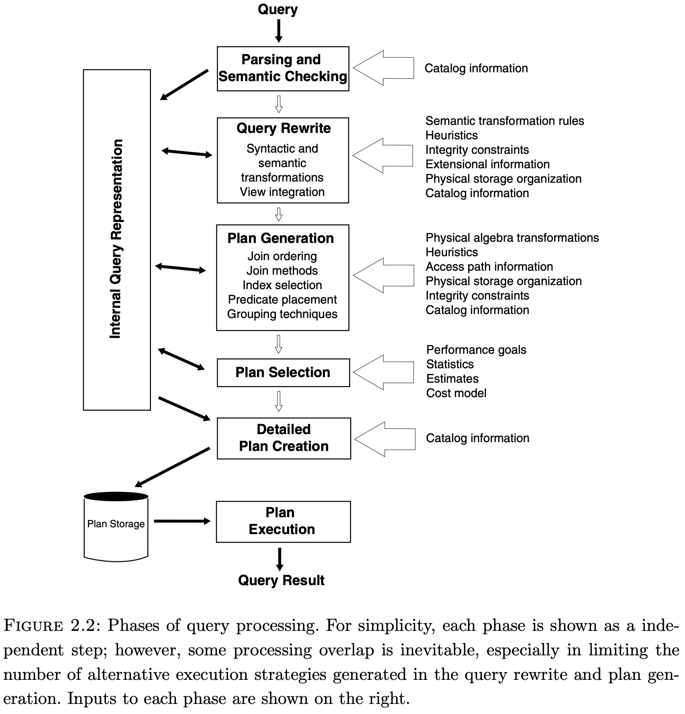
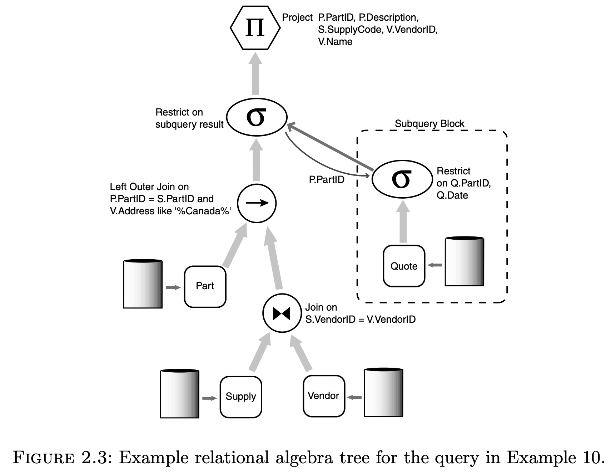
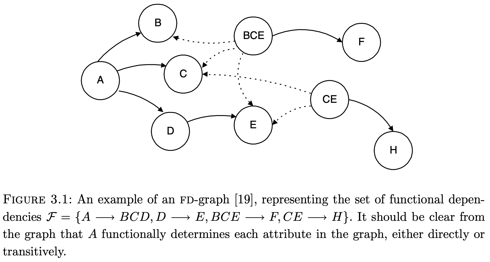

## AI论文解读 | Exploiting Functional Dependence In Query Optimization
        
### 作者        
digoal        
        
### 日期        
2025-10-06        
        
### 标签        
PostgreSQL , PolarDB , DuckDB , AI , 论文解读        
        
----        
        
## 背景  
      
https://cs.uwaterloo.ca/research/tr/2000/11/CS-2000-11.thesis.pdf        
  
提示:          
```          
读懂《Exploiting Functional Dependence In Query Optimization》这篇论文需要提前掌握哪些基础知识, 请使用中文通熟易懂的讲解这些基础知识, 可以引用论文中的图、表或使用Markdown支持的图形(text,mermaid等)增加解释性. 
  
使用中文通熟易懂的解读《Exploiting Functional Dependence In Query Optimization》这篇论文, 其中的关键内容请着重讲解, 可以引用论文中的图、表或使用Markdown支持的图形(text,mermaid等)增加解释性. 
  
提取《Exploiting Functional Dependence In Query Optimization》这篇论文中的重要术语, 使用中文对这些术语进行通熟易懂的讲解, 可以引用论文中的图、表或使用Markdown支持的图形(text,mermaid等)增加解释性. 
```     
  
## 1 前置知识 
  
好的, 为了完全理解这篇名为《在查询优化中利用函数依赖》(Exploiting Functional Dependence in Query Optimization)的博士论文, 您需要掌握一系列从基础到进阶的数据库理论知识。这篇论文的核心在于, 它为在现代SQL环境（包含NULL值、外连接、重复行等复杂特性）下如何精确推导和利用函数依赖来进行查询优化, 建立了一套严谨的理论体系和算法。

以下是您需要掌握的基础知识, 我将结合论文中的图表和概念进行通俗易懂的讲解。

### 1\. 关系数据库基础理论 (Relational Database Fundamentals)

这是最基础的部分, 就像学习物理需要先懂牛顿定律一样。

  * **关系/表 (Relation/Table)**: 您可以将其想象成一个二维表格, 比如Excel工作表。它由行和列组成。
  * **属性 (Attribute)**: 表的"列", 描述了数据的某个方面, 例如“员工”表中的“姓名”、“工号”列。
  * **元组/行 (Tuple/Row)**: 表的"行", 代表一个具体的数据实体, 例如“员工”表中某一个员工的所有信息。
  * **键 (Key)**:
      * **主键 (Primary Key)**: 能唯一标识表中每一行的属性或属性组合。例如, `学号`是学生表的主键, 因为每个学生的学号都是独一无二的。论文在第33页  提到了主键, 并强调其列必须是`definite` (非空) 的 。
      * **候选键 (Candidate Key)**: 和主键一样能唯一标识行, 但未被选为主键的键。例如, `身份证号`也可以是学生表的候选键。

### 2\. 函数依赖 (Functional Dependency, FD)

这是整篇论文的**核心基石**。

  * **基本定义**: 在一个表中, 如果通过属性集合A的值, 我们总能唯一地确定属性集合B的值, 那么就说B**函数依赖**于A, 记作 A → B。
  * **通俗理解**: 知道A, 就能查到唯一的B。
      * 例如, 在学生表中, 只要知道了`学号`, 就能唯一确定对应的`姓名`。所以存在函数依赖: `学号` → `姓名`。
    
    ```mermaid
    graph LR
        A(学号) --> B(姓名);
    ```
  * **论文的扩展**: 传统FD理论是在一个“理想世界”（没有NULL值, 没有重复行）中定义的。但这篇论文要解决的是真实SQL环境下的问题, 因此它引入了更复杂的FD定义来处理NULL值。
      * **严格函数依赖 (Strict FD)**: 论文在第35页  定义了它, 它将两个NULL值视为相等。也就是说, 如果两行的A列都是NULL, 那么它们的B列也必须相同（或都为NULL）, 这个FD才成立。
      * **宽松函数依赖 (Lax FD)**: 论文在第36页  定义了它, 它更接近传统定义, 只有在决定因素A不为NULL时, 才要求结论B的值必须唯一。这对于处理`UNIQUE`约束（允许有多个NULL值）和外连接产生NULL值的情况非常重要。

### 3\. SQL查询处理与优化 (SQL Query Processing & Optimization)

理解这个过程, 才能明白论文的研究成果用在哪里。一个SQL查询的执行过程大致如下, 论文中的 **图2.2** (第45页)  完美地展示了这个流程。    

```text
  用户SQL查询
      ↓
+----------------------+
|   解析与语义检查     |
+----------------------+
      ↓
+----------------------+     <-- 论文的核心贡献之一作用于此
|     查询重写         |
| (Semantic Rewrite)   |
| e.g., 子查询转连接   |
+----------------------+
      ↓
+----------------------+
|     计划生成         |
| (Plan Generation)    |
| e.g., 选择连接算法   |
+----------------------+
      ↓
+----------------------+
|     计划选择         |
|  (Plan Selection)    |
| e.g., 基于成本估算   |
+----------------------+
      ↓
    查询结果
```

  * **查询解析 (Parsing)**: 将SQL文本转换成计算机能理解的内部结构, 通常是一棵“代数表达式树”。
  * **查询重写 (Query Rewrite)**: 这是论文的重点应用领域之一。在不改变查询结果的前提下, 将原始查询转换成逻辑上等价但可能执行效率更高的形式。例如, 论文第4章  专门讨论了利用FD进行查询重写, 如判断 `SELECT DISTINCT` 中的 `DISTINCT` 是否是多余的 , 或者将子查询转换为连接 。
  * **计划生成与选择 (Plan Generation & Selection)**: 为重写后的查询制定多种具体的执行方案（比如用嵌套循环连接还是哈希连接）, 并通过一个**成本模型**估算每个方案的代价, 最终选择一个代价最小的方案去执行。

### 4\. 关系代数 (Relational Algebra)

这是查询优化器内部用来表示和操作查询的数学语言。论文在第12-32页  定义了一套扩展的关系代数。你需要理解以下基本操作：

  * **选择 (Selection, σ)**: 过滤行, 对应SQL的 `WHERE` 子句。
  * **投影 (Projection, π)**: 选择列, 对应SQL的 `SELECT` 子句。
  * **连接 (Join)**: 将多个表按指定条件合并。论文特别深入地研究了**外连接 (Outer Join)**, 因为外连接会产生NULL值, 从而极大地影响函数依赖的推导。
  * **笛卡尔积 (Cartesian Product, ×)**: 将两个表的所有行进行组合。
  * **集合操作 (Set Operations)**: 如并 (Union), 交 (Intersect), 差 (Except)。

论文中的 **图2.3** (第46页)  就是一个关系代数树的例子, 它清晰地展示了一个复杂SQL查询的逻辑结构。   

```text
        Π (投影)
        |
        σ (选择)
        |
    ← (左外连接)
    /          \
  Part         ⋈ (内连接)
             /       \
          Supply    Vendor
```

这篇论文的主要工作之一就是分析, 经过每一个关系代数操作符（如连接、投影）之后, 新生成的中间表上还保留着哪些函数依赖, 或者产生了哪些新的函数依赖。

### 5\. 论文特有的高级概念

要深入理解论文的贡献, 还需要了解它为解决现实问题而引入或扩展的概念：

  * **多重集 (Multiset) vs. 集合 (Set)**: 传统关系理论基于集合（不允许重复行）, 但SQL表是多重集（允许重复行）。为了处理这个问题, 论文在模型中引入了**元组标识符 (Tuple Identifier)**  这样一个虚拟属性来唯一标识每一行, 即使它们的数据值完全相同。
  * **FD-Graph (函数依赖图)**: 这是论文提出的核心数据结构, 用于表示和推导函数依赖。如 **图3.1** (第103页)  所示, 它是一个有向图, 节点代表属性（或属性组）, 边代表函数依赖。论文对这个图进行了大量扩展, 用不同类型的节点和边来表示`严格/宽松`依赖、`等价约束`、`NULL约束`等复杂信息 。    
  * **顺序优化 (Order Optimization)**: 论文第5章  探讨了如何利用FD来避免不必要的排序 (`ORDER BY`, `GROUP BY`, `DISTINCT` 都可能需要排序)。例如, 如果 `ORDER BY A, B`, 且已知 A → B, 那么 `ORDER BY A` 就足够了, 因为A相同时B也必然相同, 这可以简化排序操作。

### 总结

简单来说, 要读懂这篇论文, 您需要：

1.  **懂数据库**: 知道表、主键是什么。
2.  **懂函数依赖**: 明白“知道A就能确定B”这个核心概念。
3.  **懂SQL怎么执行**: 了解从SQL文本到最终结果中间经历了重写和优化的过程。
4.  **懂关系代数**: 能看懂用符号（如σ, π, ⋈）表示的查询计划。

在此基础上, 这篇论文会教给您一套全新的、更强大的方法, 来分析在包含**NULL值、外连接、重复行**的真实SQL世界里, 函数依赖是如何“存活”和“演变”的, 以及如何利用这些信息让数据库跑得更快。
  
## 2 解读论文 
  
好的, 这篇名为《在查询优化中利用函数依赖》(Exploiting Functional Dependence in Query Optimization)的博士论文是一部深入探讨数据库核心优化技术的学术著作。它系统性地解决了在现代SQL环境中如何精确推导并利用“函数依赖”这一经典理论来提升查询效率的问题。

以下我将用通俗易懂的方式为您解读这篇论文的关键内容。

### 核心问题：为什么经典理论在现代SQL中不够用了？

我们先理解一个核心概念：**函数依赖 (Functional Dependency, FD)**。

简单说, 如果在一个表中, 知道属性A的值就能唯一确定属性B的值, 我们就说“B函数依赖于A”, 记作 `A → B`。最常见的例子就是 `学号 → 姓名`。

这个理论是数据库设计的基石, 但在查询优化中同样至关重要。例如, 如果一个查询结果的列中包含了主键, 那么查询结果就一定不会有重复行, 这时 `SELECT DISTINCT` (去重) 操作就是多余的, 可以被优化掉, 从而避免昂贵的排序操作 。

然而, 经典函数依赖理论建立在一个“理想世界”里, 这个世界没有以下这些在真实SQL中非常普遍的复杂情况：

  * **NULL值**: `NULL` 代表未知或不存在, `NULL = NULL` 的结果是`UNKNOWN`而不是`TRUE` 。这让依赖的判断变得复杂。
  * **三值逻辑 (Three-valued Logic)**: SQL的逻辑判断有`TRUE`, `FALSE`, `UNKNOWN`三种结果 。
  * **外连接 (Outer Joins)**: 左连接、右连接、全连接会产生包含大量NULL值的行, 严重破坏了原始表中的函数依赖关系。
  * **重复行 (Duplicate Rows/Multiset)**: SQL表允许存在完全相同的行, 而经典关系理论基于集合(Set), 不允许重复 。

这篇论文的**核心目标**就是建立一套严谨的理论和算法, 将函数依赖理论扩展到能处理上述所有复杂情况的现代SQL环境中, 并将其应用于查询优化。

### 关键内容解读

#### 1\. 扩展函数依赖：严格依赖 (Strict FD) 与宽松依赖 (Lax FD)

为了应对NULL值带来的挑战, 论文重新定义了两种函数依赖 ：

  * **严格函数依赖 (Strict Functional Dependency)**: 这种定义认为两个NULL值是相等的。如果 `A → B` 是严格函数依赖, 那么当两行的A列值相同时（包括同为NULL）, 它们的B列值也必须相同 。这对于处理 `GROUP BY` 或 `DISTINCT` 等视NULL为相等的操作非常有用 。

  * **宽松函数依赖 (Lax Functional Dependency)**: 这种定义更接近经典理论, 它忽略NULL值。只有当两行的A列值相等且**不为NULL**时, 才要求它们的B列值必须相同 。这种依赖常见于有`UNIQUE`约束但允许NULL的列, 或者在外连接的结果中 。

通过区分这两种依赖, 优化器可以更精确地推断数据属性, 而不是简单地因为存在NULL就放弃所有依赖关系。

#### 2\. 核心数据结构：扩展的函数依赖图 (FD-graph)

为了在查询优化的过程中表示、存储和推导这些复杂的依赖关系, 论文设计了一种名为 **FD-graph** 的扩展图数据结构 。

您可以将它想象成一张关系地图：

  * **节点 (Vertices)**: 代表数据表中的单个属性 (如`PartID`) 或复合属性 (如`{VendorID, PartID}`) 。
  * **边 (Edges)**: 代表了不同类型的约束关系。

如论文中的 **图3.1** 所示, 它清晰地描绘了属性间的依赖关系。  

```text
       A ──F──> B ──C──> BCE
       │          │          │
       F          C          F
       │          │          │
       ↓          ↓          ↓
       C ──C──> BCE         F
       │
       F
       │
       ↓
       D ──F──> E
```

  

*(这是一个对图3.1  的简化文本表示)*

论文对基础的FD-graph做了大量扩展, 使用了不同类型的边和节点属性来表示：

  * **严格依赖** vs **宽松依赖** (用不同样式的边表示) 。
  * **等价约束 (Equality)**: 如 `A = B` 。
  * **属性是否可为NULL** (标记节点) 。
  * **外连接产生的NULL约束**: 标记一组属性要么同时为NULL（来自外连接的“补全行”）, 要么都有值 。

这个FD-graph是论文算法的核心载体。每当查询计划执行一个代数操作（如连接、选择、投影）, 算法就会更新这个图, 从而动态追踪依赖关系在整个查询过程中的演变。

#### 3\. 核心算法：逐个击破关系代数操作符

论文的第3章是其理论贡献的核心。它详细分析了每一个SQL关系代数操作（如`JOIN`, `LEFT JOIN`, `UNION`, `SELECT`, `GROUP BY`等）如何影响输入的函数依赖, 并给出了为该操作的输出结果构建新FD-graph的精确算法 。

**最具挑战性也最具贡献的部分是对外连接 (Outer Join) 的分析** 。

例如, 对于一个 `R LEFT JOIN S` 操作：

  * 来自左表R的函数依赖通常会被保留, 因为R的所有行都出现在结果中 。
  * 来自右表S的严格函数依赖 `A → B` 可能会被破坏。因为如果R中某一行在S中没有匹配项, 那么结果中对应的A和B列都会是NULL。这可能导致两行不同的R记录在外连接后, 它们对应的S部分都是NULL行, 如果这两行R记录的A列值不同, 就可能破坏严格依赖。
  * 论文的算法能够精确判断：在何种条件下（例如, 连接键本身是非空的）, 右表S的依赖可以被保留为严格依赖, 或者“降级”为宽松依赖, 或者完全失效 。

通过为每个操作符建立依赖推导规则, 优化器就可以为一个完整的、复杂的查询计划树构建出最终结果所满足的函数依赖图。

#### 4\. 实践应用：查询重写与顺序优化

拥有了精确推导FD的能力后, 论文在第4章和第5章展示了如何将其用于实际的查询优化。

  * **查询重写优化 (Rewrite Optimization)**

      * **去重消除 (Unnecessary `DISTINCT` Elimination)**: 这是最直接的应用。算法通过分析最终的FD-graph, 判断查询结果的列是否包含一个“键”（即能唯一确定一行）。如果包含, `DISTINCT` 就是多余的, 可以安全移除 。
      * **子查询转换为连接 (Subquery to Join)**: 某些情况下, 一个带有 `EXISTS` 子查询的语句可以被重写为一个等价的 `JOIN` 语句。这种转换是否有效, 往往取决于子查询的结果是否对于外层查询的每一行都是唯一的 。论文的理论可以精确判断这种唯一性 。

  * **顺序优化 (Order Optimization)**

      * **避免排序 (`ORDER BY` 优化)**: 排序是一个非常耗费资源的操作。论文第5章探讨了如何利用函数依赖来避免排序 。
          * **基本思想**: 如果查询要求 `ORDER BY A, B`, 而优化器通过分析得知 `A → B` (即A的值确定后, B的值也唯一确定了), 那么仅按 `A` 排序就已经足够达到目的了, 因为A相同时B必然也相同 。
          * **连接中的顺序保留**: 论文还分析了在不同连接算法（如嵌套循环连接、归并连接）中, 输入表的顺序如何被保留到输出结果中, 以及如何结合函数依赖来推断最终的顺序 。

### 总结

这篇论文可以被看作是连接经典数据库理论与现代SQL系统复杂现实之间的桥梁。

  * 它**直面了NULL值和外连接等难题**, 没有回避, 而是通过引入`严格/宽松依赖`等新概念, 建立了一套更完备、更精确的理论框架。
  * 它提出了 **FD-graph** 这一强大的工具, 将抽象的依赖关系具象化, 使得算法可以系统地进行推导和维护。
  * 它最终将理论落地于实践, 展示了如何利用这套复杂的分析工具来解决查询优化中的具体问题, 如**去重消除**和**排序优化**, 这些都是能显著提升数据库性能的关键点。

总而言之, 这篇论文的价值在于其**严谨性、系统性和实用性**, 它为构建更智能的数据库查询优化器提供了坚实的理论基础。
  
## 3 术语 
  
好的，这篇论文《在查询优化中利用函数依赖》是一篇数据库领域的经典博士论文，它为现代SQL查询优化器如何更智能地处理数据关系提供了坚实的理论基础。为了帮助您理解，我将提取其中最重要的术语，并用通俗易懂的中文进行讲解。

### 1\. 函数依赖 (Functional Dependency, FD)

这是理解整篇论文的基石。

  * **讲解**: 函数依赖描述了数据库表中各列（属性）之间的一种约束关系。简单来说，如果知道属性A的值，就能唯一地确定属性B的值，那么我们就说“B函数依赖于A”，记作 `A → B`。

  * **通俗比喻**: 就像在学校数据库里，只要知道了**学号**，就一定能找到唯一的**姓名**。所以存在函数依赖：`学号 → 姓名`。

    ```mermaid
    graph LR
        A(学号) --> B(姓名);
    ```

  * **在论文中的重要性**: 整个查询优化的前提就是挖掘和利用这些隐藏在数据中的确定性关系。例如，如果查询结果里包含了主键，优化器就能推断出结果不会有重复行，从而跳过昂贵的去重操作 。

### 2\. 严格函数依赖 (Strict FD) 与 宽松函数依赖 (Lax FD)

这是论文的核心创见之一，旨在解决SQL中 `NULL` 值带来的麻烦。

  * **讲解**:

      * **严格函数依赖 (Strict Functional Dependency)**: 这种依赖把两个 `NULL` 值看作是相等的。如果 `A → B` 是一个严格依赖，那么当两行的A列值相同时（**包括同为NULL**），它们的B列值也必须相同。这对于 `GROUP BY` 或 `DISTINCT` 操作很关键，因为这些操作通常视NULL为相等 。
      * **宽松函数依赖 (Lax Functional Dependency)**: 这种依赖更接近经典定义，它在判断时会“忽略” `NULL` 值。只有当两行的A列值相等且**不为NULL**时，才要求它们的B列值必须唯一。这非常适合用来描述外连接（Outer Join）产生的结果，或者那些允许存在多个NULL值的唯一约束（`UNIQUE` constraint）列 。

  * **图解对比**:

| 类型 | A → B 的成立条件 | 示例场景 |
| :--- | :--- | :--- |
| **严格 (Strict)** | A列值相等（包括 `NULL = NULL`），B列值也必须相等。 | `GROUP BY` 分组，`DISTINCT` 去重 |
| **宽松 (Lax)** | A列值相等且**非空**，B列值才必须相等。 | 外连接产生的结果，允许NULL的唯一键 |

### 3\. 等价约束 (Equivalence Constraints)

这个概念用于捕捉属性之间更强的关系——值的完全相等。

  * **讲解**: 当查询的 `WHERE` 子句中包含 `R.A = S.B` 这样的条件时，我们不仅知道 `A → B` 和 `B → A`，更重要的是，在满足条件的行中，A和B的值是**完全相同**的。论文将这种关系称为**等价约束** 。
  * **严格与宽松之分**:
      * **严格等价 (Strict Equivalence, ω=)**: 即使在有NULL的情况下，两列的值也必须“严格”保持一致（包括同为NULL）。这通常由 `WHERE A = B` 这样的条件产生。
      * **宽松等价 (Lax Equivalence, ≈)**: 两列的值在非空时相等。这通常是外连接的 `ON` 条件 `ON R.A = S.B` 产生的结果，因为未匹配的行会导致其中一列为NULL而另一列有值。
  * **在论文中的重要性**: 识别出等价约束，优化器就可以进行属性替换，简化表达式，或者推导出更强的函数依赖。

### 4\. 函数依赖图 (FD-graph)

这是论文用来表示和推导上述所有复杂依赖关系的核心数据结构。

  * **讲解**: FD-graph是一种经过特殊设计的有向图。论文中的 **图3.1** (第103页) 就是一个很好的例子。    

      * **节点 (Node)**: 代表一个属性（如 `A`）或一组属性（如 `BCE`）。
      * **边 (Edge)**: 代表依赖关系。

    论文对这个图进行了大量扩展，使用了不同类型的边和节点来精确表示：

      * 实线边 (`F`): 表示严格函数依赖。
      * 虚线边 (`L`): 表示宽松函数依赖。
      * 其他特殊边: 表示等价约束、复合属性的构成等。

  * **图解 (简化的FD-graph)**:

    ```mermaid
    graph TD
        subgraph "FD-graph示例"
            PK[主键A] -- 严格依赖 --> Attr1[属性B];
            PK -- 严格依赖 --> Attr2[属性C];
            UniqueKey["唯一键D (可为NULL)"] -. 宽松依赖 .-> Attr3[属性E];
        end
    ```

  * **在论文中的重要性**: 这个图是论文所有算法的载体。每当查询计划执行一步操作（如一次连接），算法就会相应地更新这个图。最终，通过分析图的结构，优化器就能知道最终结果满足哪些依赖关系。

### 5\. 顺序属性 (Order Property) 与 有价值顺序 (Interesting Order)

这组术语用于处理查询中的排序优化问题，是论文第5章的核心。

  * **讲解**:

      * **顺序属性 (Order Property)**: 描述了一批数据行的物理排列顺序。例如，如果数据是按 `(部门, 工资)` 排序的，那么它的顺序属性就是 `op(部门, 工资)` 。
      * **有价值顺序 (Interesting Order)**: 指查询执行过程中，如果数据能按这个顺序排列，会带来性能好处的顺序。例如，`ORDER BY`子句、`GROUP BY`子句、以及归并连接(`Sort-Merge Join`)的连接键都是“有价值顺序” 。

  * **在论文中的重要性**: 论文的关键工作是建立了一套公理（Axioms），用来推导“顺序属性”和“函数依赖”之间的关系。

      * **核心思想**: 如果已知 `部门 → 经理`，并且数据已经按 `op(部门)` 排好序，那么我们就可以**免费**得到 `op(部门, 经理)` 的顺序属性，因为部门相同时，经理必然也相同。这使得优化器可以避免许多不必要的排序操作 。

### 6\. 查询重写优化 (Query Rewrite Optimization)

这是应用上述所有理论的最终目的。

  * **讲解**: 在不改变查询结果的前提下，将用户写的SQL语句转换成逻辑上等价，但执行效率可能更高的另一种写法。这发生在生成具体执行计划之前 。
  * **论文中的应用示例**:
      * **去重消除**:
          * **原始查询**: `SELECT DISTINCT E.EmpID, E.Name FROM Employee E;`
          * **分析**: 优化器利用 `EmpID` 是主键这一函数依赖 (`EmpID → Name`)，推断出查询结果本身就不可能重复。
          * **重写后**: `SELECT ALL E.EmpID, E.Name FROM Employee E;` (移除了`DISTINCT`，避免了排序去重) 。
      * **子查询转连接**:
          * **原始查询**: `SELECT V.* FROM Vendor V WHERE EXISTS (SELECT * FROM Supply S WHERE S.VendorID = V.VendorID AND S.PartID = 'P01');`
          * **分析**: 优化器通过函数依赖分析，确认对于每个Vendor，子查询最多返回一行。
          * **重写后**: `SELECT V.* FROM Vendor V JOIN Supply S ON V.VendorID = S.VendorID WHERE S.PartID = 'P01';` (重写为JOIN后，优化器可以使用哈希连接等更多高效算法) 。

通过对这些关键术语的理解，您就能 grasp 这篇论文的精髓：它通过严谨的数学方法，将经典的函数依赖理论现代化，使其能够精确地指导数据库优化器在复杂的真实SQL环境中做出更明智的决策。
  
## 参考        
         
https://cs.uwaterloo.ca/research/tr/2000/11/CS-2000-11.thesis.pdf    
        
<b> 以上内容基于DeepSeek、Qwen、Gemini及诸多AI生成, 轻微人工调整, 感谢杭州深度求索人工智能、阿里云、Google等公司. </b>        
        
<b> AI 生成的内容请自行辨别正确性, 当然也多了些许踩坑的乐趣, 毕竟冒险是每个男人的天性.  </b>        
  
    
#### [期望 PostgreSQL|开源PolarDB 增加什么功能?](https://github.com/digoal/blog/issues/76 "269ac3d1c492e938c0191101c7238216")
  
  
#### [PolarDB 开源数据库](https://openpolardb.com/home "57258f76c37864c6e6d23383d05714ea")
  
  
#### [PolarDB 学习图谱](https://www.aliyun.com/database/openpolardb/activity "8642f60e04ed0c814bf9cb9677976bd4")
  
  
#### [PostgreSQL 解决方案集合](../201706/20170601_02.md "40cff096e9ed7122c512b35d8561d9c8")
  
  
#### [德哥 / digoal's Github - 公益是一辈子的事.](https://github.com/digoal/blog/blob/master/README.md "22709685feb7cab07d30f30387f0a9ae")
  
  
#### [About 德哥](https://github.com/digoal/blog/blob/master/me/readme.md "a37735981e7704886ffd590565582dd0")
  
  

  
