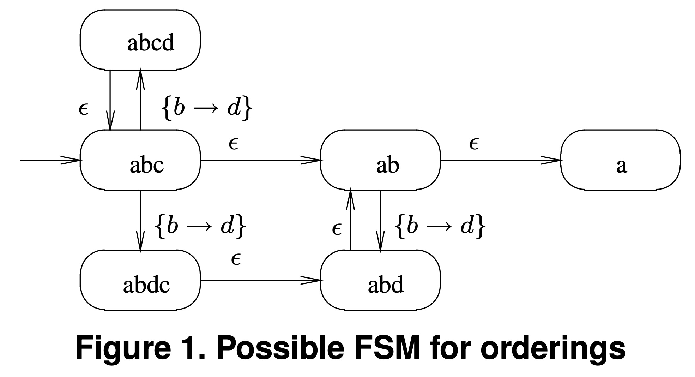
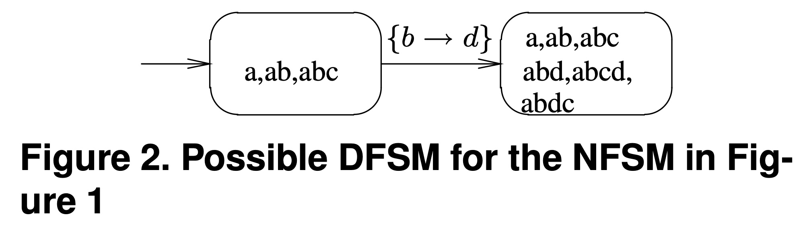
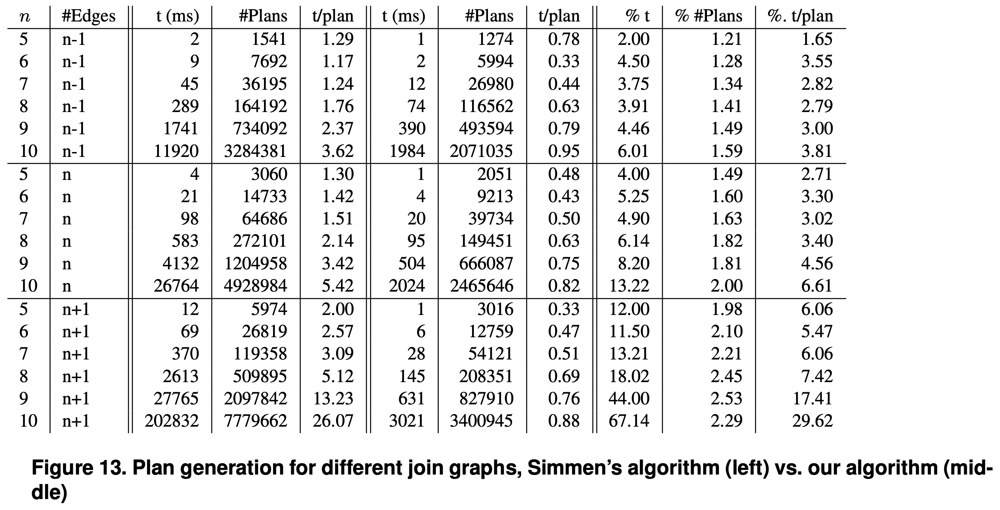

## AI论文解读 | An Efficient Framework For Order Optimization
        
### 作者        
digoal        
        
### 日期        
2025-10-06        
        
### 标签        
PostgreSQL , PolarDB , DuckDB , AI , 论文解读        
        
----        
        
## 背景  
      
https://www.researchgate.net/publication/4084912_An_efficient_framework_for_order_optimization        
  
提示:          
```          
读懂《An Efficient Framework For Order Optimization》这篇论文需要提前掌握哪些基础知识, 请使用中文通熟易懂的讲解这些基础知识, 可以引用论文中的图、表或使用Markdown支持的图形(text,mermaid等)增加解释性. 
  
使用中文通熟易懂的解读《An Efficient Framework For Order Optimization》这篇论文, 其中的关键内容请着重讲解, 可以引用论文中的图、表或使用Markdown支持的图形(text,mermaid等)增加解释性. 
  
提取《An Efficient Framework For Order Optimization》这篇论文中的重要术语, 使用中文对这些术语进行通熟易懂的讲解, 可以引用论文中的图、表或使用Markdown支持的图形(text,mermaid等)增加解释性. 
```     
  
## 1 前置知识 
  
好的，为了透彻理解《An Efficient Framework for Order Optimization》这篇论文，您需要掌握以下几个领域的基础知识。我会用通俗易懂的语言，并结合论文中的图表示例来为您讲解。

### 核心脉络

这篇论文的核心思想是：在数据库进行查询优化的过程中，判断和推导数据流的“顺序”是一个非常频繁且耗时的操作。作者提出了一种新方法，通过预先将所有可能的“顺序”关系和变化构建成一个**确定性有限状态机 (DFSM)**，从而将原来耗时的推导过程（ 复杂度为 $\Omega(n)$ ）转变为常数时间（ $O(1)$ ）的查表操作，极大地提升了查询优化的速度 。

要理解这个过程，我们需要先掌握以下基础知识：

-----

### 一、 数据库查询处理与优化基础 (The "Why")

这是理解论文动机的宏观背景。当您向数据库提交一条SQL查询语句时，数据库并不会直接执行它。

1.  **查询计划 (Query Plan)**：数据库的“大脑”——查询优化器，会首先生成许多种可能完成这个查询的“执行路径”，也就是查询计划。一个查询计划就像一张流程图，由一系列物理操作符（如表扫描、索引扫描、连接、排序等）组成。

    例如，一个简单的两表连接查询，其计划可能如下图所示：

    ```mermaid
    graph TD
        A[Sort-Merge Join] --> B[Table Scan: R1];
        A --> C[Sort: R2];
        C --> D[Table Scan: R2]
    ```

    这个计划表示：先扫描R1表和R2表，对R2表进行排序，然后用“归并排序连接”算法将两者连接起来。

2.  **基于成本的优化 (Cost-Based Optimization)**：查询优化器会估算每一种查询计划的执行成本（比如耗时、I/O次数等），然后选择成本最低的那个计划去执行 。

3.  **顺序的重要性**：数据流的“顺序”之所以重要，是因为某些物理操作符可以**利用**有序的数据流来提升性能（如归并排序连接 Merge-Join，它要求输入的数据流是排好序的），而另一些操作符可以**产生**有序的数据流（如索引扫描或显式的排序 Sort 操作）。如果优化器能很好地管理和利用这些“顺序”，就可以避免不必要的排序操作，从而大幅降低查询成本 。

-----

### 二、 核心概念：物理顺序、逻辑顺序与“有趣顺序” (The "What")

这是论文直接要解决的问题。

1.  **物理顺序 (Physical Ordering)**：指数据在数据流中实实在在的排列顺序 。比如，一个数据流按照员工ID (eid) 物理排序。

2.  **逻辑顺序 (Logical Ordering)**：指从物理顺序和数据本身的约束中可以**推断**出的顺序 。

      * **论文中的经典例子**：假设一个数据流的**物理顺序**是按属性 `a` 排序的 。当经过一个筛选条件 $a=b$ 后，虽然数据流的物理排列没变，但我们现在可以**逻辑上**认为这个数据流同时也是按 `b`、`(a, b)`、`(b, a)` 等多种方式排序的，因为在任何一条数据里 `a` 和 `b` 的值都相等了 。这种由操作符引发的顺序变化，就是论文要高效处理的核心问题之一 。

3.  **有趣顺序 (Interesting Order)**：不是所有的顺序都有价值。查询优化器只关心那些对生成更优计划有帮助的顺序，这些被称为“有趣顺序” 。一个顺序“有趣”通常因为：

      * 它是某个后续操作符（如Merge-Join） **需要** 的顺序 。
      * 它是某个操作符（如索引扫描）能够**产生**的顺序 。
      * 它是用户通过 `ORDER BY` 子句最终**要求**的顺序 。

-----

### 三、 函数依赖 (Functional Dependency) (The "How" of Inference)

这是论文用来进行逻辑顺序推导的理论工具。

1.  **什么是函数依赖 (FD)**：这是关系数据库理论中的一个基本概念。如果在一张表中，属性集合X的值能够唯一确定属性Y的值，我们就说“Y函数依赖于X”，记作 $X \rightarrow Y$ 。例如，`学号 -> 姓名`，意味着只要学号确定，姓名也就唯一确定了。

2.  **FD如何用于顺序推导**：FD是推导逻辑顺序的数学依据。

      * **论文中的例子**：如果一个数据流已经按 `(..., B1, ..., Bk, ...)` 排序，并且存在函数依赖 $B_1, ..., B_k \rightarrow B_{k+1}$ ，那么我们就可以推断出，这个数据流实际上也满足在 $B_k$ 之后插入 $B_{k+1}$ 的新顺序 。
      * **举个例子**：数据流已按 `(订单ID)` 排序，而已知 `订单ID -> 客户ID`。那么我们可以推断，这个数据流也满足 `(订单ID, 客户ID)` 这个逻辑顺序。
      * 像 $a=b$ 这样的等式条件，可以看作是两个函数依赖的集合： $a \rightarrow b$ 和 $b \rightarrow a$ 。

-----

### 四、 有限状态机理论 (Finite Automata Theory) (The Core Solution)

这是论文创新性解决方案的理论基石。作者将顺序推导问题转换为了一个状态机游走问题。

1.  **有限状态机 (FSM)**：一个数学模型，由一组**状态 (States)**、一组**输入 (Inputs)** 和一个**转移函数 (Transitions)** 组成。它在任何时刻都处于某个状态，当接收到一个输入时，会根据转移函数“跳转”到下一个状态。

2.  **非确定性有限状态机 (NFSM)**：在这种状态机中，对于一个给定的状态和输入，可能有**多个**下一个状态，或者可以通过一个特殊的“ $\epsilon$ ”输入（即不消耗任何实际输入）进行状态转移 。

      * **论文中的应用**：作者首先将顺序关系构建成一个NFSM。
          * **状态 (Node)**：代表一个或一组逻辑顺序。例如，`abc` 这个状态代表 `(a,b,c)` 这个顺序。
          * **转移 (Edge)**：由函数依赖或 $\epsilon$ 触发。
      * **参考论文图1**：      
          * 从 `abc` 到 `ab` 再到 `a` 的 $\epsilon$ 边表示：如果数据满足 `(a,b,c)` 顺序，那它**必然**也满足其前缀顺序 `(a,b)` 和 `(a)` 。
          * 从 `abc` 出发，在接收到函数依赖 $\{b \rightarrow d\}$ 这个“输入”后，可以推导出 `(a,b,d,c)` 和 `(a,b,c,d)` 两种新的顺序，因此有两条边分别指向 `abdc` 和 `abcd` 两个新状态。这就是“非确定性”的体现 。

3.  **确定性有限状态机 (DFSM)**：与NFSM相对，DFSM对于任何一个状态和一个输入，其下一个状态是**唯一确定**的。任何一个NFSM都可以通过“子集构造法”(Power Set Construction) 转换为一个等价的DFSM 。

      * **DFSM的状态**：DFSM中的一个状态，对应的是NFSM中**一组状态的集合** 。
      * **参考论文图2**：      
        这是图1的NFSM转换成的DFSM 。注意看，DFSM的节点少了很多。例如，左边的节点 `a,ab,abc` 实际上是NFSM中 `abc`、`ab`、`a` 这三个状态的集合。

4.  **如何实现O(1)复杂度**：

      * 在查询优化开始前，论文的方法会一次性完成“NFSM构建 -\> 转换为DFSM -\> 预计算”的全部准备工作 。
      * 它会生成两张核心的表：一张是“状态-顺序”包含关系表（**兼容性矩阵**），另一张是“当前状态+输入FD -\> 下一状态”的**转移表** 。
      * 在真正的计划生成阶段，一个子计划所满足的所有逻辑顺序，就只用一个DFSM状态号（一个整数）来表示 。
      * **检查顺序**（`contains`操作）：变成了查兼容性矩阵，看当前状态号是否包含目标顺序，这是 $O(1)$ 的 。
      * **推导新顺序** (`inferNewLogicalOrderings`操作)：当应用一个新操作符（带来一组FD）时，就相当于在转移表中查找`(当前状态号, FD)`对应的下一个状态号，这也是 $O(1)$ 的 。

### 总结

为了读懂这篇论文，您可以按照下面的路径来梳理知识：

| 必备知识                  | 它在论文中扮演的角色                                                                                                                          |
| ------------------------- | --------------------------------------------------------------------------------------------------------------------------------------------- |
| **数据库查询优化** | **背景**：解释了为什么“顺序”很重要，以及为什么优化“顺序处理”对整个查询优化过程至关重要。                                                    |
| **有趣顺序与逻辑顺序** | **问题**：定义了论文需要精确、高效地追踪和推导的对象。                                                                                        |
| **函数依赖** | **工具**：提供了从已知顺序推导出新逻辑顺序的理论依据。                                                                                        |
| **有限状态机 (NFSM/DFSM)** | **解决方案**：将复杂的、动态的顺序推导问题，预编译成一个静态的、高效查询的DFSM模型，从而实现了从 $\Omega(n)$ 到 $O(1)$ 的革命性性能飞跃。 |

掌握了这些基础知识后，您就能更好地理解论文中算法的每一步设计（如NFSM的构建、剪枝、到DFSM的转换等）的精妙之处和其对性能的深远影响。
  
## 2 解读论文 
  
好的，我们来通俗易懂地解读《An Efficient Framework For Order Optimization》这篇经典论文。

### 核心思想一句话总结

这篇论文提出了一种革命性的方法，通过预先将所有与查询相关的“排序顺序”及其变化关系构建成一个**确定性有限状态机 (DFSM)**，将查询优化过程中极其耗时且频繁的“顺序”检查与推导操作，从原来与函数依赖数量相关的线性时间复杂度（ $\Omega(n)$ ）降至常数时间（ $O(1)$ ），极大地提升了数据库查询优化的速度。

-----

### 一、问题背景：查询优化中的“有趣顺序”

在数据库处理SQL查询时，查询优化器会生成许多执行计划，并选择成本最低的一个 。在这个过程中，“顺序”是一个至关重要的因素 。

  * **什么是“有趣顺序”(Interesting Order)？** 
      * 某些操作可以**利用**有序数据，例如归并连接 (Merge Join) 要求输入的数据流是排好序的 。
      * 某些操作可以**产生**有序数据，例如索引扫描或排序 (Sort) 操作 。
      * 最终用户通过 `ORDER BY` 指定的顺序 。

优化器如果能善用这些“有趣顺序”，就可以避免大量昂贵的排序操作，从而节省时间 。

  * **问题的复杂性在哪？**
    顺序的管理并非简单的记录。一个操作符可能会改变数据流的**逻辑顺序**。例如，一个数据流原本按 `(a)` 排序，在经过筛选条件 `a=b` 后，它的物理顺序没变，但逻辑上我们可以认为它同时按 `(b)`, `(a, b)` 和 `(b, a)` 排序了 。这种推导需要借助**函数依赖 (Functional Dependencies, FDs)** 来完成 。

在计划生成的数百万步骤中，优化器需要反复询问两个核心问题 ：

1.  **`contains`**：当前数据流是否满足某个特定的顺序要求？ 
2.  **`inferNewLogicalOrderings`**：当增加一个操作（比如带 `a=b` 条件的筛选）后，数据流会新增哪些逻辑顺序？ 

### 二、传统方法的瓶颈 (Simmen et al. 的方法)

这篇论文发表前，最先进的方法由 Simmen 等人提出 。其主要思路是：

  * 为每个计划节点保存一个物理顺序和所有适用的函数依赖 (FDs) 。
  * 在判断顺序是否满足时，通过应用函数依赖对物理顺序和目标顺序进行“规约 (reduction)”，然后比较规约后的结果 。

**这种方法的缺陷很明显**：

  * **时间复杂度高**：每次 `contains` 或 `infer` 操作，都可能需要遍历所有相关的函数依赖。因此，其时间和空间复杂度的下限都是 $\Omega(n)$ ，其中n是FD的数量 。考虑到这些操作会被调用数百万次，总开销非常巨大 。
  * **可能不准确**：论文指出，Simmen方法的规约过程不是“融合的” (not confluent)，意味着不同的FD应用顺序可能导致不同的规约结果，从而错误地判断某个顺序不满足，导致优化器错失更优的计划 。

### 三、论文的创新方案：基于有限状态机 (FSM) 的框架

作者的核心洞察是：我们不需要在运行时反复进行推导，而是可以**预先计算**出所有可能的状态转换。他们将整个顺序推导问题巧妙地建模成了一个有限状态机 。

#### 1\. 整体思路

该框架分为两个阶段：

1.  **准备阶段 (一次性)**：在查询优化开始前，分析查询中的所有“有趣顺序”和函数依赖，构建一个**非确定性有限状态机 (NFSM)**，然后将其转化为一个等价且高效的**确定性有限状态机 (DFSM)** 。
2.  **计划生成阶段 (高频使用)**：在生成计划时，每个子计划的顺序信息不再是一长串FD，而仅仅是DFSM中的一个**状态ID (一个整数)** 。`contains` 和 `infer` 操作都变成了简单的查表，实现了 $O(1)$ 的时间复杂度 。

#### 2\. 从 NFSM 到 DFSM 的转换

  * **NFSM (非确定性有限状态机)**：首先，系统将每个“有趣顺序”看作一个状态节点。函数依赖则被看作是触发状态转换的“输入”。

      * **$\epsilon$ 转移**：代表蕴含关系。例如，如果满足 `(a,b,c)` 顺序，必然也满足其前缀 `(a,b)` 和 `(a)`。
      * **FD 转移**：应用一个FD可能推导出多种新的逻辑顺序，导致从一个状态出发有多条路径，这就是“非确定性”的来源。

    **论文中的图1** 直观地展示了这一点：     

      * 从状态`abc`出发，可以通过 $\epsilon$ 边到达 `ab` 和 `a`。
      * 当输入函数依赖 $\{b \rightarrow d\}$ 时，可以衍生出 `(a,b,d,c)` (`abdc`) 和 `(a,b,c,d)` (`abcd`) 等顺序，因此有多条出边。

  * **DFSM (确定性有限状态机)**：NFSM在处理上较为复杂，因此需要将其转换为DFSM。DFSM的特点是，对于任何状态和输入，其下一个状态是唯一确定的。转换的核心是**子集构造法**，即DFSM中的一个状态对应NFSM中一组状态的集合。

    **论文中的图2** 是图1转换后的结果：     
    可以看到，DFSM的状态数大大减少。例如，左边的节点代表了NFSM中 `{a, ab, abc}` 等状态的集合。当这个状态接收到 $\{b \rightarrow d\}$ 输入时，它会唯一地转移到右边的状态，该状态代表了由 $\{b \rightarrow d\}$ 推导出的所有新顺序的集合。

#### 3\. 关键技术：剪枝与预计算

为了让这个方法在现实中可行，作者还引入了几个关键的优化技术：

  * **剪枝 (Pruning)**：在构建NFSM时，会进行大量剪枝，移除那些不会产生任何新的“有趣顺序”的函数依赖和中间状态 。这极大地减小了FSM的规模，是整个方法能够高效运行的保证 。例如，如果属性 `d` 从未在任何有趣顺序中出现，那么像 $\{b \rightarrow d\}$ 这样的FD就会被提前剪掉 。
  * **预计算 (Precomputation)**：生成DFSM后，系统会预先计算好两个核心数据结构：
    1.  **兼容性矩阵**：一个表，记录了每个DFSM状态包含哪些“有趣顺序” 。
    2.  **转移表**：记录 `(当前状态, 输入的FD集合) -> 下一个状态` 的所有转换规则 。

在计划生成阶段，`contains(顺序)` 就变成了在**兼容性矩阵**中查询当前状态ID是否包含该顺序；而 `infer(FDs)` 则变成了在**转移表**中查找下一个状态ID 。这两个操作都是 $O(1)$ 的。

### 四、实验结果：显著的性能提升

论文通过实验证明了其框架的巨大优势。

  * **对比TPC-R第8号查询**：

    | 指标 | Simmen 的方法 | 论文提出的新方法 |
    | :--- | :---: | :---: |
    | 总计划生成时间 (ms) | 262 | **52** |
    | 生成的子计划总数 | 200,536 | **123,954** |
    | t/plan (µs) | 1.31 | **0.42** |
    | 占用内存 (KB) | 329 | **136** |

    

    结果惊人：新方法的**速度快了5倍**。更重要的是，由于新方法通过剪枝忽略了不相关的顺序信息，使得更多本质上等价的子计划可以被合并，从而**减少了38%的搜索空间**（生成的子计划更少）。

  * **对比不同复杂度的查询**：
    论文还针对不同关系数量（5到10个）和连接复杂度的查询进行了测试。

    **论文中的图13** 展示了详细数据，其结论是：     

      * 对于简单的5个关系的链式查询，新方法能带来约**2倍**的提速 。
      * 对于复杂的10个关系的查询，新方法带来的性能提升高达**60多倍** ！

    这充分说明，查询越复杂，函数依赖越多，传统方法的性能下降越严重，而新方法的 $O(1)$ 优势就越发凸显。

### 结论

《An Efficient Framework for Order Optimization》这篇论文做出了以下核心贡献：

1.  **理论创新**：首次将有限状态机理论成功应用于数据库的顺序优化问题，将动态推导问题转变为静态查表问题。
2.  **性能突破**：提出了一套完整的算法，包括NFSM的构建、剪枝和到DFSM的转换，最终实现了在计划生成阶段以 $O(1)$ 的时间和空间复杂度处理顺序，这在之前被认为是难以企及的。
3.  **实践价值**：实验证明，该方法不仅大幅缩短了查询优化的时间，还能有效压缩优化器的搜索空间，对处理复杂查询至关重要 。

总而言之，它通过一个巧妙的理论模型和工程实现，优雅地解决了查询优化领域一个长期存在的性能瓶颈。
  
## 3 术语 
  
好的，以下是对《An Efficient Framework For Order Optimization》这篇论文中关键术语的中文解读，旨在帮助您通俗地理解其核心概念。

-----

### 1\. Order Optimization (顺序优化)

  * **讲解**：
    这是数据库**查询计划生成** (plan generation) 的一个子领域，专门研究如何高效地管理和利用数据流的 **“有趣顺序”** 。其最终目标是通过重用已有顺序，尽可能地避免或减少查询执行计划中昂贵的排序 (Sort) 操作，从而降低查询的总执行成本 。

-----

### 2\. Interesting Order (有趣顺序)

  * **讲解**：
    并非所有可能的排序顺序都值得优化器关注。一个顺序之所以“有趣”，是因为它对生成更优的执行计划有潜在价值 。论文将“有趣顺序”定义为满足以下任一条件的顺序：
    1.  可由某个物理操作符**产生**，例如通过索引扫描 (index scan) 或显式排序 (sort operator) 产生的顺序 。
    2.  可被某个物理操作符**利用**，从而提升其执行效率，例如归并连接 (merge-join) 或分组 (group by) 操作需要有序的输入 。
    3.  是查询最终**要求**的结果顺序，即SQL中的 `ORDER BY` 子句 。

-----

### 3\. Physical vs. Logical Ordering (物理顺序与逻辑顺序)

这是理解本论文顺序推导问题的关键区别。

  * **物理顺序 (Physical Ordering)**

      * **讲解**：指数据在一个流中**实际的、物理上的排列次序** 。这个顺序是由上一个操作符（如索引扫描或排序）决定的。

  * **逻辑顺序 (Logical Ordering)**

      * **讲解**：指从物理顺序和数据约束中可以**推断**出的顺序 。即使数据流的物理排列不变，其满足的逻辑顺序集合也可能因为某个操作而改变 。
      * **论文中的经典例子** ：
        假设一个数据流的**物理顺序**是按属性 `a` 排序的。当这个流经过一个带有 `a=b` 筛选条件的选择 (select) 操作后，它的物理排列并未改变。但是，因为对于每一条数据 `a` 的值都等于 `b` 的值，我们现在可以从**逻辑上**认为这个数据流也同时满足按 `b`、`(a, b)`、`(b, a)` 等多种方式排序。这些推断出来的顺序就是逻辑顺序。

    

    ```mermaid
    graph TD
        A["数据流 (物理顺序: a)"] --> B{"Select 操作 (a=b)"};
        B --> C["输出流<br/>物理顺序: 仍然是 a<br/><b>逻辑顺序: a, b, (a,b), (b,a)...</b>"];
    ```

-----

### 4\. Functional Dependency (函数依赖, FD)

  * **讲解**：
    这是论文进行逻辑顺序推导的**核心理论工具** 。函数依赖是关系数据库理论中的一个概念，指的是属性间的约束关系。例如， $X \rightarrow Y$ 表示属性X的值可以唯一确定属性Y的值。
    在本文中，函数依赖被用来精确描述一个代数操作符是如何改变数据流的逻辑顺序集合的 。
      * 例如，筛选条件 `a=b` 就可以被看作是产生了函数依赖 $a \rightarrow b$ 和 $b \rightarrow a$ 。
      * 另一个例子是 `A = const`（A为常量），可以表示为 $\emptyset \rightarrow A$ ，意味着A的值是固定的，因此可以被插入到任何顺序中的任何位置 。

-----

### 5\. `contains` 和 `inferNewLogicalOrderings`

  * **讲解**：
    这是论文为顺序优化组件定义的两个**最核心、性能最关键**的操作 。在计划生成的过程中，这两个函数会被调用数百万次，因此它们的效率直接决定了查询优化的总时长 。
    1.  **`contains(ordering)`**：一个成员测试函数。用于检查一个子计划的输出数据流是否**满足**某个上层操作符所要求的特定顺序 。
    2.  **`inferNewLogicalOrderings(FDs)`**：一个推导函数。当在一个子计划上应用一个新操作符时（该操作符会引入一组新的函数依赖），此函数用于计算并生成新的逻辑顺序集合 。

-----

### 6\. Finite State Machine (FSM, 有限状态机)

这是论文提出的创新解决方案的**核心数据结构**。其基本思想是将顺序推导问题转化为状态机上的路径寻找问题 。

  * **NFSM (非确定性有限状态机)**：

      * **讲解**：这是一个初始的、符合直觉的模型。在这个模型中，每个**状态 (State)** 代表一个特定的顺序，而**函数依赖 (FD)** 则作为触发**状态转移 (Transition)** 的输入 。因为应用一个FD可能推导出多种新的逻辑顺序，所以从一个状态出发可能有多条转移路径，这便是“非确定性”的体现 。
      * **图示 (引用论文图1)**：      
        上图展示了从状态 `abc`（代表顺序 `(a,b,c)`）出发，当接收到输入 $\{b \rightarrow d\}$ 时，可以非确定性地转移到 `abdc` 或 `abcd` 等新状态 。

  * **DFSM (确定性有限状态机)**：

      * **讲解**：由于NFSM处理效率低，论文将其转换为一个等价的DFSM 。在DFSM中，对于任何一个状态和输入，其下一个状态都是**唯一确定**的。DFSM的每一个状态，实际上对应着NFSM中**一组状态的集合** 。
      * **图示 (引用论文图2)**：      
        这是图1的DFSM版本。DFSM的状态更少，结构更清晰，查询效率极高。

-----

### 7\. Pruning (剪枝)

  * **讲解**：
    这是确保FSM方法在实际应用中高效可行的**关键优化技术** 。如果在构建FSM时不加控制，状态空间会爆炸性增长。剪枝的目的就是大幅削减FSM的规模 。
      * **剪枝对象**：主要移除两类东西：
        1.  **不相关的函数依赖**：如果一个FD无论如何应用，都不能推导出任何一个新的“有趣顺序”，那么它就是多余的，应被移除 。
        2.  **不相关的状态**：在推导过程中会产生很多中间顺序（论文中称为“人工节点”），如果这些顺序本身不是“有趣顺序”，也无法通向任何“有趣顺序”，它们就可以被合并或删除 。
      * **效果**：剪枝不仅降低了FSM的构建成本，更重要的是，它减少了最终DFSM的状态数，从而压缩了计划生成阶段的搜索空间，让优化器可以更积极地合并等价的子计划 。
  
## 参考        
         
https://www.researchgate.net/publication/4084912_An_efficient_framework_for_order_optimization    
        
<b> 以上内容基于DeepSeek、Qwen、Gemini及诸多AI生成, 轻微人工调整, 感谢杭州深度求索人工智能、阿里云、Google等公司. </b>        
        
<b> AI 生成的内容请自行辨别正确性, 当然也多了些许踩坑的乐趣, 毕竟冒险是每个男人的天性.  </b>        
  
    
#### [期望 PostgreSQL|开源PolarDB 增加什么功能?](https://github.com/digoal/blog/issues/76 "269ac3d1c492e938c0191101c7238216")
  
  
#### [PolarDB 开源数据库](https://openpolardb.com/home "57258f76c37864c6e6d23383d05714ea")
  
  
#### [PolarDB 学习图谱](https://www.aliyun.com/database/openpolardb/activity "8642f60e04ed0c814bf9cb9677976bd4")
  
  
#### [PostgreSQL 解决方案集合](../201706/20170601_02.md "40cff096e9ed7122c512b35d8561d9c8")
  
  
#### [德哥 / digoal's Github - 公益是一辈子的事.](https://github.com/digoal/blog/blob/master/README.md "22709685feb7cab07d30f30387f0a9ae")
  
  
#### [About 德哥](https://github.com/digoal/blog/blob/master/me/readme.md "a37735981e7704886ffd590565582dd0")
  
  

  
