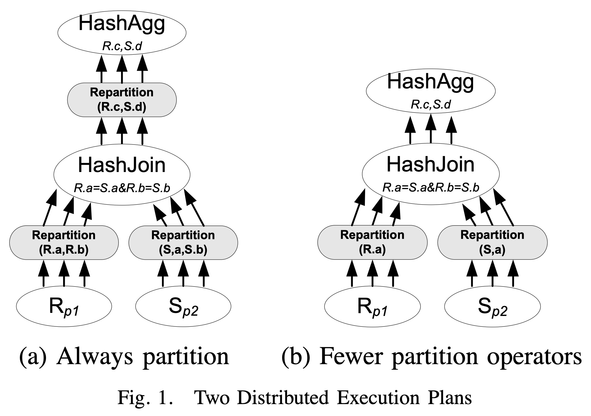
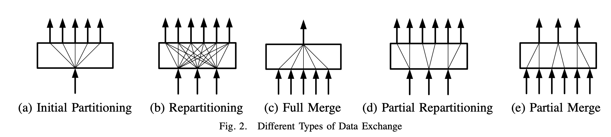
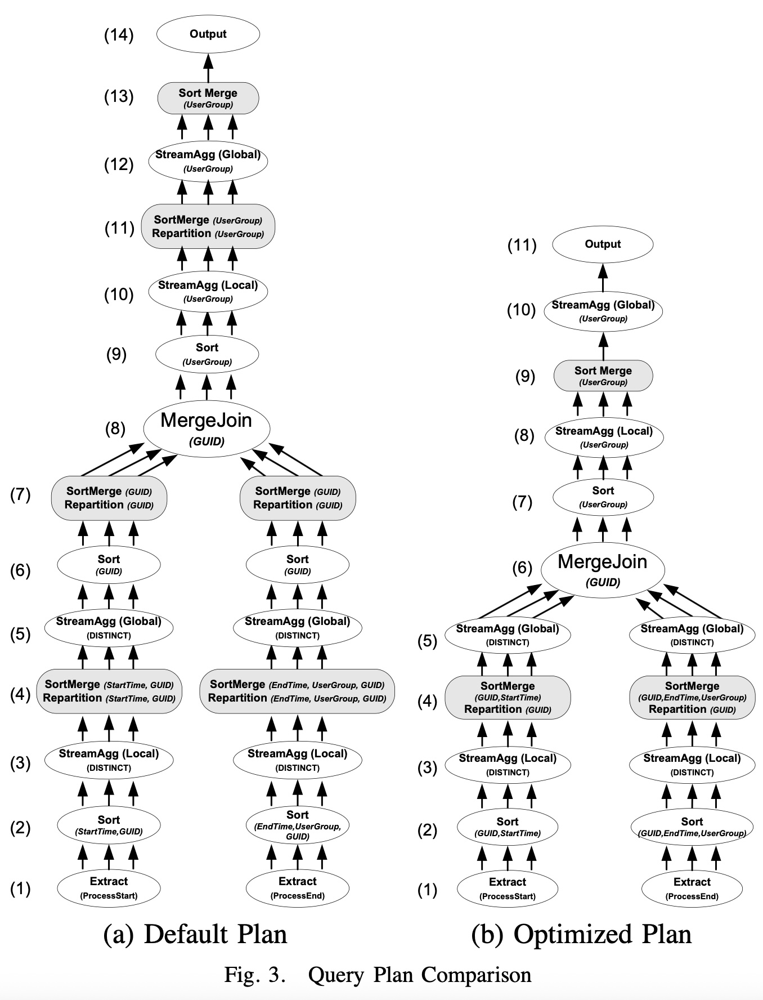

## AI论文解读 | Incorporating Partitioning And Parallel Plans Into The Scope Optimizer
        
### 作者        
digoal        
        
### 日期        
2025-10-06        
        
### 标签        
PostgreSQL , PolarDB , DuckDB , AI , 论文解读        
        
----        
        
## 背景  
      
https://www.researchgate.net/publication/224131268_Incorporating_Partitioning_and_Parallel_Plans_into_the_SCOPE_Optimizer        
  
提示:          
```          
读懂《Incorporating Partitioning And Parallel Plans Into The Scope Optimizer》这篇论文需要提前掌握哪些基础知识, 请使用中文通熟易懂的讲解这些基础知识, 可以引用论文中的图、表或使用Markdown支持的图形(text,mermaid等)增加解释性. 
  
使用中文通熟易懂的解读《Incorporating Partitioning And Parallel Plans Into The Scope Optimizer》这篇论文, 其中的关键内容请着重讲解, 可以引用论文中的图、表或使用Markdown支持的图形(text,mermaid等)增加解释性. 
  
提取《Incorporating Partitioning And Parallel Plans Into The Scope Optimizer》这篇论文中的重要术语, 使用中文对这些术语进行通熟易懂的讲解, 可以引用论文中的图、表或使用Markdown支持的图形(text,mermaid等)增加解释性. 
```     
  
## 1 前置知识 
  
好的，为了完全理解《Incorporating Partitioning and Parallel Plans into the SCOPE Optimizer》这篇论文，您需要掌握一些关于**分布式计算**、**数据库查询优化**和**数据属性**的基础知识。

这篇论文的核心思想是：如何让一个查询优化器“天生”就懂得如何生成高效的并行计算方案，而不是像传统方法那样，先生成一个单机方案再“改造”成并行的。为了做到这一点，优化器必须能够理解并利用数据的“结构属性”（Structural Properties），比如数据是如何被**分区**、**排序**和**分组**的。

下面我将用通俗易懂的方式，结合论文中的图表，为您讲解这些必备的基础知识。

### 1\. 基础背景：为什么需要并行处理？(分布式计算)

想象一下，你要统计一个拥有数十亿册图书的巨大图书馆里，每个作者写了多少本书。如果只派一个人去，他可能要花几十年才能完成。

一个更聰明的方法是“分而治之”：

  * **分区 (Partitioning)**: 你把图书馆分成500个区域（比如按书架编号），这就是数据的“分区”。
  * **并行处理 (Parallel Processing)**: 你雇佣500个图书管理员，每个人负责一个区域，同时开始统计。

这篇论文讨论的“海量数据分析”环境，就是一个由成百上千台普通计算机组成的“集群”，就像这个图书馆和500位管理员 。直接在一台机器上处理TB级别的数据是不现实的，因此**数据分区**和**并行处理**是至关重要的 。

### 2\. 核心问题：什么是查询计划与查询优化？

当您用类似SQL的语言（论文中叫SCOPE ）下达一个分析指令时，比如“统计R表和S表连接后，按c和d列分组计数”，计算机并不会立即开始计算。它需要先制定一个详细的“行动方案”，这个方案就叫做**查询执行计划 (Query Execution Plan)**。

一个指令可以有很多种不同的执行计划，有的快，有的慢。**查询优化器 (Query Optimizer)** 的工作，就是从所有可能的计划中，找出成本最低（通常意味着执行时间最短）的那一个 。

论文中的图1就展示了同一个查询的两种不同执行计划：    

Fig. 1. Two Distributed Execution Plans

**(a) 总是分区 (Always partition)** | **(b) 更少的分区操作 (Fewer partition operators)**
:-------------------------:|:-------------------------:
   

  * **图(a)的计划** ：

    1.  `Repartition`: 为了将R表和S表按照共同的列（a, b）连接起来，先把这两个巨大的表通过网络重新洗牌（Repartition） 。这是一个非常耗时的操作 。
    2.  `HashJoin`: 在数据对齐后，并行地执行连接操作 。
    3.  `Repartition`: 为了进行下一步的分组聚合（group by R.c, S.d），再次把连接后的结果通过网络重新洗牌，确保c和d值相同的行都在同一台机器上 。
    4.  `HashAgg`: 并行地进行聚合计算 。

  * **图(b)的计划** ：这个计划更聪明。它发现，如果存在一个依赖关系（比如R.c是主键，那么R.c的值能唯一确定R.a的值），那么在第一次按R.a分区后，数据其实也已经“隐式地”按R.c对齐了 。因此，它省去了第二次代价高昂的`Repartition`操作，可以直接进行聚合 。

这篇论文要解决的核心问题，就是如何让优化器能够自动地、基于成本地发现像(b)这样的更优计划 。

### 3\. 关键概念：数据的“结构属性”

为了能做出上述聪明的决策，优化器必须理解数据在每一步处理后的“状态”，论文将这些状态称为**结构属性 (Structural Properties)** 。它包含两个层面：

#### A. 全局属性 (Global Property): 分区 (Partitioning)

这描述了整个数据集是如何被拆分成多份的 。

  * **数据交换 (Exchange)**：为了实现分区，数据需要在不同机器间流动。论文图2展示了集中常见的数据流动拓扑 。    

    Fig. 2. Different Types of Data Exchange

      * (a) **初始分区 (Initial Partitioning)**: 把一份数据分成多份 。
      * (b) **重分区 (Repartitioning)**: 把n份数据按新的规则重新分成m份，这是最常见的，也是代价最高的 。
      * (c) **完全合并 (Full Merge)**: 把多份数据合并成一份 。

  * **分区方案 (Partitioning Schemes)** ：

      * **哈希分区 (Hash Partitioning)**: 根据分区列的哈希值来决定数据去哪台机器 。它能保证相同键值的数据在同一个分区，但是分区之间是无序的 。在论文中用 $\{C_1, C_2\}^g$ 表示。
      * **范围分区 (Range Partitioning)**: 根据分区列的值的范围来划分 。比如A-F的记录去1号分区，G-M的去2号分区。这种方式能保证分区本身是有序的 。在论文中用 $\{C_1, C_2\}^o$ 表示。

#### B. 局部属性 (Local Properties): 分组与排序

这描述了在**每一个分区内部**，数据的排列方式是怎样的 。

  * **分组 (Grouping)**: 如果数据是按某个列分组的，意味着所有该列值相同的行都是连续存放的 。例如，在一个分区内，所有关于“用户A”的记录都紧挨在一起。
  * **排序 (Sorting)**: 如果数据是按某个列排序的，意味着在一个分区内，所有行都是按照该列的值升序或降序排列的 。**排序是一种特殊且更强的分组**，因为排好序的数据必然也满足分组的条件 。

下表总结了这些关键属性：

| 属性类别 | 具体属性 | 作用范围 | 简单描述 |
| :--- | :--- | :--- | :--- |
| **全局属性** | **分区 (Partitioning)** | 整个数据集 | 数据是如何被切分到不同机器上的。 |
| **局部属性** | **分组 (Grouping)** | 每个分区内部 | 在一个分区里，相同值的行是否挨在一起。 |
| | **排序 (Sorting)** | 每个分区内部 | 在一个分区里，所有行是否有序排列。 |

#### C. 附加知识：函数依赖 (Functional Dependencies - FDs)

这是一个来自数据库理论的概念，但对于优化至关重要 。

  * **定义**：如果列集合X的值可以唯一确定列集合Y的值，我们称Y函数依赖于X，记为 $X \rightarrow Y$ 。
  * **例子**：在一个订单表中，`订单号` $\rightarrow$ `下单日期`。因为一个订单号只对应一个下单日期。
  * **作用**：优化器可以利用FD来推断属性。比如论文中提到的，如果数据已经按`订单号`分区了，优化器就能通过FD推断出，数据也等效于按`下单日期`分区了，从而可能避免一次不必要的数据重分区 。

### 总结

要读懂这篇论文，您需要提前建立以下知识体系：

1.  **宏观背景**：理解在由大量普通机器组成的集群上处理海量数据时，“分而治之”是基本原则，而**数据分区**和**并行计算**是实现这一原则的手段。
2.  **核心任务**：了解**查询优化器**的作用是为一条查询指令选择一个最高效的**执行计划**。论文的目标是让优化器能原生支持并行计划的生成。
3.  **关键概念**：深入理解数据的三种“结构属性”：
      * **分区 (Partitioning)**：数据在机器间的分布方式（全局属性）。
      * **排序 (Sorting)** 和 **分组 (Grouping)**：数据在每台机器内部的排列方式（局部属性）。
4.  **理论工具**：了解**函数依赖 (FDs)** 的基本概念，以及它如何帮助优化器进行更深层次的推理，从而简化查询计划。

掌握了这些基础知识后，您就可以更轻松地理解论文中关于如何定义这些属性（第四章）、如何推导算子处理后的属性（第五章）、以及优化器如何利用这些属性来匹配和生成计划（第六、七、八章）等更深入的技术细节了。
  
## 2 解读论文 
  
好的，这篇论文《Incorporating Partitioning and Parallel Plans into the SCOPE Optimizer》是一篇关于大规模数据处理中查询优化的经典之作。它详细阐述了如何在查询优化器中原生、智能地生成高效的并行计算方案。

我将为您深入解读这篇论文的核心思想与关键内容。

### **核心问题：传统查询优化的“先天不足”**

在处理海量数据（如TB、PB级别）时，我们必须使用由成百上千台计算机组成的集群进行并行计算。当我们向系统提交一个数据分析任务（一个“查询”）时，系统需要一个高效的**执行计划**。

传统数据库的查询优化器在并行处理方面存在一个根本问题：它们往往采用一种“两步走”的策略 ：

1.  **先生成最优的“单机”计划**：假设计算只在一台强大的机器上进行，找出最理想的算法和操作顺序。
2.  **再“并行化”这个计划**：在单机计划的基础上，强行插入数据分区、合并等操作，使其能在集群上运行。

这种方法常常导致**次优**的并行计划 ，因为它没有在最开始就考虑数据的分布和并行处理的代价。尤其是 **数据重分区（Repartitioning）** —— 在网络中大规模地移动和重组数据——是极为昂贵的操作 。频繁或不必要的重分区会成为巨大的性能瓶颈 。

### **SCOPE优化器的革命：将并行思维融入“基因”**

这篇论文介绍的SCOPE优化器，旨在解决上述问题。SCOPE是微软内部用于海量数据分析的类SQL语言 。其优化器的核心目标是：

> **在一个统一的、基于成本的框架内，无缝地、原生地产出并评估包括串行、并行及混合执行在内的各种计划，从而找到真正最优的并行执行方案。** 

为了实现这一目标，优化器必须能够深刻理解并推理数据的 **“结构属性” (Structural Properties)** 。

### **关键基石：理解数据的“结构属性”**

这是论文最核心的理论贡献。优化器通过一个统一的框架来描述和推理三种数据属性 。

#### 1\. **分区 (Partitioning) - 全局属性**

这描述了数据在整个集群中的分布状态 。

  * **如何实现**：通过“数据交换”(Exchange)操作完成，它负责数据的拆分、合并与重组 。论文的图2展示了最主要的几种交换方式。   

    Fig. 2. Different Types of Data Exchange

      * **(a) 初始分区**：将单个数据流拆分成多个。
      * **(b) 重分区**：将N个输入分区按新规则重组成M个输出分区，这是最常见也最昂贵的操作。
      * **(c) 完全合并**：将多个分区合并成单个数据流。

  * **分区方案**：

      * **哈希分区 (Hash Partitioning)**：根据分区键的哈希值决定数据去向。能保证“键”相同的数据在同一分区，但分区之间是无序的 。
      * **范围分区 (Range Partitioning)**：根据分区键的值范围来划分。这种方式能保证分区本身是有序的，比如P1分区所有数据都小于P2分区 。

#### 2\. **分组 (Grouping) & 排序 (Sorting) - 局部属性**

这描述了在**每一个分区内部**，数据的组织形式是怎样的 。

  * **分组**：在一个分区内，键值相同的行都是连续存放的 。
  * **排序**：比分组更强的属性，不仅键值相同的行连续，所有行都按键值升序或降序排列 。

优化器使用一种形式化的表示法 `{P; {A}}` 来描述一个数据流的完整结构属性，其中 `P` 是全局分区属性，`{A}` 是一系列描述分区内数据组织方式的局部属性 。

### **优化器如何“思考”：基于属性的推理过程**

在优化过程中，优化器在三个关键环节运用了对“结构属性”的推理：

1.  **派生交付属性 (Deriving Delivered Properties)** 

      * **问题**：一个操作（如Join、Sort）执行完后，输出数据的结构属性是什么？
      * **示例**：一个输入数据流，如果经过一个“按`user_id`进行哈希分区”的操作，那么输出数据流的全局属性就变成了“已按`user_id`哈希分区”。其局部分组和排序属性则继承自输入（因为分区操作是保序的） 。论文中的 **表III, IV, V** 详细定义了各种交换操作如何改变数据的结构属性。

2.  **确定所需属性 (Determining Required Properties)** 

      * **问题**：一个操作要高效执行，它对输入数据的结构属性有什么要求？
      * **示例**：一个**归并连接 (Merge Join)** 操作，它要求两个输入数据流都必须：(1) **按连接键分区** (例如，都按`user_id`分区)，保证能匹配的行在同一台机器上相遇；(2) **在每个分区内按连接键排序** 。论文中的 **表VI** 系统性地列出了各种物理操作对其输入属性的要求。

3.  **属性匹配 (Property Matching)** 

      * **问题**：下游操作“交付”的属性，是否满足上游操作“需要”的属性？
      * **过程**：优化器会检查一个子计划产生的数据属性是否满足父操作的要求 。例如，如果一个子计划交付了“按`user_id`排序”的数据，而父操作只需要“按`user_id`分组”，那么匹配成功，因为排序是更强的分组 。

通过这三步，优化器可以像拼图一样，严谨地构建出所有逻辑上可行的、物理上高效的执行计划。

### **实战案例：优化器如何“化繁为简”**

论文第九章通过一个真实的查询案例，直观地展示了优化的威力。

  * **任务**：分析日志，计算过去一个月每个用户组总共占用了多少机器时长 。
  * **涉及操作**：去重(DISTINCT)、连接(JOIN)、分组聚合(GROUP BY)、排序(ORDER BY)。

#### **默认计划 (图 3a) - 传统思维的产物**

  

这个计划充满了冗余操作，非常“笨重”：

1.  **两次独立去重**：为了去重，分别对两个输入数据流进行了“排序 -\> 重分区 -\> 归并排序”的昂贵操作 。
2.  **为Join再次重分区**：去重后的数据，为了进行Join，又进行了一次按`guid`（连接键）的重分区和排序 。
3.  **为聚合再次重分区**：Join后的结果，为了按`UserGroup`进行最终聚合，又进行了一次重分区 。

可以看到，计划中包含了**4次**代价高昂的、涉及全量数据的重分区操作。

#### **优化后的计划 (图 3b) - 并行思维的结晶**

SCOPE优化器通过对“结构属性”的推理，生成了这个极为高效的计划：

1.  **一次分区，满足多方需求**：优化器在最开始就聪明地决定将两个输入流都按`guid`（连接键）进行分区，并且在分区内按`(guid, timestamp, ...)`排序 。
2.  **属性的巧妙复用**：
      * 这个属性 `{partitioned by guid; sorted by (guid, ...)}` **同时满足**了后续`DISTINCT`操作（因为它需要按所有列分组）和`MergeJoin`操作（因为它需要按`guid`分区和排序）的要求 。
      * 因此，**省去了默认计划中为了Join而进行的第二次重分区和排序**，这是一个巨大的优化 。
3.  **智能决策**：优化器还评估出Join后的结果集不大，因此决定不再进行分区，而是将数据合并到一台机器上完成最终的聚合，避免了又一次昂贵的网络传输 。

**结果**：默认计划耗时**21分钟**，而优化后的计划仅用时**11分钟**，性能提升接近**2倍** 。优化的成本几乎可以忽略不计 。

### **结论与贡献**

这篇论文的主要贡献在于：

1.  **提出了一个统一的理论框架**：首次将分区、分组和排序这三种关键的结构属性整合到同一个框架中进行推理 。
2.  **实现了真正的“并行原生”优化**：通过基于属性的推理和“强制执行规则”(Enforcer Rules)，让优化器能够在一个完整的搜索空间里，自动、无缝地生成和评估各种并行与串行计划，而不是将并行化作为一个后续补丁 。
3.  **在工业级系统中验证了其有效性**：证明了该方法能够在真实世界的复杂查询中带来显著的性能提升，是查询优化领域从理论走向实践的典范 。
  
## 3 术语 
  
好的，这篇论文引入了一套严谨的术语来描述其创新的查询优化框架。理解这些术语是掌握论文精髓的关键。以下是论文中重要术语的中文通俗化讲解，并引用了原文中的图表来辅助说明。

### 1\. 结构属性 (Structural Properties)

这是整篇论文最核心、最基础的概念。

  * **通俗讲解**：
    可以把“结构属性”理解为一份数据的“简历”或“状态说明书”。它详细描述了这份数据**在集群中的分布方式**以及**在每台机器内部的组织形式** 。优化器通过读取这份“简历”，来决定下一步该如何最高效地处理它。

  * **详细解读**：
    一份数据的结构属性由两部分构成 ：

    1.  **全局属性 (Global Property)**：描述数据如何在集群中被**分区 (Partitioning)**。例如，数据是未分区（只有一份），还是按用户ID分成了100份。
    2.  **局部属性 (Local Properties)**：描述在**每一个分区内部**，数据是如何被**分组 (Grouping)** 或**排序 (Sorting)** 的 。例如，每个分区内的数据都已按时间戳排好序。

    论文用一个统一的形式来表示它：`{分区属性; {局部属性序列}}` 。

    例如，论文中的表II就展示了一个具有复杂结构属性的数据实例：

    A EXAMPLE RELATION WITH PARTITIONING, GROUPING, AND SORTING

| Partition 1 | Partition 2 | Partition 3 |
| :--- | :--- | :--- |
| {1,4,2}, {1,4,5},<br>{7,1,2} | {4,1,5}, {3,7,8},<br>{3,7,9} | {6,2,1}, {6,2,9} |

  
这份数据的结构属性为 `{{C1}ᵍ; {{C1, C2}ᵍ, C3ᴼ}}` 。   
* **全局**：数据按C1列的值进行了分区（比如所有C1=1的行都在一个分区，C1=3的在另一个分区）。
* **局部**：在每个分区内部，数据首先按 {C1, C2} 的组合进行了分组，然后在每个分组内，又按C3列进行了排序 。
  

### 2\. 数据交换算子 (Exchange Operator)

  * **通俗讲解**：
    这是实现数据在集群机器之间流动的“物流系统”或“调度中心” 。当需要改变数据的分区状态时，比如从未分区变成已分区，或者从一种分区方式变成另一种时，就必须使用这个算子 。由于涉及网络传输，它通常是执行计划中非常昂贵的一环 。

  * **详细解读**：
    论文的图2展示了集中关键的数据交换类型 ：    
    Fig. 2. Different Types of Data Exchange

      * **(a) 初始分区 (Initial Partitioning)**：将单份数据流拆分成多份并行处理 。
      * **(b) 重分区 (Repartitioning)**：将已经分好区的数据，按照**新的规则**重新划分。例如，原来按用户ID分区，现在要改成按订单ID分区 。这是大规模数据处理中常见的性能瓶颈。
      * **(c) 完全合并 (Full Merge)**：将所有并行处理的数据分区合并成一个单独的数据流 。

### 3\. 分区方案 (Partitioning Schemes)

  * **通俗讲解**：
    这是“数据交换算子”具体执行分区任务时采用的“分配策略” 。它决定了每一行数据究竟应该被发送到哪个分区（哪台机器）。

  * **详细解读**：
    论文主要讨论了以下几种方案：

      * **哈希分区 (Hash Partitioning)**：通过一个哈希函数计算分区列的值，根据哈希结果决定分发到哪个分区 。它能确保分区列值相同的行一定在同一个分区，但分区之间是无序的 。
      * **范围分区 (Range Partitioning)**：将分区列的值域切分成多个不重叠的范围，每个范围对应一个分区 。这种方式产生的多个分区本身是全局有序的 。
      * **广播 (Broadcasting)**：将一份输入数据的**每一行**都复制并发送给**所有**输出分区 。通常用于小表和非分区输入的场景 。

### 4\. 所需属性 (Required Properties) 与 交付属性 (Delivered Properties)

这两个术语是优化器进行推理的核心。

  * **通俗讲解**：

      * **所需属性**：可以理解为一个操作（比如Join）对其“食材”（输入数据）的“烹饪要求”。例如，一个“归并连接”(Merge Join)操作会声明：“我需要我的两份食材都必须按连接键切好（分区）并排好序（排序）。”
      * **交付属性**：可以理解为一个操作处理完“食材”后，产出的“菜品”所具有的新“状态”。例如，一个排序操作会声明：“经过我处理后，这份菜品（输出数据）现在是排好序的。”

  * **详细解读**：
    在优化过程中，优化器不断地在两者之间进行推导和匹配 。

      * **确定所需属性 (DetermineChildReqdProperties)**：父操作根据自身的算法和父辈的要求，来决定对子操作的输出（也就是自己的输入）有什么样的结构属性要求 。论文中的 **表VI** 详细列举了各种物理操作（如Hash Join、Merge Join、Stream Aggregate）对其输入的“所需属性” 。
      * **派生交付属性 (DeriveDlvdProperties)**：根据子操作的“交付属性”以及当前操作自身的处理逻辑，计算出当前操作最终向上交付的输出数据具有什么样的结构属性 。

### 5\. 属性匹配 (Property Matching)

  * **通俗讲解**：
    这是优化器进行的“供需匹配”检查 。它会判断一个下游操作“交付”的属性，是否能满足上游操作“需要”的属性 。如果一个子计划的输出结果（交付属性）不满足父操作的要求（所需属性），那么这个计划就是无效的，会被丢弃 。

  * **详细解读**：
    匹配过程并非简单的字符串比较，它需要考虑函数依赖和列等价关系 。例如，如果一个计划交付了“按`订单ID`排序”的数据，而上游操作需要“按`订单ID`分组”，优化器知道排序是一种更强的分组形式，因此判定匹配成功 。

### 6\. 强制执行规则 (Enforcer Rules)

  * **通俗讲解**：
    这是优化器的“自动修正”或“智能补全”机制。当“属性匹配”失败时，优化器并不会直接放弃，而是会尝试通过插入一些“适配器”算子（如排序算子、重分区算子）来强行满足“所需属性” 。

  * **详细解读**：
    `Enforcer Rules`会自动引入数据交换算子或排序算子来改变数据的结构属性 。例如，一个Join操作需要按`user_id`分区的数据，但它的输入是未分区的。此时，`Enforcer Rule`会自动在该Join操作前插入一个“按`user_id`重分区”的数据交换算子，从而生成一个可行的并行计划 。正是这个机制，让优化器能够无缝地探索和评估各种并行方案 。

### 7\. 函数依赖 (Functional Dependencies - FDs)

  * **通俗讲解**：
    这是来自数据库理论的一个工具，可以理解为数据列之间的“隐含关系”。例如，“学号”能唯一确定“姓名”，我们就说“姓名”函数依赖于“学号”。

  * **详细解读**：
    优化器利用函数依赖可以进行更深层次的属性推断，从而发现更优的计划 。例如，如果优化器知道 `主键 → 其他所有列` ，并且数据已经按`主键`分区了，那么它就能推断出，这份数据其实也等效于按`其他所有列`的任意组合进行了分区，因为`主键`相同意味着`其他所有列`的值也都相同。这可以帮助优化器消除冗余的分区或排序操作 。
  
## 参考        
         
https://www.researchgate.net/publication/224131268_Incorporating_Partitioning_and_Parallel_Plans_into_the_SCOPE_Optimizer    
        
<b> 以上内容基于DeepSeek、Qwen、Gemini及诸多AI生成, 轻微人工调整, 感谢杭州深度求索人工智能、阿里云、Google等公司. </b>        
        
<b> AI 生成的内容请自行辨别正确性, 当然也多了些许踩坑的乐趣, 毕竟冒险是每个男人的天性.  </b>        
  
    
#### [期望 PostgreSQL|开源PolarDB 增加什么功能?](https://github.com/digoal/blog/issues/76 "269ac3d1c492e938c0191101c7238216")
  
  
#### [PolarDB 开源数据库](https://openpolardb.com/home "57258f76c37864c6e6d23383d05714ea")
  
  
#### [PolarDB 学习图谱](https://www.aliyun.com/database/openpolardb/activity "8642f60e04ed0c814bf9cb9677976bd4")
  
  
#### [PostgreSQL 解决方案集合](../201706/20170601_02.md "40cff096e9ed7122c512b35d8561d9c8")
  
  
#### [德哥 / digoal's Github - 公益是一辈子的事.](https://github.com/digoal/blog/blob/master/README.md "22709685feb7cab07d30f30387f0a9ae")
  
  
#### [About 德哥](https://github.com/digoal/blog/blob/master/me/readme.md "a37735981e7704886ffd590565582dd0")
  
  

  
