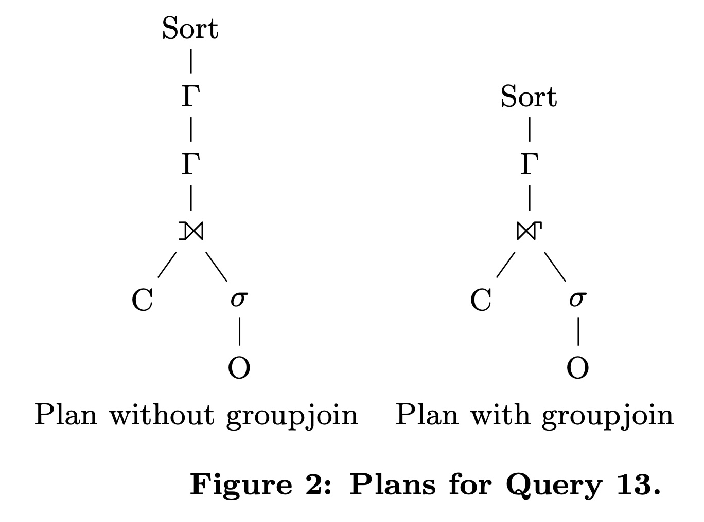
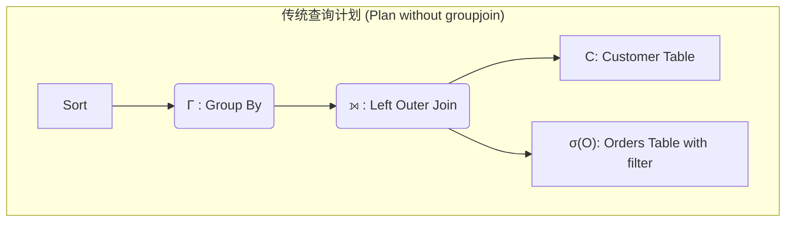
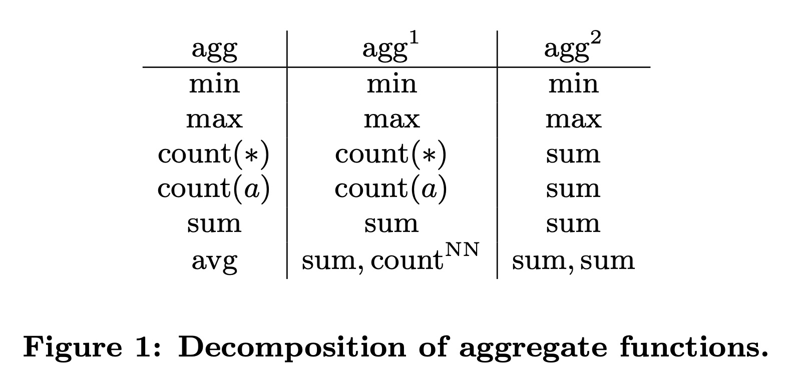
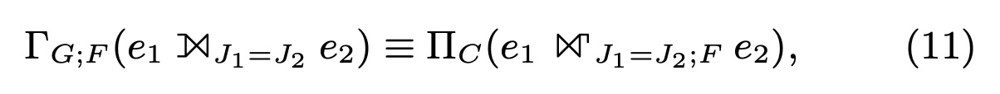
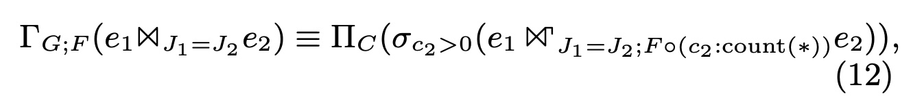
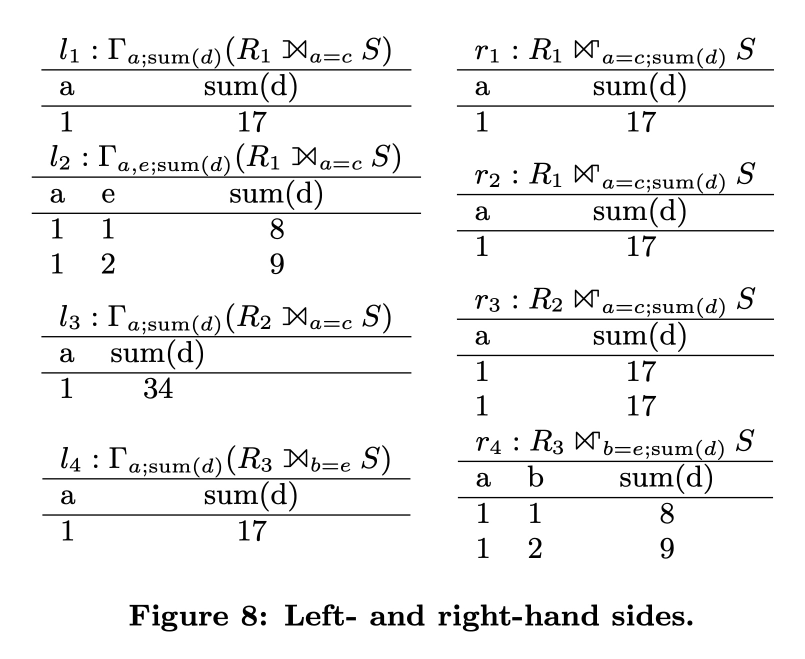
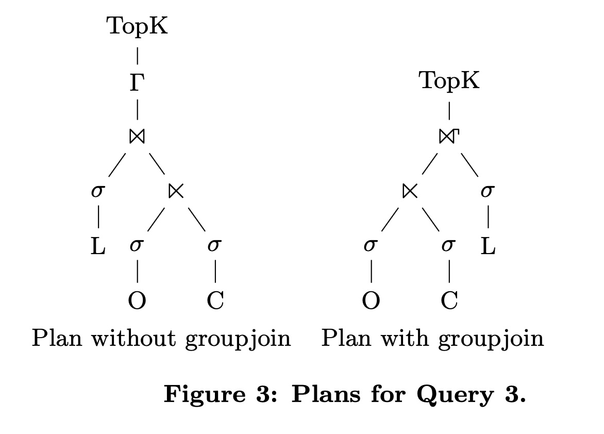

## AI论文解读 | Accelerating Queries With Groupby And Join By Group Join
        
### 作者        
digoal        
        
### 日期        
2025-10-07        
        
### 标签        
PostgreSQL , PolarDB , DuckDB , AI , 论文解读        
        
----        
        
## 背景  
      
https://www.vldb.org/pvldb/vol4/p843-moerkotte.pdf        
  
提示:          
```          
读懂《Accelerating Queries With Groupby And Join By Group Join》这篇论文需要提前掌握哪些基础知识, 请使用中文通熟易懂的讲解这些基础知识, 可以引用论文中的图、表或使用Markdown支持的图形(text,mermaid等)增加解释性. 
  
使用中文通熟易懂的解读《Accelerating Queries With Groupby And Join By Group Join》这篇论文, 其中的关键内容请着重讲解, 可以引用论文中的图、表或使用Markdown支持的图形(text,mermaid等)增加解释性. 
  
提取《Accelerating Queries With Groupby And Join By Group Join》这篇论文中的重要术语, 使用中文对这些术语进行通熟易懂的讲解, 可以引用论文中的图、表或使用Markdown支持的图形(text,mermaid等)增加解释性. 
```     
  
## 1 前置知识 
  
好的，为了完全理解《Accelerating Queries with Group-By and Join by Groupjoin》这篇论文，您需要掌握一些数据库和关系代数的基础知识。这篇论文的核心思想是：将常见的“先连接（Join）后分组聚合（Group-By）”两个独立操作，合并成一个更高效的单一操作——`groupjoin`。

下面我将用通俗易懂的方式，结合论文中的图表，为您讲解这些必备的基础知识。

### 1\. 核心问题：为什么“先 Join 再 Group-By”效率低？

在数据库查询中，我们经常需要先将多个表连接起来，然后对结果进行分组统计。例如，“统计每个部门所有员工的总薪水”，这就需要先连接 `部门表` 和 `员工表`，然后按部门进行分组并计算薪水总和。

论文的作者指出，这种传统方法在执行时存在效率问题 。

  * **第一步 (Join)**: 数据库会创建一个哈希表（Hash Table 1），用来高效地找到两个表中匹配的行，并将它们连接起来，生成一个巨大的中间结果集。
  * **第二步 (Group By)**: 数据库接着创建**第二个**哈希表（Hash Table 2），将上一步生成的中间结果集读入，并按照指定的列（如“部门”）进行分组和聚合计算（如 `SUM()`）。

这种方式的主要瓶颈在于：

1.  **生成了庞大的中间结果**：Join 操作可能会产生比原始表大得多的结果集，这些数据都需要在内存中创建和存储，消耗巨大。
2.  **构建了两次哈希表**：连续构建和处理两个独立的哈希表是多余的开销 。

这篇论文的目标就是用一个`groupjoin`操作符，只使用**一个哈希表**就完成这两步的工作，从而显著提升查询速度 。

### 2\. 基础知识一：关系代数（Relational Algebra）

关系代数是数据库查询的理论基础，可以理解为一种“数据操作的数学语言”。论文中使用的符号都源于此。

  * **Join (连接)**: 符号是 `⋈`。它将两个表（关系）中满足特定条件的行合并在一起。例如 `员工 ⋈ 部门`。
  * **Left Outer Join (左外连接)**: 符号是 `⟕`。它在 Join 的基础上，保留左边表中所有未找到匹配项的行，并在右边表的对应列中填入 NULL 。
  * **Group-By (分组聚合)**: 符号是 `Γ` (Gamma)。它将数据按照某些列进行分组，并对每个组应用聚合函数（如 `SUM`, `COUNT`）。
  * **Projection (投影)**: 符号是 `Π` (Pi)。它用于从表中选择指定的列，相当于 SQL 中的 `SELECT` 子句后面跟的列名列表 。

理解这些符号后，我们就能看懂论文中描述查询计划的树形图。例如，在论文的 **图 2** 中，左侧的计划就清晰地展示了一个传统的查询流程：    



这个图表示，数据先从 `Customer` 表和 `Orders` 表流出，经过一个 `Left Outer Join` 操作，其结果再进行 `Group By` 操作，最后排序 。论文的目标就是把 `Γ` 和 `⟕` 这两个步骤合并。

### 3\. 基础知识二：聚合函数 (Aggregation Functions) 的特性

为了能够安全地合并 Join 和 Group-By，聚合函数本身必须满足一些数学特性。论文重点讨论了两个特性：**可分解性（Decomposable）和可分离性（Splittable）** 。

#### 3.1 可分解性 (Decomposable)

一个聚合函数是可分解的，意味着我们可以将一个大计算任务拆分成多个小任务，然后再将小任务的结果合并得到最终结果 。

以 `SUM()` 为例，`SUM({1, 2, 3, 4})` 的结果是 10。
我们可以把它拆成两部分：`SUM({1, 2}) = 3` 和 `SUM({3, 4}) = 7`。
最后，将两个中间结果再次求和：`SUM({3, 7}) = 10`。最终结果完全一样。

论文在 **图 1 (Figure 1)** 中总结了常见 SQL 聚合函数的分解方式 ：    

| 聚合函数 (agg) | 局部计算 (agg¹) | 全局合并 (agg²) |
| :--- | :--- | :--- |
| `min` | `min` | `min` |
| `max` | `max` | `max` |
| `sum` | `sum` | `sum` |
| `count` | `count` | `sum` |
| `avg` | `sum`, `count` | `sum(sum) / sum(count)` |

这个特性至关重要，因为它允许 `groupjoin` 在处理数据流时，可以逐步、增量地更新聚合结果，而不需要等待所有数据都连接完成后再计算。

#### 3.2 可分离性 (Splittable)

当聚合函数作用于多个来自不同表的列时，如果这个计算可以被拆分成只针对每个表独立计算的部分，那么它就是可分离的 。

例如，`SUM(R1.a + R2.b)` 是可分离的，因为根据数学分配律，`SUM(R1.a + R2.b) = SUM(R1.a) + SUM(R2.b)` 。这样，对 `R1.a` 的求和和对 `R2.b` 的求和就可以独立进行。

### 4\. 基础知识三：函数依赖 (Functional Dependencies, FD)

函数依赖是理解这篇论文转换规则正确性的关键，也是相对最抽象的一个概念。

**通俗解释**：在一个表中，如果属性（或属性集）A 的值可以**唯一确定**属性（或属性集）B 的值，我们就说“B 函数依赖于 A”，记作 `A → B`。

  * **例子**: 在一个 `员工表` 中，`员工ID → 员工姓名`。因为只要知道了员工 ID，就能唯一确定他的姓名。但是反过来不一定成立，因为可能存在同名的员工。
  * **主键**: 表的主键（Primary Key）就是一个典型的例子，表中的所有其他属性都函数依赖于主键。

**为什么函数依赖在论文中如此重要？**

`groupjoin` 变换的核心是**在 Join 之前进行部分聚合**。为了保证变换前后的结果完全一致，我们必须确保这种“提前聚合”不会“合并”掉本不该合并的数据。函数依赖就是保证这一点的“安全锁”。

论文的核心等价变换（Equivalence 11 和 12）都有一系列关于函数依赖的条件 。这些条件确保了：      

1.  **分组的粒度不变**：在 Join 之前分组和在 Join 之后分组，最终得到的组的数量和每个组包含的内容是等价的。
2.  **数据不会丢失或重复计算**：确保每个原始数据行对最终聚合结果的贡献不多也不少，正好一次。

论文的附录E通过一个反例清晰地说明了违反函数依赖的后果（**Figure 8**）。当函数依赖条件不满足时，左手边（传统方法）和右手边（groupjoin 方法）计算出的聚合结果完全不同，这证明了转换的错误。   

### 总结

要读懂这篇论文，您需要掌握以下几个层面的知识：

1.  **宏观层面**：理解数据库执行“Join + Group By”查询时的性能瓶颈（生成大中间结果、使用两个哈希表）。
2.  **操作层面**：熟悉关系代数的基本操作符 (`⋈`, `Γ`, `Π` 等），能够看懂查询计划图。
3.  **理论层面**：
      * 理解**聚合函数的可分解性**，这是 `groupjoin` 能增量计算的基础。
      * 理解**函数依赖**，这是保证 `groupjoin` 变换正确性、确保结果等价的数学基石。

掌握了这些知识后，您就能轻松理解论文提出的两个核心等价变换（Equivalence 11 和 12），并明白为什么将 `JOIN` 和 `GROUP BY` 合并为 `groupjoin` 既是可行且正确的，又能带来巨大的性能提升。
  
## 2 解读论文 
  
好的，我们来通俗易懂地解读一下这篇名为《通过Groupjoin加速含Group-By和Join的查询》的经典数据库论文。

### 核心思想：合并同类项，一步到位

想象一下在数据处理时，你经常需要做两件事：

1.  **连接 (Join)**：将多个表格（比如 `订单表` 和 `客户表`）通过共同字段（如 `客户ID`）拼在一起。
2.  **分组聚合 (Group-By)**：对拼接后的大表，按某个字段（如 `客户`）进行分组，然后计算每组的总和、平均值等。

传统的数据库系统是“一步一步”来做的。它会先花大力气把两个表连接起来，生成一个可能非常庞大的中间结果表，然后再对这个大表进行分组计算 。这个过程存在两大效率问题：

  * **巨大的中间结果**：Join操作的产物可能比原始表大很多倍，创建和处理这些数据非常耗时耗内存 。
  * **重复的工作**：Join操作通常会构建一个哈希表来快速匹配数据，而接下来的Group-By操作又会构建**另一个**哈希表来分组 。

这篇论文的核心思想就是：**我们能否将 Join 和 Group-By 这两个昂贵的操作合并成一个名为 `groupjoin` 的新操作，只用一个哈希表，一步到位？** 

### 关键内容一：新操作符 `groupjoin` 是如何工作的？

`groupjoin` 操作符非常聪明，它颠覆了“先生成完整结果再聚合”的思路，转而采用“边匹配边聚合”的增量计算方式。

以 `客户表 ⋈ 订单表` 再按客户分组统计订单总额为例：

1.  **构建哈希表**：`groupjoin` 首先扫描 `客户表`（通常是较小的那个表），并基于连接键（`客户ID`）构建一个哈希表 。
2.  **初始化聚合值**：在哈希表的每个条目中，除了客户信息外，还为最终的聚合结果（如 `订单总额`）设置一个初始值，比如 0 。
3.  **扫描并增量聚合**：接着，`groupjoin` 扫描 `订单表`。每读入一条订单记录，它就用`客户ID`去哈希表中查找对应的客户。
      * 找到后，**它并不生成一条新的连接记录**，而是直接在哈希表的该条目中**更新**聚合值（比如，将当前订单的金额累加到 `订单总额` 上） 。
4.  **输出结果**：当 `订单表` 扫描完毕后，哈希表中已经存储了每个客户及其对应的最终聚合结果。此时，只需将哈希表的内容输出即可 。

通过这种方式，`groupjoin` 完美地避免了生成庞大的中间Join结果，并且只用了一个哈希表就完成了所有工作，效率自然大大提升。

### 关键内容二：何时才能安全地进行替换？—— 两个核心等价变换

虽然 `groupjoin` 很高效，但不能随意替换。论文给出了两条核心的**代数等价变换规则 (Equivalences)**，从理论上证明了在何种“安全”条件下，传统的“Join + Group-By”组合可以被`groupjoin`替代。

#### 1. 等价变换 (11): 针对 `Left Outer Join` + `Group-By` 

这个规则用于处理左外连接。左外连接的特点是，即使左表中的记录在右表中找不到匹配项，它也需要出现在最终结果里。`groupjoin` 在设计上天然支持这一点 。

  * **论文中的 TPC-H Q13 案例**
    论文以标准测试集 TPC-H 的第13个查询（Q13）为例 。这个查询需要统计每个客户下了多少订单，即使某个客户没有下过单，也需要被统计出来（订单数为0）。这正好是一个 `Left Outer Join` + `Group-By` 的场景。

    下面的查询计划图（源自论文图2）直观地展示了优化的过程：  

    ```mermaid
    graph TD
        subgraph "优化前 (传统方案)"
            A["Sort (排序)"] --> B["Γ (Group By)"]
            B --> C["⟕ (Left Outer Join)"]
            C --> D["C (Customer表)"]
            C --> E["σ(O) (过滤后的Orders表)"]
        end

        subgraph "优化后 (使用Groupjoin)"
            F["Sort (排序)"] --> G["Γ (外层Group By)"]
            G --> H["⋈ (Groupjoin)"]
            H --> I["C (Customer表)"]
            H --> J["σ(O) (过滤后的Orders表)"]
        end
    ```

    *优化前，需要先执行昂贵的 `Left Outer Join` (C)，再进行 `Group By` (B)。优化后，这两个操作被合并成了一个 `Groupjoin` (H)，查询路径更短，效率更高。*

    实验结果显示，这个优化让Q13的执行时间从 **278毫秒** 降低到了 **84毫秒**，提速超过3倍 。

#### 2. 等价变换 (12): 针对 `Inner Join` + `Group-By` 

这是更常见的情况，处理的是标准的内部连接。

  * **论文中的 TPC-H Q3 和 Q21 案例**
    Q3 和 Q21 都是先进行多表 `Inner Join`，然后进行 `Group-By` 的复杂查询 。应用等价变换(12)后，同样可以显著减少执行时间。例如，Q21的执行时间从 **500毫秒** 缩短至 **127毫秒**，提速接近4倍 。

#### 安全替换的“前提条件”

这些等价变换不是无条件成立的。论文严谨地指出，必须满足一系列前提条件，其中最核心的是**函数依赖 (Functional Dependencies)** 。通俗地说，这些条件确保了在Join之前或之后进行分组，其分组的“粒度”和结果是完全一致的，从而保证优化前后的查询结果绝对相同 。

### 论文的价值与结论

  * **显著的性能提升**：实验证明，在所有适用的TPC-H查询中，使用 `groupjoin` 都带来了性能提升，从没有变慢的情况 。整体上，该技术为TPC-H基准测试节省了大约 **33%** 的总执行时间 。
  * **理论与实践结合**：论文不仅提出了一个高效的操作符，还为其提供了坚实的理论基础（代数等价变换），让查询优化器可以“有理有据”地进行自动优化。
  * **呼吁成为标准**：作者强烈认为，`groupjoin` 不仅对常规聚合查询有用，对反关联（decorrelating nested queries）等高级功能也很有价值 。因此，它应该成为现代关系型数据库管理系统中的一个标准操作符 。

总而言之，这篇论文通过一个优雅的 `groupjoin` 操作，巧妙地解决了数据库中一个长期存在的性能瓶颈，并通过严谨的理论证明和充分的实验验证，展示了其巨大的实用价值。
  
## 3 术语 
  
好的，这篇论文为了严谨地提出并证明其核心思想，使用了一些数据库领域的关键术语。下面我将用通俗易懂的中文对它们进行讲解，并引用论文中的图表示例。

### 1\. Groupjoin (组连接)

这是论文创造并定义的核心操作符，也是整篇论文的“主角”。

  * **讲解**: `groupjoin` 是一个融合了`连接 (Join)` 和 `分组聚合 (Group-By)` 功能的单一操作符 。传统的做法是先执行 `Join` 生成一个庞大的中间表，然后再对这个表进行 `Group-By` 。`groupjoin` 则跳过了生成中间表的步骤，采用“边匹配、边聚合”的方式 。它会先用一个表构建哈希表，然后流式地处理第二个表的数据，一旦找到匹配项，就直接在哈希表里更新聚合值（如累加 `SUM` 或更新 `COUNT`），从而大大提升效率 。
  * **符号**: 论文中用 `ℵ` 或带星号的 `⋈` 来表示此操作。

### 2\. Decomposable Aggregation Function (可分解聚合函数)

这是一个非常重要的数学性质，是 `groupjoin` 能够正确进行增量计算的理论基础。

  * **讲解**: 如果一个聚合函数可以将对整个数据集的计算，拆分成对数据集的多个子集的计算，然后再将子集的结果合并得到最终结果，那么这个函数就是可分解的 。

  * **示例**: `SUM()` 就是一个典型的可分解函数。计算 `{1, 2, 3, 4}` 的总和，可以分解为先计算 `{1, 2}` 的总和（得3），再计算 `{3, 4}` 的总和（得7），最后将两个中间结果3和7相加，得到最终结果10 。

    论文的 **图1** 清晰地展示了常见SQL聚合函数的分解方法 ：  

| 聚合函数 (agg) | 局部计算 (agg¹) | 全局合并 (agg²) |
| :--- | :--- | :--- |
| `min` / `max` | `min` / `max` | `min` / `max` |
| `sum` | `sum` | `sum` |
| `count` | `count` | `sum` |
| `avg` | `sum`, `count` | `sum(sum) / sum(count)` |

### 3\. Splittable Aggregation Vector (可分离聚合向量)

这个性质处理的是聚合函数涉及多个来源表的情况。

  * **讲解**: 如果一个聚合表达式（向量）可以被拆分成多个部分，每个部分只依赖于 `Join` 操作的其中一个输入表，那么它就是可分离的 。
  * **示例**: 表达式 `SUM(R1.a + R2.b)` 是可分离的，因为它可以拆分为 `SUM(R1.a) + SUM(R2.b)` 。这样，对 `R1.a` 的求和可以在只访问 `R1` 表时完成，对 `R2.b` 的求和可以在只访问 `R2` 表时完成。这个特性对于将聚合计算下推到 `Join` 操作的不同输入端至关重要。

### 4\. Algebraic Equivalence (代数等价变换)

这是查询优化的核心概念，是“优化规则”的数学表达。

  * **讲解**: 代数等价指的是两个使用不同操作符或顺序的表达式，但总能产生完全相同的结果 。在数据库中，查询优化器利用等价变换规则，将用户写的、执行效率较低的查询计划，安全地转换为一个效率更高的查询计划 。

  * **论文应用**: 这篇论文最重要的贡献就是提出了两条核心的等价变换规则（公式11和12），严格证明了在满足特定条件下，传统的 `Join` + `Group-By` 组合可以被替换为高效的 `groupjoin` 操作 。

    我们可以用查询计划图来直观理解这个变换过程（类似论文中的图2和图3）：   

    ```mermaid
    graph TD
        subgraph "优化前：传统计划"
            A["Γ (Group By)"] --> B["⋈ (Join)"]
            B --> C["Table R1"]
            B --> D["Table R2"]
        end

        subgraph "优化后：Groupjoin计划"
            E["ℵ (Groupjoin)"] --> F["Table R1"]
            E --> G["Table R2"]
        end
    ```

    *这个图展示了优化器如何利用等价变换，将一个两步（Join后Group By）的计划树，变成一个一步（Groupjoin）的、更扁平高效的计划树。*

### 5\. Functional Dependency (函数依赖, FD)

这是保证代数等价变换正确性的一个关键“安全条件”，也是数据库理论中的一个基础概念。

  * **讲解**: 在一个表中，如果属性A的值可以**唯一地**确定属性B的值，我们就说“B函数依赖于A”，记作 `A → B`。例如，在员工表中，`员工ID → 员工姓名`，因为一个员工ID只对应一个姓名。
  * **在论文中的重要性**: 函数依赖是 `groupjoin` 等价变换能够成立的**前提条件** 。它确保了分组的“粒度”在变换前后保持一致。如果这个条件不满足，提前进行聚合（即 `groupjoin` 的做法）就可能会错误地将本应属于不同组的数据合并到一起，从而导致计算出错误的结果 。论文在附录中通过实例（图8）展示了违反函数依赖时，变换前后的结果会不一致 。  

理解了以上这些术语，您就能掌握这篇论文的核心脉络：它定义了一个高效的 `groupjoin` 操作符，并基于聚合函数的**可分解/可分离**特性，在**函数依赖**等条件的约束下，给出了严谨的**代数等价变换**规则，从而在理论和实践上都证明了这种查询优化方法的正确性和高效性。
  
## 参考        
         
https://www.vldb.org/pvldb/vol4/p843-moerkotte.pdf    
        
<b> 以上内容基于DeepSeek、Qwen、Gemini及诸多AI生成, 轻微人工调整, 感谢杭州深度求索人工智能、阿里云、Google等公司. </b>        
        
<b> AI 生成的内容请自行辨别正确性, 当然也多了些许踩坑的乐趣, 毕竟冒险是每个男人的天性.  </b>        
  
    
#### [期望 PostgreSQL|开源PolarDB 增加什么功能?](https://github.com/digoal/blog/issues/76 "269ac3d1c492e938c0191101c7238216")
  
  
#### [PolarDB 开源数据库](https://openpolardb.com/home "57258f76c37864c6e6d23383d05714ea")
  
  
#### [PolarDB 学习图谱](https://www.aliyun.com/database/openpolardb/activity "8642f60e04ed0c814bf9cb9677976bd4")
  
  
#### [PostgreSQL 解决方案集合](../201706/20170601_02.md "40cff096e9ed7122c512b35d8561d9c8")
  
  
#### [德哥 / digoal's Github - 公益是一辈子的事.](https://github.com/digoal/blog/blob/master/README.md "22709685feb7cab07d30f30387f0a9ae")
  
  
#### [About 德哥](https://github.com/digoal/blog/blob/master/me/readme.md "a37735981e7704886ffd590565582dd0")
  
  

  
