## AI论文解读 | Access Paths In The "Abe" Statistical Query Facility
        
### 作者        
digoal        
        
### 日期        
2025-10-07        
        
### 标签        
PostgreSQL , PolarDB , DuckDB , AI , 论文解读        
        
----        
        
## 背景  
      
https://dl.acm.org/doi/pdf/10.1145/582353.582382        
  
提示:          
```          
读懂《Access Paths In The "Abe" Statistical Query Facility》这篇论文需要提前掌握哪些基础知识, 请使用中文通熟易懂的讲解这些基础知识, 可以引用论文中的图、表或使用Markdown支持的图形(text,mermaid等)增加解释性. 
  
使用中文通熟易懂的解读《Access Paths In The "Abe" Statistical Query Facility》这篇论文, 其中的关键内容请着重讲解, 可以引用论文中的图、表或使用Markdown支持的图形(text,mermaid等)增加解释性. 
  
提取《Access Paths In The "Abe" Statistical Query Facility》这篇论文中的重要术语, 使用中文对这些术语进行通熟易懂的讲解, 可以引用论文中的图、表或使用Markdown支持的图形(text,mermaid等)增加解释性. 
```     
  
## 1 前置知识 
  
好的，非常乐于为您解读这篇经典的数据库论文。要完全理解《Access Paths In The "Abe" Statistical Query Facility》，您确实需要掌握一些数据库领域的核心基础知识。这篇论文的精髓在于，它提出了一种更智能、更高效的方法来处理带有统计计算（如求和、求平均）的数据库查询。

下面我将为您梳理这些必备知识点，并结合论文中的图表示例，用通俗易懂的语言进行讲解。

### 知识点一：关系数据库基础模型

这是最基本的前提。您可以将关系数据库想象成一个由多个 Excel 表格组成的系统。

  * **关系 (Relation)**：就是一张二维表，比如论文 **Figure 1** 中定义的 `employee` (员工)表、`department` (部门)表和 `division` (事业部)表。
  * **元组 (Tuple)**：就是表中的一行数据，代表一个具体的实体。例如 `employee` 表中的一行就代表一个具体的员工信息。
  * **属性 (Attribute)**：就是表中的一列，代表实体的一个特征。例如 `employee` 表中的 `ename` (姓名)、`salary` (薪水)等。

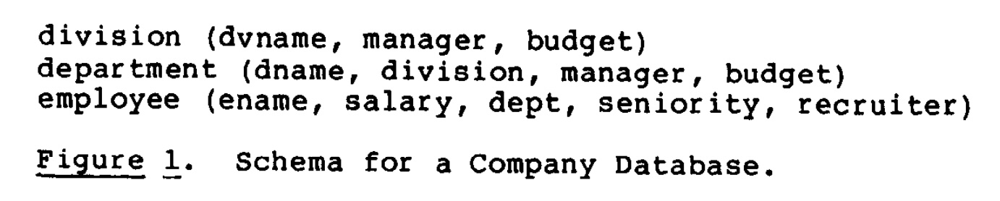  

```text
  Figure 1. Schema for a Company Database.
  +-----------------------------------------------------------+
  | division (dvname, manager, budget)                        |
  | department (dname, division, manager, budget)             |
  | employee (ename, salary, dept, seniority, recruiter)      |
  +-----------------------------------------------------------+
```

理解了这个基础模型，您才能明白论文中查询操作的对象是什么。

### 知识点二：数据库查询语言 (Query Language)

数据库需要一种语言来和人交互，告诉它我们想要什么数据。论文提到了两种主流思想和它自己的语言 Abe。

#### 1\. 声明式语言 vs. 过程式语言

  * **声明式 (Declarative)**：用户只关心 **“想要什么”** ，而不关心 **“如何获取”** 。SQL 就是最典型的声明式语言。比如您说“给我所有市场部员工的姓名”，数据库系统会自己想办法去找。
  * **过程式 (Procedural)**：用户需要明确指出获取数据的**步骤**。比如“第一步，找到部门表里‘市场部’那一行；第二步，拿到部门名字；第三步，去员工表里找到所有部门是这个名字的员工；第四步，把他们的姓名拿出来”。

论文中提到的**关系演算 (Relational Calculus)** 是一种偏向声明式的、基于数理逻辑的查询语言 ，而**关系代数 (Relational Algebra)** 则偏向过程式。Abe 语言是基于关系演算构建的 。

#### 2\. 聚合函数 (Aggregate Functions) 与分组 (Grouping)

这是理解这篇论文统计功能的关键。

  * **聚合函数**：对一组值进行计算，返回单个值。常见的有 `COUNT` (计数), `SUM` (求和), `AVG` (求平均), `MAX` (最大值), `MIN` (最小值) 。
  * **分组 (Grouping)**：在进行聚合计算前，通常需要将数据按某个属性分组。SQL 中使用 `GROUP BY` 关键字。

**一个经典的例子**：计算每个部门的平均工资。
传统的 SQL 会这样做：

1.  从 `employee` 表中读取所有员工。
2.  根据 `dept` (部门) 属性进行分组。
3.  对每个分组分别计算 `salary` 的平均值。

Abe 的一个核心思想是，它不直接使用 `GROUP BY` 这样的分组操作符，而是通过**子查询的自由变量**来实现类似的分区聚合效果 ，这使得其语言结构更统一。

### 知识点三：查询处理与优化 (Query Processing & Optimization)

这是论文的**核心**所在。当用户提交一条声明式查询后，数据库内部会经历复杂的处理流程，其中最关键的一步就是“查询优化”。

#### 1\. 什么是“访问路径 (Access Path)”？

“访问路径”是数据库为了执行一个查询而制定的**底层操作计划**或**执行策略** 。比如，同样是“找一个特定的人”，您可以选择：

  * 从花名册第一页翻到最后一页（全表扫描）。
  * 查阅书末的姓名索引，直接定位到那一页（索引扫描）。

数据库的**查询优化器 (Query Optimizer)** 会评估多种可行的访问路径，并选择一个**成本最低**的来执行。

#### 2\. 经典的访问路径方法

论文中提到的 `fscan`, `iscan`, `mscan` 分别对应了以下三种经典的访问数据的方法：

  * **全文件扫描 (File Scan / `fscan`)**: 从头到尾读取表中的每一行数据 。简单粗暴，但如果表很大，效率很低。
  * **索引扫描 (Index Scan / `iscan`)**: 利用预先创建好的索引来快速定位数据 。就像查字典先查目录一样。索引对于筛选条件（`WHERE`子句）非常有效。
  * **合并扫描 (Merging Scan / `mscan`)**: 主要用于连接(Join)两个已经**按连接键排好序**的表 。优化器会像拉拉链一样，同时扫描两个表，将匹配的行连接起来，效率很高。

#### 3\. 基于成本的优化 (Cost-Based Optimization)

优化器如何判断哪个访问路径更好？答案是**估算成本** 。成本通常主要指**磁盘I/O次数**（即读取数据页的数量），因为这比CPU计算慢得多 。

论文在 **Figure 4** 中给出了一系列成本估算公式 。其中的关键参数包括： 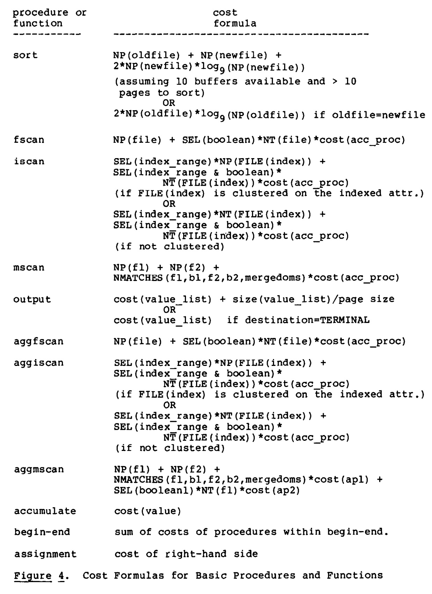  

  * `NP(file)`: 文件的页数 (Number of Pages)。
  * `NT(file)`: 文件中的元组数 (Number of Tuples)。
  * `SEL(boolean)`: 选择率 (Selectivity)，即一个过滤条件（如 `budget > 100K`）能筛选出数据比例。这是一个 0 到 1 之间的值，值越小，代表筛选越严格、过滤掉的数据越多 。

优化器的工作流程可以用下图简单表示：

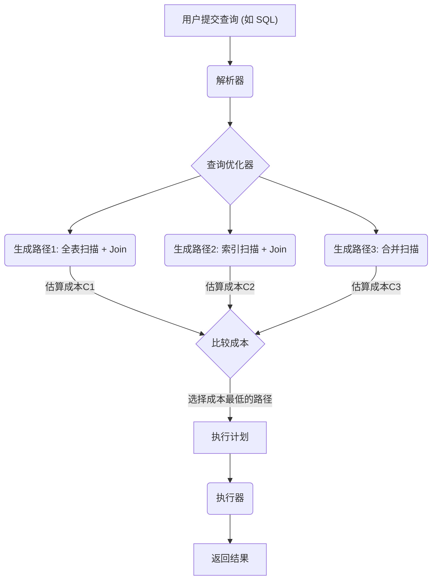

### 论文的核心创新点：聚合连接 (Aggregate Join)

理解了以上知识后，您就能看懂论文的闪光点了。

传统的聚合查询是“**先连接，后聚合**”。例如，要计算每个事业部（division）的员工平均工资，需要先把 `division`, `department`, `employee` 三张表连接起来，生成一张大表，然后再对这张大表按事业部进行分组和聚合。

Abe 提出的核心改进是**将聚合操作和连接操作融为一体**，作者称之为 **“聚合连接 (aggregate joins)”** 。它设计了新的访问路径方法：

  * `aggiscan`: 在**索引扫描**的同时完成聚合计算 。
  * `aggmscan`: 在**合并扫描**的同时完成聚合计算 。

**这有什么好处？**
让我们看论文的 **Example 4** 。查询要求计算预算在 `$50K` 到 `$60K` 之间的部门的员工平均工资。  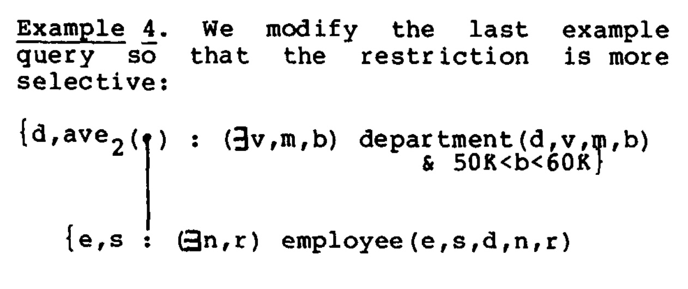  

  * 这个预算范围的选择性很高 (`SEL`很小)，意味着只有少数几个部门符合条件。
  * **传统方法**：可能会先把 `department` 和 `employee` 两张大表整个连接起来，再筛选部门，浪费了大量计算。
  * **Abe 的方法 (`iscan`/`aggiscan`)**：可以先利用 `department` 表的预算索引，快速找到那几个符合条件的部门。然后，对于**每一个**找到的部门，再去 `employee` 表中（最好也有索引）找到对应的员工，并**立即计算**该部门的聚合值。这样就避免了对大量无关员工数据的访问 。

论文通过详细的成本分析（如 **Figure 7** vs **Figure 9**）表明，在不同数据分布和查询选择性的情况下，`aggiscan` 和 `aggmscan` 各有优势。查询优化器应该智能地根据成本估算来选择最优的“聚合连接”策略。

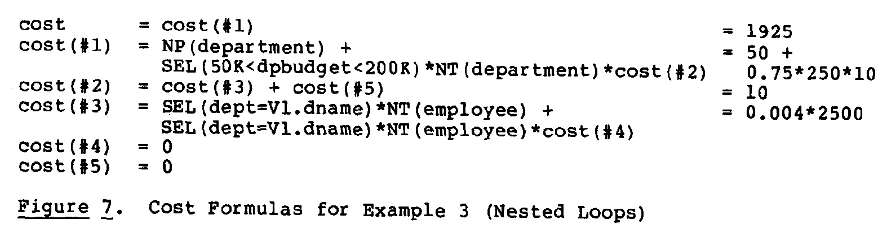  

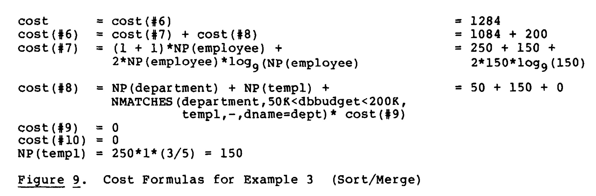  

### 总结

要读懂这篇论文，您需要掌握以下知识体系：

1.  **数据库基本功**：理解表、行、列等基本概念。
2.  **查询语言思想**：了解声明式查询（如SQL）、聚合函数和分组操作。
3.  **查询优化核心**：
      * 明白“访问路径”是数据库的内部执行计划。
      * 熟悉几种基本路径：全表扫描、索引扫描、合并扫描。
      * 理解“基于成本的优化”思想，知道优化器会根据数据统计信息（如表的行数、页数、选择率）来估算成本并做出选择。

有了这些基础，您再去看论文中 Abe 语言的设计、`aggiscan`/`aggmscan` 等创新访问路径以及复杂的成本分析，就会豁然开朗，明白其对传统关系数据库在统计查询处理方面所做的重要改进。
  
## 2 解读论文 
  
好的，这是一份对经典论文《Access Paths in the "Abe" Statistical Query Facility》的通俗化中文解读。

这篇论文的核心思想是：**为数据库中的统计查询（如求和、计数、平均值）设计更智能、更高效的执行计划（即“访问路径”），特别是提出一种将“连接”与“聚合”操作融为一体的新方法。**

-----

### 1\. Abe是什么？—— 一种为统计而生的查询工具

在传统数据库中，复杂的统计分析往往既麻烦又低效 。Abe 查询工具就是为了解决这个问题而设计的，它包含两个主要部分：

  * **一种强大的查询语言**：让用户能简单地写出复杂的嵌套统计查询 。
  * **一个智能的查询优化器**：能为这些复杂查询找到最省时省力的执行方法（访问路径） 。

### 2\. Abe查询语言：告别 `GROUP BY` 的新范式

Abe 语言基于**关系演算**，并提供了一个类似 QBE (Query-by-Example) 的友好界面，用户通过填表来构建查询 。

它的最大特点是**不使用 `GROUP BY` 这样的分组关键字**，而是通过**子查询与父查询之间的变量关联**，来表达“对……进行分组统计”的逻辑 。

**示例解读 (Example 1 & 2)**  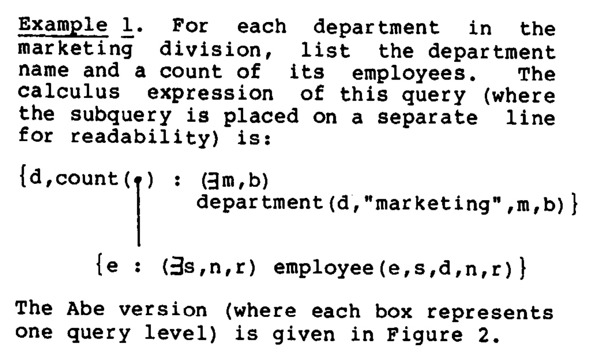  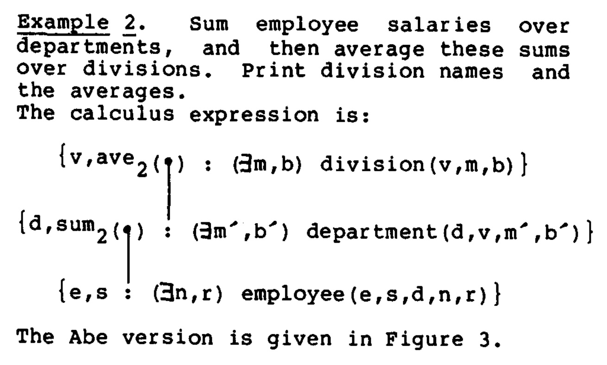  

  * **例1：统计市场部每个部门的员工数**   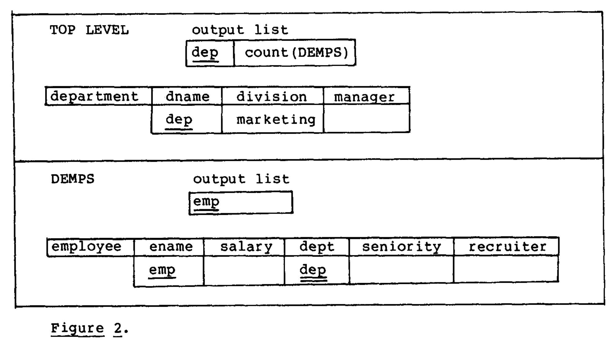  

      * 在 **Figure 2** 中，顶层查询负责找出所有“marketing”的部门，并将部门名称（`dep`）作为输出 。 
      * `dep` 是一个**自由变量**，它被传递到名为 `DEMPS` 的子查询中 。
      * 子查询 `DEMPS` 利用这个传入的 `dep` 值，去 `employee` 表中筛选对应部门的员工并计数 。
      * 这个过程对每个符合条件的部门重复执行，从而实现了分组计数的目的。

  * **例2：先按部门汇总薪资，再按事业部求平均值**   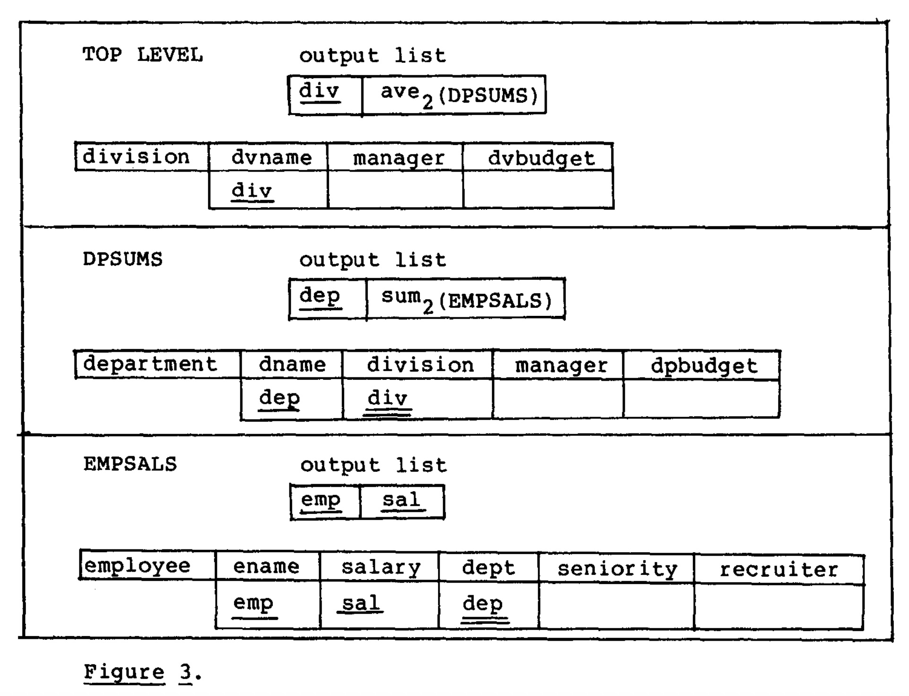  

      * **Figure 3** 展示了一个三层嵌套查询：最底层 (`EMPSALS`) 按部门 (`dep`) 汇总员工薪资 (`sal`)；中间层 (`DPSUMS`) 接收事业部 (`div`)，按部门汇总薪资；最顶层则按事业部 (`div`) 对部门薪资总和求平均 。
      * 这种清晰的层级结构使得复杂的多层聚合变得直观。

### 3\. 论文精髓：创新的访问路径 (Access Path)

“访问路径”是数据库执行查询的内部计划。Abe 的核心创新在于设计了可以**在连接(Join)的同时进行聚合计算**的访问路径，作者称之为 **“聚合连接” (Aggregate Joins)** 。

#### 传统的访问路径

论文中提到了几种经典的执行操作，构成了访问路径的基础 ：

  * **`fscan` (File Scan)**: 全表扫描，从头到尾读取整个表 。
  * **`iscan` (Index Scan)**: 索引扫描，通过索引快速定位数据，避免全表读取 。
  * **`mscan` (Merging Scan)**: 合并扫描，用于连接两个已排序的表，效率很高 。

#### Abe 的“聚合连接”操作

Abe 在上述操作的基础上，增加了直接支持聚合计算的版本：

  * **`aggfscan`**: 在全表扫描时进行聚合。
  * **`aggiscan`**: 在索引扫描时进行聚合 。
  * **`aggmscan`**: 在合并扫描时进行聚合 。


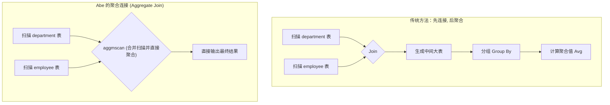

这种新方法避免了生成庞大的中间结果集，从而大幅提升了效率。

### 4\. 核心机制：基于成本的优化选择

Abe 的查询优化器是一个**基于成本的优化器 (Cost-Based Optimizer)** 。它会估算不同访问路径的执行成本（主要是磁盘 I/O），然后选择成本最低的那个。

**成本估算公式 (Figure 4)** 
论文给出了一套估算成本的公式 ，关键参数包括：    

  * `NP(file)`: 文件的页数（衡量大小） 。
  * `NT(file)`: 文件中的元组数（行数） 。
  * `SEL(condition)`: 条件的选择率，即有多少比例的数据满足条件。例如，`SEL=0.1` 意味着条件能过滤掉 90% 的数据 。

**关键决策：何时用 `aggiscan`，何时用 `aggmscan`？**

这取决于查询需要访问子查询中多少“分区”的数据 。

  * **场景一：访问分区少（高选择性）**    

      * **查询 (Example 4)**: 仅查询预算在 `$50K` 到 `$60K` 之间的部门（假设这只占总部门的 5%） 。 
      * **最优路径**: 使用 `iscan` 或 `fscan` 找到这少数几个部门，然后对每个部门，使用 `aggiscan` 通过 `employee` 表的部门索引，只捞取相关员工数据来计算。
      * **原因**: 这种“嵌套循环”式的索引查找，避免了为得到 5% 的结果而去排序整个 100% 的 `employee` 表。成本计算表明，这种路径的开销（175）远低于排序合并的路径（1284） 。

  * **场景二：访问分区多（低选择性）**  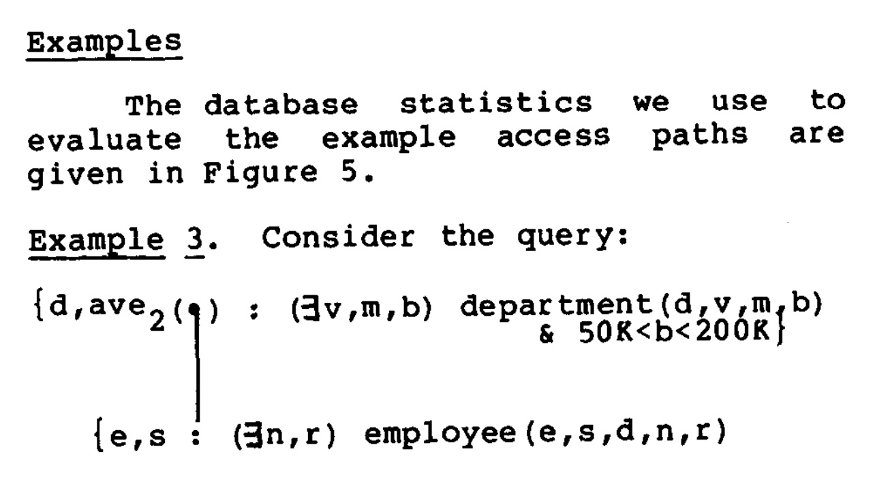  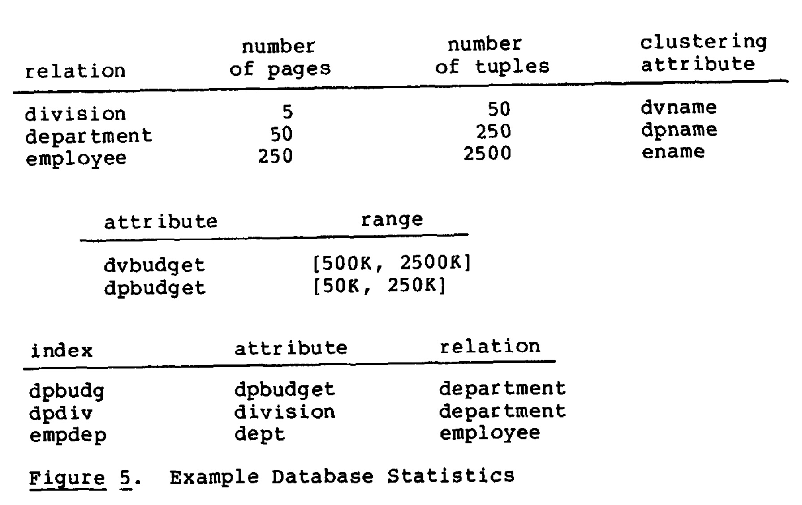  

      * **查询 (Example 3)**: 查询预算在 `$50K` 到 `$200K` 之间的部门（假设这占了总部门的 75%） 。
      * **最优路径**: 先将 `employee` 表按部门排序，然后使用 `aggmscan` 将其与 `department` 表进行合并扫描，在扫描过程中完成聚合。
      * **原因**: 因为大部分部门都要用到，如果反复用索引去查，会导致 `employee` 表的磁盘页被多次重复读取。一次性将 `employee` 表排序，然后进行高效的合并扫描，总成本（1284）反而低于嵌套循环式的索引查找（1925） 。

**Figure 17** 的成本表清晰地展示了优化器的决策过程：根据查询条件（C 和 C' 的选择性）的不同，最优的访问路径（带下划线的成本值）也在 Path 1、2、3 之间变化 。 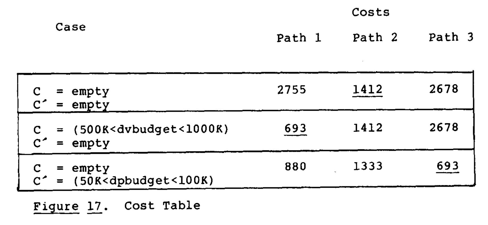  

| Case (查询条件) | Path 1 (嵌套循环) | Path 2 (双合并扫描) | Path 3 (合并+嵌套) |
| :--- | :---: | :---: | :---: |
| 无额外条件 | 2755 | **1412** | 2678 |
| 顶层查询选择性高 | **693** | 1412 | 2678 |
| 底层查询选择性高 | 880 | 1333 | **693** |

### 5\. 对比其他系统 (System-R & Ingres)

论文在第4节指出，当时的主流系统在处理聚合查询时策略非常单一 。

  * **System-R (SQL)**: 对 `GROUP BY` 查询总是采用“先排序再扫描”的方法；对关联子查询则总是使用“元组替换”（类似嵌套循环）的方式 。它不会根据数据的选择性来灵活切换策略。
  * **Ingres (QUEL)**: 它的处理流程是固定的“分解-连接-聚合-再连接”几步，并且不会考虑外层查询的筛选条件来优化内层聚合的计算，导致了大量不必要的计算 。

**Abe 的优势在于，它将多种“聚合连接”策略（索引式、合并式）都纳入一个统一的、基于成本的优化框架中，从而能够根据查询和数据的具体情况，动态选择最高效的执行路径。**

### 总结

《Access Paths in the "Abe" Statistical Query Facility》是一篇在数据库查询优化领域具有开创性的论文。它的主要贡献可以概括为：

1.  **提出了“聚合连接” (Aggregate Join) 的概念**：将聚合与连接操作深度融合，设计了 `aggiscan` 和 `aggmscan` 等新型执行操作，避免了生成巨大的中间结果。
2.  **构建了灵活的成本优化框架**：能够根据查询的选择性（即需要处理多少数据分区）智能地在“索引式”和“合并式”聚合连接策略之间进行选择。
3.  **展示了统一优化的威力**：证明了相比于当时主流系统固定的、单一的聚合处理策略，Abe 的统一优化框架能够显著提升复杂统计查询的执行效率。

这篇论文奠定的思想至今仍在影响着现代数据库查询优化器的设计。
  
## 3 术语 
  
好的，这篇论文《Access Paths In The "Abe" Statistical Query Facility》探讨了一种名为 "Abe" 的统计查询语言及其高效执行查询的内部机制。以下是其中一些重要术语的中文讲解，并结合了论文中的图表进行说明。

### 核心术语详解

#### 1\. Abe 查询语言 (Abe Query Language)

  * **通俗讲解**:
    Abe 是一种专门为统计查询（如求和、计数、平均值等）设计的数据库查询语言 。想象一下，你不是要获取每一条详细记录，而是想知道“每个部门有多少员工？”或“各个分公司的平均销售额是多少？”这类统计结果。Abe 的目标就是让提出这种复杂统计问题变得简单 。它的用户界面友好，看起来像是由多个 QBE (Query-by-Example) 表格组成的树状结构，使得用户可以直观地构建查询 。

  * **论文中的解释**:
    Abe 语言是关系演算（Relational Calculus）的一种具体实现，但为了易用性，它被限制在“连接查询”（Conjunctive Queries）的范围内，并提供了一个友好的全屏用户界面 。如论文的图2和图3所示，一个复杂的查询被分解为多个层次（LEVEL），每个层次用表格表示，清晰地展示了数据如何从一个子查询流向另一个子查询，并在此过程中进行聚合。

      * **图2示例**: 查询“市场部（marketing division）中每个部门的名称及其员工数量” 。     

          * `TOP LEVEL` 定义了最终的输出：部门名 (`dep`) 和员工计数值 (`count(DEMPS)`)。
          * `DEMPS` 是一个子查询，它负责从 `employee` 表中找出与上层 `dep` 匹配的员工。

      * **图3示例**: 一个更复杂的嵌套聚合查询：“按部门汇总员工工资，然后按分公司计算这些总和的平均值” 。这个查询结构清晰地展示了三层嵌套关系。   

#### 2\. 聚合函数 (Aggregate Functions)

  * **通俗讲解**:
    聚合函数就像一个“数据汇总器”。它不关心单个数据项，而是对一组数据进行计算，最终得出一个单一的汇总值 。比如，一个班级的成绩单是一组数据，聚合函数可以计算出“全班总分”（`sum`）、“平均分”（`ave`）、“最高分”（`max`）、“最低分”（`min`）或者“班级人数”（`count`） 。

  * **论文中的解释**:
    论文明确定义了聚合函数：它接收一个由元组构成的集合（即一个关系或表格）作为输入，并产生一个简单的值（通常是数字）作为输出 。Abe 系统支持的聚合函数包括 `count`, `sum`, `ave`, `max`, 和 `min` 。

#### 3\. 访问路径 (Access Paths)

  * **通俗讲解**:
    访问路径是数据库系统内部执行一个查询的具体“路线图”或“策略” 。当你向数据库提问时，数据库的“大脑”（查询处理器）会分析多种可能获取数据的方法，并选择一个成本最低、效率最高的方法。这就好比你要从家到公司，可以选择步行、坐公交、打车等不同路线，每条路线的时间和花费都不同，“访问路径”就是数据库选择的最佳路线。

  * **论文中的解释**:
    Abe 系统中的查询处理器负责从多种可能的实现方式中，找到执行查询的最佳访问路径 。这个选择过程基于对数据库统计信息（如表的行数、数据页数、不同值的数量等）的成本估算 。访问路径是由一系列标准化的过程和函数（如 `fscan`, `iscan`, `mscan` 等）组合而成的 。

#### 4\. 聚合连接 (Aggregate Joins)

  * **通俗讲解**:
    这是这篇论文的核心创新点。传统的做法是“先连接，再聚合”。例如，要计算每个部门的员工人数，系统通常会先把 `department` 表和 `employee` 表通过“部门ID”连接起来，形成一个大的临时表，然后再对这个大表进行分组和计数。

    而“聚合连接”是一种更聪明的办法，它在**连接两个表的同时就进行聚合计算** 。这样就避免了生成巨大的中间表，从而大大提升了效率。

  * **论文中的解释**:
    Abe 的访问路径可以执行“聚合连接”，即在将子查询与父查询连接的同时计算聚合值 。这种操作可以通过索引扫描或合并扫描来实现，具体取决于需要访问的数据“分区”数量 。

  * **图表示例**:
    我们可以用一个简单的文本流程图来说明其差异：

    ```mermaid
    graph TD
        subgraph 传统方法
            A[Department 表] --> C{连接操作};
            B[Employee 表] --> C;
            C --> D[生成巨大的中间表];
            D --> E[分组并计算聚合值];
            E --> F[最终结果];
        end

        subgraph Abe 的聚合连接
            G[Department 表] --> I{聚合连接操作};
            H[Employee 表] --> I;
            I --> J[直接生成最终结果];
        end
    ```

#### 5\. 访问路径的基本操作 (fscan, iscan, mscan 等)

  * **通俗讲解**:
    这些是构成“访问路径”这个路线图的基本步骤，类似于地图上的“直行”、“左转”等基本指令。论文为每种操作都定义了聚合版本（以 `agg` 开头）。

      * **`fscan` (File Scan / 文件扫描)**:
        这是最简单直接的方式，即从头到尾完整地读取整个文件（表） 。就像一页一页地读完一本书。
      * **`iscan` (Index Scan / 索引扫描)**:
        利用索引来快速定位到需要的数据行，而不用读取整张表 。就像通过书的目录直接翻到你想看的那一章，效率很高。
      * **`mscan` (Merging Scan / 合并扫描)**:
        当要连接的两个表都已按连接字段排好序时使用 。就像合并两个已经按字母顺序排好的姓名列表，你只需要同时从头到尾过一遍就行了，非常高效。
      * **`aggfscan`, `aggiscan`, `aggmscan`**:
        这些是上述操作的“聚合加强版” 。它们在执行扫描的同时，会使用一个名为 `accumulate` 的累加器过程来实时计算聚合值，从而实现“聚合连接” 。

#### 6\. 成本估算 (Cost Estimation) 和选择性 (Selectivity)

  * **通俗讲解**:

      * **成本估算**: 数据库在决定使用哪条“访问路径”前，会先对每条路径的“成本”（主要是读取磁盘的次数，即 I/O 开销）进行估算 。它会选择估算成本最低的那条路径。
      * **选择性 (Selectivity)**: 指查询条件能过滤掉多少数据 。一个“高选择性”的条件意味着它非常挑剔，只会留下很少的数据（例如 `WHERE budget < 60K`）；而一个“低选择性”的条件则比较宽松，会留下大部分数据（例如 `WHERE budget < 200K`） 。

  * **论文中的解释**:
    论文在图4中给出了计算各种基本操作成本的详细公式 。这些公式严重依赖于布尔表达式的“选择性”（`SEL()`） 。       

    论文通过**示例3**和**示例4**的对比，完美地展示了选择性的重要性：

      * 在**示例3**中，查询条件 `50K < budget < 200K` 的选择性很低，几乎所有部门数据都需要被访问。计算结果表明，此时“先排序再合并扫描” (`sort/aggmscan`) 的方法成本更低 (1284) 。     
      * 在**示例4**中，查询条件变为 `50K < budget < 60K`，选择性变得很高，只有少数部门被访问。在这种情况下，“嵌套循环+索引扫描” (`fscan/aggiscan`) 的方法成本急剧下降 (175)，远低于排序合并的方式 。    

    这个对比雄辩地证明了，**不存在永远最优的访问路径，数据库必须根据查询条件的“选择性”动态地进行成本估算，才能找到最高效的执行计划**。
  
## 参考        
         
https://dl.acm.org/doi/pdf/10.1145/582353.582382    
        
<b> 以上内容基于DeepSeek、Qwen、Gemini及诸多AI生成, 轻微人工调整, 感谢杭州深度求索人工智能、阿里云、Google等公司. </b>        
        
<b> AI 生成的内容请自行辨别正确性, 当然也多了些许踩坑的乐趣, 毕竟冒险是每个男人的天性.  </b>        
  
    
#### [期望 PostgreSQL|开源PolarDB 增加什么功能?](https://github.com/digoal/blog/issues/76 "269ac3d1c492e938c0191101c7238216")
  
  
#### [PolarDB 开源数据库](https://openpolardb.com/home "57258f76c37864c6e6d23383d05714ea")
  
  
#### [PolarDB 学习图谱](https://www.aliyun.com/database/openpolardb/activity "8642f60e04ed0c814bf9cb9677976bd4")
  
  
#### [PostgreSQL 解决方案集合](../201706/20170601_02.md "40cff096e9ed7122c512b35d8561d9c8")
  
  
#### [德哥 / digoal's Github - 公益是一辈子的事.](https://github.com/digoal/blog/blob/master/README.md "22709685feb7cab07d30f30387f0a9ae")
  
  
#### [About 德哥](https://github.com/digoal/blog/blob/master/me/readme.md "a37735981e7704886ffd590565582dd0")
  
  

  
