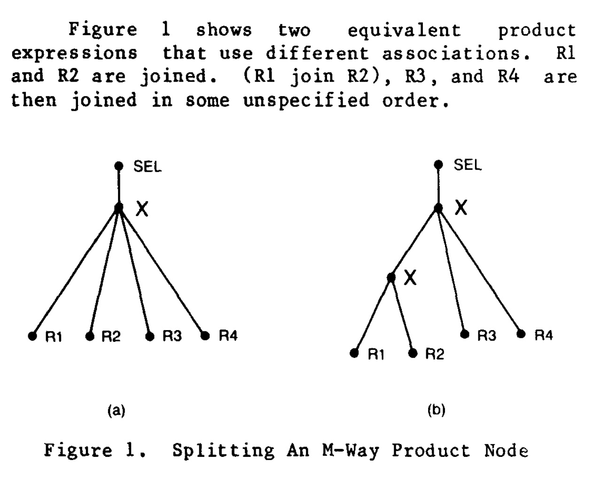

## AI论文解读 | Extending The Algebraic Framework Of Query Processing To Handle Outerjoins
        
### 作者        
digoal        
        
### 日期        
2025-10-07        
        
### 标签        
PostgreSQL , PolarDB , DuckDB , AI , 论文解读        
        
----        
        
## 背景  
      
https://www.vldb.org/conf/1984/P334.PDF        
  
提示:          
```          
读懂《Extending The Algebraic Framework Of Query Processing To Handle Outerjoins》这篇论文需要提前掌握哪些基础知识, 请使用中文通熟易懂的讲解这些基础知识, 可以引用论文中的图、表或使用Markdown支持的图形(text,mermaid等)增加解释性. 
  
使用中文通熟易懂的解读《Extending The Algebraic Framework Of Query Processing To Handle Outerjoins》这篇论文, 其中的关键内容请着重讲解, 可以引用论文中的图、表或使用Markdown支持的图形(text,mermaid等)增加解释性. 
  
提取《Extending The Algebraic Framework Of Query Processing To Handle Outerjoins》这篇论文中的重要术语, 使用中文对这些术语进行通熟易懂的讲解, 可以引用论文中的图、表或使用Markdown支持的图形(text,mermaid等)增加解释性. 
```     
  
## 1 前置知识 
  
好的，为了完全理解《Extending the Algebraic Framework of Query Processing to Handle Outerjoins》这篇论文，你需要掌握一些数据库领域的基石性知识。这篇论文的核心思想是：**将一种相对特殊的操作（外连接/Outerjoin），用一套基础的、可自由组合的数学符号（扩展后的关系代数）来表达，从而让数据库的查询优化器能够像处理普通查询一样，智能地优化含有外连接的复杂查询。**

下面我将为你通俗易懂地讲解这些必备的基础知识，并结合论文中的图示进行说明。

-----

### 基础知识一：关系模型与关系代数 (Relational Model & Algebra)

这是理解这篇论文的**最核心基础**。

#### 1\. 什么是关系模型？

简单来说，就是我们最常见的数据库模型：

  * **关系 (Relation)**：就是一张二维表（Table）。
  * **元组 (Tuple)**：就是表中的一行（Row）。
  * **属性 (Attribute)**：就是表中的一列（Column）。
  * **NULL值**：一个特殊的标记，表示“未知”或“不存在”。这一点对于理解外连接至关重要。

#### 2\. 什么是关系代数？

关系代数是一套用于操作关系（表）的**数学语言**。它定义了一系列操作符，每个操作符接收一个或多个表作为输入，并产生一个新的表作为输出。这篇论文完全建立在关系代数的基础上。

你需要了解以下几个基本操作符：

  * **选择 ( Selection, $\sigma$ )**

      * **作用**：像 `WHERE` 子句一样，从表中筛选出符合条件的**行**。
      * **论文中的表示**：`Sel(P)(R)` ，表示在关系R上执行条件为P的选择操作。

  * **投影 ( Projection, $\pi$ )**

      * **作用**：像 `SELECT` 子句指定列一样，从表中选出特定的**列**。
      * **论文中的表示**：`Proj[R,S]` ，表示从关系R中选出属性集S包含的列。

  * **笛卡尔积 ( Cartesian Product, $\times$ )**

      * **作用**：将两个表的所有行进行暴力组合。如果表R1有m行，表R2有n行，它们的笛卡尔积就会产生一个包含 R1 和 R2 所有列的、有 m×n 行的新表。
      * **论文中的表示**：`R1 X R2`。论文中多次提到的 `product node`  就是指这个操作。

  * **连接 ( Join, $\bowtie$ )**

      * **作用**：最常用的操作，它实际上是“笛卡尔积”和“选择”的组合。例如，`R1 JOIN R2 ON R1.id = R2.id` 等价于先计算 `R1 × R2`，然后再筛选出 `R1.id = R2.id` 的那些行。
      * **论文的视角**：论文倾向于将连接拆解为更底层的笛卡尔积和选择操作 ，因为这样在优化时，可以更灵活地移动和重排这些基础操作。

-----

### 基础知识二：数据库查询处理与优化 (Query Processing & Optimization)

了解了关系代数，我们还需要知道数据库是如何利用它来执行和优化SQL查询的。

#### 1\. 查询树 (Query Tree)

当数据库收到一条SQL查询时，它会首先将其解析成一棵**查询树** 。这棵树的叶子节点是原始的表，内部节点是关系代数操作符。数据从叶子节点流向根节点，最终在根节点得到查询结果。

例如，一条简单的SQL查询：

```sql
SELECT TNAME, EMPNAME
FROM TASK, STAFF
WHERE TASK.TNO = STAFF.TNO;
```

可以被表示为如下的查询树：


  * **解读**：先对 TASK 和 STAFF 表做笛卡尔积 (`×`)，然后执行选择 (`σ`) 筛选出连接条件匹配的行，最后做投影 (`π`) 得到想要的列。

#### 2\. 优化的核心思想：重排查询树

上述查询树的执行效率极低（先做庞大的笛卡尔积）。一个好的查询优化器会利用关系代数的数学定律来**重排**这棵树，使其等价但执行效率更高。

  * **核心目标**：尽可能早地减少中间结果集的大小。

  * **常用技巧**：

      * **谓词下推 (Predicate Pushdown)**：将选择 (`σ`) 操作尽可能地移动到树的底层。比如，如果有一个 `WHERE TNAME = 'Report Writer'` 的条件，应该在对 TASK 表做任何操作之前就先把它过滤掉。
      * **连接重排 (Join Reordering)**：当多个表连接时，连接的顺序会极大地影响性能。`(R1 join R2) join R3` 和 `R1 join (R2 join R3)` 的结果相同，但性能可能天差地别 。论文中的 **Figure 1**  就形象地展示了这一点：   

      * **图(a)** 表示先将 `R1, R2, R3, R4` 四个表一次性求笛卡尔积，再做选择，这给了优化器最大的连接顺序选择自由 。
      * **图(b)** 表示先将 `R1` 和 `R2` 连接，其结果再与 `R3` 和 `R4` 连接 。这是一种可能的、更具体的执行计划。优化器的任务就是从众多可能的执行计划中，选择一个成本最低的。

#### 3\. 查询树“扁平化” (Flattening)

当查询变得复杂，比如查询一个视图（View）或者包含子查询时，查询树就会出现多层嵌套 。**扁平化 (Flattening)**  就是将这些嵌套的查询树展开，合并成一个大的、单层的查询树。这样做的好处是，优化器获得了更大的重排操作的自由度，可以跨越原本视图或子查询的边界来寻找最优的执行顺序。

-----

### 基础知识三：内连接 vs. 外连接 (Inner Join vs. Outer Join)

这是理解论文要解决的**具体问题**的关键。

#### 1\. 内连接 (Inner Join)

我们前面提到的“连接”通常指的就是内连接。它只返回两个表中**能够相互匹配**的行。

**例子**：我们有`任务(TASK)`表和`职员(STAFF)`表。

| TASK (任务表) | |
| :--- | :--- |
| **TNO** | **TNAME** |
| T1 | 设计 |
| T2 | 编码 |
| T3 | 测试 |

| STAFF (职员表) | |
| :--- | :--- |
| **TNO** | **EMPNAME** |
| T1 | 张三 |
| T2 | 李四 |
| T2 | 王五 |

执行内连接 `TASK INNER JOIN STAFF ON TASK.TNO = STAFF.TNO`，只会返回 T1 和 T2 这两个能匹配上的任务的信息。任务 T3 因为在 STAFF 表中没有匹配项，所以被丢弃了。

#### 2\. 外连接 (Outer Join)

外连接解决了内连接“丢失信息”的问题。它不仅返回匹配的行，还会返回某一方（或双方） **没有匹配上的行** ，并在另一方对应的列中填充 `NULL` 值。

  * **左外连接 (Left Outer Join)**：保留左表的所有行。
  * **右外连接 (Right Outer Join)**：保留右表的所有行。
  * **全外连接 (Full Outer Join)**：保留左右两表的所有行。

论文中提到的 `Preserve R1`  就等价于 `R1` 是左外连接中的左表，它的所有元组都将被保留。

使用上面的例子，执行 `TASK LEFT OUTER JOIN STAFF ON TASK.TNO = STAFF.TNO` (`PRESERVE TASK`)，结果会是：

| TASK.TNO | TASK.TNAME | STAFF.TNO | STAFF.EMPNAME |
| :--- | :--- | :--- | :--- |
| T1 | 设计 | T1 | 张三 |
| T2 | 编码 | T2 | 李四 |
| T2 | 编码 | T2 | 王五 |
| **T3** | **测试** | **NULL** | **NULL** |

可以看到，任务 T3 的信息被保留了下来。

#### 3\. 外连接为何难以优化？

传统的连接操作（内连接）满足交换律和结合律，优化器可以随意重排它们。但外连接不满足这些定律，`R1 LEFT JOIN R2` 不等于 `R2 LEFT JOIN R1`，这使得传统的优化规则失效了。

### 论文的核心贡献：如何让外连接“代数化”

理解了以上基础后，你就能明白这篇论文的精妙之处了。作者没有为外连接设计一套全新的、特殊的优化规则，而是**发明了几个新的关系代数操作符**，将外连接的语义分解为这些基础操作的组合 。

  * **`Aug<R #S>` (Augment)**: 为一个关系 R 增加一个全为特定 `NULL`（论文中称为带标签的`NULL` ）的元组，为“信息保留”做准备 。
  * **`Sel(P #S)` (Relaxed Selection)**: 一种“宽松”的选择操作，它在判断时会特殊处理 `NULL` 值，使得本该被 `NULL` 过滤掉的行得以保留 。
  * **`Omit<R #S>` (Omit)**: 在操作的最后阶段，移除因为代数变换而产生的多余的、不符合最终语义的行 。

通过这套组合拳，一个外连接查询被转换成了一棵只包含基础代数操作符的查询树（如论文中的 **Figure 3** 所示）。一旦转换完成，查询优化器就可以应用之前提到的**扁平化**、**谓词下推**、**连接重排**等所有优化技术，就像处理普通查询一样来优化这个复杂的含有外连接的查询了。   

**总结一下，要读懂这篇论文，你需要：**

1.  **懂关系代数**：这是论文的语言。
2.  **懂查询优化**：这是论文的背景和目标，尤其是基于查询树重写的优化思想。
3.  **懂外连接**：这是论文要解决的核心问题及其挑战所在。

掌握了这些，你就能轻松理解作者是如何巧妙地将一个复杂问题分解，并融入现有理论框架的。
  
## 2 解读论文 
  
好的，这篇名为《Extending the Algebraic Framework of Query Processing to Handle Outerjoins》的论文，是数据库查询优化领域的一篇经典之作。其核心思想是**将外连接（Outerjoin）这种特殊操作，通过一套新定义的、更基础的代数操作符进行分解和表达，从而将其无缝地融入到传统的关系代数查询优化框架中** 。

下面，我将用通俗易懂的方式，为你层层解析这篇论文的关键内容。

### 1\. 问题的起点：为什么外连接难以优化？

在传统的数据库系统中，查询优化器（Query Optimizer）是性能的关键。它会把用户写的SQL查询语句，转换成一个由关系代数操作符（如选择、投影、笛卡尔积）组成的“查询树” 。优化器的主要工作就是对这棵树进行等价变换（比如重排连接顺序、提前过滤数据），找到一个执行成本最低的方案 。

这个框架对内连接（Inner Join）非常有效，因为内连接满足数学上的**交换律和结合律**，优化器可以灵活地调整它们的顺序。

然而，**外连接（Outerjoin）** 却不满足这些定律。`A LEFT JOIN B` 和 `B LEFT JOIN A` 的结果完全不同。这导致优化器不能随意地重排包含外连接的操作，传统的优化规则在这里失效了。因此，很多系统只能把外连接当作一个特殊的、不可拆分的整体来处理，大大限制了优化的空间 。

### 2\. 论文的创举：用“代数”思想分解外连接

为了解决这个问题，作者没有为外连接设计一套独立的优化规则，而是提出了一个更优雅的方案：**发明一套新的基础代数操作符，用它们的组合来精确地描述外连接的语义** 。

一个单边外连接（One-sided Outerjoin），例如 `R1 PRESERVE R1 WHERE P`（保留R1的所有元组），被分解为以下几个步骤 ：

1.  **准备“填充物”** ：首先，要为可能匹配失败的行准备好 `NULL` 值。
2.  **暴力组合**：然后，将处理过的表进行笛卡尔积。
3.  **宽松匹配**：接着，用一个能同时处理正常值和`NULL`值的“宽松版”条件进行筛选。
4.  **清理冗余**：最后，清理掉变换过程中产生的、不符合最终语义的中间行。

为了实现上述步骤，论文定义了几个关键的新操作符：

#### 关键内容一：新的代数操作符

  * **带标签的NULL (`#R`)**
    为了在复杂的查询变换中追踪 `NULL` 的来源（即哪个表的匹配失败了），论文引入了“带标签的NULL” 。例如，`#STAFF` 就特指因 STAFF 表匹配失败而产生的 `NULL` 值 。

  * **Augment (`Aug<R #S>`)**
    **作用**：在一个关系（表）`R` 中，增加一行完全由指定标签的 `NULL`（`#S`）组成的特殊元组 。
    **目的**：这相当于提前把 `NULL` “填充物”放进其中一个要连接的表中。这样，在后续做笛卡尔积时，被保留表中的每一行，至少都能和这个全 `NULL` 的行组合，从而保证了信息不会丢失。

  * **宽松选择 (`Sel(P|#S)`)**
    **作用**：这是一个修改版的选择操作。它的判断逻辑是 "`P` 条件成立，**或者** `P` 条件中涉及到的来自 `S` 表的所有属性值都为 `#S`" 。
    **目的**：当一个来自被保留表的行与 `Augment` 操作产生的全 `NULL` 行组合时，普通的连接条件 `P` 肯定不成立。而这个宽松版的选择 (`Sel`) 能够识别出这种情况，并“放行”这个组合了 `NULL` 的元组，从而实现了外连接保留不匹配行的效果 。

  * **Omit (`Omit<R #S>`)**
    **作用**：这是一个清理操作。它会检查结果集，如果一个元组 `t` 被另一个在关键属性上更“完整”（非`NULL`）的元组 `t'` 所“支配”（\#S-dominates），那么 `t` 就会被移除 。
    **目的**：`Augment` 和宽松选择保证了所有信息都被保留，但也引入了一些冗余。例如，一个成功匹配的行，不仅会产生正常的连接结果，还会产生一个和 `NULL` 行匹配的结果。`Omit` 的任务就是把后者这种多余的、“被支配”的结果给清理掉 。

#### 关键内容二：代数化的外连接查询树

通过这套组合拳，一个含有外连接的查询视图（View）就可以被表示成一棵纯粹由基础代数操作符构成的查询树。论文中的 **Figure 3** 给出了一个绝佳的例子。   

**视图定义**:

```sql
VIEW TS IS
SELECT TASK.TNO, TNAME, EMPNAME, FRACTION, CNO
FROM TASK, STAFF PRESERVE TASK
WHERE TASK.TNO = STAFF.TNO
```

这个保留 TASK 表的左外连接，被转换成了下图所示的查询树：

  * **解读**:
    1.  `AUG <#STAFF>`: 先对 `STAFF` 表进行增广，加入一个全为 `#STAFF` 的 `NULL` 元组 。
    2.  `X`: 然后与 `TASK` 表做笛卡尔积 。
    3.  `SEL(TASK.TNO=STAFF.TNO|#STAFF)`: 使用宽松选择进行筛选 。
    4.  `OMIT <#STAFF>`: 清理被正常连接结果所“支配”的 `NULL` 连接结果 。
    5.  `PROJ`: 最后做投影，得到视图所需的列 。

### 3\. 核心流程：扁平化 (Flattening) 与 非扁平化 (Unflattening)

将外连接代数化后，最大的好处就是可以将其融入已有的优化流程中 。论文的核心优化过程分为两步：

#### 关键内容三：扁平化 (Flattening)

当一个查询引用了包含外连接的视图（如上文的`TS`视图），或者外连接本身嵌套在另一个查询中时，就会形成一个多层的、复杂的查询树 。**扁平化**的目的就是打破这种层级结构，将多个笛卡尔积（`X`）节点合并成一个，从而为优化器提供最大范围的连接重排空间 。

这个过程需要将夹在不同笛卡尔积节点之间的 `Augment`, `Sel`, `Omit` 等操作符向上或向下移动，并进行相应的规则转换 。例如，论文给出了 `Augment` 操作如何穿过 `Sel` 和 `Proj` 操作的代数等价变换规则 。

论文中的 **Figure 5** 展示了一个复杂的嵌套查询，其初始查询树有三层。经过扁平化处理后（如 **Figure 6** 所示），它变成了一个包含 `CONTRACT`, `TASK`, `STAFF` 三个表的单层、多路笛卡尔积，所有的选择、投影、Omit等操作都集中在了这个大的笛卡尔积节点之上。

    

#### 关键内容四：非扁平化 (Unflattening)

扁平化之后，优化器就可以自由地为这个多路笛卡尔积选择一个最优的连接顺序和算法了（例如，决定先连接 `TASK` 和 `STAFF`）。

在确定了最佳连接顺序后，就进入**非扁平化**阶段 。这个过程与扁平化相反，它会将之前集中在顶层的选择、投影等操作，尽可能地“下推”（Push Down）到查询树的底层，紧挨着它们所操作的表 。

**目的**：尽可能早地执行过滤（选择）和减少数据量（投影）的操作，从而大幅缩小后续连接操作需要处理的中间结果集的大小，提升查询性能 。

论文中的 **Figure 7** 和 **Figure 8** 就展示了经过非扁平化（Unflattening）后，操作符被智能地下推到最佳位置的最终查询树。

    

### 总结与意义

这篇论文的贡献是里程碑式的：

1.  **统一的代数框架**：它成功地将外连接这一“异类”操作，纳入了经典的关系代数优化框架，使得优化器可以用一套统一、简洁的逻辑来处理各种复杂的查询，而无需为外连接编写特殊的代码 。
2.  **增强的优化能力**：通过代数分解和扁平化，优化器获得了前所未有的自由度来重排包含外连接的查询，从而能够发现比传统方法更高效的执行计划 。
3.  **高度的可扩展性**：论文展示了一种强大的思想，即当数据库需要引入新的、复杂的语言特性（如聚合、量词等）时，可以首先尝试为其寻找一个优雅的代数表达，然后定义其与现有操作符的交互规则 。这使得查询优化器系统变得更易于扩展和维护 。

简单来说，这篇论文通过精妙的数学抽象，为解决一个棘手的工程问题提供了一个既深刻又实用的理论基础，深刻影响了后续数据库查询优化技术的发展。
  
## 3 术语 
  
好的，这篇论文为了将外连接（Outerjoin）无缝地整合进关系代数优化框架，定义和使用了一系列关键术语。以下是对这些重要术语的中文讲解，力求通俗易懂，并结合论文内容进行解释。

### 一、查询优化基础术语

#### 1\. 关系代数 (Relational Algebra)

关系代数是一套用于操作关系（即二维表）的数学语言 。数据库的查询优化器会将SQL查询首先翻译成关系代数表达式，然后再进行优化 。

  * **选择 (Selection, `SEL`)**: 从表中筛选出符合条件的**行** 。
  * **投影 (Projection, `PROJ`)**: 从表中选取特定的**列** 。
  * **笛卡尔积 (Cartesian Product, `X`)**: 将两个表的所有行进行组合，是实现连接（Join）的基础操作 。

#### 2\. 查询树 (Query Tree)

查询树是关系代数表达式的图形化表示 。它的叶子节点是数据表，内部节点是关系代数操作符（如 `SEL`, `PROJ`, `X`） 。数据从叶子节点向根节点流动，最终在根节点产生查询结果。

例如，一个简单的两表连接查询可以表示为如下的树形结构：


#### 3\. 扁平化 (Flattening)

当查询包含视图（View）或嵌套子查询时，其查询树会是多层的 。**扁平化**是指将这种多层、嵌套的查询树展开，合并成一个单层的、包含多路笛卡尔积的查询树的过程 。

  * **目的**：打破原有的查询嵌套边界，让优化器可以在一个更大的范围内自由地重排连接顺序，从而找到更优的执行计划 。

#### 4\. 非扁平化 (Unflattening)

在扁平化并确定了最优的连接顺序后，**非扁平化**是一个逆向过程 。它将之前集中在查询树顶层的选择（`SEL`）和投影（`PROJ`）等操作，尽可能地“下推”（Push Down）到树的底层，靠近它们所操作的数据表 。

  * **目的**：尽早执行过滤和数据削减操作，以减小后续连接操作处理的中间数据量，从而提升性能 。

### 二、为处理外连接定义的核心术语

传统的关系代数无法直接表达外连接的“保留不匹配行”这一语义。为此，作者引入了以下几个创新的术语和操作符。

#### 5\. 带标签的NULL (Labelled Nulls)

这是一个为了在复杂的查询变换中精确追踪 `NULL` 值来源而设计的概念 。

  * **定义**：为每个可能因匹配失败而产生 `NULL` 的关系（表），分配一个独特的 `NULL` 标签，记作 `#R`（例如 `#STAFF`） 。
  * **作用**：当一个元组的某些属性是 `#STAFF` 时，我们就能确切地知道，这是因为 `STAFF` 表中没有找到匹配行而填充的 `NULL`，而不是其他原因。这在多层外连接的优化中至关重要 。

#### 6\. Augment (增广), `Aug<R #S>`

这是一个用于向关系中添加一行全为`NULL`的特殊元组的操作符 。

  * **定义**: `Aug<R #S>` 表示在关系 `R` 中，增加一行，其所有属性的值都为带标签的 `NULL` `#S` 。
  * **作用**: 这是实现外连接“保留”语义的第一步。通过给其中一个表（例如`STAFF`）增广一个全`NULL`行，可以保证另一个表（例如`TASK`）中的每一行，在做笛卡尔积时，至少能与这个`NULL`行匹配，从而避免了信息的丢失。

#### 7\. 宽松谓词 / 宽松选择 (Relaxed Predicate / Relaxed Selection), `Sel(P|#S)`

这是一个修改版的选择操作，它能特殊处理带标签的 `NULL` 值 。

  * **定义**: `(P|#S)` 的逻辑是：“谓词 `P` 成立，**或者**谓词 `P` 中涉及到的来自关系 `S` 的所有属性值均为 `#S`” 。
  * **作用**: 当一个来自被保留表的行与`Augment`操作产生的全`NULL`行组合时，普通的连接条件`P`无法满足。而宽松选择能够识别这种情况并“放行”这个组合，从而实现了保留不匹配行的效果。

#### 8\. \#S-dominates (\#S-支配)

这是一个用于比较两个元组（行）“信息完整度”的规则 。

  * **定义**: 对于两个元组 `t'` 和 `t`，如果对于每一个属性，`t'.A` 的值都比 `t.A` 更优或相等（其中非`NULL`值优于`#S`），那么就称 `t'` \#S-支配 `t` 。
  * **作用**: 这个规则是 `Omit` 操作的基础。一个成功匹配的元组会比一个与`NULL`行匹配的元组更“完整”，因此前者会“支配”后者。

#### 9\. Omit (省略/剔除), `Omit<R #S>`

这是一个用于清理冗余元组的“过滤器”操作符 。

  * **定义**: `Omit<R #S>` 会检查输入的关系 `R`，并移除任何被其他元组“\#S-支配”的元组 。
  * **作用**: `Augment` 和 `Relaxed Selection` 虽然保留了所有需要的信息，但也产生了一些冗余的、与`NULL`行匹配的元组。`Omit` 的任务就是将这些被更“完整”的、成功匹配的元组所支配的冗余元组清理掉，确保最终结果的正确性 。

通过以上这套新的操作符，论文成功地将一个外连接查询转换成了一棵纯粹的代数查询树，如 **Figure 3** 所示。这棵树可以被传统优化器的**扁平化**和**非扁平化**流程处理，从而实现了对外连接的高效优化。   

  
## 参考        
         
https://www.vldb.org/conf/1984/P334.PDF    
        
<b> 以上内容基于DeepSeek、Qwen、Gemini及诸多AI生成, 轻微人工调整, 感谢杭州深度求索人工智能、阿里云、Google等公司. </b>        
        
<b> AI 生成的内容请自行辨别正确性, 当然也多了些许踩坑的乐趣, 毕竟冒险是每个男人的天性.  </b>        
  
    
#### [期望 PostgreSQL|开源PolarDB 增加什么功能?](https://github.com/digoal/blog/issues/76 "269ac3d1c492e938c0191101c7238216")
  
  
#### [PolarDB 开源数据库](https://openpolardb.com/home "57258f76c37864c6e6d23383d05714ea")
  
  
#### [PolarDB 学习图谱](https://www.aliyun.com/database/openpolardb/activity "8642f60e04ed0c814bf9cb9677976bd4")
  
  
#### [PostgreSQL 解决方案集合](../201706/20170601_02.md "40cff096e9ed7122c512b35d8561d9c8")
  
  
#### [德哥 / digoal's Github - 公益是一辈子的事.](https://github.com/digoal/blog/blob/master/README.md "22709685feb7cab07d30f30387f0a9ae")
  
  
#### [About 德哥](https://github.com/digoal/blog/blob/master/me/readme.md "a37735981e7704886ffd590565582dd0")
  
  

  
