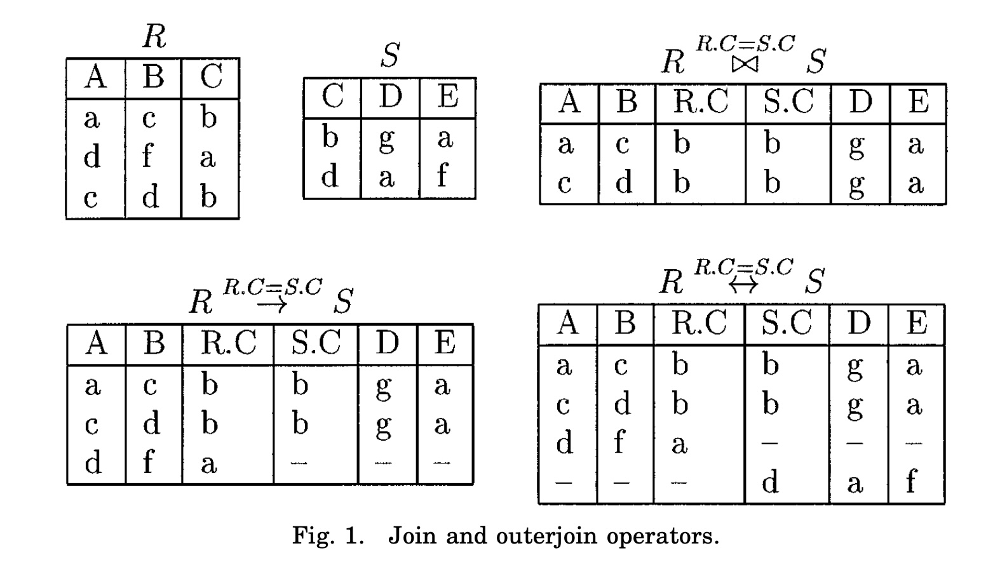
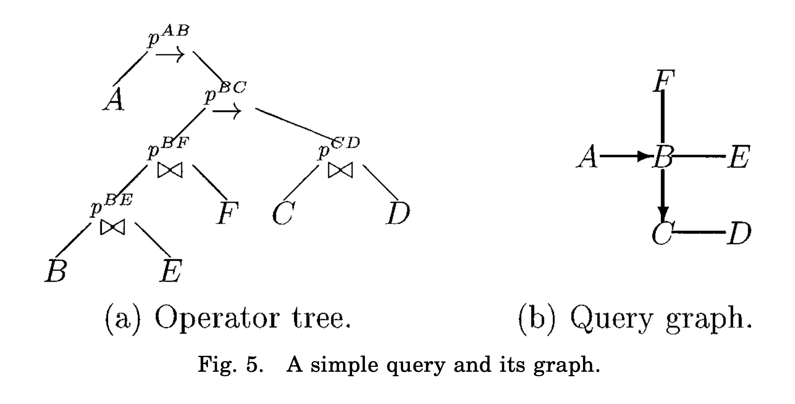
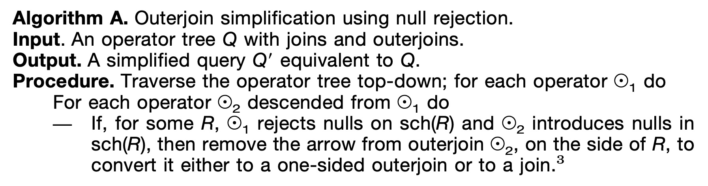
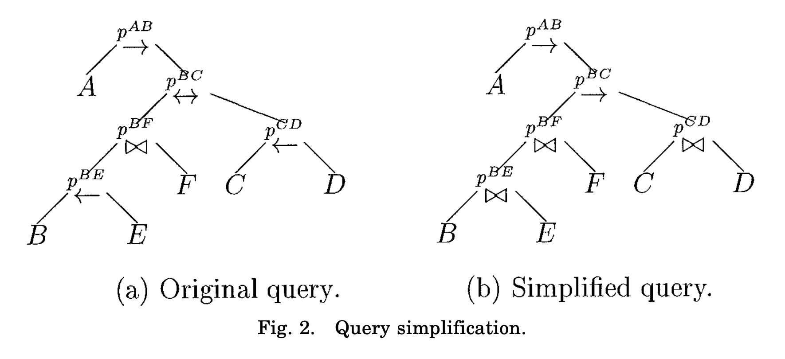
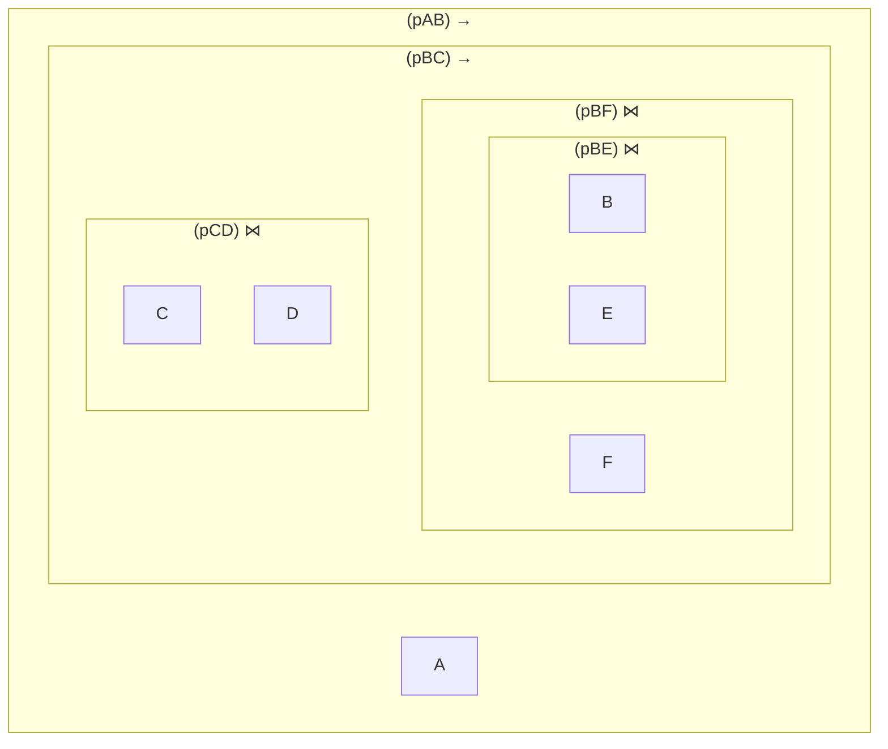
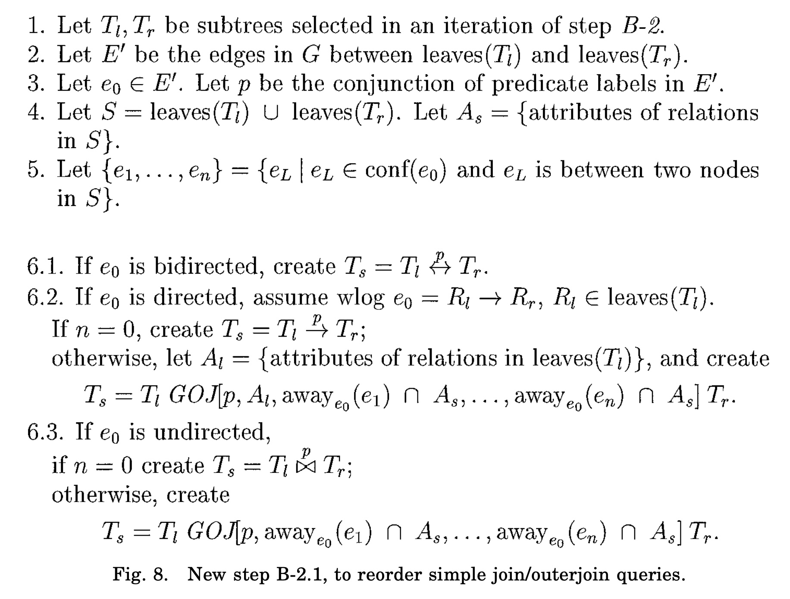
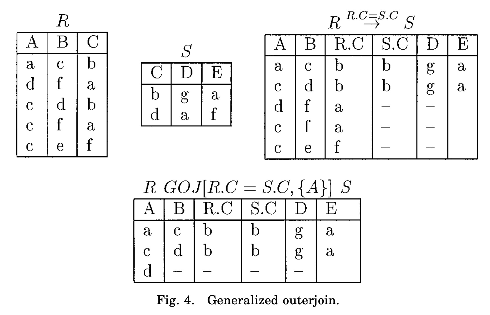

## AI论文解读 | Outerjoin Simplication And Reordering For Query Optimization
        
### 作者        
digoal        
        
### 日期        
2025-10-07        
        
### 标签        
PostgreSQL , PolarDB , DuckDB , AI , 论文解读        
        
----        
        
## 背景  
      
https://dl.acm.org/doi/pdf/10.1145/244810.244812        
  
提示:          
```          
读懂《Outerjoin Simplication And Reordering For Query Optimization》这篇论文需要提前掌握哪些基础知识, 请使用中文通熟易懂的讲解这些基础知识, 可以引用论文中的图、表或使用Markdown支持的图形(text,mermaid等)增加解释性. 
  
使用中文通熟易懂的解读《Outerjoin Simplication And Reordering For Query Optimization》这篇论文, 其中的关键内容请着重讲解, 可以引用论文中的图、表或使用Markdown支持的图形(text,mermaid等)增加解释性. 
  
提取《Outerjoin Simplication And Reordering For Query Optimization》这篇论文中的重要术语, 使用中文对这些术语进行通熟易懂的讲解, 可以引用论文中的图、表或使用Markdown支持的图形(text,mermaid等)增加解释性. 
```     
  
## 1 前置知识 
  
好的，为了能让您顺利读懂《Outerjoin Simplification and Reordering for Query Optimization》这篇经典的数据库查询优化论文，我将为您梳理并通俗地讲解所需的基础知识。这些知识点层层递进，从最基础的概念到查询优化的核心思想。

### 核心脉络

理解这篇论文的关键在于明白一个核心矛盾：

  * **普通内连接（Join）** 非常灵活，因为它满足**结合律**和**交换律**，优化器可以随意调换计算顺序来找到最高效的执行路径 。
  * **外连接（Outer Join）** 保留了更多信息，这在很多业务场景下至关重要 ，但它却**不完全满足**结合律和交换律 ，这极大地限制了优化器的发挥空间，导致查询性能可能很差 。

这篇论文的贡献就在于，它提出了一套完整的理论和算法，告诉我们**在什么条件下、以及如何**可以安全地对外连接进行“重新排序”和“简化”，从而让优化器有更大的自由度去寻找最优执行计划 。

-----

### 1\. 关系数据库与SQL基础

这是最基本的要求，您需要了解：

  * **关系模型**: 数据库是由一系列的 **表（Relation）组成的。每个表包含若干行（Tuple，元组）和列（Attribute，属性）** 。
  * **SQL语言**: 了解如何使用SQL（Structured Query Language）进行数据查询，特别是`SELECT`, `FROM`, `WHERE`子句。
  * **连接（JOIN）** : 知道`INNER JOIN`（内连接）和`LEFT/RIGHT/FULL OUTER JOIN`（左/右/全外连接）在SQL语法和基本功能上的区别。

> **论文中的例子**: 论文在开篇就用了一个非常实际的SQL查询来解释为什么需要外连接 。
>
> ```sql
> -- 查找所有纽约市的客户及其订单
> Select All
> From CUSTOMERS Left Outerjoin ORDERS
>      on CUSTOMERS.cust# = ORDERS.cust#
> Where CUSTOMERS.city = "New York"
> ```
>
> 这里使用`Left Outerjoin`是为了**保留那些住在纽约但没有任何订单的客户信息** 。如果用`INNER JOIN`，这些客户就会被过滤掉。

### 2\. 关系代数 (Relational Algebra)

关系代数是数据库查询的理论基础，论文中的所有变换和证明都建立在它之上。您需要重点理解以下几种算子（Operator）：

  * **选择 ( Selection, $\sigma$ )**: 相当于SQL中的`WHERE`子句，用于筛选满足条件的行。例如 $\sigma_{city="New York"}(CUSTOMERS)$ 。
  * **投影 ( Projection, $\pi$ )**: 相当于SQL中的`SELECT`子句指定列，用于选择需要的列 。
  * **内连接 ( Join, $\bowtie$ )**: 将两个表中满足连接条件的行组合起来 。不满足条件的行会被丢弃 。
  * **外连接 ( Outer Join, $\rightarrow$ , $\leftarrow$ , $\leftrightarrow$ )**: 这是本文的核心。它在内连接的基础上，会保留一个或两个表中**未能匹配**的行，并在另一张表对应的列中填充`NULL`值 。
      * **左外连接 ( Left Outerjoin, $\rightarrow$ )**: 保留左边表的所有行 。
      * **右外连接 ( Right Outerjoin, $\leftarrow$ )**: 保留右边表的所有行 。
      * **全外连接 ( Full Outerjoin, $\leftrightarrow$ )**: 保留两边表的所有行 。

为了更直观地理解，我们可以参考论文中的**图1** 。假设我们有表 R 和表 S：    

**表 R**

| A | B | C |
|---|---|---|
| a | c | b |
| d | f | a |
| c | d | b |

**表 S**

| C | D | E |
|---|---|---|
| b | g | a |
| d | a | f |

1.  **内连接 (R $\bowtie_{R.C=S.C}$ S)**: 只有`C`列能匹配上的行才会被保留。
    | A | B | R.C | S.C | D | E |
    |---|---|---|---|---|---|
    | a | c | b | b | g | a |
    | c | d | b | b | g | a |

2.  **左外连接 (R $\rightarrow_{R.C=S.C}$ S)**: 保留R表的所有行。R表中`C='a'`的行在S表中找不到匹配，所以S表的列填充为NULL (用 `-` 表示) 。
    | A | B | R.C | S.C | D | E |
    |---|---|---|---|---|---|
    | a | c | b | b | g | a |
    | c | d | b | b | g | a |
    | d | f | a | - | - | - |

3.  **全外连接 (R $\leftrightarrow_{R.C=S.C}$ S)**: 同时保留R和S中所有未匹配的行。除了R中未匹配的行，S表中`C='d'`的行在R表中也找不到匹配。
    | A | B | R.C | S.C | D | E |
    |---|---|---|---|---|---|
    | a | c | b | b | g | a |
    | c | d | b | b | g | a |
    | d | f | a | - | - | - |
    | - | - | - | d | a | f |

### 3\. NULL值与三值逻辑

`NULL`是理解外连接行为的关键。

  * **什么是NULL**: `NULL`不等于0，也不等于空字符串。它代表“未知”或“不适用”。
  * **三值逻辑 (Three-Valued Logic)**: 在SQL中，当有`NULL`参与逻辑判断时，结果可能是`TRUE`、`FALSE`或`UNDEFINED`（未定义） 。例如，`NULL = NULL` 的结果是`UNDEFINED`。
  * **NULL拒绝 (Null-Rejection)**: 这是论文中的一个**极其重要**的概念。如果一个查询条件（谓词`p`）在遇到`NULL`值时，其结果永远是`FALSE`或`UNDEFINED`，那么我们就说这个条件**拒绝NULL** (`rejects nulls`) 。
    > 例如，`ORDERS.priority = "low"`这个条件就拒绝`priority`列上的NULL值，因为如果`priority`是NULL，`NULL = "low"`的结果是`UNDEFINED`，该行会被`WHERE`子句过滤掉 。而 `IsNull(ORDERS.duedate)` 这个条件则**不拒绝**NULL 。

这个特性是论文中**简化外连接**的理论基础：如果一个外连接产生了一些带`NULL`的行，但后续的操作（如另一个连接或`WHERE`子句）因为其“拒绝NULL”的特性，又把这些带`NULL`的行全部过滤掉了，那么最初的那个外连接其实就等价于一个更高效的内连接 。

### 4\. 查询优化基础

您需要了解数据库的查询优化器（Query Optimizer）是如何工作的。

  * **查询优化的目标**: 找到一个与原始SQL查询等价，但执行成本（如CPU、I/O）最低的 **执行计划（Execution Plan）** 。

  * **执行计划/算子树 (Operator Tree)**: 一个SQL查询可以被解析成一个由关系代数算子组成的树状结构，它明确了运算的顺序 。

      * 例如，查询 `(A Join B) Join C` 可以表示为：
        ```mermaid
        graph TD
            Join_2[<B>⋈</B>] --> Join_1[<B>⋈</B>]
            Join_2 --> C
            Join_1 --> A
            Join_1 --> B
        ```

  * **算子的代数性质**:

      * **交换律 (Commutativity)**: `A ⋈ B` = `B ⋈ A`
      * **结合律 (Associativity)**: `(A ⋈ B) ⋈ C` = `A ⋈ (B ⋈ C)`
      * 这些性质让优化器可以自由地重新排列内连接的顺序，比如先计算成本较低的 `B ⋈ C`。但外连接在很大程度上不具备这些性质 ，这就是优化的难点所在。

  * **查询图 (Query Graph)**: 这是另一种表示查询的方式，它只关心表和它们之间的连接关系，而不规定执行顺序 。

      * **节点 (Node)**: 代表表。
      * **边 (Edge)**: 代表连接条件。
          * 内连接：无向边 `---` 。
          * 左/右外连接：有向边 `-->`，箭头指向需要被填充NULL的表 。
          * 全外连接：双向边 `<-->` 。

    论文中的**图5**清晰地展示了算子树和查询图的关系 。    

    **(a) 算子树 (Operator Tree)**

    ```mermaid
    graph TD
        A -- pAB --> B_C
        subgraph B_C
            B_F -- pBC --> C_D
            subgraph B_F
                B_E -- pBF --> F
                subgraph B_E
                    B -- pBE --> E
                end
            end
            subgraph C_D
                C -- pCD --> D
            end
        end
    ```

    **(b) 查询图 (Query Graph)**

    ```mermaid
    graph TD
        A --> B
        E --- B
        F --- B
        B --> C
        C --- D
    ```

  * **基于成本的优化 (Cost-Based Optimization)** 和 **System R 风格的优化器**: 了解优化器会估算不同执行计划的成本，并使用动态规划等算法（如论文中提到的自底向上构建执行树 ）来寻找成本最低的计划。

-----

### 总结

掌握了以上知识后，您就可以带着清晰的脉络来阅读这篇论文了。您会发现论文的结构非常清晰：

1.  **第2节**: 介绍具体的“战术”。
      * **2.1节**: 如何利用“NULL拒绝”的特性，将某些外连接**简化**成内连接 。
      * **2.2节**: 在满足“NULL拒绝”等特定条件下，外连接之间或外连接与内连接之间的**结合律**是什么样的 。
      * **2.3节**: 提出一个新算子——**广义外连接 (Generalized Outerjoin, GOJ)** ，作为一种“粘合剂”，使得在某些原本无法重排的情况下也能进行重排。
2.  **第3、4节**: 将这些“战术”系统化，形成一套完整的算法。
      * 如何用扩展的**查询图**来分析一个复杂的含外连接的查询 。
      * 如何设计一个**自底向上**的算法，在构建执行计划的每一步，都能根据查询图的分析结果，正确地选择使用 Join、Outerjoin 还是 GOJ 。

希望这份导读能帮助您更好地理解这篇论文的核心思想和技术贡献。
  
## 2 解读论文 
  
好的，这篇由César Galindo-Legaria和Arnon Rosenthal撰写的《Outerjoin Simplification and Reordering for Query Optimization》是数据库查询优化领域的一篇经典论文。它系统性地解决了如何优化包含外连接（Outerjoin）的查询这一难题。

下面我将用通俗易懂的方式为您解读其核心思想和关键内容。

### **核心问题：为什么外连接（Outerjoin）优化这么难？**

在数据库中，我们最常用的是内连接（Inner Join）。内连接有一个非常好的数学性质：**满足交换律和结合律** 。

  * **交换律**：`A JOIN B` 等价于 `B JOIN A`。
  * **结合律**：`(A JOIN B) JOIN C` 等价于 `A JOIN (B JOIN C)`。

这两个定律是查询优化的基石，它意味着优化器可以像玩积木一样，自由地调换表连接的顺序，从而找到成本最低（例如，中间结果集最小）的执行路径。

然而，外连接（`LEFT`、`RIGHT`、`FULL OUTERJOIN`）的出现打破了这一美好的局面。外连接的主要作用是，即使在另一个表中找不到匹配的元组，也要保留某一方的元组信息，并在不匹配的列上填充`NULL` 。这种“保留”操作使得外连接不再完全满足交换律和结合律，随意调换顺序会导致查询结果不一致 。

**论文要解决的核心问题就是**：我们能否建立一套新的理论和规则，让优化器在保证结果正确的前提下，也能对外连接进行重新排序和简化，从而获得巨大的性能提升？ 

-----

### **论文三大核心贡献**

这篇论文主要从三个方面给出了解决方案：

1.  **外连接简化 (Outerjoin Simplification)**：在特定条件下，将“昂贵”且“不灵活”的外连接降级为“廉价”且“灵活”的内连接。
2.  **新的结合律 (Associative Identities)**：提出了一套新的、更严格的结合律，明确了在何种条件下可以安全地重排外连接。
3.  **广义外连接 (Generalized Outerjoin, GOJ)**：创造了一种新的连接算子，作为“粘合剂”，使得某些原本无法重排的顺序成为可能。

下面我们来逐一解析。

#### **1. 核心贡献一：外连接简化**

这是最直接也最有效的优化手段。其核心思想是：**如果一个外连接产生的`NULL`填充行，在后续的计算中注定会被过滤掉，那么这个外连接其实没有必要保留不匹配的行，可以直接简化为内连接** 。

什么情况下`NULL`行会被过滤掉呢？最常见的就是后续的`WHERE`条件或`JOIN`条件**拒绝NULL (null-rejecting)** 。

> **什么是“拒绝NULL”？**
> 一个条件（谓词），如果当它作用于包含`NULL`值的列时，其结果永远是`FALSE`或`UNDEFINED`（在SQL中，`WHERE`子句会过滤掉这两种情况的行），那么这个条件就“拒绝NULL” 。例如，`ORDERS.date < '1/1/95'`就是一个拒绝NULL的条件，因为如果`ORDERS.date`是`NULL`，这个比较的结果是`UNDEFINED`，该行会被抛弃。

**简化的例子**:
考虑以下查询：
`σ (CUSTOMERS  OJ ORDERS)`，其中 `σ` 代表一个`WHERE`条件 `ORDERS.date < '1/1/95'`，`OJ` 代表左外连接。

  * `CUSTOMERS OJ ORDERS` 会产生一些`ORDERS`列全为`NULL`的行（对于那些没有订单的客户）。
  * 但接下来的 `WHERE` 条件 `ORDERS.date < '1/1/95'` 会作用于这些行。由于 `date` 列是`NULL`，该条件不成立，这些行会被全部过滤掉。
  * 既然这些`NULL`行最终都被丢弃了，那么我们一开始就没有必要生成它们。因此，原始查询等价于：
    `σ (CUSTOMERS JOIN ORDERS)` 。

论文提出了**算法A (Algorithm A)**，一个自顶向下遍历查询计划树的算法，来系统性地进行这种简化 。   

**图解简化的过程**:
参考论文中的图2，假设有一个复杂的查询树。    

**(a) 原始查询**


  * 最顶层的算子 `(pAB) →` 作用在 B 的属性上，它会拒绝 `sch(B)` 上的 `NULL` 值 。
  * 这个拒绝 `NULL` 的效果会向下传播。中间的 `(pBE) ←` 算子原本会在 B 不匹配时，为 B 的属性填充 `NULL`。但由于上层不接受这些 `NULL`，这个 `←` (右外连接) 就可以被简化为 `⋈` (内连接) 。
  * 同理，`(pBC) ↔` (全外连接) 中指向 C 的箭头 `←` 也会因为上层算子的拒绝 `NULL` 特性而被移除 。

**(b) 简化后的查询**



通过简化，查询树中的多个外连接变成了内连接，为后续的重排序提供了巨大的空间。

-----

#### **2. 核心贡献二：新的结合律**

在简化之后，我们仍然需要处理无法被简化的外连接。论文提供了一系列新的代数恒等式，来指导如何重排。这些恒等式通常带有严格的前提条件，很多都和我们前面提到的“拒绝NULL”有关。

举一个典型的例子，恒等式(7)指出 ：
$$(R_1 \rightarrow^{p12} R_2) \rightarrow^{p23} R_3 = R_1 \rightarrow^{p12} (R_2 \rightarrow^{p23} R_3)$$
这个结合律成立的**前提条件是：`p23` 必须拒绝 `sch(R2)` 上的 `NULL` 值** 。

为什么需要这个条件？

  * 在左边的表达式 `(R1 → R2)` 中，如果 `R1` 的某一行在 `R2` 中没有匹配，会生成一行 `R2` 属性全为 `NULL` 的结果。
  * 当这个结果再与 `R3` 进行 `→` 连接时，如果 `p23` 不拒绝 `NULL`，那么这个之前生成的 `NULL` 行可能会意外地与 `R3` 中的某些行匹配成功，导致错误的结果。
  * 而如果 `p23` 拒绝 `NULL`，它就能确保这些 `NULL` 行不会与 `R3` 发生任何匹配，从而保证了左右两边表达式的等价性。

论文中列出了一整套这样的恒等式 (恒等式5到10) ，它们共同构成了外连接重排序的理论基础。

-----

#### **3. 核心贡献三：广义外连接 (Generalized Outerjoin - GOJ)**

有时候，即使利用了上述所有规则，我们仍然无法将查询重排成我们想要的顺序。论文中的 **Example 2** 就是一个经典的例子 。

查询：`CUSTOMERS_NY → (ORDERS ⋈ ITEMS)`

  * 这个查询想找到纽约客户以及他们购买的**有库存**的商品订单。
  * 直接计算会先做一个巨大的 `ORDERS ⋈ ITEMS`，然后再和很小的 `CUSTOMERS_NY` 做外连接，性能很差 。
  * 我们最希望的计算顺序是先计算 `CUSTOMERS_NY → ORDERS`，得到一个很小的中间结果，然后再和 `ITEMS` 结合。

但是，这个重排后的第二步应该用什么算子呢？

  * 不能用 `⋈` (内连接)：这会把那些没有订单的纽约客户过滤掉，而我们原本是希望保留他们的 。
  * 不能用 `→` (左外连接)：这会保留那些订购了**无库存**商品的订单，而原始查询要求商品必须有库存 。

为了解决这个“进退两难”的困境，论文定义了一个新的算子：**广义外连接 (GOJ)** 。

`R1 GOJ[p, A] R2` 的通俗解释是：

1.  首先，计算 `R1` 和 `R2` 的内连接 `R1 ⋈ R2`。
2.  然后，找到在 `R1` 中那些**未能参与**上述内连接的行。
3.  对于这些未参与的行，我们并不保留完整的行信息，而是只保留其在**属性集 A** 上的投影 `π_A(R1)`。
4.  最终结果是 1 和 3 的并集。

**GOJ 的作用就像一个“打了补丁”的外连接**。它在保留指定信息（属性集A）的同时，又不会像标准外连接那样保留过多无关信息。

回到刚才的例子，利用恒等式(11)，原始查询可以被重写为 ：
`(CUSTOMERS_NY → ORDERS) GOJ[p, sch(CUSTOMERS_NY)] ITEMS`

这个表达式的含义是：

1.  先计算 `(CUSTOMERS_NY → ORDERS)` 和 `ITEMS` 的内连接（得到纽约客户购买的有库存商品的订单）。
2.  然后，对于那些在第一步中没有匹配上的客户（比如没有订单的，或者订单商品无库存的），我们只保留他们的客户信息 `sch(CUSTOMERS_NY)`。
    这完美地实现了我们想要的优化效果 。

-----

### **如何将理论应用于实际优化器？**

论文的第4和第5部分探讨了如何将上述理论整合到现有的查询优化器框架中，特别是 System R 风格的 **自底向上枚举（bottom-up enumeration）** 优化器 。

其核心思想是，在优化器动态规划、构建查询计划的过程中，每当需要连接两个子计划（例如，`Tl` 和 `Tr`）时，我们不再是简单地默认使用内连接，而是需要一个决策逻辑来选择正确的连接算子。

论文在 **Figure 8** 中给出了这个关键的决策逻辑 。这个逻辑非常复杂，但其精髓可以概括为：    

1.  分析原始查询的**查询图 (Query Graph)** 。
2.  识别出图中边的“**冲突关系 (conflicting edges)**” 。所谓冲突，通俗讲就是一个限制性强的算子（如内连接）如果想排到一个限制性弱的算子（如外连接）前面，就可能产生冲突。
3.  在自底向上构建计划树时，每一步合并两个子树，就检查将要使用的连接边是否与子树中**已经使用过**的边存在冲突。
4.  **如果不存在冲突**，则使用原始的算子（Join 或 Outerjoin）。
5.  **如果存在冲突**，说明我们正在进行一个“非自然”的重排序，此时就必须使用`GOJ`算子，并根据冲突边的信息来确定`GOJ`需要保留的属性集 。

通过这种方式，优化器就能在广阔的搜索空间中，为每一种可能的连接顺序动态地选择正确的算子，从而生成正确且高效的执行计划。

### **总结**

《Outerjoin Simplification and Reordering for Query Optimization》这篇论文的伟大之处在于，它没有回避外连接带来的复杂性，而是直面问题，并提供了一套从理论到实践的完整解决方案：

  * **简化 (Simplification)** 是“上策”，能把复杂问题变简单。
  * **新的结合律 (Identities)** 是“中策”，为在复杂问题中寻找出路提供了规则。
  * **广义外连接 (GOJ)** 是“下策”，是在无路可走时开辟新道路的强大工具。

通过这套组合拳，论文极大地扩展了数据库查询优化器处理外连接的能力，使得原本性能可能极差的复杂查询也能被高效执行。这些思想至今仍是现代数据库系统查询优化器的核心组成部分。
  
## 3 术语 
  
好的，这篇论文引入了多个关键术语来构建其理论体系。下面我将提取其中最重要的术语，并用通俗易懂的方式进行讲解，同时引用论文中的图表和思想进行辅助说明。

-----

### 1\. 外连接 (Outerjoin)

  * **讲解**: 外连接是SQL中的一种连接操作，它不仅返回两个表中满足连接条件的匹配行（这部分和内连接`INNER JOIN`一样），还会保留其中一个或两个表中**未能找到匹配**的行 。对于这些未匹配的行，另一张表对应的列会用`NULL`值来填充 。

  * **类型**:

      * **左外连接 ( Left Outerjoin, $\rightarrow$ )**: 保留左表的所有行 。
      * **右外连接 ( Right Outerjoin, $\leftarrow$ )**: 保留右表的所有行 。
      * **全外连接 ( Full Outerjoin, $\leftrightarrow$ )**: 保留左右两表的所有行 。

  * **图解 (基于论文图1)**:    
    假设有表 R 和表 S，连接条件为 `R.C = S.C`。

    **表 R**

    | A | B | C |
    |---|---|---|
    | a | c | b |
    | d | f | a |
    | c | d | b |

    **表 S**

    | C | D | E |
    |---|---|---|
    | b | g | a |
    | d | a | f |

    **左外连接 (R $\rightarrow$ S) 的结果**:
    R表中`C='a'`的行在S表中找不到匹配，但仍然被保留，S表的列填充为NULL（图中用`-`表示）。

    | A | B | R.C | S.C | D | E |
    |---|---|---|---|---|---|
    | a | c | b | b | g | a |
    | c | d | b | b | g | a |
    | d | f | a | - | - | - |

### 2\. NULL拒绝 (Null-Rejection)

  * **讲解**: 这是一个在论文中**至关重要**的概念。如果一个条件（在论文中称为谓词 `predicate`），当它作用于包含`NULL`值的属性时，其判断结果永远是`FALSE`或`UNDEFINED`，那么我们就说这个条件**拒绝NULL (rejects nulls)** 。在SQL的`WHERE`子句中，`UNDEFINED`的判断结果也会导致行被过滤掉 。

  * **例子**:

      * **拒绝NULL的条件**: `ORDERS.priority = "low"`。如果`priority`列的值是`NULL`，`NULL = "low"` 的结果是`UNDEFINED`，该行会被拒绝 。
      * **不拒绝NULL的条件**: `IsNull(ORDERS.duedate)` 。这个条件专门用来判断是否为`NULL`，显然它不会拒绝`NULL`值。

  * **意义**: "NULL拒绝"是实现**外连接简化**的理论基石 。如果一个外连接产生的带`NULL`的行，会被后续的某个"拒绝NULL"的操作（如另一个连接或`WHERE`子句）全部过滤掉，那么这个外连接就可以被安全地简化为内连接 。

### 3\. 算子树 (Operator Tree)

  * **讲解**: 算子树是查询的一种精确、无歧义的图形化表示 。树的叶子节点是数据表，非叶子节点是关系代数算子（如Join, Outerjoin, Selection等），整棵树明确地定义了计算的顺序 。

  * **图解 (基于论文图5(a))**:    
    这棵树清晰地展示了查询的执行流程：先执行 `B ⋈ E`，其结果再和 F 进行 `⋈`，再往上进行 `→` 和 `↔` 连接，每一步都非常明确。

    ```mermaid
    graph TD
        subgraph root["(pAB) →"]
            A
            subgraph child1["(pBC) →"]
                subgraph child2["(pBF) ⋈"]
                    subgraph child3["(pBE) ⋈"]
                        B
                        E
                    end
                    F
                end
                subgraph child4["(pCD) ⋈"]
                    C
                    D
                end
            end
        end
    ```

### 4\. 查询图 (Query Graph)

  * **讲解**: 查询图是查询的另一种抽象表示，它只关心**哪些表之间存在连接关系**，而不规定具体的执行顺序 。在查询图中，节点代表表，边代表连接条件 。

  * **边的类型**:

      * **内连接**: 无向边 。
      * **单边外连接 (如 Left Outerjoin)**: 有向边，箭头指向其属性可能被填充为`NULL`的表 。
      * **全外连接 (Full Outerjoin)**: 双向边 。

  * **与算子树的区别**: 算子树是“执行计划”，是唯一的、明确的；而查询图是“关系蓝图”，对于包含外连接的查询来说，同一个查询图可以对应多个不等价的算子树（即不同的执行顺序会产生不同的结果）。

  * **图解 (基于论文图5(b))**:    
    下图只表示A和B、B和E、B和F等表之间有连接，但并未说明谁先谁后。

    ```mermaid
    graph TD
        A -- A→B --> B
        E --- B
        F --- B
        B -- B→C --> C
        C --- D
    ```

### 5\. 广义外连接 (Generalized Outerjoin, GOJ)

  * **讲解**: 这是论文作者为了实现更灵活的查询重排而**定义的一种新算子** 。当标准的Join和Outerjoin都无法在重排后表达正确的查询语义时，GOJ就派上了用场 。

  * **通俗理解**: GOJ的行为可以看作是“内连接”和“保留部分信息的投影”的结合体。它首先执行一个内连接，然后对于那些在内连接中被“淘汰”的行，它不像标准外连接那样保留所有列（并填充NULL），而是只保留 **指定属性集(Attribute Set)** 上的值 。

  * **例子 (基于论文图4)**:    
    `R GOJ[R.C = S.C, {A}] S` 这个表达式的含义是：

    1.  先计算 `R ⋈ S`。
    2.  找到R表中那些没能和S表成功连接的行（比如 `(d, f, a)` 这一行）。
    3.  对于这些行，我们只保留指定的属性 `{A}` 的值，即 `d`。
    4.  最终结果是1和3的并集。

    | A | B | R.C | S.C | D | E |
    |---|---|---|---|---|---|
    | a | c | b | b | g | a |
    | c | d | b | b | g | a |
    | d | - | - | - | - | - |

    这个新算子让优化器能够处理像论文开篇 `Example 2` 那样的复杂重排场景 。

### 6\. 冲突路径/冲突边 (Conflict Path / Conflicting Edges)

  * **讲解**: 这是论文后期为了构建自底向上重排算法而提出的分析概念。它用来判断在查询图中，一个连接操作（边）是否会“阻碍”另一个连接操作的提前执行。
  * **基本思想**: 如果一个限制性强的操作（如内连接， representado por uma aresta `eM`）想要在执行顺序上“越过”一个限制性弱的操作（如外连接， representado por uma aresta `eL`），就可能产生**冲突**。论文定义了精确的数学规则来识别这种冲突关系 。
  * **意义**: 在自底向上的优化算法中，每当要合并两个子查询时，优化器会检查即将使用的连接边 `eM` 是否与子查询中已经执行过的边 `eL` 构成冲突 。
      * **如果不冲突**：可以使用标准的 Join 或 Outerjoin。
      * **如果冲突**：则必须使用 `GOJ` 来作为“粘合剂”，以保证重排后的语义正确性 。

这个概念是论文提出的 **自动化重排算法（图8的逻辑）** 的核心。     
  
## 参考        
         
https://dl.acm.org/doi/pdf/10.1145/244810.244812    
        
<b> 以上内容基于DeepSeek、Qwen、Gemini及诸多AI生成, 轻微人工调整, 感谢杭州深度求索人工智能、阿里云、Google等公司. </b>        
        
<b> AI 生成的内容请自行辨别正确性, 当然也多了些许踩坑的乐趣, 毕竟冒险是每个男人的天性.  </b>        
  
    
#### [期望 PostgreSQL|开源PolarDB 增加什么功能?](https://github.com/digoal/blog/issues/76 "269ac3d1c492e938c0191101c7238216")
  
  
#### [PolarDB 开源数据库](https://openpolardb.com/home "57258f76c37864c6e6d23383d05714ea")
  
  
#### [PolarDB 学习图谱](https://www.aliyun.com/database/openpolardb/activity "8642f60e04ed0c814bf9cb9677976bd4")
  
  
#### [PostgreSQL 解决方案集合](../201706/20170601_02.md "40cff096e9ed7122c512b35d8561d9c8")
  
  
#### [德哥 / digoal's Github - 公益是一辈子的事.](https://github.com/digoal/blog/blob/master/README.md "22709685feb7cab07d30f30387f0a9ae")
  
  
#### [About 德哥](https://github.com/digoal/blog/blob/master/me/readme.md "a37735981e7704886ffd590565582dd0")
  
  

  
