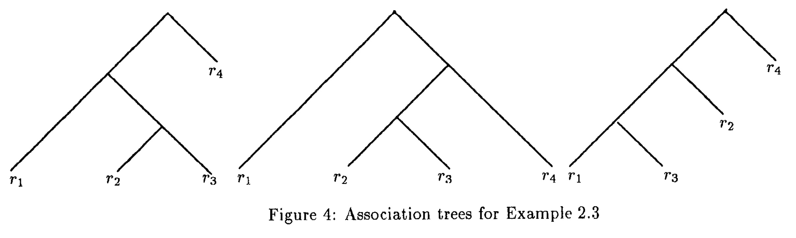

## AI论文解读 | Hypergraph Based Reorderings Of Outer Join Queries With Complex Predicates
        
### 作者        
digoal        
        
### 日期        
2025-10-07        
        
### 标签        
PostgreSQL , PolarDB , DuckDB , AI , 论文解读        
        
----        
        
## 背景  
      
https://dl.acm.org/doi/pdf/10.1145/223784.223847        
  
提示:          
```          
读懂《Hypergraph Based Reorderings Of Outer Join Queries With Complex Predicates》这篇论文需要提前掌握哪些基础知识, 请使用中文通熟易懂的讲解这些基础知识, 可以引用论文中的图、表或使用Markdown支持的图形(text,mermaid等)增加解释性. 
  
使用中文通熟易懂的解读《Hypergraph Based Reorderings Of Outer Join Queries With Complex Predicates》这篇论文, 其中的关键内容请着重讲解, 可以引用论文中的图、表或使用Markdown支持的图形(text,mermaid等)增加解释性. 
  
提取《Hypergraph Based Reorderings Of Outer Join Queries With Complex Predicates》这篇论文中的重要术语, 使用中文对这些术语进行通熟易懂的讲解, 可以引用论文中的图、表或使用Markdown支持的图形(text,mermaid等)增加解释性. 
```     
  
## 1 前置知识 
  
好的，为了读懂《基于超图的复杂谓词外连接查询重排序》这篇论文，我们需要先掌握一些数据库和图论的基础知识。这篇论文主要解决的是如何优化一类特殊的、复杂的数据库查询语句，让数据库能够更快地返回结果。

下面我将用通俗易懂的中文，结合论文中的图示，为您讲解所需的基础知识。

### 1\. 关系数据库与SQL基础

想象一下，一个关系数据库就像一堆精心组织的Excel表格。

  * **关系 (Relation)**：就是一张二维表，比如学生信息表、课程表 。
  * **元组 (Tuple)**：就是表中的一行数据 ，比如某个学生的具体信息。
  * **属性 (Attribute)**：就是表中的一列 ，比如“姓名”、“学号”等。
  * **SQL (Structured Query Language)**：是我们用来操作这些表格的语言。通过SQL，我们可以进行查询（`SELECT`）、插入、更新和删除数据。这篇论文的核心就是关于如何优化`SELECT`查询的。

### 2\. 核心操作：连接 (Join) 与外连接 (Outer Join)

当我们需要的信息分散在多张表中时，就需要将它们“连接”起来。

#### a. 内连接 (Inner Join)

内连接是最常见的连接方式，它只返回两张表中能相互匹配的行。

**例子**：假设有“学生表”和“成绩表”。我们想查找所有有成绩的学生的姓名及其对应的分数。通过学号将两张表进行内连接，只有那些在成绩表里有记录的学生才会被显示出来。如果某个学生没参加考试，他就不会出现在结果中。

论文中用符号 $\Join$ 或 $\ltimes$ 表示内连接 。

#### b. 外连接 (Outer Join)

有时候，即使一张表中没有匹配的行，我们也希望保留另一张表的信息。这时就需要外连接。外连接是这篇论文的**核心研究对象** 。

  * **左外连接 (Left Outer Join)**：以左边的表为基础，返回所有左表的行。如果在右表中找不到匹配项，则右表对应的列会用空值（NULL）填充 。
      * **例子**：用左外连接查询学生和成绩，即使某个学生没有成绩，他的名字依然会出现在结果里，只是分数那一栏显示为空。
      * 论文中用 $\rightarrow$ 符号表示 。
  * **右外连接 (Right Outer Join)**：与左外连接相反，以右边的表为基础 。
  * **全外连接 (Full Outer Join)**：结合了左外连接和右外连接，无论哪张表中的行没有匹配项，都会被包含在结果中，不匹配的部分用NULL填充 。

### 3\. 查询优化与查询计划 (Query Optimization & Execution Plan)

同一句SQL查询，数据库可以有多种执行方式，这些方式的效率可能天差地别 。

  * **查询计划 (Execution Plan)**：数据库在执行一条查询前，会先生成一个详细的执行步骤，这个步骤就叫做查询计划。它决定了先访问哪张表、使用哪种连接方式、连接的先后顺序等。
  * **查询优化器 (Query Optimizer)**：数据库中一个非常智能的组件，它的工作就是为一条SQL查询找出成本最低（通常意味着执行时间最短）的查询计划 。
  * **查询重排序 (Query Reordering)**：优化器最核心的技术之一。对于多个表的连接操作，不同的连接顺序会产生巨大的性能差异。例如，查询 `A Join B Join C`，既可以先算 `(A Join B)` 再与 `C` 连接，也可以先算 `(B Join C)` 再与 `A` 连接。优化器会评估不同顺序的成本，选择最优的那个。

**为什么外连接的优化更难？**
内连接满足交换律和结合律（比如 `(A Join B) Join C` 等价于 `A Join (B Join C)`），所以优化器可以自由地重排它们的顺序 。但是，外连接通常不满足这些定律 ，`A Left Join B` 的结果和 `B Left Join A` 完全不同。因此，优化器的重排空间非常有限，导致性能难以提升。这正是这篇论文想要解决的痛点 。

### 4\. 查询的图形化表示：从查询树到超图

为了方便分析查询结构，研究人员通常会把查询语句转换成图形结构。

#### a. 表达式树 (Expression Tree)

这是最直观的表示方式，它清晰地展示了查询的运算顺序。叶子节点是表，内部节点是操作（如Join）。

例如，论文图2左侧的树就表示了一个复杂的查询：    


这个树状结构明确地表达了数据库需要“自底向上”地执行这些操作。

#### b. 查询图 (Query Graph)

查询图是一种简化的表示，节点代表表，边代表表之间的连接谓词（连接条件）。这种图在表示简单的内连接查询时很有效。

#### c. 超图 (Hypergraph)

当查询变得复杂，特别是当一个连接条件（谓词）涉及到两个以上的表时，传统的查询图就力不从心了。这篇论文引入了**超图**来解决这个问题 。

  * **什么是超图？** 在普通图中，一条边只能连接两个节点。而在超图中，一条“超边”可以连接任意多个节点 。
  * **为什么要用超图？** 论文中提到，有些外连接的谓词可能很复杂，比如 `(R1 Join R2) Left Join R3 on R1.a = R3.a AND R2.b = R3.b`。这里的连接条件同时关联了R1, R2, R3。用超图就能很自然地表示这种多方关系。

**看论文中的图2右侧：**    

  * 节点 `r1` 到 `r7` 代表7张表。
  * `h2`, `h3`, `h4`, `h6` 都是普通的边，代表只涉及两个表的简单连接。
  * **关键看 `h1` 和 `h5`**：
      * `h1` 连接了 `{r1, r2}` 和 `{r3}` 这两个“超节点” 。它代表了一个外连接操作，其连接条件关联了 `r1`、`r2` 和 `r3`。这在传统图中是无法直接表示的。
      * 同理，`h5` 连接了 `{r4, r5}` 和 `{r6}` 。

通过使用超图，论文为复杂的外连接查询提供了一个更精确、更强大的数学模型，从而可以在这个模型的基础上，探索更多可能的、合法的查询重排方案 。

### 总结

在阅读这篇论文之前，您需要掌握的核心基础知识点如下：

| 核心概念 | 通俗解释 | 在论文中的重要性 |
| :--- | :--- | :--- |
| **关系代数** | 对数据库表（关系）进行操作的数学理论，如连接、选择、投影。 | 论文中所有操作和等价变换的理论基础。 |
| **内连接 vs. 外连接** | 内连接只返回匹配的行；外连接会保留不匹配的行。 | 论文的核心研究对象是**外连接**的优化，这是难点所在 。 |
| **查询优化与重排序** | 寻找执行SQL最快的方法，核心是改变操作的顺序。 | 论文的目标就是为复杂外连接提供更多的**重排序**可能性 。 |
| **复杂谓词** | 连接条件涉及两个以上的表。 | 这是传统优化方法失效，并促使作者引入新方法的关键原因 。 |
| **查询图 vs. 超图** | 查询图用“边”连接两个表；超图用“超边”连接多个表。 | 论文的核心创新之一，使用**超图**来为复杂谓词建模，从而找到新的优化路径 。 |

理解了以上概念后，您就能更好地跟上论文的思路：作者是如何利用超图这个工具，为原本“几乎不可重排”的复杂外连接查询，找到新的、等价的、且可能更高效的执行计划的。
  
## 2 解读论文 
  
好的，這就為您解讀這篇經典的數據庫查詢優化論文《Hypergraph Based Reorderings Of Outer Join Queries With Complex Predicates》。

### 論文核心思想概覽

這篇論文主要解決了數據庫在處理**包含複雜謂詞（predicate）的`OUTER JOIN`（外連接）查詢**時，難以進行有效重排序（reordering）的問題。在當時，大多數商業數據庫系統（DBMS）對於這類複雜查詢，基本上是按照使用者寫的順序（"as written" manner）來執行的，從而錯失了通過重排連接順序來大幅提升查詢性能的機會 。

論文的核心貢獻可以歸納為以下幾點：

1.  **引入超圖（Hypergraph）模型**：拋棄了無法有效表示複雜外連接謂詞的傳統查詢圖（query graph），創新地使用超圖來為查詢建立模型 。
2.  **提出 MGOJ 運算元**：為了解決真實世界數據庫中普遍存在的 **重複元組（duplicates）** 問題，論文定義了一種新的代數運算元——**修正的廣義外連接（Modified Generalized Outer Join, MGOJ）** 。
3.  **提供重排序演算法**：基於超圖和 MGOJ，論文提出了一套完整的演算法，使得查詢優化器可以在一個更大的執行計畫空間中進行搜索，從而找到成本更低的查詢計畫 。

接下來，我們將深入解析其中的關鍵內容。

### 1\. 問題的根源：為何外連接重排序如此困難？

在數據庫查詢優化中，一個基本的原則是通過改變 `JOIN` 的順序來找到最高效的執行路徑。例如，`A JOIN B JOIN C` 可以有 `(A JOIN B) JOIN C` 或 `A JOIN (B JOIN C)` 等多種執行順序，優化器會根據統計資訊選擇成本最低的一種。這對於普通的 `INNER JOIN` (內連接) 來說，有成熟的理論和演算法支援 。

但是，`OUTER JOIN` 的引入打破了這種自由組合的可能。外連接的特性是**保留**其中一張表（保留表，preserved relation）的所有元組，即使在另一張表（空值補充表，null-supplying relation）中找不到匹配項，也會用 `NULL` 來填充 。這個特性使得外連接的順序不能隨意交換，否則會改變查詢結果。

更麻煩的是，當外連接的**謂詞變得複雜**時，問題就更加棘手了。

  * **簡單謂詞 vs. 複雜謂詞**：
      * **簡單謂詞** (Simple Predicate) 指的是連接條件只涉及兩張表，例如 `T1 LEFT JOIN T2 ON T1.id = T2.id` 。
      * **複雜謂詞** (Complex Predicate) 指的是連接條件涉及了超過兩張表 。例如：`(T1 JOIN T2) LEFT JOIN T3 ON T1.a = T3.a AND T2.b = T3.b`。這裡的 `LEFT JOIN` 謂詞同時關聯了 `T1`, `T2`, `T3` 三張表。

傳統的查詢圖用**節點 (node)** 代表關係（表），用**邊 (edge)** 代表兩個關係之間的連接謂詞。這種模型無法表示一個謂詞關聯超過兩個關係的情況 。

### 2\. 解決方案一：用超圖（Hypergraph）為複雜查詢建模

為了解決傳統模型的局限性，論文引入了**超圖**。

  * **什麼是超圖？**
      * 在普通圖中，一條邊只能連接兩個節點。
      * 在超圖中，一條**超邊 (hyperedge)** 可以連接任意數量的節點 。

論文利用超圖的特性來為複雜查詢建模：

  * **節點 (Node)**：仍然代表查詢中的關係（表）。
  * **超邊 (Hyperedge)**：代表一個連接操作。一條超邊由兩個**超節點 (hypernode)** 組成，每個超節點都可以包含一個或多個關係節點 。

**關鍵點**：

  * 對於一個普通的 `JOIN` 或 `OUTER JOIN`，如果其謂詞是簡單的（只涉及兩張表），那麼對應的超邊就退化成了普通邊，每個超節點只包含一個關係節點 。
  * 對於一個謂詞複雜的 `OUTER JOIN`，其超邊的一個或兩個超節點將包含多個關係節點 。這精確地表達了 **“這幾個關係必須先完成內部連接，才能作為一個整體去和另一方進行外連接”** 的語義約束。

-----

**圖例解釋 (參考論文 Figure 2)**     

讓我們看一下論文中這個複雜查詢的例子 ：
`(((r1 JOIN r2) LEFT JOIN r3 ON p13 AND p23) JOIN r4) LEFT JOIN (r5 JOIN r6 ON p46 AND p56) LEFT JOIN r7`
(註：原文符號複雜，這裡用文字轉述其結構)

其對應的超圖模型如下：


*在這個簡化版的示意圖中：*

  * 超邊 `h1` 的謂詞是 `p13 AND p23`，它連接了 `{r1, r2}` 組成的超節點和 `{r3}` 組成的超節點。這意味著 `r1` 和 `r2` 必須先完成它們之間的連接，其結果才能作為一個整體與 `r3` 進行左外連接。
  * 同理，超邊 `h5` 表達了 `{r4, r5}` 必須先組合，才能與 `{r6}` 進行左外連接。

通過這種方式，超圖完美地捕捉了複雜謂詞帶來的**重排序約束**。

### 3\. 解決方案二：MGOJ 運算元與重複元組的處理

早期的研究工作大多假設關係中**沒有重複的元組**，或者通過 `SELECT DISTINCT` 移除了重複 。然而，在真實的 SQL 環境中，重複元組是常態 。之前的廣義外連接（GOJ）運算元在處理重複元組時會出錯，導致重排序後的查詢結果與原始查詢不一致 。

論文通過一個例子（Example 3.1）清晰地展示了這個問題 。當執行 `r1 LEFT JOIN (r2 JOIN r3)` 時，如果 `r1` 中有一條元組在 `r2` 中有多個匹配，而在 `r3` 中沒有匹配，那麼在 `(r1 LEFT JOIN r2)` 的中間結果裡，`r1` 的這條元組會出現多次。如果後續的 `GOJ` 操作錯誤地對這些重複的元組進行了去重，最終的結果就會少掉數據 。

為了修正這個問題，論文定義了 **MGOJ (Modified Generalized Outer Join)** 。

MGOJ 的核心思想是，在進行補償操作（即找回那些在連接中沒有匹配的元組）時，不再使用會去除重複的 `delta-projection (δ)` 運算元，而是採用一種新的、**保留虛擬屬性**的投影運算元 `π^c` 來確保元組的唯一性，從而正確處理重複數據 。

通過引入 MGOJ，論文提供了一系列新的代數恆等式，使得帶有重複元組的外連接查詢也能夠被安全地重排序。例如 ：
$$r_1 \xrightarrow{p_{12}} (r_2 \bowtie^{p_{23}} r_3) = (r_1 \xrightarrow{p_{12}} r_2) \ MGOJ[p_{23}, R_1] \ r_3$$
這個恆等式意味著，我們可以先計算 `r1` 和 `r2` 的左外連接，然後再將其結果與 `r3` 進行一種特殊的 MGOJ 操作，其結果與原始順序是等價的。這就為優化器提供了新的路徑選擇。

### 4\. 生成與選擇執行計畫

有了超圖模型和 MGOJ 運算元，論文接著闡述瞭如何生成所有可能的、合法的查詢執行計畫。

#### 4.1 關聯樹 (Association Trees)

基於超圖，優化器可以生成一系列的**關聯樹** 。關聯樹是一種二叉樹，它的葉子節點是查詢中的所有關係，每個內部節點代表一次二元連接操作 。

生成關聯樹必須遵守超圖定義的約束，最重要的一條是**連通性約束**：任何一個子樹所包含的所有關係，在原始超圖中必須是相互連通的 。此外，對於包含多個關係的超節點，這些關係必須在子樹的更低層被組合完畢，才能與超邊另一側的關係進行連接 。

下圖展示了論文 Example 2.3 中一個查詢所有可能的合法關聯樹（即執行順序）。

  

*來源: Bhargava, G., Goel, P., & Iyer, B. (1995). Hypergraph based reorderings of outer join queries with complex predicates. Figure 4.*

#### 4.2 衝突集與運算元分配

生成了關聯樹的拓撲結構後，還需要為樹的內部節點分配正確的連接運算元（`JOIN`, `LEFT JOIN`, `FULL JOIN`, 或是 `MGOJ`）。

論文擴展了**衝突集 (conflict set)** 的概念 。簡而言之，一個連接操作的衝突集包含了一組其他的（外）連接操作，這些操作不能在當前操作之後執行（即不能作為其在執行樹中的父節點），除非使用 MGOJ 這樣的補償運算元。

論文給出了兩種運算元分配演算法：

1.  **ConflictFreeAssignment**：只生成那些不需要 MGOJ 運算元的執行計畫。這種演算法適用於那些沒有實現 MGOJ 的數據庫系統 。
2.  **GeneralAssignment**：可以生成所有可能的執行計畫，包括使用 MGOJ 的計畫，從而探索一個更大的優化空間 。

通過這套機制，優化器可以枚舉出所有語義上等價的執行計畫，然後利用成本模型從中選出最優的一個 。

### 總結與影響

這篇論文是數據庫查詢優化領域的一項里程碑式的工作。它首次為處理帶有複雜謂詞和重複元組的外連接查詢重排序問題提供了**系統且可行的解決方案**。

  * **理論上**，它通過引入超圖和 MGOJ，擴展了關係代數的邊界，證明了更多類型的查詢是可以被安全重排序的。
  * **實踐上**，它提出的演算法可以直接整合到當時主流的、基於動態規劃或貪婪演算法的查詢優化器中 。這使得商業數據庫能夠處理和優化更廣泛、更複雜的 SQL 查詢，性能提升可達成數量級之多 。

直到今天，這篇論文中的思想仍然是現代數據庫查詢優化器在處理複雜連接邏輯時的理論基石之一。
  
## 3 术语 
  
好的，這就為您提取並講解《Hypergraph Based Reorderings Of Outer Join Queries With Complex Predicates》論文中的核心術語。

### 1\. 複雜謂詞 (Complex Predicates)

謂詞（Predicate）就是 `JOIN` 條件，例如 `ON table1.colA = table2.colB`。

  * **簡單謂詞 (Simple Predicate)**：指連接條件只涉及**兩張**表 。這是最常見的情況。
  * **複雜謂詞 (Complex Predicate)**：指一個外連接（`OUTER JOIN`）的連接條件涉及了**超過兩張**基表 。這種情況通常發生在連接的對象是一個視圖（View）或者是一個已經連接過的結果集時 。

**為什麼重要？**
傳統的查詢圖模型（Query Graph）用一條邊連接兩個節點（表），無法表示一個條件同時關聯多個表的場景 。這也是論文引入超圖（Hypergraph）的核心動機 。

**例子**：
`(r2 LEFT JOIN r3)` 的結果再與 `r1` 進行內連接，條件是 `p13`。`p13` 是 `r1` 和 `r3` 之間的謂詞。這個操作會消除 `(r2 LEFT JOIN r3)` 中 `r3` 列為 NULL 的行，從而使外連接退化為內連接 。

```sql
-- 假設 r1, r2, r3 是三張表
-- 這個 LEFT JOIN 的 ON 條件關聯了 r1, r2, r3 三張表
-- 因為 r1.c1 = r3.c1, r2.c2 = r3.c2
(r1 JOIN r2) LEFT JOIN r3 ON r1.c1 = r3.c1 AND r2.c2 = r3.c2
```

在這個例子中，`LEFT JOIN` 的謂詞 `r1.c1 = r3.c1 AND r2.c2 = r3.c2` 就是一個複雜謂詞。

### 2\. 超圖 (Hypergraph)

超圖是論文用來為複雜查詢建模的核心數據結構 。它與普通圖的關鍵區別在於它的“邊”。

  * **超邊 (Hyperedge)**：不同於普通圖的邊只能連接兩個節點，一條超邊可以連接任意數量的節點 。在論文中，一條超邊代表一個連接操作，它由兩個**超節點**組成 。
  * **超節點 (Hypernode)**：一個超節點是一個節點（關係/表）的集合 。

通過這個結構，超圖可以精確地表達複雜謂詞帶來的約束。如果一個 `LEFT JOIN` 的謂詞關聯了 `{r1, r2}` 和 `{r3}`，那麼就可以用一條從超節點 `{r1, r2}` 指向 `{r3}` 的有向超邊來表示。

**圖例解釋 (基於論文 Figure 2 )**    

假設有查詢 `(((r1 JOIN r2) LEFT JOIN r3 ON p13 AND p23) ...)`，其超圖模型可以表示為：


  * **節點**：`r1`, `r2`, `r3`, `r4`, `r5` 代表不同的表。
  * **超邊 `h1`**：代表一個謂詞為 `p13 AND p23` 的 `LEFT JOIN`。它連接了兩個超節點：`{r1, r2}` 和 `{r3}` 。這條超邊的含義是：`r1` 和 `r2` 必須先完成它們內部的連接，形成一個邏輯上的整體，然後這個整體才能作為保留方（preserved side）與 `r3` 進行左外連接。
  * **普通邊**：`r3` 和 `r5` 之間的連接是簡單謂詞，所以其超邊退化為普通邊。

### 3\. 關聯樹 (Association Trees)

關聯樹是用來表示查詢操作**執行順序**的二叉樹 。

  * **葉子節點**：查詢中的所有關係（表） 。
  * **內部節點**：代表一次二元連接操作。

一個合法的關聯樹必須滿足超圖所定義的約束，特別是**連通性**和**謂詞**約束 。例如，上圖中的 `r1` 和 `r2` 必須在關聯樹的某個子樹中先被組合，之後才能與 `r3` 組合。

下圖展示了論文 Example 2.3 中一個查詢所有可能的合法關聯樹（即執行順序）。    

*來源: Bhargava, G., Goel, P., & Iyer, B. (1995). Hypergraph based reorderings of outer join queries with complex predicates. Figure 4.*

每棵樹都代表一種不同的、但結果等價的計算順序。查詢優化器的目標就是從這些樹中選擇一個估算成本最低的。

### 4\. 修正的廣義外連接 (MGOJ, Modified Generalized Outer Join)

這是論文為了解決**重複元組 (duplicates)** 問題而提出的一種新的關係代數運算元 。

**背景**：
在 SQL 中，表和中間結果集通常是允許存在重複行的 。早期的外連接重排序理論（如使用 GOJ 運算元）在處理含有重複行的關係時會出錯，因為它們在補償階段會錯誤地去除重複，導致最終結果與原始查詢不一致 。

**MGOJ 的作用**：
MGOJ 是一種補償性運算元，它可以在某些重排序場景下，確保即使存在重複行，最終結果也和原始查詢語義完全一致 。

例如，對於 `r1 LEFT JOIN (r2 JOIN r3)` 這個表達式，如果我們想把它重排為 `(r1 LEFT JOIN r2)` 先執行，就需要一個特殊的運算元來處理後續與 `r3` 的連接。這個運算元就是 MGOJ 。
$$r_1 \xrightarrow{p_{12}} (r_2 \bowtie^{p_{23}} r_3) = (r_1 \xrightarrow{p_{12}} r_2) \ MGOJ[p_{23},R_1] \ r_3$$
這個恆等式表明，兩種計算順序是等價的，前提是在第二種順序中使用了 MGOJ 運算元。這為查詢優化器提供了更多可選的執行路徑。

### 5\. 衝突集 (Conflict Sets)

衝突集是一個輔助概念，用來判斷在對關聯樹分配具體操作時，是否需要使用 MGOJ 運算元 。

簡單來說，對於一條邊（一個連接操作）`e0`，它的衝突集 `conf(e0)` 包含了另一組邊（其他連接操作） 。如果在某個執行順序（關聯樹）中，`conf(e0)` 裡的某個操作 `e1` 成為了 `e0` 的子操作，那麼這個執行順序就是“有衝突的”，必須使用 MGOJ 才能保證結果正確 。如果一個關聯樹中所有的操作都沒有發生這種衝突，那麼它就是**無衝突的 (conflict-free)**，可以直接用 `JOIN` 和 `OUTER JOIN` 來實現，無需 MGOJ 。

通過計算衝突集，演算法可以快速判斷哪種執行計畫需要 MGOJ，哪種不需要，從而生成正確的執行方案 。
  
## 参考        
         
https://dl.acm.org/doi/pdf/10.1145/223784.223847    
        
<b> 以上内容基于DeepSeek、Qwen、Gemini及诸多AI生成, 轻微人工调整, 感谢杭州深度求索人工智能、阿里云、Google等公司. </b>        
        
<b> AI 生成的内容请自行辨别正确性, 当然也多了些许踩坑的乐趣, 毕竟冒险是每个男人的天性.  </b>        
  
    
#### [期望 PostgreSQL|开源PolarDB 增加什么功能?](https://github.com/digoal/blog/issues/76 "269ac3d1c492e938c0191101c7238216")
  
  
#### [PolarDB 开源数据库](https://openpolardb.com/home "57258f76c37864c6e6d23383d05714ea")
  
  
#### [PolarDB 学习图谱](https://www.aliyun.com/database/openpolardb/activity "8642f60e04ed0c814bf9cb9677976bd4")
  
  
#### [PostgreSQL 解决方案集合](../201706/20170601_02.md "40cff096e9ed7122c512b35d8561d9c8")
  
  
#### [德哥 / digoal's Github - 公益是一辈子的事.](https://github.com/digoal/blog/blob/master/README.md "22709685feb7cab07d30f30387f0a9ae")
  
  
#### [About 德哥](https://github.com/digoal/blog/blob/master/me/readme.md "a37735981e7704886ffd590565582dd0")
  
  

  
