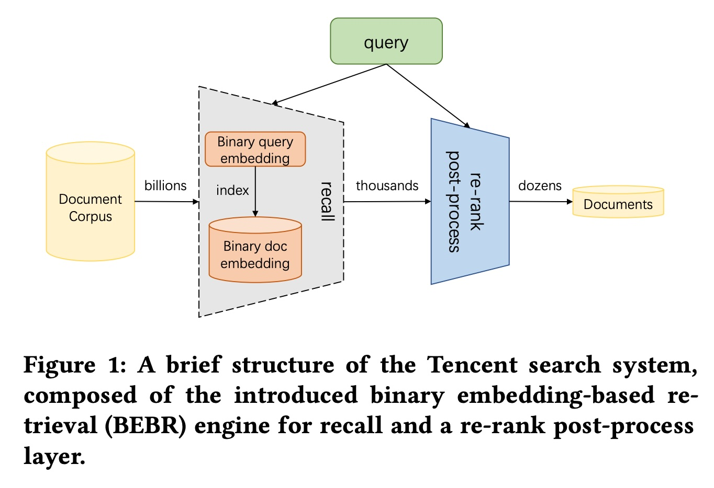
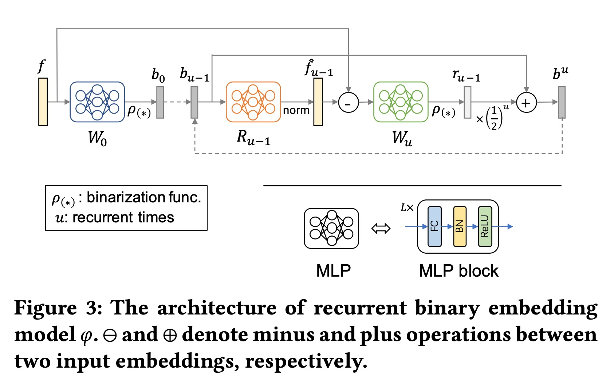
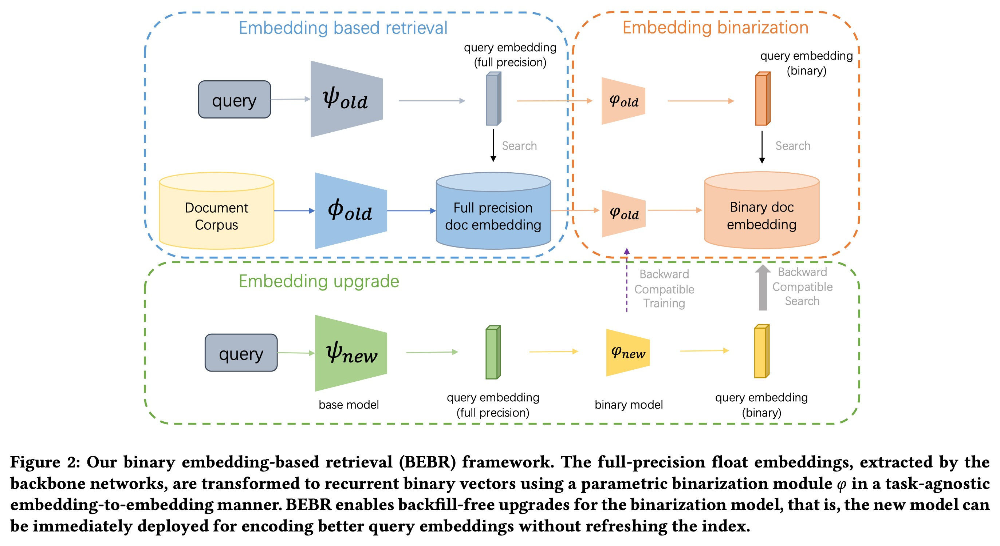
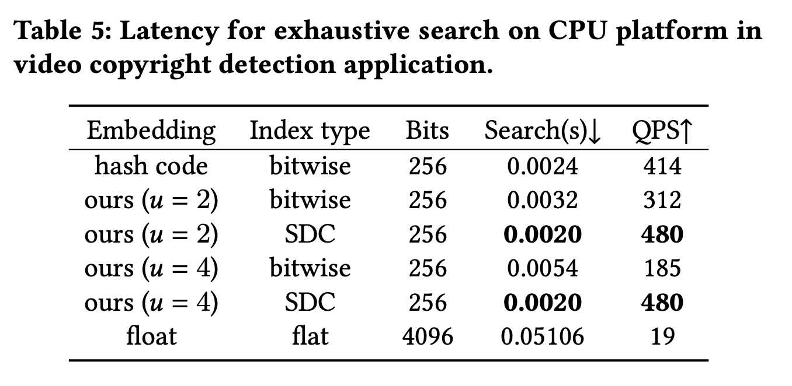

## AI论文解读 | Binary Embedding-based Retrieval at Tencent
        
### 作者        
digoal        
        
### 日期        
2025-10-08        
        
### 标签        
PostgreSQL , PolarDB , DuckDB , AI , 论文解读        
        
----        
        
## 背景  
      
https://arxiv.org/pdf/2302.08714        
  
提示:          
```          
读懂《Binary Embedding-based Retrieval at Tencent》这篇论文需要提前掌握哪些基础知识, 请使用中文通熟易懂的讲解这些基础知识, 可以引用论文中的图、表或使用Markdown支持的图形(text,mermaid等)增加解释性. 
  
使用中文通熟易懂的解读《Binary Embedding-based Retrieval at Tencent》这篇论文, 其中的关键内容请着重讲解, 可以引用论文中的图、表或使用Markdown支持的图形(text,mermaid等)增加解释性. 
  
提取《Binary Embedding-based Retrieval at Tencent》这篇论文中的重要术语, 使用中文对这些术语进行通熟易懂的讲解, 可以引用论文中的图、表或使用Markdown支持的图形(text,mermaid等)增加解释性. 
```     
  
## 1 前置知识 
  
好的，为了完全理解《Binary Embedding-based Retrieval at Tencent》这篇论文，你需要掌握一些核心的基础知识。我会用通俗易懂的中文为你讲解，并结合论文中的图表来帮助理解。

这篇论文的核心目标是解决一个非常实际的工业界问题：**如何在拥有海量数据（百亿甚至千亿级别）的系统中，既快又省钱地进行搜索。**

-----

### 基础知识一：什么是“检索”与“向量” (Embedding-based Retrieval)

想象一下你在一个巨大的图书馆里找书。

  * **传统方法（关键词匹配）** ：你告诉图书管理员书名里有“人工智能”，他就会把所有书名带“人工智能”的书找出来。这种方法很直接，但如果你想找一本讲“机器学习”的书，它可能就找不到了，因为关键词不完全匹配。
  * **现代方法（向量检索，EBR）** ：你不仅告诉图书管理员书名，还描述了书的内容，比如“关于计算机自我学习，预测未来”。图书管理员非常聪明，他能理解你描述的“语义”，然后不仅找出书名匹配的，还会找出内容相关的书，比如《深度学习入门》、《统计学习方法》等。

**向量（Embedding）** 就是实现这种“语义理解”的关键。我们可以用一个包含很多数字的列表（即向量）来表示任何东西，比如一句话、一篇文章、一张图片或一个视频。

**通俗比喻**：
我们可以用经纬度坐标 $(x, y)$ 来表示地球上的一个位置。同样，我们可以用一个更高维度的“语义坐标”（比如一个包含300个数字的向量）来表示一个词语或一篇文章。

  * “国王”的向量和“女王”的向量在空间中的位置会非常近。
  * “苹果”（水果）的向量和“香蕉”的向量很近，但和“苹果”（公司）的向量会比较远。

**向量检索（EBR）** 的工作流程就是：

1.  **编码**：把用户的查询（Query）和数据库里所有的文档（Documents）都转换成向量。
2.  **计算距离**：计算查询向量和每个文档向量之间的“距离”。距离越近，代表语义上越相关。
3.  **返回结果**：把距离最近的那些文档作为搜索结果返回。

这个过程在论文的 **Figure 1** 中有很好的体现，只是它展示的是本文提出的优化后的流程。传统的EBR系统中间的核心部分处理的是高精度的“浮点数向量”。

  

*这篇论文中的Figure 1，展示了从海量文档库（Document Corpus）中通过“召回”（recall）阶段筛选出上千个相关结果，再进行“重排”（re-rank）得到最终几十个结果的架构。本文优化的就是“召回”这个最耗费资源的环节。*

-----

### 基础知识二：大规模向量检索的“痛点”

当文档库从几百万增长到几百亿时，传统的向量检索会遇到两大瓶颈 ：

1.  **存储成本太高**：一个向量通常由几百个“浮点数”（float）组成，每个浮点数占32位（bits）。想象一下，几百亿个这样的向量会占用惊人的硬盘和内存空间。
2.  **计算速度太慢**：对于用户的每一次查询，系统都需要计算查询向量和几百亿个文档向量的距离。这个计算量是巨大的，导致搜索响应很慢。

这篇论文就是要解决这两个“痛点”。

-----

### 基础知识三：论文的核心解决方案——“二值化” (Binarization)

既然高精度的浮点数向量又占空间又算得慢，一个自然的想法就是：**能不能把它简化一下？**

**二值化（Binarization）** 就是这个简化的过程。它把原来由浮点数（例如 `-0.87, 1.23, 0.05`）组成的向量，转换成只包含 `-1` 和 `+1`（或者 `0` 和 `1`）的“二值向量” 。

这样做的好处是显而易见的：

  * **存储大大减少**：每个维度只需要1个比特（bit）就可以表示，相比原来的32比特，压缩率高达32倍。
  * **计算极快**：计算两个二值向量的距离，不再需要复杂的浮点数乘法和加法，只需要使用CPU非常擅长的“位运算”（比如 `XOR` 异或），速度极快。

但是，这么做也有一个巨大的风险：**精度损失**。粗暴地把浮点数变成-1或+1，会丢失大量信息，导致搜索结果不准确。

> **这就好比**：
> 原来的地图精度很高，能告诉你具体在“北京市海淀区中关村大街1号”。二值化后，地图变得很粗糙，只能告诉你“大概在北京”。

所以，这篇论文的关键技术贡献，就是研究如何进行 **“高质量的二值化”** ，在享受压缩和加速好处的同时，尽可能不损失搜索精度。

-----

### 论文的关键技术讲解

为了实现高质量的二值化，论文提出了几个关键技术。

#### 1\. 循环二值化 (Recurrent Binarization)

这不是一次性、粗暴地完成二值化，而是一个**逐步求精**的过程 。

**通俗比喻**：
想象一位画家画画。他不是一上来就画细节，而是：
1.  **第一步（基础二值化）** ：先用几笔画出大概的轮廓 ( base binary vector, $b_0$ ) 。
2.  **第二步（计算残差）** ：看看这个轮廓和真人的差距有多大（ 这个“差距”就是**残差 Residual** ） 。
3.  **第三步（残差二值化）** ：针对这个“差距”，再画几笔进行修正 ( residual binary vector, $r_0$ ) 。
4.  **循环往复**：不断重复“看差距、画几笔修正”的过程，画作就会越来越逼真。

论文中的 **Figure 3** 就形象地展示了这个过程。    

*如上图，原始的浮点向量 `f` 首先经过一个MLP网络 `W₀` 得到一个基础的二值向量 `b₀`。然后，系统会把 `b₀` 重建回浮点向量，并计算与原始 `f` 的差距（残差）。这个残差再经过网络 `Wᵤ` 进行二值化，得到一个用于修正的残差向量 `rᵤ₋₁`。这个过程可以循环 `u` 次，最终得到的二值向量 `bᵘ` 会比单次二值化的精度高得多。*

通过控制循环次数 `u`，就可以在 **“压缩率/速度”** 和 **“精度”** 之间做一个灵活的权衡 。

#### 2\. 向后兼容训练 (Backward-compatible Training)

这是解决工业界另一个巨大痛点的技术。

**问题**：假设我们今天训练了一个更好的模型（new model），它生成的向量比老模型（old model）效果更好。但是，我们数据库里存储的几百亿个文档向量，都是用**老模型**生成的。要把这些向量全部用新模型重新生成一遍，可能需要花费数周甚至数月的时间，成本极高 。

**解决方案**：在训练新模型的时候，加一个“兼容性”约束，让新模型不仅要学好自己的任务，还要**能够理解老模型生成的向量** 。

**通俗比喻**：
微软发布了新版的Word，它不仅能创建和编辑自己的新格式文档（`.docx`），还必须能够打开和读懂老板用旧版Word创建的（`.doc`）文档。这就是“向后兼容”。

论文的 **Figure 2** 的下半部分清晰地展示了这一点。    

*在“Embedding upgrade”（向量升级）部分，新模型 `ψ_new` 生成的查询向量，可以直接去和由老模型 `Φ_old` 生成的、已经存储在数据库中的“Binary doc embedding”进行搜索，而不需要更新整个数据库。这大大降低了模型升级的成本。*

#### 3\. 对称距离计算 (Symmetric Distance Calculation - SDC) & SIMD

这是为了把计算速度压榨到极致的底层优化技术 。

  * **SDC**：是一种专门为本文提出的“循环二值向量”设计的、非常高效的距离计算方法 。
  * **SIMD (Single Instruction, Multiple Data)**：这是现代CPU的一种指令集，可以让你**用一条指令同时对多个数据进行运算** 。

**通俗比喻**：
假设你要计算4组加法：`1+5`, `2+6`, `3+7`, `4+8`。

  * **普通CPU**：需要一步一步算4次。
  * **支持SIMD的CPU**：可以一条指令“啪”的一下，同时算出这4组加法的结果。

SDC算法被精心设计，以便能充分利用CPU的SIMD能力，从而实现比传统位运算更快的搜索速度 。

-----

### 总结

要读懂这篇论文，你需要理解以下几个层层递进的概念：

| 概念层次 | 基础知识 | 论文中的具体技术 | 解决什么问题 |
| :--- | :--- | :--- | :--- |
| **Why（为什么要做）** | 传统的**向量检索(EBR)** 在大规模数据下面临巨大的**存储**和**计算**瓶颈。 | - | 如何让搜索更便宜、更快。 |
| **What（做什么）** | 使用**二值向量**来代替高精度的浮点向量。 | - | 大幅压缩数据，加速计算。 |
| **How（怎么做）** | 如何在二值化后，不损失太多精度？ | **1. 循环二值化 (Recurrent Binarization)** | 逐步求精，平衡精度和压缩率。 |
| **How (怎么做得更好)** | 如何解决模型升级的麻烦？ | **2. 向后兼容训练 (Backward-compatible)** | 新模型能直接用老数据，无需更新整个数据库。 |
| **How (怎么做得更快)** | 如何在硬件层面极致加速？ | **3. 对称距离计算 (SDC) + SIMD** | 充分利用CPU特性，实现超快搜索。 |

掌握了这些基础知识后，你再去看论文中的公式、实验和结果，就会豁然开朗，明白其背后的动机和意义。
  
## 2 解读论文 
  
好的，这篇名为《Binary Embedding-based Retrieval at Tencent》的论文，介绍的是腾讯内部为了解决大规模搜索的效率和成本问题而研发的一套名为 **BEBR（Binary Embedding-based Retrieval，基于二值嵌入的检索）** 的技术引擎 。下面我将用通俗易懂的方式，为您深度解读其中的关键内容。

### **核心问题：大规模搜索的“烦恼”**

在像腾讯视频、搜狗搜索这样的产品中，系统需要在**数百亿甚至数千亿**的文档（视频、网页等）中为用户快速找到最相关的内容 。现代搜索引擎普遍采用“向量检索”（EBR）技术，即将用户查询和所有文档都转换成一串数字（浮点数向量），通过计算向量间的距离来判断相关性。

但当数据量达到腾讯这个级别时，传统向量检索会遇到两大瓶颈：

1.  **存储成本高**：存储数百亿个高精度的浮点数向量，需要巨大的内存和硬盘空间 。
2.  **计算延迟高**：每次查询都要与海量的向量进行复杂的浮点数运算，导致搜索速度慢，系统响应延迟高 。

为了解决这个问题，腾讯提出了BEBR引擎，其核心思想是 —— **“二值化”** 。

### **核心解决方案：BEBR引擎**

BEBR通过一个轻量级的转换模型，将高精度的浮点向量压缩成由多个**二值向量**（只包含-1和+1）组成的紧凑形式 。这样做的好处是：

  * **存储大大减少**：二值向量占用的空间远小于浮点向量。
  * **计算速度极快**：二值向量的距离计算可以使用CPU高效的位运算，比浮点运算快得多。

这篇论文的关键，在于如何实现**高质量的二值化**，在享受速度和成本优势的同时，几乎不损失搜索的准确率。为此，他们提出了几项关键技术。

-----

### **关键技术一：循环二值化 (Recurrent Binarization)**

为了避免简单二值化带来的精度严重损失，论文采用了一种**逐步求精**的策略，即“循环二值化” 。

**通俗理解**：
就像画一幅素描，不是一笔就画完所有细节。

1.  **第一步**：先画出一个基础的、大致的轮廓（ **基础二值向量** ）。
2.  **第二步**：对比这个轮廓和原始图像的差异（ 这个差异被称为 **“残差”** ）。
3.  **第三步**：针对这个“残差”，再画几笔进行修正（ **残差二值向量** ）。
4.  **循环往复**：不断地对新的残差进行二值化修正，每修正一次，最终的二值向量就更接近原始的浮点向量。

这个过程可以由下图（论文中的Figure 3）来表示：   

*图解：原始的浮点向量 `f` 首先生成一个基础二值向量 `b₀`。然后，系统根据 `b₀` 与 `f` 的差距（残差），生成一个修正向量 `rᵤ₋₁`，并将其叠加到 `b₀` 上。这个过程可以循环 `u` 次，从而得到一个越来越精确的最终二值向量 `bᵘ` 。*

这种方法有两个巨大优势：

  * **精度可控**：通过调整循环次数 `u`，可以在精度和压缩率之间自由权衡，以适应不同业务的需求 。
  * **训练高效**：论文提出了一种“embedding-to-embedding”的训练策略，训练二值化模型不再需要原始数据（如图片、文本），而只需要现成的浮点向量即可 。这不仅保护了数据隐私，而且训练速度极快，在数百万向量上仅需2个V100 GPU小时 。

-----

### **关键技术二：向后兼容的升级 (Backward-Compatible Upgrade)**

这是解决工业界一个巨大痛点的关键创新。当算法模型升级后，通常需要把数据库里数百亿的旧向量全部用新模型重新生成一遍，这个过程耗时耗力，可能长达数周甚至数月 。

论文首次将 **“向后兼容”** 学习应用在二值向量上，实现了 **免回填式（backfill-free）** 的模型升级 。

**通俗理解**：
这就像发布了新版本的软件，但它依然能打开旧版本创建的文件。在BEBR中，用**新模型**生成的查询向量，可以直接去搜索由**旧模型**生成的、已存在数据库中的文档向量，而无需更新整个数据库 。

  

*图解（论文Figure 2下半部分）：当模型从 `old` 升级到 `new` 时，新的查询向量 (`query embedding (binary)`) 可以通过“Backward Compatible Search”直接在旧的文档数据库 (`Binary doc embedding`) 中进行检索，实现了平滑升级 。*

实验证明，这种兼容性训练效果显著，其性能远超直接用新模型去搜索旧数据的基线水平 。

-----

### **关键技术三：对称距离计算 (SDC) 与高效部署**

为了在实际部署中将速度压榨到极致，论文提出了一种专门针对CPU平台的 **对称距离计算（Symmetric Distance Calculation, SDC）** 方法 。

该技术充分利用了现代CPU中的 **SIMD（单指令多数据）** 指令集 。简单来说，SIMD允许CPU用一条指令同时处理多个数据，就像一个收费站同时开放多个ETC通道一样，极大提升了并行计算能力。

SDC算法经过精心设计，可以完美配合SIMD指令，实现极高的计算性能 。

**效果有多好？**
如下表（论文Table 5）所示，在同样比特数（256 bits）下：    

  * 当循环次数 `u=4` 时，**SDC的QPS（每秒查询次数）是传统位运算（bitwise）的2.6倍**（480 vs 185），甚至比最简单的hash code还要快 。
  * 相比于原始的浮点向量（float），**SDC的QPS提升了超过25倍**（480 vs 19）。

| Embedding | Index type | Bits | QPS↑ |
| :--- | :--- | :--- | :--- |
| hash code | bitwise | 256 | 414 |
| ours (u=4) | bitwise | 256 | 185 |
| **ours (u=4)** | **SDC** | **256** | **480** |
| float | flat | 4096 | 19 |

*SDC在CPU上展现出卓越的搜索性能 。*

### **惊人的实践效果**

BEBR引擎已成功部署于腾讯的**搜狗搜索**、**腾讯视频**、**QQ**等核心产品中 。线上A/B测试的结果非常惊人：

  * **搜狗网页搜索**：
      * **内存消耗减少 73.91%** 。
      * **QPS（系统吞吐量）提升 90%** 。
      * 核心业务指标（如点击率CTR）几乎无损失（仅下降0.02%）。
  * **腾讯视频版权检测**：
      * **内存消耗减少 89.65%** 。
      * **QPS提升 72%** 。
      * 准确率几乎无损（仅下降0.13%）。

总的来说，BEBR在几乎不影响业务效果的前提下，为系统**节省了30%到50%的综合成本** 。

### **总结**

《Binary Embedding-based Retrieval at Tencent》是一篇典型的工业界顶级论文，它没有提出非常深奥的理论，而是聚焦于解决真实世界中大规模系统的核心痛点。其主要贡献可以总结为：

1.  **提出BEBR引擎**，通过高质量的**循环二值化**技术，在精度和成本之间取得了极致的平衡。
2.  **实现向后兼容的模型升级**，解决了工业界长期存在的模型迭代成本高昂的难题。
3.  **设计了SDC计算方法**，将二值检索在CPU上的性能发挥到极致，使其能无缝集成到各种现有的ANN（近似最近邻）系统中 。

这项工作为如何在超大规模系统中构建既高效又经济的检索系统，提供了一套完整、可行的解决方案。
  
## 3 术语 
  
好的，以下是论文《Binary Embedding-based Retrieval at Tencent》中的核心术语及其通俗化讲解，并结合了论文中的图表来辅助说明。

-----

### 1\. 向量检索 (EBR - Embedding-based Retrieval)

  * **中文释义**：基于嵌入（向量）的检索。
  * **通俗讲解**：这是一种现代的搜索技术。它首先将万物（如文字、图片、视频）都用一串数字列表（即“向量”或“Embedding”）来表示 。这些向量存在于一个高维度的“语义空间”中，在这个空间里，意思相近的东西，它们的向量距离也相近 。检索时，系统会计算查询向量和数据库中所有文档向量的距离，然后返回距离最近的结果 。
  * **好比**：给世界上的每个城市一个三维坐标（如经度、纬度、海拔）。要找离北京最近的城市，只需计算所有城市坐标与北京坐标的距离即可。EBR就是在一个更高维（例如几百维）的“语义坐标系”里做类似的事情。

### 2\. 二值嵌入检索 (BEBR - Binary Embedding-based Retrieval)

  * **中文释义**：基于二值嵌入（向量）的检索。
  * **通俗讲解**：这是本文提出的核心方案，是EBR的“降本增效”版 。它通过一种特殊的技术，将原本由高精度浮点数组成的向量，压缩成只包含`-1`和`+1`的**二值向量** 。
  * **好比**：我们不再用精确到小数点的经纬度（如 `116.4074° E`, `39.9042° N`）来表示城市位置，而是用一个更粗略但更简单的网格坐标（如 `区域A`, `分区B`）来表示。虽然损失了一点精度，但存储和查找起来都快得多。这篇论文的目标就是让这个“粗略”的坐标系依然非常好用。

### 3\. 循环二值化 (Recurrent Binarization)

  * **中文释义**：一种循环、逐步求精的二值化方法。
  * **通俗讲解**：为了解决简单二值化带来的精度损失问题，论文没有采用“一步到位”的粗暴压缩，而是采用了一种类似画家画素描的“逐步求精”策略 。
    1.  **第一步**：先生成一个基础的、大概的二值向量（画出轮廓）。
    2.  **第二步**：计算这个基础向量和原始高精度向量之间的“差距”（即**残差 Residual**）。
    3.  **第三步**：再对这个“差距”进行二值化，生成一个用于修正的“补丁”向量 。
    4.  **循环**：将“补丁”打在基础向量上，然后重复上述过程，直到精度足够高 。
  * **图示（论文Figure 3）** ：    
    *上图直观展示了这一过程：原始向量 `f` 先生成基础向量 `b₀`，然后通过计算残差不断生成修正向量 `rᵤ₋₁`，循环叠加，最终得到高度精确的二值向量 `bᵘ`。*

### 4\. 任务无关的训练 (Task-agnostic Training)

  * **中文释义**：一种不依赖具体任务和原始数据的通用训练方法。
  * **通俗讲解**：传统的模型训练通常需要原始数据（如海量图片、文本），这既不高效，也可能涉及数据隐私问题 。本文提出了一种“embedding-to-embedding”（从向量到向量）的训练方法 。二值化模型的训练**只需要现成的浮点向量作为输入**，而无需关心这些向量最初是从什么任务（搜索、推荐等）或什么数据（图片、文本等）中提取的 。
  * **好比**：我要训练一个翻译机，可以不给它看具体的中文和英文句子（原始数据），而是直接给它看两种语言的《新华字典》和《牛津词典》（即向量集合）。它通过学习两本词典中词条的对应关系，就能学会翻译。
  * **优势**：这种方法极大提升了训练效率，论文提到在百万级向量上训练仅需 **2个V100 GPU小时** ，并且可以灵活应用于公司内所有需要向量压缩的业务。

### 5\. 向后兼容 (Backward Compatibility)

  * **中文释义**：指新版本的模型能够兼容旧版本模型产生的数据。
  * **通俗讲解**：在工业界，模型会不断迭代升级。一个巨大的痛点是，新模型上线后，数据库里用旧模型生成的上百亿条数据就“过时”了，必须花费数周时间全部重新处理一遍，成本极高 。本文通过特殊的训练技巧，让新模型能够“读懂”旧模型生成的二值向量，实现了 **无需回填数据（refresh-free）** 的平滑升级 。
  * **图示（论文Figure 2）** ：    
    *图下方的 "Embedding upgrade" 部分清晰地展示了：由新模型 `ψ_new` 生成的查询，可以直接和由旧模型 `Φ_old` 生成的文档数据库进行匹配，实现了向后兼容搜索。*

### 6\. 对称距离计算 (SDC - Symmetric Distance Calculation)

  * **中文释义**：一种专为本文提出的循环二值向量设计的高效距离计算方法。
  * **通俗讲解**：这是为了在实际部署时，将搜索速度发挥到极致而设计的底层优化算法 。它专门面向CPU平台，可以非常高效地计算两个循环二值向量之间的距离 。
  * **核心武器 (SIMD)**：SDC算法的核心是充分利用了现代CPU的 **SIMD（单指令多数据）** 技术 。SIMD允许CPU用一条指令同时对一大批数据进行相同的运算，就像一个“多核”计算器，并行处理能力极强 。
  * **效果**：如论文Table 5所示，在CPU上，SDC的搜索速度远超传统的位运算（bitwise）方法，甚至比最基础的哈希码（hash code）还要快，极大提升了系统的吞吐量（QPS）。    
  
## 参考        
         
https://arxiv.org/pdf/2302.08714    
        
<b> 以上内容基于DeepSeek、Qwen、Gemini及诸多AI生成, 轻微人工调整, 感谢杭州深度求索人工智能、阿里云、Google等公司. </b>        
        
<b> AI 生成的内容请自行辨别正确性, 当然也多了些许踩坑的乐趣, 毕竟冒险是每个男人的天性.  </b>        
  
    
#### [期望 PostgreSQL|开源PolarDB 增加什么功能?](https://github.com/digoal/blog/issues/76 "269ac3d1c492e938c0191101c7238216")
  
  
#### [PolarDB 开源数据库](https://openpolardb.com/home "57258f76c37864c6e6d23383d05714ea")
  
  
#### [PolarDB 学习图谱](https://www.aliyun.com/database/openpolardb/activity "8642f60e04ed0c814bf9cb9677976bd4")
  
  
#### [PostgreSQL 解决方案集合](../201706/20170601_02.md "40cff096e9ed7122c512b35d8561d9c8")
  
  
#### [德哥 / digoal's Github - 公益是一辈子的事.](https://github.com/digoal/blog/blob/master/README.md "22709685feb7cab07d30f30387f0a9ae")
  
  
#### [About 德哥](https://github.com/digoal/blog/blob/master/me/readme.md "a37735981e7704886ffd590565582dd0")
  
  

  
