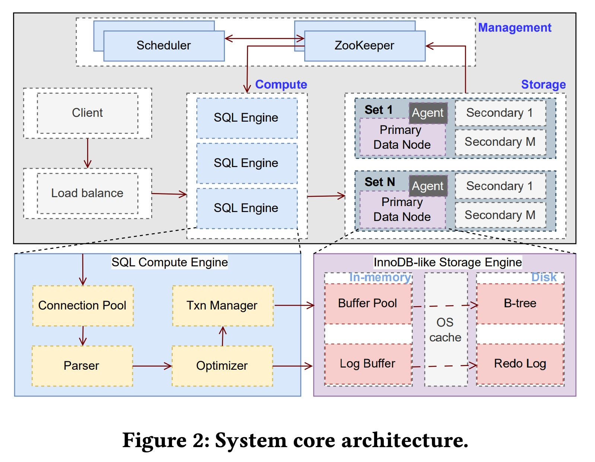
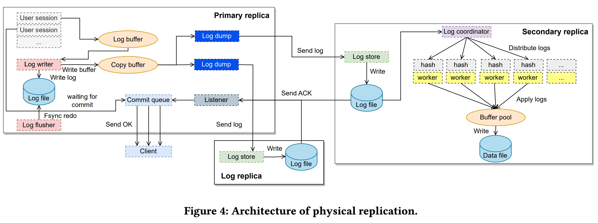
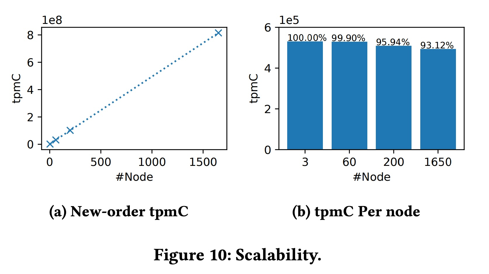
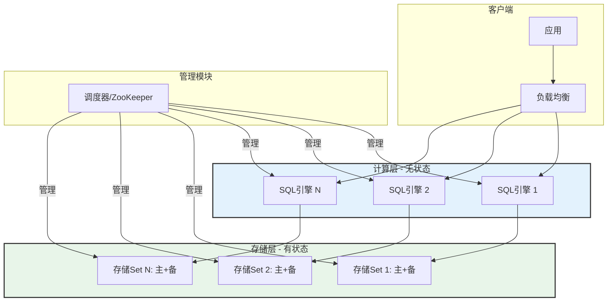

## AI论文解读 | TDSQL: Tencent Distributed Database System
        
### 作者        
digoal        
        
### 日期        
2025-10-08        
        
### 标签        
PostgreSQL , PolarDB , DuckDB , AI , 论文解读        
        
----        
        
## 背景  
      
https://www.vldb.org/pvldb/vol17/p3869-chen.pdf        
  
提示:          
```          
读懂《TDSQL: Tencent Distributed Database System》这篇论文需要提前掌握哪些基础知识, 请使用中文通熟易懂的讲解这些基础知识, 可以引用论文中的图、表或使用Markdown支持的图形(text,mermaid等)增加解释性. 
  
使用中文通熟易懂的解读《TDSQL: Tencent Distributed Database System》这篇论文, 其中的关键内容请着重讲解, 可以引用论文中的图、表或使用Markdown支持的图形(text,mermaid等)增加解释性. 
  
提取《TDSQL: Tencent Distributed Database System》这篇论文中的重要术语, 使用中文对这些术语进行通熟易懂的讲解, 可以引用论文中的图、表或使用Markdown支持的图形(text,mermaid等)增加解释性. 
```     
  
## 1 前置知识 
  
好的，为了完全读懂《TDSQL: Tencent Distributed Database System》这篇论文，您需要对数据库系统、分布式系统以及一些常见的系统架构和性能优化技术有基本的了解。

下面我将为您通俗易懂地讲解这些基础知识，并结合论文中的图表进行说明。

-----

### 1\. 数据库核心基础 (Core Database Concepts)

这是理解任何数据库论文的基石。TDSQL 本质上是一个关系型数据库，因此需要了解传统数据库是如何工作的。

#### **a. 事务 (Transaction) 与 ACID**

  * **事务**: 想象一下在银行ATM上转账，这个操作包含两个步骤：“从你的账户扣款”和“往对方账户存款”。这两个步骤必须要么**全部成功**，要么**全部失败**。这种捆绑在一起、不可分割的一系列操作，就叫做一个“事务”。
  * **ACID**: 这是衡量一个事务是否“可靠”的四个标准。论文中多次提到要保证数据一致性  和通过ACID测试 。
      * **原子性 (Atomicity)**: 事务是原子的，要么全做，要么全不做。转账不会只扣款不存款。
      * **一致性 (Consistency)**: 事务执行前后，数据库都处于一个“正确”的状态。例如，银行所有账户的总金额在转账前后应该是不变的。
      * **隔离性 (Isolation)**: 当多个事务同时进行时，它们之间互不干扰。你查账时，不会看到一个只完成了一半的转账。
      * **持久性 (Durability)**: 一旦事务成功提交，它对数据的修改就是永久的，即使系统断电重启，数据也不会丢失。

#### **b. SQL处理流程与存储引擎 (SQL Processing & Storage Engine)**

当您向数据库发送一条SQL查询时，它内部会经历一系列复杂的处理。论文的 **图2 (Figure 2)** 清晰地展示了这一点。    

```text
  +---------------------+      +---------------------------+
  |  SQL Compute Engine |      | InnoDB-like Storage Engine|
  | (计算引擎)          |      | (存储引擎)                |
  |                     |      |                           |
  |  Connection Pool    |      |  Buffer Pool (缓冲池)     |
  |         ↓           |      |          ↑↓               |
  |      Parser (解析器) | ---->|  Log Buffer (日志缓冲)    |
  |         ↓           |      |          ↓                |
  |     Optimizer (优化器)| ---->|  Redo Log (重做日志)      |
  |         ↑           |      |                           |
  |     Txn Manager     | <--->|  B-tree (B树)             |
  |   (事务管理器)      |      |                           |
  +---------------------+      +---------------------------+
```

  * **计算引擎 (Compute Engine)**: 负责“思考”。
      * **解析器 (Parser)**: 检查你的SQL语法是否正确，并理解你要做什么。
      * **优化器 (Optimizer)**: 这是数据库的“大脑”。条条大路通罗马，它会计算出哪条执行路径最快（比如是先过滤数据还是先关联表），然后生成一个执行计划。
  * **存储引擎 (Storage Engine)**: 负责“实干”，真正地去存储和读取数据。
      * **Buffer Pool (缓冲池)**: 内存中的一块区域，用来缓存最常访问的数据页。从内存读数据远比从磁盘读快得多，这是性能的关键。
      * **Redo Log (重做日志)**: 实现持久性（ACID中的D）的保障。所有数据的修改都会先记录在这个日志里。即使数据库在把修改写入数据文件前崩溃了，重启后也可以通过重做日志来恢复数据。
      * **B-Tree (B树)**: 数据库中数据在磁盘上最常见的组织形式，是一种高效的索引结构，能让你快速地找到想要的数据行。

-----

### 2\. 分布式系统核心概念 (Core Distributed Systems Concepts)

TDSQL是一个**分布式**数据库，意味着它不是运行在一台机器上，而是运行在成百上千台机器上 。这就引入了新的挑战和概念。

#### **a. CAP理论**

这是一个著名的分布式系统理论，它指出一个系统无法同时满足以下三点，最多只能满足两点：

  * **一致性 (Consistency)**: 所有节点在同一时间看到的数据是完全一致的。
  * **可用性 (Availability)**: 任何请求都能得到响应（不保证数据最新）。
  * **分区容错性 (Partition Tolerance)**: 网络出现故障（分区），导致节点间通信中断时，系统仍能继续工作。

在现代分布式系统中，网络故障是常态，因此**分区容错性 (P) 是必须保证的**。所以，系统设计者必须在**一致性 (C)** 和 **可用性 (A)** 之间做权衡。TDSQL作为金融级数据库，优先选择**强一致性 (Strong Consistency)** 。

#### **b. 数据复制与一致性模型 (Replication & Consistency)**

为了实现高可用（一台机器挂了，服务不受影响），数据必须被复制到多个节点上，即“副本” (Replica)。

  * **主从复制 (Primary-Secondary Replication)**: 通常有一个主节点 (Primary) 接收所有写请求，然后将数据变更同步给多个从节点 (Secondary)。

这篇论文的一个核心优化点是**物理复制 (Physical Replication)** 。

  * **传统逻辑复制 (Logical Replication)**: 比如MySQL的binlog，记录的是SQL语句或者行的变更内容。这种方式灵活但可能因各种bug导致主从数据不一致 。
  * **TDSQL物理复制**: 直接同步存储引擎层面的**Redo Log** 。这更底层、更高效，且能保证主从副本在物理层面是完全一致的。论文的 **图4 (Figure 4)** 详细描述了这个架构，展示了主副本如何将日志发送给从副本和日志副本。    

> **图4解读**: 用户事务在 **主副本(Primary Replica)** 上产生日志，写入`Log buffer`，然后通过`Log dump`线程发送给 **从副本(Secondary Replica)** 和 **日志副本(Log Replica)**。主副本需要等到大多数副本（例如，一个从副本）返回确认(ACK)后，才会告诉客户端事务已成功 。这就是**强同步 (Strong Synchronization)**。

#### **c. 共识算法 (Consensus Algorithm) e.g. Raft**

当主节点挂了，多个从节点中谁应该成为新的主节点？这就需要一个“选举”机制，让所有存活的节点达成共识。Raft就是一种被广泛使用的共识算法，它能安全、自动地完成选举，确保系统在发生故障后能快速恢复。TDSQL的强同步机制就是基于Raft协议实现的 。

#### **d. 两阶段提交 (Two-Phase Commit, 2PC)**

当一个事务需要修改分布在**多个不同节点**上的数据时，如何保证其原子性？2PC是经典解决方案。

  * **阶段一 (Prepare)**: 协调者问所有参与节点：“你们能提交这个事务吗？” 参与节点执行事务，但**不真正提交**，并锁定资源，然后回答“准备好了”。
  * **阶段二 (Commit)**: 如果所有人都回答“准备好了”，协调者就通知所有人“提交！”；只要有一个人回答“不行”，就通知所有人“回滚！”。

TDSQL使用2PC协议来处理跨节点事务 。

-----

### 3\. 数据库架构设计 (Database Architecture)

#### **a. Share-Nothing 架构**

TDSQL采用的是**Share-Nothing（无共享）架构** 。这意味着每个数据库节点都有自己独立的CPU、内存和磁盘，节点间不共享任何资源，只通过网络通信。这种架构的**水平扩展能力 (Horizontal Scalability)** 极强，当性能或容量不足时，只需简单地增加新的节点即可 。

#### **b. 存算分离 (Storage-Compute Separation)**

这是现代云数据库流行的一种架构，TDSQL的核心架构也采用了它 。如 **图2 (Figure 2)** 所示，系统的**计算层 (Compute Layer)** 和**存储层 (Storage Layer)** 是分开部署的。    

  * **好处**: 计算资源（CPU密集型）和存储资源（IO密集型）可以根据实际需求独立地进行扩缩容，更加灵活和节省成本。例如，如果只是查询变多了，可以只增加计算节点，而无需动存储。

#### **c. 数据分片 (Sharding)**

当一张表的数据量大到单机存不下时，就需要把它“切”成很多片（Shard），每一片存储在不同的节点上。TDSQL通常采用**哈希分片 (hash-based sharding)** ，即根据某个字段（如用户ID）的哈希值来决定这条数据应该存到哪个分片上，这样可以保证数据被均匀地分布到所有节点上。

-----

### 4\. 性能评测与优化 (Performance & Optimization)

#### **a. TPC-C 基准测试**

这是理解论文成果的关键。TPC-C是一个国际公认的、用于评测**在线事务处理 (OLTP, On-Line Transaction Processing)** 系统性能的行业标准 。

  * 它模拟一个复杂的批发商业务场景，包含下单、支付、查询库存等多种事务。
  * 其核心指标是 **tpmC** (transactions per minute C)，即每分钟处理的“新订单”事务数量。这个值越高，代表数据库处理高并发事务的能力越强。
  * TDSQL取得了 **8.14亿 tpmC** 的惊人成绩 ，这证明了其强大的性能和稳定性。

#### **b. 锁优化与内存优化**

为了在单机上支持极高的并发量，TDSQL做了很多内部优化。

  * **锁优化 (Lock Optimization)** : 当多个事务同时修改数据时，需要用“锁”来防止冲突。但锁本身也会成为性能瓶颈。TDSQL通过将大的全局锁拆分成许多小锁（锁分区） 和实现无锁化的事务ID管理  等方式，大大减少了锁争用。
  * **内存优化 (Memory Optimization)** : 当需要支持海量连接时（如TPC-C测试中的6.4亿客户端 ），每个连接都消耗内存是一个巨大的开销。TDSQL通过**连接复用**技术 ，用少量的TCP连接来承载大量的用户会话，极大地节省了内存。

### 总结

要读懂这篇论文，您可以按照以下路径构建您的知识体系：

1.  **基础**: 先理解什么是事务、ACID、SQL执行的基本流程和InnoDB等存储引擎的工作原理。
2.  **分布式核心**: 掌握数据复制（特别是物理复制）、Raft共识算法、2PC和CAP理论，理解为什么分布式系统需要这些技术。
3.  **架构**: 了解Share-Nothing和存算分离这两种主流的分布式数据库架构模式。
4.  **评测**: 知道TPC-C是衡量OLTP性能的黄金标准，tpmC是其核心指标。

有了这些基础知识，您再去看论文中关于物理复制、强同步、锁优化、内存管理等具体实现和优化细节时，就会明白它们是为了解决什么问题、以及为什么这样设计能够带来巨大的性能提升。
  
## 2 解读论文 
  
好的，我们来一起通俗易懂地解读《TDSQL: Tencent Distributed Database System》这篇论文的核心内容。

这篇论文主要介绍了腾讯自主研发的一款分布式数据库系统——TDSQL。您可以把它理解为一个 **既能像传统数据库一样可靠（保证数据不错乱），又能像互联网应用一样弹性伸缩（轻松增减服务器来应对业务高峰低谷）** 的超级数据库。它主要服务于对数据一致性和高并发要求极高的场景，比如银行、支付、电商等 。

论文的核心可以概括为以下几个关键点：

### 1\. 核心架构：灵活的“存算分离”设计

TDSQL采用了一种名为“存算分离”的现代数据库架构 。简单来说，就是把负责 **“计算”（处理SQL请求、分析语法、优化查询）** 和 **“存储”（真正存放数据）** 的两部分功能，在物理上分开了。

我们可以通过论文中的 **图2 (Figure 2)** 来理解这个架构：    

```text
+----------------------+      +-----------------------------+
|    SQL Compute Engine    |      |  InnoDB-like Storage Engine |
|       (计算引擎)         |      |         (存储引擎)          |
|  - 接收并解析SQL         |      |  - 存储数据副本 (Replica)     |
|  - 优化查询计划          |      |  - 包含主节点和备节点         |
|  - 处理分布式事务        | <==> |  - 真正读写磁盘数据           |
|  - 不存储实际数据        |      |  - (Buffer Pool, B-Tree等)  |
+----------------------+      +-----------------------------+
          ^
          |
+---------+----------+
|   Management Module  |
|      (管理模块)        |
| - 资源调度、故障切换   |
| - 扩容、缩容          |
+--------------------+
```

  * **计算层 (Compute Layer)**: 像数据库的“大脑” 。它接收用户的SQL请求，进行解析和优化，然后把指令发给存储层去执行 。这一层是无状态的，不存实际数据，所以可以快速地增加或减少节点来应对查询压力的变化 。
  * **存储层 (Storage Layer)**: 像数据库的“仓库” 。它负责数据的持久化存储，通常以“一主多备”的形式存在，保证数据的高可用性 。
  * **管理层 (Management Layer)**: 像“总指挥” 。它负责整个集群的资源调度、故障发现和自动切换（比如主节点挂了，自动提拔一个备用节点成为新的主节点） 。

**核心优势**：这种架构非常灵活。如果计算能力不够了，就只增加计算节点；如果存储空间不够了，就只增加存储节点。两者可以独立扩展，资源利用率更高，成本也更低。

### 2\. 关键特性一：基于物理复制的高可用与高性能

为了保证在一台或多台服务器宕机后数据不丢失、服务不中断，数据库需要将数据复制多份，这就是“数据复制”技术。

传统数据库（如MySQL）多使用**逻辑复制** (Logical Replication)，即同步SQL语句或数据变更记录。这种方式虽然灵活，但在极端情况下容易出错，导致主备数据不一致 。

TDSQL采用了一种更可靠、性能也更高的方式——**物理复制 (Physical Replication)** 。

  * **工作原理**: 它不关心上层执行了什么SQL，而是直接在存储引擎层面，将记录数据最底层变化的“重做日志 (Redo Log)”同步到备用节点 。这好比不是告诉你“把A改成B”，而是直接把“修改A为B”这个动作的笔记原封不动地抄送一份。
  * **优势**:
      * **高性能**: 减少了事务提交时需要写入磁盘的次数（从两次减少到一次），大大提升了写入性能 。论文提到，在SysBench和TPC-C测试下，性能提升分别超过**200%和100%** 。
      * **强一致性**: 因为同步的是最底层的物理日志，几乎杜绝了主备数据不一致的风险 。

论文的 **图4 (Figure 4)** 详细展示了这一过程，主副本(Primary)将日志(Log)发送给从副本(Secondary)和日志副本(Log replica)，确保数据安全落盘。   

### 3\. 关键特性二：金融级的强同步与快速故障切换

在金融场景，数据绝对不能出错。TDSQL通过**强同步 (Strong Synchronization)** 机制来保证这一点。

  * **强同步**: 一笔交易（事务）在主节点上执行后，**必须**等日志成功同步到大多数备用节点（例如，一个“一主两备”的集群中，至少要有一个备用节点确认收到），才能向用户返回“成功” 。这就保证了即时主节点瞬间宕机，数据也一定在其他节点上存有备份，不会丢失。
  * **性能优化**: 等待备用节点确认会增加延迟，影响性能 。TDSQL为此设计了一个专门的线程池（User ACK thread）来处理这个等待过程，让用户线程可以被释放去处理其他请求，从而在保证强同步的同时，维持了接近异步模式的高性能 。

当故障发生时，TDSQL能实现快速的**自动故障切换 (Failover)**。例如，主节点宕机后，管理节点会立刻从备用节点中选举一个新的主节点接管服务，整个过程能在**18秒内**完成，对业务影响极小 。

### 4\. 关键特性三：极致的性能优化

为了冲击TPC-C世界纪录，TDSQL在软件层面做了大量的优化。

  * **锁优化 (Lock Optimization)**: 在高并发下，数据库内部的“锁”竞争是主要的性能瓶颈。TDSQL将一些全局的大锁拆分成了更细粒度的分区锁，并对事务ID管理等模块进行了无锁化改造，显著提升了并发处理能力 。
  * **内存优化 (Memory Optimization)**: TPC-C测试要求支持海量并发连接，传统“一个连接一个线程”的模式会耗尽内存 。TDSQL通过**连接复用**技术，在一个TCP连接里处理多个客户端会话，将每个数据节点所需的连接数从1200个减少到24个，极大地节省了内存开销 。节省下来的内存可以更多地用于数据缓存（Buffer Pool），进一步提升性能。
  * **分布式事务优化**: 对于需要跨多个节点才能完成的事务，TDSQL使用了经典的**两阶段提交 (2PC)** 协议，并结合分组提交等技术进行了优化，使其在1650个节点的大规模集群下，单节点性能依然能保持在单节点测试时的75%以上 。

### 5\. 惊人的评测结果：TPC-C性能霸榜

TPC-C是业界公认的最权威、最严苛的在线交易处理性能测试基准。

  * **性能**: TDSQL在1650个数据库节点的集群上，创造了 **8.14亿 tpmC** 的成绩，这意味着系统每分钟能处理超过8.14亿笔新订单交易 。这一成绩在当时公开的TPC-C榜单中排名第一，比第二名高出15% 。
  * **稳定性**: 在长达8小时的压力测试中，系统性能波动率（抖动率）小于**0.2%**，比标准要求的2%低了一个数量级，展现了极高的稳定性 。
  * **可靠性**: 8小时内处理了超过8600亿次事务，无一次强制回滚和数据不一致的情况发生 。
  * **扩展性**: 论文中的 **图10 (Figure 10)** 显示，随着节点数量从3个增加到1650个，系统的总性能几乎呈**线性增长**，证明其Share-Nothing架构优秀的水平扩展能力 。   

### 总结

《TDSQL: Tencent Distributed Database System》这篇论文全面展示了一款为大规模、高要求场景设计的世界级分布式数据库。它通过**存算分离的先进架构**、**基于物理复制的高性能高可用方案**以及**一系列极致的内部优化**，成功地解决了传统数据库在扩展性、可用性和性能上的痛点，并在权威的TPC-C测试中证明了其顶尖的性能和稳定性。这些设计和经验对于所有需要处理大规模在线交易的行业都具有重要的参考价值。
  
## 3 术语 
  
好的，我将从《TDSQL: Tencent Distributed Database System》这篇论文中提取重要术语，并用通俗易懂的中文进行讲解。

### 核心架构与设计理念

#### 1\. 分布式数据库 (Distributed Database)

分布式数据库是将数据存储在多个物理位置的数据库系统 。与将所有数据集中存放在一台服务器的传统数据库不同，它将数据分散在网络连接的多台计算机上 。这样做的好处是可以汇集多台机器的计算和存储能力，从而实现高可用性、高性能和高可扩展性 。

#### 2\. 无共享架构 (Share-nothing Architecture)

这是一种分布式计算架构，其中每个节点（计算机）都是独立且自给自足的，拥有自己的处理器、内存和磁盘，不与其他节点共享这些资源 。节点之间通过网络进行通信 。TDSQL采用这种架构，使得系统可以通过简单地增加普通商品硬件节点来进行水平扩展，性能几乎可以实现线性增长 。

#### 3\. 存算分离 (Storage-compute Separation)

这是一种将数据存储（Storage）和数据计算（Compute）功能分别部署在不同物理节点上的架构 。

  * **计算层 (Compute Layer)**：主要负责处理SQL请求，如解析、优化和执行计划生成，但不存储实际的用户数据，是CPU密集型组件 。
  * **存储层 (Storage Layer)**：主要负责数据的持久化存储和管理 。

这种架构的好处在于，存储和计算资源可以根据业务需求独立扩展。例如，如果计算能力不足，可以只增加计算节点，而无需改动存储层 。论文中的图2清晰地展示了这种分离的核心架构 。    



### 高可用性 (High Availability)

#### 1\. 物理复制 (Physical Replication)

物理复制是一种数据同步技术，它通过直接传输数据库的重做日志（Redo Log）来实现主备副本之间的数据同步 。这与传统的逻辑复制（如MySQL的binlog）不同，后者传输的是SQL语句或其逻辑表示 。

TDSQL采用物理复制有以下优点：

  * **高性能**：事务提交只需要一次`fsync`操作（将日志刷到磁盘），显著提升了写入吞吐量 。
  * **低延迟**：数据更新在主库执行的同时，其对应的日志就可以被发送到备库 。
  * **强一致性**：能保证主备副本在物理存储层面是完全一致的 。

论文的图4详细描绘了其三副本物理复制的架构，包括主副本（Primary Replica）、备副本（Secondary Replica）和日志副本（Log Replica） 。    

  * **主副本 (Primary Replica)**：处理所有读写请求，并生成日志 。
  * **备副本 (Secondary Replica)**：接收并应用主副本的日志，保持数据完整，可在主库故障时接管服务 。
  * **日志副本 (Log Replica)**：只存储日志，不应用日志，消耗资源极少，主要用于数据备份和加速故障恢复 。

#### 2\. 强同步 (Strong Synchronization)

强同步是一种基于Raft共识协议的复制机制，旨在确保数据在任何情况下都不会丢失或不一致 。在这种模式下，当主副本处理一个写请求时，它必须等待大多数副本（例如，在一个主库和两个备库的配置中，至少一个备库）成功接收并持久化了日志后，才能向客户端返回成功确认 。

虽然这保证了极高的数据一致性，但等待备库响应会增加延迟 。TDSQL对此进行了优化，引入了专门的`User ACK thread`（用户确认线程），将等待过程异步化，使得用户线程可以被释放去处理其他请求，从而在保证强同步的同时，获得了接近异步模式的性能 。

### 高可扩展性 (High Scalability)

#### 1\. 水平扩展 (Horizontal Scaling / Scaling out)

当系统性能或容量不足时，通过增加更多机器节点来提升整个集群的处理能力，这就是水平扩展 。TDSQL的无共享架构使其能够轻松地进行水平扩展 。整个扩展过程对业务是无感知的，服务不会中断 。

#### 2\. 哈希分区 (Hash-based sharding)

这是一种数据分片策略。TDSQL通过选择某个字段（sharding key），对其进行哈希计算，然后根据计算结果决定这条数据应该存储到哪个物理节点上 。这种方式可以确保数据被相对均匀地分布到所有节点上，从而实现负载均衡，避免了“热点”问题 。

### 高性能优化 (High-Performance Optimizations)

#### 1\. 锁优化 (Lock Optimization)

在高并发场景下，锁是主要的性能瓶颈之一 。TDSQL在多个层面进行了锁优化，以提升并发处理能力：

  * **移除表级锁 (Removal of Table-level Locks)**：移除了InnoDB中不必要的表级锁，减少了锁冲突 。
  * **行锁分区 (Partitioning of Row-level Locks)**：将全局的行锁哈希表拆分为多个部分，每部分由一个独立的锁保护，从而大幅减少了更新操作中对单个锁的竞争 。
  * **无锁事务ID管理 (Lock-free Transaction ID Management)**：使用无锁哈希表来管理活跃的事务ID，避免了全局锁带来的性能开销 。

#### 2\. tdsql\_returning 语法

这是TDSQL为了优化特定业务场景而引入的一种SQL语法扩展 。在很多业务逻辑中，需要先更新或删除一条数据，然后立刻查询它的最新状态。通常这需要两条SQL语句完成。`tdsql_returning`语法允许在`update`或`delete`语句中直接返回被修改的数据，将两次数据库交互合并为一次，有效降低了网络开销和延迟 。

#### 3\. 内存优化 (Memory Optimization)

为了支持单节点几十万级别的海量并发连接，TDSQL对网络模型和内存使用进行了深度优化 。

  * **连接复用 (Connection Reuse)**：通过改造通信协议，在一条TCP连接中维护多个客户端的会话，极大地减少了数据库节点所需的TCP连接数，从而节省了大量内存 。
  * **资源共享 (Resource Sharing)**：将存储过程等原本在每个会话中独立缓存的资源，转变为全局共享。例如，原先5万个连接需要23GB内存缓存，优化后只需不到1GB 。

#### 4\. 全局一致性读 (Global Consistent Read)

在分布式环境下，要确保一个事务在不同节点上能读到一致的数据快照，是一个复杂的问题 。TDSQL通过引入一个高性能的全局事务组件和**全局事务序列号 (Global Transaction Sequence, GTS)** 来实现这一目标 。每个事务在开始和提交时都会获取一个GTS，系统通过比较行数据的GTS和查询的GTS来判断数据是否可见，从而保证了跨节点的读取一致性 。
  
## 参考        
         
https://www.vldb.org/pvldb/vol17/p3869-chen.pdf    
        
<b> 以上内容基于DeepSeek、Qwen、Gemini及诸多AI生成, 轻微人工调整, 感谢杭州深度求索人工智能、阿里云、Google等公司. </b>        
        
<b> AI 生成的内容请自行辨别正确性, 当然也多了些许踩坑的乐趣, 毕竟冒险是每个男人的天性.  </b>        
  
    
#### [期望 PostgreSQL|开源PolarDB 增加什么功能?](https://github.com/digoal/blog/issues/76 "269ac3d1c492e938c0191101c7238216")
  
  
#### [PolarDB 开源数据库](https://openpolardb.com/home "57258f76c37864c6e6d23383d05714ea")
  
  
#### [PolarDB 学习图谱](https://www.aliyun.com/database/openpolardb/activity "8642f60e04ed0c814bf9cb9677976bd4")
  
  
#### [PostgreSQL 解决方案集合](../201706/20170601_02.md "40cff096e9ed7122c512b35d8561d9c8")
  
  
#### [德哥 / digoal's Github - 公益是一辈子的事.](https://github.com/digoal/blog/blob/master/README.md "22709685feb7cab07d30f30387f0a9ae")
  
  
#### [About 德哥](https://github.com/digoal/blog/blob/master/me/readme.md "a37735981e7704886ffd590565582dd0")
  
  

  
