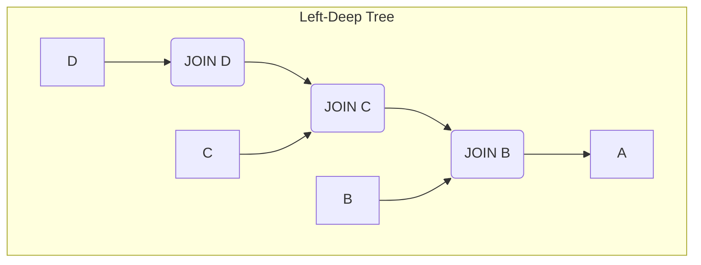
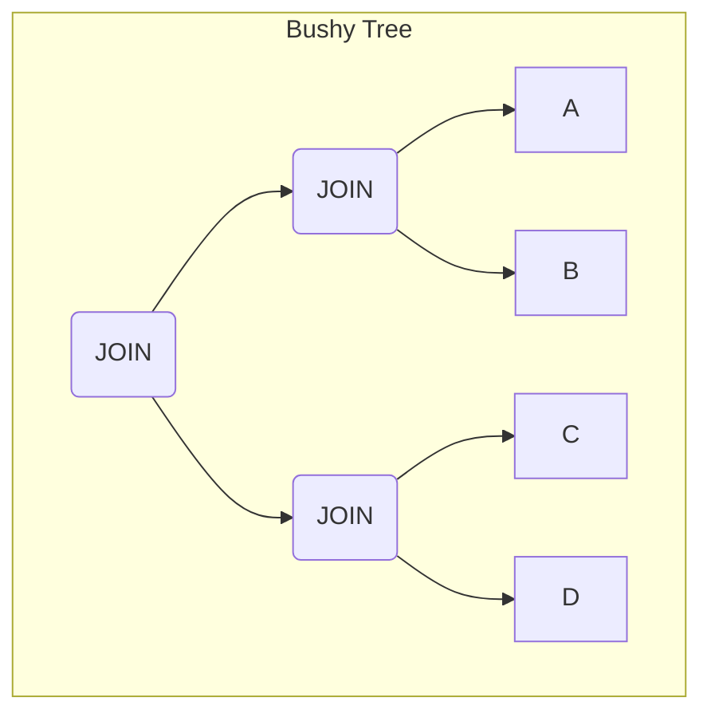
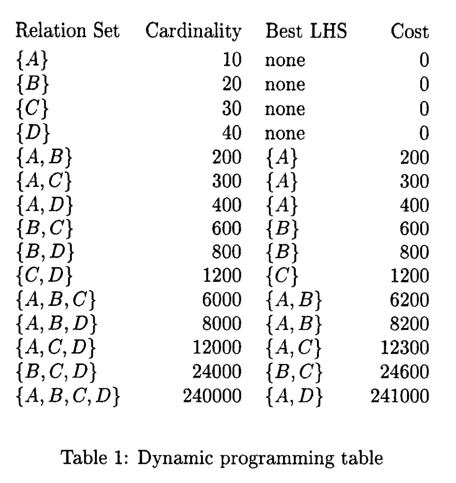
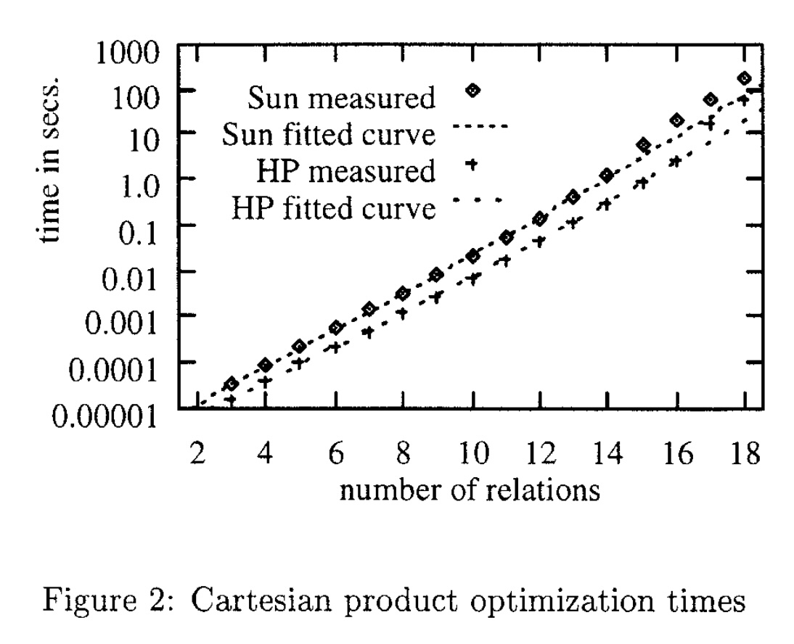
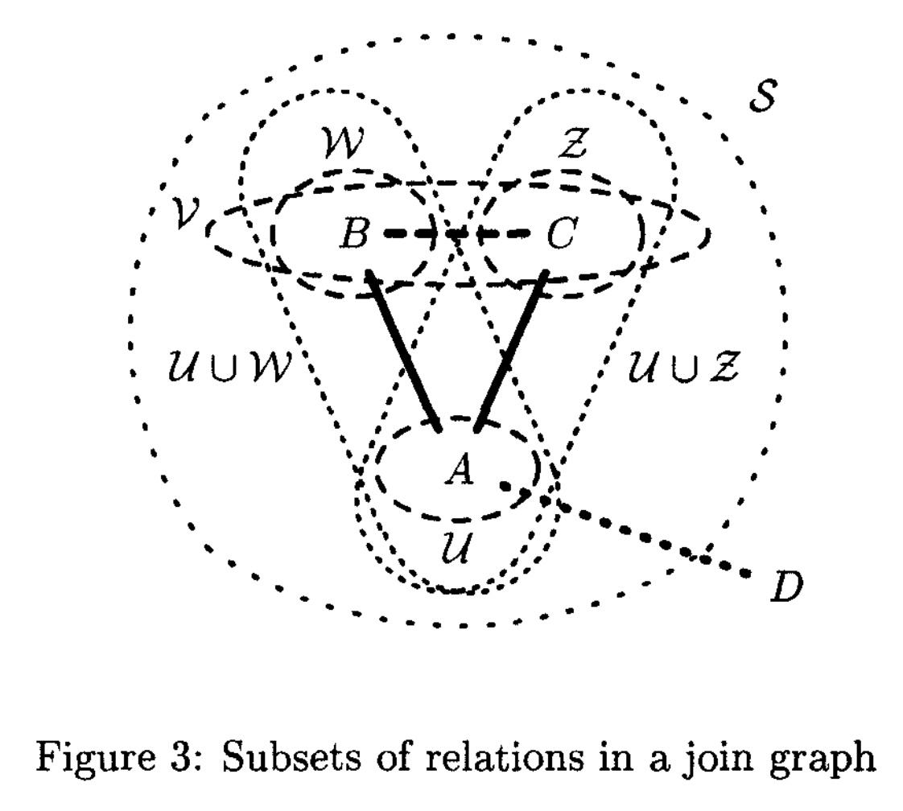
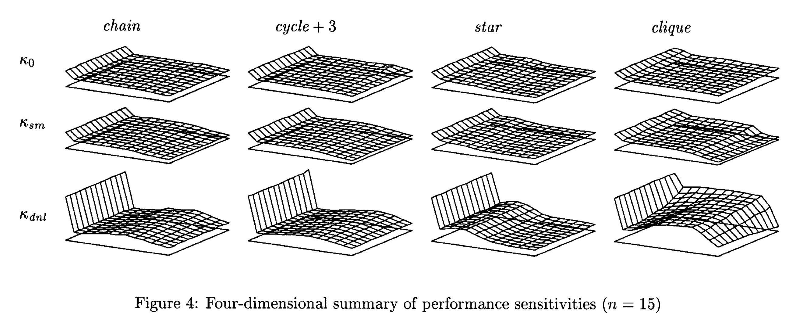
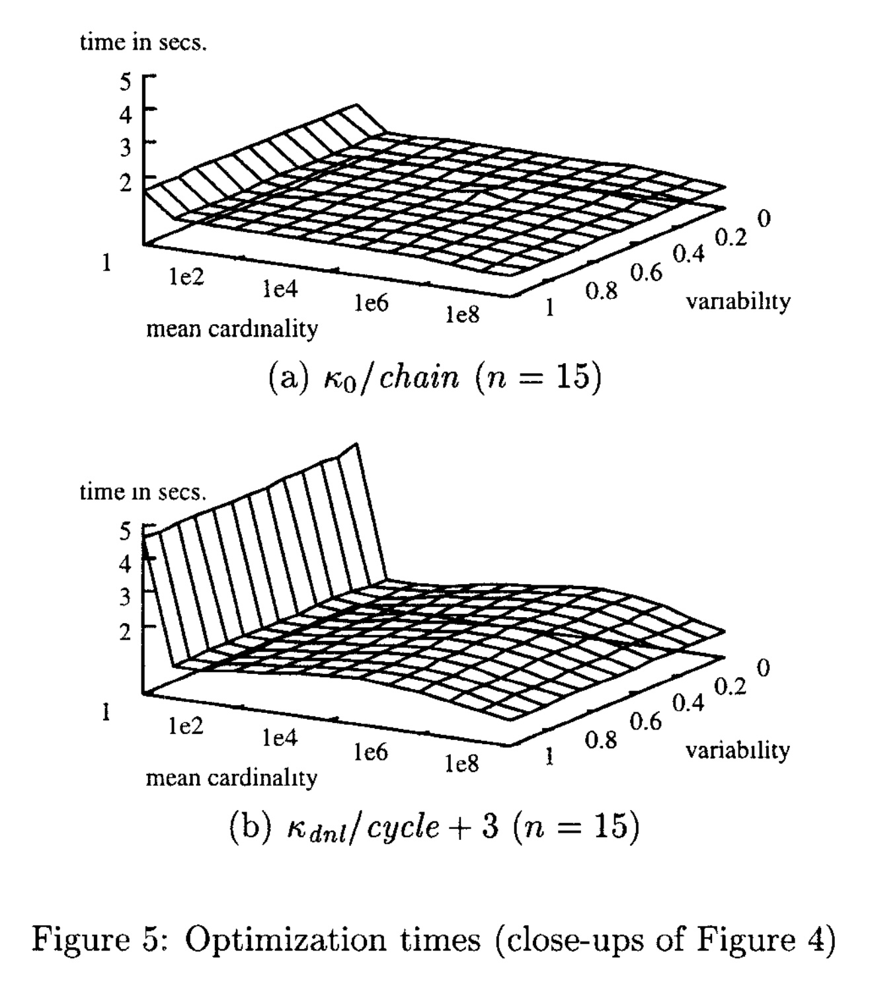
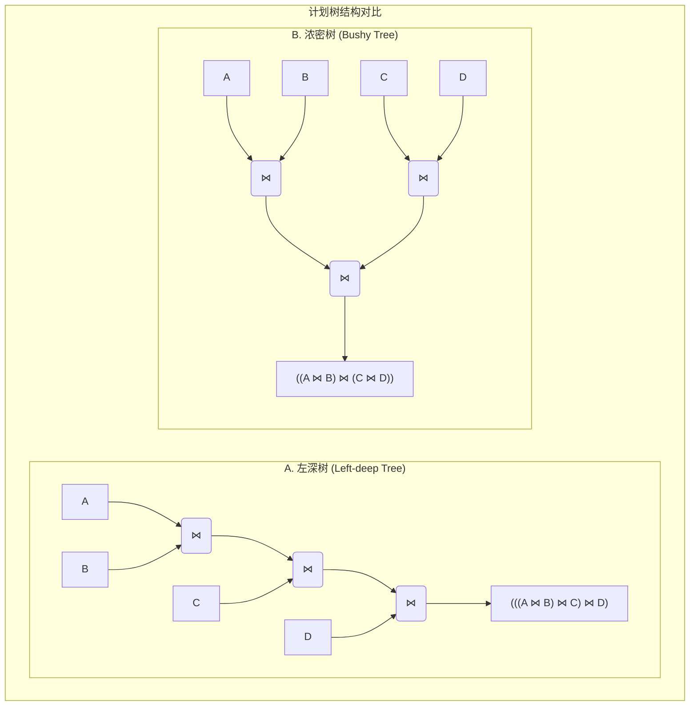

## AI论文解读 | Rapid Bushy Join-Order Optimization With Cartesian Products
        
### 作者        
digoal        
        
### 日期        
2025-10-08        
        
### 标签        
PostgreSQL , PolarDB , DuckDB , AI , 论文解读        
        
----        
        
## 背景  
      
https://dl.acm.org/doi/pdf/10.1145/235968.233317        
  
提示:          
```          
读懂《Rapid Bushy Join-Order Optimization With Cartesian Products》这篇论文需要提前掌握哪些基础知识, 请使用中文通熟易懂的讲解这些基础知识, 可以引用论文中的图、表或使用Markdown支持的图形(text,mermaid等)增加解释性. 
  
使用中文通熟易懂的解读《Rapid Bushy Join-Order Optimization With Cartesian Products》这篇论文, 其中的关键内容请着重讲解, 可以引用论文中的图、表或使用Markdown支持的图形(text,mermaid等)增加解释性. 
  
提取《Rapid Bushy Join-Order Optimization With Cartesian Products》这篇论文中的重要术语, 使用中文对这些术语进行通熟易懂的讲解, 可以引用论文中的图、表或使用Markdown支持的图形(text,mermaid等)增加解释性. 
```     
  
## 1 前置知识 
  
好的，理解这篇经典的数据库查询优化论文《Rapid Bushy Join-order Optimization with Cartesian Products》确实需要一些前置知识。这篇论文的核心贡献在于，它提出了一种非常高效的算法（`blitzsplit`），使得在过去被认为“过于复杂、耗时”的 **浓密树（Bushy Tree）** 连接顺序搜索空间，甚至是包含 **笛卡尔积（Cartesian Product）** 的计划，都变得可以在几秒钟内完成优化。

下面我将用通俗易懂的方式，结合论文中的图表，为您讲解需要掌握的基础知识。

-----

### 1\. 核心问题：什么是数据库查询优化？

想象一下，你用导航软件规划一条从A到D的路线，中间需要经过B和C。导航软件不会只给你一条路，它会计算很多种可能的走法（比如 A-\>B-\>C-\>D, A-\>C-\>B-\>D 等），然后根据实时路况、距离、过路费等信息，告诉你哪条是“最优”路线（最快、最短或最省钱）。

数据库查询优化做的就是类似的事情。当你向数据库发送一条SQL查询语句，特别是包含多个表“连接”（JOIN）的复杂查询时，数据库内部的 **查询优化器（Query Optimizer）** 会做两件事：

1.  **生成所有可能的执行方案**：就像导航软件找出所有可行的路线。
2.  **评估每个方案的成本**：估算执行每个方案需要花费的时间和资源（主要是CPU和磁盘I/O）。
3.  **选择成本最低的方案**：这个成本最低的方案就是最终的“执行计划”（Execution Plan）。

这篇论文研究的就是如何快速、全面地完成第1步和第2步，从而找到最优的执行计划。

### 2\. 关键操作：连接（JOIN）与连接顺序

**连接 (JOIN)** 是数据库中最基本也最耗时的操作之一。它用于将两个或多个表中的行根据指定的连接条件组合起来。

**连接顺序 (Join Order)** 为什么重要？因为它极大地影响查询性能。

假设我们要连接三个表：

  * `学生表` (1000条记录)
  * `课程表` (500条记录)
  * `选课表` (50000条记录，记录了哪个学生选了哪门课)

我们要查询“所有学生及其所选课程的名称”。一个可能的SQL是：

```sql
SELECT 学生表.姓名, 课程表.课程名
FROM 学生表
JOIN 选课表 ON 学生表.学号 = 选课表.学号
JOIN 课程表 ON 选课表.课程号 = 课程表.课程号;
```

优化器至少有两种连接顺序可选：

  * **方案A**：(`学生表` JOIN `选课表`) JOIN `课程表`
    1.  先连接 `学生表` 和 `选课表`。因为每个学生都可能选多门课，这个中间结果可能还是很大（比如50000条）。
    2.  再将这个50000条的中间结果与 `课程表` 连接。
  * **方案B**：(`选课表` JOIN `课程表`) JOIN `学生表`
    1.  先连接 `选课表` 和 `课程表`。这个中间结果大小也是50000条。
    2.  再将这个结果与 `学生表` 连接。

在这个例子中，两个方案的中间结果大小似乎差不多。但如果有一个连接能极大地缩小中间结果的规模，那么就应该优先执行它。**选择一个好的连接顺序，核心目标就是让计算过程中产生的“中间结果集”尽可能小。**

### 3\. 核心概念：查询计划树 (Left-Deep vs. Bushy)

优化器通常将连接顺序表示为一棵树，称为“查询计划树”。这篇论文的标题就提到了两种树形：

#### a. 左深树 (Left-deep Tree)

左深树的特点是，它的每个连接操作的右边输入都必须是一个原始的基表，不能是另一个连接操作的结果。它的形状像一把斜着的梳子。

对于 A, B, C, D 四个表的连接，一个左深树计划可能是 `(((A join B) join C) join D)`。



  * **优点**：结构简单，可能的组合数量相对较少。对于n个表的连接，左深树的数量级是 $O(n!)$ 。这使得优化器的搜索空间变小，优化速度较快。
  * **缺点**：不够灵活，可能会错过一些更优的执行计划。例如，如果 `(A join B)` 和 `(C join D)` 的结果都很小，先把它们分别计算再合并可能会更快，但左深树无法表达这种计划。

#### b. 浓密树 (Bushy Tree)

浓密树则没有左深树的限制，连接操作的左右两边都可以是另一个连接的结果。它的形状更像一棵茂盛的树。

对于同样的四个表，一个浓密树计划可以是 `((A join B) join (C join D))`。



  * **优点**：非常灵活，可以表达所有可能的连接组合，因此更有可能找到全局最优解。
  * **缺点**：搜索空间巨大。对于n个表的连接，浓密树的数量级是 $O(\frac{(2n)!}{n!})$ ，比左深树大得多。因此，传统的优化器为了节省优化时间，常常会放弃搜索浓密树 。

**这篇论文的核心论点是：我们不必害怕浓密树的巨大搜索空间，因为我们有办法让这个搜索变得飞快 。**

### 4\. 一个被“嫌弃”的概念：笛卡尔积 (Cartesian Product)

当你连接两个表却没有指定连接条件时，就会产生笛卡尔积。结果是第一个表的每一行与第二个表的每一行都进行组合。如果表A有m行，表B有n行，笛卡尔积就会产生 $m \times n$ 行，结果集通常是巨大的。

因此，大多数优化器会**极力避免**在执行计划的中间步骤中产生笛卡尔积 。

**但这篇论文的另一个颠覆性观点是：不应该完全禁止笛卡尔积 。** 在某些罕见但确实存在的情况下，一个包含笛卡尔积的计划反而是最优的。既然他们的算法足够快，就可以把笛卡尔积也纳入考虑范围，如果它真的最优，就选择它 。

### 5\. 算法基础：动态规划 (Dynamic Programming)

为了系统地、不遗漏地找到最优连接顺序，这篇论文的算法 `blitzsplit` 使用了**动态规划**。这是理解其工作原理的关键。

动态规划的思想是“分而治之”，将大问题分解为小问题，并储存小问题的解，避免重复计算。

在连接优化中，它的过程如下：

1.  **第一步**：计算访问**单个表**（集合大小为1）的成本。这通常是0 。
2.  **第二步**：计算连接**任意两个表**（集合大小为2）的最优计划和成本。例如，对于{A, B}，计划只有一种 `A join B`。
3.  **第三步**：计算连接**任意三个表**（集合大小为3）的最优计划和成本。例如，对于{A, B, C}，我们需要考虑所有可能的“拆分”(split)：
      * `{A}` join `{B, C}`
      * `{B}` join `{A, C}`
      * `{C}` join `{A, B}`
        由于我们在第二步已经计算出了`{B, C}`, `{A, C}`, `{A, B}`各自的最优成本，我们只需要在此基础上加上最后一次连接的成本，然后比较这三种拆分方案，选出成本最低的一个。
4.  **以此类推**，直到计算出包含所有n个表的集合的最优计划。

论文中的**表1 (Table 1)**  完美地展示了这个过程。它从大小为1的集合（{A}, {B}, {C}, {D}）开始，逐行计算，直到最后一行得出大小为4的集合 {A, B, C, D} 的最优计划。    

**表1: 动态规划表示例** 

| Relation Set | Cardinality | Best LHS | Cost |
| :--- | :--- | :--- | :--- |
| {A} | 10 | none | 0 |
| {B} | 20 | none | 0 |
| ... | ... | ... | ... |
| {A, B} | 200 | {A} | 200 |
| ... | ... | ... | ... |
| {A, B, C} | 6000 | {A, B} | 6200 |
| ... | ... | ... | ... |
| {A, B, C, D} | 240000 | {A, D} | 241000 |

例如，要计算 `{A, B, C, D}` 的最优计划，算法会评估所有拆分，如 `({A}) join ({B, C, D})`，`({B}) join ({A, C, D})`，`({A, B}) join ({C, D})` 等。最后发现，`({A, D}) join ({B, C})` 的总成本最低（241000），因此将 `{A, D}` 记录为“最佳左手边（Best LHS）” 。然后可以递归地从表中查找 `{A, D}` 和 `{B, C}` 的最优计划，最终拼出完整的计划树 `(A join D) join (B join C)` 。

### 6\. 评估标准：成本模型与基数估计

优化器如何知道哪个计划更好？它需要一个**成本模型 (Cost Model)** 来估算每个计划的“成本”。

成本通常与以下因素有关：

  * **中间结果的基数 (Cardinality)**：即中间结果的行数。这是最重要的因素。基数越大，后续处理的开销就越大。
  * **谓词的选择率 (Selectivity)**：`WHERE` 或 `ON` 子句中的条件能过滤掉多少数据。例如，`WHERE age = 20` 的选择率就比 `WHERE age > 18` 要低（即更具选择性，返回的行数更少）。

论文首先在一个非常简单的成本模型 $\kappa_0$ （成本就等于结果的行数）下展示了其笛卡尔积优化器的惊人速度 ，然后将其扩展到更真实的包含连接谓词的场景 。它通过一个巧妙的“扇形（fan）”概念，高效地计算包含选择率的连接基数，而没有显著增加算法的复杂度 。

-----

### 总结

要读懂这篇论文，你需要提前掌握以下基础知识：

1.  **查询优化的基本目标**：从众多可能的执行计划中，选出成本最低的一个。
2.  **连接顺序的重要性**：不同的连接顺序会导致性能的巨大差异，核心是最小化中间结果集。
3.  **查询计划树的两种形态**：
      * **左深树 (Left-deep)**：搜索空间小，但可能不是最优。
      * **浓密树 (Bushy)**：搜索空间大，但更可能找到最优解。
4.  **笛卡尔积的利与弊**：通常应避免，但最优计划中也可能包含它。
5.  **动态规划的基本思想**：通过解决并存储子问题的解，来系统地构建出最终问题的最优解。
6.  **成本模型的基本原理**：优化器通过成本模型来估算计划的开销，其中基数和选择率是关键参数。

掌握了这些概念后，你就能更好地理解作者是如何通过一个创新的、高度优化的动态规划算法 (`blitzsplit`)，以及巧妙的位运算实现技巧 ，成功地让全面、无限制的连接顺序搜索（包括浓密树和笛卡尔积）变得如此高效，从而挑战了当时查询优化领域的普遍认知。
  
## 2 解读论文 
  
好的，我们来一起深入解读这篇数据库查询优化领域的经典论文——《Rapid Bushy Join-Order Optimization with Cartesian Products》。

这篇论文的核心思想可以概括为：**挑战传统智慧**。在它发表之前，绝大多数数据库查询优化器都认为，为了在合理时间内找到一个“足够好”的查询执行计划，必须牺牲“最优”的可能性，具体方法是**限制搜索范围**，比如只考虑结构简单的“左深树”计划，并坚决避免会产生中间结果集的“笛卡尔积” 。

而本文作者反其道而行之，他们提出一个问题：**我们能不能让“全面搜索”变得飞快，快到足以在实践中使用？**  答案是肯定的，而他们提出的`blitzsplit`算法就是实现这一目标的关键。

-----

### 1\. 核心背景：连接顺序优化的“两难困境”

在解读论文之前，我们必须理解它要解决的问题：**多表连接顺序优化**。当一条SQL查询需要连接多个表（例如A、B、C、D）时，数据库可以用多种不同的顺序和结构来执行这个连接。这些不同的执行方式，我们称之为 **查询计划（Query Plan）** 。

不同的查询计划，其执行效率可能有天壤之别。一个好的计划可能只需几秒钟，而一个坏的计划可能要跑上几个小时。优化器的目标就是从海量的可能性中找出成本最低（即执行最快）的那个计划。

然而，这里的可能性太多了，呈指数级增长，这个问题是“NP完全”的 。因此，传统的优化器选择“抄近路”，即作出两个关键妥协：

1.  **只考虑左深树 (Left-Deep Trees)**：这种计划树的结构很简单，像一把斜梳子，每次连接的右侧输入必须是一个原始表 。它排除掉了结构更灵活、可能性更多的**浓密树 (Bushy Trees)** 。

    ```mermaid
    graph TD
        subgraph Plan Tree Structures
            subgraph "A. Left-Deep Tree (传统优化器偏爱)"
                direction LR
                Join3["((A⋈B)⋈C)⋈D"] --> Join2["(A⋈B)⋈C"]
                D[D] --> Join3
                Join2 --> Join1["A⋈B"]
                C[C] --> Join2
                Join1 --> A[A]
                B[B] --> Join1
            end
            subgraph "B. Bushy Tree (本文算法支持)"
                direction TB
                Join3["(A⋈B)⋈(C⋈D)"] --> Join1["A⋈B"]
                Join3 --> Join2["C⋈D"]
                Join1 --> A2[A]
                Join1 --> B2[B]
                Join2 --> C2[C]
                Join2 --> D2[D]
            end
        end
    ```

    浓密树的搜索空间远大于左深树，但它可能包含左深树无法生成的更优计划 。

2.  **避免笛卡尔积 (Cartesian Products)**：笛卡尔积会使中间结果急剧膨胀，通常被认为是低效计划的代名词，因此在子计划中会被直接排除 。

### 2\. 论文的颠覆性方法：从优化笛卡尔积开始

本文的切入点非常巧妙：它不直接解决复杂的连接优化问题，而是先解决一个看似更简单、但与连接优化本质相通的问题——**多路笛卡尔积的优化** 。即如何为 $A \times B \times C \times D$ 找到最有效的计算顺序。

#### 关键算法：`blitzsplit` 与动态规划

作者为此设计了一个名为 `blitzsplit` 的动态规划算法 。动态规划的核心是自底向上地解决问题：

  * 先计算出连接2个表的最低成本。
  * 然后利用2个表的结果，计算出连接3个表的最低成本。
  * 以此类推，直到计算出连接所有表的最低成本。

论文中的**表1 (Table 1)** 清晰地展示了这一过程。假设有A, B, C, D四个关系，基数（行数）分别为10, 20, 30, 40，成本模型为结果的基数。    

**表1：动态规划表示例**

| 关系集 (Relation Set) | 基数 (Cardinality) | 最佳左侧拆分 (Best LHS) | 成本 (Cost) |
| :--- | :--- | :--- | :--- |
| {A} | 10 | none | 0 |
| ... | ... | ... | ... |
| {A, B} | 200 | {A} | 200 |
| ... | ... | ... | ... |
| {A, B, C} | 6,000 | {A, B} | 6,200 |
| ... | ... | ... | ... |
| **{A, B, C, D}** | **240,000** | **{A, D}** | **241,000** |

表格的最后一行告诉我们，计算 A, B, C, D 四个关系笛卡尔积的最优方式是，先分别计算 `{A, D}` 和 `{B, C}` 的积，再将两个结果合并 。而 `{A, D}` 和 `{B, C}` 的最优计划又可以从表格的中间行递归地找到 。

#### 极速的奥秘：底层实现技巧

`blitzsplit` 算法之所以能做到“Rapid”（快速），不仅仅是因为动态规划的框架，更在于其**极低开销的实现技巧** 。

  * **用整数代表集合**：论文将关系名称（如R0, R1, ...）映射为整数索引（0, 1, ...），而关系集合则用一个整数的位向量（bit-vector）来表示 。例如，集合 `{R0, R2}` 可以用二进制 `...0101`，即整数 `5` 来表示。
  * **高效的子集枚举**：对集合的操作（如求并集、判断子集）都变成了高效的位运算（AND, OR, XOR等） 。论文甚至给出了一个仅通过位运算就能遍历一个集合所有子集的巧妙方法 。

这些技巧使得算法的每个循环内部的“常数时间” ( $T_{loop}$ ) 极小，在论文的测试中，HP工作站上仅为约50纳秒 。正因如此，即使算法的理论时间复杂度是 $O(3^n)$ ，在n=15时，其实际运行时间也仅需不到1秒，比当时其他优化器报告的同等规模问题快了几个数量级 。

**图2** 展示了该笛卡尔积优化器惊人的性能，优化时间随关系数量的增长呈平滑的指数曲线，并且在15个关系时，耗时仅在1秒左右。    

### 3\. 从笛卡尔积到带谓词的连接

解决了笛卡尔积的快速优化后，作者将此算法扩展到真正的连接优化 。核心思想是：**带谓词的连接，本质上就是计算中间结果基数方式不同的笛卡尔积** 。

当计算一个关系子集（例如 `{A, B, C}`）的连接结果的基数时，需要考虑这个子集内部所有连接谓词的**选择率 (selectivity)**。例如，`A.id = B.id` 可能会过滤掉大量数据。

作者提出了一个同样基于动态规划的高效方法来计算这个基数 。如**图3**所示，计算集合 S 的基数，可以将其拆分为 U 和 V，然后利用公式：    
$card(S) = card(U) \times card(V) \times \Pi_{span}(U, V)$
其中 $\Pi_{span}(U, V)$ 是连接 U 和 V 之间所有谓词的选择率的乘积 。

通过引入“**扇形 (fan)**”的概念和另一个递归公式，这个选择率的乘积也可以在动态规划的过程中被高效计算出来，而无需对算法主体 `find_best_split` 做任何改动 。这意味着，**支持连接谓词所增加的计算开销非常小** 。

### 4\. 性能分析：算法在何时表现最好？

论文的第6部分对算法进行了全面的性能评测，揭示了其性能特点。**图4** 和 **图5** 中的三维性能曲面图非常直观。       

*上图是根据论文图4和图5综合绘制的示意图，展示了优化时间在不同维度下的变化趋势。*

从中可以得出几个关键结论：

1.  **基数大小是关键**：当表的基数非常小（接近1）时，不同计划的成本非常接近，优化器需要花费更多时间去计算和比较 `k''`（成本函数中依赖于具体拆分的部分），导致性能下降 。而当基数较大时，不同计划的成本差异巨大，很多劣质计划可以被迅速剪枝，优化时间反而缩短 。
2.  **图拓扑结构有影响**：对于连接稀疏的图（如链式查询），不同计划的成本差异较大，优化较快。而对于连接稠密的图（如星型或完全图/clique），不同计划的成本更趋于一致，这增加了优化的难度，耗时更长 。
3.  **成本阈值剪枝**：作者还提出一个非常实用的优化：设置一个成本上限 。如果一个子计划的成本已经超过了这个阈值，那么包含它的任何后续计划都无需再考虑了 。这对于快速找到低成本计划的查询特别有效。

### 5\. 结论与影响

这篇论文的贡献是革命性的：

  * **证明了可行性**：它首次令人信服地证明，对包含浓密树和笛卡尔积的完整、无限制的搜索空间进行详尽搜索，在实践中（例如15个关系以内）是完全可行的，而且速度极快 。
  * **分离关注点**：其算法设计巧妙地将**连接顺序的枚举**（一个组合问题）和**计划属性（如基数）的计算**（一个分析问题）完全分离开 。这使得算法的核心逻辑非常简洁和高效。
  * **挑战了传统假设**：它表明，传统优化器为了速度而预先排除浓密树和笛卡尔积，不仅可能错失最优计划，而且这种“剪枝”可能本身就是多余的 。因为一个高效的详尽搜索算法，会自然而然地、通过成本比较来迅速抛弃那些劣质的笛卡尔积计划 。

总而言之，这篇论文通过创新的算法设计和极致的实现技巧，为查询优化领域打开了一扇新的大门，证明了在追求“最优解”的道路上，我们不必过早地妥协和设限。
  
## 3 术语 
  
好的，这篇论文《Rapid Bushy Join-Order Optimization With Cartesian Products》中包含了一些数据库查询优化领域的关键术语。下面我将用通俗易懂的中文对它们进行讲解，并引用论文中的内容和图表来辅助说明。

-----

### 1\. 连接顺序优化 (Join-order Optimization)

连接顺序优化是数据库查询优化器要解决的核心问题之一 。当你查询多个关联的表时，数据库可以按照不同的顺序来“连接”（JOIN）这些表。不同的连接顺序会导致查询的执行效率产生天壤之别 。优化器的任务就是从所有可能的连接顺序中，找到一个估算成本最低、执行速度最快的方案 。

**通俗理解**：这就像规划一次需要去多个城市（A, B, C, D）的旅行。你可以选择`A->B->C->D`的顺序，也可以选择`A->C->B->D`。优化器就像一个智能导航系统，它会计算所有路线的总时间和花费，然后推荐给你最优的那一条。

-----

### 2\. 左深树 (Left-deep Tree) 与 浓密树 (Bushy Tree)

这两个术语描述了查询计划的两种不同结构。传统的优化器为了减少计算量，常常只考虑结构更简单的左深树 。

  * **左深树 (Left-deep Tree)**
    这是一种形状像藤蔓或斜梳子的计划树 。在它的结构中，每个连接操作的右边输入**必须**是一个原始的数据库表，而不能是另一个连接的结果 。

  * **浓密树 (Bushy Tree)**
    这是一种结构更灵活、更茂盛的树 。它允许连接操作的**左右两边都可以是**另一个连接操作的结果 。

**图解对比**：
假设我们要连接A, B, C, D四个表。



浓密树的搜索空间远大于左深树，但它提供了更多的计划可能性，因此可能找到左深树无法生成的更优计划 。这篇论文的核心论点就是，搜索浓密树的空间比大家想象的要快得多 。

-----

### 3\. 笛卡尔积 (Cartesian Product)

笛卡尔积是指在连接两个表时，将第一个表的每一行与第二个表的每一行进行组合，从而得到一个巨大的结果集。由于它会产生庞大的中间结果，查询优化器通常会极力避免在计划中引入它 。

**本文观点**：作者认为，一刀切地禁止笛卡尔积可能会错失最优解，因为在某些特定情况下，包含笛卡尔积的子计划反而是最高效的 。本文提出的算法有能力将笛卡尔积纳入考量，如果它确实是优的，就会选择它 。

-----

### 4\. 动态规划 (Dynamic Programming)

这是本文核心算法`blitzsplit`所使用的技术 。它的基本思想是**自底向上**解决问题：先解决小规模问题，然后利用这些小问题的解来构建更大规模问题的解，并把中间结果存储起来避免重复计算。

**论文中的应用**：
算法通过填充一张动态规划表来找到最优连接顺序。这个过程如下：

1.  **第一步**：计算处理单个表（集合大小为1）的成本。
2.  **第二步**：利用单表的结果，计算连接任意两个表（集合大小为2）的最低成本。
3.  **第三步**：利用已算出的结果，计算连接任意三个表（集合大小为3）的最低成本。
4.  **以此类推**，直到计算出包含所有表的大集合的最优计划。

论文中的**表1 (Table 1)** 就是这个过程的最佳示例 。    

| 关系集 (Relation Set) | 基数 (Cardinality) | 最佳左侧拆分 (Best LHS) | 成本 (Cost) |
| :--- | :--- | :--- | :--- |
| {A} | 10 | none | 0 |
| {B} | 20 | none | 0 |
| ... | ... | ... | ... |
| {A, B} | 200 | {A} | 200 |
| ... | ... | ... | ... |
| **{A, B, C, D}** | **240,000** | **{A, D}** | **241,000** |

如表所示，为了计算`{A, B, C, D}`的最低成本，算法会尝试所有可能的拆分（如`{A}`和`{B,C,D}`，`{A,B}`和`{C,D}`等），并利用表中已有的子集成本来计算总成本 。最终发现，将集合拆分为`{A, D}`和`{B, C}`时成本最低，因此记录下这个最优拆分方案 。

-----

### 5\. 成本模型 (Cost Model)

成本模型是优化器用来**估算**一个查询计划执行开销的一组数学公式 。优化器并不会实际运行每个计划，而是通过成本模型来预测哪个计划会“跑得最快”。

  * **$\kappa$ (kappa)**：论文中用符号 $\kappa$ 来代表成本函数 。
  * **$\kappa_0$**：论文在讲解基本算法时，使用了一个非常简单的成本模型 $\kappa_0$ ，其成本就等于查询结果的行数（即基数）。
  * **其他模型**：在性能测试部分，论文还使用了更真实的成本模型，如“排序-合并连接”( $\kappa_{sm}$ )和“磁盘嵌套循环连接”( $\kappa_{dnl}$ )模型 。

-----

### 6\. 基数 (Cardinality) 与 选择率 (Selectivity)

  * **基数 (Cardinality)**
    这个术语指一个表或一个中间结果集中的**总行数** 。它是成本模型中计算成本的最关键输入。例如，在**表1**中，“Cardinality”列就表示对应关系集合进行连接或笛卡尔积后的总行数。    

  * **选择率 (Selectivity)**
    选择率指一个过滤条件（如`WHERE`子句或`ON`子句中的连接条件）能从数据集中筛选出数据的**比例**。例如，如果一个条件能从1000行数据中选出10行，那么它的选择率就是1%。选择率越低，说明过滤效果越好。在计算连接操作后的结果基数时，必须考虑连接谓词的选择率 。
  
## 参考        
         
https://dl.acm.org/doi/pdf/10.1145/235968.233317    
        
<b> 以上内容基于DeepSeek、Qwen、Gemini及诸多AI生成, 轻微人工调整, 感谢杭州深度求索人工智能、阿里云、Google等公司. </b>        
        
<b> AI 生成的内容请自行辨别正确性, 当然也多了些许踩坑的乐趣, 毕竟冒险是每个男人的天性.  </b>        
  
    
#### [期望 PostgreSQL|开源PolarDB 增加什么功能?](https://github.com/digoal/blog/issues/76 "269ac3d1c492e938c0191101c7238216")
  
  
#### [PolarDB 开源数据库](https://openpolardb.com/home "57258f76c37864c6e6d23383d05714ea")
  
  
#### [PolarDB 学习图谱](https://www.aliyun.com/database/openpolardb/activity "8642f60e04ed0c814bf9cb9677976bd4")
  
  
#### [PostgreSQL 解决方案集合](../201706/20170601_02.md "40cff096e9ed7122c512b35d8561d9c8")
  
  
#### [德哥 / digoal's Github - 公益是一辈子的事.](https://github.com/digoal/blog/blob/master/README.md "22709685feb7cab07d30f30387f0a9ae")
  
  
#### [About 德哥](https://github.com/digoal/blog/blob/master/me/readme.md "a37735981e7704886ffd590565582dd0")
  
  

  
