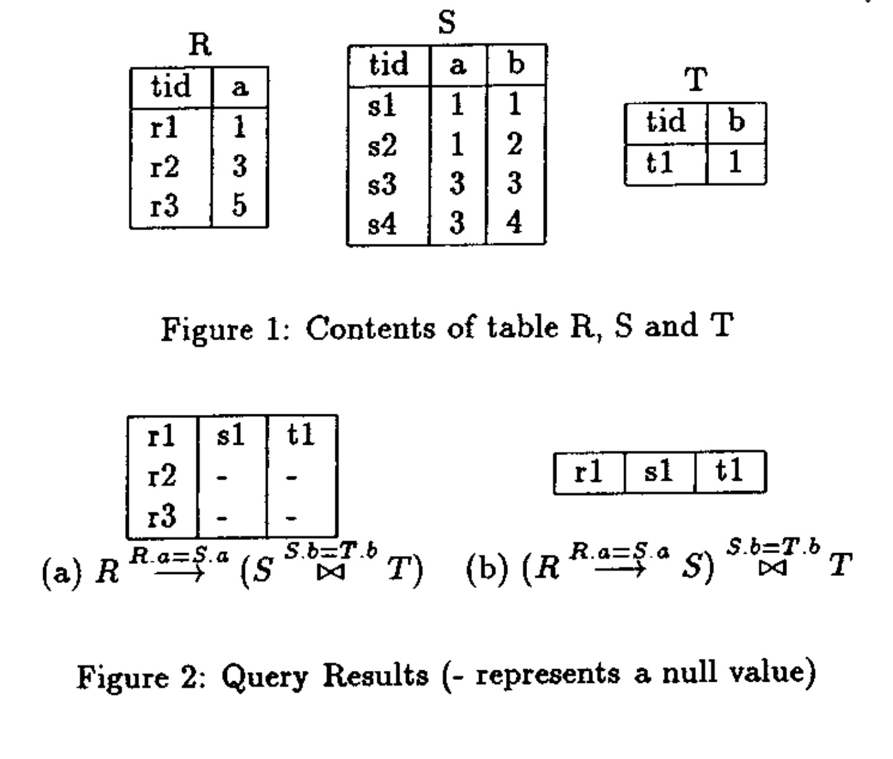
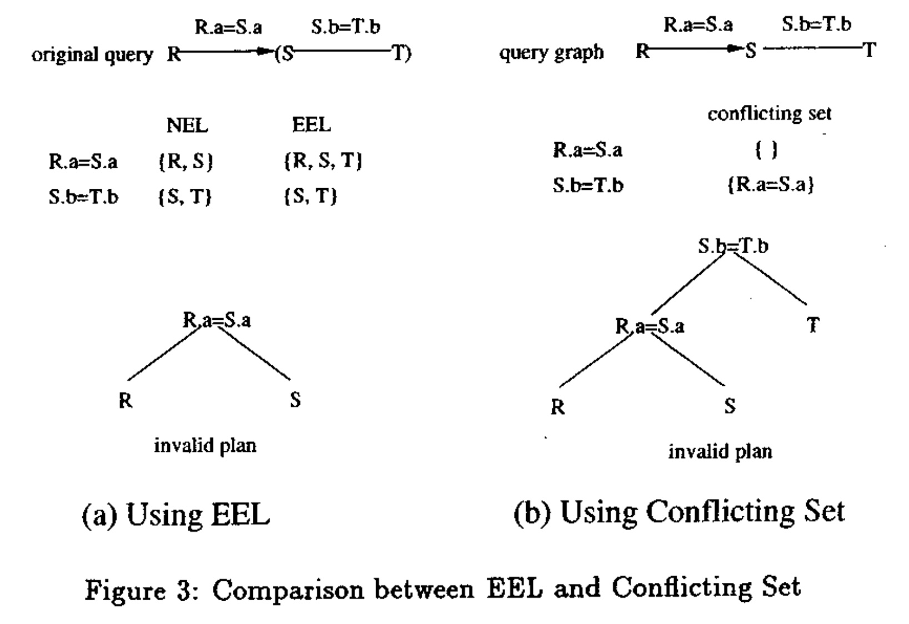
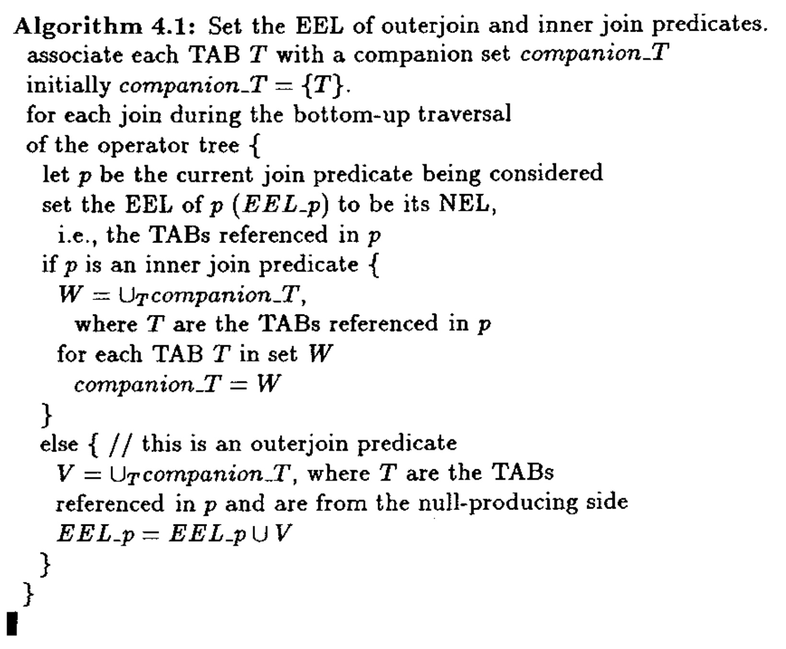
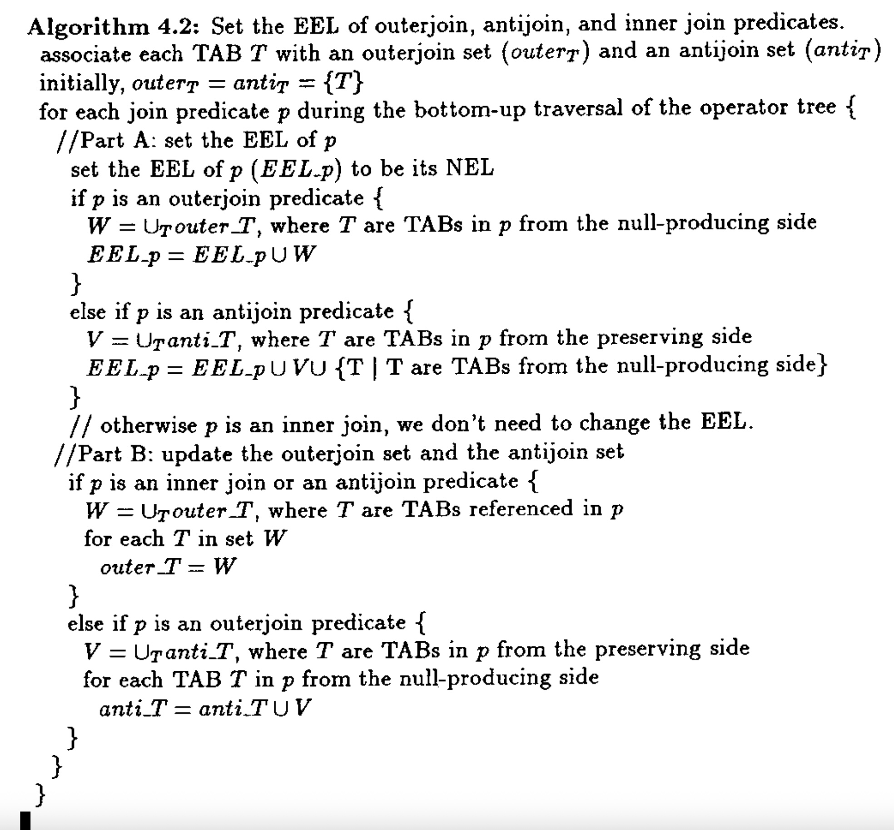
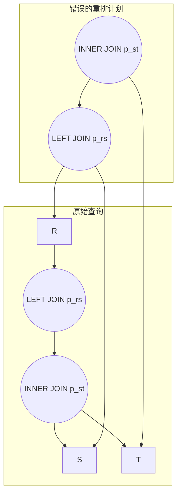
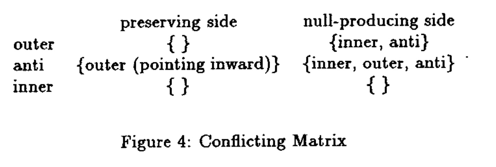
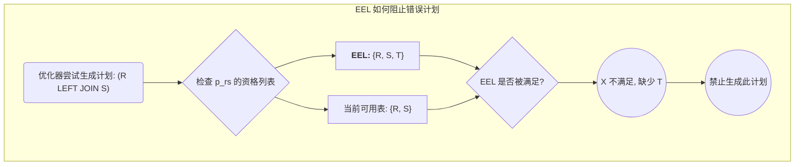

## AI论文解读 | Using Eels, A Practical Approach To Outerjoin And Antijoin Reordering
        
### 作者        
digoal        
        
### 日期        
2025-10-08        
        
### 标签        
PostgreSQL , PolarDB , DuckDB , AI , 论文解读        
        
----        
        
## 背景  
      
https://github.com/lonng/db-papers/blob/main/papers/join-order/using-eels,-a-practical-approach-to-outerjoin-and-antijoin-reordering.pdf        
  
提示:          
```          
读懂《Using Eels, A Practical Approach To Outerjoin And Antijoin Reordering》这篇论文需要提前掌握哪些基础知识, 请使用中文通熟易懂的讲解这些基础知识, 可以引用论文中的图、表或使用Markdown支持的图形(text,mermaid等)增加解释性. 
  
使用中文通熟易懂的解读《Using Eels, A Practical Approach To Outerjoin And Antijoin Reordering》这篇论文, 其中的关键内容请着重讲解, 可以引用论文中的图、表或使用Markdown支持的图形(text,mermaid等)增加解释性. 
  
提取《Using Eels, A Practical Approach To Outerjoin And Antijoin Reordering》这篇论文中的重要术语, 使用中文对这些术语进行通熟易懂的讲解, 可以引用论文中的图、表或使用Markdown支持的图形(text,mermaid等)增加解释性. 
```     
  
## 1 前置知识 
  
好的，为了能顺利读懂《Using EELS, a Practical Approach to Outerjoin and Antijoin Reordering》这篇论文，你需要掌握一些数据库领域的基础知识。下面我将用通俗易懂的中文，并结合论文中的图表示例，为你讲解这些必备知识。

### 1\. 核心概念: 数据库中的三种“连接”(Join)操作

数据库中的“连接”(Join)操作，顾名思义，就是将两个或多个表中的数据按照一定的条件组合在一起 。这篇论文主要讨论三种连接方式。

#### 1.1 内连接 (Inner Join)

这是最常见的连接方式。它只返回两个表中“匹配成功”的行 。

  * **例子**: 假设有`部门表(department)`和`员工表(employee)`，内连接会返回所有有员工的部门以及对应的员工信息。如果一个部门没有任何员工，那么这个部门的信息将不会出现在结果中 。

#### 1.2 外连接 (Outer Join)

外连接是内连接的扩展，它会保留某一个表（或两个表）中所有的数据，即使在另一个表中没有匹配的项 。

  * **左外连接 (Left Outer Join)**: 保留左边表的所有行。如果在右表中没有匹配项，则右表对应的列会用 `NULL` (空值)填充 。
  * **论文中的例子**:
    ```sql
    SELECT department.dname, employee.ename
    FROM department LEFT JOIN employee
    ON department.no = employee.dno
    ```
    这个查询会列出所有部门的名称 。对于那些没有员工的部门，`employee.ename` 这一列会显示为 `NULL` 。

#### 1.3 反连接 (Anti Join)

反连接返回左表中那些在右表中**找不到**任何匹配项的行 。

  * **论文中的例子**: 如何列出所有没有员工的部门？
      * **原始SQL查询 (使用 `NOT EXISTS`)**:
        ```sql
        SELECT department.dname
        FROM   department
        WHERE  NOT EXISTS (SELECT * FROM employee
                           WHERE department.no = employee.dno)
        ```
      * **转换为反连接**:
        ```sql
        SELECT department.dname
        FROM   department ANTIJOIN employee
        ON     department.no = employee.dno
        ```
    这两种写法效果相同，都是找出在`employee`表中不存在对应记录的`department` 。反连接是数据库内部优化这种查询的一种重要方式 。

### 2\. 关键问题: 查询优化与连接重排序 (Query Optimization & Join Reordering)

当你向数据库发送一条包含多个连接的SQL查询时，数据库并不会傻瓜式地按照你写的顺序去执行。它会尝试找到一个最高效的执行顺序，这个过程叫做**查询优化** 。

  * **为什么需要重排序？**
    对于内连接，连接的顺序可以任意交换，结果都一样（例如 `A JOIN B JOIN C` 和 `C JOIN A JOIN B` 结果相同）。优化器会选择一个计算成本最低的顺序 。比如先连接两个小表，再把结果和一张大表连接，通常比一开始就用大表进行连接要快得多。

  * **外连接和反连接带来的挑战**
    与内连接不同，外连接和反连接的顺序**不能随意交换**，否则可能导致结果错误 。

      * **论文中的关键冲突示例**: 论文明确指出 `R LEFT JOIN (S INNER JOIN T)` 的结果与 `(R LEFT JOIN S) INNER JOIN T` 的结果是**不等价**的 。

      * **直观解释与图解**: 让我们用论文中的 **Figure 1** 和 **Figure 2** 来理解这个冲突 。    

          * **原始数据 (Figure 1)**:

            ```mermaid
            graph TD
                subgraph R
                    r1(tid:r1, a:1)
                    r2(tid:r2, a:3)
                    r3(tid:r3, a:5)
                end
                subgraph S
                    s1(tid:s1, a:1, b:1)
                    s2(tid:s2, a:1, b:2)
                    s3(tid:s3, a:3, b:3)
                    s4(tid:s4, a:3, b:4)
                end
                subgraph T
                    t1(tid:t1, b:1)
                end
            ```

          * **正确的顺序 `R LEFT JOIN (S INNER JOIN T)`**:

            1.  先计算 `S INNER JOIN T` (条件 `S.b=T.b`)。只有 `s1` 和 `t1` 匹配，结果是 `{s1, t1}`。
            2.  再计算 `R LEFT JOIN {s1, t1}` (条件 `R.a=S.a`)。
                  * `r1` (a=1) 能匹配上 `{s1, t1}` 中的 `s1` (a=1)，所以结果是 `{r1, s1, t1}`。
                  * `r2` (a=3) 匹配不上。
                  * `r3` (a=5) 匹配不上。
            3.  因为是左外连接，`r2` 和 `r3` 必须保留，所以最终结果如图 2(a) 所示: `{r1,s1,t1}`, `{r2,NULL,NULL}`, `{r3,NULL,NULL}` 。

          * **错误的顺序 `(R LEFT JOIN S) INNER JOIN T`**:

            1.  先计算 `R LEFT JOIN S` (条件 `R.a=S.a`)。
                  * `r1` (a=1) 匹配 `s1` 和 `s2`。
                  * `r2` (a=3) 匹配 `s3` 和 `s4`。
                  * `r3` (a=5) 匹配不上，保留 `r3`，S表部分为NULL。
            2.  再将上面的结果 `INNER JOIN T` (条件 `S.b=T.b`)。只有 `s1` (b=1) 能和 `t1` (b=1) 匹配上。
            3.  最终结果只有 `{r1,s1,t1}`，如图 2(b) 所示 。`r2` 和 `r3` 的信息丢失了！

    这个问题就是这篇论文要解决的核心：**如何在不改变查询结果的前提下，对外连接和反连接进行安全的重排序，以找到最优的执行计划。**

### 3\. 理解论文方法的基础: "资格列表"

为了解决上述问题，优化器需要一种机制来判断哪些重排序是“合法”的。论文提出的 EEL 方法就是基于“资格列表”这个概念。

#### 3.1 普通资格列表 (Normal Eligibility List - NEL)

这是一个很简单的概念：一个连接条件（在SQL里叫谓词，Predicate）能够被应用，当且仅当这个条件所引用的所有表都已经出现在当前的连接计划中 。

  * **例子**: 对于条件 `R.a = S.a`，它的 NEL 就是 `{R, S}` 。优化器只有在已经连接了 R 和 S 之后，或者准备连接 R 和 S 时，才能使用这个条件。

#### 3.2 论文的核心思想: 扩展资格列表 (Extended Eligibility List - EEL)

论文认为，仅仅使用 NEL 不足以处理外连接和反连接的复杂性。因此，他们提出了**扩展资格列表 (EEL)** 。

  * **EEL 是什么？** EEL 不仅包含谓词本身引用的表 (NEL)，还包含了为了**保证语义正确性**而必须先加入进来的**其他表** 。

  * **用上面的例子解释EEL**:

      * 查询是 `R LEFT JOIN (S INNER JOIN T)`。
      * 谓词 `p_rs` 是 `R.a=S.a`，它的NEL是 `{R, S}`。
      * 谓词 `p_st` 是 `S.b=T.b`，它的NEL是 `{S, T}`。

    我们已经知道，`S INNER JOIN T` 必须在 `R LEFT JOIN ...` 之前完成。这意味着，当我们要应用 `R LEFT JOIN S` 这个操作时，表 `T` 必须已经在场了。

    因此，论文的方法会将谓词 `p_rs` (`R.a=S.a`) 的 EEL 设置为 `{R, S, T}` 。

  * **EEL 如何工作 (参考论文 Figure 3(a))**:    

    1.  优化器在开始时，拥有三个独立的表 R, S, T。
    2.  它尝试将 R 和 S 连接起来，需要使用谓词 `p_rs` (`R.a=S.a`)。
    3.  优化器检查 `p_rs` 的 EEL，发现是 `{R, S, T}`。
    4.  当前计划中只有 R 和 S，缺少 T。
    5.  因此，优化器**禁止**了这个操作，从而避免了产生错误计划 `(R LEFT JOIN S)`。

    

    ```mermaid
    graph TD
        subgraph "论文EEL方法如何阻止错误计划"
            A(尝试连接 R 和 S) --> B{"使用谓词 p_rs (R.a=S.a)"};
            B --> C{检查 p_rs 的EEL};
            C --> D["EEL = {R, S, T}"];
            D --> E{当前计划中是否包含 R, S, T?};
            E --> F[否, 只包含 R 和 S];
            F --> G[X 禁止该连接];
        end
    ```

### 总结

在阅读这篇论文之前，你需要牢固掌握以下几点：

1.  **三种Join的区别**：Inner Join, Outer Join, Anti Join 的基本功能和语义。
2.  **优化的核心动机**：数据库通过重排连接顺序来提升查询性能。
3.  **外连接/反连接的难题**：它们的顺序不能随意改变，否则会产生错误结果，核心在于**结合律(associativity)不成立** 。
4.  **论文的切入点**：通过扩展谓词的“资格列表”(从NEL到EEL)，为优化器提供额外信息，使其在重排序时能够“知道”哪些顺序是安全的，从而在保证结果正确的前提下，探索更多的可能性以找到最优计划。

掌握了这些基础知识后，你就能更好地理解论文中提出的算法（如 Algorithm 4.1 和 4.2）是如何计算 EEL，以及“有补偿(with compensation)”和“无补偿(without compensation)”两种策略的具体含义了。

    
  
## 2 解读论文 
  
好的，我们来通俗易懂地解读这篇数据库优化领域的经典论文：《Using EELS, a Practical Approach to Outerjoin and Antijoin Reordering》。

### 论文精解：《使用EELs：一种实用的Outerjoin和Antijoin重排序方法》

想象一下，你正在用乐高积木搭建一个复杂的模型，说明书上写着必须先拼好A和B，再把它们与C组合。但你发现，如果先拼B和C，可能会更快。对于数据库查询来说，这个“拼装顺序”就是“连接顺序 (Join Order)”，找到最快的顺序是数据库优化器的核心任务之一。

#### 1\. 背景：为什么Join重排序这么重要，又这么难？

数据库在执行SQL查询时，尤其是涉及多个表的查询，不同的连接顺序可能导致执行效率相差成百上千倍 。

  * **对于内连接 (INNER JOIN):** 这就像做加法，顺序无关紧要 `(A + B) + C` 和 `A + (B + C)` 结果一样。优化器可以自由地尝试所有组合，选择成本最低的方案 。

  * **对于外连接 (OUTER JOIN) 和反连接 (ANTIJOIN):** 情况变得复杂。这两种连接的顺序不是随便能换的，否则会得到错误的结果 。

      * **Outer Join (外连接):** 比如 `LEFT JOIN`，它会保留左边表的所有行，即使右边没有匹配项。
      * **Antijoin (反连接):** 通常用于 `NOT EXISTS` 子句，它会保留左边表中，在右边表中*找不到*匹配项的行 。

一个经典的错误重排例子 ：
`R LEFT JOIN (S INNER JOIN T)` **不等于** `(R LEFT JOIN S) INNER JOIN T`

这就好比一个规定：你必须先在S和T中找到所有匹配的组合，然后R再去找这个组合匹配。如果你先让R和S匹配，一些在S中本来能和T匹配上的行，可能因为没和R匹配上而被提前丢弃了，导致最终结果错误。

由于这种复杂性，很多商业数据库干脆就放弃了对外连接和反连接进行复杂的重排序，或者只支持非常有限的重排 ，这往往导致查询性能不佳。

**这篇论文的目标：** 提出一种既通用又实用的方法，让优化器能够智能、安全地对包含`INNER JOIN`、`OUTER JOIN`和`ANTIJOIN`的复杂查询进行重排序。

-----

#### 2\. 核心思想：扩展资格列表 (Extended Eligibility Lists - EEL)

为了理解EEL，我们首先要了解一个基本概念：

  * **普通资格列表 (Normal Eligibility List - NEL):** 这是优化器里的一个基本规则。一个连接条件（比如 `R.a = S.a`）只有在它所引用的所有表（这里是 `R` 和 `S`）都已经被计算出来之后，才能被使用 。

论文的核心创新就是**扩展**这个列表。

  * **扩展资格列表 (Extended Eligibility List - EEL):** EEL认为，一个连接条件要能被正确使用，除了需要它直接引用的表之外，可能还需要一些**间接相关**的表也必须在场 。这些间接相关的表是为了保证查询的原始语义不被破坏。

我们用论文中的一个例子来解释（见下图，改编自论文Figure 3）：   

**原始查询:** `R LEFT JOIN (S INNER JOIN T)`

  * 连接条件1 (`p_rs`): `R.a=S.a` (这是一个 `LEFT JOIN`)
  * 连接条件2 (`p_st`): `S.b=T.b` (这是一个 `INNER JOIN`)




这个错误的计划试图先执行 `R LEFT JOIN S`，这是不行的。EEL如何阻止这个错误呢？

  * **NEL分析:**

      * `p_rs` 的 NEL 是 `{R, S}`。
      * `p_st` 的 NEL 是 `{S, T}`。
      * 如果只看NEL，优化器会认为先连接R和S是可行的，因为它们的NEL `{R, S}` 已经满足。

  * **EEL分析:**

      * `p_st` 是个普通的`INNER JOIN`，它的EEL和NEL一样，还是 `{S, T}`。
      * `p_rs` 是个`LEFT JOIN`，它在`S`这一侧（我们称之为“产出NULL的一侧”）有一个`INNER JOIN` (`p_st`)。根据重排序规则，这个`INNER JOIN`不能被随意移动到`LEFT JOIN`的外面。因此，为了保证`p_rs`的正确性，`p_st`所依赖的表`T`也必须在场。
      * 所以，`p_rs`的**EEL被扩展为 `{R, S, T}`** 。

**EEL如何工作：** 当优化器尝试生成 `(R LEFT JOIN S)` 这个子计划时，它会检查 `p_rs` 的EEL。它发现EEL是 `{R, S, T}`，而当前只有 `R` 和 `S`，缺少 `T`。因此，这个非法的连接计划就被**直接禁止**了 。

-----

#### 3\. 关键技术：如何计算EEL（无补偿重排序）

论文提出了一套算法，通过一次遍历原始查询树来计算出所有连接条件的EEL。这个过程可以分为两个阶段。

##### 阶段一：只处理 Outer Join 和 Inner Join (Algorithm 4.1)   

算法的核心是引入一个概念叫**伙伴集 (Companion Set)** 。     

  * **伙伴集：** 通过`INNER JOIN`紧密连接在一起的表的集合 。例如，如果`S INNER JOIN T`，那么S和T就在同一个伙伴集里。如果`U`再`INNER JOIN`它们的结果，那么`S, T, U` 都在一个伙伴集里。

  * **EEL计算规则:**

    1.  对于`INNER JOIN`的条件，它的EEL就是它的NEL。
    2.  对于`OUTER JOIN`的条件，它的EEL = 它的NEL + 它在“产出NULL的一侧”的表的所有伙伴集 。

回到刚才的例子 `R LEFT JOIN (S INNER JOIN T)`：

1.  首先处理 `S INNER JOIN T`。S和T通过`INNER JOIN`连接，它们的伙伴集是 `{S, T}`。
2.  再处理 `R LEFT JOIN ...`。`S`在产出NULL的一侧，它的伙伴集是 `{S, T}`。
3.  `p_rs`的NEL是 `{R, S}`。
4.  因此，`p_rs`的EEL = `{R, S}` (NEL) U `{S, T}` (S的伙伴集) = `{R, S, T}`。

##### 阶段二：同时处理 Outer Join, Antijoin, 和 Inner Join (Algorithm 4.2)

当`ANTIJOIN`加入后，依赖关系变得更复杂。论文用一个**冲突矩阵 (Conflicting Matrix)**  来总结这些规则。    

| 连接类型 | 保留侧 (Preserving Side) 的冲突 | 产出NULL侧 (Null-producing Side) 的冲突 |
| :--- | :--- | :--- |
| **Outer Join** | 无 | `INNER`, `ANTI` |
| **Antijoin** | `OUTER` (箭头指向自己时) | `INNER`, `OUTER`, `ANTI` |
| **Inner Join** | 无 | 无 |

  

图: 冲突关系矩阵 (改编自论文Figure 4) 

这个矩阵告诉我们，一个连接（比如`Antijoin`）会和它某一侧的其他类型的连接产生“冲突”，这意味着在计算EEL时必须考虑这些冲突连接所涉及的表。算法4.2引入了 `outerjoin set` 和 `antijoin set` 来系统地处理这些复杂的依赖关系，并正确地计算出EEL 。

**这一阶段的核心思想是：只允许那些绝对安全的、不需要任何“补救措施”的重排序发生。**

-----

#### 4\. 进阶技术：带补偿重排序 (Reordering with Compensation)

这是论文提出的更激进、更强大的优化策略。

**动机：** 有时候，一个“不安全”的连接顺序虽然在逻辑上是错误的，但它的执行成本可能极低（例如，一个巨大的表先和一个非常小的表连接）。如果我们能先按这个低成本的顺序执行，然后再通过某种方式“补偿”或“修复”错误的结果，最终可能获得比任何“安全”顺序都快得多的性能 。

**如何补偿？**
论文提出的方法是 **“空值化和最佳匹配 (Nullification and Best Match)”** 。

1.  **执行“错误”的连接：** 比如强行先执行 `(R LEFT JOIN S)`。这可能会错误地丢掉一些本应保留的R的行。
2.  **补偿操作：**
      * **空值化 (Nullification):** 识别出那些因为错误顺序而被过滤掉的、本应保留的行。
      * **最佳匹配 (Best Match):** 将这些被“拯救”回来的行，与后续的连接结果进行匹配，或者用NULL来填充，最终恢复出正确的结果。

这种方法比之前工作中提到的“广义外连接 (Generalized Outerjoin)”更灵活，因为它允许将多个补偿操作合并，或者推迟到更晚的阶段执行，这给了优化器更大的选择空间 。

**好比：**

  * **无补偿方法**：像一个谨慎的工人，严格按照说明书的每一步操作，保证绝不出错，但可能效率不高。
  * **带补偿方法**：像一个经验丰富的工人，他发现一个捷径（虽然会暂时弄乱一些东西），但他有办法在最后把所有东西都完美修复。这个捷径可能让整体工作时间大大缩短。

-----

#### 5\. 论文的贡献与总结

1.  **提出了EEL的概念：** 这是一个简洁而强大的机制，能将复杂的连接重排序规则编码成优化器易于检查的“表列表” 。
2.  **统一了三种连接的重排序：** 首次在一个统一的框架下，同时处理了`INNER JOIN`、`OUTER JOIN`和`ANTIJOIN`的重排序问题 。
3.  **解决了诸多实际问题：** EEL框架可以轻松处理多于两个表的连接条件（超谓词）、笛卡尔积等在现实世界中常见但之前理论很难处理的问题 。
4.  **提出了两阶段实现方案：**
      * **无补偿方法：** 相对容易实现，可以快速集成到现有优化器中，提供“安全”的重排序能力 。
      * **带补偿方法：** 实现更复杂，但为优化器提供了更大的自由度，有可能找到性能更好的查询计划 。

总而言之，这篇论文提供了一个非常实用且强大的理论框架，解决了长期以来困扰数据库优化器的连接重排序难题。它的思想被工业界广泛采纳，例如论文中提到，该技术正在被当时的IBM DB2数据库服务器实现 。
  
## 3 术语 
  
好的，我们来一起梳理《Using Eels, A Practical Approach To Outerjoin And Antijoin Reordering》这篇论文中的核心术语，并用通俗易懂的方式进行讲解。

### 论文核心术语详解

以下是理解这篇论文思想精髓的关键术语：

#### 1\. 三种基本连接 (Join) 类型

在数据库中，“连接”操作就是将两个或多个表中的数据根据某些条件组合在一起 。这篇论文主要讨论了三种连接：

  * **内连接 (Inner Join):** 这是最常见的连接方式。它只返回两个表中相互匹配的行，任何在另一个表中找不到匹配项的行都会被丢弃 。可以理解为取两个集合的“交集”。

  * **外连接 (Outerjoin):** 外连接会保留其中一个表（或两个表）的所有行，即使在另一个表中没有匹配项。对于没有匹配的行，会用`NULL`值来填充 。

      * **左外连接 (Left Outerjoin):** 保留左表的所有行。
      * **右外连接 (Right Outerjoin):** 保留右表的所有行。
      * **全外连接 (Full Outerjoin):** 保留两个表的所有行。

  * **反连接 (Antijoin):** 这种连接通常用于实现 SQL 中的 `NOT EXISTS` 或 `NOT IN`。它会返回左表中，在右表中完全*找不到*任何匹配项的行 。可以理解为取两个集合的“差集”。

#### 2\. 连接重排序 (Join Reordering)

这是数据库查询优化中的核心技术。一个涉及多个表连接的查询，其执行顺序可以有多种组合。不同的顺序可能导致执行效率天差地别 。优化器的目标就是找到成本最低（最快）的那个连接顺序。

  * **对于内连接：** 重排序是自由的，因为内连接满足结合律，`  (A join B) join C ` 和 `A join (B join C)` 的结果是一样的。
  * **对于外连接和反连接：** 重排序是受限的，因为它们不总是满足结合律 。随意的重排会导致查询结果错误。这正是本文要解决的核心难题。

#### 3\. 资格列表 (Eligibility List)

这是优化器决定何时可以应用某个连接条件的基础。

  * **普通资格列表 (Normal Eligibility List - NEL):** 一个连接条件（如 `R.a = S.a`）的 NEL 仅包含它直接引用的所有表（这里是 `{R, S}`） 。优化器只有在集齐了 NEL 中的所有表之后，才能使用这个条件。

  * **扩展资格列表 (Extended Eligibility List - EEL):** 这是本文最核心的创新。EEL 在 NEL 的基础上，加入了为了保证查询语义正确性而**必须**存在的其他“间接”相关的表 。它告诉优化器：“要想使用我这个连接条件，除了我直接引用的表，你还得先把另外几个表也准备好，否则结果就会出错。”

我们用论文中的经典例子来说明（改编自论文 Figure 3）：    
**查询:** `R LEFT JOIN (S INNER JOIN T)`

  * 连接 `p_rs` (`R.a=S.a`) 的 NEL 是 `{R, S}`。
  * 但是，由于 `S` 在 `LEFT JOIN` 的“产出NULL侧”，并且它还与 `T` 有一个 `INNER JOIN`，这个 `INNER JOIN` 不能被随意移动。
  * 因此，为了保证 `p_rs` 的正确性，表 `T` 必须在场。
  * 所以，`p_rs` 的 **EEL** 被扩展为 **`{R, S, T}`** 。




通过这种方式，EEL 机制有效地阻止了会导致错误结果的非法连接顺序。

#### 4\. 冲突规则 (Conflicting Rules)

论文总结了不同类型的连接在相邻时可能产生的“冲突”，这些冲突是导致不能随意重排序的根本原因 。论文用一个冲突矩阵（Figure 4）清晰地展示了这些关系 ：    

| 连接类型 | 保留侧 (Preserving Side) 的冲突 | 产出NULL侧 (Null-producing Side) 的冲突 |
| :--- | :--- | :--- |
| **Outer Join** | 无 | `INNER`, `ANTI` |
| **Antijoin** | `OUTER` (当箭头指向自己时) | `INNER`, `OUTER`, `ANTI` |
| **Inner Join** | 无 | 无 |

这个矩阵是计算 EEL 的理论基础。例如，第一行表示，一个 `Outer Join` 和它“产出NULL侧”的 `Inner Join` 或 `Antijoin` 存在冲突 ，因此计算 EEL 时需要将这些冲突连接涉及的表包含进来。

#### 5\. 伙伴集 (Companion Set)

这是论文在算法中提出的一个辅助概念，用于简化 EEL 的计算 。

  * **定义：** 通过一个或多个**内连接 (Inner Join)** 直接或间接连接在一起的所有表的集合 。
  * **作用：** 在计算某个 `Outer Join` 的 EEL 时，我们只需要找到它“产出NULL侧”的表，然后将这些表的整个伙伴集都加入到 EEL 中，就可以一次性地把所有相关的、通过内连接“绑定”在一起的表都考虑进来。

#### 6\. 两种重排序策略

论文提出了一个可以分两步走的实现框架：

  * **无补偿重排序 (Reordering without Compensation):** 这是比较保守和安全的策略。优化器严格遵守 EEL 的约束，只生成那些 100% 合法、不需要任何后续修正的连接顺序 。这种方法实现相对简单，能保证结果正确 。

  * **带补偿重排序 (Reordering with Compensation):** 这是一种更激进、更灵活的策略。它允许优化器为了追求极致性能而**暂时采用一个逻辑上不合法的连接顺序**，然后在后续步骤中通过“补偿”操作来修复结果 。

      * **补偿操作：** 通常包括“空值化 (Nullification)”和“最佳匹配 (Best Match)”等步骤，其目的是将被错误顺序过滤掉的行“拯救”回来，并修正其数据，使其与最终正确结果一致。
      * **优势：** 这种方法给了优化器更大的选择空间，有可能找到比任何合法顺序都快得多的执行计划 。
  
## 参考        
         
https://github.com/lonng/db-papers/blob/main/papers/join-order/using-eels,-a-practical-approach-to-outerjoin-and-antijoin-reordering.pdf    
        
<b> 以上内容基于DeepSeek、Qwen、Gemini及诸多AI生成, 轻微人工调整, 感谢杭州深度求索人工智能、阿里云、Google等公司. </b>        
        
<b> AI 生成的内容请自行辨别正确性, 当然也多了些许踩坑的乐趣, 毕竟冒险是每个男人的天性.  </b>        
  
    
#### [期望 PostgreSQL|开源PolarDB 增加什么功能?](https://github.com/digoal/blog/issues/76 "269ac3d1c492e938c0191101c7238216")
  
  
#### [PolarDB 开源数据库](https://openpolardb.com/home "57258f76c37864c6e6d23383d05714ea")
  
  
#### [PolarDB 学习图谱](https://www.aliyun.com/database/openpolardb/activity "8642f60e04ed0c814bf9cb9677976bd4")
  
  
#### [PostgreSQL 解决方案集合](../201706/20170601_02.md "40cff096e9ed7122c512b35d8561d9c8")
  
  
#### [德哥 / digoal's Github - 公益是一辈子的事.](https://github.com/digoal/blog/blob/master/README.md "22709685feb7cab07d30f30387f0a9ae")
  
  
#### [About 德哥](https://github.com/digoal/blog/blob/master/me/readme.md "a37735981e7704886ffd590565582dd0")
  
  

  
