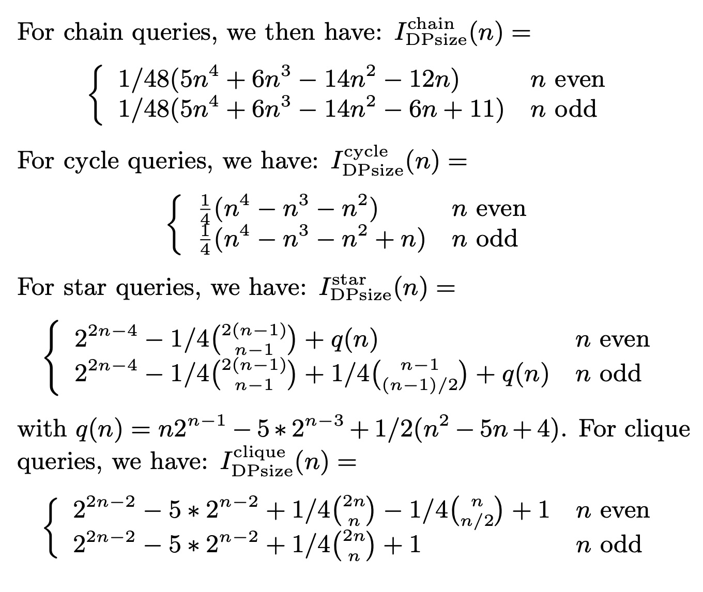

## AI论文解读 | Analysis Of Two Existing And One New Dynamic Programming Algorithm For The Generation Of Optimal Bushy Join Trees Without Cross Products
        
### 作者        
digoal        
        
### 日期        
2025-10-08        
        
### 标签        
PostgreSQL , PolarDB , DuckDB , AI , 论文解读        
        
----        
        
## 背景  
      
https://www.researchgate.net/publication/47861835_Analysis_of_Two_Existing_and_One_New_Dynamic_Programming_Algorithm_for_the_Generation_of_Optimal_Bushy_Join_Trees_without_Cross_Products        
  
提示:          
```          
读懂《Analysis Of Two Existing And One New Dynamic Programming Algorithm For The Generation Of Optimal Bushy Join Trees Without Cross Products》这篇论文需要提前掌握哪些基础知识, 请使用中文通熟易懂的讲解这些基础知识, 可以引用论文中的图、表或使用Markdown支持的图形(text,mermaid等)增加解释性. 
  
使用中文通熟易懂的解读《Analysis Of Two Existing And One New Dynamic Programming Algorithm For The Generation Of Optimal Bushy Join Trees Without Cross Products》这篇论文, 其中的关键内容请着重讲解, 可以引用论文中的图、表或使用Markdown支持的图形(text,mermaid等)增加解释性. 
  
提取《Analysis Of Two Existing And One New Dynamic Programming Algorithm For The Generation Of Optimal Bushy Join Trees Without Cross Products》这篇论文中的重要术语, 使用中文对这些术语进行通熟易懂的讲解, 可以引用论文中的图、表或使用Markdown支持的图形(text,mermaid等)增加解释性. 
```     
  
## 1 前置知识 
  
好的，为了能透彻理解这篇关于数据库连接顺序优化的论文《Analysis Of Two Existing And One New Dynamic Programming Algorithm For The Generation of Optimal Bushy Join Trees without Cross Products》，您需要先掌握一些核心的基础知识。下面我将用中文为您通俗地讲解这些概念，并结合论文中的图表进行说明。

### 1\. 数据库查询优化 (Query Optimization)

想象一下，你问数据库一个问题：“请找出所有在A城市、购买了B商品、并且在C商店消费的顾客信息。” 数据库为了回答你这个问题，需要访问好几张表（比如顾客表、商品表、订单表、商店表），然后把这些表按照你的要求“连接”起来。

完成这个任务可以有很多种方法和顺序。比如，可以先找出所有在A城市的顾客，再看他们买了什么；也可以先找出所有卖出了B商品的订单，再筛选顾客所在城市。不同的执行路径，其效率可能天差地别，有的可能几秒钟就完成，有的则可能需要几个小时。

**查询优化** 的目标就是，在所有可能的执行路径中，找到一条成本最低、速度最快的路径。这篇论文的核心，就是研究如何高效地找出这个最佳路径，特别是针对其中最复杂的问题——**连接顺序**。如论文引言中所说，基于成本的查询优化器是数据库管理系统整体性能的关键组成部分 。

### 2\. 连接顺序问题 (Join Order Problem)

这是查询优化中最核心、最难的问题之一 。假设你需要连接 R1, R2, R3, R4 四张表，你可以：

  * 先连接 R1 和 R2，得到一个中间结果，再与 R3 连接，最后与 R4 连接。
  * 也可以先连接 R3 和 R4，得到一个中间结果，再与 R2 连接，最后与 R1 连接。
  * 还可以先分别连接 (R1, R2) 和 (R3, R4)，然后将这两个中间结果连接起来。

随着表数量的增加，可能的连接顺序会呈指数级增长，想从中找到最优解非常困难。

### 3\. 查询计划树 (Query Plan Tree)

为了直观地表示连接顺序，我们通常使用“树”形结构，称为查询计划树。论文中主要讨论**浓 bushy tree**（也称“ bushy tree”） 。

  * **左深树 (Left-deep tree)**：一种简单的结构，每次连接都将前一个连接的中间结果与一张新表进行连接。形态上像一根向左倾斜的藤蔓。
  * **浓 bushy tree (Bushy tree)**：一种更通用的结构，它允许任意两个中间结果进行连接。形态上更像一棵茂盛的灌木。

浓 bushy tree 提供了更广泛的优化可能性，但也使得寻找最优解的搜索空间变得异常庞大。这篇论文研究的算法，目标就是高效地在浓 bushy tree 的空间里寻找最优解。


### 4\. 查询图 (Query Graph)

为了简化问题，优化器会将一个查询转换成一个“查询图”。在这个图中：

  * **节点 (Node)** 代表一张表（论文中称为关系 Relation）。
  * **边 (Edge)** 代表这两张表之间存在连接条件（比如 `table1.id = table2.id`）。

论文的分析是基于不同形态的查询图展开的，因为算法的性能在不同图结构上差异巨大 。论文重点分析了以下四种典型的图：

  * **链式查询 (Chain Query)**：表像链条一样依次连接。 (R1-R2-R3-R4)
  * **环形查询 (Cycle Query)**：表首尾相连，形成一个环。 (R1-R2-R3-R4-R1)
  * **星形查询 (Star Query)**：一个中心表与其他所有表连接。 (R1连接R2, R1连接R3, R1连接R4)
  * **团式查询 (Clique Query)**：任意两张表之间都存在连接。

<!-- end list -->

```text
链式 (Chain)      星形 (Star)        环形 (Cycle)       团式 (Clique)
  R1--R2            R2               R1--R2             R1--R2
  |               |                |   |              | \/ |
  R3--R4          R1--R3             R4--R3             | /\ |
                    |                                 R3--R4
                    R4
```

理解这些图的结构至关重要，因为论文中的两个现有算法 `DPsize` 和 `DPsub` 在不同结构上表现有好有坏。例如，`DPsize` 在链式查询上表现优异，但在星形和团式查询上则很差；`DPsub` 则正好相反 。

### 5\. 动态规划 (Dynamic Programming)

动态规划是解决连接顺序问题的经典方法 。其核心思想是 **“自底向上”** 地解决问题：

1.  首先，找到访问单张表的最佳方式（这是最简单的子问题）。
2.  然后，利用上一步的结果，找到连接任意**两**张表的最佳顺序。
3.  接着，利用已有结果，找到连接任意**三**张表的最佳顺序。
4.  依此类推，直到找到连接所有 n 张表的最终最优计划。

这种方法通过保存和复用子问题的最优解，避免了重复计算。论文中讨论的三个算法 `DPsize`, `DPsub`, 和新的 `DPccp` 都是基于动态规划的。        

  * **DPsize 算法**（如图1所示 ）是按“大小 (size)”来构建计划的，即先生成所有大小为2的计划，然后是大小为3的，以此类推 。  
  * **DPsub 算法**（如图2所示 ）是按“子集 (subset)”来构建的，它会遍历所有可能的表集合，并为每个集合寻找最优计划 。

### 6\. 交叉积 (Cross Product)

当两张表在没有任何连接条件的情况下被连接时，就会产生**交叉积**。结果集会是第一张表中的每一行与第二张表中的每一行的组合，这通常会导致中间结果集变得异常巨大，应极力避免。论文明确指出，生成交叉积会极大地增加搜索空间 ，因此文中的所有算法都致力于生成**没有交叉积**的最优浓 bushy tree 。这意味着任何一次连接，其左右两个子计划所包含的表集合之间必须在查询图中是相互连接的 。

### 7\. 算法复杂度分析与核心计数器

要比较算法的优劣，不能只看实际运行时间，因为这会受机器、系统等多种因素影响。更科学的方法是分析其**时间复杂度**，即计算算法内部核心操作的执行次数。

论文中定义了几个关键的计数器：

  * **InnerCounter**: 记录了算法最内层循环的执行次数 。这个值很大程度上代表了算法的总计算量。
  * **CsgCmpPairCounter**: 记录了算法成功找到一对“合法的”子计划进行连接的次数 。所谓“合法的”，是指这两个子计划对应的表集合本身是连通的，且它们之间也是相互连通的 。这个计数器的值（除以2后）代表了任何正确的动态规划算法都无法避免的、有意义的计算次数的**理论下限** 。

论文的核心贡献之一就是通过数学公式，精确计算出了 `DPsize` 和 `DPsub` 在不同查询图下的 `InnerCounter` 值（见论文第3页和第4页的公式 ），并将其与理论下限 `#ccp` (csg-cmp-pairs 的数量) 进行比较。        

**论文中的图3** 非常直观地展示了这一对比：

| 查询类型 | 节点数 (n) | \#ccp (理论下限) | DPsub (内循环次数) | DPsize (内循环次数) |
| :--- | :--- | :--- | :--- | :--- |
| **Chain** | 20 | 1,330 | 4,193,840 | **17,545** |
| **Star** | 20 | 4,980,736 | 2,323,474,358 | 59,892,991,338 |
| **Clique** | 20 | 1,742,343,625 | **3,484,687,250** | 309,338,182,241 |

从这张表中可以清晰地看到：

  * 对于链式查询，`DPsize` 的计算量 (17,545) 远小于 `DPsub` (约420万)，尽管两者都远高于理论下限 (1,330) 。
  * 对于团式查询，`DPsub` 的计算量 (约35亿) 远小于 `DPsize` (约3093亿)，并且非常接近理论下限 (约17亿) 。
  * 这说明现有算法在很多情况下做了大量无效的“尝试”，即内层循环中的检查大多都失败了 。

这篇论文正是基于这个发现，提出了一个全新的 `DPccp` 算法，该算法的核心思想是只去枚举那些“合法的”连接对 (csg-cmp-pairs)，从而使其计算量直接等于理论下限 `#ccp`，避免了无效的尝试 。

-----

**总结一下，读懂这篇论文您需要掌握：**

1.  **目标**：理解查询优化的核心是解决连接顺序问题。
2.  **表达方式**：知道如何用查询图和查询计划树（特别是浓 bushy tree）来描述问题。
3.  **核心算法**：了解动态规划的基本思想。
4.  **关键约束**：明白为什么要避免交叉积。
5.  **评价标准**：懂得论文是如何通过分析 `InnerCounter` 和 `#ccp` 来量化比较不同算法性能的。

掌握了这些基础知识后，您就可以更轻松地理解论文中对 `DPsize` 和 `DPsub` 算法的深入分析，以及为何新提出的 `DPccp` 算法是更优越的解决方案。
  
## 2 解读论文 
  
好的，这篇论文《Analysis Of Two Existing And One New Dynamic Programming Algorithm For The Generation Of Optimal Bushy Join Trees Without Cross Products》是数据库查询优化领域的一篇重要文献。它深入剖析了两种经典的动态规划算法，指出了它们的性能瓶颈，并提出了一种在各种场景下都表现优异的新算法。

下面，我将为您通俗地解读这篇论文的核心内容。

### 核心问题：如何高效地找到最佳的多表连接顺序？

在数据库中，当一个查询需要关联多张表（比如，查询“购买了特定商品、住在特定城市、并且是VIP会员的顾客信息”）时，数据库需要决定先连接哪两张表，再将结果与下一张表连接，以此类推。这个“连接顺序”对查询的执行效率有着天壤之别的影响。

论文研究的目标是在所有可能的“浓 bushy tree”（一种复杂的、但优化潜力更大的连接计划树）中，找到成本最低的连接顺序，同时要避免生成“交叉积”（一种会导致中间数据量爆炸式增长的无效连接）。

### 两种经典算法及其“偏科”问题

论文首先分析了两种广为人知的动态规划算法：`DPsize` 和 `DPsub` 。作者通过理论分析和实验发现，这两种算法都存在严重的“偏科”现象，它们的性能极度依赖于查询的结构，也就是**查询图 (Query Graph)** 的形态 。

查询图是将查询中的表作为节点、表之间的连接关系作为边的图形表示。论文重点研究了四种典型的查询图：

```text
1. 链式 (Chain)      2. 环形 (Cycle)       3. 星形 (Star)        4. 团式 (Clique)
   R1--R2              R1--R2              R2                    R1--R2
   |                 |   |               |                     | \/ |
   R3--R4              R4--R3            R1--R3                  | /\ |
                                           |                     R3--R4
                                           R4
```

#### 1\. DPsize 算法 (Size-Driven Enumeration)

  * **核心思想**：按部就班，从小到大。算法首先生成所有大小为2（即连接2张表）的最优计划，然后利用这些结果生成大小为3的最优计划，以此类推，直到生成连接所有表的最优计划 。
  * **伪代码参考**：论文图1 (Figure 1) 。     
  * **性能特点**：在**链式 (Chain)** 和 **环形 (Cycle)** 查询上表现优异，但在星形和团式查询上性能极差 。

#### 2\. DPsub 算法 (Subset-Driven Enumeration)

  * **核心思想**：枚举所有可能的子集。算法会遍历所有表的非空子集，并为每一个子集寻找最优的连接计划 。
  * **伪代码参考**：论文图2 (Figure 2) 。     
  * **性能特点**：与`DPsize`正好相反，它在**星形 (Star)** 和 **团式 (Clique)** 查询上非常高效，但在链式和环形查询上表现很差 。

#### 关键发现：两种算法都做了大量无用功

论文最核心的洞察在于，**这两种算法在它们不擅长的查询类型上，会花费海量时间去尝试各种无效的连接组合**。

为了量化这一点，作者引入了两个关键概念：

  * **`#ccp` (number of csg-cmp-pairs)**：代表“合法的连接对”的数量。一对子计划是“合法的”，意味着它们各自内部是连通的，它们之间也是连通的，并且互不重叠 。这个数值代表了任何正确的动态规划算法都**必须执行**的有效计算次数的**理论下限** 。
  * **`InnerCounter`**：记录了算法最内层循环的执行次数，代表算法的**总计算量**。

论文的**图3 (Figure 3)** 用数据清晰地揭示了问题所在：     

| 查询类型 | 节点数(n) | `#ccp` (理论下限) | `DPsub` (总计算量) | `DPsize` (总计算量) | 结论 |
| :--- | :--- | :--- | :--- | :--- | :--- |
| **Chain** | 20 | 1,330 | 4,193,840 | **17,545** | `DPsize` 胜出，但仍比下限高一个数量级。 |
| **Star** | 15 | 114,688 | 9,533,170 | 57,305,929 | `DPsub` 胜出，但两者都远高于下限。 |
| **Clique** | 15 | 7,141,686 | **14,283,372** | 307,173,877 | `DPsub` 胜出，且非常接近下限。 |

从表格可以看出，除了在团式查询中 `DPsub` 表现接近完美，在其他大多数情况下，`DPsize` 和 `DPsub` 的总计算量 (`InnerCounter`) 都比理论下限 (`#ccp`) 高出几个数量级 。这说明它们在“生成-测试”的过程中，绝大多数的“测试”都失败了，浪费了宝贵的计算资源 。

### 新算法 DPccp：只做有效计算的“全能选手”

基于以上发现，论文提出了一个全新的、更优越的算法：**`DPccp`**。

  * **核心思想**：直击要害，只枚举“合法的连接对”。`DPccp` 算法的设计目标就是跳过所有无效的尝试，它的主循环直接、高效地枚举图上所有的 `csg-cmp-pairs` 。
  * **伪代码参考**：论文图4 (Figure 4) 。     


通过这种设计，`DPccp` 算法的 `InnerCounter` 值理论上就等于 `#ccp` 。这意味着它基本消除了所有无效的计算，只做最必要的工作。

### 实验结果与结论

论文最后通过实验验证了理论分析的正确性。               

  * **性能对比**：实验结果（如图8到图11所示）表明，`DPccp` 的性能非常稳定 。无论面对哪种查询图，它要么是表现最好的算法，要么也和当时场景下的最优算法性能相当 。   
  * **压倒性优势**：特别是在数据仓库中非常常见的**星形查询**上，`DPccp` 的性能比 `DPsize` 和 `DPsub` 快了几个数量级 。
  * **最终结论**：`DPccp` 算法能够智能地适应查询图的结构，避免了现有算法的“偏科”问题。因此，它应当成为实现查询计划生成器时的首选算法 。

### 总结

这篇论文的价值在于：

1.  **深刻揭示了问题**：首次通过严谨的数学分析和量化对比，指出了 `DPsize` 和 `DPsub` 这两种经典算法在不同查询结构下的性能缺陷。
2.  **找到了问题的根源**：明确了性能瓶颈在于算法产生了大量需要被过滤掉的无效子问题，其计算量远超理论下限 `#ccp`。
3.  **提出了优雅的解决方案**：设计了 `DPccp` 算法，其核心是高效枚举所有“合法的连接对”，从根本上解决了无效计算的问题，使其成为一个在各种场景下都表现出色的“全能”算法。
  
## 3 术语 
  
好的, 这篇论文《Analysis of Two Existing and One New Dynamic Programming Algorithm for the Generation of Optimal Bushy Join Trees without Cross Products》分析了两种现有的和一种新的动态规划算法, 用于生成最优的 bushy (多路) 连接树 (不含笛卡尔积).

以下是从该论文中提取的重要术语及其通俗易懂的中文讲解:

### 1\. 连接顺序优化 (Join Order Optimization)

在数据库中, 当一个查询需要关联多张表 (执行 "join" 操作) 时, 关联这些表的先后顺序会对查询的执行效率产生巨大影响. 连接顺序优化的目标就是找到一个成本最低 (例如执行时间最短或资源消耗最少) 的连接顺序. 这是所有关系型数据库管理系统中最核心和最复杂的问题之一.

### 2\. 连接树 (Join Tree)

连接树是用来表示多表连接顺序的一种数据结构. 树的叶子节点代表参与连接的各个关系 (表), 而内部节点则代表连接操作. 连接树的不同形态代表了不同的连接策略.

  * **左深树 (Left-deep Tree)**: 这是早期算法 (如经典的 System R) 中常用的一种连接树. 它的特点是树的结构总是一边倒, 右子节点永远是单个的数据表.

    ```mermaid
    graph TD
        Join1 --- Join2
        Join1 --- C
        Join2 --- A
        Join2 --- B
    ```

    *上图表示 (A join B) join C, 这是一种典型的左深树结构.*

  * **Bushy Tree (多路连接树)**: 与左深树不同, Bushy Tree 允许其内部节点的左右两个子节点都是另一次连接操作的结果. 这种结构提供了更大的灵活性和潜在的性能优势, 因为它可以并行执行两个独立的连接操作.

    ```mermaid
    graph TD
        Join3 --- Join1
        Join3 --- Join2
        Join1 --- A
        Join1 --- B
        Join2 --- C
        Join2 --- D
    ```

    *上图表示 (A join B) join (C join D), 这是一个 Bushy Tree 的例子.*

### 3\. 笛卡尔积 (Cross Product)

当两个没有直接关联条件 (join predicate) 的表进行连接时, 就会产生笛卡尔积. 结果集会包含第一张表中的每一行与第二张表中的每一行的所有组合, 这会导致中间结果集急剧膨胀, 严重影响查询性能. 因此, 高效的连接优化算法通常会尽力避免产生笛卡尔积.

### 4\. 查询图 (Query Graph)

查询图是用来描述一个查询中各个表之间关联关系的一种图结构. 图中的每个节点代表一张表 (关系), 而节点之间的边则代表这两张表之间存在连接条件. 论文重点分析了以下几种典型的查询图形态, 因为算法在不同形态的查询图上表现迥异:

  * **链式查询 (Chain Query)**: 表像链条一样依次连接. 例如: `A join B join C join D`, 其中 A 只和 B 有关, B 和 A, C 有关, C 和 B, D 有关.
  * **循环查询 (Cycle Query)**: 在链式查询的基础上, 首尾相连.
  * **星型查询 (Star Query)**: 一个中心表与其他所有表都有连接关系, 而其他表之间没有直接连接. 这在数据仓库中非常常见.
  * **簇状查询 (Clique Query)**: 任意两张表之间都存在连接关系.

<!-- end list -->

```text
  A---B---C---D      A---B
  |   |            | / |
  D---C            C---D
  链式查询 (Chain)     循环查询 (Cycle)

      A
      |
  D---B---C          A---B
      |            | \ / |
      E            | / \ |
                     D---C
  星型查询 (Star)      簇状查询 (Clique)
```

### 5\. 动态规划 (Dynamic Programming)

这是一种解决复杂问题的算法思想, 其核心是将一个大问题分解成若干个小问题, 先解决小问题, 然后将小问题的解合并起来, 从而得到大问题的解. 在连接顺序优化中, 动态规划算法通常先找到涉及2张表的最佳连接方案, 然后利用这些方案去构建涉及3张表的最佳方案, 依此类推, 直到找到所有表的最佳连接方案.

### 6\. 论文中分析和提出的三种算法

#### a. DPsize (基于规模驱动的动态规划)

`DPsize` 算法按照参与连接的表的数量 (即规模 `size`) 从小到大的顺序来构建连接计划. 例如, 它会先找到所有规模为2的最优计划, 然后基于规模为1和2的计划来构建规模为3的计划, 如此循环. 伪代码参见论文中的 **Figure 1**.     

  * **优点**: 在链式和循环查询中表现优异.
  * **缺点**: 在星型和簇状查询中性能很差.

#### b. DPsub (基于子集驱动的动态规划)

`DPsub` 算法的核心思想是迭代遍历关系集合的所有可能的非空子集. 它通过一种高效的位向量方式来生成这些子集. 对于每个子集, 它会检查其是否构成一个有效的、无笛卡尔积的连接, 然后构建最优计划. 伪代码参见论文中的 **Figure 2**.     

  * **优点**: 在星型和簇状查询中表现优于 `DPsize`.
  * **缺点**: 在链式和循环查询中性能很差.

#### c. DPccp (基于 csg-cmp-pair 驱动的动态规划)

这是论文作者提出的一种新算法, 旨在克服前两种算法的缺点. `DPccp` 的核心是只生成那些“有意义”的连接对, 即所谓的 `csg-cmp-pair`, 从而避免了大量无效的检查. 这使得算法的复杂度能接近理论下限, 并且能很好地适应不同的查询图结构. 伪代码参见论文中的 **Figure 4**.     

  * **优点**: 无论查询图结构如何, 它的性能要么是最好的, 要么接近最好, 适应性非常强.

### 7\. 关键计数器和概念

为了量化分析算法的复杂度, 论文定义了几个核心概念:

  * **\#csg (Number of Connected Subgraphs)**: 在一个查询图中, 能够构成一个连通子图的节点 (表) 集合的数量.

  * **\#ccp (Number of csg-cmp-pairs)**: 指的是满足以下所有条件的表集合对 `(S1, S2)` 的总数:

    1.  `S1` 和 `S2` 都是非空且自身是连通的.
    2.  `S1` 和 `S2` 互不相交 (没有共同的表).
    3.  `S1` 中的某张表与 `S2` 中的某张表之间存在直接的连接条件.
        这个 `#ccp` 的值代表了任何正确的动态规划算法所必须执行的最小连接操作次数, 是一个理论下限.

  * **InnerCounter**: 论文在 `DPsize` 和 `DPsub` 伪代码的内层循环中设置的一个计数器, 用来记录算法执行的“尝试连接”的总次数. 这个值远大于 `#ccp`, 说明这两种算法做了大量的无效尝试.

论文中的 **Figure 3**  通过一张表格清晰地展示了对于不同规模 (n) 和不同类型的查询图, `#ccp`、`DPsub` 和 `DPsize` 的 `InnerCounter` 值的巨大差异, 直观地证明了 `DPsize` 和 `DPsub` 的局限性以及新算法 `DPccp` 的理论优势. 例如, 对于一个包含20个表的星型查询, `#ccp` 约为498万, 而 `DPsub` 的尝试次数高达23亿, `DPsize` 更是达到了惊人的5989亿次.     
  
## 参考        
         
https://www.researchgate.net/publication/47861835_Analysis_of_Two_Existing_and_One_New_Dynamic_Programming_Algorithm_for_the_Generation_of_Optimal_Bushy_Join_Trees_without_Cross_Products    
        
<b> 以上内容基于DeepSeek、Qwen、Gemini及诸多AI生成, 轻微人工调整, 感谢杭州深度求索人工智能、阿里云、Google等公司. </b>        
        
<b> AI 生成的内容请自行辨别正确性, 当然也多了些许踩坑的乐趣, 毕竟冒险是每个男人的天性.  </b>        
  
    
#### [期望 PostgreSQL|开源PolarDB 增加什么功能?](https://github.com/digoal/blog/issues/76 "269ac3d1c492e938c0191101c7238216")
  
  
#### [PolarDB 开源数据库](https://openpolardb.com/home "57258f76c37864c6e6d23383d05714ea")
  
  
#### [PolarDB 学习图谱](https://www.aliyun.com/database/openpolardb/activity "8642f60e04ed0c814bf9cb9677976bd4")
  
  
#### [PostgreSQL 解决方案集合](../201706/20170601_02.md "40cff096e9ed7122c512b35d8561d9c8")
  
  
#### [德哥 / digoal's Github - 公益是一辈子的事.](https://github.com/digoal/blog/blob/master/README.md "22709685feb7cab07d30f30387f0a9ae")
  
  
#### [About 德哥](https://github.com/digoal/blog/blob/master/me/readme.md "a37735981e7704886ffd590565582dd0")
  
  

  
