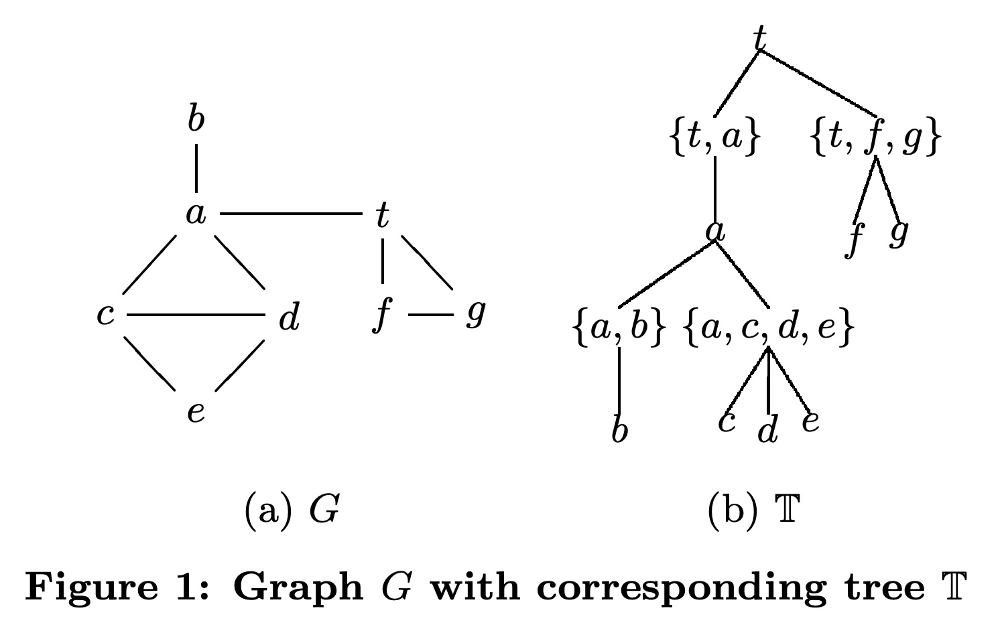
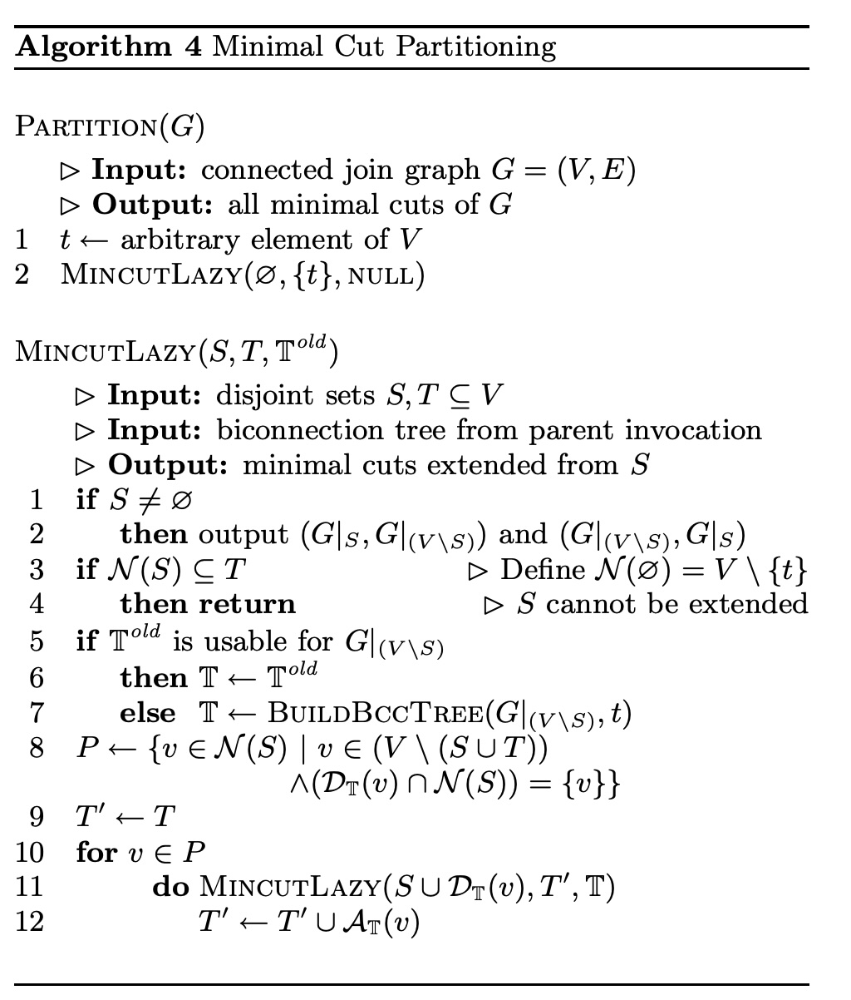
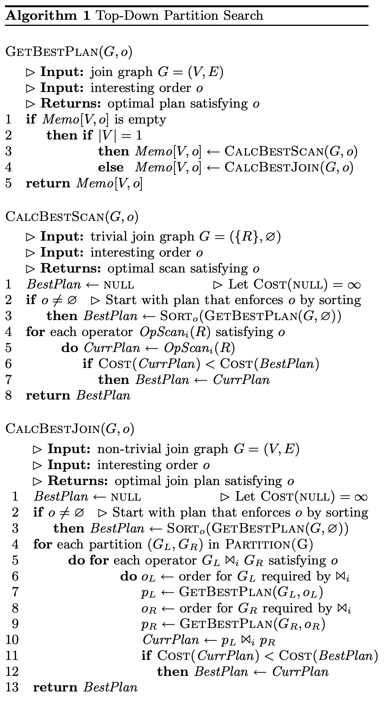
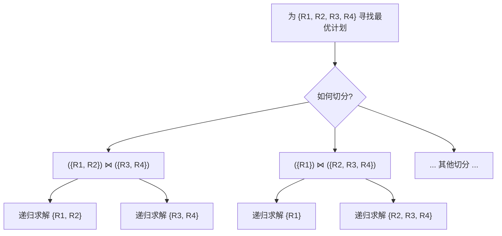
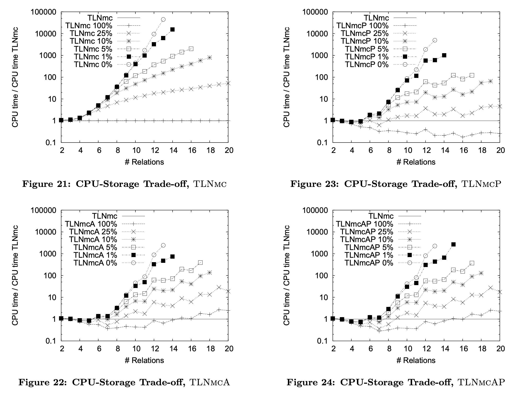
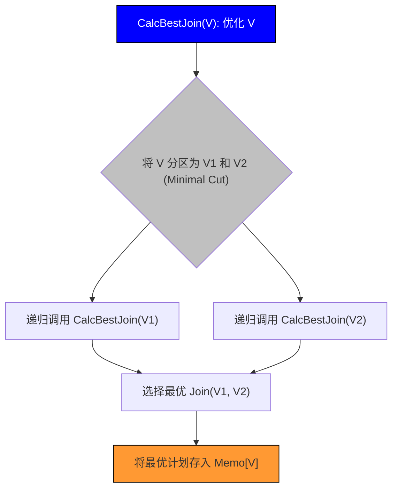

## AI论文解读 | Optimal Top-Down Join Enumeration
        
### 作者        
digoal        
        
### 日期        
2025-10-08        
        
### 标签        
PostgreSQL , PolarDB , DuckDB , AI , 论文解读        
        
----        
        
## 背景  
      
https://cs.uwaterloo.ca/research/tr/2007/CS-2007-02.pdf        
  
提示:          
```          
读懂《Optimal Top-Down Join Enumeration》这篇论文需要提前掌握哪些基础知识, 请使用中文通熟易懂的讲解这些基础知识, 可以引用论文中的图、表或使用Markdown支持的图形(text,mermaid等)增加解释性. 
  
使用中文通熟易懂的解读《Optimal Top-Down Join Enumeration》这篇论文, 其中的关键内容请着重讲解, 可以引用论文中的图、表或使用Markdown支持的图形(text,mermaid等)增加解释性. 
  
提取《Optimal Top-Down Join Enumeration》这篇论文中的重要术语, 使用中文对这些术语进行通熟易懂的讲解, 可以引用论文中的图、表或使用Markdown支持的图形(text,mermaid等)增加解释性. 
```     
  
## 1 前置知识 
  
好的，为了完全理解《Optimal Top-Down Join Enumeration》这篇论文，您需要掌握一些关于数据库查询优化、算法和图论的基础知识。下面我将用通俗易懂的方式，结合论文中的图表，为您逐一讲解这些必备知识点。

### 核心思想概览

在深入细节之前，我们先理解这篇论文要解决的核心问题：数据库在执行一条包含多个表格 `JOIN`（连接）的SQL查询时，可以有成千上万种执行方式（连接顺序）。不同的顺序，其执行效率可能有天壤之别。**查询优化器 (Query Optimizer)** 的任务就是从这些海量的可能性中，找到一个成本最低（通常意味着执行最快）的方案。这篇论文提出了一种新颖、高效且最优的算法来完成这个任务。

-----

### Part 1: 数据库核心概念

这些是理解问题背景的基础。

#### 1\. 什么是连接操作 (Join Operation)？

当您需要从多个表中获取关联数据时，就会用到 `JOIN`。例如，您有两个表：`学生表` 和 `选课表`。要查找每个学生选了哪些课，就需要通过 `学生ID` 将这两个表连接起来。

#### 2\. 什么是连接顺序 (Join Order) 和连接树 (Join Tree)？

当查询涉及三个或更多表（例如，`学生`、`选课`、`课程`）时，连接的顺序就变得至关重要。

假设我们要连接 A、B、C 三个表，至少有两种顺序：

  * 先连接 A 和 B，得到一个中间结果，再用这个结果去连接 C。即 `(A ⋈ B) ⋈ C`
  * 先连接 B 和 C，得到一个中间结果，再用这个结果去连接 A。即 `A ⋈ (B ⋈ C)`

这两种顺序的计算成本可能差异巨大。为了直观地表示连接顺序，我们使用**连接树**。

  * **左深树 (Left-Deep Tree)**：像一根向左倾斜的链条，每次连接都将一个新的表加入到已有的中间结果中。`System-R` 优化器就是采用这种结构 。

    ```mermaid
    graph TD
        subgraph "(A ⋈ B) ⋈ C"
            C[C] --> J2(⋈)
            subgraph "(A ⋈ B)"
                B[B] --> J1(⋈)
                A[A] --> J1
            end
            J1 --> J2
        end
    ```

  * **浓密树 (Bushy Tree)**：结构更灵活，可以连接两个中间结果。通常搜索空间更大，可能找到比左深树更优的计划。

    ```mermaid
    graph TD
        subgraph "(A ⋈ B) ⋈ (C ⋈ D)"
            subgraph "(A ⋈ B)"
                A[A] --> J1(⋈)
                B[B] --> J1
            end
            subgraph "(C ⋈ D)"
                C[C] --> J2(⋈)
                D[D] --> J2
            end
            J1 --> J3(⋈)
            J2 --> J3
        end
    ```

#### 3\. 什么是笛卡尔积 (Cartesian Product)？

如果在连接两个表时，它们之间没有任何连接条件（`ON` 子句），数据库就会生成一个包含两个表所有行组合的结果，这就是笛卡尔积。其结果集通常非常巨大，计算成本极高。因此，优秀的优化器会**竭力避免产生不必要的笛卡尔积** 。论文中经常提到的 "CP-free" 就是指“无笛卡尔积”的连接计划。

-----

### Part 2: 核心算法与搜索策略

这部分是理解论文方法论的关键。

#### 1\. 什么是连接枚举 (Join Enumeration)？

“枚举”就是把所有可能的连接顺序都找出来，并计算它们的成本，最后选出成本最低的那个。这本质上是一个巨大的搜索问题。

#### 2\. 搜索策略：自底向上 (Bottom-Up) vs. 自顶向下 (Top-Down)

这是区分不同优化器流派的核心。

  * **自底向上 (Bottom-Up)**：像搭积木一样 。

    1.  **第一步**：找到所有单个表的最优访问路径。
    2.  **第二步**：利用第一步的结果，找到所有两个表连接的最优计划。
    3.  **第三步**：利用第二步的结果，找到所有三个表连接的最优计划。
    4.  ...依此类推，直到找到所有表连接的最优计划。
        这是传统 `System-R` 优化器使用的方法，非常经典 。

  * **自顶向下 (Top-Down)**：像分解任务一样 。

    1.  **目标**：找到连接所有表 `{A, B, C, D}` 的最优计划。
    2.  **分解**：把这个大任务分解成两个子任务。比如，我们可以把它拆分成 `{A, B}` 和 `{C, D}` 两个子集的连接。
    3.  **递归求解**：然后递归地去寻找 `{A, B}` 的最优计划和 `{C, D}` 的最优计划。
    4.  **组合**：最后将子问题的最优解组合起来。
        论文提出的就是一种自顶向下的方法 。

#### 3\. 动态规划 (Dynamic Programming) 与 记忆化 (Memoization)

暴力枚举的计算量是阶乘级的，无法接受。为了避免重复计算，优化器会使用动态规划或记忆化技术。

  * **动态规划 (DP)**：通常与**自底向上**策略结合。优化器会用一个表格存下每个子集（例如 `{A, B}`）的最优计划，当计算更大的集合（例如 `{A, B, C}`）时，可以直接从表格中读取 `{A, B}` 的结果，而无需重新计算 。
  * **记忆化 (Memoization)**：是**自顶向下**策略的“动态规划”版本 。当递归地解决一个子问题时（例如求解 `{A, B}`），会先检查是否已经计算过并存有结果。如果有，直接返回；如果没有，则计算它，并将结果存起来以备后用。

#### 4\. 分支限界 (Branch-and-Bound Pruning)

这是自顶向下策略的一个巨大优势 。可以把它想象成一个“剪枝”的过程。

**通俗理解**：假设您正在寻找从北京到上海的最便宜的旅行路线。

1.  您随便找到了一条路线（比如坐飞机），总花费是 1000 元。这个 1000 元就是您的**成本上界 (Upper Bound)**。
2.  现在您开始探索另一条新路线（比如先坐火车到南京）。当您计算出“北京到南京”的火车票已经花了 800 元，并且您知道“南京到上海”至少还要 300 元时，那么这条路线的总成本**必然大于 1000 元**。
3.  这时，您就可以果断放弃这条路线，不必再继续探索下去。这就是**剪枝**。

在查询优化中，优化器找到一个完整的计划后，就有了一个成本上界。在后续的搜索中，如果一个**部分计划**的成本已经超过了这个上界，那么整个分支都可以被安全地剪掉，从而大大缩减搜索空间 。

-----

### Part 3: 图论知识

论文的核心创新在于，它使用高效的图论算法来实现自顶向下的分解过程，从而保证最优性。

#### 1\. 查询图 (Join Graph)

这是对一个JOIN查询的图形化表示 。

  * 图中的每个**顶点 (Vertex)** 代表一个要连接的表。
  * 如果两个表之间存在连接条件，就在对应的顶点之间画一条**边 (Edge)**。

#### 2\. 图的划分 (Graph Partitioning) 与 最小割 (Minimal Cut)

自顶向下的策略需要将一个查询图（代表一个待优化的连接集合）划分成两个子图。为了避免产生笛卡尔积，这个划分必须是有意义的，即划分出的两个子图内部都必须是**连通**的。

找到所有这样的有效划分，等价于在图中寻找所有的**最小割 (Minimal Cut)** 。一个最小割就是一组边，移除它们会恰好将图分成两个连通的部分。

#### 3\. 双连通分量 (Biconnected Components) 与 双连通树 (Biconnection Tree)

直接在图上暴力寻找所有最小割的效率很低。为了高效地找到它们，论文采用了一种更高级的图论数据结构——**双连通树 (Biconnection Tree)** 。

  * **关节点 (Articulation Vertex)**：图中的一个顶点，如果移除它（以及与它相连的边），会导致图被分割成多个不连通的部分。
  * **双连通分量**：图中一个极大的子图，其中没有关节点。可以理解为图中“连接最紧密”的部分。

**双连通树**就是一种用来表示图中所有顶点和双连通分量之间关系的数据结构。论文中的 **图 1** 就是一个很好的例子：    

  * **(a) G** 是原始的查询图。其中顶点 `a` 和 `t` 就是关节点。
  * **(b) T** 是 G 对应的双连通树（以 t 为根节点）。
      * 圆圈节点 `a, b, c, ...` 代表原始图中的顶点。
      * 方框节点 `{t,a}, {a,b}, ...` 代表双连通分量。

论文的算法 (Algorithm 4)  正是利用这棵树的结构来**高效地、不重复地**枚举出所有的最小割，从而实现最优的图划分，这是其算法性能优越的关键。    

### 总结

要读懂这篇论文，您需要按以下顺序建立知识体系：

1.  **数据库基础**：理解为什么需要连接顺序优化，以及连接树（左深、浓密）的概念。
2.  **核心算法思想**：掌握**自底向上**和**自顶向下**两种搜索策略的根本区别，并理解**动态规划/记忆化**是如何提升效率的。
3.  **优化技巧**：理解**分支限界**是如何通过“剪枝”来加速搜索的。
4.  **图论知识**：明白论文如何将连接优化问题建模成一个**查询图**，并利用**最小割**和**双连通树**这些精巧的工具来高效地、最优地解决图的划分问题，从而驱动整个自顶向下的优化过程。

掌握了这些知识后，您就可以更轻松地理解论文中提出的算法框架 (Algorithm 1) 、划分策略 (Algorithm 4)  及其性能优势了。    
  
## 2 解读论文 
  
好的，这篇名为《Optimal Top-Down Join Enumeration》（最优自顶向下连接枚举）的论文，是数据库查询优化领域的一篇重要技术报告 。它提出了一种新的算法，旨在高效地为复杂的SQL查询找到最佳的执行计划。

下面，我将为您通俗地解读这篇论文的核心思想、关键技术和主要贡献。

### **核心问题：为什么要优化连接顺序？**

想象一下，数据库收到一条需要连接多个表（比如A、B、C、D）的查询。执行这条查询可以有很多种顺序：

  * 可以先连接 A 和 B，再连接 C，最后连接 D。
  * 也可以先连接 C 和 D，再连接 A 和 B，最后将两个中间结果连接起来。

不同的连接顺序，其计算成本（时间、资源消耗）可能有天壤之-别。一个好的顺序可能几秒钟就完成，而一个糟糕的顺序可能需要几个小时甚至几天。**连接枚举 (Join Enumeration)** 的任务，就是从所有可能的连接顺序中，找到成本最低的那一个。

### **主流方法的困境：自底向上 vs. 自顶向下**

在当时，主流的连接枚举算法主要分为两派：

1.  **自底向上 (Bottom-Up) 动态规划**：这是像System-R等经典数据库采用的方法 。它像搭积木一样，先计算出两个表连接的最优方案，再利用这些结果计算三个表连接的最优方案，依此类推，直到完成所有表的连接。

      * **优点**：思路清晰，实现直接，在很多场景下很有效。
      * **缺点**：不够灵活，无法利用一些高级优化技巧，比如“剪枝”。

2.  **自顶向下 (Top-Down) 转换式搜索**：这是像Volcano/Cascades等现代优化器框架采用的方法 。它将整个查询看作一个大问题，然后通过应用一系列“转换规则”将其分解为子问题，并递归求解。

      * **优点**：非常灵活，可以无缝集成逻辑和物理优化，并且支持**分支限界剪枝 (Branch-and-Bound Pruning)** 等高级技巧 。
      * **缺点**：对于避免笛卡尔积（一种非常低效的连接）的场景，没有公开发表的最优算法，且内存消耗巨大 。

**这篇论文的突破口在于**：它提出了一种新的**自顶向下**算法，但它 **不依赖于“转换规则”** ，而是采用了**图划分**的思想。这使得它既拥有自顶向下方法的灵活性和优化优势，又保留了传统动态规划的架构，从而实现了对连接图的最优枚举 。

### **关键技术一：自顶向下的图划分搜索 (Top-Down Partitioning Search)**

这是论文提出的算法框架核心。其思路如下：

  * **目标**：为N个表的连接找到最优计划。
  * **分解**：将这N个表（看作一个集合V）切分成两个非空子集 $V_1$ 和 $V_2$ 。
  * **递归**：递归地为 $V_1$ 和 $V_2$ 寻找最优连接计划。
  * **组合**：将 $V_1$ 和 $V_2$ 的最优计划连接起来，形成一个完整的计划。
  * **选择**：尝试所有可能的切分方式，选择其中总成本最低的一个。

这个过程通过**记忆化 (Memoization)** 技术避免重复计算——即算过的子问题结果会被缓存起来 。



### **关键技术二：最优划分的秘诀——最小割 (Minimal Cuts)**

上面框架中最重要的一步是“如何切分？”。如果随意切分，可能会产生需要计算笛卡尔积的子问题，这是必须避免的。

论文将查询中的表和连接关系看作一个**查询图 (Join Graph)**，其中**顶点是表**，**边是连接条件** 。一个有效的切分，必须保证切分后的两个子图内部仍然是连通的，这正好对应了图论中的**最小割 (Minimal Cut)** 问题 。

为了高效地找出所有最小割，论文借鉴并改造了图论领域的成熟算法，特别是利用**双连通树 (Biconnection Tree)** 这种高级数据结构来加速查找过程 。下图是论文中的图1，展示了一个查询图G及其对应的双连通树T。算法正是利用T的结构来快速枚举所有有效划分。

  

图1：查询图G及其对应的双连通树T 

通过这种方法，论文提出的`MINCUTLAZY`算法（算法4）能够以每个划分接近线性的开销找到所有有效切分，从而保证了整个连接枚举算法的**最优性**——即它不会做多余的探索，其计算复杂度达到了理论下界 。

  

### **核心优势一：分支限界剪枝带来的显著性能提升**

由于采用了自顶向下的搜索框架，该算法可以非常自然地集成**分支限界 (Branch-and-Bound)** 优化。

其原理很简单：

1.  优化器在搜索过程中，会先快速找到一个“还不错”的完整执行计划，并记下其成本，作为当前**成本上限 (Upper Bound)**。
2.  在后续的递归搜索中，当它发现某个“部分计划”的成本已经超过了这个上限时，就可以断定从这个分支走下去不可能找到更好的计划了。
3.  因此，整个分支可以被安全地“剪掉”，从而极大地减少了搜索的工作量。

论文通过实验证明，集成了分支限界后，其算法性能远超传统的穷举式搜索方法，尤其是在处理复杂查询时 。

### **核心优势二：灵活的内存-时间权衡**

传统动态规划算法需要一个巨大的表格来存储所有子问题的最优解，内存开销是固定的，通常是 $O(2^n)$ 。如果内存不足，算法就无法运行。

而这篇论文提出的自顶向下算法，其用于存储中间结果的“记忆化表格”本质上是一个**缓存** 。这意味着：

  * **如果内存充足**：它可以缓存所有结果，达到最优的时间复杂度。
  * **如果内存受限**：它可以像缓存一样，根据LRU等策略淘汰掉一些旧的结果。当需要这些结果时，重新计算即可 。

这使得算法能够在**优化时间**和**内存空间**之间做出灵活的权衡，这是首个具备此特性的基于动态规划的连接枚举算法 。论文通过实验（图21-24）展示了在不同内存限制下（从100%到0%），算法执行时间的变化情况，证明了其优雅降级的能力 。

  

### **论文贡献总结**

总的来说，这篇论文的主要贡献可以概括为以下几点：

1.  **提出了首个最优的自顶向下连接枚举算法**：该算法不依赖转换规则，通过高效的图划分（最小割）技术，在不产生笛卡尔积的前提下，其枚举效率达到了理论最优 。
2.  **融合了最优枚举与高级优化技巧**：它成功地将最优枚举与分支限界剪枝等自顶向下方法的优势结合起来，获得了比以往文献中描述的算法更快的性能 。
3.  **提供了从“自底向上”到“自顶向下”的迁移路径**：由于其算法框架保留了传统动态规划的许多特性，现有的数据库系统可以更容易地从经典的自底向上模型迁移过来，而无需完全转向复杂的转换式模型 。
4.  **实现了灵活的内存管理**：首次让基于动态规划的优化器能够在CPU时间和内存使用之间进行权衡，提高了算法在资源受限环境下的适应性 。
  
## 3 术语 
  
这篇论文《Optimal Top-Down Join Enumeration (最优自顶向下连接枚举)》的核心在于提出了一种新的、高效且最优的连接枚举算法，它巧妙地结合了自顶向下搜索的优点和传统动态规划的架构。

以下是论文中的重要术语及其通俗易懂的中文讲解：

-----

## 核心问题与基础概念

### 1\. 连接枚举 (Join Enumeration)

  * **定义:** 它是数据库**查询优化器**的核心任务 。当一个查询涉及多个表（关系）的连接时，存在着数百万种可能的连接顺序和连接方法。连接枚举就是从这个巨大的搜索空间中，找到执行成本最低的那个**最佳查询计划** 。
  * **通俗解释:** 就像给一段音乐编曲，连接枚举就是决定哪些乐器先合奏、哪些后合奏，以及用什么方式（如Merge Join, Hash Join）合奏，最终目标是让演奏（查询执行）最快、最省资源。

### 2\. 连接图 (Join Graph)

  * **定义:** 一个图模型 $G=(V, E)$ ，用于表示查询中表之间的连接关系 。
      * **顶点 $V$**: 代表查询中要连接的关系（表）。
      * **边 $E$**: 代表关系之间的**连接谓词**（Join Predicate），即两个表之间存在连接条件 。
  * **通俗解释:** 它是优化器理解查询结构的基础蓝图。一个**连通**的连接图意味着查询中所有的表都通过连接谓词间接或直接相关。

### 3\. 笛卡尔积 (Cartesian Products, CPs)

  * **定义:** 两个**在连接图上不连通**（即相互之间没有连接谓词）的子集进行连接操作 。
  * **通俗解释:** 这种连接操作会产生巨大的中间结果集，通常在优化过程中被视为**低效**并被严格避免 。论文中的许多算法（如TBNMC, BBNCCP）都致力于在**无笛卡尔积 (CP-free)** 的搜索空间中寻找最优解 。

-----

## 核心算法范式

| 术语 | 英文 | 核心思想 | 优缺点 |
| :--- | :--- | :--- | :--- |
| **自底向上动态规划** | Bottom-Up DP | **从小到大**。先优化所有最小的子集，再逐步组合成更大的、最优的连接计划 。 | **优点:** 传统且稳定。**缺点:** 不支持需求驱动，难以集成高效剪枝策略 。 |
| **自顶向下搜索** | Top-Down Search | **从大到小**。从整个查询开始，**递归**地将其分解成最优的子问题求解 。 | **优点:** **需求驱动**，易于集成**分支定界剪枝**，且能灵活处理部分信息 。**缺点:** 传统方法（如Transformational Search）的内存开销大且难以保证最优性 。 |
| **最优性** | Optimality | 保证算法枚举的连接操作符数量达到理论上的最低限（计算下界），且枚举每个操作符的额外开销不超过**线性时间** 。 | **通俗解释:** 保证找到最优解的同时，算法本身的运行效率也达到了理论上的最高水平，避免了不必要的重复工作。 |

-----

## 本文的关键技术

### 4\. 最优自顶向下分区 (Optimal Top-Down Partitioning)

  * **核心贡献:** 这是论文提出的算法框架 。它将自顶向下搜索与传统动态规划的架构相结合 ，通过**分区**的方式驱动连接枚举，并利用图论的特性（**最小割**）来确保分区过程是**最优**的，同时避免产生笛卡尔积 。
  * **实现机制 (分区过程):**
    在优化一个关系集 $V$ 时，算法需要将其分区为两个子集 $V_1$ 和 $V_2$ ，并递归求解 $V_1$ 和 $V_2$ 的最优计划，最终将二者连接起来。

这个递归分解过程，结合了**备忘录**（见下文），就是自顶向下动态规划的骨架：



### 5\. 最小割 (Minimal Cuts)

  * **在论文中的作用:** 它是实现**最优无CP分区**的关键图论工具 。
  * **机制:** 为了保证分区 $(V_1, V_2)$ 后的连接 $V_1 \bowtie V_2$ 是无笛卡尔积的，**两个子集 $V_1$ 和 $V_2$ 必须在连接图中都是连通的** 。
      * **最小割对偶性:** 连接图 $G$ 的所有**最小割**，恰好与所有能将关系集 $V$ 分割成两个连通子集 $(V_1, V_2)$ 的方式**一一对应** 。
  * **通俗解释:** 通过高效地计算连接图中的所有最小割，算法能以最优的速度找到所有**有效且无冗余**的连接分区，从而保证了连接枚举的**最优性**。论文中定制的 `MINCUTLAZY` 算法就是针对这个场景进行了优化 。

-----

## 优化与剪枝策略

### 6\. 备忘录 / 记忆化 (Memoization)

  * **定义:** 自顶向下动态规划（Top-Down DP）用来避免重复计算的技术 。
  * **通俗解释:** 优化器会将已经计算过的关系子集（ 如 $\{A, B\}$ ）的最优连接计划存储在一个表格（`Memo` Table，即**备忘录**）中 。当算法在搜索树的不同分支中再次需要优化 $\{A, B\}$ 时，可以直接查表获取结果，而不需要重新计算 。

### 7\. 分支定界剪枝 (Branch-and-Bound Pruning)

  * **定义:** 一种利用成本边界来裁剪搜索空间的高效优化策略 。
  * **机制:**
    1.  维护一个**上界 $U$**: 目前找到的**最佳完整查询计划**的成本 。
    2.  计算一个**下界 $L$**: 当前正在构建的**部分查询计划**所能达到的最小估计成本 。
    3.  **剪枝:** 如果 $L$ （最小估计成本）已经**大于** $U$ （目前已知的最优成本），则可以安全地放弃对当前分支的进一步搜索 。
  * **重要性:** 分支定界是自顶向下搜索的独有优势，它能显著减少搜索量，使算法比纯粹的穷举式动态规划更快 。

### 8\. 有趣的顺序 / 关联顺序 (Interesting Orders)

  * **定义:** 指代一个中间结果集（ 例如 $A \bowtie B$ ）可能需要保持的某种**排序属性** 。这种排序对于后续的连接操作或分组/聚合操作可能是有利的 。
  * **通俗解释:** 在自顶向下的方法中，可以实现**需求驱动 (Demand-Driven)** 的有趣顺序 。即只有当**上层**操作（如 Merge Join）确实需要某种排序时，优化器才会去计算并生成具有该排序属性的计划，从而避免了不必要的排序计算 。

-----

### 9\. 连接计划形状

  * **左深连接树 (Left-Deep Plans):** 一种特殊的连接计划结构。连接树的右子节点永远是单个的基本关系（表）。
  * **多叉 / 灌木连接树 (Bushy Plans):** 连接树的左右子节点都可以是中间结果集 。它能表示更灵活的连接顺序，通常拥有比左深树更大的搜索空间和更高的找到全局最优解的可能性 。论文中的最优算法 `TBNMC` 就是针对**无CP的多叉连接树**空间进行最优枚举的 。
  
## 参考        
         
https://cs.uwaterloo.ca/research/tr/2007/CS-2007-02.pdf    
        
<b> 以上内容基于DeepSeek、Qwen、Gemini及诸多AI生成, 轻微人工调整, 感谢杭州深度求索人工智能、阿里云、Google等公司. </b>        
        
<b> AI 生成的内容请自行辨别正确性, 当然也多了些许踩坑的乐趣, 毕竟冒险是每个男人的天性.  </b>        
  
    
#### [期望 PostgreSQL|开源PolarDB 增加什么功能?](https://github.com/digoal/blog/issues/76 "269ac3d1c492e938c0191101c7238216")
  
  
#### [PolarDB 开源数据库](https://openpolardb.com/home "57258f76c37864c6e6d23383d05714ea")
  
  
#### [PolarDB 学习图谱](https://www.aliyun.com/database/openpolardb/activity "8642f60e04ed0c814bf9cb9677976bd4")
  
  
#### [PostgreSQL 解决方案集合](../201706/20170601_02.md "40cff096e9ed7122c512b35d8561d9c8")
  
  
#### [德哥 / digoal's Github - 公益是一辈子的事.](https://github.com/digoal/blog/blob/master/README.md "22709685feb7cab07d30f30387f0a9ae")
  
  
#### [About 德哥](https://github.com/digoal/blog/blob/master/me/readme.md "a37735981e7704886ffd590565582dd0")
  
  

  
