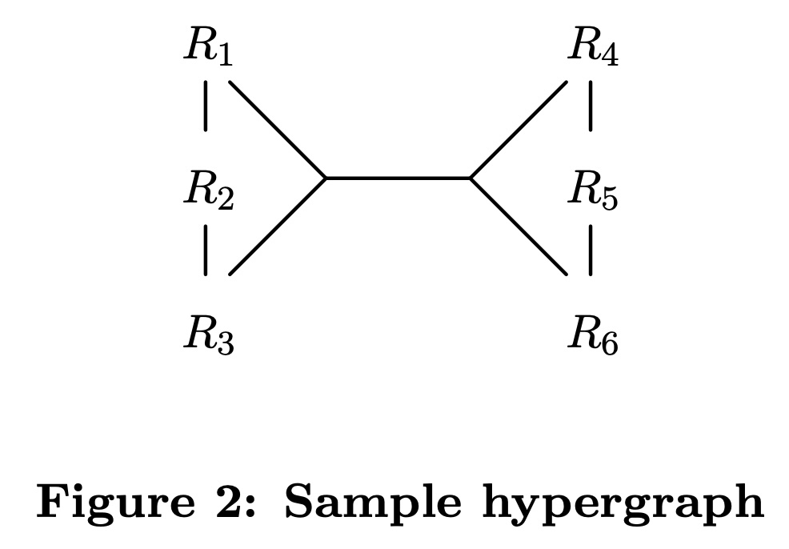

## AI论文解读 | Dynamic Programming Strikes Back
        
### 作者        
digoal        
        
### 日期        
2025-10-09        
        
### 标签        
PostgreSQL , PolarDB , DuckDB , AI , 论文解读        
        
----        
        
## 背景  
      
https://15799.courses.cs.cmu.edu/spring2025/papers/07-joins1/p539-moerkotte.pdf        
  
提示:          
```          
读懂《Dynamic Programming Strikes Back》这篇论文需要提前掌握哪些基础知识, 请使用中文通熟易懂的讲解这些基础知识, 可以引用论文中的图、表或使用Markdown支持的图形(text,mermaid等)增加解释性. 
  
使用中文通熟易懂的解读《Dynamic Programming Strikes Back》这篇论文, 其中的关键内容请着重讲解, 可以引用论文中的图、表或使用Markdown支持的图形(text,mermaid等)增加解释性. 
  
提取《Dynamic Programming Strikes Back》这篇论文中的重要术语, 使用中文对这些术语进行通熟易懂的讲解, 可以引用论文中的图、表或使用Markdown支持的图形(text,mermaid等)增加解释性. 
```     
  
## 1 前置知识 
  
好的，为了能透彻理解《Dynamic Programming Strikes Back》这篇论文，您需要掌握一些数据库查询优化、算法和图论相关的基础知识。这篇论文的核心是提出了一种名为 **DPhyp** 的新算法，它改进了经典的动态规划方法，以高效地解决包含复杂连接（complex predicates）和非内连接（non-inner joins）的查询优化问题。

下面我将用通俗易懂的方式，结合论文中的图示，为您讲解这些必备的基础知识。

### 1\. 核心问题：查询优化与连接顺序（Join Ordering）

这是理解这篇论文最根本的背景。

  * **是什么？** 当数据库收到一条需要查询多个表的SQL语句时（例如 `SELECT ... FROM A, B, C WHERE ...`），它需要将这些表连接（Join）起来。连接这些表可以有多种不同的顺序，比如 `(A join B) join C` 或者 `A join (B join C)`。
  * **为什么重要？** 不同的连接顺序可能导致天差地别的执行效率。假设表A有1000行，表B有1000行，表C有1,000,000行。
      * **顺序1: `(A join B) join C`**: 如果 A 和 B 连接后的中间结果只有10行，那么接下来用这10行去和庞大的C表连接，计算量会很小。
      * **顺序2: `(B join C) join A`**: 如果 B 和 C 连接后的中间结果有10,000,000行，那么接下来用这个巨大的中间结果再去和A连接，计算量将非常恐怖。

查询优化器（Query Optimizer）的目标就是从所有可能的连接顺序中，找到一个成本（预估的执行时间、I/O等）最低的方案。这个问题被称为“连接顺序优化”（Join Ordering Optimization）。

### 2\. 核心算法思想：动态规划（Dynamic Programming, DP）

动态规划是解决连接顺序问题的经典方法。论文中提到的`DPsize`、`DPccp`以及最终提出的`DPhyp`都基于DP思想。

  * **是什么？** 动态规划的核心思想是“分而治之”和“记住结果”。它将一个大问题分解成若干个小问题，先解决小问题，然后将小问题的最优解组合起来，从而得到大问题的最优解。
  * **如何应用于Join Ordering？**
    1.  **第一步 (大小为1)**：找到访问单个表（如A、B、C）的各自最优计划（比如是通过索引扫描还是全表扫描）。
    2.  **第二步 (大小为2)**：利用第一步的结果，找到连接任意两个表（如 A join B, A join C, B join C）的各自最优计划，并将其存储在一个表中（论文中称为`dpTable`）。
    3.  **第三步 (大小为3)**：利用第二步的结果，找到连接三个表（A join B join C）的最优计划。例如，要计算 `(A,B,C)` 的最优计划，可以考虑 `(最优的A,B计划) join C` 和 `(最优的A,C计划) join B` 等组合，选择其中成本最低的一个。
    4.  **以此类推**，直到找到连接所有表的最优计划。

这种自底向上、从小到大构建最优解的方法，就是动态规划的体现 。论文中的 **图1 (Algorithm DPsize)** 就展示了这种按计划大小（size）递增的经典DP算法 。    

```
DPsize (R={R₀,...,Rₙ₋₁})
 for Rᵢ ∈ R  dpTable[{Rᵢ}]=Rᵢ                      // 步骤1：处理大小为1的计划
 for 1 < s ≤ n ascending // 按计划大小循环       // 步骤2、3...
   for 1 ≤ s₁ < s // 划分成两个子计划
     for ∀ S₁ subset R: |S₁|=s₁, S₂ subset R: |S₂|=s-s₁
       ...
       p = dpTable[S₁] × dpTable[S₂]              // 合并子问题的最优解
       if cost(p) < cost(dpTable[S₁ ∪ S₂])
         dpTable[S₁ ∪ S₂] = p
 return dpTable[{R₀...., Rₙ₋₁}]
```

### 3\. 数据结构：从简单图到超图（Hypergraph）

传统上，一个查询的连接关系可以用一个简单的图来表示。

  * **简单图 (Graph)**：

      * **节点 (Node)**：代表一个数据表（关系, Relation）。
      * **边 (Edge)**：代表两个表之间存在一个连接条件（Join Predicate）。例如 `R1.id = R2.id` 就在 R1 和 R2 之间画一条边。

    

    ```mermaid
    graph LR
        R1 --- R2
        R2 --- R3
        R3 --- R4
    ```

  * **超图 (Hypergraph)**：这是理解本论文的关键。

      * **为什么需要？** 简单图的“边”只能连接**两个**节点。但现实中的查询可能包含“复杂连接条件”（Complex Join Predicate），即一个条件同时涉及到多个表 。
      * **例子**：`R1.a + R2.b + R3.c = R4.d + R5.e + R6.f` 。这个条件无法用一条简单的边来表示，因为它同时关联了6个表。
      * **解决方案**：引入**超边 (Hyperedge)**。一条超边可以连接**两个节点集合** 。在上面的例子中，这个条件就构成了一条超边，连接了节点集 `{R1, R2, R3}` 和 `{R4, R5, R6}` 。

    论文中的 **图2 (Sample hypergraph)** 非常直观地展示了这一点 。    

    论文图2：一个超图示例" 在这个图中，({R1},{R2})、({R2},{R3}) 等是简单边。而连接上面三个表({R1,R2,R3})和下面三个表({R4,R5,R6})的，就是一条**超边**。DPhyp算法的核心能力就是高效地处理这种图结构 。

### 4\. 关键概念：连接子图（Connected Subgraphs）

为了避免生成无意义且极其昂贵的“笛卡尔积”（即连接两个没有任何关联的表），所有高效的DP算法都致力于只枚举“**连接子图**” (connected subgraph, csg) 。

  * **是什么？** 在查询图中，如果一个表的集合可以通过边（或超边）相互连通，那么这个集合就构成一个连接子图。
  * **csg-cmp-pair**：这是论文算法的核心驱动单元 。
      * **csg (connected subgraph)**：一个连通的子图，代表一个已经生成了最优计划的中间结果。
      * **cmp (connected complement)**：另一个与该csg相邻接的连通子图。
      * 算法的目标就是高效地枚举出所有有意义的 `(csg, cmp)` 对，然后将它们合并，生成更大的连接子图的计划 。

论文的算法 `DPhyp` 通过巧妙的邻域（Neighborhood）扩展和递归调用，非常高效地生成这些 `csg-cmp-pair`，避免了 `DPsize` 算法中大量的无效尝试 。

### 5\. 扩展知识：内连接与外连接（Inner vs. Outer Joins）

  * **内连接 (Inner Join, ⋈)**：这是最常见的连接类型。它只返回两个表中连接键能够匹配的行。内连接满足交换律和结合律（`A ⋈ B = B ⋈ A`），因此可以任意交换顺序，优化空间很大 。
  * **外连接 (Outer Join)**：
      * **左外连接 (Left Outer Join, ⟕)**：返回左表的所有行，即使在右表中没有匹配。
      * **全外连接 (Full Outer Join)**：返回两个表的所有行，无论是否匹配。
  * **为什么重要？** 外连接等非内连接操作**不满足**交换律和结合律 。例如 `A ⟕ B` 的结果和 `B ⟕ A` 完全不同。这意味着优化器不能随意改变它们的顺序，否则会得到错误的结果。

这篇论文的另一个重大贡献是，它提出了一种方法，将这些非内连接的“顺序限制”巧妙地**转化成超图中的超边** 。这样一来，处理外连接的难题就变成了DPhyp算法已经擅长的处理超图的问题，极大地简化了问题并提升了效率 。

### 总结

要读懂这篇论文，您需要具备以下知识体系：

| 必备知识 | 核心概念 | 在论文中的作用 |
| :--- | :--- | :--- |
| **数据库基础** | **连接顺序优化** | 论文要解决的根本问题：如何为多表查询找到最快的执行路径。 |
| **算法** | **动态规划 (DP)** | 论文所采用和改进的核心算法思想，通过自底向上的方式构建最优解。 |
| **图论** | **超图 (Hypergraph)** | 论文的核心数据结构，用于表示涉及多个表的复杂连接条件，是`DPhyp`算法的基础 。 |
| **图论** | **连接子图 (csg)** | DP算法在枚举过程中处理的基本单元，以避免生成无效的笛卡尔积。 |
| **数据库进阶** | **内连接 vs. 外连接** | 论文要解决的另一大难题。通过将外连接的顺序限制转化为超边，从而纳入`DPhyp`的优化框架中 。 |

当您理解了以上这些概念后，再去看论文中的`DPhyp`算法伪代码（`Solve`, `EnumerateCsgRec`, `EmitCsg` 等函数），就会明白它每一步都是在查询（超）图上，有策略地、无重复地枚举连接子图对（csg-cmp-pair），从而构建出最终的最优查询计划。
  
## 2 解读论文 
  
好的，我们来一起深入解读这篇数据库查询优化领域的经典论文——《Dynamic Programming Strikes Back》（动态规划的反击）。

这篇论文的核心思想是：**通过引入更先进的图论模型（超图），对经典的动态规划（DP）算法进行现代化改造，使其不仅能高效处理包含复杂条件的多表连接，还能巧妙地解决棘手的外连接（Outer Join）等非内连接的排序问题，从而让这种“古老”的算法重新焕发生机，超越当时的许多新方法。**

下面，我将为您分点剖析其中的关键内容。

### 1\. 核心背景：数据库为何需要“连接顺序优化”？

想象一下，数据库收到一条指令，需要从多个表（比如订单表、顾客表、商品表）中查询数据。数据库必须将这些表“连接”（Join）起来。但问题是，先连接哪两个表，再用结果去连接第三个表，这个顺序有非常多的组合。

  * **坏的顺序**：先连接两个非常大的表，产生一个巨大的中间结果，后续计算会非常缓慢。
  * **好的顺序**：先连接两个能大幅筛选掉数据的表，得到一个很小的中间结果，后续计算就会快如闪电。

这个寻找“最佳连接顺序”的问题，就是**查询优化**中最核心、最困难的问题之一。而动态规划（DP）是解决这个问题的经典算法。

### 2\. 传统DP算法的困境：效率低下的“生成-测试”模式

论文中提到的传统算法 `DPsize`  采用的是一种自底向上的方法：

1.  先找出访问单个表的最优方案。
2.  再找出连接任意两个表的最优方案。
3.  再找出连接任意三个表的最优方案...
4.  直到找到连接所有表的最优方案。

这种方法的致命弱点在于，它会**盲目地生成**很多表的组合，然后再去**测试**这个组合是否“合法”（即这些表之间是否有连接关系）。绝大多数生成的组合都是非法的（比如两个表没有任何关联），这导致了巨大的性能浪费 。论文指出，这种方法的复杂度远高于理论下限 。

### 3\. 关键内容一：DPhyp - 用“超图”武装DP，高效处理复杂连接

这是论文的第一个核心贡献。现实中的查询远比 `A.id = B.id` 复杂。

  * **复杂连接 (Complex Predicate)**：一个连接条件可能同时涉及多个表，例如 `R1.a + R2.b = R4.d + R5.e`。
  * **传统图模型的局限**：传统的图用“节点”表示表，用“边”表示两个表之间的连接。但一条边只能连接两个节点，无法表示上述那种涉及多个表的复杂连接。

**论文的解决方案：引入超图 (Hypergraph)。**

  * **什么是超图？** 在超图中，一条“超边”（Hyperedge）可以连接**两个节点的集合**。
  * **如何应用？** 上述的复杂连接 `R1.a + R2.b + R3.c = R4.d + R5.e + R6.f` 就可以用一条超边来表示，这条超边连接了 `{R1, R2, R3}` 和 `{R4, R5, R6}` 这两个表的集合。

论文中的 **图2** 直观地展示了这一点：   

论文图2：超图示例

在这个图中，R1和R2之间是简单边，而连接上方三个表和下方三个表的则是一条**超边** 。

基于超图模型，作者提出了新算法 **DPhyp** 。它的核心优势在于：
它不再是“生成-测试”模式，而是 **“智能生长”模式** 。它从一个小的“连接子图”（Connected Subgraph, csg）出发，只在它的“邻域”（Neighborhood）内寻找可以连接的下一个部分，从而保证每一步生成的都是合法的、更大的连接子图。这从根本上避免了无效的计算 。

**实验结果证明了 DPhyp 的巨大成功**。从论文的 **图5、6、7** 中可以看到，无论是在环形、星形还是带有超边的查询图中，DPhyp 的优化时间（纵坐标，越低越好）都远远优于传统的 `DPsize` 和 `DPsub` 算法，其优势常常是几个数量级的 。

      

### 4\. 关键内容二：用“超边”驯服“非内连接”，化繁为简

这是论文的第二个、也是更具开创性的贡献。

  * **问题的棘手之处**：像 `LEFT OUTER JOIN`（左外连接）或 `ANTIJÓIN` 这样的非内连接操作，是**不可以随意交换顺序**的。`A LEFT JOIN B` 和 `B LEFT JOIN A` 的结果完全不同。这使得优化器在寻找最优顺序时束手束脚，搜索空间受到了严格限制。
  * **传统方法**：在生成计划的后期，加入一个测试环节来检查顺序是否违反了外连接的规定。这又回到了低效的“生成-测试”老路 。

**论文的解决方案：将“顺序限制”转化为“图的结构”。**

作者发现，所有由非内连接带来的复杂“顺序规则”和“依赖关系”，都可以通过数学分析，**等价地转换成超图中的几条新的超边** 。

这个思想非常巧妙，它意味着：

1.  **预处理**：在优化开始前，先分析查询中的所有非内连接，根据它们的依赖关系生成对应的超边。
2.  **统一优化**：将这些新生成的超边与原有的连接边合并，形成一个完整的查询超图。
3.  **无差别执行**：把这个超图直接交给为处理复杂连接而生的 DPhyp 算法去优化。

这样一来，一个关于“操作顺序”的复杂逻辑问题，被**降维**成了一个 DPhyp 算法已经驾轻就熟的“图连接”问题。

论文中的 **图8** 展示了这种方法的威力。在使用超图处理含有越来越多 `ANTIJÓIN` 的查询时，优化时间急剧下降，并且远胜于传统的“测试”方法 。这是因为超图的结构直接 **“剪掉”** 了所有不满足顺序限制的搜索路径，让算法不必再浪费时间去探索它们 。

  

### 总结与启示

《Dynamic Programming Strikes Back》这篇论文之所以经典，在于它为查询优化领域带来了两大启示：

1.  **模型比算法更重要**：有时解决问题的关键不在于发明一个全新的算法，而在于用一个更精确、更强大的数学模型（如超图）来重新描述问题。通过将复杂连接和顺序限制都统一到超图模型下，后续的算法设计便水到渠成。
2.  **经典算法的现代化改造**：它证明了动态规划这个看似“过时”的经典思想，在用现代化的数据结构和理论武装之后，依然能爆发出强大的生命力 ，解决现代数据库面临的复杂查询挑战。

总而言之，这篇论文通过将查询中的复杂关系巧妙地映射到超图结构中，然后设计出高效的 DPhyp 算法来遍历这个结构，成功地让动态规划完成了一次漂亮的“反击”，为现代数据库查询优化器的设计提供了宝贵的思路。
  
## 3 术语 
  
好的，这篇论文《Dynamic Programming Strikes Back》引入并定义了多个关键术语，以构建其核心算法 DPhyp。以下是这些重要术语的中文通俗讲解，并结合了论文中的图示和解释。

-----

### 1\. Hypergraph (超图)

超图是理解这篇论文最核心的概念，是对传统查询图的扩展 。

  * **讲解**:
    在传统的查询图中，一条“边”只能连接两个“节点”（代表两张表）。但这无法表示一个同时涉及多张表的复杂查询条件，例如 `R₁.a + R₂.b + R₃.c = R₄.d + R₅.e + R₆.f` 。

    **超图**解决了这个问题。在超图中，我们使用“**超边**”（Hyperedge）来连接**两个节点集合** 。对于上面的例子，我们可以创建一条超边，它的一端连接 `{R₁, R₂, R₃}` 这个集合，另一端连接 `{R₄, R₅, R₆}` 这个集合 。

  * **图示**:
    论文的 **图2** 是一个绝佳的例子。    

    论文图2：一个超图示例"  在这个图中，({R₁}, {R₂}) 之间是普通边，而连接 `{R₁, R₂, R₃}` 和 `{R₄, R₅, R₆}` 的就是一条**超边** 。论文提出的 DPhyp 算法就是为了高效处理这种包含超边的图结构 。  

### 2\. Hypernode (超节点) & Hyperedge (超边)

这是构成超图的基本元素。

  * **Hypernode (超节点)**: 在查询优化的背景下，超节点指的是由一张或多张表（节点）构成的任意非空集合 。例如，`{R₁, R₂}` 就是一个超节点。
  * **Hyperedge (超边)**: 超边是连接两个互不相交的超节点 `u` 和 `v` 的结构，记为 `(u, v)` 。它在数据库中代表一个或多个连接多张表的查询条件（谓词） 。

### 3\. Connected Subgraph (csg, 连接子图)

这是动态规划算法在构建查询计划时的基本单元。

  * **讲解**:
    在查询（超）图中，如果一个表的集合可以通过边或超边相互连通，那么这个集合就构成一个**连接子图** (csg) 。算法的目标就是为这些 csg 找到最优的执行计划。通过只关注 csg，算法可以有效避免生成代价极高的“笛卡尔积”（即连接两个毫无关系的表） 。

### 4\. Connected Complement (cmp, 连接补集)

这是 csg 在构建更大计划时的“伙伴”。

  * **讲解**:
    给定一个连接子图 `S₁`，在图中剩余的、未被 `S₁` 包含的部分里，如果存在另一个连接子图 `S₂`，并且 `S₂` 与 `S₁` 之间有边相连，那么 `S₂` 就被称为 `S₁` 的一个**连接补集** (cmp) 。

### 5\. csg-cmp-pair (连接子图-补集对)

这是驱动 DPhyp 算法执行的核心枚举单元。

  * **讲解**:
    一个 **csg-cmp-pair** 指的是一对可以直接通过超边相连接的 csg (`S₁`) 和 cmp (`S₂`) 。动态规划算法的核心任务，就是高效、无重复地枚举出所有可能的 csg-cmp-pair，然后将这两个子图的最优计划合并，从而生成一个更大的、覆盖 `{S₁ ∪ S₂}` 的最优计划 。

  * **图示**:
    我们可以用一个简单的图来理解这个关系。

    ```mermaid
    graph TD
        subgraph Graph
            subgraph csg [csg S₁]
                A --- B
                B --- C
            end
            subgraph cmp [cmp S₂]
                D --- E
            end
            C -- 连接边 --> D
        end
    ```

    > 在上图中，`{A, B, C}` 是一个 csg。`{D, E}` 是另一个 csg，并且它通过 C 和 D 之间的边与前者相连，因此 `{D, E}` 是 `{A, B, C}` 的一个 cmp。这两者就构成了一个 **csg-cmp-pair**。算法会找到这个对，并计算 `plan({A,B,C}) ⋈ plan({D,E})` 的成本。

### 6\. Non-inner Joins (非内连接)

这是论文旨在解决的另一大类复杂查询问题。

  * **讲解**:
    指的是除了标准的内连接（INNER JOIN）之外的其他连接操作。论文中明确提到了 **全外连接、左外连接、反连接（antijoin）和嵌套连接（nestjoin）** 等 。这类连接算子的主要特点是它们的执行顺序通常不能随意交换，否则会影响查询结果，这给优化器带来了巨大挑战 。

### 7\. Total Eligibility Set (TES, 完全资格集)

这是论文中为处理“非内连接”的顺序限制而引入的技术概念。

  * **讲解**:
    对于一个非内连接操作，**TES** 定义了一个表的集合，这个集合里的所有表都**必须**在执行该连接操作之前被处理完毕 。它捕获了操作之间的依赖关系和顺序限制 。
    论文最巧妙的地方在于，它没有在算法执行过程中去反复检查这些限制，而是提出可以将 TES 定义的依赖关系在优化开始前就**直接转换成超图中的超边** 。这样一来，处理非内连接这个“逻辑顺序”问题，就变成了 DPhyp 算法已经非常擅长处理的“图结构”问题，极大地提升了效率和算法的通用性。
  
## 参考        
         
https://15799.courses.cs.cmu.edu/spring2025/papers/07-joins1/p539-moerkotte.pdf    
        
<b> 以上内容基于DeepSeek、Qwen、Gemini及诸多AI生成, 轻微人工调整, 感谢杭州深度求索人工智能、阿里云、Google等公司. </b>        
        
<b> AI 生成的内容请自行辨别正确性, 当然也多了些许踩坑的乐趣, 毕竟冒险是每个男人的天性.  </b>        
  
    
#### [期望 PostgreSQL|开源PolarDB 增加什么功能?](https://github.com/digoal/blog/issues/76 "269ac3d1c492e938c0191101c7238216")
  
  
#### [PolarDB 开源数据库](https://openpolardb.com/home "57258f76c37864c6e6d23383d05714ea")
  
  
#### [PolarDB 学习图谱](https://www.aliyun.com/database/openpolardb/activity "8642f60e04ed0c814bf9cb9677976bd4")
  
  
#### [PostgreSQL 解决方案集合](../201706/20170601_02.md "40cff096e9ed7122c512b35d8561d9c8")
  
  
#### [德哥 / digoal's Github - 公益是一辈子的事.](https://github.com/digoal/blog/blob/master/README.md "22709685feb7cab07d30f30387f0a9ae")
  
  
#### [About 德哥](https://github.com/digoal/blog/blob/master/me/readme.md "a37735981e7704886ffd590565582dd0")
  
  

  
