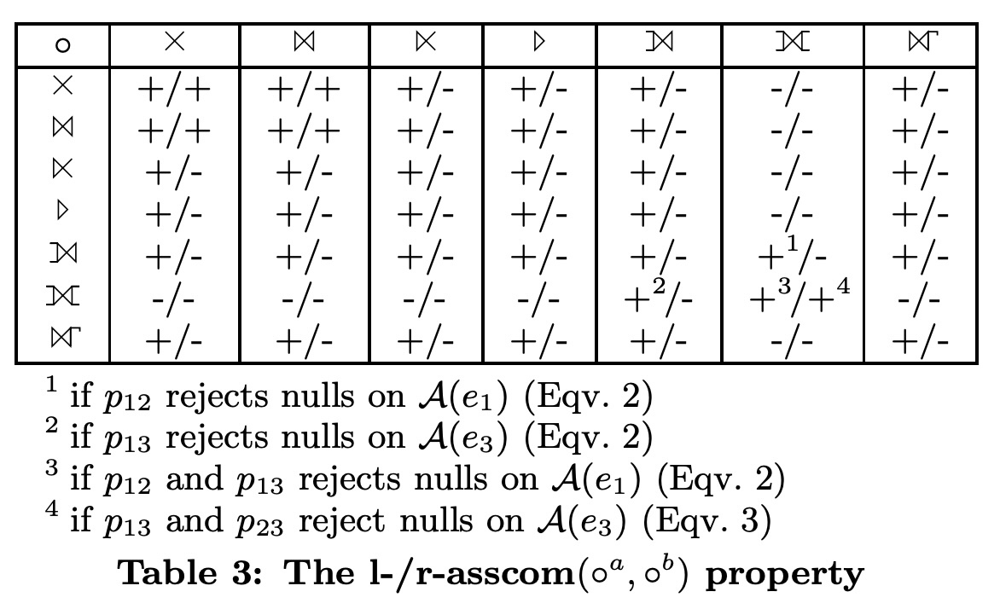

## AI论文解读 | On The Correct And Complete Enumeration Of The Core Search Space
        
### 作者        
digoal        
        
### 日期        
2025-10-09        
        
### 标签        
PostgreSQL , PolarDB , DuckDB , AI , 论文解读        
        
----        
        
## 背景  
      
https://15721.courses.cs.cmu.edu/spring2019/papers/23-optimizer2/p493-moerkotte.pdf        
  
提示:          
```          
读懂《On The Correct And Complete Enumeration Of The Core Search Space》这篇论文需要提前掌握哪些基础知识, 请使用中文通熟易懂的讲解这些基础知识, 可以引用论文中的图、表或使用Markdown支持的图形(text,mermaid等)增加解释性. 
  
使用中文通熟易懂的解读《On The Correct And Complete Enumeration Of The Core Search Space》这篇论文, 其中的关键内容请着重讲解, 可以引用论文中的图、表或使用Markdown支持的图形(text,mermaid等)增加解释性. 
  
提取《On The Correct And Complete Enumeration Of The Core Search Space》这篇论文中的重要术语, 使用中文对这些术语进行通熟易懂的讲解, 可以引用论文中的图、表或使用Markdown支持的图形(text,mermaid等)增加解释性. 
```     
  
## 1 前置知识 
  
好的，为了读懂《On the Correct and Complete Enumeration of the Core Search Space》这篇论文，你需要掌握一些数据库领域的基础知识。这篇论文的核心在于解决数据库在优化复杂查询（特别是包含外连接、反连接等非内连接操作）时，如何正确且完整地找出所有可能的、等价的执行计划。

下面我将用通俗易懂的中文，为你讲解所需的基础知识，并引用论文中的图表来辅助说明。

-----

### 1\. 数据库查询处理与优化基础

首先，你需要了解数据库是如何执行一条SQL查询的。

  * **声明式 vs. 过程式**: 我们写的SQL是**声明式**的，只描述了“我们想要什么结果”，而没有规定“数据库应该如何计算出这个结果”。
  * **查询计划 (Query Plan)**: 数据库接收到SQL后，其内部的“查询优化器”会生成一个**过程式**的执行步骤，称为“查询计划”。这个计划就像一份详细的菜谱，告诉数据库引擎先做什么后做什么。
  * **查询优化 (Query Optimization)**: 对于同一条SQL，往往存在成千上万种等价的查询计划。例如，查询三个表 `A, B, C` 的连接，可以先连接 `A` 和 `B` 再连接 `C`，也可以先连接 `B` 和 `C` 再连接 `A`。这些不同的计划其执行效率可能有天壤之别（可能相差几个数量级） 。查询优化器的核心任务就是从这些海量的可能性中，选择一个成本最低（通常意味着执行最快）的计划。

这篇论文要解决的问题，就出在查询优化的核心环节——**连接排序 (Join Ordering)**。

```text
  ┌───────────┐      ┌─────────────────┐      ┌──────────────────────────┐
  │  SQL 查询  │  ──> │   查询优化器     │  ──> │   最优的查询执行计划      │
  └───────────┘      └─────────────────┘      └──────────────────────────┘
 (用户告诉“做什么”)     (负责“怎么做”的决策)       (数据库最终执行的步骤)
```

### 2\. 关系代数与核心算子 (Operators)

查询计划通常用关系代数的算子树来表示。你需要了解论文中讨论的几种核心的二元连接算子 。

  * **内连接 (Inner Join, ⋈)**: 最常见的连接。只返回两个表中连接键能匹配上的行。它满足**交换律** (`A ⋈ B` = `B ⋈ A`) 和**结合律** (`(A ⋈ B) ⋈ C` = `A ⋈ (B ⋈ C)`), 这意味着优化器可以自由地对内连接进行重排序，而不必担心结果出错 。

  * **外连接 (Outer Join)**:

      * **左外连接 (Left Outerjoin, ⟕)**: 以左表为基准，返回所有左表的行。如果在右表中找不到匹配，则右表对应的列填充为 `NULL`。
      * **全外连接 (Full Outerjoin, ⟗)**: 返回左表和右表中所有的行。如果某一边没有匹配，则另一边对应的列填充为 `NULL`。

  * **半连接 (Semijoin, ⋉)**: 返回左表中那些在右表能找到匹配的行。结果只包含左表的列，且不产生重复行。

  * **反连接 (Antijoin, ▷)**: 与半连接相反，返回左表中那些在右表**找不到**匹配的行。结果也只包含左表的列。

**关键点**: 除了内连接，其他连接（外连接、反连接等）由于可能产生 `NULL` 值或依赖于表的顺序，通常**不满足**交换律和结合律。这就给查询优化带来了巨大的挑战：**不是所有的重排序都是合法的（即能保证结果等价）** 。

### 3\. 核心难点：算子重排序与“搜索空间”

这部分是理解论文的关键。论文的目标就是定义和探索所有**合法**重排序构成的集合，这个集合被称为**核心搜索空间 (Core Search Space)** 。

#### 3.1. 重排序的“交通规则”

为了描述哪些重排序是合法的，论文定义了几种代数性质，你可以把它们理解为重排序的“交通规则”。

1.  **交换律 (Commutativity, `comm`)**: `A op B` 是否等于 `B op A`？

      * 如论文中的 **Table 1** 所示，内连接、全外连接是满足交换律的，而左外连接、反连接等则不满足 。    

2.  **结合律 (Associativity, `assoc`)**: `(e1 op_a e2) op_b e3` 是否等于 `e1 op_a (e2 op_b e3)`？

      * 这个性质比交换律更复杂，它取决于两个算子 `op_a` 和 `op_b` 的组合。论文的 **Table 2**  详细定义了不同算子组合下的结合律。    
      * 例如，两个内连接是满足结合律的，但一个左外连接和一个内连接的组合，其结合律可能就不成立，或者需要满足特定条件（比如连接谓词是“空值拒绝”的 `null rejecting` ）。

    我们可以用下图（类似论文的 **Figure 1** ）来直观理解结合律的变换：    

    ```mermaid
    graph TD
        subgraph A["左结合: (e1 op_a e2) op_b e3"]
            op_b["op_b"]
            op_a["op_a"]
            e3["e3"]
            e1["e1"]
            e2["e2"]
            op_b --> op_a
            op_b --> e3
            op_a --> e1
            op_a --> e2
        end

        subgraph B["右结合: e1 op_a (e2 op_b e3)"]
            op_a2["op_a"]
            op_b2["op_b"]
            e1_2["e1"]
            e2_2["e2"]
            e3_2["e3"]
            op_a2 --> e1_2
            op_a2 --> op_b2
            op_b2 --> e2_2
            op_b2 --> e3_2
        end

        A -->|"若 assoc(op_a, op_b) 成立"| B
    ```

3.  **l-asscom 和 r-asscom**: 这是论文中引入的更精细的重排序规则，它们比传统的结合律更灵活。

      * **l-asscom (left asscom)**: `(e1 op_a e2) op_b e3` 是否等于 `(e1 op_b e3) op_a e2` 。这个变换允许 `e3` "越过" `e2` 先与 `e1` 进行连接。
      * **r-asscom (right asscom)**: `e1 op_a (e2 op_b e3)` 是否等于 `e2 op_b (e1 op_a e3)` 。

这些规则共同定义了从一个初始计划可以合法地变换出哪些其他等价计划。整个由这些合法计划构成的集合，就是“核心搜索空间”。论文的 **Figure 3**  展示了仅用三个表达式和两个算子就能生成一个复杂的搜索空间。   

### 4\. 连接排序算法：动态规划 (Dynamic Programming)

论文提出的冲突检测方法是为基于**动态规划 (DP)** 的优化器设计的。你需要了解DP算法是如何工作的。

DP算法采用一种**自底向上**的方式来构建最优计划：

1.  首先，计算访问单个表的最佳计划。
2.  然后，利用单表计划，计算连接任意**两个**表的最佳计划。
3.  接着，利用两表计划和单表计划，计算连接任意**三个**表的最佳计划。
4.  ...以此类推，直到构建出连接所有表的最终计划。

在每一步组合子计划时，例如，当算法尝试用算子 `o` 来连接子计划 `S1` 和 `S2` 时，它必须检查这个操作是否合法。论文将这个检查点抽象为一个函数 `APPLICABLE(o, S1, S2)` 。

**这篇论文的核心贡献，就是提出了三种（CD-A, CD-B, CD-C）越来越完善的 `APPLICABLE` 函数的实现方式，它们被称为“冲突检测器 (Conflict Detectors)”** 。这些检测器通过分析我们上面提到的 `assoc`, `l-asscom` 等规则，来判断当前的连接组合是否会产生一个非法的计划。

如论文的 **Figure 4** `DPSUBE` 伪代码所示 ，在第10行 `if APPLICABLE(o, S1, S2)`，就是冲突检测器发挥作用的地方。如果 `APPLICABLE` 返回 `true`，则构建新计划；如果返回 `false`，则跳过这个组合，从而避免生成无效计划。   

### 总结

为了读懂这篇论文，你需要的基础知识可以归纳为以下四点：

1.  **为何需要查询优化**：理解SQL的声明性，以及不同执行计划间巨大的性能差异。
2.  **认识各种连接算子**：特别是内连接、外连接、反连接的语义差异，以及它们对 `NULL` 值的处理。
3.  **理解重排序的复杂性**：掌握交换律和结合律等基本代数性质，并理解为什么非内连接会破坏这些性质，从而引出论文中定义的更复杂的重排序规则 (`assoc`, `l-asscom`, `r-asscom`)。
4.  **了解动态规划的基本思想**：知道DP算法是如何自底向上地构建计划的，并理解论文提出的“冲突检测器”是在DP的哪个环节（即 `APPLICABLE` 函数）起作用。

带着这些背景知识，你就可以更好地理解为什么之前的方法（如论文中提到的NEL/EEL和SES/TES）会失败 ，以及作者是如何通过提出CD-A、CD-B和最终完整且正确的CD-C  来解决这个问题的。
  
## 2 解读论文 
  
好的，这篇名为《On the Correct and Complete Enumeration of the Core Search Space》的论文是一篇数据库查询优化领域的经典之作。它解决了一个非常重要且棘手的问题：**在优化包含外连接、反连接等复杂操作的SQL查询时，如何保证优化器产生的所有备选执行计划都是正确的，并且没有遗漏任何一个可能的正确计划。**

下面，我将用通俗易懂的方式为您深度解读这篇论文的关键内容。

### 核心问题：为什么连接重排序这么难？

数据库查询优化器最重要的工作之一是决定多表连接的顺序（Join Ordering），因为不同的顺序性能差异巨大。

  * **对于内连接 (Inner Join, ⋈)**: 问题很简单，因为它满足交换律 `(A ⋈ B = B ⋈ A)` 和结合律 `((A ⋈ B) ⋈ C = A ⋈ (B ⋈ C))`。优化器可以像玩积木一样自由组合连接顺序。

  * **对于非内连接 (Non-inner joins)**: 如左外连接 (Left Outerjoin, ⟕)、反连接 (Antijoin, ▷) 等，情况就变得非常复杂。它们通常**不满足**交换律和结合律 。随意的重排序会导致查询结果完全错误 。

**论文的出发点**：作者发现，当时学术界仅有的两种主流方法（分别称为 NEL/EEL 和 SES/TES）来处理这个问题，自身都存在缺陷，它们仍然会产生错误的查询计划 。这意味着数据库开发者在实现一个可靠的优化器时，竟然没有一个现成的、正确的方法可以选择 。

### 关键概念一：定义合法的“核心搜索空间”

为了解决这个问题，论文首先明确定义了所有“合法”的、等价的查询计划构成的集合，并称之为**核心搜索空间 (Core Search Space)** 。一个计划是否在这个空间内，取决于它能否通过一系列合法的代数变换从初始计划得到 。

这些变换规则（或称代数性质）是论文的理论基石：

1.  **交换律 (Commutativity, `comm`)**: 定义了哪些算子可以交换左右输入，例如 `A ⟗ B` (全外连接) 等价于 `B ⟗ A` 。
2.  **结合律 (Associativity, `assoc`)**: 定义了 `(e1 op_a e2) op_b e3` 何时等价于 `e1 op_a (e2 op_b e3)` 。这取决于 `op_a` 和 `op_b` 两个算子的组合 。论文的 **Table 2** 对此进行了详细的定义 。    
3.  **l-asscom 和 r-asscom**: 这是论文为更精确描述重排序能力而引入的创新概念 。
      * **l-asscom**: `(e1 op_a e2) op_b e3` 何时等价于 `(e1 op_b e3) op_a e2` 。这个规则允许 `e3` "跨过" `e2` 先与 `e1` 结合。
      * **r-asscom**: `e1 op_a (e2 op_b e3)` 何时等价于 `e2 op_b (e1 op_a e3)` 。


下面这个图（源自论文 **Figure 1** 的思想）直观展示了 `assoc` 和 `l-asscom` 的变换区别：    


**核心搜索空间**就是从任意一个初始计划出发，通过反复应用这四条规则能够到达的所有计划的总和 。优化器的目标就是在这个空间里找到成本最低的计划。

### 关键贡献：三代“冲突检测器”的演进

论文的核心贡献是提出了三种逐步完善的**冲突检测器 (Conflict Detector)**，用于在动态规划 (DP) 的优化算法中，判断一个连接操作是否合法，从而确保只生成“核心搜索空间”内的计划 。

这三种检测器分别是 **CD-A, CD-B, CD-C**。

#### 1\. CD-A：简单但“宁枉勿纵”

  * **思想**: 如果发现一个变换（如`assoc`）不成立，就采取最严格的限制 。例如，对于 `(e1 op_a e2) op_b e3`，如果 `assoc(op_a, op_b)` 不成立，CD-A 会强制要求在执行 `op_b` 之前，`e1` 所包含的所有表必须已经准备好 。
  * **问题**: 这种方法是**正确**的，因为它能有效阻止所有非法计划 。但它是**不完整**的（Incomplete），因为它过于严格，会“错杀”很多合法的计划 。论文的 **Figure 6** 给出了一个例子，CD-A会因为一个不相关的`assoc`冲突，把 Plan 1 和 Plan 2 这两个合法的计划都给排除了 。    

#### 2\. CD-B：引入“冲突规则”，更加灵活

  * **思想**: 为了解决CD-A过于严格的问题，CD-B引入了更灵活的**冲突规则 (Conflict Rules, CR)** 。一个冲突规则形如 `T1 -> T2`，表示“如果你的连接范围已经包含了 `T1` 中的**任何一个**表，那么你也必须把 `T2` 中的**所有**表都包含进来” 。
  * **例子**: 对于 `(e1 op_a e2) op_b e3`，如果 `assoc(op_a, op_b)` 不成立，它不再强制要求 `e1` 必须存在，而是生成一条规则 `T(e2) -> T(e1)` 。这意味着，如果你想让 `e2` 和 `e3` 先连接（这是`assoc`变换的目标），因为 `e2` 已经出现了，所以规则生效，你必须把 `e1` 也加进来，但这在当时是不可能的，从而阻止了这个非法的变换。
  * **问题**: CD-B虽然比CD-A灵活，但仍然是**不完整**的 。它在生成规则时，有时会包含一些不必要的表，导致再次“错杀”合法计划 。论文的 **Figure 10** 展示了这种情况 。   

#### 3\. CD-C：最终的正确且完整的方案

  * **思想**: CD-C 是对 CD-B 的精炼。它在生成冲突规则 `T1 -> T2` 时，对 `T2` 集合进行了优化 。它不再把无关的表也加入到 `T2` 中，而仅仅包含那些**真正参与了连接谓词计算**的表 。
  * **结果**: 通过这种精确的约束，CD-C 实现了最终目标：
      * **正确 (Correct)**: 绝不产生任何非法计划 。
      * **完整 (Complete)**: 能够生成核心搜索空间中的所有合法计划，不会遗漏任何机会 。

### 实验结果与意义

论文通过详尽的实验验证了其结论。

  * **Table 4 和 Table 5** 清晰地展示了对比结果 。    
      * **EEL** 和 **TES** (之前的方法) 都产生了大量非法计划 (Invalid, I \> 0) 。
      * **CD-A** 和 **CD-B** 虽然没有产生非法计划 (I = 0)，但它们遗漏了大量的合法计划 (Missing, M \> 0)，丢失了优化机会 。
      * **CD-C** 做到了两全其美：既没有非法计划 (I = 0)，也没有遗漏任何合法计划 (M = 0) 。

### 总结与影响

《On the Correct and Complete Enumeration of the Core Search Space》这篇论文的重大意义在于：

1.  **首次指出现有方法的缺陷**：它明确指出了当时业界和学界广泛讨论的两种主流非内连接重排序方法存在严重bug，会生成错误结果 。
2.  **提供了第一个正确且完整的解决方案**：提出的 **CD-C** 算法是第一个被证明既能保证正确性又能保证完整性的冲突检测方法，为现代数据库查询优化器的构建提供了坚实的理论基础和可行的实现方案 。
3.  **方法灵活且可扩展**：该方法是基于属性表驱动的，未来如果出现新的数据库算子，只需要扩展定义其代数性质的表格，而无需修改算法本身，具有很好的扩展性 。

简单来说，这篇论文为数据库优化器处理复杂查询时的“连接排序”这一核心难题，提供了一把既安全又不会错失良机的“万能钥匙”。
  
## 3 术语 
  
好的，这篇论文《On the Correct and Complete Enumeration of the Core Search Space》主要探讨了在数据库查询优化中，如何正确且完整地对包含非内连接（non-inner joins）的查询操作进行重排序。以下是对其中重要术语的通俗讲解：

### 1\. 核心搜索空间 (Core Search space)

在数据库中，一条SQL查询语句可以有多种执行方式，这些方式被称为“执行计划”（Plan）。查询优化的目标就是从所有可能的、等价的执行计划中，找出成本最低（通常是执行最快）的那一个。

  * **搜索空间 (Search Space)**：指所有可能等价的执行计划的集合。
  * **核心搜索空间 (Core Search Space)**：论文定义的一个特定的搜索空间。它包含了所有通过四种基本变换规则（交换律、结合律、左结合交换律、右结合交换交换律）从初始执行计划生成的有效计划 。这个空间是论文研究的基础，目标是确保优化器能且仅能生成这个空间内的所有有效计划 。

简单来说，"核心搜索空间"就像是为查询计划设定的一套合法的“变形规则”，所有能通过这些规则变出来的计划，都应该被优化器考虑到。

### 2\. 冲突检测器 (Conflict Detector)

当查询中包含像左外连接（LEFT OUTER JOIN）、反连接（ANTI JOIN）等操作时，不是所有的操作顺序调换都是合法的，错误的调换会产生错误的结果 。

  * **冲突检测器 (Conflict Detector)**：这是一个算法或机制，它的任务是在查询优化的过程中（例如，在构建执行计划树时）判断某个操作顺序是否合法。如果一个组合是“冲突”的（即会导致错误结果），冲突检测器就会阻止这个组合的生成 。

可以把它想象成一个“交通警察”，在构建查询计划的“十字路口”指挥交通，只放行那些不会导致“交通事故”（错误结果）的“车辆”（操作组合）。论文的核心贡献就是设计了三个正确且高效的冲突检测器：CD-A, CD-B, 和 CD-C 。

### 3\. 操作符重排序属性 (Operator Reordering Properties)

为了定义合法的重排序规则，论文详细定义了几个关键的代数属性，这些属性决定了查询中的操作符（如JOIN, LEFT JOIN等）能否以及如何交换位置。

#### a. 交换律 (Commutativity - `comm`)

这个属性很好理解，如果一个操作符 `o` 满足交换律，那么 `e1 o e2` 就等价于 `e2 o e1`。例如，内连接（INNER JOIN）满足交换律，但左外连接（LEFT OUTER JOIN）不满足 。论文中的 **表1** 总结了各个操作符是否满足交换律 。   

#### b. 结合律 (Associativity - `assoc`)

这个属性描述了当两个操作符相邻时，它们的执行顺序能否改变。如果 `(e1 oª e2) oᵇ e3` 等价于 `e1 oª (e2 oᵇ e3)`，我们就说操作符对 `(oª, oᵇ)` 满足结合律 。

  * **注意**：`assoc` 属性是**不对称**的，也就是说 `assoc(oª, oᵇ)` 成立，但 `assoc(oᵇ, oª)` 不一定成立 。
  * 论文中的 **表2** 详细列出了不同操作符对之间的结合律关系，其中一些关系还附加了额外条件，比如要求某些谓词是“空值拒绝”（null rejecting）的 。   

下图展示了结合律的变换规则：


  

*(参考论文中的 Figure 1 )*

#### c. 左/右结合交换律 (l-asscom / r-asscom)

这是论文为了覆盖更广泛的合法变换而引入的两个新属性，特别是针对半连接（SEMI JOIN）这类不满足交换律和结合律但仍有特定重排规则的操作符 。

  * **l-asscom (left asscom)**: 如果 `(e1 oª e2) oᵇ e3` 等价于 `(e1 oᵇ e3) oª e2`，则称 `(oª, oᵇ)` 满足 l-asscom 。它本质上是交换了右边的两个表达式（e2 和 e3）的位置。
  * **r-asscom (right asscom)**: 如果 `e1 oª (e2 oᵇ e3)` 等价于 `e2 oᵇ (e1 oª e3)`，则称 `(oª, oᵇ)` 满足 r-asscom 。它交换了左边的两个表达式。

论文中的 **表3** 总结了这些属性 。下图是 `l-asscom` 的一个图形化解释：   


  

*(参考论文中的 Figure 1 )*

### 4\. 冲突表示与检测方法

论文指出，之前已有的两种主流冲突检测方法（NEL/EEL 和 SES/TES）都是有缺陷的，会产生无效的执行计划 。为此，作者提出了新的方法。

#### a. (N/S)EL / (E/T)ES

  * **NEL (Necessary Eligibility List) / SES (Syntactic Eligibility Sets)**: 这两个术语基本是同义词 。它指的是一个操作符能够被执行前，**必须**已经准备好的表的集合 。比如，一个连接谓词 `R.a = S.b`，它的 SES 就是 `{R, S}`。
  * **EEL (Extended Eligibility List) / TES (Total Eligibility Sets)**: 这是对 NEL/SES 的扩展。为了防止错误的重排序，除了谓词直接依赖的表，还会额外加入一些表到这个集合中，从而限制操作符的执行时机 。

论文的核心思想就是通过更精确地计算 TES 和引入“冲突规则”来修正之前方法的错误。

#### b. 论文提出的三种检测器 (CD-A, CD-B, CD-C)

这三种方法是递进的，最终的 **CD-C** 是一个既正确又完整的冲突检测器 。

  * **CD-A**: 这是最简单的方法。当检测到两个操作符 `oª` 和 `oᵇ` 的组合存在冲突时（例如 `¬assoc(oª, oᵇ)`），它会把 `oª` 所依赖的某些表集合**整个**加入到 `oᵇ` 的 TES 中 。这种方法虽然能阻止无效计划，但“用力过猛”，会把一些有效的计划也给阻止掉，因此它是不完整的（incomplete）。
  * **CD-B**: 为了解决 CD-A 的问题，CD-B 引入了更灵活的 **冲突规则 (Conflict Rule - CR)** 。一个冲突规则形如 `T₁ → T₂`，表示“如果你的计划中已经包含了 `T₁` 中的任何一个表，那么你必须同时把 `T₂` 中的所有表也包含进来” 。这种条件性的约束比直接扩大 TES 要灵活得多。
  * **CD-C**: 这是最终的、最完善的方法。它在 CD-B 的基础上，对冲突规则的生成做了优化 。它只把谓词中**实际引用**的表加入到冲突规则中，而不是像 CD-B 那样加入整个子树的表集合 。这使得约束更加精确，避免了 CD-B 中可能出现的过度约束问题，从而实现了既正确又完整的目标 。

总而言之，这篇论文通过定义一套完整的操作符代数属性和一套基于“冲突规则”的先进的冲突检测算法（CD-C），首次实现了一个既能保证生成计划全部有效（correct），又能保证所有有效计划都能被生成（complete）的查询优化框架。
  
## 参考        
         
https://15721.courses.cs.cmu.edu/spring2019/papers/23-optimizer2/p493-moerkotte.pdf    
        
<b> 以上内容基于DeepSeek、Qwen、Gemini及诸多AI生成, 轻微人工调整, 感谢杭州深度求索人工智能、阿里云、Google等公司. </b>        
        
<b> AI 生成的内容请自行辨别正确性, 当然也多了些许踩坑的乐趣, 毕竟冒险是每个男人的天性.  </b>        
  
    
#### [期望 PostgreSQL|开源PolarDB 增加什么功能?](https://github.com/digoal/blog/issues/76 "269ac3d1c492e938c0191101c7238216")
  
  
#### [PolarDB 开源数据库](https://openpolardb.com/home "57258f76c37864c6e6d23383d05714ea")
  
  
#### [PolarDB 学习图谱](https://www.aliyun.com/database/openpolardb/activity "8642f60e04ed0c814bf9cb9677976bd4")
  
  
#### [PostgreSQL 解决方案集合](../201706/20170601_02.md "40cff096e9ed7122c512b35d8561d9c8")
  
  
#### [德哥 / digoal's Github - 公益是一辈子的事.](https://github.com/digoal/blog/blob/master/README.md "22709685feb7cab07d30f30387f0a9ae")
  
  
#### [About 德哥](https://github.com/digoal/blog/blob/master/me/readme.md "a37735981e7704886ffd590565582dd0")
  
  

  
