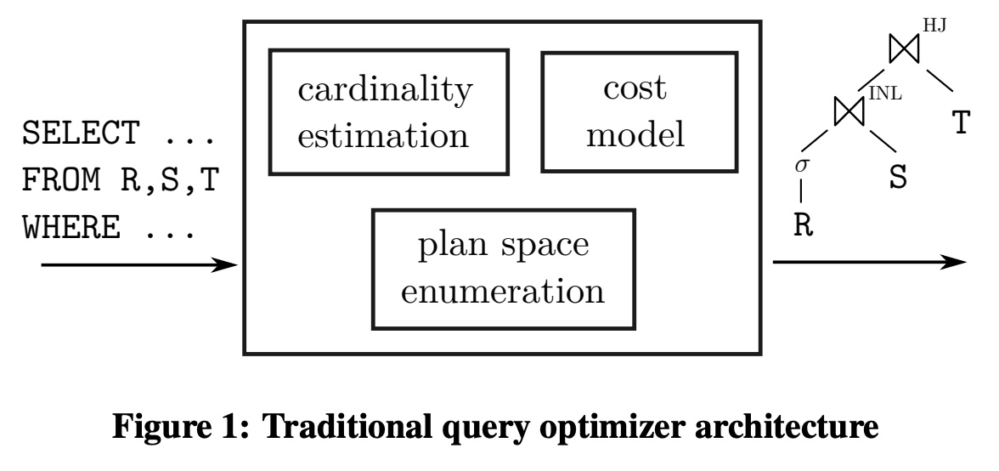
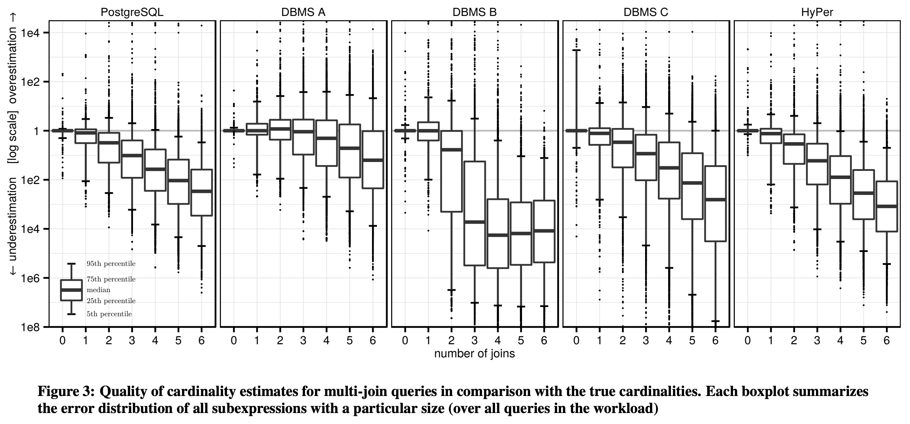
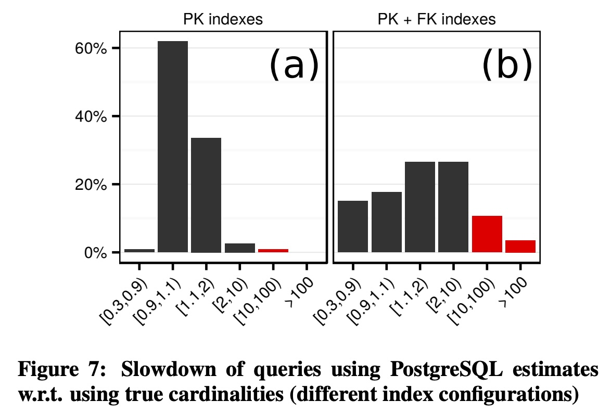

## AI论文解读 | How Good Are Query Optimizers, Really?
        
### 作者        
digoal        
        
### 日期        
2025-10-09        
        
### 标签        
PostgreSQL , PolarDB , DuckDB , AI , 论文解读        
        
----        
        
## 背景  
      
https://www.vldb.org/pvldb/vol9/p204-leis.pdf        
  
提示:          
```          
读懂《How Good Are Query Optimizers, Really?》这篇论文需要提前掌握哪些基础知识, 请使用中文通熟易懂的讲解这些基础知识, 可以引用论文中的图、表或使用Markdown支持的图形(text,mermaid等)增加解释性. 
  
使用中文通熟易懂的解读《How Good Are Query Optimizers, Really?》这篇论文, 其中的关键内容请着重讲解, 可以引用论文中的图、表或使用Markdown支持的图形(text,mermaid等)增加解释性. 
  
提取《How Good Are Query Optimizers, Really?》这篇论文中的重要术语, 使用中文对这些术语进行通熟易懂的讲解, 可以引用论文中的图、表或使用Markdown支持的图形(text,mermaid等)增加解释性. 
```     
  
## 1 前置知识 
  
好的，为了完全理解《How Good Are Query Optimizers, Really?》这篇论文，您需要掌握一些数据库领域的基石性概念。这篇论文的核心在于**实验性地评估**现有查询优化器的各个组件在真实、复杂场景下的表现，而不是提出一个全新的理论。

下面我将用通俗易懂的中文，结合论文中的图表，为您讲解这些必备的基础知识。

### 核心概念：查询优化器 (Query Optimizer)

您可以把查询优化器想象成数据库的“大脑”或“导航系统”。

  * **您的指令 (SQL查询)**：就像您在导航软件中输入“从家到公司”。
  * **可能的执行路径 (执行计划)**：导航系统会规划出多条路线，比如走高速、穿市区、走小路等。同样，数据库收到一条SQL查询后，也有成千上万种方法去执行它（比如先连接A表和B表，再连接C表；或者先连接B表和C表，再连接A表）。每一种方法就是一个**执行计划 (Query Plan)**。
  * **查询优化器的任务**：就是从所有可能的执行计划中，**选择一个它认为成本最低、速度最快的计划**。

一个坏的计划可能要跑几个小时，而一个好的计划可能只需要几秒钟。这篇论文就是要探究，这个“导航系统”到底有多准？它做的决策到底好不好？

论文中的图1完美地展示了这一经典架构，它由三个核心支柱构成，理解这三个支柱是读懂论文的关键。

  

*图1: 传统查询优化器架构*

-----

### 三大支柱之一：基数估计 (Cardinality Estimation)

这是优化器三大支柱中**最重要也是最难**的部分，也是本文着墨最多的部分。

  * **是什么？**
    “基数 (Cardinality)”就是指数据表的“行数”。基数估计，就是优化器在**不真正执行**查询的情况下，去**猜测**查询的每一步会产生多少行数据。例如，`SELECT * FROM users WHERE country = 'China'`，优化器需要猜一下有多少用户来自中国。

  * **为什么重要？**
    后续所有的决策都依赖于这个猜测。比如：

      * 如果优化器猜`'China'`的用户有10行，它可能会选择一个计划。
      * 如果它猜有1000万行，它绝对会选择另一个完全不同的计划。
      * **如果猜错了，结果可能是灾难性的**。

  * **论文的发现：**
    这篇论文通过实验发现，几乎所有商业数据库的基数估计都**非常不准**，尤其是在多表连接（Join）时，错误会指数级增长。

    请看论文中的图3，它展示了不同数据库（PostgreSQL, DBMS A/B/C, HyPer）的估计误差：   

    *图3: 多表连接查询的基数估计质量*

    **如何读懂此图：**

      * **横轴 (number of joins)**：代表查询中连接表的数量。
      * **纵轴 (log scale)**：代表估计误差的倍数（对数坐标）。`1`表示完全准确，`1e2`表示高估了100倍，下面的`1e2`表示低估了100倍。
      * **箱形图 (Boxplot)**：中间的线是中位数误差。箱子越长，代表误差范围越大、越不稳定。

    **结论**：从图中可以看到，随着连接表数量的增加（从0到6），几乎所有系统的箱子都变得越来越长，而且中位数普遍向下偏移（**系统性地低估**结果集大小）。这证明了基数估计是当前优化器最大的“短板”。

-----

### 三大支柱之二：成本模型 (Cost Model)

  * **是什么？**
    在“猜”出每一步的数据量（基数）后，优化器需要一个**计算公式**来给每个可能的执行计划打分，这个分数就是“成本 (Cost)”。成本模型会综合考虑CPU计算、磁盘I/O、内存使用等因素。

  * **为什么重要？**
    它是优化器选择计划的直接依据。优化器会枚举多个计划，用成本模型计算每个计划的成本，然后选择成本最低的那个。

  * **论文的发现：**
    论文指出，相比于基数估计带来的巨大误差，成本模型本身是否足够精确，对最终计划好坏的**影响要小得多** 。一个非常简单的成本模型，只要基数估计是准的，也能选出不错的计划。反之，一个再复杂的成本模型，如果基于错误的基数，也只会算出错误的结果。

-----

### 三大支柱之三：计划空间枚举 (Plan Space Enumeration)

  * **是什么？**
    这是优化器的“搜索算法”。对于一个多表连接查询，连接的顺序可以组合成不同的“树形结构”。计划空间枚举就是寻找这些树形结构的过程。

  * **为什么重要？**
    表的数量一旦增多，可能的连接顺序会爆炸式增长（组合爆炸）。一个10个表的连接，可能的计划数超过17万。优化器不可能检查所有可能性，所以需要高效的搜索算法。

  * **常见树形结构：**
    我们可以用图来直观理解不同的连接树：

    ```mermaid
    graph TD
        subgraph "左深树 (Left-Deep)"
            j1((join)) -- B --> j2((join))
            A --> j1
            j2 -- C --> j3((join))
            D --> j3
        end
        subgraph "右深树 (Right-Deep)"
            D -- join --> C
            C -- join --> B
            B -- join --> A
        end
        subgraph "浓密树 (Bushy)"
            j_ab((A join B))
            j_cd((C join D))
            j_ab -- join --> j_cd
        end
    ```

      * **左深树/右深树**：像一条链，每次都将新的表连接到之前的结果上。结构简单，但可能不是最优的。
      * **浓密树**：更灵活，可以先连接不相邻的表对（如`A-B`和`C-D`），再将结果连接。搜索空间更大，可能找到更好的计划，但优化时间也更长。

  * **论文的发现：**
    论文认为，尽管基数估计不准，但使用**详尽的搜索算法**（比如动态规划，它能探索包括浓密树在内的所有可能）仍然比使用启发式或随机算法（只看一部分可能性）能找到更好的计划 。因为即使估算有偏差，详尽搜索也能大概率排除那些最差的计划。

-----

### 补充知识：物理执行算子 (Physical Operators)

优化器最终生成的计划是由一个个物理算子构成的。理解这些算子，才能明白为什么一个计划比另一个“成本高”。

  * **数据访问方式 (Access Path)**:

      * **全表扫描 (Full Table Scan)**：从头到尾读取整张表。适合于需要访问表中大部分数据的场景。
      * **索引扫描 (Index Scan)**：通过索引直接定位到符合条件的少数几行数据。适合高选择性（结果集很小）的查询。

  * **连接算法 (Join Algorithm)**:

      * **嵌套循环连接 (Nested-Loop Join)**：对于外表（驱动表）的每一行，去内表中查找匹配的行。简单粗暴，如果外表很小且内表有索引，效率很高。但如果两个表都很大，则是灾难。
      * **哈希连接 (Hash Join)**：为其中一个较小的表在内存中建立一个哈希表，然后扫描另一个大表，用每一行去哈希表中探测匹配项。对于大数据量的等值连接非常高效 。
      * **排序归并连接 (Sort-Merge Join)**：先将两个表按照连接键各自排序，然后像拉拉链一样将它们合并。

论文在第4节中重点讨论了，由于基数**被严重低估**，优化器常常会**错误地选择嵌套循环连接**，而实际数据量很大，导致查询性能极差 。

### 总结：如何理解这篇论文

掌握了以上知识后，您就可以这样梳理这篇论文的脉络：

1.  **引言**：数据库查询很慢，主要是因为优化器选错了执行计划。我们想知道优化器的三个核心部件（基数估计、成本模型、计划枚举）到底哪个环节最容易出错。
2.  **实验设计**：我们不用TPC-H那种数据均匀的“玩具”数据集，而是用充满复杂数据关联的真实IMDB电影数据集（Join Order Benchmark, JOB）来“烤问”各大数据库 。
3.  **核心发现1：基数估计是“万恶之源”** 。所有数据库都猜不准，而且连接越多错得越离谱，这是性能问题的首要原因（第3节）。
4.  **核心发现2：错误的估计会导致灾难性决策**。比如，把千万行数据错估成几十行，导致选择了低效的嵌套循环连接，从而使查询超时（第4节）。
5.  **核心发现3：成本模型没那么重要**。在基数估计的巨大误差面前，优化成本模型的收益微乎其微（第5节）。
6.  **核心发现4：搜索空间越大越好**。尽管有误差，但进行更全面的计划搜索（比如允许浓密树的动态规划）依然能有效避免最坏情况，值得去做（第6节）。

总而言之，这篇论文通过严谨的实验得出了一个清晰的结论：**当前查询优化的最大瓶颈在于基数估计**。未来的研究方向应该是如何提高估计的准确性，或者设计出对估计错误不那么敏感的查询执行引擎。
  
## 2 解读论文 
  
解读《How Good Are Query Optimizers, Really?》这篇论文的关键内容，可以使用以下通俗易懂的方式进行讲解：

### 1\. 论文核心思想：数据库的“导航系统”到底准不准？

您可以将数据库的**查询优化器 (Query Optimizer)** 想象成一个GPS导航系统 。当您输入一条SQL查询（目的地）时，数据库有成千上万种方法（路线）来执行它 。优化器的任务，就是从所有可能的**执行计划 (Query Plan)** 中，选择一条它认为成本最低、速度最快的路线 。

这篇论文的核心目的就是通过一个真实、复杂的电影数据库（IMDB） ，来实际测试这个“导航系统”的各个关键部件到底工作得怎么样 。

论文将优化器分解为三个经典组件进行研究，如图1所示：    

1.  **基数估计 (Cardinality Estimation)**
2.  **成本模型 (Cost Model)**
3.  **计划空间枚举 (Plan Space Enumeration)**

*图1: 传统查询优化器架构* 

-----

### 2\. 关键内容一：基数估计——最重要但最不准确的环节

**这是论文发现的最大的问题所在。**

  * **是什么？** “基数”指的就是数据表的“行数” 。基数估计是优化器在不执行查询的情况下，去**猜测**查询每一步会返回多少行数据 。
  * **为什么重要？** 优化器后续的所有决策，比如选择哪种连接算法、哪张表先连接，都严重依赖这个猜测的结果 。错误的估计可能导致灾难性的性能问题 。
  * **论文的惊人发现**：几乎所有被测试的数据库（包括商业数据库和开源的PostgreSQL）在基数估计上都表现不佳，常常产生巨大误差 。特别是在查询涉及多个表连接（join）时，这个误差会随着连接数量的增加而**指数级增长** 。

**关键图表演示 (图3):**

下图是论文的核心证据之一，展示了不同数据库的估计误差。    

*图3: 多表连接查询的基数估计质量* 

  * **如何解读此图**：
      * **横轴**是查询中表的连接（join）数量 。
      * **纵轴**是对数尺度的误差倍数，`1`代表完美估计，`1e2`代表高估100倍，下面的`1e2`代表低估100倍 。
      * **箱形图**越长，代表误差范围越大、越不稳定 。
  * **核心结论**：随着连接数的增加，所有系统的箱子都变得越来越长，而且中位数明显向下偏移，这表明系统普遍存在**严重低估**结果行数的趋势 。例如，对于PostgreSQL，当有3个连接时，超过一半（52%）的估计误差都超过10倍 。

-----

### 3\. 关键内容二：当错误的估计导致灾难性后果

论文不仅指出了估计错误的问题，还深入分析了它如何导致查询变慢。

  * **风险决策之一：错选连接算法**
    一个常见的灾难是，由于优化器严重**低估**了中间结果的行数，它错误地选择了一个**嵌套循环连接 (Nested-Loop Join)** 。这种算法适用于一个表很小的情况，但当两个表都很大时，其性能会急剧下降 。而**哈希连接 (Hash Join)** 虽然前期需要构建哈希表，但对于大数据量连接通常远比嵌套循环高效 。错误的选择可能导致查询从几秒钟变成数小时甚至超时 。

  * **风险决策之二：索引越多，问题越复杂**
    通常我们认为给表加索引能提高查询速度。但论文发现，当数据库拥有更多索引（例如，除了主键索引，还增加了外键索引）时，优化器的选择空间变得更加复杂 。这使得它在面对不准确的基数估计时，更容易选错计划，导致实际性能与最优性能的差距反而**变得更大** 。

    **关键图表演示 (图7):**     

    *图7: 不同索引配置下的查询性能下降情况* 

      * 图(a)（只有主键索引）显示，大部分查询的性能下降都在2倍以内。
      * 图(b)（增加了外键索引）显示，性能下降超过2倍的查询比例显著增加，甚至出现了下降超过10倍和100倍的情况 。

-----

### 4\. 关键内容三：成本模型与计划枚举——影响相对较小

与基数估计相比，优化器的另外两个组件虽然也重要，但不是当前性能问题的核心。

  * **成本模型 (Cost Model)**
    这是为执行计划打分的“公式” 。论文发现，即使使用一个非常简化的成本模型（只计算处理的元组数量），只要给它**真实的、准确的基数**，它选出的计划也相当不错 。反之，一个再精密的成本模型，如果基于错误的基数，也无济于事 。结论是：**成本模型的误差被基数估计的误差完全掩盖了** 。

  * **计划空间枚举 (Plan Space Enumeration)**
    这是优化器的“搜索算法”，用来寻找不同的连接顺序 。常见的连接顺序会形成不同的“树”结构。

    ```mermaid
    graph TD
        subgraph "左深树 (Left-Deep)"
            A -- join --> B
            B -- join --> C
        end
        subgraph "浓密树 (Bushy)"
            j1((A join B))
            j2((C join D))
            j1 -- join --> j2
        end
    ```

    一些优化器为了节省时间，会放弃搜索更复杂的“浓密树”。但论文通过实验证明，尽管基数估计不准，采用**详尽的搜索算法**（如动态规划，可以找到所有类型的树）通常能获得更好的性能 。因为详尽搜索更有可能避开那些最差的计划。

-----

### 总结与启示

《How Good Are Query Optimizers, Really?》这篇论文通过在真实、复杂数据集上进行的大量实验，给出了一个清晰而有力的结论：

1.  **基数估计是当前查询优化器最薄弱的环节** 。工业级的数据库系统都会常规性地产生巨大误差，且随着查询复杂度的增加而恶化 。
2.  **这些巨大的估计误差是导致查询性能问题的首要原因**，它会引导优化器做出灾难性的决策，例如错选连接算法 。
3.  相比之下，**优化成本模型或限制计划搜索空间对性能的影响要小得多** 。
4.  因此，未来提升数据库性能的关键，应该聚焦于**改进基数估计算法**，或者**设计出对估计误差不那么敏感的自适应查询执行引擎** 。

这篇论文的价值在于它用定量的数据证实了许多数据库开发者和研究人员长期以来的“直觉”，并明确指出了未来优化的主攻方向。
  
## 3 术语 
  
好的，这是对论文《How Good Are Query Optimizers, Really?》中重要术语的中文解读，希望能帮助您更好地理解这篇经典论文。

### 1\. Query Optimizer (查询优化器)

  * **通俗讲解**：您可以把它想象成数据库的“智能导航系统”。当您向数据库发出一条SQL查询指令时，优化器会分析所有可能的执行路径，并从中选择一个它认为**成本最低、速度最快**的路径来执行。
  * **论文关联**：整篇论文的核心就是评估这个“导航系统”的各个部件在真实复杂路况下（即JOB基准测试）到底表现如何 。

-----

### 2\. Cardinality Estimation (基数估计)

  * **通俗讲解**：“基数”就是行的数量。基数估计是优化器在执行查询前，对每一步操作会产生多少行结果进行的**猜测** 。这是优化器最重要的输入信息，后续所有决策都建立在这个猜测之上 。

  * **论文关联**：这是论文发现的**最大问题所在**。所有被测试的系统都存在严重的估计误差，尤其是在多表连接时，误差会急剧增大，并且系统普遍倾向于**低估**结果数量 。

    **图3** 直观地展示了这个问题：随着连接（joins）数量增加，误差（纵轴）范围变得越来越大。    
    *图3: 多表连接查询的基数估计质量*

-----

### 3\. Cost Model (成本模型)

  * **通俗讲解**：这是优化器的“计价器”或“打分系统”。它是一个数学公式，根据基数估计的结果，计算出每一种执行计划的理论“成本”（综合考虑CPU、磁盘读写、内存等因素）。优化器会选择得分最低（成本最低）的那个计划 。
  * **论文关联**：论文发现，相比于基数估计的巨大误差，成本模型本身是否足够精确对最终结果的**影响小得多** 。一个简单的成本模型，只要基数准确，也能选出好计划 。

-----

### 4\. Join Order (连接顺序) & Plan Space Enumeration (计划空间枚举)

  * **通俗讲解**：

      * **Join Order (连接顺序)**：当查询涉及多个表时，先连接哪两个表，再用结果去连接哪个表，这个顺序就是连接顺序。不同的顺序效率天差地别 。
      * **Plan Space Enumeration (计划空间枚举)**：这是优化器寻找最佳连接顺序的“搜索算法” 。因为所有可能的顺序组合（即“计划空间”）数量巨大，所以需要高效的算法来探索。

  * **论文关联**：论文对比了不同的搜索策略，比如只考虑简单的“链式”连接，还是考虑更复杂的“树形”连接。

    ```mermaid
    graph TD
        subgraph "左深树 (Left-Deep Tree) - 链式"
            A -- join --> B
            B -- join --> C
            C -- join --> D
        end
        subgraph "浓密树 (Bushy Tree) - 树形"
            j1((A join B))
            j2((C join D))
            j1 -- join --> j2
        end
    ```

    论文发现，尽管基数估计不准，但采用更详尽的搜索算法（如能找到浓密树的动态规划）依然能提升性能 。

-----

### 5\. Physical Database Design (物理数据库设计)

  * **通俗讲解**：这指的是数据库在物理上如何存储和组织数据，主要包括**索引 (Indexes)** 的创建。索引就像书的目录，可以帮助数据库快速定位数据，而无需扫描整张表。
  * **论文关联**：论文强调，物理设计（特别是索引的数量）会极大地影响优化器的决策难度 。当索引增多时，优化器有了更多的路径选择，这反而使得它在基数估计不准的情况下更容易选错路，导致性能下降的风险变大 。

-----

### 6\. Join Algorithms (连接算法)

  * **通俗讲解**：这是数据库执行表连接操作的具体方法。
      * **Nested-Loop Join (嵌套循环连接)**：简单粗暴。对外表的每一行，都去内表里查找一遍匹配项。适合一个表很小的情况 。
      * **Hash Join (哈希连接)**：高效智能。为其中一个小表在内存里建一个“哈希表”（像一个字典），然后扫描大表，用每一行去“字典”里快速匹配。适合大数据量连接 。
  * **论文关联**：论文的一个重要发现是，由于优化器**严重低估**了行数，常常会**错误地选择**嵌套循环连接，而实际数据量很大，导致查询性能灾难 。

-----

### 7\. Join Order Benchmark (JOB)

  * **通俗讲解**：这是论文作者们自己设计的一套**基准测试**，专门用来“烤问”查询优化器 。
  * **论文关联**：作者认为像TPC-H这样的标准测试集数据分布过于均匀和理想化，无法暴露优化器的问题 。JOB基于真实的IMDB电影数据，充满了现实世界中常见的数据倾斜和复杂关联，因此更能挑战和衡量优化器的真实水平 。

-----

### 8\. q-error (q-误差)

  * **通俗讲解**：这是论文中用来衡量基数估计准确性的一个数学指标 。它表示“估计值”与“真实值”之间的**比率或倍数差异**。例如，真实行数是100，如果估计为1000（高估10倍）或10（低估10倍），q-误差都是10 。
  * **论文关联**：这个指标能直观地反映估计错误的严重程度，论文用它来量化和比较不同系统的估计质量（如**表1**所示）。    
  
## 参考        
         
https://www.vldb.org/pvldb/vol9/p204-leis.pdf    
        
<b> 以上内容基于DeepSeek、Qwen、Gemini及诸多AI生成, 轻微人工调整, 感谢杭州深度求索人工智能、阿里云、Google等公司. </b>        
        
<b> AI 生成的内容请自行辨别正确性, 当然也多了些许踩坑的乐趣, 毕竟冒险是每个男人的天性.  </b>        
  
    
#### [期望 PostgreSQL|开源PolarDB 增加什么功能?](https://github.com/digoal/blog/issues/76 "269ac3d1c492e938c0191101c7238216")
  
  
#### [PolarDB 开源数据库](https://openpolardb.com/home "57258f76c37864c6e6d23383d05714ea")
  
  
#### [PolarDB 学习图谱](https://www.aliyun.com/database/openpolardb/activity "8642f60e04ed0c814bf9cb9677976bd4")
  
  
#### [PostgreSQL 解决方案集合](../201706/20170601_02.md "40cff096e9ed7122c512b35d8561d9c8")
  
  
#### [德哥 / digoal's Github - 公益是一辈子的事.](https://github.com/digoal/blog/blob/master/README.md "22709685feb7cab07d30f30387f0a9ae")
  
  
#### [About 德哥](https://github.com/digoal/blog/blob/master/me/readme.md "a37735981e7704886ffd590565582dd0")
  
  

  
