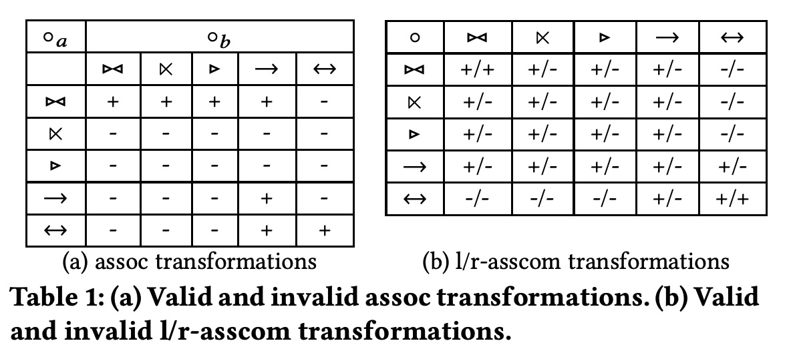

## AI论文解读 | Improving Join Reorderability With Compensation Operators
        
### 作者        
digoal        
        
### 日期        
2025-10-09        
        
### 标签        
PostgreSQL , PolarDB , DuckDB , AI , 论文解读        
        
----        
        
## 背景  
      
https://www.comp.nus.edu.sg/~chancy/sigmod18-reorder.pdf        
  
提示:          
```          
读懂《Improving Join Reorderability With Compensation Operators》这篇论文需要提前掌握哪些基础知识, 请使用中文通熟易懂的讲解这些基础知识, 可以引用论文中的图、表或使用Markdown支持的图形(text,mermaid等)增加解释性. 
  
使用中文通熟易懂的解读《Improving Join Reorderability With Compensation Operators》这篇论文, 其中的关键内容请着重讲解, 可以引用论文中的图、表或使用Markdown支持的图形(text,mermaid等)增加解释性. 
  
提取《Improving Join Reorderability With Compensation Operators》这篇论文中的重要术语, 使用中文对这些术语进行通熟易懂的讲解, 可以引用论文中的图、表或使用Markdown支持的图形(text,mermaid等)增加解释性. 
```     
  
## 1 前置知识 
  
好的，为了完全理解《Improving Join Reorderability with Compensation Operators》这篇经典的数据库顶会论文，你需要掌握一些关于数据库查询优化的基础知识。我会为你通俗易懂地讲解这些概念，并引用论文中的图表来帮助你理解。

可以把学习过程分为四个循序渐进的部分：

1.  **基础概念**：为什么需要“查询优化”和“连接重排序”？
2.  **核心问题**：为什么外连接（Outer Join）和反连接（Anti Join）让重排序变得困难？
3.  **两大基石**：理解论文中提到的两种现有方法（TBA 和 CBA）。
4.  **论文贡献**：了解这篇论文提出的新方法（ECA）是如何建立在前人基础之上的。

-----

### Part 1: 基础概念：查询优化与关系代数

想象一下，你用 SQL 写了一句查询，比如 `SELECT * FROM A, B, C WHERE A.id = B.id AND B.id = C.id`。数据库在执行这句 SQL 之前，会先做一件事： **查询优化（Query Optimization）** 。

查询优化器的目标，就像一个聪明的 GPS，寻找执行查询的最快路径。对于上面这个例子，数据库可以有两种执行顺序：

  * **计划A**：先计算 `A` 和 `B` 的连接（`A JOIN B`），得到一个中间结果，再用这个结果和 `C` 连接。
  * **计划B**：先计算 `B` 和 `C` 的连接（`B JOIN C`），得到一个中间结果，再用这个结果和 `A` 连接。


如果 `A` 和 `B` 连接后的结果非常大，而 `B` 和 `C` 连接后的结果非常小，那么**计划B** 显然会比**计划A** 快得多。**连接重排序（Join Reordering）** 就是查询优化器去寻找最佳连接顺序的过程，它的目标是最小化查询的执行成本（时间、I/O、CPU等）。

-----

### Part 2: 核心问题：为什么连接重排序这么难？

对于上面例子中的 `INNER JOIN`（内连接），重排序很简单，因为它满足数学上的**结合律（Associativity）** 和 **交换律（Commutativity）** 。

  * **交换律**: `A JOIN B` 等价于 `B JOIN A`。
  * **结合律**: `(A JOIN B) JOIN C` 等价于 `A JOIN (B JOIN C)`。

然而，当查询中出现 **外连接（Outer Join）** 或 **反连接（Anti Join）** 时，情况就变得复杂了，因为它们通常**不满足**结合律和交换律。

#### 什么是外连接和反连接？

  * **内连接 (INNER JOIN)**: 只返回两个表中能匹配上的行。
  * **左外连接 (LEFT OUTER JOIN)**: 返回左表的所有行，以及右表中能匹配上的行。如果右表没有匹配的行，则用 `NULL` 填充。
  * **反连接 (ANTI JOIN)**: 返回左表中，所有在右表中**找不到**匹配的行。在 SQL 中通常用 `NOT EXISTS` 或 `NOT IN` 实现。

#### 为什么它们不满足结合律？

让我们看一个左外连接的例子：`(R1 LEFT JOIN R2) LEFT JOIN R3`。

1.  `R1 LEFT JOIN R2`：保留 `R1` 的所有行。
2.  `(结果) LEFT JOIN R3`：保留第一步结果的所有行。

这和 `R1 LEFT JOIN (R2 LEFT JOIN R3)` 的结果是**完全不同**的。在后一种情况中，如果 `R2` 的某一行在 `R3` 中没有匹配，它会先被补上 `NULL`，这个带有 `NULL` 的行再去和 `R1` 做连接，可能会导致 `R1` 的某些行无法匹配。

**结论**：由于外连接和反连接的特殊语义（保留行、产生NULL），我们不能像内连接那样随意地交换它们的顺序，否则会得到错误的结果。这就是论文要解决的核心难题。

-----

### Part 3: 两大基石：理解前人的方法

这篇论文是在两个主流方法的基础上进行改进的。读懂这两个方法，你就读懂了论文的一半。

#### 1\. TBA (Transformation-Based Approach) - “保守派”

TBA 的思想很简单：我只进行那些**数学上被证明是安全的、等价的**变换。它定义了一系列变换规则，比如论文图1中展示的：    


  * **(a) assoc**: 结合律，比如 `(e1 JOIN e2) JOIN e3` 变成 `e1 JOIN (e2 JOIN e3)`。
  * **(b) l-asscom / (c) r-asscom**: 左右结合交换律，是一种更复杂的交换模式。

TBA 会有一个类似论文中 **Table 1**  的表，里面标记了哪些变换对于哪些连接组合是 **有效（+）** 或 **无效（-）** 的。    

  * **优点**：简单、安全，保证结果正确。
  * **缺点**：非常“死板”。对于很多无效（-）的变换，它直接放弃了，从而错过了很多潜在的更优执行计划。比如，它认为 `assoc(->, ->)` 即左外连接的结合律是无效的，所以绝不会尝试这种重排。 

#### 2\. CBA (Compensation-Based Approach) - “激进派”

CBA 的思想则大胆得多：为什么我们不能**先进行一个“无效”的变换，然后再想办法“补偿”或“修复”结果，让它变回正确的呢？** 

为了实现这个目标，CBA 引入了两个新的 **补偿算子（Compensation Operators）** ：

  * **λ (Lambda) - Nullification Operator (空值化算子)** 

      * **作用**：它像一个 `CASE` 语句。对于输入的每一行，如果某个条件不满足，它就把指定列的值变成 `NULL`。 
      * **目的**：在错误的连接顺序下，有些本应为 `NULL` 的值没有变成 `NULL`，`λ` 算子可以把它们强制变回去。

  * **β (Beta) - Best-match Operator (最佳匹配算子)** 

      * **作用**：它会移除结果集中的“多余”行。如果一行 `t` 和另一行 `t'` 相比，非 `NULL` 的值都一样，但 `t` 有更多的 `NULL`，那么 `t` 就被认为是多余的（被 `t'` “支配”），从而被移除。 
      * **目的**：错误的连接顺序可能会产生很多不必要的、重复的、或是被更完整信息支配的行，`β` 算子负责清理这些“垃圾数据”。

**CBA 的流程**：

1.  把复杂的连接查询，通过 `λ` 和 `β` 算子，转换成一个包含 `笛卡尔积` 的“标准形式”。 
2.  由于笛卡尔积是满足结合律和交换律的，所以可以对它进行任意重排序。 
3.  把重排序后的结果，再反向转换回普通的连接形式。

<!-- end list -->

  * **优点**：极大地扩展了连接重排的可能性，能找到 TBA 方法发现不了的高效计划。
  * **缺点**：论文指出，CBA 虽然强大，但主要关注的是内外连接，对**反连接（Anti Join）** 的支持很有限 ，并且在某些情况下，TBA 能做的重排它反而做不到 。

-----

### Part 4: 论文的贡献：ECA 方法与新算子

现在，你已经具备了理解这篇论文所需的所有背景知识。这篇论文提出的 **ECA (Enhanced Compensation-based Approach)**，可以看作是 CBA 的一个**超集和增强版**。

它的核心贡献是：

1.  **解决了 CBA 对反连接支持不佳的问题**。
2.  **统一了 TBA 和 CBA**，使得 ECA 生成的计划空间**同时包含**了 TBA 和 CBA 能生成的所有计划，并且还更多。 

为了实现这个目标，ECA 在 CBA 的 `λ` 和 `β` 算子的基础上，又引入了两个**新的补偿算子**：

  * **γ (Gamma)** 和 **γ\* (Gamma Star)** 

这两个算子的设计比较复杂，但其核心思想是为了更好地处理**反连接**。论文提出了一个关键的重写规则（公式9）：    

$$R_1 \triangleleft_{p_{12}} R_2 = \pi_{R_1}(\gamma_{R_2}(R_1 \rightarrow_{p_{12}} R_2))$$ 

**通俗解释**：

  * `R1 反连接 R2` 这个操作，可以被改写成：
    1.  先计算 `R1 左外连接 R2`。
    2.  然后用 `γ` 算子，筛选出那些 `R2` 对应的部分为 `NULL` 的行（这正是反连接的语义：`R1` 中那些在 `R2` 中找不到匹配的行）。
    3.  最后用 `π` (投影) 操作，只保留 `R1` 的列。

通过这个转换，**棘手的反连接问题，被转换成了外连接 + γ 算子的问题**。而外连接的重排序正是 CBA 的强项。因此，通过引入 `γ` 和 `γ*`，ECA 成功地将反连接也纳入了强大的补偿框架中，极大地提升了对包含反连接的复杂查询的重排序能力。

### 总结

要读懂这篇论文，你需要掌握的知识路线图如下：

1.  **理解动机**：知道查询优化器需要通过**连接重排序**来寻找最高效的执行计划。
2.  **识别难点**：明白**外连接**和**反连接**因为不满足**结合律**，是连接重排序的主要障碍。
3.  **学习前人经验**：
      * **TBA**：只使用安全的、预定义的规则进行重排，比较保守。
      * **CBA**：通过 `λ` (空值化) 和 `β` (去冗余) 两个补偿算子，允许无效重排并修复结果，非常灵活但对反连接支持不足。
4.  **把握论文创新**：
      * **ECA** 引入了新的补偿算子 **`γ` 和 `γ*`**。
      * 核心思想是**将反连接转化为（外连接 + 新算子）** 的形式，从而解锁了大量之前无法实现的重排序可能性。
      * 最终实现了对内外连接、反连接等复杂查询的更完全的重排序能力，其优化空间**超越并包含了** TBA 和 CBA。

掌握了这些，你就可以顺利地阅读论文的原文，去理解它更具体的技术细节，例如重写规则（Table 2, 3）、顶层计划枚举算法等。      
  
## 2 解读论文 
  
好的，我们来一起通俗易懂地解读这篇数据库领域的经典论文《Improving Join Reorderability with Compensation Operators》。

这篇论文的核心在于解决一个数据库查询优化中的经典难题：如何更自由、更智能地调整（重排序）包含外连接（Outer Join）和反连接（Anti Join）的复杂查询，以找到最高效的执行计划。

-----

### **第一部分：问题的核心——为什么Join重排序这么难？**

当你在数据库中执行一个涉及多个表连接（JOIN）的查询时，数据库的优化器会尝试找出最佳的连接顺序。例如，对于 `A JOIN B JOIN C`，优化器可以选择先连接 `(A JOIN B)` 再连接 `C`，也可以选择先连接 `(B JOIN C)` 再连接 `A`。一个好的顺序可能会比一个坏的顺序快上成百上千倍。

  * **对于内连接 (Inner Join)**：这个问题相对简单，因为内连接满足**结合律** `(A JOIN B) JOIN C = A JOIN (B JOIN C)` ，优化器可以自由探索所有可能的顺序。
  * **对于外连接和反连接**：情况变得极其复杂，因为它们通常**不满足结合律** 。强行改变顺序会导致查询结果完全错误。

这就好比做菜，如果是炒杂菜（内连接），先放青椒还是先放肉丝，最后结果都差不多。但如果是做糖醋里脊（外连接），你必须先炸里脊，再裹糖醋汁，顺序错了这道菜就毁了。

传统的优化器因此非常保守，面对外连接和反连接时，它们只敢进行极少数被证明是“绝对安全”的顺序交换，从而错失了大量潜在的高效执行路径。

-----

### **第二部分：前人之路——两种主流方法 (TBA vs. CBA)**

在本文提出新方法之前，业界主要有两种解决思路：

#### **1. TBA (Transformation-Based Approach) - “规则派”**

这是一种基于严格规则的方法。它预先定义了一系列被数学证明是等价的变换规则，只有符合规则的重排序才被允许 。

论文中的 **Figure 1** 和 **Table 1** 就是TBA思想的体现：     

  * **Figure 1**  展示了三种基本的变换模式：`assoc`(结合律)、`l-asscom` 和 `r-asscom`（左右结合交换律）。
  * **Table 1**  则像一张清单，详细列出了对于不同类型的连接组合，上述变换是有效（+）还是无效（-）的。

**TBA的特点**：

  * **优点**：简单、安全，绝不会出错。
  * **缺点**：过于保守和死板。对于标记为 “-” 的变换，它直接放弃，导致优化空间非常有限 。

#### **2. CBA (Compensation-Based Approach) - “补偿派”**

这是一种更激进、更灵活的思路。它的核心思想是：**我们可以先进行一次“无效”的重排序，然后通过一些额外的“补偿”操作来修正结果，使其最终变得正确** 。

CBA引入了两个关键的**补偿算子 (Compensation Operators)**：

  * **λ (lambda) - 空值化算子 (Nullification Operator)**：它的作用是，如果一个数据行不满足特定条件，就强制将其某些列的值设为`NULL` 。这用于修正那些在错误顺序下本应是`NULL`但没有变成`NULL`的数据。
  * **β (beta) - 最佳匹配算子 (Best-match Operator)**：它负责清理数据，移除那些“多余的”或“被支配的”数据行 。例如，如果两行数据非空部分完全一样，它会保留`NULL`值较少的那一行。

**CBA的特点**：

  * **优点**：大大扩展了重排序的可能性，能找到TBA无法发现的更优计划 。
  * **缺点**：论文指出，CBA主要为单边外连接设计，对于**反连接 (Anti Join)** 和**全外连接 (Full Outer Join)** 的支持非常有限 。

-----

### **第三部分：本文的贡献——更强大的ECA方法**

作者提出的新方法名为 **ECA (Enhanced Compensation-based Approach)**，它在CBA的基础上，通过引入新的补偿算子，实现了对TBA和CBA的全面超越。

#### **核心创新：引入新的补偿算子 γ 和 γ\***

ECA引入了两个新的算子，专门用于解决CBA的短板，特别是反连接问题：

  * **γ (gamma)**：一个过滤器，它只保留输入数据中，指定属性列的值为`NULL`的那些行 。
  * **γ\* (gamma-star)**：一个更复杂的操作，对于不满足`γ`条件的行，它不是直接丢弃，而是将这些行的某些列置为`NULL`后再保留下来 。

#### **关键洞见：重写反连接**

ECA最巧妙的地方在于它提出了一个公式，将难以处理的反连接操作，转换成了“外连接 + γ算子”的形式。这就是论文中的**公式 (9)** ：   

$$R_1 \triangleleft_{p_{12}} R_2 = \pi_{R_1}(\gamma_{R_2}(R_1 \rightarrow_{p_{12}} R_2))$$

**通俗解读**：
计算 `R1 ANTI JOIN R2` (返回`R1`中所有在`R2`里找不到匹配的行)，等价于以下三步：

1.  计算 `R1 LEFT JOIN R2`。
2.  使用 `γ` 算子，筛选出结果中 `R2` 部分全部为 `NULL` 的行（这正是反连接的语义）。
3.  最后只保留 `R1` 的列。

通过这个转换，**最棘手的反连接被“伪装”成了外连接问题**。如此一来，就可以利用补偿框架的强大能力来自由地重排这些原本被固定的操作，极大地释放了优化潜力 。

#### **ECA的成果**

凭借新的算子和反连接重写规则，ECA实现了：

  * **解锁了大量新的重排序规则**：如论文中的 **Table 3** 所示，规则14到20都是TBA和CBA无法支持的新的、有效的重排序变换 。   
  * **更广的优化空间**：ECA的优化空间严格地包含了TBA和CBA，意味着两种老方法能找到的优化计划，ECA都能找到，并且还能发现更多它们发现不了的计划 。
  * **实现了“完全连接可重排性”** ：对于不含全外连接的查询，ECA可以探索任意一种连接顺序，真正做到了完全的重排序 。

-----

### **第四部分：如何找到最优计划——顶层枚举算法**

拥有了强大的重排序能力后，下一个问题是：如何在海量的可能性中找到成本最低的那个计划？

论文为此设计了一套新颖的**顶层（Top-down）计划枚举算法** 。传统算法在这里会遇到困难，因为补偿算子的存在使得“一个子问题的最优解”在不同上下文（即不同的整体计划）中可能是不同的，破坏了动态规划的复用基础 。

ECA的算法通过引入 **“依赖边（d-edge）”**  等机制，精确地追踪补偿算子与连接操作之间的依赖关系，从而智能地判断一个已经计算出的最优子计划是否可以在新的查询计划中被安全地复用 。

### **结论与总结**

这篇论文可以看作是数据库查询优化领域的一个重要里程碑。它的主要贡献如下：

1.  **统一并超越**：提出了ECA方法，其优化能力严格超越了当时最先进的TBA和CBA方法 。
2.  **攻克反连接**：通过引入新的补偿算子`γ`和`γ*`，并巧妙地重写反连接，解决了反连接重排序的难题 。
3.  **实现完全重排**：对于包含内连接、单边外连接和反连接的广大查询类别，实现了理论上的“完全连接可重排性” 。
4.  **性能验证**：实验证明，通过探索更广的优化空间，ECA找到的执行计划相比传统优化器，最高能带来**6.14倍**的性能提升 。

简单来说，这篇论文通过设计一套更完备的“补偿工具箱”（λ, β, γ, γ\*），让数据库优化器变得前所未有的聪明和大胆，敢于尝试各种看似“出格”的连接顺序，并通过“补偿”手段确保结果正确，最终找到极致的查询性能。
  
## 3 术语 
  
好的，我们来提取并讲解《Improving Join Reorderability with Compensation Operators》这篇论文中的核心术语。

-----

### **一、 基础与核心问题术语**

#### **1. Join Reordering (连接重排序)**

  * **讲解**：数据库在执行包含多个 `JOIN` 的查询时，会尝试寻找一个成本最低的计算顺序。这个寻找最佳顺序的过程就是连接重排序 。它是查询优化中最关键的任务之一 。
  * **示例**：对于查询 `A JOIN B JOIN C`，优化器需要决定是按 `(A JOIN B) JOIN C` 的顺序执行，还是按 `A JOIN (B JOIN C)` 的顺序执行，因为不同的顺序可能导致巨大的性能差异 。

#### **2. Associativity (结合律) & Commutativity (交换律)**

  * **讲解**：这是决定连接能否自由重排的两个基本数学属性 。
      * **结合律**：`(A ⨝ B) ⨝ C` 等价于 `A ⨝ (B ⨝ C)`。
      * **交换律**：`A ⨝ B` 等价于 `B ⨝ A`。
  * **关键点**：内连接（Inner Join）同时满足这两个定律，因此可以自由重排。而外连接（Outer Join）和反连接（Anti Join）通常不满足，这使得它们的重排序问题变得非常困难 。

#### **3. Null-intolerant Predicate (空值不容忍谓词)**

  * **讲解**：指一个条件判断（谓词），当其引用的任何一个值为 `NULL` 时，该条件永远不会为 `true` 。例如 `age > 30`，如果 `age` 是 `NULL`，结果既不是 `true` 也不是 `false`，而是 `unknown`。
  * **重要性**：论文的研究范围最初主要集中在包含这类谓词的查询上，因为它们 behaved 更可预测，简化了重排序的逻辑 。

#### **4. Complete Join Reorderability (完全连接可重排性)**

  * **讲解**：这是一个理想状态，指对于某一类查询，优化器有能力探索**所有可能**的连接顺序，而不会因为连接类型（如外连接）的限制而遗漏任何一种可能性 。
  * **论文目标**：本文的一个核心目标就是为包含内连接、单边外连接和反连接的查询类别 $C_{J}^{\leftrightarrow}$ 实现这种完全的可重排性 。

-----

### **二、 现有方法的关键术语**

#### **5. Transformation-Based Approach (TBA) - 基于变换的方法**

  * **讲解**：这是一种较为保守的重排序方法，它只允许执行那些被严格证明是等价的变换规则 。
  * **核心规则**：TBA定义了三种基本的变换类型，如论文的 **Figure 1** 所示 ：    
      * `assoc`: 经典的结合律变换。
      * `l-asscom`: 左结合交换律。
      * `r-asscom`: 右结合交换律。
  * **局限性**：TBA会预先定义一张有效/无效变换表（如论文 **Table 1**），对于任何无效的变换，它都会直接禁止，从而限制了优化的可能性 。   

#### **6. Compensation-Based Approach (CBA) - 基于补偿的方法**

  * **讲解**：这是一种更激进的方法。它允许执行一些“无效”的、不等价的重排序，然后通过引入额外的**补偿算子**来“修复”结果，使其最终变得正确 。

#### **7. Compensation Operators (补偿算子)**

  * **讲解**：为了修正无效重排带来的错误而引入的特殊算子 。CBA引入了两个核心的补偿算子：
      * **λ (lambda) - Nullification Operator (空值化算子)**：根据一个条件，将数据行中的某些属性值强制设置成 `NULL` 。它主要用来模拟外连接在不同顺序下产生的 `NULL` 值。
      * **β (beta) - Best-match Operator (最佳匹配算子)**：移除结果集中的“多余”元组 。如果一个元组 `t` 被另一个元组 `t'`“支配”（即 `t'` 拥有 `t` 的所有非空值，并且 `t'` 的 `NULL` 值更少），那么 `t` 就会被移除 。它负责清理因错误重排而产生的冗余数据。

-----

### **三、 本文 (ECA) 提出的新术语**

本文提出的方法叫 **ECA (Enhanced Compensation-based Approach)**，它在CBA的基础上引入了新的补偿算子来增强重排能力，特别是针对反连接。

#### **8. γ (gamma) & γ\* (gamma-star) Operators**

  * **讲解**：这是本文为解决反连接重排序难题而设计的两个全新的一元补偿算子 。

      * **γ (gamma)**：一个选择算子，它只保留那些在指定属性集 `A` 上的值**全部为** `NULL` 的元组 。
        ```
        γ_A(R) = { r ∈ R | π_A(r) is null }
        ```
      * **γ\* (gamma-star)**：一个更复杂的操作。对于输入 `R`，它会保留 `γ_A(R)` 的结果；而对于 `R` 中不满足 `γ_A` 条件的其他元组，它不会丢弃，而是将这些元组除了属性集 `B` 之外的所有其他属性都置为 `NULL`，然后再合并回来 。

  * **核心作用**：`γ` 算子是实现反连接重写的关键。论文提出了一个创见性的公式 **(Equation 9)**，将反连接操作 `R₁ ⨝ R₂` 等价地改写为 `π(γ(R₁ ← R₂))`，即将一个反连接转换成了一个“左外连接 + γ算子”的组合 。这一转换是本文实现对反连接自由重排的基石 。    

#### **9. Top-Down Plan Enumeration (顶层计划枚举)**

  * **讲解**：在拥有了强大的重排能力后，如何从海量的计划中搜索到最优的那个？本文为此设计了一种**从整体到局部**的顶层搜索算法 。
  * **难点与解决**：由于补偿算子的存在，一个子问题的最优解在不同的上下文（整体计划）中可能不同，这使得传统的动态规划复用策略失效 。本文的算法通过引入 **依赖边（dependency edge, d-edge）** 来追踪补偿算子和连接操作之间的依赖关系，从而智能地判断子计划是否可被复用 。
  
## 参考        
         
https://www.comp.nus.edu.sg/~chancy/sigmod18-reorder.pdf    
        
<b> 以上内容基于DeepSeek、Qwen、Gemini及诸多AI生成, 轻微人工调整, 感谢杭州深度求索人工智能、阿里云、Google等公司. </b>        
        
<b> AI 生成的内容请自行辨别正确性, 当然也多了些许踩坑的乐趣, 毕竟冒险是每个男人的天性.  </b>        
  
    
#### [期望 PostgreSQL|开源PolarDB 增加什么功能?](https://github.com/digoal/blog/issues/76 "269ac3d1c492e938c0191101c7238216")
  
  
#### [PolarDB 开源数据库](https://openpolardb.com/home "57258f76c37864c6e6d23383d05714ea")
  
  
#### [PolarDB 学习图谱](https://www.aliyun.com/database/openpolardb/activity "8642f60e04ed0c814bf9cb9677976bd4")
  
  
#### [PostgreSQL 解决方案集合](../201706/20170601_02.md "40cff096e9ed7122c512b35d8561d9c8")
  
  
#### [德哥 / digoal's Github - 公益是一辈子的事.](https://github.com/digoal/blog/blob/master/README.md "22709685feb7cab07d30f30387f0a9ae")
  
  
#### [About 德哥](https://github.com/digoal/blog/blob/master/me/readme.md "a37735981e7704886ffd590565582dd0")
  
  

  
