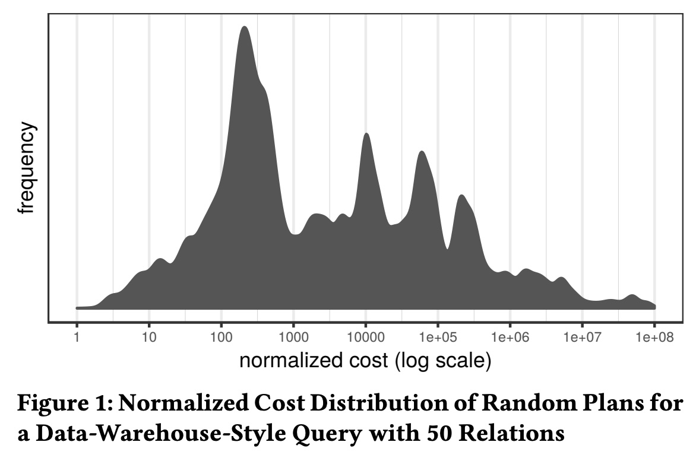
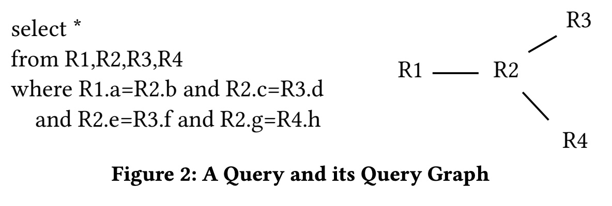
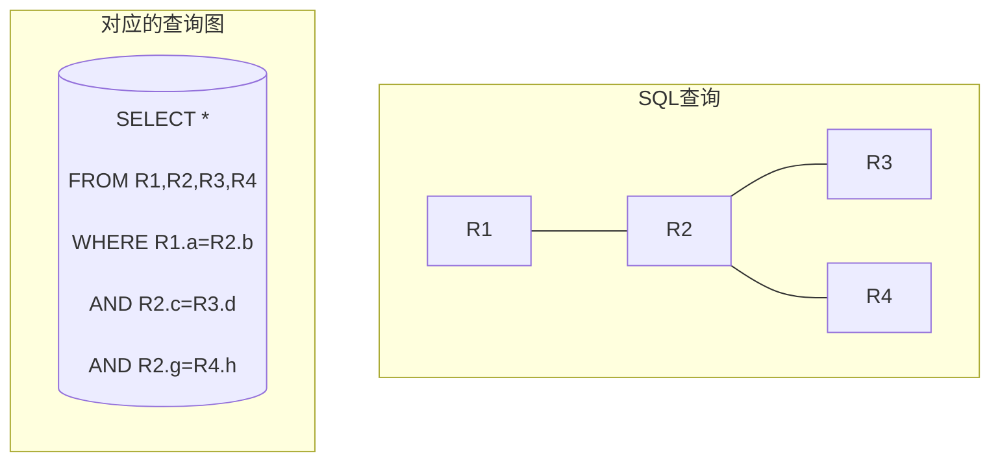
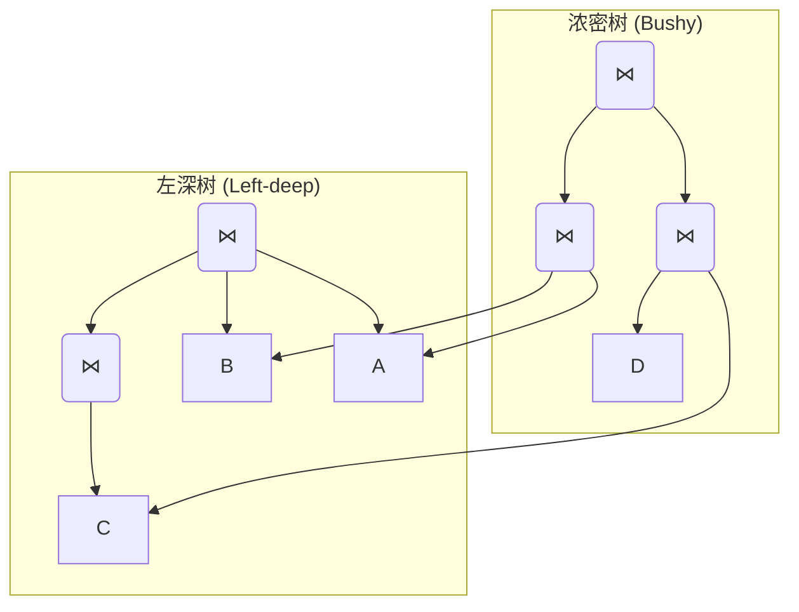
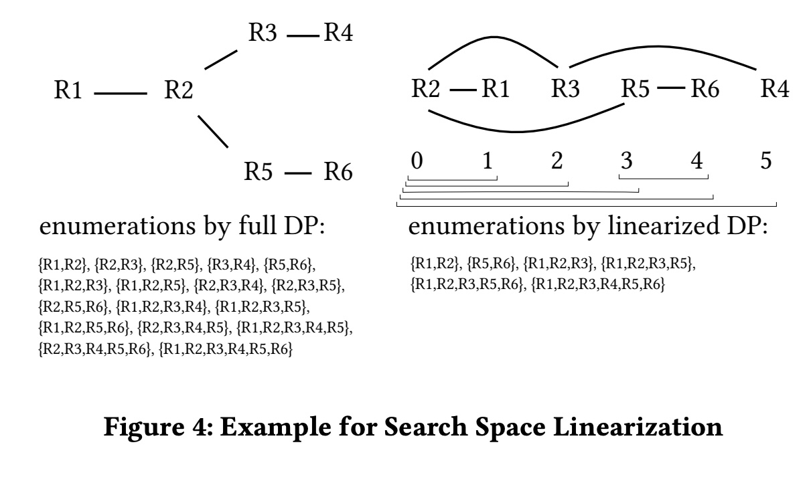
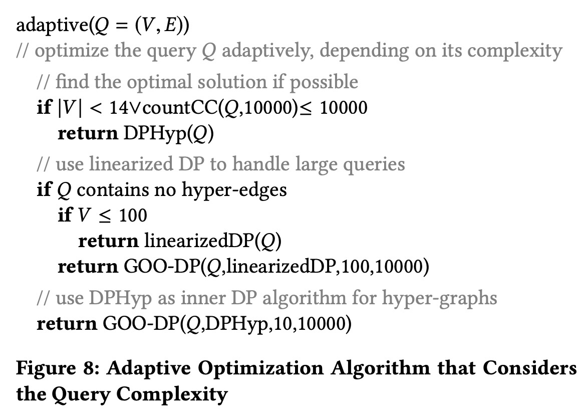
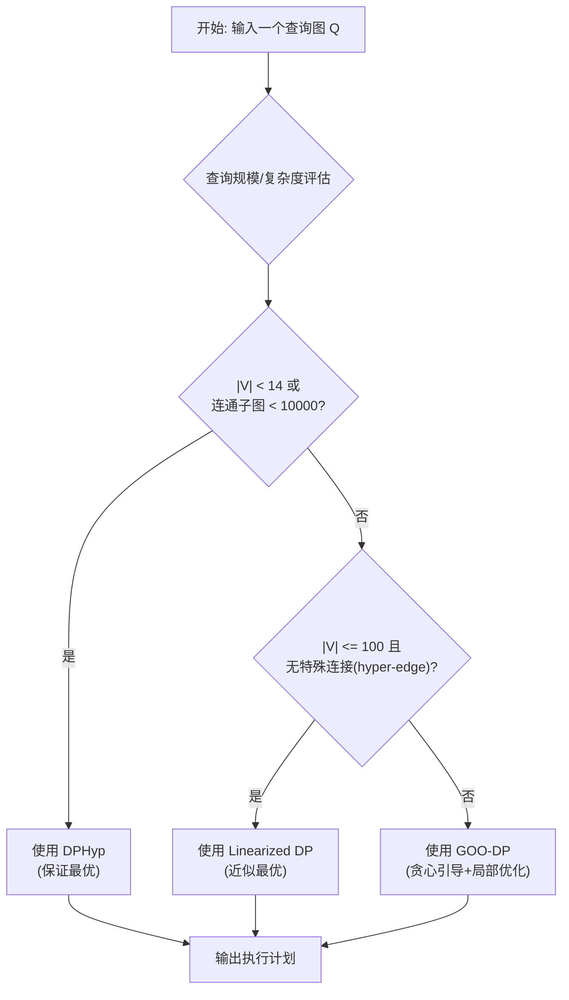
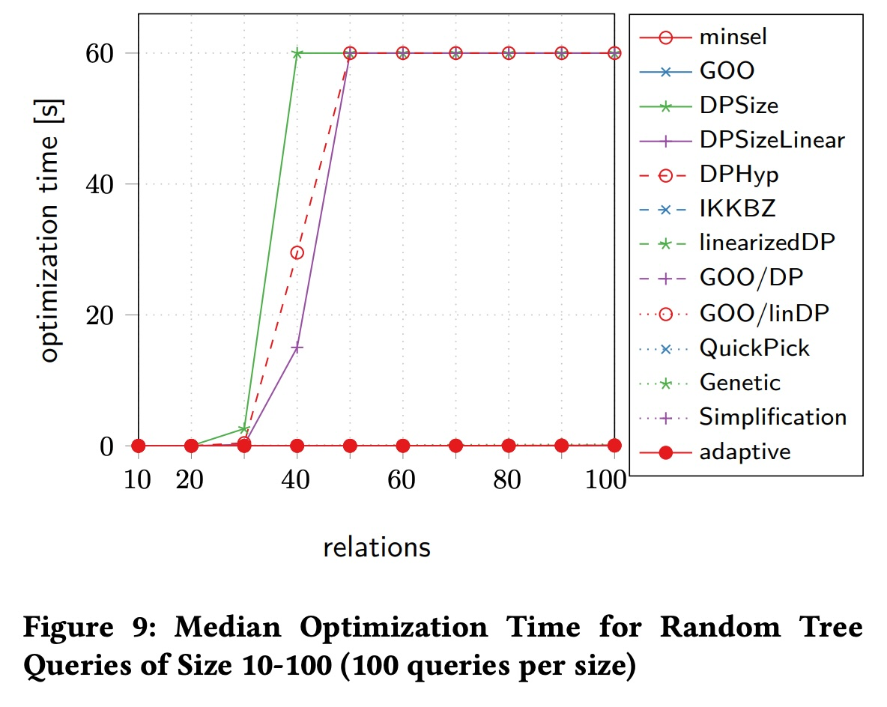
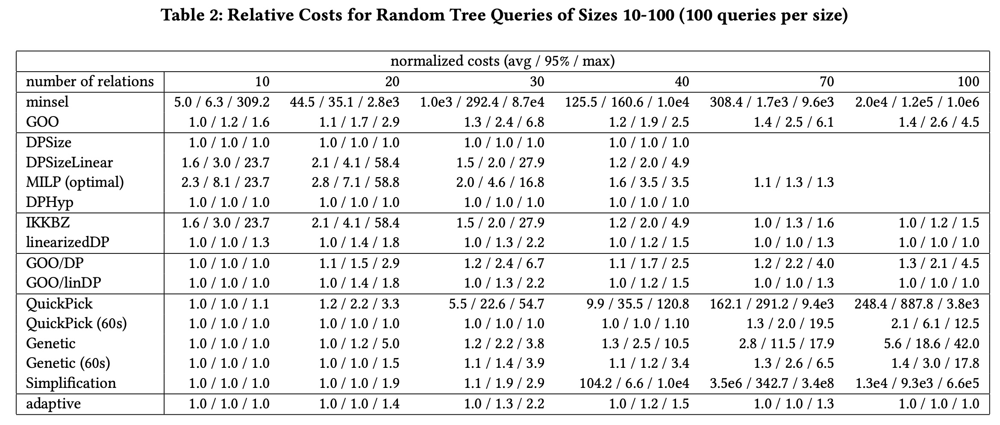

## AI论文解读 | Adaptive Optimization Of Very Large Join Queries
        
### 作者        
digoal        
        
### 日期        
2025-10-09        
        
### 标签        
PostgreSQL , PolarDB , DuckDB , AI , 论文解读        
        
----        
        
## 背景  
      
https://dl.acm.org/doi/pdf/10.1145/3183713.3183733        
  
提示:          
```          
读懂《Adaptive Optimization Of Very Large Join Queries》这篇论文需要提前掌握哪些基础知识, 请使用中文通熟易懂的讲解这些基础知识, 可以引用论文中的图、表或使用Markdown支持的图形(text,mermaid等)增加解释性. 
  
使用中文通熟易懂的解读《Adaptive Optimization Of Very Large Join Queries》这篇论文, 其中的关键内容请着重讲解, 可以引用论文中的图、表或使用Markdown支持的图形(text,mermaid等)增加解释性. 
  
提取《Adaptive Optimization Of Very Large Join Queries》这篇论文中的重要术语, 使用中文对这些术语进行通熟易懂的讲解, 可以引用论文中的图、表或使用Markdown支持的图形(text,mermaid等)增加解释性. 
```     
  
## 1 前置知识 
  
好的，为了完全理解《Adaptive Optimization of Very Large Join Queries》这篇论文，你需要掌握一些数据库查询优化领域的基础知识。下面我将用通俗易懂的中文为你讲解这些概念，并引用论文中的图表来帮助理解。

### 1\. 什么是连接查询优化 (Join Query Optimization)？

想象一下，你在数据库中执行一条SQL查询，需要关联（JOIN）多张表，比如A、B、C三张表。

```sql
SELECT *
FROM A, B, C
WHERE A.id = B.a_id AND B.id = C.b_id;
```

数据库在执行这条查询时，可以有多种不同的“连接顺序”：

  * `(A JOIN B) JOIN C`：先连接A和B，将结果再与C连接。
  * `A JOIN (B JOIN C)`：先连接B和C，将结果再与A连接。

这两种顺序得到的结果是一样的，但执行效率可能天差地别。如果 `A JOIN B` 的中间结果集非常大，而 `B JOIN C` 的中间结果集很小，那么第二种顺序就会快得多。

**连接查询优化的核心任务就是**：对于给定的多表连接查询，从成千上万种可能的执行计划（主要是连接顺序）中，找到一个**估算成本最低**的计划。

-----

### 2\. 为什么连接查询优化很困难？—— NP困难问题

随着连接表数量（N）的增加，可能的连接顺序数量会发生“组合爆炸”。对于一个有N张表的查询，可能的执行计划数量是巨大的，无法通过穷举所有可能性来找到最优解。这在计算机科学中被称为 **NP困难 (NP-hard)** 问题 。

论文中的 **图1** 非常直观地展示了这个问题：   

**图1解读**：
这张图展示了为一个包含50张表的查询，随机生成10000个不同的执行计划，并计算它们的成本 。

  * **X轴 (normalized cost)**：成本的对数坐标。值为1代表目前找到的最优计划的成本。值为100代表成本是最好计划的100倍。
  * **Y轴 (frequency)**：出现频率。

从图中可以看到，绝大多数随机计划的成本都非常高（是最好计划的100倍甚至更高），而那些成本接近1的“好计划”非常稀少。因此，优化器的挑战就在于如何高效地从这个巨大的“垃圾堆”里找到那几颗“钻石”。

-----

### 3\. 核心概念

要读懂论文中的算法，你需要理解以下几个核心术语：

#### a. 查询图 (Query Graph)

这是对SQL查询中表和连接关系的一种图形化抽象。

  * **节点 (Node)**：代表一张表（论文中称为Relation）。
  * **边 (Edge)**：代表两张表之间存在连接条件（`ON` 或 `WHERE` 子句）。

**论文中的图2** 是一个很好的例子：    



这个图清晰地表示了R2是中心表，它分别与R1、R3、R4有连接关系 。优化算法的输入就是这样的查询图。

#### b. 连接树 (Join Tree)

连接树代表了一个具体的执行计划（连接顺序）。常见的连接树类型有：

  * **左深树 (Left-deep Tree)**：结构像一把梳子，每次都将新的表连接到之前结果集的“右侧”。例如 `(((A ⋈ B) ⋈ C) ⋈ D)`。它的优点是便于流水线处理，但计划空间有限。
  * **浓密树 (Bushy Tree)**：结构更灵活，允许连接两个中间结果集。例如 `(A ⋈ B) ⋈ (C ⋈ D)`。它的搜索空间更大，往往能找到比左深树更优的计划，但优化也更复杂 。




这篇论文中的算法主要生成的是更高效的**浓密树**。

#### c. 成本估算 (Cost Estimation)

优化器不会真的去执行每一个计划来比较好坏，而是通过一个**成本模型**来*估算*每个计划的执行成本。成本通常与CPU和I/O消耗有关。

一个最关键的输入是**基数估算 (Cardinality Estimation)**，即估算每一步连接后产生的中间结果集的行数。这个估算越准，成本模型就越可靠。论文中提到，一个简单但常用的成本函数是 `C_out`，它的目标是最小化所有中间结果的大小之和 。

-----

### 4\. 主流的连接优化算法（论文中对比的基础）

这篇论文的自适应框架是在现有算法思想的基础上进行组合和创新的。了解这些基础算法至关重要。

#### a. 动态规划 (Dynamic Programming, DP)

这是寻找**最优解**的经典方法。

  * **核心思想**：自底向上地构建计划。先找到所有2张表连接的最优计划，然后利用这些结果，去寻找所有3张表连接的最优计划，以此类推，直到连接完所有表。
  * **代表算法**：
      * `DPsize`：System R中提出的经典算法，按连接表的数量进行迭代 。
      * `DPHyp`：论文作者之前提出的改进算法，它利用查询图的结构，只考虑图中“连通”的子图，避免了大量无效计算，性能更好 。
  * **缺点**：尽管能找到最优解，但其指数级的复杂度导致它只能处理表数量较少（例如，少于15张）的查询 。

#### b. 贪心算法 (Greedy Algorithms)

这是一种启发式方法，追求快速找到一个“还不错”的解，但不保证最优。

  * **核心思想**：在每一步都做出当前看起来最好的选择。
  * **代表算法**：`GOO` (Greedy Operator Ordering)。它的策略是：在所有可能的连接对中，每次都选择那个执行后**中间结果集最小**的连接 。
  * **缺点**：容易陷入局部最优，可能错过全局最优解。

#### c. IKKBZ 算法

这是一个非常有特点的算法。

  * **核心能力**：它可以在**多项式时间**（非常快）内找到**最优的左深树连接计划** 。
  * **严格限制**：
    1.  查询图必须是**无环**的 。
    2.  成本函数必须满足特定数学性质 (ASI) 。
    3.  只能生成左深树，不能生成更优的浓密树 。
  * **在本文中的妙用**：由于这些限制，它本身不适合作为通用优化器。但论文创造性地利用它来**对所有表进行一次高质量的线性排序**，为后续的“查询空间线性化”做准备。

-----

### 5\. 总结：如何理解这篇论文的创新点

掌握了以上知识后，你就能更好地理解这篇论文的核心贡献——一个聪明的**自适应框架**。它不是要用一个算法包打天下，而是根据问题的规模和复杂度，像一个经验丰富的医生一样“对症下药”：

1.  **对于小查询 (\< 14张表)**：问题简单，直接使用 `DPHyp` 动态规划，一步到位找到**最优解** 。

2.  **对于中等查询 (15-100张表)**：DP太慢，纯贪心算法质量没保障。这里是论文最核心的创新——**查询空间线性化 (Search Space Linearization)**。

      * **第一步**：用 `IKKBZ` 算法快速生成一个高质量的**表排列顺序**。
      * **第二步**：在这个固定的排列上，运行一种简化的动态规划。这个DP不再考虑所有表的任意组合，而只考虑这个**线性序列中的连续子片段**（例如 `R1-R2-R3` 序列中，只考虑 `{R1,R2}`、`{R2,R3}`、`{R1,R2,R3}` 这样的组合）。
      * **效果**：如 **图4** 所示，这种方法极大地削减了搜索空间（从指数级 `O(2^n)` 降到了多项式级 `O(n^2)` 或 `O(n^3)`)，同时因为初始排序质量高，最终找到的计划质量也非常接近最优解 。

3.  **对于非常大的查询 (\> 100张表)**：线性化DP也变慢了。此时框架结合了贪心思想。

      * **第一步**：用 `GOO` 贪心算法快速构建一个完整的、还不错的浓密树框架。
      * **第二步**：在这个框架上，识别出那些估算成本最高的“瓶颈”子树（比如一个包含80张表的子问题），然后用**线性化DP**去重点优化这个子树 。

通过这种分层、自适应的策略，该框架实现了在保证小查询最优性的同时，能够优雅地处理上千张表的“超级查询”，在优化时间和计划质量之间取得了出色的平衡。
  
## 2 解读论文 
  
好的，这篇名为《Adaptive Optimization of Very Large Join Queries》（超大规模连接查询的自适应优化）的论文，解决的是数据库领域一个经典且棘手的问题：如何为从几张表到几千张表的各种规模的SQL连接查询，都能快速地找到一个高效的执行计划。

下面，我将为你深入浅出地解读这篇论文的核心思想与关键内容。

### 核心问题：规模的诅咒

数据库在执行多表JOIN查询时，不同的连接顺序（执行计划）效率天差地别。一个好的计划可能几秒钟就完成，而一个坏的计划可能要跑上几天甚至几个月。查询优化器的任务就是找到那个“好”的计划。

然而，当连接的表数量增多时，可能的执行计划数量会呈指数级爆炸式增长，这个问题是“NP困难”的。

**论文中的图1** 生动地展示了问题的严峻性：    

这张图为一个50张表的查询随机生成了10,000个执行计划。我们可以看到：

  * 绝大多数计划的成本（`normalized cost`）都极高，是最好计划的100倍以上 。
  * 真正高效的“好计划”（成本接近1）非常稀少 。

这就意味着，对于大规模查询，想靠“蒙”或者简单的启发式规则是很难找到好计划的。同时，传统的“暴力搜索”方法（如动态规划）又会因为计算量过大而彻底失效 。

### 论文的核心贡献：一个聪明的自适应框架

作者没有试图发明一个“万金油”算法，而是设计了一个能够根据查询的复杂度和规模**自动切换策略**的自适应框架。这个框架的核心思想是“对症下药” 。

我们可以把这个框架理解为一个三级火箭，根据查询的规模启动不同的引擎：

#### 第一级：小型查询（\< 14张表）- 追求极致，保证最优

对于规模较小或结构简单的查询（例如，少于14张表，或其查询图的“连通子图”数量小于10000），优化器有足够的信心在短时间内找到**理论上的最优解** 。

  * **使用算法**：`DPHyp` 。这是一种高效的**动态规划**算法，由本文作者之前提出。它能保证找到最优的浓密树（bushy tree）计划，也就是最灵活、潜力最大的计划类型 。
  * **目标**：不惜一切代价找到最优计划，因为对于小查询，这点优化成本是值得的 。

#### 第二级：中型查询（约15-100张表）- 关键创新，近似最优

当查询规模变大，动态规划变得不可行时，大多数系统会退化到简单的贪心算法，导致计划质量急剧下降 。这篇论文在这里提出了最关键的创新技术——**查询空间线性化 (Search Space Linearization)** 。

这个技术分两步走：

1.  **linearization (线性化)** ：首先，使用一个名为 `IKKBZ` 的快速算法，为所有表生成一个高质量的线性排列顺序 。`IKKBZ` 算法本身虽然有局限（只能生成次优的左深树），但它非常擅长判断哪些连接应该被优先执行，因此用它来“排序”是绝佳的选择 。

2.  **Linearized DP (线性化动态规划)**：然后，在这个已经排好序的“一维”序列上，运行一种特制的、简化的动态规划 。这个DP不再考虑所有表之间天马行空的组合，而**只考虑这个线性序列上连续的片段** 。

**论文中的图4** 完美地解释了这个思想：   

  * **左侧 (full DP)**：传统的动态规划需要考虑所有可能的子集，如`{R1,R2,R5}`、`{R2,R3,R5}`等，组合非常多，导致计算量巨大 。
  * **右侧 (linearized DP)**：在 `IKKBZ` 生成的 `R2-R1-R3-R5-R6-R4` 线性序列上，DP只考虑 `(R2,R1)`、`(R1,R3)`...以及`(R2,R1,R3)`、`(R1,R3,R5)` 这样的**连续子链** 。

**效果**：这种方法将搜索空间的复杂度从指数级 `O(2^n)` 降维到了多项式级 `O(n^3)` 。它极大地降低了优化时间，同时由于初始排序的质量很高，最终生成的计划质量也**非常接近最优解** 。这是整个框架能够处理中型查询的“杀手锏”。

#### 第三级：大型及超大型查询（\> 100张表）- 务实为上，稳中求进

对于成百上千张表的“巨型查询”，即使是 `O(n^3)` 的线性化DP也会超时。此时，框架引入了**贪心策略**作为引导 。

  * **使用算法**：`GOO-DP`（Greedy Operator Ordering + Dynamic Programming） 。
  * **执行步骤**：
    1.  首先，使用一个名为 `GOO` 的高效**贪心算法**，快速构建一个完整的、质量还不错的浓密树计划作为“草稿” 。
    2.  然后，在这个“草稿”计划中，找到那些估算成本最高的“瓶颈”子树（例如一个包含100张表的子问题）。
    3.  最后，调用第二级的**线性化DP**引擎，对这个“瓶颈”子树进行集中、深度的优化 。
  * **目标**：这是一种“好钢用在刀刃上”的策略。它用贪心算法保证全局的框架，再用强大的线性化DP解决最关键的局部问题，从而在可控的时间内，为巨型查询生成一个相当不错的计划 。

-----

### 框架总结

我们可以用一张流程图来概括这个自适应框架的决策逻辑（简化自论文图8）：    



-----

### 实验效果与结论

论文通过大量的实验证明了该框架的优越性。

  * **性能**：在 **图9** 的优化时间对比中可以看到，当查询表数量增加到40以上时，传统的DP算法（如`DPHyp`、`DPSize`）纷纷超时（达到60秒上限），而`adaptive`（自适应框架）的优化时间几乎不受影响，始终保持在毫秒级别 。    

    *图9: 不同算法在中型查询上的优化时间*

  * **计划质量**：在 **表2** 的成本对比中，`adaptive` 框架生成的计划成本几乎总是1.0，意味着它找到了当前所有算法中的最优或接近最优的计划 。相比之下，其他启发式算法（如`minsel`、`Simplification`）在查询变大后，计划质量急剧恶化，成本可能是最优计划的上万甚至上百万倍 。   

  * **扩展性**：该框架能够轻松处理多达**5000张表**的查询，并在20秒内完成优化，而现有的商业或开源数据库系统在几百张表时就已经崩溃或超时 。

### 总结

《Adaptive Optimization of Very Large Join Queries》这篇论文最大的贡献在于，它没有执着于寻找一个单一的“银弹”算法，而是务实地承认不同规模的查询需要不同的对待方式。它通过：

1.  **分层策略**：为不同规模问题匹配最合适的算法。
2.  **关键创新**：提出“查询空间线性化”技术，优雅地解决了中型查询的优化难题。
3.  **强强联合**：将贪心算法的高效与线性化DP的高质量相结合，攻克了超大规模查询的优化。

最终，它构建了一个既能保证最优性，又具备极强扩展性的查询优化框架，为现代数据库系统处理日益复杂的分析查询提供了切实可行的解决方案。
  
## 3 术语 
  
好的，以下是从《Adaptive Optimization Of Very large Join Queries》论文中提取的重要术语及其通俗易懂的中文讲解。

### 1\. Join Ordering (连接顺序)

  * **讲解**: 这是数据库查询优化中最核心的问题之一 。当一条SQL查询需要关联（JOIN）多张数据表时，数据库可以按照不同的顺序来执行这些连接操作 。不同的连接顺序会产生性能差异极大的执行计划 。连接顺序优化的目标就是找到那个估算执行成本最低的顺序 。
  * **重要性**: 一个好的连接顺序是查询能否被高效执行的关键 。如论文图1所示，在一个50张表的查询中，坏的计划其成本可能是最好计划的上百倍甚至更高 。   

### 2\. Query Graph (查询图)

  * **讲解**: 查询图是SQL查询的一种图形化表示，它把查询中的数据表和它们之间的连接关系抽象出来 。在这个图中：

      * **节点 (Node)** 代表一张表 (Relation) 。
      * **边 (Edge)** 代表两张表之间存在连接条件 。

  * **图示**: 论文中的 **图2** 给出了一个清晰的例子：   

    *图2: 一条SQL查询及其对应的查询图*

    这个查询图直观地展示了 R2 是一个中心表，分别与 R1, R3, R4 存在连接关系。优化器就是基于这样的图结构来工作的 。

### 3\. Join Tree (连接树)

  * **讲解**: 连接树是查询执行计划的具体体现，它描述了连接操作的层次结构和顺序 。论文中主要讨论了两种连接树：
      * **Left-deep Tree (左深树)**: 结构像一把向左倾斜的梳子，每次连接都是一个中间结果集与一张新的基础表进行。这种结构简单，但优化空间有限 。
      * **Bushy Tree (浓密树)**: 结构更灵活，允许两个中间结果集之间进行连接 。浓密树的搜索空间更大，往往能找到比左深树更高效的计划，但优化起来也更复杂 。
  * **图示**:
    ```mermaid
    graph TD
        subgraph "左深树 (Left-deep Tree)"
            j1(⋈) --> B
            j1 --> A
            j2(⋈) --> C
            j2 --> j1
        end
        subgraph "浓密树 (Bushy Tree)"
            j3(⋈) --> j4(⋈)
            j3 --> j5(⋈)
            j4 --> C
            j4 --> D
            j5 --> A
            j5 --> B
        end
    ```
    这篇论文提出的框架致力于寻找性能更优的浓密树计划 。

### 4\. Dynamic Programming (DP, 动态规划)

  * **讲解**: 动态规划是寻找最优连接顺序的经典算法 。它的核心思想是：通过组合小规模问题（如两张表）的最优解，来构建并得到更大规模问题（如三张表、四张表...）的最优解 。
  * **重要性**: DP能够保证找到理论上的最优计划 。论文中提到了 `DPHyp` 算法，这是一种先进的基于图的DP算法，它通过只枚举连通的子图来减少不必要的计算 。然而，由于其指数级的复杂度，DP只适用于表数量较少的查询 。

### 5\. Search Space Linearization (查询空间线性化)

  * **讲解**: 这是本篇论文最核心的创新技术，用于解决中等规模查询（约15-100张表）的优化难题 。传统DP算法的“搜索空间”是所有表的任意组合，这是一个高维且巨大的空间 。该技术通过以下方式将其“降维”：

    1.  先用一个快速算法（`IKKBZ`）为所有表生成一个高质量的线性排列 。
    2.  然后，让DP算法不再考虑任意组合，而只考虑这个**线性排列上的连续片段** 。

  * **图示**: 论文的 **图4** 直观地对比了两种搜索空间的差异：   

    *图4: 完整DP与线性化DP的枚举对比*

    可以看到，线性化后的枚举项（enumerations）数量远少于完整DP，从而将优化复杂度从指数级 `O(2^n)` 降低到了多项式级 `O(n^3)` 。

### 6\. IKKBZ 算法

  * **讲解**: 这是一个理论上很有趣的算法，它能在多项式时间（非常快）内找到一个无环查询图的**最优左深树计划** 。
  * **在本文中的作用**: IKKBZ本身有诸多限制（如必须无环图、只能生成左深树），所以不能直接作为通用优化器 。但论文创造性地利用它来完成“查询空间线性化”中的第一步——为所有表生成一个高质量的初始排序 。实验证明，由IKKBZ指导的线性化效果远超随机排序 。

### 7\. Greedy Operator Ordering (GOO, 贪心算子排序)

  * **讲解**: GOO是一种高效的贪心算法，用于快速构建一个还不错的浓密树计划 。它的策略非常直接：在每一步，总是选择执行那个会产生**最小中间结果集**的连接操作 。
  * **在本文中的作用**: 当查询规模变得非常大（\>100张表）时，线性化DP也会变慢。此时，框架会先用GOO快速生成一个完整的计划“草稿”，然后再用更强大的线性化DP去优化这个草稿中最耗时的部分 。

### 8\. Adaptive Optimization (自适应优化)

  * **讲解**: 这是贯穿全文的核心思想，指优化器能够根据查询自身的特点（主要是规模和复杂度）来自动选择最合适的优化策略，而不是固守一种算法 。
  * **框架逻辑**:
      * **小查询**: 使用 `DPHyp` (动态规划)，追求最优解 。
      * **中等查询**: 使用 `linearizedDP` (查询空间线性化)，在性能和质量间取得最佳平衡 。
      * **大查询**: 使用 `GOO-DP` (贪心引导+局部优化)，保证在可控时间内生成高质量计划 。

这个框架的设计避免了在某个查询规模临界点上出现“性能悬崖”（即计划质量突然变得很差），实现了平滑、优雅的扩展 。
  
## 参考        
         
https://dl.acm.org/doi/pdf/10.1145/3183713.3183733    
        
<b> 以上内容基于DeepSeek、Qwen、Gemini及诸多AI生成, 轻微人工调整, 感谢杭州深度求索人工智能、阿里云、Google等公司. </b>        
        
<b> AI 生成的内容请自行辨别正确性, 当然也多了些许踩坑的乐趣, 毕竟冒险是每个男人的天性.  </b>        
  
    
#### [期望 PostgreSQL|开源PolarDB 增加什么功能?](https://github.com/digoal/blog/issues/76 "269ac3d1c492e938c0191101c7238216")
  
  
#### [PolarDB 开源数据库](https://openpolardb.com/home "57258f76c37864c6e6d23383d05714ea")
  
  
#### [PolarDB 学习图谱](https://www.aliyun.com/database/openpolardb/activity "8642f60e04ed0c814bf9cb9677976bd4")
  
  
#### [PostgreSQL 解决方案集合](../201706/20170601_02.md "40cff096e9ed7122c512b35d8561d9c8")
  
  
#### [德哥 / digoal's Github - 公益是一辈子的事.](https://github.com/digoal/blog/blob/master/README.md "22709685feb7cab07d30f30387f0a9ae")
  
  
#### [About 德哥](https://github.com/digoal/blog/blob/master/me/readme.md "a37735981e7704886ffd590565582dd0")
  
  

  
