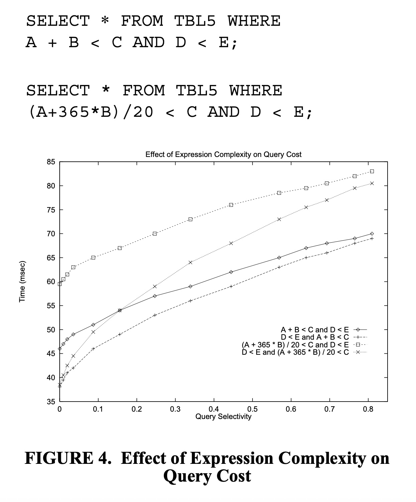
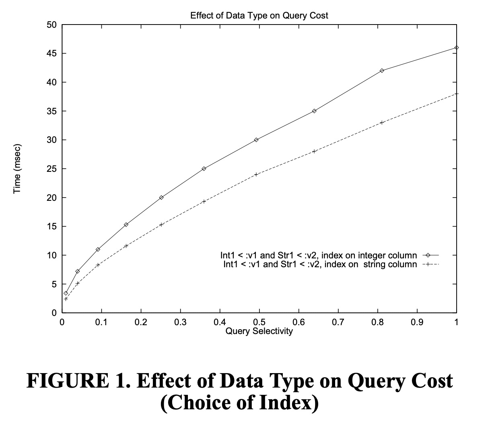
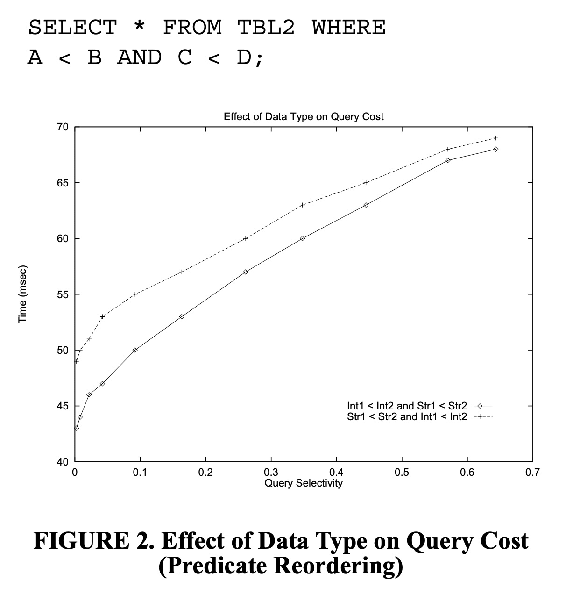
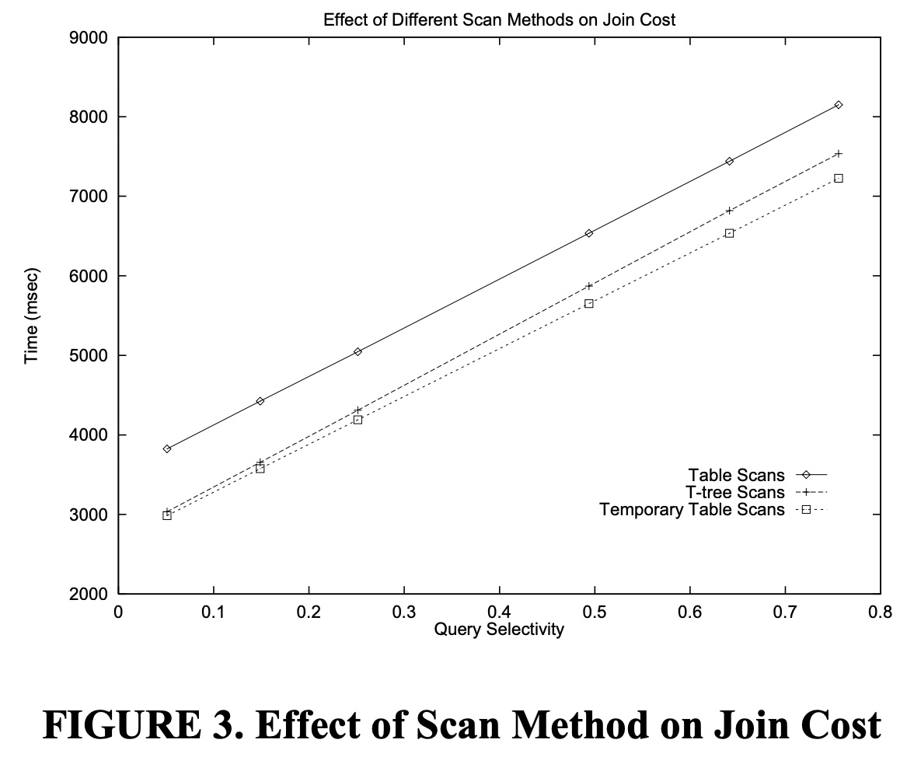

## AI论文解读 | Modelling Costs for a MM-DBMS
        
### 作者        
digoal        
        
### 日期        
2025-10-10        
        
### 标签        
PostgreSQL , PolarDB , DuckDB , AI , 论文解读        
        
----        
        
## 背景  
      
https://awoc.wolski.fi/dlib/imdb/LiNe96.pdf        
  
提示:          
```          
读懂《Modelling Costs for a MM-DBMS》这篇论文需要提前掌握哪些基础知识, 请使用中文通熟易懂的讲解这些基础知识, 可以引用论文中的图、表或使用Markdown支持的图形(text,mermaid等)增加解释性. 
  
使用中文通熟易懂的解读《Modelling Costs for a MM-DBMS》这篇论文, 其中的关键内容请着重讲解, 可以引用论文中的图、表或使用Markdown支持的图形(text,mermaid等)增加解释性. 
  
提取《Modelling Costs for a MM-DBMS》这篇论文中的重要术语, 使用中文对这些术语进行通熟易懂的讲解, 可以引用论文中的图、表或使用Markdown支持的图形(text,mermaid等)增加解释性. 
```     
  
## 1 前置知识 
  
好的，为了完全理解《Modelling Costs for a MM-DBMS》这篇论文，您需要对数据库系统、查询优化以及一些计算机基础有一定的了解。下面我将用通俗易懂的中文为您讲解这些核心基础知识，并结合论文中的图表进行说明。

### 1\. 什么是数据库管理系统 (DBMS)？

想象一下图书馆，书籍就是**数据 (Data)**，而图书管理员和一整套管理系统（比如检索系统、借阅规定）就是**数据库管理系统 (DBMS)**。DBMS 的作用就是高效、安全地存储、管理和提取数据。

这篇论文的核心是 **内存数据库管理系统 (Main-Memory DBMS, 简称 MM-DBMS)**。它与我们更熟悉的传统数据库（磁盘数据库）有一个根本区别：

  * **传统磁盘数据库 (Disk-based DBMS)**：主要数据存储在硬盘 (Disk) 上。硬盘读写速度慢，是整个系统的主要性能瓶颈。因此，它们的性能优化核心是“**减少磁盘 I/O (读写) 次数**” 。
  * **内存数据库 (MM-DBMS)**：所有数据都存放在计算机内存 (RAM) 中 。内存的读写速度比硬盘快成千上万倍，因此没有了磁盘 I/O 这个最大的瓶颈。但也正因为如此，其他之前被忽略的成本，如 **CPU 计算的开销**，就凸显了出来，这使得成本估算变得更加复杂 。

-----

### 2\. 什么是数据库查询和查询优化？

当您想从数据库中查找信息时，您需要发送一个“请求”，这个请求就是**查询 (Query)**（通常用 SQL 语言编写）。

例如，一个查询可能是：“在一个订单表中，找出所有金额大于100元且在过去一个月内发生的交易”。

对于同一个查询，数据库可以有很多种不同的执行方法，每一种方法被称为一个**执行计划 (Execution Plan)**。比如，它可以：

  * **计划A**：先扫描整个表，找到所有金额大于100元的订单，然后再从这些订单里筛选出最近一个月的。
  * **计划B**：先扫描整个表，找到最近一个月的所有订单，然后再从这些订单里筛选出金额大于100元的。

哪个计划更快？这不一定。这就引出了**查询优化器 (Query Optimizer)** 的概念。

查询优化器是 DBMS 的大脑，它的唯一目标就是从成百上千种可能的执行计划中，选出一个 **成本最低（也就是速度最快）** 的计划去执行。

根据论文的描述，一个查询优化器主要由三个部分组成 ：

1.  **可行的计划集 (Set of feasible plans)**：数据库知道的所有可能的执行方式的集合。
2.  **搜索策略 (Search strategy)**：如何在上万个计划中高效地找到一个“最优”的计划。
3.  **目标函数 (Objective function)**：也就是**成本模型 (Cost Model)**，这是本文的绝对核心。

-----

### 3\. 核心议题：什么是成本模型 (Cost Model)？

成本模型是一套数学公式，用来**估算**一个执行计划的“成本”（通常是执行时间），而**不是**实际去运行它。优化器会计算每个备选计划的估算成本，然后选择成本最低的那个。

  * 在**磁盘数据库**中，成本模型很简单：`成本 ≈ 磁盘 I/O 次数` 。
  * 但在**内存数据库**中，情况变了。由于没有磁盘I/O，成本模型必须考虑很多之前被忽略的因素，比如：
      * CPU 计算复杂度（例如，`A+B<C` 就比 `D<E` 复杂） 。
      * 数据类型（例如，处理字符串比处理整数更耗时） 。
      * CPU 缓存的命中率等 。

这篇论文的核心贡献，就是探讨了为 MM-DBMS 建立一个**准确且实用**的成本模型的三种方法 ：

1.  **基于硬件成本 (Hardware-based)**：直接计算 CPU 指令周期。非常精确但极难实现且不易移植 。
2.  **基于应用成本 (Application-based)**：通过分析特定应用程序的性能瓶颈来建模。简单但通用性差 。
3.  **基于执行引擎成本 (Engine-based)**： **（论文推荐的方法）** 将数据库自身的底层操作（如“比较两个整数”、“从哈希索引中查找一个值”）作为基本成本单元来建模。这种方法在准确性、通用性和易用性之间取得了很好的平衡 。

-----

### 4\. 需要了解的关键数据库术语

要读懂论文中的实验和图表，您需要了解以下几个术语：

  * **索引 (Index)**：就像书的目录，能帮助数据库快速定位数据，而无需扫描整张表。论文中提到了 **T-tree**（一种为内存数据库设计的索引结构）和**哈希索引 (hash index)** 。

  * **谓词 (Predicate)**：查询中的过滤条件，即 `WHERE` 子句后面的部分，例如 `A > 100`，`C < D` 等。谓词的评估是有成本的 。论文的一个重要观点是，在 MM-DBMS 中，**谓词评估的成本不容忽视** 。

  * **选择率 (Selectivity)**：指一个谓词能从总数据中过滤出多少比例的数据。例如，一个谓词能筛选出 1% 的数据，我们就说它的选择率是 1%。这是成本估算中的一个关键参数。论文中的所有图表横坐标都是**查询选择率 (Query Selectivity)**。

#### 图表示例解读：

让我们看看论文中的 **Figure 4**，它完美地展示了为什么在 MM-DBMS 中需要一个精细的成本模型。    

这张图比较了两种查询的性能，它们的唯一区别是两个谓词的执行顺序：

1.  **菱形线 (`A+B<C and D<E`)**: 先评估复杂的谓词 `A+B<C`。
2.  **点状线 (`D<E and A+B<C`)**: 先评估简单的谓词 `D<E`。

从图中可以清晰地看到，点状线（先评估简单谓词）的执行时间始终低于菱形线，性能提升最高可达 17% 。这证明了，即使两个谓词的选择率完全相同，它们的计算成本也可能差异巨大，一个好的优化器必须能利用成本模型识别出这一点，并选择最优的执行顺序。

同样，**Figure 1** 和 **Figure 2** 也说明了数据类型对查询成本的影响。例如，处理字符串（`char(20)`）的操作通常比处理整数更耗时，因此优化器应该优先处理基于整数的谓词或索引 。

  

  

### 总结

要读懂这篇论文，您需要掌握的基础知识可以总结为：

1.  **DBMS 基础**：了解数据库是做什么的，特别是**内存数据库 (MM-DBMS)** 和传统磁盘数据库的核心区别（I/O vs. CPU 成本）。
2.  **查询优化原理**：明白什么是**查询**、**执行计划**，以及**查询优化器**如何工作，尤其是**成本模型**在其中扮演的关键角色。
3.  **核心术语**：理解**索引 (Index)**、**谓词 (Predicate)** 和**选择率 (Selectivity)** 等基本概念，这能帮助您看懂论文中的实验设计和图表。

掌握了这些知识后，您就能理解为什么作者认为给 MM-DBMS 建立一个好的成本模型是重要且困难的，以及他们为什么最终推荐并实现了一个“基于执行引擎”的成本模型。
  
## 2 解读论文 
  
好的，这篇名为《为内存数据库管理系统建立成本模型》（Modelling Costs for a MM-DBMS）的论文，主要探讨了在内存数据库（MM-DBMS）中，如何构建一个准确、高效的查询优化成本模型。以下是对此论文的通俗解读。

### **核心问题：为什么内存数据库需要新的成本模型？**

传统的数据库（基于磁盘的DBMS），最慢的操作是**硬盘读写（I/O）** 。因此，它们的查询优化器主要目标就是**最小化I/O次数** 。成本模型也相对简单，基本就是数I/O次数。

然而，在内存数据库（MM-DBMS）中，所有数据都在速度极快的内存里，I/O瓶颈消失了 。这时，很多以前被忽略的成本，如**CPU计算、数据比较、缓存效率**等，变得举足轻重 。这些成本种类繁多且易受硬件和系统软件变化的影响 。因此，为MM-DBMS设计一个准确的成本模型，是一个复杂且重要的新挑战 。

### **三种成本模型的对比**

论文作者提出了三种构建成本模型的思路，并进行了比较 ：

1.  **基于硬件的成本模型 (Hardware-based)**

      * **思路**：直接计算CPU执行的指令周期数 。
      * **优点**：一旦建成，模型会非常准确和稳定 。
      * **缺点**：实现起来极为困难，因为它依赖于CPU缓存策略、预取等复杂的硬件细节，并且很难移植到不同的机器上 。

2.  **基于应用的成本模型 (Application-based)**

      * **思路**：通过性能分析工具（profiler），找出在特定应用中成为性能瓶颈的代码，并基于这些“瓶颈成本”来建模 。
      * **优点**：比基于硬件的模型更容易开发 。
      * **缺点**：通用性差。模型只对特定的应用或测试程序有效，对于其他类型的查询可能完全不准 。例如，论文提到，某个模型因为索引查找在其目标应用中不是瓶颈，就完全没有对索引查找进行建模 。

3.  **基于执行引擎的成本模型 (Engine-based)**

      * **思路**：不关心底层硬件，也不只看特定应用，而是把数据库**执行引擎自身**的“基础操作”作为成本单元 。这些操作可能包括“比较两个整数”、“从一个哈希索引中获取数据”等 。
      * **优点**：
          * **通用性强**：不依赖于特定应用，能反映不同表达式和参数类型带来的成本差异 。
          * **易于开发和移植**：比硬件模型简单，比应用模型通用 。
          * **易于维护**：只有当执行引擎增加或删除功能时才需修改模型本身 。
      * **结论**：作者认为这是**最实用**的方法，并在其开发的Smallbase内存数据库系统中采用了这种模型 。

### **关键发现：内存数据库中的“反常识”性能表现**

作者通过一个自研的“成本测试”程序来验证他们的引擎模型，并揭示了一些在传统数据库中不常见的性能特点。

#### **发现1：数据类型和表达式复杂度严重影响成本**

在MM-DBMS中，谓词（即`WHERE`后的条件）评估的成本占比很高 。成本模型必须精细化到数据类型和表达式层面。

  * **数据类型很重要**：      

      * **图1** 显示了一个查询，它可以通过整数索引或字符串索引来执行。当使用字符串（`char(20)`）索引时，查询速度比使用整数索引快了约25% 。
      * **图2** 表明，即使没有索引，仅仅改变谓词的评估顺序也能带来性能提升。评估一个字符串不等式 (`Str1 < Str2`) 的成本大约是评估整数不等式 (`Int1 < Int2`) 的两倍 。因此，将更“便宜”的整数比较放在前面，可以带来最高12%的性能提升 。

  * **表达式复杂度很重要**：   

      * **图4** 展示了谓词中计算表达式的成本。图中比较了 `A+B < C` (简单表达式) 和 `(A + 365*B)/20 < C` (复杂表达式)。
      * 结果显示，对于这两种情况，如果优化器能识别出 `D < E` 是一个成本更低的谓词并优先执行它，简单的查询能获得高达17%的性能提升，而复杂的金融分析类查询则能获得高达 **35%** 的性能提升 。

    

    ```mermaid
    graph TD
        subgraph "图4 核心逻辑"
            A["查询: WHERE 复杂条件 AND 简单条件"] --> B{选择执行顺序};
            B --> C["方案1: 先执行'复杂条件'"];
            B --> D["方案2: 先执行'简单条件'"];
            C --> E["成本较高"];
            D --> F["成本较低 (性能提升可达35%)"];
        end
    ```

#### **发现2：扫描临时表可能比扫描原始表更快**

这是一个非常“反常识”的发现。在Smallbase系统中，从**临时表**或**T-tree索引**中检索元组，竟然比直接扫描永久存储的表还要快 。这是因为扫描永久表需要遍历一些额外的目录结构，带来了开销 。

  * **图3** 展示了一个没有任何索引的连接查询。    
      * 直接扫描两张原始表（Table Scans）的成本最高。
      * 如果优化器选择先为内层关系创建一个临时表再进行扫描（Temporary Table Scans），性能会得到显著提升 。
      * 甚至，使用T-tree索引来扫描表（即使该索引对连接列无效），也比直接扫描原始表快20%以上 。

### **结论与启示**

  * **MM-DBMS的查询优化很复杂**：由于没有单一的I/O瓶颈，MM-DBMS的成本模型必须更加精细，需要考虑到CPU计算、数据类型、表达式复杂度、甚至是内部数据结构（如临时表）带来的影响 。
  * **引擎模型是实用之道**：基于执行引擎的成本模型在准确性、通用性和开发维护成本之间取得了最佳平衡，是一种构建健壮MM-DBMS优化器的有效方法 。
  * **优化结果可能出人意料**：一个好的成本模型可能会让优化器选择一些看似奇怪但实际高效的执行计划 。例如，在没有可用谓词的情况下，仍然使用索引去扫描一张表 。这证明了在MM-DBMS领域，不能完全依赖于为磁盘系统建立的传统优化直觉。
  
## 3 术语 
  
好的，这是从论文《Modelling Costs for a MM-DBMS》中提取的关键术语及其通俗化中文讲解。

### 1\. 内存数据库管理系统 (Main-Memory DBMS / MM-DBMS)

  * **讲解**: 这是一种将全部数据都存储在计算机主内存（RAM）中的数据库系统 。传统的数据库系统则主要将数据存放在速度较慢的硬盘上。由于内存的读写速度远超硬盘，MM-DBMS 可以为需要极快响应的应用（如电信交换、金融交易）提供高性能 。
  * **核心区别**: 传统数据库最大的性能瓶颈是硬盘I/O（读写），而MM-DBMS没有这个瓶颈，因此其性能成本由CPU计算等其他因素主导 。

### 2\. 查询优化 (Query Optimization)

  * **讲解**: 当你向数据库发出一个查询请求（比如一条SQL语句）时，数据库内部可以有多种方法来执行这个查询并得到结果。每种方法就是一个“执行计划”。查询优化的任务就是从所有可能的执行计划中，挑选出成本最低（通常意味着执行速度最快）的一个 。
  * **论文中的重要性**: 论文指出，MM-DBMS的查询优化问题很大程度上被忽视了 ，但随着应用场景变得复杂，一个好的查询优化器变得至关重要 。

### 3\. 成本模型 (Cost Model)

  * **讲解**: 成本模型是查询优化器的核心组件，它是一套用于**估算**每个执行计划所需“成本”（如执行时间）的公式或规则 。优化器依赖这个模型来比较不同计划的优劣，而不需要实际运行每一个计划。

  * **论文中的分类**: 论文将MM-DBMS的成本模型分为了三类，并认为**基于执行引擎的成本模型**是兼具准确性、通用性和可移植性的最佳选择 。

    ```mermaid
    graph TD
        A[成本模型] --> B["基于硬件<br>(Hardware-based)<br>优点:精确<br>缺点:难实现,难移植"];
        A --> C["基于应用<br>(Application-based)<br>优点:较简单<br>缺点:不通用"];
        A --> D["<b>基于执行引擎<br>(Engine-based)</b><br>优点:通用,易维护<br>缺点:需了解DBMS内部"];
    ```

### 4\. 谓词 (Predicate)

  * **讲解**: 谓词是查询语句中用于过滤数据的条件，通常指`WHERE`子句后面的表达式 。例如，在查询`SELECT * FROM TBL5 WHERE A+B < C AND D < E`中，`A+B < C`和`D < E`都是谓词 。

  * **论文中的关键发现**: 在MM-DBMS中，评估谓词的CPU开销是一个主要成本，不容忽视 。如下图（基于论文图4）所示，即使两个谓词的选择性相同，它们的计算复杂度也会极大地影响查询性能 。先评估简单谓词`D < E`比先评估复杂谓词`A+B < C`，性能最多能提升17% 。   

    *图示：基于论文Figure 4的数据，展示了不同谓词顺序对查询时间的影响。*

### 5\. 选择率 (Selectivity)

  * **讲解**: 选择率是衡量一个谓词过滤数据有效性的指标。它表示一个谓词条件能从数据集中筛选出多大比例的数据。例如，一个选择率为0.1（或10%）的查询，意味着它会返回表中10%的记录。在论文的所有图表中，横坐标都是“查询选择率” 。

### 6\. T-tree 索引

  * **讲解**: T-tree是一种专门为内存数据库系统设计的、类似B-tree的索引结构 。索引的作用类似于书的目录，可以帮助数据库快速定位到需要的数据，从而避免全表扫描。
  * **论文中的反直觉发现**: 论文的测试（如图3所示）发现，在Smallbase系统中，使用T-tree索引来扫描全表，即使索引字段和查询条件无关，也比直接进行全表扫描要快 。    

### 7\. 临时表 (Temporary Table)

  * **讲解**: 临时表是在查询执行过程中动态创建的、用于存放中间结果的表 。查询结束后，临时表通常会被销毁。
  * **论文中的关键发现**: 在论文的测试系统（Smallbase）中，将数据从原始表读出并存入一个临时表，然后再扫描这个临时表，其性能甚至优于直接扫描原始表 。这主要是因为扫描永久表存在一些额外的目录遍历开销 。这一发现在**图3 (Figure 3)** 中有清晰的展示，其中“Temporary Table Scans”的成本最低 。
  
## 参考        
         
https://awoc.wolski.fi/dlib/imdb/LiNe96.pdf    
        
<b> 以上内容基于DeepSeek、Qwen、Gemini及诸多AI生成, 轻微人工调整, 感谢杭州深度求索人工智能、阿里云、Google等公司. </b>        
        
<b> AI 生成的内容请自行辨别正确性, 当然也多了些许踩坑的乐趣, 毕竟冒险是每个男人的天性.  </b>        
  
    
#### [期望 PostgreSQL|开源PolarDB 增加什么功能?](https://github.com/digoal/blog/issues/76 "269ac3d1c492e938c0191101c7238216")
  
  
#### [PolarDB 开源数据库](https://openpolardb.com/home "57258f76c37864c6e6d23383d05714ea")
  
  
#### [PolarDB 学习图谱](https://www.aliyun.com/database/openpolardb/activity "8642f60e04ed0c814bf9cb9677976bd4")
  
  
#### [PostgreSQL 解决方案集合](../201706/20170601_02.md "40cff096e9ed7122c512b35d8561d9c8")
  
  
#### [德哥 / digoal's Github - 公益是一辈子的事.](https://github.com/digoal/blog/blob/master/README.md "22709685feb7cab07d30f30387f0a9ae")
  
  
#### [About 德哥](https://github.com/digoal/blog/blob/master/me/readme.md "a37735981e7704886ffd590565582dd0")
  
  

  
