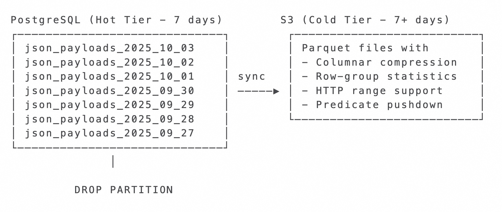
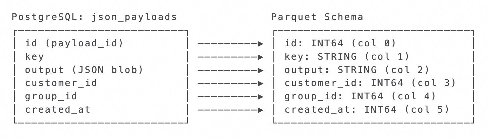
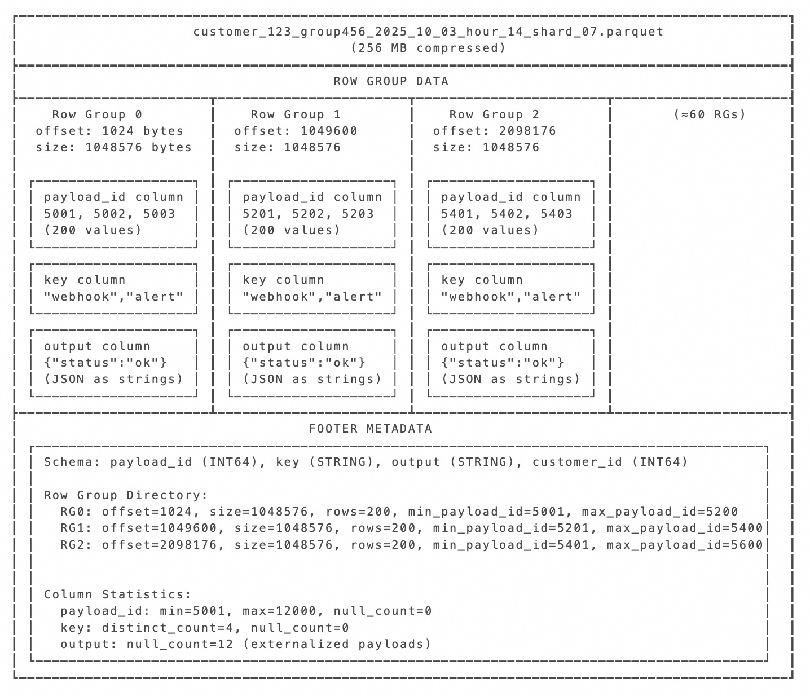
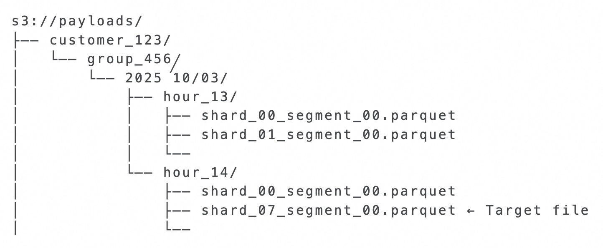
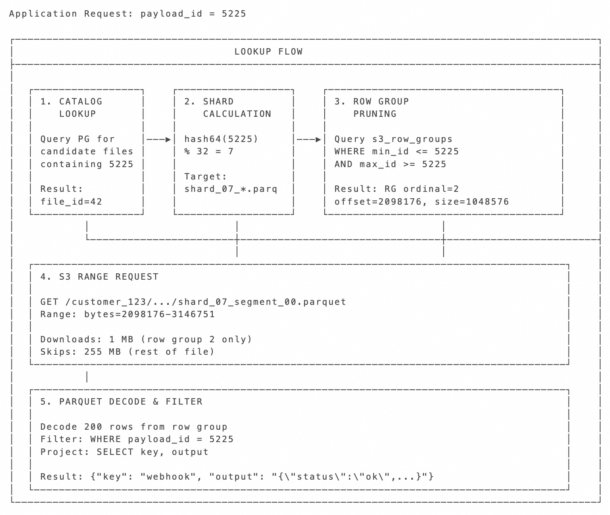

## PG 冷热分离案例 | 把JSON存入S3 Parquet   
                        
### 作者                        
digoal                        
                        
### 日期                        
2025-10-10                       
                        
### 标签                        
PostgreSQL , PolarDB , DuckDB , S3 , OSS , 对象存储 , Parquet , brin , rowgroup , parquet统计信息 , min_max , JSON , 大字段               
                        
----                        
                        
## 背景        
用PG存JSON并不新鲜, 但是重度使用可能遇到一些问题. 因JSON字段通常较大, 会给数据库的备份、vacuum、逻辑复制等常规场景带来较大的压力.   
  
另外, 当JSON的值压缩后仍超过toast threshold(block的四分之一)时, 会写入到TOAST切片中, 在heap tuple内仅存储指向toast的指针. TOAST切片存储本身没什么问题, 但是若当遇到频繁更新的场景, vacuum的压力也会比较大.  
  
有没有冷热存储的方法, 将JSON存入对象存储(parquet格式), 通过PK和json版本ID来进行检索呢? 可以.    
  
Parquet文件采用列存, 数据通过row group分组, 每个RG每个字段都有min_max统计信息, 如果数据的连续性较好, 可快速过滤到少量RG, 检索性能非常好. 对于本场景来说PK和json版本ID都可设计为自增的, 所以过滤性会非常的好. 原理详见:  
- [《数据库筑基课 - 列存之 Parquet》](../202410/20241015_01.md)    
    
下面是一篇实践文章. 内容翻译自: https://www.shayon.dev/post/2025/276/exploring-postgresql-to-parquet-archival-for-json-data-with-s3-range-reads/  
  
PostgreSQL 处理大型 JSON 相当不错，除非您开始频繁更新或删除它们, autovacuum 可能会耗尽您的 I/O 并导致其他问题。我一直在探索将较旧的 JSON 数据（即冷数据）移动到 S3 上的 Parquet 格式，同时将最近的热数据保留在 PostgreSQL 的每日分区中，然后直接删除旧分区，而不是运行昂贵的`DELETE`操作和后续的vacuum。  
  
## TOAST 空间问题  
当任何列值超过 8 KB的四分之一时(默认数据块大小为8k, 默认的toast threshold为四分之一)，PostgreSQL 的 TOAST 机制就会启动。服务器会将超大的值切分成 2 KB 的块，并将它们存储在单独的 toast 表中，从而使heap元组保持较小的大小。这种设计对于读取密集型工作非常有效，但当大型 JSON 频繁更新或删除时，就会带来挑战。  
  
考虑一个典型的`json_payloads`表，其中包含诸如`id`、`key`、`output`（大型 JSON blob）、`customer_id`、`group_id`和`created_at`之类的列。当`output`列中的JSON超过 2 KB 时，PostgreSQL 会自动将其移动到 TOAST 存储，从而产生我们正在探讨的更新和删除性能问题。  
  
当您更新或删除大型 JSON 时，PostgreSQL 会在主表中创建一个新的行版本，并通常会将新的块写入 toast 表。旧的行和 toast 块会变成死元组，autovacuum必须扫描并回收它们。在高流失率(delete)的情况下，这会在两个表之间产生级联工作，通常会导致在包含数亿页的表上执行清理操作需要数小时才能完成。我得另写一篇文章来专门讨论其中一些autovacuum操作的严重程度。  
  
核心问题在于，PostgreSQL 的 MVCC 设计假设大多数数据修改只会影响相对较小的行版本(元组)。大型 JSON 文档打破了这一假设，尤其是在频繁更新或删除的情况下(JSON大字段被更新真的太恐怖了)。  
  
## 冷热数据分离  
让我们探索一种双层存储方法，该方法根据访问模式处理 JSON 数据，而不是强制所有内容通过 PostgreSQL 的heap和toast机制。近期数据保持在 PostgreSQL 每日分区中，以实现快速事务访问，而较旧的数据则移动到 S3 Parquet 文件格式的冷存储中。当您的query通常更频繁地查找近期数据而非旧数据时，这种设计非常有用。  
  
关键在于使用`DROP PARTITION`替代`DELETE`操作。删除分区会立即删除`heap`和 `toast`，从而完全避免了原方法昂贵的 vacuum 垃圾回收。  
  
  
  
这种分离让我们能够通过 PostgreSQL 专注于其最擅长的功能：ACID 事务、索引查找和活动数据管理。冷存储层则处理 S3 和 Parquet 的优势：经济高效的存储、压缩以及带有列格式的分析型查询。  
  
## Parquet 文件结构和模式映射  
这是一篇熟悉 Parquet 的好文章：https://arrow.apache.org/blog/2022/12/26/querying-parquet-with-millisecond-latency/  
  
或: [《数据库筑基课 - 列存之 Parquet》](../202410/20241015_01.md)    
  
当我们将数据从`json_payloads`表导出到 Parquet 时，我们定义了一个模式，将 PostgreSQL 列映射到 Parquet 的列式格式：  
  
  
  
Parquet 的内部组织结构支持选择性读取，从而使该架构切实可行。每个文件由包含列式数据的row group组成，并带有一个页脚，用于存储schema信息和统计信息(其中包括每个字段的min_max值)，以便高效地进行数据修剪/过滤。  
  
  
  
页脚统计信息支持谓词下推。搜索`payload_id = 5225`时，我们可以检查`最小/最大值`，并立即跳过行组 `0` 和 `1`，因为我们知道它们不包含我们的目标`5225`。这样就无需下载和扫描不相关的数据。  
  
## 确定性分片和文件组织  
我们使用哈希函数将数据有效分布到各个分片，以确保文件位置可预测，同时控制文件扩散。每个`payload_id`分片在每个时间段内都映射到一个分片。  
```  
payload_id = 5225  
shard = hash64(5225) % 32  # Results in shard 7  
  
S3 Key: customer_123/group_456/2025/10/03/hour_14/shard_07_segment_00.parquet  
```  
  
这将创建一个支持高效分区修剪的分层 S3 结构：  
  
  
  
写入器将行追加到其指定的分片，直到达到约 `128-256 MB` 为止，然后滚动到下一个段。如果数据量很大，我们可能会在同一小时内看到每个分片中有多个段，例如，`shard_07_segment_02.parquet`、`shard_07_segment_00.parquet和shard_07_segment_01.parquet`。在每个文件中，我们将row group压缩为 `1-4 MB`，以针对 HTTP 范围请求进行优化。此行组大小至关重要，因为它决定了范围请求的粒度 —— 足够小以最大限度地减少数据传输，足够大以分摊请求开销。这种方法可以限制文件激增，同时确保任何 `payload_id` 都映射到单个可预测的位置，而无需索引查找。  
  
## 元数据跟踪的数据库模式设计  
为了高效地查询这些打包的数据，我们可以在 PostgreSQL 中维护一个轻量级catalog(类似数据湖的元数据, 可参阅`ducklake`, 其实在PG中用duckdb相关插件可很好的解决本文提到的冷热分离问题, 如moonlink, pg_mooncake)，用于跟踪 S3 文件并实现高效的点查找，而无需在每次请求时都拉取整个 Parquet 文件。  
  
[《PostgreSQL iceberg 实时数据湖表 by pg_mooncake + moonlink》](../202509/20250915_08.md)    
  
[《Mooncake-Labs 架构进化, 核心是 moonlink》](../202509/20250915_01.md)    
  
例如  
```  
CREATE TABLE s3_file_catalog (  
  id                  SERIAL PRIMARY KEY,  
  customer_id         BIGINT NOT NULL,  
  group_id            BIGINT NOT NULL,  
  date                DATE NOT NULL,  
  hour                INTEGER NOT NULL,  
  shard               INTEGER NOT NULL,  
  segment             INTEGER NOT NULL,  
  s3_key              TEXT NOT NULL,  
  min_payload_id      BIGINT NOT NULL,  
  max_payload_id      BIGINT NOT NULL,  
  total_size_bytes    BIGINT NOT NULL,  
  externalized_ranges INTEGER[] DEFAULT '{}',  
  created_at          TIMESTAMP DEFAULT NOW()  
);  
  
CREATE TABLE s3_row_groups (  
  id                  SERIAL PRIMARY KEY,  
  s3_file_catalog_id  BIGINT REFERENCES s3_file_catalog(id),  
  ordinal             INTEGER NOT NULL,  
  offset_bytes        BIGINT NOT NULL,  
  size_bytes          BIGINT NOT NULL,  
  row_count           INTEGER NOT NULL,  
  min_payload_id      BIGINT NOT NULL,  
  max_payload_id      BIGINT NOT NULL,  
  created_at          TIMESTAMP DEFAULT NOW()  
);  
```  
  
catalog 保持较小规模，因为它的复杂度是 `O(files)` 而不是 `O(payloads)`。每个文件条目包含确定其是否包含目标有效 ID 所需的元数据(即文件级别min_max统计信息, 比row group级别的统计范围更大, 用来过滤文件)，而行组条目则提供精确 HTTP 范围请求所需的字节偏移量。  
  
`s3_row_groups`表用于缓存解析后的 Parquet 页脚元数据，从而进行性能优化。虽然 Parquet 页脚包含我们需要的所有信息（包括行组字节偏移和列统计信息），但每次查找时解析这些元数据都需要读取页脚并解码统计信息。  
  
当我们根据`json_payloads`数据构建 Parquet 文件时，Parquet 会自动为每个行组生成列统计信息，包括`id`列（包含业务`payload_id`值）的min_max值。这些统计信息以编码字节的形式存储，并按列位置进行索引 —— 我们的id列统计信息显示在页脚统计图的索引 0 处。  
  
`s3_row_groups`表会缓存这些解码后的payload_id min_max值以及行组字节偏移量。这种优化在数据湖架构中已得到广泛应用 —— 像 Iceberg 和 Delta Lake 这样的系统会维护类似的元数据目录，以避免重复解析页脚。对于我们的用例，这使我们能够在每次查找时跳过页脚读取和统计信息解码。  
  
## 将分区同步到 Parquet  
当每日分区符合归档条件时，我们可以通过 Parquet 写入器将其行流式传输，这些写入器负责处理分片、基于大小的外部化以及元数据捕获。这些 Parquet 写入器支持多种语言，例如 Go、Rust、Python 等。  
```  
def sync_partition_to_s3(partition_name)  
  writers = {}  
  
  
  # "SELECT * FROM #{partition_name} limit...."  
  fetch_data_in_batches.each do |row|  
    shard = hash64(row[:payload_id]) % 32  
    key = [row[:customer_id], row[:group_id], row[:hour], shard]  
  
    writer = writers[key] ||= create_parquet_writer(key)  
  
    if estimate_compressed_size(row[:output]) > 4.megabytes  
      externalize_to_s3(row)  
      row[:output] = nil  
      row[:is_external] = true  
    end  
  
    writer.append_row(row)  
  
    if writer.size_bytes > 256.megabytes  
      close_and_catalog_writer(writer)  
      writers[key] = create_parquet_writer(key)  
    end  
  end  
  
  writers.each { |key, writer| close_and_catalog_writer(writer) }  
  execute("DETACH TABLE #{partition_name}")  
  # When ready, drop the partition  
end  
```  
  
`close_and_catalog_writer`函数读取已完成的 Parquet 文件的页脚元数据，并提取高效查找所需的信息。对于每个行组，它从页脚目录中捕获字节偏移量、压缩大小和行数。更重要的是，它解码我们id列的列统计信息（存储在统计图中的索引 0 处），以从编码的字节数组中提取实际的最小和最大 payload_id 值。  
  
此元数据提取步骤至关重要，因为 Parquet 将统计信息存储为需要解码的`min_bytes`和`max_bytes`。对于像我们的 `payload_id` 这样的 INT64 列，我们将其解码为`小端 8 字节整数`。通过在文件创建期间执行一次此操作并将结果缓存在 PostgreSQL 中，我们可以实现快速索引查找，而无需在每次读取时进行页脚解析和字节解码的开销。  
  
注意：还有其他方法可以流式传输这些数据，例如使用逻辑复制(这里就不得不提 pg_mooncake, 已经被databrick收购)。只要您希望流式传输`INSERTs`数据并且您的数据没有任何`UPDATES`(再次提醒, pg_mooncake支持update实时传输)，并且您可以依赖类似 S3 生命周期规则的功能进行删除，这种设置就有效。还有其他方法，例如增量同步数据。我暂时不讨论如何以 Parquet 格式高效地将数据从 PG 流式传输到 S3，但请记住，有一些很好的方法可以让您几乎实现近乎实时的数据。  
  
## 点查机制  
当应用程序请求特定有效时，我们遵循旨在通过谓词下推和范围定位来最小化数据库查询和 S3 请求的序列。  
  
  
  
这种方法通常在 100-200 毫秒内完成点查，大部分时间都花在 S3 范围请求上，而不是数据库操作或 Parquet 解码上。主要的优化是谓词下推与精确范围定位相结合。  
  
## 谓词下推和 I/O 效率  
存储在 Parquet 页脚中的统计信息支持复杂的谓词下推，与简单的方法相比，可以显著减少 I/O。我们无需下载整个文件并在内存中进行筛选，而是可以根据`s3_row_groups`表中缓存的元数据排除整个行组。  
  
考虑一个有效的查询，其中`payload_id BETWEEN 5300 AND 5350`。如果没有谓词下推，我们将下载整个 `256 MB` 的文件。通过行组统计信息，我们可以确定只有行组 1 可能包含匹配的记录，并仅获取该 `1-4 MB` 的段：  
```  
Row Group Analysis (from cached metadata):  
Row Group 0: min_payload_id=5001, max_payload_id=5200 → SKIP (max=5200 < 5300)  
Row Group 1: min_payload_id=5201, max_payload_id=5400 → FETCH (range 5300-5350 overlaps)  
Row Group 2: min_payload_id=5401, max_payload_id=5600 → SKIP (min=5401 > 5350)  
  
Result: Single range request for Row Group 1 only  
S3 GET Range: bytes=1049600-2098175 (1 MB instead of 256 MB)  
```  
  
与下载完整文件相比，此谓词下推可将网络传输量减少 99% 以上。您的 POC 演示了这种效率——获取单个有效仅下载 2.5 MB，并在日志中报告“文件的 4.2%”，这展示了行组定位如何在保持处理任意`payload_id`范围的灵活性的同时最大限度地减少 I/O。  
  
## 性能特征和权衡  
冷热分离双层架构可在不同的访问模式下提供可预测的性能。PostgreSQL 中的热数据在索引查找时保持低于 `10 毫秒`的响应时间，而 Parquet 中的冷数据通常响应时间为 `100-200 毫秒`，具体取决于行组大小和 S3 延迟。  
  
存储成本明显偏向冷层。PostgreSQL 存储不仅包含 JSON 数据，还包括索引、toast 开销以及 vacuum 操作释放的空间。Parquet 能帮助 JSON 数据实现 `60-80%` 的压缩率，成本约为每 GB 每月 0.023 美元。  
  
权衡利弊在于操作复杂性。我们现在管理两个具有不同一致性模型、备份策略和故障模式的存储系统。然而，这种复杂性被限制在存储层内，并且通过统一的有效访问接口对应用程序代码不可见。  
  
最显著的优势是消除了大型 JSON字段 的 autovacuum 压力。通过使用`DROP PARTITION` 替代 `DELETE`操作，我们避免了昂贵的PG 垃圾回收操作，而在此之前vacuum清理消耗了我们的大部分 `I/O` 。  
  
## 注意事项  
这种方法对于 `insert` 繁重的工作非常有效，其中旧数据变为只读，但它引入了一些值得理解的权衡。  
  
数据一致性： S3 Parquet 数据最终与 PostgreSQL 保持一致。同步失败或部分写入时，可能会出现暂时的不一致。catalog 有助于检测这些情况，但应用程序需要处理元数据存在但 S3 对象不存在的情况。  
  
归档数据的更新和删除：一旦 JSON 迁移到 Parquet，更新操作将变得非常昂贵，因为它们需要重写整个行组。删除操作需要逻辑删除跟踪或文件压缩。此设计假设旧数据很少更改，您可以依赖 S3 生命周期策略来设置过期时间。如果您需要频繁更新归档数据，那么将其保存在 PostgreSQL 中可能更合理。  
  
## 未来的优化和考虑  
一些增强功能可以进一步改进此架构，例如异步 I/O，可以一次从一个或多个 Parquet 文件中获取多个范围。或者，当行组min_max与查询谓词重叠时，Parquet 页脚中的布隆过滤器可以减少误报。  
  
关键架构原则保持不变：利用 PostgreSQL 实现事务一致性和对热数据的快速索引访问，同时使用 Parquet 和 S3 实现经济高效的存储和对冷数据进行分析式查询。这种分离存储使每个系统都能在其最佳性能范围内运行，同时为应用程序提供统一的接口。  
  
最后，还有像 DuckDB 这样的服务允许您使用 SQL 查询相同性质的数据，这非常好，我计划进一步探索。  
  
未来可参考:   
- [《PostgreSQL iceberg 实时数据湖表 by pg_mooncake + moonlink》](../202509/20250915_08.md)    
- [《Mooncake-Labs 架构进化, 核心是 moonlink》](../202509/20250915_01.md)    
  
    
#### [期望 PostgreSQL|开源PolarDB 增加什么功能?](https://github.com/digoal/blog/issues/76 "269ac3d1c492e938c0191101c7238216")
  
  
#### [PolarDB 开源数据库](https://openpolardb.com/home "57258f76c37864c6e6d23383d05714ea")
  
  
#### [PolarDB 学习图谱](https://www.aliyun.com/database/openpolardb/activity "8642f60e04ed0c814bf9cb9677976bd4")
  
  
#### [PostgreSQL 解决方案集合](../201706/20170601_02.md "40cff096e9ed7122c512b35d8561d9c8")
  
  
#### [德哥 / digoal's Github - 公益是一辈子的事.](https://github.com/digoal/blog/blob/master/README.md "22709685feb7cab07d30f30387f0a9ae")
  
  
#### [About 德哥](https://github.com/digoal/blog/blob/master/me/readme.md "a37735981e7704886ffd590565582dd0")
  
  

  
