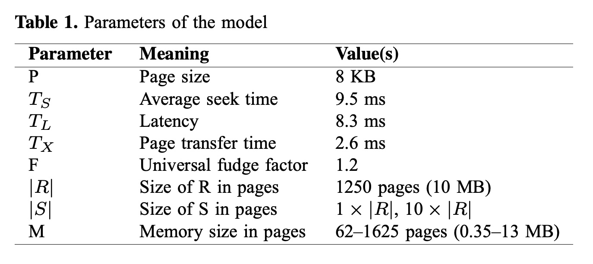
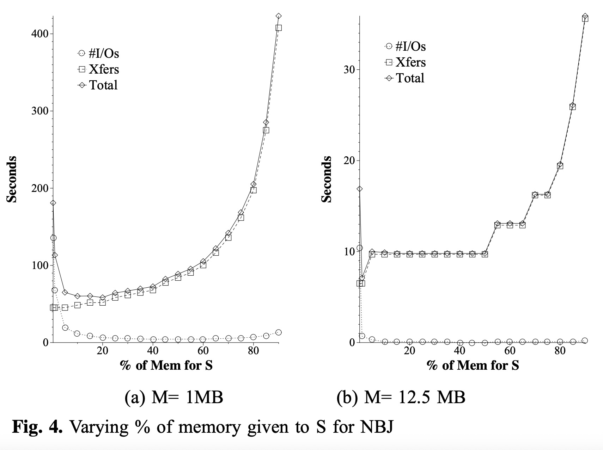
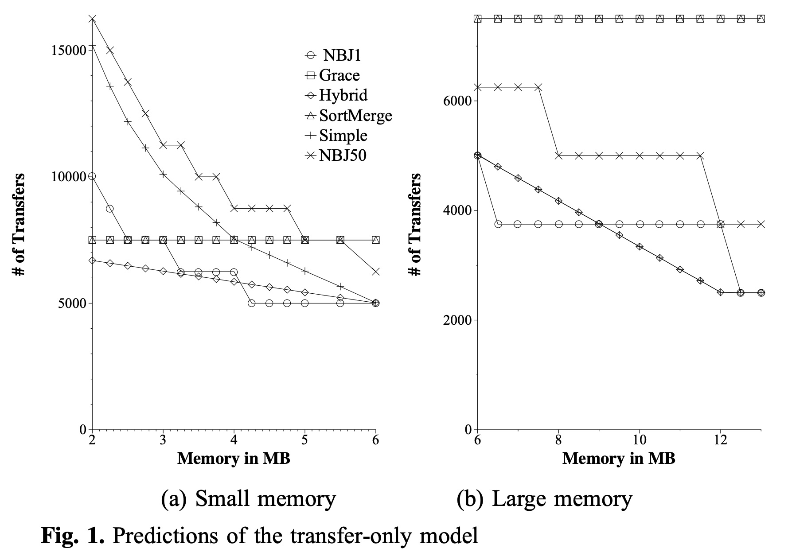
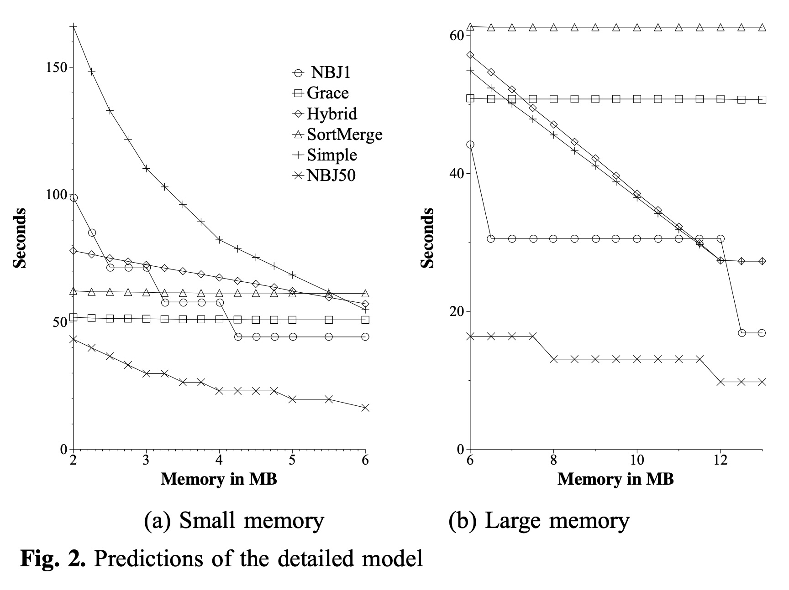
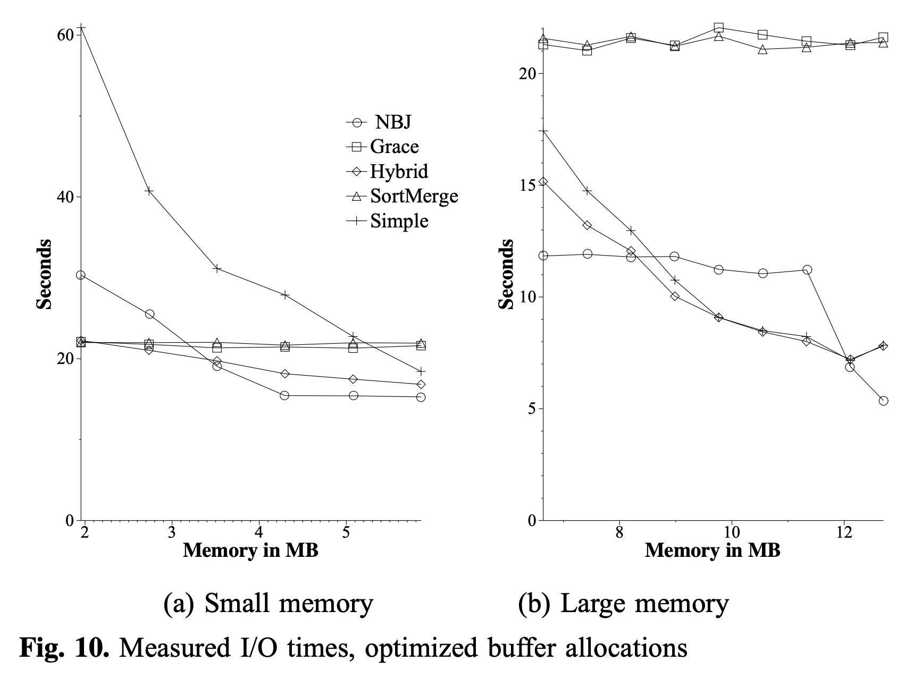
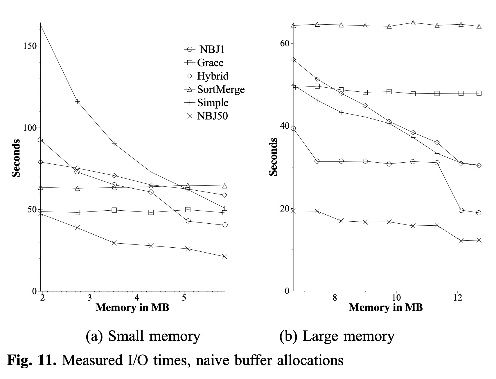
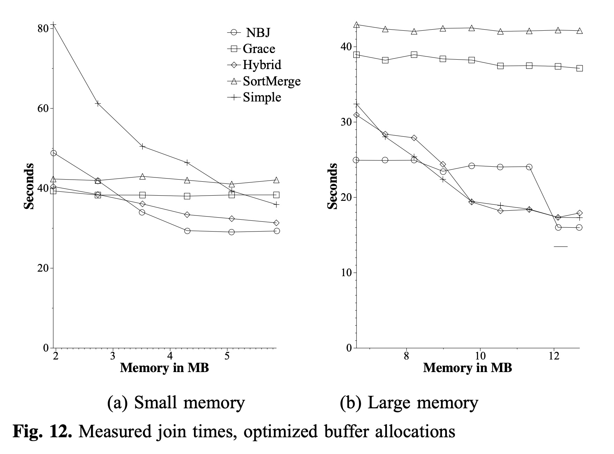
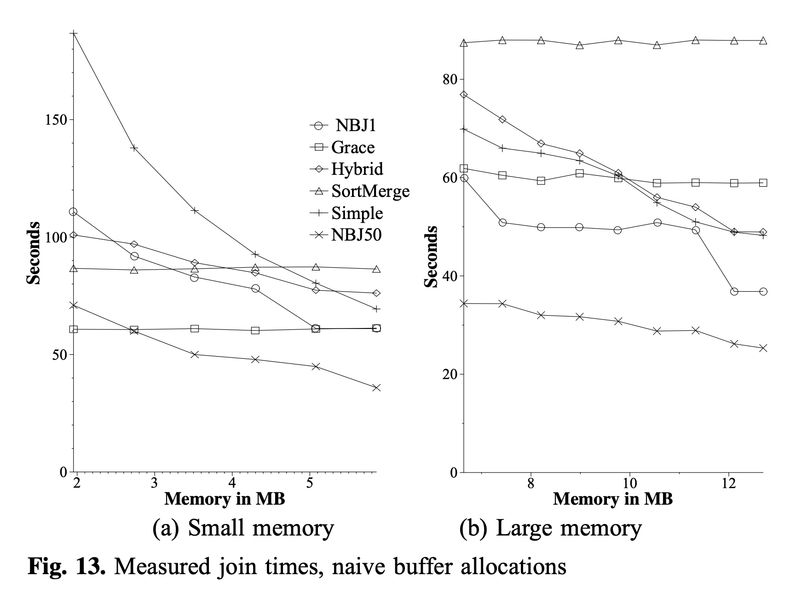
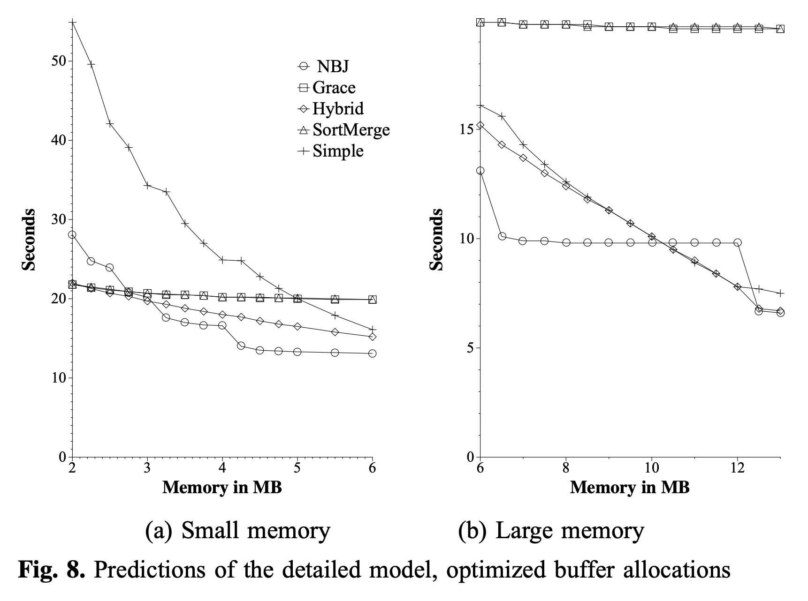

## AI论文解读 | SEEKing the truth about ad hoc join costs
        
### 作者        
digoal        
        
### 日期        
2025-10-10        
        
### 标签        
PostgreSQL , PolarDB , DuckDB , AI , 论文解读        
        
----        
        
## 背景  
      
https://www.vldb.org/journal/VLDBJ6/70060241.pdf        
  
提示:          
```          
读懂《SEEKing the truth about ad hoc join costs》这篇论文需要提前掌握哪些基础知识, 请使用中文通熟易懂的讲解这些基础知识, 可以引用论文中的图、表或使用Markdown支持的图形(text,mermaid等)增加解释性. 
  
使用中文通熟易懂的解读《SEEKing the truth about ad hoc join costs》这篇论文, 其中的关键内容请着重讲解, 可以引用论文中的图、表或使用Markdown支持的图形(text,mermaid等)增加解释性. 
  
提取《SEEKing the truth about ad hoc join costs》这篇论文中的重要术语, 使用中文对这些术语进行通熟易懂的讲解, 可以引用论文中的图、表或使用Markdown支持的图形(text,mermaid等)增加解释性. 
```     
  
## 1 前置知识 
  
好的，为了能透彻理解这篇经典的数据库论文《SEEKing the truth about ad hoc join costs》，你需要掌握一些前置的基础知识。这篇论文的核心在于论证了**一个精确的I/O成本模型对于数据库查询优化器的重要性**，并揭示了传统认知中的一些误区。

下面我将用通俗易懂的方式，为你讲解需要掌握的核心概念，并引用论文中的图表来辅助说明。

### 1\. 数据库核心概念

这是最基础的部分，你需要明白论文研究的对象是什么。

#### 1.1 关系 (Relation) 和元组 (Tuple)

在关系型数据库中，你可以简单地将“关系”理解为一张**表**，将“元组”理解为表中的一**行**数据。

#### 1.2 连接 (Join) 操作

连接是数据库中最基本也是最昂贵的操作之一。它的作用是根据某些共同的条件（比如ID相同），将两个或多个表中的行组合起来。

例如，有一个`订单表 (Orders)`和一个`顾客表 (Customers)`，我们想找出每个订单对应的顾客信息，就需要将这两个表通过`顾客ID`进行连接。

#### 1.3 Ad Hoc 连接 (Ad Hoc Join)

这是论文标题中的一个关键词。`Ad Hoc` 意为“即席的、临时的”。Ad Hoc 连接指的是那些**没有预先准备**的连接查询。在数据库中，通常我们可以通过创建索引（比如B-树 ）来极大加速连接操作。但对于数据分析、决策支持等场景，查询往往是临时的、不可预测的，系统来不及或无法为这些查询建立专门的索引 。因此，数据库必须有一些“最后手段”算法  来处理这种没有索引可用的连接，这类算法就是 Ad Hoc 连接算法。

### 2\. 计算机 I/O 系统与成本模型

这部分是理解论文核心论点的关键，即**成本是如何计算的**。

#### 2.1 内存 vs. 磁盘

  * **内存 (Memory/RAM)**：速度极快，但容量小且昂贵。CPU可以直接访问。
  * **磁盘 (Disk/HDD)**：速度很慢，但容量大且便宜。数据必须先从磁盘读取到内存中，CPU才能处理。

由于 Ad Hoc 连接要处理的数据量通常远大于内存容量，因此必然涉及大量的磁盘读写（I/O），这也是性能的主要瓶颈。

#### 2.2 磁盘 I/O 操作的三个步骤

论文的核心论点之一是，不能简单地认为I/O成本只和读取的数据量有关。一次完整的磁盘I/O操作包含三个主要步骤 ：

1.  **寻道 (Seek)**：将磁盘的磁头移动到数据所在的磁道。这是最耗时的一步。好比在图书馆里走到正确的书架。
2.  **延迟 (Latency)**：等待磁盘盘片旋转，直到目标数据转到磁头的下方。好比在书架前等待传送带把你要的那本书送到你面前。
3.  **传输 (Transfer)**：实际地将数据从磁盘盘片读取或写入到内存。这是真正干活的时间。好比你从书中抄写内容。

#### 2.3 I/O 成本模型 (I/O Cost Models)

数据库的查询优化器正是通过成本模型来估算不同执行方案的开销，从而选择最优的一个 。论文对比了两种成本模型：

  * **传统简单模型 (Transfer-only Model)**：过去很多研究只计算**传输成本**，即总共读写了多少数据页 。它忽略了寻道和延迟的成本。
  * **本文详细模型 (Detailed Model)**：该论文提倡的模型，认为总成本是三者之和 。
    其公式为：
    $$C_{T} = N_{S} \times T_{S} + N_{I/O} \times T_{L} + N_{X} \times T_{X}$$
    其中：
      * $C_{T}$ 是总I/O成本（时间）。
      * $N_{S}$ 是寻道次数, $T_{S}$ 是平均寻道时间。
      * $N_{I/O}$ 是I/O请求次数, $T_{L}$ 是平均延迟时间。
      * $N_{X}$ 是传输的数据页数量, $T_{X}$ 是每页的传输时间。

论文使用的具体参数值如下表所示：   

**表1：模型的参数** 

| 参数 | 含义 | 数值 |
| :--- | :--- | :--- |
| P | 页面大小 | 8 KB |
| $T_{S}$ | 平均寻道时间 | 9.5 ms |
| $T_{L}$ | 延迟时间 | 8.3 ms |
| $T_{X}$ | 页面传输时间 | 2.6 ms |
| F | 通用fudge factor | 1.2 |
| R | R关系的大小 | 1250 页 (10 MB) |
| S | S关系的大小 | $1\times|R|$ , $10\times|R|$ |
| M | 内存大小 | 62-1625 页 (0.35-13 MB) |

理解了这个详细模型，你就能明白为什么一个算法即使传输的数据总量不大，但如果产生了大量零散的、随机的I/O请求（导致 $N_S$ 和 $N_{I/O}$ 很高），其总成本依然会非常高。

### 3\. 主流的 Ad Hoc 连接算法

论文分析了五种经典的“最后手段”连接算法 ，你需要了解它们的基本工作原理。

1.  **嵌套块连接 (Nested Block Join, NBJ)**:
    这是最朴素的循环连接的改进版。它将外层关系（较小的表R）分块读入内存，对于每一块，完整地扫描一遍内层关系（较大的表S）来进行匹配 。

2.  **排序归并连接 (Sort-Merge Join)**:
    分为两阶段 ：

      * **排序阶段**：分别对两个关系（R和S）进行排序，由于内存有限，通常需要使用外部排序算法，产生多个排好序的“顺串”（runs）并写回磁盘。
      * **归并阶段**：同时读取R和S的已排序顺串，像拉拉链一样将它们归并起来，完成连接操作。

3.  **哈希连接 (Hash Join)**:
    这是一类利用哈希函数进行连接的算法，核心思想是“分而治之”：用哈希函数将两个大表拆分成很多小的“桶”（buckets），然后只需对两个表中对应的桶进行连接即可，因为不同桶之间的数据不可能匹配。

      * **简单哈希连接 (Simple Hash Join)**: 一次只处理一个哈希桶。它反复扫描关系R，每次将一个桶的元组加载到内存的哈希表中，然后扫描S，与内存中的哈希表进行匹配，未匹配的S元组被写回磁盘用于下一轮 。
      * **Grace 哈希连接 (Grace Hash Join)**: 也是两阶段 。第一阶段（分区阶段），完整扫描R和S，将它们分别用哈希函数划分成多个桶，并写入磁盘 。第二阶段（连接阶段），依次将R的每个桶读入内存建立哈希表，再读入S对应的桶进行探测匹配 。
      * **混合哈希连接 (Hybrid Hash Join)**: Grace算法的优化版 。在第一阶段分区时，会“混合”地将第一个桶（Bucket 0）的数据直接保留在内存中，不写回磁盘 。当扫描S时，属于Bucket 0的元组可以直接进行连接，而不用写回磁盘 。这减少了I/O量，被认为是当时最高效的算法。

### 4\. 核心议题：缓冲区分配 (Buffer Allocation)

这是论文中另一个至关重要的概念。**缓冲区 (Buffer)** 是内存中预留出来用于存放从磁盘读入或准备写入磁盘的数据页的区域。如何分配内存给不同的缓冲区，对算法性能有巨大影响 。

例如，对于嵌套块连接 (NBJ)，内存被分为两部分：一部分给R（ $M_R$ ），一部分给S（ $M_S$ ） 。

  * 如果给S的缓冲区（ $M_S$ ）太小，那么每次扫描S时就需要进行大量、零散的I/O，导致很高的寻道和延迟成本。
  * 如果给S的缓冲区太大，留给R的内存（ $M_R$ ）就变小了，导致R需要被分成更多块，从而需要重复扫描S的次数增加，导致总传输数据量剧增。

这其中存在一个权衡。论文通过其详细模型，精确地分析了这种权衡，并给出了寻找最优分配的公式。下图（论文中的Figure 4）生动地展示了这一点：    

*图源：Haas, L.M., Carey, M.J., Livny, M. et al. The VLDB Journal (1997) 6: 241-256. Figure 4*

上图显示了NBJ算法的总成本（Total）、I/O次数成本（\#I/Os）和传输成本（Xfers）是如何随着分配给S的内存百分比变化的。可以看到，总成本曲线是一个“U”形，存在一个最优的分配点（在图a中大约是20% ，在图b中大约是4% ），这个点并不是简单的“一个页面”或“对半开” 。

-----

### 总结

当你掌握了以上四个方面的知识后，就能清晰地理解这篇论文的脉络和贡献了：

1.  **背景**: 数据库需要处理没有索引的 Ad Hoc 连接。
2.  **问题**: 传统的、只看传输量的成本模型，可能会误导查询优化器选择错误的算法（例如，图1的预测显示Hybrid Hash几乎总是最优 ）。    
3.  **方法**: 作者提出了一个更详细的、包含寻道、延迟和传输三个部分的I/O成本模型。
4.  **分析**: 使用这个详细模型，重新分析了五种主流连接算法，发现结果与传统认知大相径庭（例如，图2的预测显示在很多情况下NBJ50是赢家，而Hybrid Hash表现不佳 ）。    
5.  **深化**: 进一步指出，缓冲区分配是影响性能的关键，并利用详细模型推导出了为不同算法优化缓冲区分配的公式。

读懂这些，你就能体会到这篇论文在数据库查询优化领域为何具有如此重要的地位。
  
## 2 解读论文 
  
好的，这篇经典的数据库论文《SEEKing The Truth About Ad Hoc Join Costs》虽然发表于1997年，但其核心思想至今仍然具有重要的指导意义。它的标题一语双关，"SEEKing" 既指探寻真相，也暗示了磁盘 **寻道(Seek)** 成本的重要性。

下面我将为您通俗地解读这篇论文的关键内容。

### 核心论点：简单的I/O成本模型会骗人！

在数据库系统中，查询优化器（Query Optimizer）的职责是为一条SQL查询选择一个最快、最省资源的执行计划 。为了做出选择，它需要一个**成本模型**来估算不同方案的开销。过去，很多研究和系统在估算I/O成本时，都采用了一个**极其简化的模型**：`成本 = 读写的总数据页数 × 每页的传输时间` 。

这篇论文的核心论点就是：**这种只计算传输量（transfer-only）的简单模型是严重失真且极具误导性的** 。一个更真实、更详细的I/O模型必须考虑磁盘操作的全部物理过程，否则优化器就会做出错误的决策，导致性能大幅下降。

### 论文提出的“详细I/O成本模型”

作者认为，一次磁盘I/O的真实成本由三部分构成：**寻道、延迟和传输** 。因此，总成本应该是：
$$C_{T} = (N_{S} \times T_{S}) + (N_{I/O} \times T_{L}) + (N_{X} \times T_{X})$$

  * **寻道成本 ( $N_{S} \times T_{S}$ )**: 磁头移动到正确磁道的开销。 $N_{S}$ 是寻道次数， $T_{S}$ 是平均寻道时间 。
  * **延迟成本 ( $N_{I/O} \times T_{L}$ )**: 等待磁盘盘片旋转到正确位置的开销。 $N_{I/O}$ 是I/O请求的总次数， $T_{L}$ 是平均延迟时间 。
  * **传输成本 ( $N_{X} \times T_{X}$ )**: 实际读写数据的开销。 $N_{X}$ 是传输的数据页总数， $T_{X}$ 是传输一页数据的时间 。

**关键点**：寻道和延迟的成本通常远高于传输一页数据的成本。因此，一个算法哪怕传输的数据总量少，但如果它产生了大量零散、随机的I/O请求（导致 $N_S$ 和 $N_{I/O}$ 很高），其总性能也会非常糟糕。

### 实验对比：简单模型 vs. 详细模型

为了证明观点，论文分析了五种经典的“即席连接”（Ad Hoc Join）算法：

  * 嵌套块连接 (Nested Block Join, NBJ)
  * 排序归并连接 (Sort-Merge Join)
  * 简单哈希连接 (Simple Hash Join)
  * Grace哈希连接 (Grace Hash Join)
  * 混合哈希连接 (Hybrid Hash Join)

#### 关键内容1：颠覆“混合哈希最优”的传统认知

当时的“普遍共识”（common wisdom）认为，混合哈希连接（Hybrid Hash Join）是处理即席连接的最佳算法 。下图（论文Fig. 1）是基于 **传统简单模型（只看传输量）** 的预测结果，它也支持这一观点。    

*图源: Haas, L.M., Carey, M.J., Livny, M. et al. The VLDB Journal (1997) 6: 241-256. Figure 1*

从上图可以看到，无论内存大小，Hybrid（混合哈希）的传输页数（\# of Transfers）几乎总是最少的，因此简单模型会认为它是最优的。

然而，当使用作者提出的**详细模型**重新进行预测时，结果发生了惊天逆转。    

*图源: Haas, L.M., Carey, M.J., Livny, M. et al. The VLDB Journal (1997) 6: 241-256. Figure 2*

上图（论文Fig. 2）显示，在绝大多数内存范围内，**NBJ50**（为内层关系分配50%内存的嵌套块连接）的实际执行时间（Seconds）反而是最短的，成为了赢家 。而之前被认为是“王者”的Hybrid，表现甚至不如Grace和SortMerge，沦为第四选择 。

**原因解析**：这是因为在这些默认配置下，Hybrid Hash为了在内存中保留一个哈希桶，导致其他桶在分区阶段能使用的缓冲区非常小，从而产生了大量零碎的I/O操作。这些操作的寻道和延迟成本，远超过了它因减少数据传输量而省下的时间 。这个结果有力地证明了**只看传输量的模型是错误的**。

#### 关键内容2：缓冲区分配（Buffer Allocation）的决定性作用

论文进一步揭示了另一个被忽视的关键因素：**内存缓冲区如何分配**。一个算法的性能并非一成不变，而是极度依赖于如何为其I/O操作分配内存。

以嵌套块连接（NBJ）为例，内存需要分给外层表（R）和内层表（S）。该如何分配呢？是给S一个页面（NBJ1的策略），还是对半开（NBJ50的策略），还是有其他更优的选择？

下图（论文Fig. 4）展示了在不同内存大小下，改变分配给S的内存比例对总成本的影响。    

*图源: Haas, L.M., Carey, M.J., Livny, M. et al. The VLDB Journal (1997) 6: 241-256. Figure 4*

从图中可以清晰地看到：

  * **分配太少**（靠左侧）：读取S时需要大量I/O请求，导致I/O次数成本（\#I/Os，主要体现为延迟和寻道成本）飙升。
  * **分配太多**（靠右侧）：留给R的内存变少，导致R要被切成更多块，从而S要被重复扫描更多次，导致传输成本（Xfers）飙升。
  * **存在一个最优的“甜点区”** ：总成本（Total）曲线呈U形，在中间某个位置达到最低点。这个最优分配点既不是1页也不是50%。

这个发现表明，**仅仅选择一个“对”的算法是不够的，还必须为这个算法找到“对”的缓冲区分配策略**。如果分配不当，性能可能会有高达**300%甚至400%的差距** 。

### 论文的主要贡献与结论

1.  **证明了详细I/O成本模型的必要性**：论文通过理论分析和实验测量（论文中的Fig. 10-13验证了模型的准确性 ），雄辩地证明了任何只考虑部分I/O成本（如只看传输量或只看I/O次数）的模型都可能导致优化器做出灾难性的错误决策 。          

2.  **提供了优化缓冲区分配的数学公式**：论文的一大贡献是，它利用详细成本模型，通过微分求极值的方法，为每种连接算法推导出了计算 **“最优”缓冲区大小的公式** 。这些公式被总结在论文的Table 2中，可以直接被集成到查询优化器里，使其不仅能选择算法，还能指导运行时系统如何最高效地使用内存 。

3.  **重新评估了各种连接算法的性能**：当所有算法都使用了优化后的缓冲区分配策略后，它们的性能排名再次发生了变化。下图（论文Fig. 8）是所有算法在“最佳状态”下的对决。    

*图源: Haas, L.M., Carey, M.J., Livny, M. et al. The VLDB Journal (1997) 6: 241-256. Figure 8*

可以看到，经过优化后，所有算法的性能都得到了巨大提升 。NBJ在相当大的内存范围内依然是冠军，而Hybrid Hash的竞争力也显著增强，在小内存和超大内存时表现优异 。

### 总结

《SEEKing The Truth About Ad Hoc Join Costs》这篇论文就像一篇“檄文”，它系统性地挑战并推翻了当时数据库领域在查询成本估算上的简单化做法。它告诉我们：

  * **细节是魔鬼**：忽略磁盘的物理特性（寻道和延迟）会让你对性能的认知产生巨大偏差。
  * **没有绝对的王者**：没有哪个连接算法在所有情况下都是最好的。算法的选择依赖于数据规模、可用内存，以及一个准确的成本模型。
  * **资源分配是关键**：如何为算法巧妙地分配内存资源（缓冲区），其重要性不亚于选择算法本身。

这篇论文推动了数据库查询优化器向着更精细化、更物理感知的方向发展，其思想至今仍是数据库内核设计和性能优化的重要基石。
  
## 3 术语 
  
好的，这篇名为《SEEKing the truth about ad hoc join costs》（探寻即席连接成本的真相）的论文，探讨了在数据库中不同连接（join）算法的真实I/O成本。以下是论文中一些重要术语的通俗化中文讲解，并结合了论文中的图表来帮助理解。

### 1\. 即席连接 (Ad hoc Join)

**通俗讲解：**
想象一下，你在一个大型数据仓库工作，需要临时查询一些之前从未组合过的数据，比如“上个季度所有购买了A产品、并且住在华东地区、年龄在30-40岁之间的男性顾客信息”。这种查询是**事先没有预料到、临时起意**的。数据库系统无法利用预先建立好的索引等“捷径”来快速完成，只能采用一些“最后一招”的通用算法来硬性完成数据匹配 。这种连接操作就叫做“即席连接”。

### 2\. I/O 成本模型 (I/O Cost Model)

**通俗讲解：**
I/O（输入/输出）指的是从磁盘读取数据到内存，或将内存数据写入磁盘。这是数据库操作中最耗时的环节之一。I/O成本模型就是一套用来**预测和计算执行某个查询需要花费多少I/O时间**的数学公式或方法。

论文强调，一个好的模型不能只简单地数一数读写了多少页数据，而必须是一个**详细的I/O成本模型 (Detailed I/O Cost Model)** 。该模型认为总I/O成本 ( $C_T$ ) 由三部分组成 ：

  * **寻道成本 ( Seek Cost, $N_S \times T_S$ )**: 磁盘磁头移动到正确数据轨道（柱面）所花费的时间。就像唱片机的唱针需要先移动到歌曲开始的位置。
  * **延迟成本 ( Latency Cost, $N_{I/O} \times T_L$ )**: 磁头到达轨道后，等待磁盘盘片旋转到数据所在扇区正下方的时间。
  * **传输成本 ( Transfer Cost, $N_X \times T_X$ )**: 实际从磁盘读取或写入数据页的时间。

这篇论文使用的模型参数可见下表（引用自论文中的Table 1）：    

| 参数 | 含义 | 数值 |
| :--- | :--- | :--- |
| P | 页面大小 | 8 KB |
| $T_S$ | 平均寻道时间 | 9.5 ms |
| $T_L$ | 延迟时间 | 8.3 ms |
| $T_X$ | 页面传输时间 | 2.6 ms |


### 3\. 两种不同的成本模型预测

论文的核心论点之一是，使用过于简单的成本模型会得出错误的结论。它对比了两种模型：

  * **仅传输模型 (Transfer-only Model)**: 过去研究中常用的模型，它只计算数据传输的总量，忽略了寻道和延迟的成本 。
  * **详细模型 (Detailed Model)**: 论文作者提倡的模型，包含了上述的寻道、延迟和传输三部分成本 。

这两种模型得出的结论截然不同，如下图所示（引用自论文中的Fig. 1和Fig. 2）：      

| 仅传输模型的预测 (Fig. 1) | 详细模型的预测 (Fig. 2) |
| :--- | :--- |
| 在这个模型下，**混合哈希连接 (Hybrid)** 在大部分内存范围内看起来都是最优的算法 。 | 在这个更精确的模型下，**嵌套块连接 (NBJ50)** 反而成了性能最好的算法，而混合哈希连接 (Hybrid) 的表现则差很多，甚至不如Grace和SortMerge 。 |

**结论**：这个对比有力地证明了“普遍看法”（Common Wisdom），即认为混合哈希连接总是最好的，是基于不准确的简单模型得出的，并不可靠 。

### 4\. 主要的即席连接算法

论文分析了五种经典的“最后一招”连接算法 ：

1.  **嵌套块连接 (Nested Block Join, NBJ)**: 将内存分成两块，分别给两个表R和S。先把表R的一“块”读入内存并建立哈希表，然后完整地扫描一遍表S，用S的数据去匹配内存中R的数据。重复这个过程直到R的所有块都被处理完 。

2.  **排序合并连接 (Sort-Merge Join)**: 分为两步。第一步，分别将两个表（R和S）排序，由于内存有限，会产生多个排好序的“顺串”（runs）并写回磁盘 。第二步，同时合并来自两个表的顺串，并在这个过程中完成连接操作 。

3.  **Grace 哈希连接 (Grace Hash Join)**: 也分两步。第一步，将两个表（R和S）都通过同一个哈希函数切分成很多个“桶”（buckets），每个桶都分别写回磁盘 。第二步，依次将R的每个桶读入内存建立哈希表，再读入S对应的桶进行匹配连接 。

4.  **混合哈希连接 (Hybrid Hash Join)**: Grace哈希连接的优化版。在第一步切分数据时，它会聪明地将第一个桶（通常称为 $R_0$ ）直接完整地保留在内存中，不写回磁盘 。当处理表S时，如果S的数据也属于第一个桶，就直接在内存中完成连接，无需写盘，从而节省了部分I/O 。

5.  **简单哈希连接 (Simple Hash Join)**: 一种迭代处理的方法。每次读取一部分表R的数据在内存中建立哈希表，然后扫描S进行匹配。S中未匹配的数据和R中未处理的数据被写回磁盘，用于下一次迭代 。

### 5\. 缓冲区分配 (Buffer Allocation)

**通俗讲解：**
缓冲区（Buffer）是内存中专门用于I/O操作的区域。**缓冲区分配**就是决定给输入数据（从磁盘读）和输出数据（写回磁盘）分配多大内存空间的问题 。

论文指出，缓冲区分配至关重要，直接影响I/O次数。例如，分配更大的输入缓冲区，就可以一次性从磁盘读取更多的数据，减少I/O请求次数，从而大幅降低延迟和寻道成本 。

如下图（引用自论文Fig. 4）所示，对于嵌套块连接（NBJ）算法，给内表（S）分配的内存百分比不同，总成本（Total）会发生巨大变化。并非像某些文献建议的那样分配1页（ $NBJ_1$ ）或50%（ $NBJ_{50}$ ）就是最好的 。最优解（曲线的最低点）在这两者之间，并且随着总内存大小的变化而变化 。   

*(a) M=1MB (小内存) (b) M=12.5MB (大内存)*

  * 在小内存时，最优分配约为20% 。
  * 在大内存时，最优分配约为4% 。

**结论**：不经过优化的缓冲区分配（例如，简单地分配1页）会导致性能急剧恶化，可能比优化后差400%之多 。因此，查询优化器必须为每种算法计算出**最优的缓冲区分配方案**。

### 总结

这篇论文通过建立一个**详细的I/O成本模型**，推翻了数据库领域一些关于连接算法性能的“普遍看法”。它强调了**寻道和延迟成本**的重要性，并证明了**优化的缓冲区分配**对提升算法性能是至关重要的。对于数据库系统的设计者来说，选择哪种连接算法以及如何为其分配内存，都需要基于这样精确的模型来进行决策，否则可能会做出导致性能下降数倍的错误选择 。
  
## 参考        
         
https://www.vldb.org/journal/VLDBJ6/70060241.pdf    
        
<b> 以上内容基于DeepSeek、Qwen、Gemini及诸多AI生成, 轻微人工调整, 感谢杭州深度求索人工智能、阿里云、Google等公司. </b>        
        
<b> AI 生成的内容请自行辨别正确性, 当然也多了些许踩坑的乐趣, 毕竟冒险是每个男人的天性.  </b>        
  
    
#### [期望 PostgreSQL|开源PolarDB 增加什么功能?](https://github.com/digoal/blog/issues/76 "269ac3d1c492e938c0191101c7238216")
  
  
#### [PolarDB 开源数据库](https://openpolardb.com/home "57258f76c37864c6e6d23383d05714ea")
  
  
#### [PolarDB 学习图谱](https://www.aliyun.com/database/openpolardb/activity "8642f60e04ed0c814bf9cb9677976bd4")
  
  
#### [PostgreSQL 解决方案集合](../201706/20170601_02.md "40cff096e9ed7122c512b35d8561d9c8")
  
  
#### [德哥 / digoal's Github - 公益是一辈子的事.](https://github.com/digoal/blog/blob/master/README.md "22709685feb7cab07d30f30387f0a9ae")
  
  
#### [About 德哥](https://github.com/digoal/blog/blob/master/me/readme.md "a37735981e7704886ffd590565582dd0")
  
  

  
