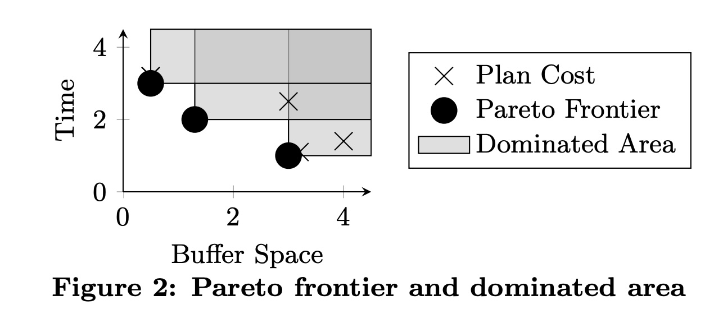

## AI论文解读 | Approximation Schemes for Many-Objective Query Optimization
        
### 作者        
digoal        
        
### 日期        
2025-10-10        
        
### 标签        
PostgreSQL , PolarDB , DuckDB , AI , 论文解读        
        
----        
        
## 背景  
      
https://arxiv.org/pdf/1404.0046        
  
提示:          
```          
读懂《Approximation Schemes for Many-Objective Query Optimization》这篇论文需要提前掌握哪些基础知识, 请使用中文通熟易懂的讲解这些基础知识, 可以引用论文中的图、表或使用Markdown支持的图形(text,mermaid等)增加解释性. 
  
使用中文通熟易懂的解读《Approximation Schemes for Many-Objective Query Optimization》这篇论文, 其中的关键内容请着重讲解, 可以引用论文中的图、表或使用Markdown支持的图形(text,mermaid等)增加解释性. 
  
提取《Approximation Schemes for Many-Objective Query Optimization》这篇论文中的重要术语, 使用中文对这些术语进行通熟易懂的讲解, 可以引用论文中的图、表或使用Markdown支持的图形(text,mermaid等)增加解释性. 
```     
  
## 1 前置知识 
  
好的，为了完全理解《Approximation Schemes for Many-Objective Query Optimization》这篇论文，您需要掌握以下三个核心领域的基础知识。我会用通俗易懂的语言，并结合论文中的图示来进行解释。

### 1\. 数据库查询优化 (Database Query Optimization) 基础

这是理解论文应用场景的基石。当您向数据库提交一条SQL查询语句时，您只是告诉数据库 **“你想要什么”** ，而数据库内部的“查询优化器”则需要找出最高效的方式来 **“如何获取这些数据”** 。

  * **执行计划 (Query Plan)**

      * **是什么**：执行计划是数据库为一条SQL查询制定出的详细执行步骤或“食谱”。例如，对于一个多表连接查询，是先连接A表和B表，再连接C表？还是先连接B表和C表？连接时用哪种算法（比如嵌套循环连接、哈希连接）？这些决策共同构成了一个执行计划。

      * **论文关联**：论文的目标就是从成千上万个可能的执行计划中，找出一个或一组“最好”的计划 。如下图3所示，用户偏好的改变（比如从“只关心执行时间”到“也关心内存占用”）会导致优化器选择完全不同的执行计划 。    

        *图3：针对TPC-H查询3，用户偏好的变化导致最优计划的演变。从(a)时间最优的哈希连接，到(b)为了节省内存而改用排序合并连接，再到(c)为了缩短启动时间而全部采用索引嵌套循环连接。*

  * **成本模型 (Cost Model)**

      * **是什么**：优化器如何判断哪个执行计划更好？它依赖一个“成本模型”来估算每个计划的执行成本。在传统数据库中，这个成本通常指**预估的执行时间**或I/O操作数 。
      * **论文关联**：这篇论文极大地扩展了成本模型的概念，不再只关心时间。它考虑了多达九个不同的成本维度（或称为“目标”），如执行时间、金钱花费、CPU负载、内存占用、结果精确度（元组丢失率）等 。

  * **最优性原理 (Principle of Optimality)**

      * **是什么**：这是经典查询优化算法（如Selinger算法）的理论基础 。它指出：一个最优的执行计划，其包含的子计划也必须是相应子任务的最优计划。简单说就是“最优的整体由最优的部分组成”。
      * **论文关联**：论文的一个关键论点是，当引入多个目标并通过“加权求和”来评估总成本时，这个经典的最优性原理就**失效**了 。论文中的**示例1**  清楚地说明了这一点：用一个加权成本更低的子计划p1'替换掉原来的子计划p1，反而导致整个计划p的加权总成本上升了。这揭示了多目标场景的复杂性，也是为什么不能简单套用传统优化算法的原因 。

### 2\. 多目标优化 (Multi-Objective Optimization) 概念

这是论文解决问题的核心理论框架。当存在多个相互冲突的目标时（例如，想让飞机速度快，又想让它省油），就不存在一个“完美”的唯一解，而需要在一系列“折中解”中进行选择。

  * **成本向量 (Cost Vector)**

      * **是什么**：由于有多个目标，每个执行计划的成本不再是一个单一数值，而是一个向量 。例如，一个计划的成本可能是 `(时间=2秒, 内存=3MB)`。
      * **论文关联**：论文中的所有图示都将执行计划表示为成本空间中的一个点。例如，下图1中，每个"X"都代表一个执行计划及其在“时间”和“缓冲区空间”两个维度上的成本 。    

  * **支配关系 (Dominance) 与 帕累托最优 (Pareto Optimality)**

      * **支配 (Dominance)**：如果计划A在**所有**目标上都不比计划B差，并且至少在一个目标上比B好，那么我们说“A支配B” 。被支配的计划（如B）显然是无用的，应该被丢弃。

      * **帕累托最优 (Pareto Optimal)**：一个计划如果没有被任何其他计划所支配，那它就是“帕累托最优”的 。所有帕累托最优的计划共同构成了“帕累托前沿 (Pareto Frontier)”。这些计划代表了所有可能的最佳“折中”方案。

      * **论文关联**：如下图2所示，黑点构成了帕累托前沿。任何落在灰色“被支配区域”的计划（如图中的"X"）都不是最优的 。论文中提到的精确算法（EXA）的目标就是完整地找出这个帕累托前沿 。但随着目标和表数量的增加，帕累托最优计划的数量会爆炸式增长，导致精确算法非常耗时 。    

        *图2：展示了帕累托前沿（黑点）和被支配的区域（灰色区域） 。*

  * **问题建模 (Problem Formulation)**

      * **加权模型 (Weighted MOQO)**：为每个目标分配一个权重，然后寻找加权总和最小的计划 。如下图1(a)所示，权重决定了“最优”的方向，最终找到的解是红线平移时第一个接触到的计划 。

      * **带约束的加权模型 (Bounded-Weighted MOQO)**：在加权的基础上，还增加了一些硬性约束，例如“时间不能超过2.8秒” 。如下图1(b)所示，原先的最优解因为超出了约束（虚线框），所以不再是可行解，优化器需要寻找在约束内的最优解 。    

        *图1：(a) 加权多目标查询优化 和 (b) 带约束的加权多目标查询优化 。*

### 3\. 算法复杂度与近似理论 (Algorithm Complexity & Approximation)

这是理解论文**为何要提出新算法**以及**如何评价新算法好坏**的关键。

  * **计算复杂度 (Computational Complexity)**

      * **是什么**：用于衡量一个算法需要多少计算资源（如时间、空间）的理论。
      * **论文关联**：论文通过理论分析和实验（图5）证明，精确算法（EXA）的时间和空间复杂度在多目标场景下高得不切实际 。优化一个查询可能需要数小时甚至更久 ，这在实际应用中是无法接受的。    

  * **近似算法 (Approximation Algorithm)**

      * **是什么**：既然找到精确的最优解太慢，我们可以退而求其次，设计一种算法，它能**快速地**找到一个 **“足够好”** 的解。
      * **论文关联**：这正是本篇论文的核心贡献 。论文提出了RTA和IRA两种近似算法，它们能在几秒钟内完成优化 。

  * **近似保证 (Approximation Guarantee)**

      * **是什么**：近似算法和纯粹的启发式算法（heuristic）不同，它必须提供一个“质量保证”。例如，一个 $\alpha$ -近似算法能保证它找到的解的成本，最坏也不会超过真正最优解成本的 $\alpha$ 倍 。 $\alpha$ 值越接近1，解的质量越高。

      * **论文关联**：论文提出的算法是“近似方案 (Approximation Scheme)”，意味着用户可以自由设定参数 $\alpha$ （ 论文中写为 $\alpha_U$ ）来权衡优化的速度和结果的精确度 。例如，用户可以设置 $\alpha=1.15$ ，表示“我愿意接受比最优解差15%以内的结果，来换取极快的优化速度”。

      * **近似支配 (Approximately Dominates)**：这是论文近似算法的核心思想。传统算法会丢弃被“严格支配”的计划，而论文的近似算法会丢弃被“近似支配”的计划 。如下图6所示，如果一个新计划的成本落入了现有计划的“近似支配区域”（浅灰色），即便它没有被严格支配，也会被丢弃，从而大大减少需要保留的计划数量 。    

        *图6：被支配区域（黑色）与近似支配区域（浅灰色）的对比 。*

### 总结

总而言之，要读懂这篇论文，您需要：

1.  **了解数据库优化的基本流程**：知道什么是执行计划、成本模型，以及经典优化理论的局限性。
2.  **掌握多目标优化的核心概念**：理解帕累托最优，即在冲突目标中寻找最佳“折中”方案。
3.  **理解近似算法的价值**：明白为什么需要近似解，以及如何通过“近似保证”来评价解的质量。

带着这些知识，您就能更好地理解论文的动机（精确算法太慢）、核心思想（用近似帕累托集代替完整集）以及其贡献（设计了有理论保证且高效的RTA和IRA算法）。
  
## 2 解读论文 
  
好的，这篇名为《多目标查询优化的近似方案》(Approximation Schemes for Many-Objective Query Optimization) 的论文，核心思想是解决一个在现代数据处理中日益重要的问题：**如何在有多个相互冲突的目标（如速度、成本、精度）时，快速地找到一个“足够好”的数据库查询执行方案。**

传统的数据库优化器通常只有一个目标：让查询执行得尽可能快。但在云计算、大数据等新场景下，我们可能还需要考虑其他因素：

  * **金钱成本**：在云上运行查询，使用的计算资源越多、时间越长，花费就越多 。
  * **资源消耗**：一个查询占用的CPU、内存、I/O带宽越少，系统就能同时为更多用户服务 。
  * **结果质量**：通过抽样可以加速查询，但这会牺牲结果的精确度 。

这些目标往往是相互冲突的，比如“又快又好又便宜”几乎不可能同时实现。因此，我们需要在这些目标之间做出权衡，这就是**多目标查询优化 (MOQO)**。

### 论文要解决的核心痛点：精确算法太慢，不切实际

在论文之前，已有多目标优化的算法，比如Ganguly等人提出的精确算法（论文中称为**EXA**） 。该算法理论上能找到所有最优的权衡方案（即“帕累托前沿”），但论文通过实验首次证明了它在多目标场景下的致命弱点：**速度太慢，以至于无法在实际中使用**。

**关键问题：帕累托计划 (Pareto Plans) 的数量爆炸**
在一个多目标问题中，不存在唯一的“最优解”，而是一系列代表不同最佳权衡的“帕累托最优解”。精确算法（EXA）需要为每一个中间步骤都保留所有可能的帕累托计划 。

论文通过在PostgreSQL数据库上实现的实验（见下图5）发现，哪怕只有3个目标，当查询涉及的表增加时，需要保留的帕累托计划数量、优化所需的时间和内存都呈爆炸式增长 。对于一个涉及8个表的TPC-H查询和9个目标，优化时间轻易就超过了论文设定的2小时超时上限，消耗的内存也达到GB级别 。    

*来源：论文图5 。该图显示，随着查询涉及的表数量（横轴）和目标数量（不同颜色的点）的增加，优化时间、内存消耗和帕累托计划数量都急剧上升。灰色标记表示该测试因超时（2小时）而未完成 。*

这个发现揭示了核心矛盾：**精确求解的计算成本高到无法接受** 。

### 论文的核心贡献：高效的近似算法

为了解决精确算法的性能瓶颈，论文提出了两种**近似算法 (Approximation Schemes)**，它们能在保证结果质量（即与最优解的差距在一个可控范围内）的前提下，将优化时间从数小时缩短到数秒 。

#### 1\. RTA算法 (Representative-Tradeoffs Algorithm) - 针对加权多目标问题

RTA算法适用于用户通过权重来表达偏好（例如，“时间的重要性是70%，金钱成本是30%”）的场景。

**核心思想：用“近似支配”代替“严格支配”**
精确算法（EXA）保留所有不会被其他计划“严格支配”的帕累托计划 。而RTA算法则放宽了这个条件：如果两个计划的成本向量“足够相似”，RTA就只保留其中一个作为**代表** 。

这个“足够相似”的程度由用户指定的近似参数 $\alpha$ 控制。如下图6所示，一个计划不仅会淘汰掉被它严格支配的计划（黑色区域），还会淘汰掉与它足够接近、落入“近似支配区域”（浅灰色区域）的计划 。    


通过这种方式，RTA需要保留和比较的计划数量大大减少，从而极大地提升了优化速度 。

**理论基础：最优性近似原理 (Principle of Near-Optimality, PONO)**
为了保证这种近似不会导致最终结果太差，论文发现并证明了绝大多数查询成本函数都满足一个重要性质——PONO 。通俗地讲，这个原理保证了：**如果一个大计划的各个子计划都只是“近似最优”的（比如成本比最优子计划高了10%），那么由它们组合成的大计划的成本，最多也只会比最优大计划高出大约10%，而不会无限偏离** 。这个原理是RTA算法能够提供质量保证的理论基石 。

#### 2\. IRA算法 (Iterative-Refinement Algorithm) - 针对带约束的多目标问题

IRA算法比RTA更强大，它能处理带有硬性约束的场景（例如，“执行时间必须少于5秒，且预算不能超过10美元”）。

**核心思想：迭代优化，逐步求精**
直接用一个固定的近似参数 $\alpha$ 可能会导致问题：一个近似计划A可能因为成本略微超出了约束而被丢弃，而它所代表的那个真正满足约束的最优计划B也因此被错过 。    

*来源：论文图8 。图中，带圆圈的“X”是近似帕累托前沿。如果边界设在Time=2.5，那么唯一满足条件的计划（右下角的X）可能会因为被近似计划（带圆圈的X）所代表而被错误地丢弃，导致算法找不到任何满足条件的解。*

IRA算法通过一个迭代过程来解决这个问题 ：

1.  **从粗略近似开始**：使用一个较大的 $\alpha$ 值（ 例如 $\alpha=2$ ）快速进行一轮优化 。
2.  **检查并求精**：检查当前找到的最佳计划是否能**保证**满足最终的近似要求。如果不能，就减小 $\alpha$ 值（ 比如变为 $\alpha=1.5$ ），让近似更精细，然后重新优化 。
3.  **循环直至满足条件**：重复上述过程，直到算法能够确认当前找到的计划已经是在用户指定的近似精度 $\alpha_U$ 内的最优解 。

IRA通过这种由粗到精的策略，避免了一开始就使用过于精细（从而耗时）的近似，同时又能确保最终结果的可靠性。

### 实验结果：压倒性的性能优势

论文最后通过详尽的实验对比了EXA、RTA和IRA算法。结果非常显著：

  * **速度提升**：在EXA需要数小时甚至超时的情况下，RTA和IRA通常在几秒到几十秒内就能找到高质量的近似解 。例如，对于TPC-H查询2和9个目标，EXA在所有测试用例中都超时（2小时），而RTA（ $\alpha=1.15$ ）的平均优化时间不到1.5秒 。
  * **结果质量**：尽管是近似算法，但它们在实践中找到的计划成本与最优解非常接近。即使是 $\alpha=2$ 的粗略近似，生成的计划平均成本开销也常常低于1%，远比理论上的最坏情况要好 。

*来源：论文图9 。图中对比了不同算法的优化时间（左上）、超时百分比（左下）、内存占用（右上）和结果质量（右下）。可以看出，RTA系列算法（蓝色、绿色、紫色）在时间和内存上远优于EXA（红色），且结果成本（Cost Overhead）非常低。*

### 结论

这篇论文的贡献是里程碑式的。它不仅**首次系统性地揭示了精确多目标查询优化的性能瓶颈**，更重要的是，它 **提供了一套切实可行的近似算法（RTA和IRA）** ，这些算法设计巧妙、有坚实的理论保证，并通过实验证明了其在速度和结果质量上的巨大优势。这使得曾经停留在理论层面的多目标查询优化，真正具备了在实际数据库系统中应用的潜力。
  
## 3 术语 
  
好的，这篇论文《Approximation Schemes for Many-Objective Query Optimization》中包含了一些数据库和算法领域的关键术语。为了帮助您更好地理解，我将用通俗易懂的中文对它们进行讲解，并引用论文中的图示来辅助说明。

-----

### 1\. 多目标查询优化 (Multi-Objective Query Optimization, MOQO)

  * **讲解**：
    这是整篇论文要解决的核心问题。传统的数据库查询优化通常只有一个目标：**让查询执行时间最短** 。但在现代应用中（例如云计算），我们往往需要同时考虑多个相互冲突的目标，比如：

      * **最小化执行时间**（快）
      * **最小化金钱成本**（省钱）
      * **最小化资源消耗**（如CPU、内存）
      * **最大化结果精度**（准）

    MOQO的目标就是在这些相互矛盾的目标之间找到一个最佳的“折中”或“权衡”方案 。

### 2\. 查询计划 (Query Plan)

  * **讲解**：
    查询计划是数据库为执行一条SQL查询而制定出的详细步骤“蓝图”或“食谱”。例如，对于一个连接三张表的查询，是先连接A和B，还是先连接B和C？连接时使用哪种算法（哈希连接、嵌套循环连接等）？每一种选择都构成一个不同的查询计划，而不同的计划在各个目标（时间、成本等）上的表现也大相径庭。优化器的任务就是从成千上万个可能的计划中选出最好的一个。

      * **图示解释**：论文的图3生动地展示了这一点。用户的偏好（目标）一变，最优的查询计划也跟着改变。    

        *来源：论文图3。从(a)只关心时间，到(b)也关心内存占用，再到(c)对启动时间有要求，最优的查询计划从哈希连接一步步演变成了索引嵌套循环连接 。*

### 3\. 成本向量 (Cost Vector)

  * **讲解**：
    由于我们关心多个目标，所以每个查询计划的“成本”不再是一个单一的数值（比如“5秒”），而是一个包含了所有目标成本的**向量**。例如，一个计划的成本向量可能是 `(时间: 2秒, 缓冲区空间: 3MB)`。在多维成本空间中，每个计划就对应一个点。

      * **图示解释**：论文的图1和图2中，每一个 "X" 标记就代表一个查询计划的成本向量。     

        *来源：论文图1。该图展示了在“时间”和“缓冲区空间”两个目标维度下，不同查询计划（X）的成本分布 。*

### 4\. 帕累托最优 / 帕累托前沿 (Pareto Optimality / Pareto Frontier)

  * **讲解**：
    这是多目标优化中的核心概念。
      * **帕累托最优**：一个计划是帕累托最优的，指的是**不存在**任何其他计划能在**所有目标上**都比它好或与它持平，并且至少在一个目标上严格比它好。换句话说，帕累托最优的计划都是无法再被改进的“优良权衡解”，你要想让它在一个目标上变得更好，就必须牺牲另一个目标。

      * **帕累托前沿**：所有帕累托最优计划的成本向量集合，就构成了“帕累托前沿”。

      * **图示解释**：论文的图2清晰地展示了帕累托前沿。   

        *来源：论文图2。图中的黑点构成了帕累托前沿 。任何落在它们所形成的灰色“被支配区域”内的计划，都不是最优的，因为总能找到一个黑点计划在所有方面都更好或持平 。*

### 5\. 支配 (Dominance)

  * **讲解**：
    这是用来比较两个计划优劣的规则。
      * **严格支配 (Strictly Dominates)**：如果计划A在所有目标上都不比计划B差，且至少在一个目标上严格优于计划B，我们就说“A严格支配B”。被支配的计划（B）是无用的，可以直接丢弃。精确算法（EXA）就是基于这个规则进行剪枝的。

      * **近似支配 (Approximately Dominates)**：这是本篇论文提出的核心创新。指的是计划A的成本在每个维度上最多只比计划B差一点点（例如，差 α 倍）。如果计划A近似支配计划B，那么在近似算法中，我们也可以认为B是“足够好”的，从而进行剪枝。这极大地减少了需要保留的计划数量。

      * **图示解释**：论文的图6对比了两种支配关系。   

        *来源：论文图6。图中展示了一个计划不仅支配了黑色区域，还“近似支配”了浅灰色区域 。落在浅灰色区域的计划虽然没有被严格支配，但在近似算法中也可能被淘汰。*

### 6\. 近似方案 (Approximation Scheme)

  * **讲解**：
    由于找到精确的帕累托前沿太耗时了，论文提出了一种退而求其次的策略。近似方案是一种算法，它不追求找到绝对最优的解，而是承诺能**快速**找到一个 **“足够好”** 的解。这个“足够好”的程度是有数学保证的，由一个用户可以调节的参数 α (alpha) 控制。例如，当 α=1.15 时，算法保证找到的解的加权成本最多比最优解差15% 。用户可以在**优化速度**和 **解的精确度** 之间做出权衡。

### 7\. 最优性近似原理 (Principle of Near-Optimality, PONO)

  * **讲解**：
    这是论文提出的近似算法（RTA）能够成立的**理论基石** 。传统的“最优性原理”说的是：最优的整体由最优的部分构成。而PONO则将其扩展到近似场景：**如果一个大计划的各个子计划都只是“近似最优”的（比如成本比它们各自的最优方案高了 α 倍），那么由它们组合成的大计划，其成本最多也只会比真正最优的大计划高出 α 倍** 。这个性质保证了在每一步都使用近似解，最终的累积误差不会失控。

### 8\. RTA 和 IRA 算法

  * **讲解**：
    这是论文提出的两种具体的近似方案。
      * **RTA (Representative-Tradeoffs Algorithm)**：代表性权衡算法。它通过“近似支配”规则，为一大批成本相似的帕累托计划只保留一个“代表”，从而大大提升效率。它主要用于解决**加权多目标问题**（即用户通过权重表达偏好）。
      * **IRA (Iterative-Refinement Algorithm)**：迭代求精算法。它通过一个从粗到精的迭代过程来寻找近似解，能够处理更复杂的**带约束的多目标问题**（例如，时间必须\<5秒，成本必须\<10美元）。它在每次迭代中调用RTA，并不断调整近似精度，直到找到满足条件的解。
  
## 参考        
         
https://arxiv.org/pdf/1404.0046    
        
<b> 以上内容基于DeepSeek、Qwen、Gemini及诸多AI生成, 轻微人工调整, 感谢杭州深度求索人工智能、阿里云、Google等公司. </b>        
        
<b> AI 生成的内容请自行辨别正确性, 当然也多了些许踩坑的乐趣, 毕竟冒险是每个男人的天性.  </b>        
  
    
#### [期望 PostgreSQL|开源PolarDB 增加什么功能?](https://github.com/digoal/blog/issues/76 "269ac3d1c492e938c0191101c7238216")
  
  
#### [PolarDB 开源数据库](https://openpolardb.com/home "57258f76c37864c6e6d23383d05714ea")
  
  
#### [PolarDB 学习图谱](https://www.aliyun.com/database/openpolardb/activity "8642f60e04ed0c814bf9cb9677976bd4")
  
  
#### [PostgreSQL 解决方案集合](../201706/20170601_02.md "40cff096e9ed7122c512b35d8561d9c8")
  
  
#### [德哥 / digoal's Github - 公益是一辈子的事.](https://github.com/digoal/blog/blob/master/README.md "22709685feb7cab07d30f30387f0a9ae")
  
  
#### [About 德哥](https://github.com/digoal/blog/blob/master/me/readme.md "a37735981e7704886ffd590565582dd0")
  
  

  
